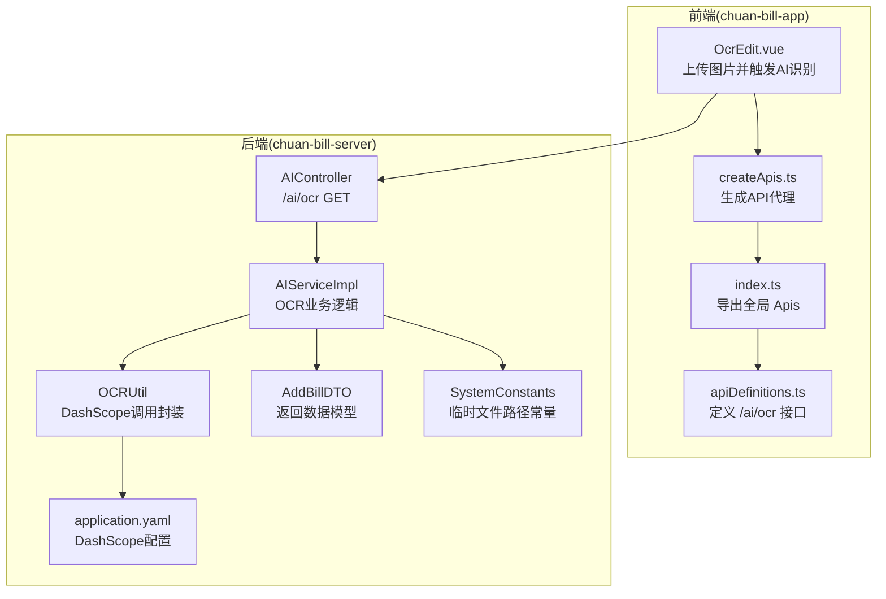
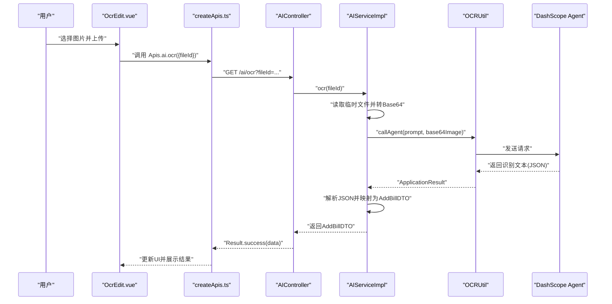
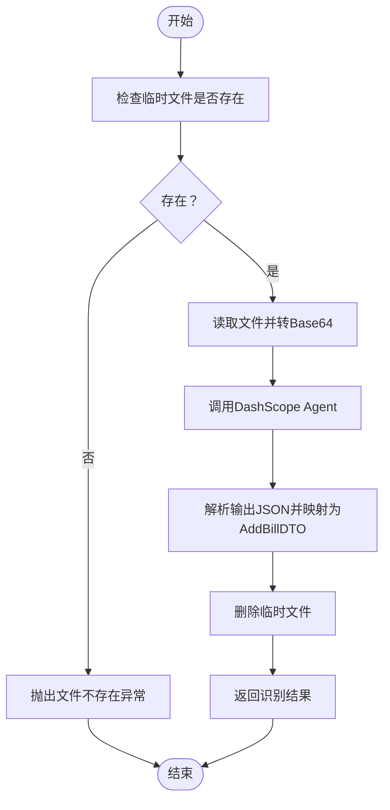
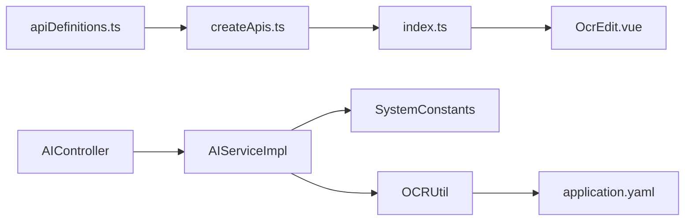

# AI智能接口

<cite>
**本文引用的文件**
- [AIController.java](file://chuan-bill-server/src/main/java/com/samoy/chuanbillserver/controller/AIController.java)
- [IAIService.java](file://chuan-bill-server/src/main/java/com/samoy/chuanbillserver/service/IAIService.java)
- [AIServiceImpl.java](file://chuan-bill-server/src/main/java/com/samoy/chuanbillserver/service/impl/AIServiceImpl.java)
- [OCRUtil.java](file://chuan-bill-server/src/main/java/com/samoy/chuanbillserver/utils/OCRUtil.java)
- [SystemConstants.java](file://chuan-bill-server/src/main/java/com/samoy/chuanbillserver/constant/SystemConstants.java)
- [application.yaml](file://chuan-bill-server/src/main/resources/application.yaml)
- [AddBillDTO.java](file://chuan-bill-server/src/main/java/com/samoy/chuanbillserver/dto/AddBillDTO.java)
- [Result.java](file://chuan-bill-server/src/main/java/com/samoy/chuanbillserver/result/Result.java)
- [ResultEnum.java](file://chuan-bill-server/src/main/java/com/samoy/chuanbillserver/result/ResultEnum.java)
- [BusinessException.java](file://chuan-bill-server/src/main/java/com/samoy/chuanbillserver/expection/BusinessException.java)
- [apiDefinitions.ts](file://chuan-bill-app/src/api/apiDefinitions.ts)
- [createApis.ts](file://chuan-bill-app/src/api/createApis.ts)
- [index.ts](file://chuan-bill-app/src/api/index.ts)
- [OcrEdit.vue](file://chuan-bill-app/src/pages/bill/components/OcrEdit.vue)
</cite>

## 目录
1. [简介](#简介)
2. [项目结构](#项目结构)
3. [核心组件](#核心组件)
4. [架构总览](#架构总览)
5. [详细组件分析](#详细组件分析)
6. [依赖分析](#依赖分析)
7. [性能考虑](#性能考虑)
8. [故障排查指南](#故障排查指南)
9. [结论](#结论)
10. [附录](#附录)

## 简介
本文件面向“AI智能接口”的完整API文档，聚焦于OCR文字识别、语音输入、智能建议等AI能力在记账场景中的设计与实现。当前仓库中已实现并可直接使用的AI能力为“OCR图片账单识别”，用于从图片中抽取账单名称、金额、时间、类别、支付方式等关键字段，并返回标准化的账单数据模型，便于快速录入系统。

- OCR识别接口：通过上传图片到临时目录，由后端读取图片并调用DashScope应用（OCR Agent）解析，返回结构化账单数据。
- 语音输入与智能建议：当前代码库未发现语音转文字或智能记账建议的具体实现；后续如需扩展，可在现有OCR接口基础上增加新的AI服务入口与前端交互组件。

## 项目结构
AI相关能力跨越前端与后端两部分：
- 前端负责图片上传、调用AI接口、展示识别结果与失败提示。
- 后端负责接收请求、读取临时文件、调用OCR工具类、解析DashScope返回结果并返回统一响应体。

图表来源
- [OcrEdit.vue:1-167](file://chuan-bill-app/src/pages/bill/components/OcrEdit.vue#L1-L167)
- [createApis.ts:1-95](file://chuan-bill-app/src/api/createApis.ts#L1-L95)
- [index.ts:1-19](file://chuan-bill-app/src/api/index.ts#L1-L19)
- [apiDefinitions.ts:1-38](file://chuan-bill-app/src/api/apiDefinitions.ts#L1-L38)
- [AIController.java:1-26](file://chuan-bill-server/src/main/java/com/samoy/chuanbillserver/controller/AIController.java#L1-L26)
- [AIServiceImpl.java:1-52](file://chuan-bill-server/src/main/java/com/samoy/chuanbillserver/service/impl/AIServiceImpl.java#L1-L52)
- [OCRUtil.java:1-37](file://chuan-bill-server/src/main/java/com/samoy/chuanbillserver/utils/OCRUtil.java#L1-L37)
- [application.yaml:41-51](file://chuan-bill-server/src/main/resources/application.yaml#L41-L51)
- [AddBillDTO.java:1-44](file://chuan-bill-server/src/main/java/com/samoy/chuanbillserver/dto/AddBillDTO.java#L1-L44)
- [SystemConstants.java:30-34](file://chuan-bill-server/src/main/java/com/samoy/chuanbillserver/constant/SystemConstants.java#L30-L34)

章节来源
- [AIController.java:1-26](file://chuan-bill-server/src/main/java/com/samoy/chuanbillserver/controller/AIController.java#L1-L26)
- [AIServiceImpl.java:1-52](file://chuan-bill-server/src/main/java/com/samoy/chuanbillserver/service/impl/AIServiceImpl.java#L1-L52)
- [OCRUtil.java:1-37](file://chuan-bill-server/src/main/java/com/samoy/chuanbillserver/utils/OCRUtil.java#L1-L37)
- [application.yaml:41-51](file://chuan-bill-server/src/main/resources/application.yaml#L41-L51)
- [AddBillDTO.java:1-44](file://chuan-bill-server/src/main/java/com/samoy/chuanbillserver/dto/AddBillDTO.java#L1-L44)
- [SystemConstants.java:30-34](file://chuan-bill-server/src/main/java/com/samoy/chuanbillserver/constant/SystemConstants.java#L30-L34)
- [apiDefinitions.ts:36-36](file://chuan-bill-app/src/api/apiDefinitions.ts#L36-L36)
- [OcrEdit.vue:27-69](file://chuan-bill-app/src/pages/bill/components/OcrEdit.vue#L27-L69)

## 核心组件
- AI控制器：提供 /ai/ocr 接口，接收临时文件ID，调用服务层执行OCR识别并返回统一结果包装。
- 服务实现：读取临时文件、构造Base64图像数据、调用DashScope Agent、解析JSON并返回AddBillDTO。
- OCR工具：封装DashScope SDK调用，读取配置项（API Key、App Id），构建请求参数并发起调用。
- 数据模型：AddBillDTO定义了账单名称、类别、支付方式、类型、金额、时间、备注、来源等字段及校验规则。
- 统一响应：Result封装通用响应结构；ResultEnum定义业务错误码；BusinessException用于抛出带错误码的业务异常。

章节来源
- [AIController.java:20-24](file://chuan-bill-server/src/main/java/com/samoy/chuanbillserver/controller/AIController.java#L20-L24)
- [AIServiceImpl.java:27-50](file://chuan-bill-server/src/main/java/com/samoy/chuanbillserver/service/impl/AIServiceImpl.java#L27-L50)
- [OCRUtil.java:22-35](file://chuan-bill-server/src/main/java/com/samoy/chuanbillserver/utils/OCRUtil.java#L22-L35)
- [AddBillDTO.java:10-44](file://chuan-bill-server/src/main/java/com/samoy/chuanbillserver/dto/AddBillDTO.java#L10-L44)
- [Result.java:12-49](file://chuan-bill-server/src/main/java/com/samoy/chuanbillserver/result/Result.java#L12-L49)
- [ResultEnum.java:6-56](file://chuan-bill-server/src/main/java/com/samoy/chuanbillserver/result/ResultEnum.java#L6-L56)
- [BusinessException.java:6-36](file://chuan-bill-server/src/main/java/com/samoy/chuanbillserver/expection/BusinessException.java#L6-L36)

## 架构总览
AI识别流程自上而下分为三层：前端交互层、后端控制层、AI服务层（DashScope）。前端上传图片后，后端读取临时文件并调用DashScope Agent解析，最终返回结构化的账单数据。

图表来源
- [OcrEdit.vue:27-69](file://chuan-bill-app/src/pages/bill/components/OcrEdit.vue#L27-L69)
- [createApis.ts:31-62](file://chuan-bill-app/src/api/createApis.ts#L31-L62)
- [AIController.java:20-24](file://chuan-bill-server/src/main/java/com/samoy/chuanbillserver/controller/AIController.java#L20-L24)
- [AIServiceImpl.java:28-50](file://chuan-bill-server/src/main/java/com/samoy/chuanbillserver/service/impl/AIServiceImpl.java#L28-L50)
- [OCRUtil.java:22-35](file://chuan-bill-server/src/main/java/com/samoy/chuanbillserver/utils/OCRUtil.java#L22-L35)

## 详细组件分析

### OCR识别接口（/ai/ocr）
- 接口定义：GET /ai/ocr，参数为临时文件ID（fileId）。
- 前端调用：OcrEdit.vue在上传成功后读取临时文件ID并调用 Apis.ai.ocr，根据返回状态切换UI状态。
- 后端处理：
  - 控制器直接委托服务层执行OCR。
  - 服务层先检查临时文件是否存在，存在则读取并编码为Base64，再调用DashScope Agent。
  - 解析返回的JSON文本，提取result节点并映射为AddBillDTO。
  - 成功后删除临时文件，失败时抛出业务异常。
- 返回值：Result.success(data)，其中data为AddBillDTO。

图表来源
- [AIServiceImpl.java:28-50](file://chuan-bill-server/src/main/java/com/samoy/chuanbillserver/service/impl/AIServiceImpl.java#L28-L50)
- [SystemConstants.java:30-34](file://chuan-bill-server/src/main/java/com/samoy/chuanbillserver/constant/SystemConstants.java#L30-L34)
- [ResultEnum.java:41-41](file://chuan-bill-server/src/main/java/com/samoy/chuanbillserver/result/ResultEnum.java#L41-L41)

章节来源
- [AIController.java:20-24](file://chuan-bill-server/src/main/java/com/samoy/chuanbillserver/controller/AIController.java#L20-L24)
- [AIServiceImpl.java:27-50](file://chuan-bill-server/src/main/java/com/samoy/chuanbillserver/service/impl/AIServiceImpl.java#L27-L50)
- [OcrEdit.vue:27-69](file://chuan-bill-app/src/pages/bill/components/OcrEdit.vue#L27-L69)
- [apiDefinitions.ts:36-36](file://chuan-bill-app/src/api/apiDefinitions.ts#L36-L36)

### 数据模型：AddBillDTO
- 字段说明（节选）：
  - 名称：必填，长度限制。
  - 类别ID：必填，标识分类。
  - 支付方式ID：可选。
  - 类型：必填，仅允许 income 或 expense。
  - 金额：必填，数值校验，最多10位整数+2位小数。
  - 时间：必填，格式为 yyyy-MM-dd HH:mm。
  - 备注：可选，长度限制。
  - 来源：可选，允许 manual、ocr、voice。
- 用途：作为OCR识别结果的标准化载体，供前端展示与后续账单创建使用。

章节来源
- [AddBillDTO.java:10-44](file://chuan-bill-server/src/main/java/com/samoy/chuanbillserver/dto/AddBillDTO.java#L10-L44)

### 统一响应与错误码
- 统一响应：Result包含code、message、data、timestamp，提供success与error静态工厂方法。
- 错误枚举：ResultEnum定义了通用错误码与业务错误码（如BILL_OCR_FAILED、FILE_NOT_FOUND）。
- 业务异常：BusinessException携带错误码，便于在服务层抛出并被全局异常处理器捕获。

章节来源
- [Result.java:12-49](file://chuan-bill-server/src/main/java/com/samoy/chuanbillserver/result/Result.java#L12-L49)
- [ResultEnum.java:6-56](file://chuan-bill-server/src/main/java/com/samoy/chuanbillserver/result/ResultEnum.java#L6-L56)
- [BusinessException.java:6-36](file://chuan-bill-server/src/main/java/com/samoy/chuanbillserver/expection/BusinessException.java#L6-L36)

### DashScope集成与配置
- 配置项：application.yaml中定义了dashscope.apiKey与dashscope.ocr.appId，供OCRUtil读取。
- 调用封装：OCRUtil基于DashScope SDK构建ApplicationParam，设置prompt、images、hasThoughts等参数并发起调用。
- 前端密钥：OcrEdit.vue中使用了固定的token头（仅为演示目的，实际应从后端鉴权体系获取）。

章节来源
- [application.yaml:48-51](file://chuan-bill-server/src/main/resources/application.yaml#L48-L51)
- [OCRUtil.java:16-35](file://chuan-bill-server/src/main/java/com/samoy/chuanbillserver/utils/OCRUtil.java#L16-L35)
- [OcrEdit.vue:80-83](file://chuan-bill-app/src/pages/bill/components/OcrEdit.vue#L80-L83)

### 前端API生成与调用
- API定义：apiDefinitions.ts中声明ai.ocr接口。
- 动态生成：createApis.ts根据apiDefinitions.ts生成可调用的 Apis 对象。
- 使用示例：OcrEdit.vue在上传成功后调用 Apis.ai.ocr 并处理状态与错误。

章节来源
- [apiDefinitions.ts:36-36](file://chuan-bill-app/src/api/apiDefinitions.ts#L36-L36)
- [createApis.ts:31-62](file://chuan-bill-app/src/api/createApis.ts#L31-L62)
- [index.ts:14-18](file://chuan-bill-app/src/api/index.ts#L14-L18)
- [OcrEdit.vue:32-49](file://chuan-bill-app/src/pages/bill/components/OcrEdit.vue#L32-L49)

## 依赖分析
- 前端依赖
  - Apis对象由createApis.ts动态生成，基于apiDefinitions.ts的接口定义。
  - OcrEdit.vue依赖Apisi.ocr接口与上传组件，负责UI状态管理与错误提示。
- 后端依赖
  - AIController依赖IAIService接口，具体实现为AIServiceImpl。
  - AIServiceImpl依赖OCRUtil与SystemConstants，前者封装DashScope调用，后者提供临时文件路径。
  - OCRUtil依赖application.yaml中的配置项。

图表来源
- [apiDefinitions.ts:19-38](file://chuan-bill-app/src/api/apiDefinitions.ts#L19-L38)
- [createApis.ts:65-76](file://chuan-bill-app/src/api/createApis.ts#L65-L76)
- [index.ts:14-18](file://chuan-bill-app/src/api/index.ts#L14-L18)
- [OcrEdit.vue:1-167](file://chuan-bill-app/src/pages/bill/components/OcrEdit.vue#L1-L167)
- [AIController.java:1-26](file://chuan-bill-server/src/main/java/com/samoy/chuanbillserver/controller/AIController.java#L1-L26)
- [AIServiceImpl.java:1-52](file://chuan-bill-server/src/main/java/com/samoy/chuanbillserver/service/impl/AIServiceImpl.java#L1-L52)
- [OCRUtil.java:1-37](file://chuan-bill-server/src/main/java/com/samoy/chuanbillserver/utils/OCRUtil.java#L1-L37)
- [application.yaml:41-51](file://chuan-bill-server/src/main/resources/application.yaml#L41-L51)

章节来源
- [apiDefinitions.ts:19-38](file://chuan-bill-app/src/api/apiDefinitions.ts#L19-L38)
- [createApis.ts:65-76](file://chuan-bill-app/src/api/createApis.ts#L65-L76)
- [index.ts:14-18](file://chuan-bill-app/src/api/index.ts#L14-L18)
- [OcrEdit.vue:1-167](file://chuan-bill-app/src/pages/bill/components/OcrEdit.vue#L1-L167)
- [AIController.java:1-26](file://chuan-bill-server/src/main/java/com/samoy/chuanbillserver/controller/AIController.java#L1-L26)
- [AIServiceImpl.java:1-52](file://chuan-bill-server/src/main/java/com/samoy/chuanbillserver/service/impl/AIServiceImpl.java#L1-L52)
- [OCRUtil.java:1-37](file://chuan-bill-server/src/main/java/com/samoy/chuanbillserver/utils/OCRUtil.java#L1-L37)
- [application.yaml:41-51](file://chuan-bill-server/src/main/resources/application.yaml#L41-L51)

## 性能考虑
- 临时文件清理：识别成功后立即删除临时文件，避免磁盘占用累积。
- 图像编码：将二进制文件读取后以Base64形式传递给DashScope，注意大图可能导致内存与网络开销上升，建议在前端做压缩与尺寸控制。
- 异步与并发：当前实现为同步阻塞调用，若并发量较大，建议引入队列或异步任务，配合轮询或回调通知。
- 缓存与降级：可对热点识别结果做本地缓存；当DashScope不可用时，返回兜底提示并记录日志以便人工干预。
- 监控与告警：建议埋点识别耗时、成功率、失败原因分布，结合日志系统建立阈值告警。

## 故障排查指南
- 常见问题与定位
  - 文件不存在：当fileId对应的临时文件缺失时，服务端抛出“文件不存在”异常。
  - OCR失败：DashScope缺少API Key或输入参数不合法时，抛出“账单OCR识别失败”异常。
  - 前端上传失败：OcrEdit.vue在上传成功回调中未拿到临时文件信息时，会提示上传失败。
- 建议排查步骤
  - 检查application.yaml中的DashScope配置是否正确注入。
  - 确认临时文件目录与权限，确保服务端可读写。
  - 查看服务端日志，关注OCRUtil的请求参数与返回内容。
  - 在前端控制台查看Apis.ai.ocr的返回状态与错误信息。
- 降级与恢复
  - 当DashScope服务不可用时，前端显示“识别失败，请重试或手动输入”，引导用户手动录入。
  - 后端可记录失败次数与原因，达到阈值后自动切换到备用策略或通知运维。

章节来源
- [ResultEnum.java:41-41](file://chuan-bill-server/src/main/java/com/samoy/chuanbillserver/result/ResultEnum.java#L41-L41)
- [BusinessException.java:6-36](file://chuan-bill-server/src/main/java/com/samoy/chuanbillserver/expection/BusinessException.java#L6-L36)
- [AIServiceImpl.java:31-33](file://chuan-bill-server/src/main/java/com/samoy/chuanbillserver/service/impl/AIServiceImpl.java#L31-L33)
- [OcrEdit.vue:116-132](file://chuan-bill-app/src/pages/bill/components/OcrEdit.vue#L116-L132)

## 结论
当前AI智能接口以OCR图片识别为核心，实现了从图片到结构化账单数据的闭环。其架构清晰、职责分离明确：前端负责上传与交互，后端负责业务编排与第三方服务对接，统一响应与错误处理保证了系统的稳定性。对于语音输入与智能建议等扩展能力，可在现有接口与组件基础上平滑接入，遵循相同的配置、调用与错误处理模式。

## 附录
- API定义位置
  - 前端：ai.ocr 接口定义位于 [apiDefinitions.ts:36-36](file://chuan-bill-app/src/api/apiDefinitions.ts#L36-L36)
  - 后端：/ai/ocr 控制器位于 [AIController.java:20-24](file://chuan-bill-server/src/main/java/com/samoy/chuanbillserver/controller/AIController.java#L20-L24)
- 关键实现位置
  - OCR服务实现：[AIServiceImpl.java:27-50](file://chuan-bill-server/src/main/java/com/samoy/chuanbillserver/service/impl/AIServiceImpl.java#L27-L50)
  - OCR工具封装：[OCRUtil.java:22-35](file://chuan-bill-server/src/main/java/com/samoy/chuanbillserver/utils/OCRUtil.java#L22-L35)
  - 数据模型：[AddBillDTO.java:10-44](file://chuan-bill-server/src/main/java/com/samoy/chuanbillserver/dto/AddBillDTO.java#L10-L44)
  - 统一响应与错误码：[Result.java:12-49](file://chuan-bill-server/src/main/java/com/samoy/chuanbillserver/result/Result.java#L12-L49)、[ResultEnum.java:6-56](file://chuan-bill-server/src/main/java/com/samoy/chuanbillserver/result/ResultEnum.java#L6-L56)
  - 配置项：[application.yaml:48-51](file://chuan-bill-server/src/main/resources/application.yaml#L48-L51)
  - 前端调用示例：[OcrEdit.vue:27-69](file://chuan-bill-app/src/pages/bill/components/OcrEdit.vue#L27-L69)