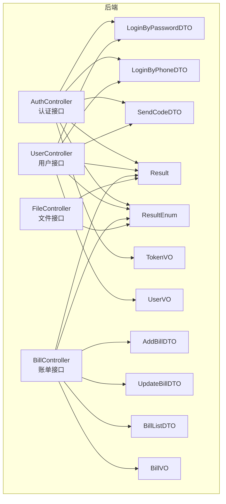
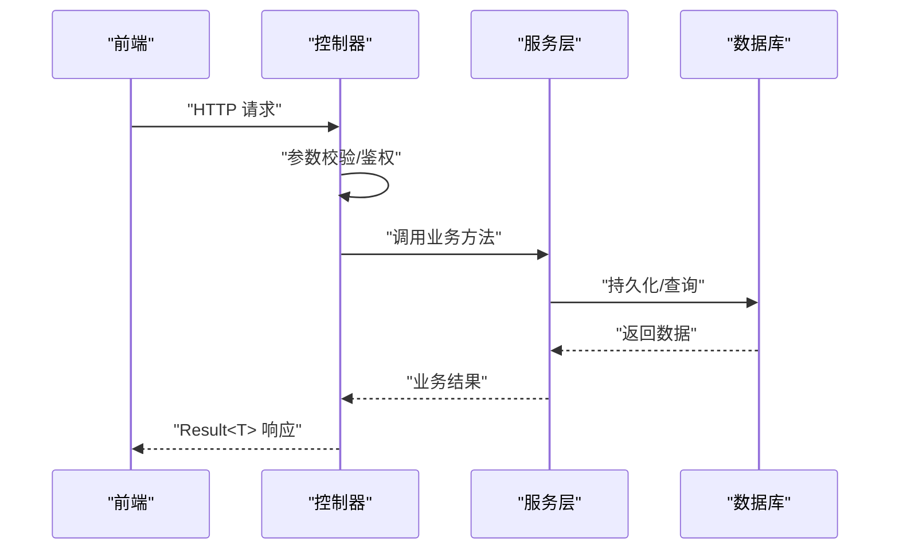
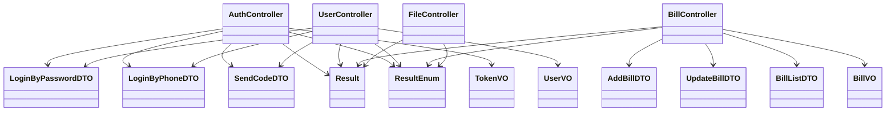

# API接口文档

<cite>
**本文引用的文件**
- [AuthController.java](file://chuan-bill-server/src/main/java/com/samoy/chuanbillserver/controller/AuthController.java)
- [UserController.java](file://chuan-bill-server/src/main/java/com/samoy/chuanbillserver/controller/UserController.java)
- [BillController.java](file://chuan-bill-server/src/main/java/com/samoy/chuanbillserver/controller/BillController.java)
- [FileController.java](file://chuan-bill-server/src/main/java/com/samoy/chuanbillserver/controller/FileController.java)
- [LoginByPasswordDTO.java](file://chuan-bill-server/src/main/java/com/samoy/chuanbillserver/dto/LoginByPasswordDTO.java)
- [LoginByPhoneDTO.java](file://chuan-bill-server/src/main/java/com/samoy/chuanbillserver/dto/LoginByPhoneDTO.java)
- [SendCodeDTO.java](file://chuan-bill-server/src/main/java/com/samoy/chuanbillserver/dto/SendCodeDTO.java)
- [AddBillDTO.java](file://chuan-bill-server/src/main/java/com/samoy/chuanbillserver/dto/AddBillDTO.java)
- [UpdateBillDTO.java](file://chuan-bill-server/src/main/java/com/samoy/chuanbillserver/dto/UpdateBillDTO.java)
- [BillListDTO.java](file://chuan-bill-server/src/main/java/com/samoy/chuanbillserver/dto/BillListDTO.java)
- [TokenVO.java](file://chuan-bill-server/src/main/java/com/samoy/chuanbillserver/vo/TokenVO.java)
- [UserVO.java](file://chuan-bill-server/src/main/java/com/samoy/chuanbillserver/vo/UserVO.java)
- [BillVO.java](file://chuan-bill-server/src/main/java/com/samoy/chuanbillserver/vo/BillVO.java)
- [Result.java](file://chuan-bill-server/src/main/java/com/samoy/chuanbillserver/result/Result.java)
- [ResultEnum.java](file://chuan-bill-server/src/main/java/com/samoy/chuanbillserver/result/ResultEnum.java)
</cite>

## 目录
1. [简介](#简介)
2. [项目结构](#项目结构)
3. [核心组件](#核心组件)
4. [架构总览](#架构总览)
5. [详细组件分析](#详细组件分析)
6. [依赖分析](#依赖分析)
7. [性能考虑](#性能考虑)
8. [故障排查指南](#故障排查指南)
9. [结论](#结论)
10. [附录](#附录)

## 简介
本文件为“小川记账”项目的完整API接口文档，覆盖认证与用户、账单管理、文件上传等核心业务接口。文档遵循RESTful设计规范，明确HTTP方法、URL路径、请求参数、响应格式与状态码；同时给出认证授权机制、参数校验规则、错误码定义、异常处理策略，并提供接口测试与调试建议。

## 项目结构
后端采用Spring Boot工程，按功能模块划分控制器层（controller）、数据传输对象（DTO）、值对象（VO）、统一响应封装（Result/ResultEnum）与业务服务层（service）。前端为小程序/UniApp应用，通过 Alova/axios 等发起HTTP请求。

图表来源
- [AuthController.java:1-66](file://chuan-bill-server/src/main/java/com/samoy/chuanbillserver/controller/AuthController.java#L1-L66)
- [UserController.java:1-62](file://chuan-bill-server/src/main/java/com/samoy/chuanbillserver/controller/UserController.java#L1-L62)
- [BillController.java:1-91](file://chuan-bill-server/src/main/java/com/samoy/chuanbillserver/controller/BillController.java#L1-L91)
- [FileController.java:1-27](file://chuan-bill-server/src/main/java/com/samoy/chuanbillserver/controller/FileController.java#L1-L27)
- [LoginByPasswordDTO.java:1-19](file://chuan-bill-server/src/main/java/com/samoy/chuanbillserver/dto/LoginByPasswordDTO.java#L1-L19)
- [LoginByPhoneDTO.java:1-17](file://chuan-bill-server/src/main/java/com/samoy/chuanbillserver/dto/LoginByPhoneDTO.java#L1-L17)
- [SendCodeDTO.java:1-14](file://chuan-bill-server/src/main/java/com/samoy/chuanbillserver/dto/SendCodeDTO.java#L1-L14)
- [AddBillDTO.java:1-44](file://chuan-bill-server/src/main/java/com/samoy/chuanbillserver/dto/AddBillDTO.java#L1-L44)
- [UpdateBillDTO.java:1-39](file://chuan-bill-server/src/main/java/com/samoy/chuanbillserver/dto/UpdateBillDTO.java#L1-L39)
- [BillListDTO.java:1-42](file://chuan-bill-server/src/main/java/com/samoy/chuanbillserver/dto/BillListDTO.java#L1-L42)
- [TokenVO.java:1-21](file://chuan-bill-server/src/main/java/com/samoy/chuanbillserver/vo/TokenVO.java#L1-L21)
- [UserVO.java:1-41](file://chuan-bill-server/src/main/java/com/samoy/chuanbillserver/vo/UserVO.java#L1-L41)
- [BillVO.java:1-44](file://chuan-bill-server/src/main/java/com/samoy/chuanbillserver/vo/BillVO.java#L1-L44)
- [Result.java:1-50](file://chuan-bill-server/src/main/java/com/samoy/chuanbillserver/result/Result.java#L1-L50)
- [ResultEnum.java:1-56](file://chuan-bill-server/src/main/java/com/samoy/chuanbillserver/result/ResultEnum.java#L1-L56)

章节来源
- [AuthController.java:1-66](file://chuan-bill-server/src/main/java/com/samoy/chuanbillserver/controller/AuthController.java#L1-L66)
- [UserController.java:1-62](file://chuan-bill-server/src/main/java/com/samoy/chuanbillserver/controller/UserController.java#L1-L62)
- [BillController.java:1-91](file://chuan-bill-server/src/main/java/com/samoy/chuanbillserver/controller/BillController.java#L1-L91)
- [FileController.java:1-27](file://chuan-bill-server/src/main/java/com/samoy/chuanbillserver/controller/FileController.java#L1-L27)

## 核心组件
- 统一响应封装：Result<T> 提供统一的响应结构（code/message/data/timestamp），并内置success/error工厂方法。
- 错误码体系：ResultEnum 定义通用HTTP语义错误码与业务错误码（用户1xxx、账单2xxx、文件3xxx等）。
- 参数校验：各DTO使用Jakarta Validation注解实现请求参数的强约束，配合全局异常处理返回标准错误。
- 认证授权：基于Sa-Token的登录态校验，控制器中通过StpUtil.getLoginIdAsString()获取当前用户ID。

章节来源
- [Result.java:1-50](file://chuan-bill-server/src/main/java/com/samoy/chuanbillserver/result/Result.java#L1-L50)
- [ResultEnum.java:1-56](file://chuan-bill-server/src/main/java/com/samoy/chuanbillserver/result/ResultEnum.java#L1-L56)

## 架构总览
后端采用分层架构：控制器接收请求，调用服务层执行业务逻辑，返回统一响应。前端通过HTTP客户端调用后端接口，携带必要的认证信息。

图表来源
- [AuthController.java:1-66](file://chuan-bill-server/src/main/java/com/samoy/chuanbillserver/controller/AuthController.java#L1-L66)
- [UserController.java:1-62](file://chuan-bill-server/src/main/java/com/samoy/chuanbillserver/controller/UserController.java#L1-L62)
- [BillController.java:1-91](file://chuan-bill-server/src/main/java/com/samoy/chuanbillserver/controller/BillController.java#L1-L91)
- [FileController.java:1-27](file://chuan-bill-server/src/main/java/com/samoy/chuanbillserver/controller/FileController.java#L1-L27)

## 详细组件分析

### 认证与用户接口
- 接口分组：auth、user
- 鉴权方式：登录后返回token，后续接口需在请求头携带认证信息（具体字段以实际配置为准）
- 关键接口
  - POST /auth/loginByPassword：手机号+密码登录
  - POST /auth/loginByPhone：手机号+验证码登录
  - POST /auth/sendCode：发送短信验证码
  - GET /user/profile：获取当前用户资料
  - POST /user/updateProfile：更新用户资料
  - POST /user/updatePasswordByOld：旧密码修改密码
  - POST /user/updatePasswordByCode：验证码修改密码（无需登录）
  - GET /user/hasPassword：检查是否设置密码

请求参数与响应示例
- 登录请求参数：LoginByPasswordDTO、LoginByPhoneDTO、SendCodeDTO
- 登录响应：TokenVO（token、expireTime、userId、nickname）

章节来源
- [AuthController.java:1-66](file://chuan-bill-server/src/main/java/com/samoy/chuanbillserver/controller/AuthController.java#L1-L66)
- [UserController.java:1-62](file://chuan-bill-server/src/main/java/com/samoy/chuanbillserver/controller/UserController.java#L1-L62)
- [LoginByPasswordDTO.java:1-19](file://chuan-bill-server/src/main/java/com/samoy/chuanbillserver/dto/LoginByPasswordDTO.java#L1-L19)
- [LoginByPhoneDTO.java:1-17](file://chuan-bill-server/src/main/java/com/samoy/chuanbillserver/dto/LoginByPhoneDTO.java#L1-L17)
- [SendCodeDTO.java:1-14](file://chuan-bill-server/src/main/java/com/samoy/chuanbillserver/dto/SendCodeDTO.java#L1-L14)
- [TokenVO.java:1-21](file://chuan-bill-server/src/main/java/com/samoy/chuanbillserver/vo/TokenVO.java#L1-L21)
- [UserVO.java:1-41](file://chuan-bill-server/src/main/java/com/samoy/chuanbillserver/vo/UserVO.java#L1-L41)

### 账单管理接口
- 接口分组：bill
- 关键接口
  - GET /bill/list：分页获取账单列表（支持日期范围、类型、金额区间、名称/备注模糊搜索）
  - GET /bill/detail：获取账单详情
  - POST /bill/add：新增账单
  - POST /bill/update：更新账单
  - POST /bill/delete：删除账单
  - GET /bill/categories：获取分类列表（可选type过滤）
  - GET /bill/payment-methods：获取支付方式列表

请求参数与响应示例
- 列表查询：BillListDTO
- 新增账单：AddBillDTO
- 更新账单：UpdateBillDTO
- 响应数据：BillVO（包含分类与支付方式嵌套信息）

章节来源
- [BillController.java:1-91](file://chuan-bill-server/src/main/java/com/samoy/chuanbillserver/controller/BillController.java#L1-L91)
- [BillListDTO.java:1-42](file://chuan-bill-server/src/main/java/com/samoy/chuanbillserver/dto/BillListDTO.java#L1-L42)
- [AddBillDTO.java:1-44](file://chuan-bill-server/src/main/java/com/samoy/chuanbillserver/dto/AddBillDTO.java#L1-L44)
- [UpdateBillDTO.java:1-39](file://chuan-bill-server/src/main/java/com/samoy/chuanbillserver/dto/UpdateBillDTO.java#L1-L39)
- [BillVO.java:1-44](file://chuan-bill-server/src/main/java/com/samoy/chuanbillserver/vo/BillVO.java#L1-L44)

### 文件上传接口
- 接口分组：file
- 关键接口
  - POST /file/uploadTempFile：上传临时文件，返回fileId供OCR使用

章节来源
- [FileController.java:1-27](file://chuan-bill-server/src/main/java/com/samoy/chuanbillserver/controller/FileController.java#L1-L27)

### 统计分析接口
- 当前仓库未提供专门的统计分析接口控制器与DTO/VO定义
- 若后续扩展，建议复用统一响应Result与ResultEnum，并保持与现有分页/查询参数风格一致

[本节为概念性说明，不直接分析具体文件，故无章节来源]

## 依赖分析
- 控制器依赖：各控制器依赖对应DTO/VO与Result<ResultEnum>进行参数校验与统一响应
- 认证依赖：控制器通过StpUtil获取当前用户ID，确保接口访问权限
- 数据模型：DTO/VO用于请求与响应的数据契约，Result/ResultEnum统一错误码与消息

图表来源
- [AuthController.java:1-66](file://chuan-bill-server/src/main/java/com/samoy/chuanbillserver/controller/AuthController.java#L1-L66)
- [UserController.java:1-62](file://chuan-bill-server/src/main/java/com/samoy/chuanbillserver/controller/UserController.java#L1-L62)
- [BillController.java:1-91](file://chuan-bill-server/src/main/java/com/samoy/chuanbillserver/controller/BillController.java#L1-L91)
- [FileController.java:1-27](file://chuan-bill-server/src/main/java/com/samoy/chuanbillserver/controller/FileController.java#L1-L27)
- [LoginByPasswordDTO.java:1-19](file://chuan-bill-server/src/main/java/com/samoy/chuanbillserver/dto/LoginByPasswordDTO.java#L1-L19)
- [LoginByPhoneDTO.java:1-17](file://chuan-bill-server/src/main/java/com/samoy/chuanbillserver/dto/LoginByPhoneDTO.java#L1-L17)
- [SendCodeDTO.java:1-14](file://chuan-bill-server/src/main/java/com/samoy/chuanbillserver/dto/SendCodeDTO.java#L1-L14)
- [AddBillDTO.java:1-44](file://chuan-bill-server/src/main/java/com/samoy/chuanbillserver/dto/AddBillDTO.java#L1-L44)
- [UpdateBillDTO.java:1-39](file://chuan-bill-server/src/main/java/com/samoy/chuanbillserver/dto/UpdateBillDTO.java#L1-L39)
- [BillListDTO.java:1-42](file://chuan-bill-server/src/main/java/com/samoy/chuanbillserver/dto/BillListDTO.java#L1-L42)
- [TokenVO.java:1-21](file://chuan-bill-server/src/main/java/com/samoy/chuanbillserver/vo/TokenVO.java#L1-L21)
- [UserVO.java:1-41](file://chuan-bill-server/src/main/java/com/samoy/chuanbillserver/vo/UserVO.java#L1-L41)
- [BillVO.java:1-44](file://chuan-bill-server/src/main/java/com/samoy/chuanbillserver/vo/BillVO.java#L1-L44)
- [Result.java:1-50](file://chuan-bill-server/src/main/java/com/samoy/chuanbillserver/result/Result.java#L1-L50)
- [ResultEnum.java:1-56](file://chuan-bill-server/src/main/java/com/samoy/chuanbillserver/result/ResultEnum.java#L1-L56)

## 性能考虑
- 分页查询：列表接口默认page=1、size=10，建议前端合理设置分页大小并启用懒加载
- 参数校验：利用DTO注解提前拦截非法参数，减少无效请求进入业务层
- 缓存策略：对不频繁变动的静态数据（如分类、支付方式）可在服务层引入缓存
- 并发控制：高并发场景下对验证码发送、登录等敏感接口实施限流
- 响应序列化：BigDecimal使用字符串格式避免精度问题，前端解析时注意转换

[本节为通用指导，不直接分析具体文件，故无章节来源]

## 故障排查指南
- 常见错误码
  - 400：请求参数错误（BAD_REQUEST）
  - 401：未授权（UNAUTHORIZED）
  - 403：被拒绝（FORBIDDEN）
  - 404：资源不存在（NOT_FOUND）
  - 422：参数校验失败（UNPROCESSABLE_ENTITY）
  - 429：请求过于频繁（TOO_MANY_REQUESTS）
  - 500：服务器内部错误（ERROR）
- 业务错误码举例
  - 用户相关：USER_NOT_FOUND、PASSWORD_ERROR、TOKEN_INVALID、PHONE_OR_PASSWORD_MISSING
  - 账单相关：BILL_NOT_FOUND、BILL_NOT_ALLOW_VIEW、BILL_OCR_FAILED
  - 文件相关：FILE_UPLOAD_FAILED
- 排查步骤
  - 检查请求头是否包含认证信息
  - 核对请求参数是否满足DTO注解约束
  - 查看Result中的code/message定位具体错误
  - 结合服务日志与数据库状态进行交叉验证

章节来源
- [ResultEnum.java:1-56](file://chuan-bill-server/src/main/java/com/samoy/chuanbillserver/result/ResultEnum.java#L1-L56)
- [Result.java:1-50](file://chuan-bill-server/src/main/java/com/samoy/chuanbillserver/result/Result.java#L1-L50)

## 结论
本API文档基于现有代码实现了认证、用户、账单与文件上传的完整接口说明，统一了响应结构与错误码体系。建议后续补充统计分析接口与家庭共享接口，并完善版本管理与向后兼容策略，持续提升接口稳定性与可维护性。

[本节为总结性内容，不直接分析具体文件，故无章节来源]

## 附录

### 响应格式与状态码
- 统一响应结构：Result<T>（code、message、data、timestamp）
- 常用HTTP状态码映射
  - 200：SUCCESS
  - 400：BAD_REQUEST
  - 401：UNAUTHORIZED
  - 403：FORBIDDEN
  - 404：NOT_FOUND
  - 405：METHOD_NOT_ALLOWED
  - 422：UNPROCESSABLE_ENTITY
  - 429：TOO_MANY_REQUESTS
  - 500：ERROR
- 业务错误码：用户1xxx、账单2xxx、文件3xxx等

章节来源
- [Result.java:1-50](file://chuan-bill-server/src/main/java/com/samoy/chuanbillserver/result/Result.java#L1-L50)
- [ResultEnum.java:1-56](file://chuan-bill-server/src/main/java/com/samoy/chuanbillserver/result/ResultEnum.java#L1-L56)

### 认证与请求头设置
- 登录成功后获得token，后续请求在请求头中携带认证信息（字段名以实际配置为准）
- 未登录或token失效将返回401/403

章节来源
- [AuthController.java:1-66](file://chuan-bill-server/src/main/java/com/samoy/chuanbillserver/controller/AuthController.java#L1-L66)
- [UserController.java:1-62](file://chuan-bill-server/src/main/java/com/samoy/chuanbillserver/controller/UserController.java#L1-L62)
- [BillController.java:1-91](file://chuan-bill-server/src/main/java/com/samoy/chuanbillserver/controller/BillController.java#L1-L91)

### 参数验证规则
- 手机号格式：1开头的11位数字
- 密码长度：6-20字符
- 账单金额：正数，最多10位整数、2位小数
- 时间格式：yyyy-MM-dd HH:mm
- 类型枚举：income/expense
- 来源枚举：manual/ocr/voice

章节来源
- [LoginByPasswordDTO.java:1-19](file://chuan-bill-server/src/main/java/com/samoy/chuanbillserver/dto/LoginByPasswordDTO.java#L1-L19)
- [LoginByPhoneDTO.java:1-17](file://chuan-bill-server/src/main/java/com/samoy/chuanbillserver/dto/LoginByPhoneDTO.java#L1-L17)
- [SendCodeDTO.java:1-14](file://chuan-bill-server/src/main/java/com/samoy/chuanbillserver/dto/SendCodeDTO.java#L1-L14)
- [AddBillDTO.java:1-44](file://chuan-bill-server/src/main/java/com/samoy/chuanbillserver/dto/AddBillDTO.java#L1-L44)
- [UpdateBillDTO.java:1-39](file://chuan-bill-server/src/main/java/com/samoy/chuanbillserver/dto/UpdateBillDTO.java#L1-L39)
- [BillListDTO.java:1-42](file://chuan-bill-server/src/main/java/com/samoy/chuanbillserver/dto/BillListDTO.java#L1-L42)

### API测试与调试建议
- 使用Postman导入OpenAPI/Swagger文档（若存在）或按接口清单逐一验证
- 先用简单参数测试基础流程（如登录、获取列表）
- 逐步加入边界值与异常场景（空值、超长、非法格式）
- 关注分页、排序、筛选组合查询的正确性
- 对需要认证的接口，先登录获取token再调用

[本节为通用指导，不直接分析具体文件，故无章节来源]

### 版本管理与兼容性
- 建议在URL中引入版本前缀（如/v1），或通过请求头标识版本
- 废弃接口保留过渡期并标注deprecation，避免破坏现有客户端
- 新增字段采用向后兼容策略，默认值处理与可选字段设计

[本节为通用指导，不直接分析具体文件，故无章节来源]

### 安全与限流
- 强制HTTPS传输
- 对验证码发送、登录、修改密码等高频接口实施限流与频率控制
- 参数校验与输入净化，防止注入与越权
- JWT/Token有效期与刷新策略

[本节为通用指导，不直接分析具体文件，故无章节来源]