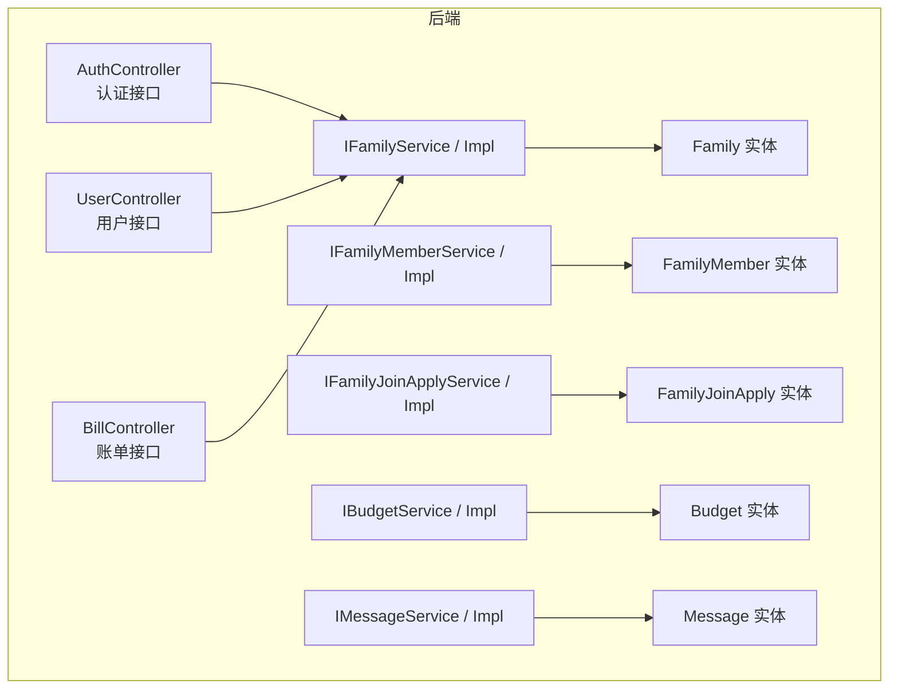
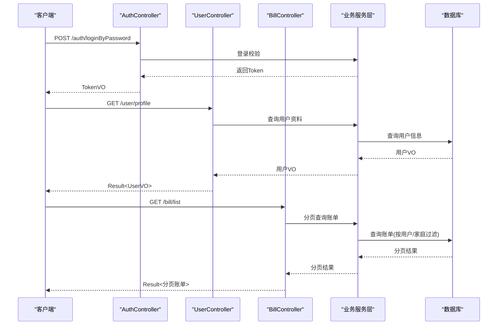
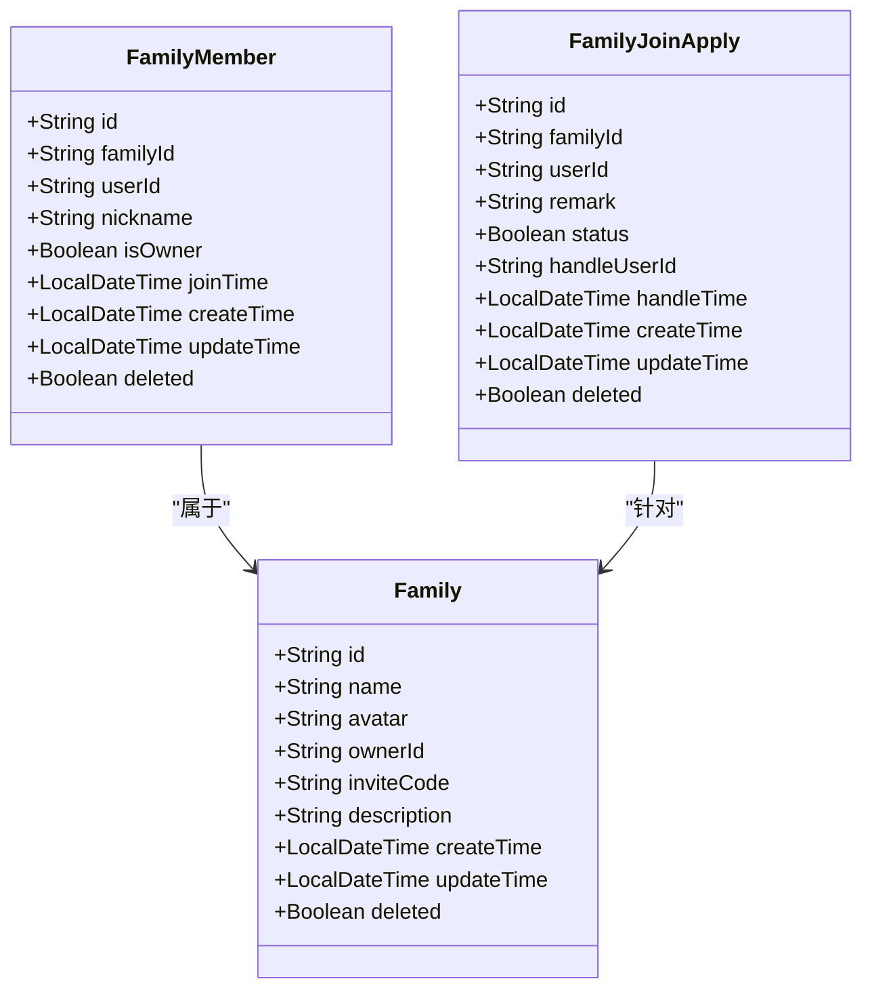
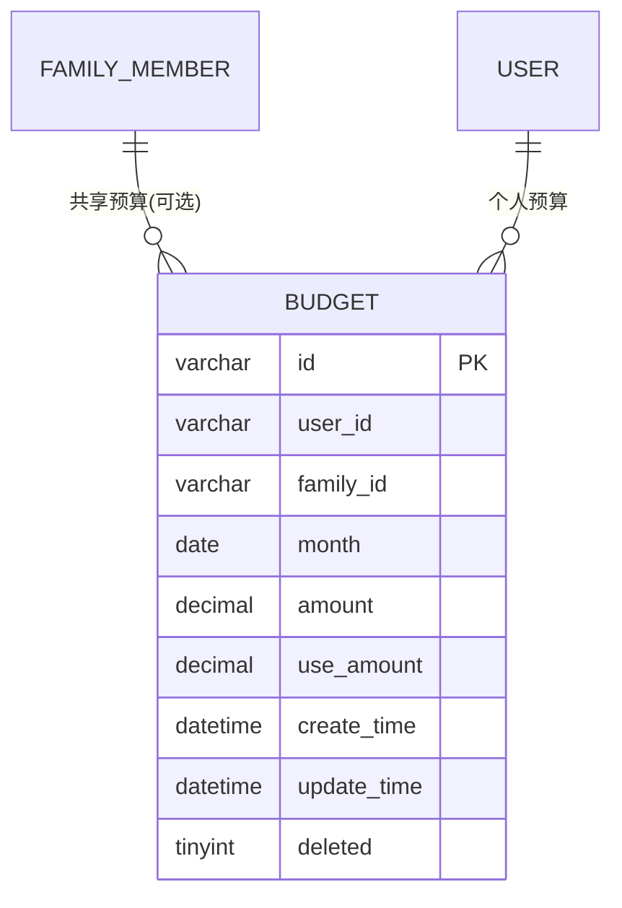
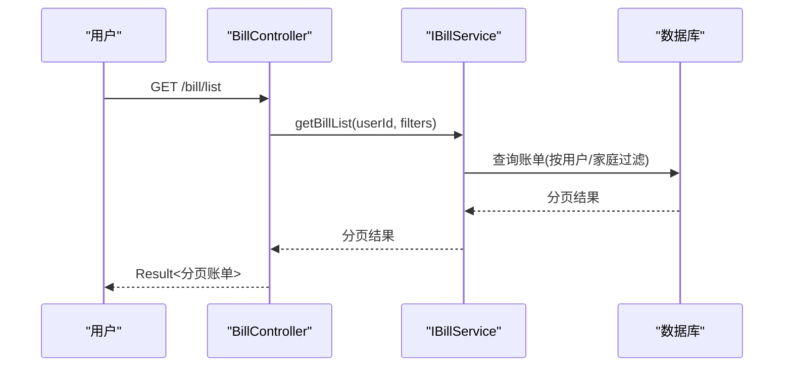
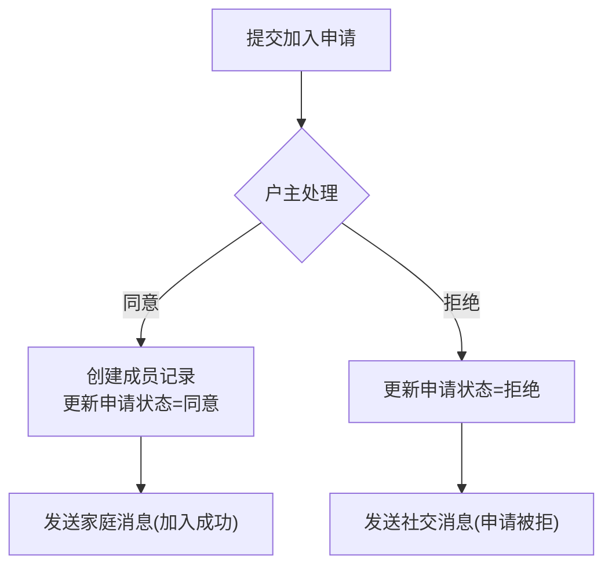
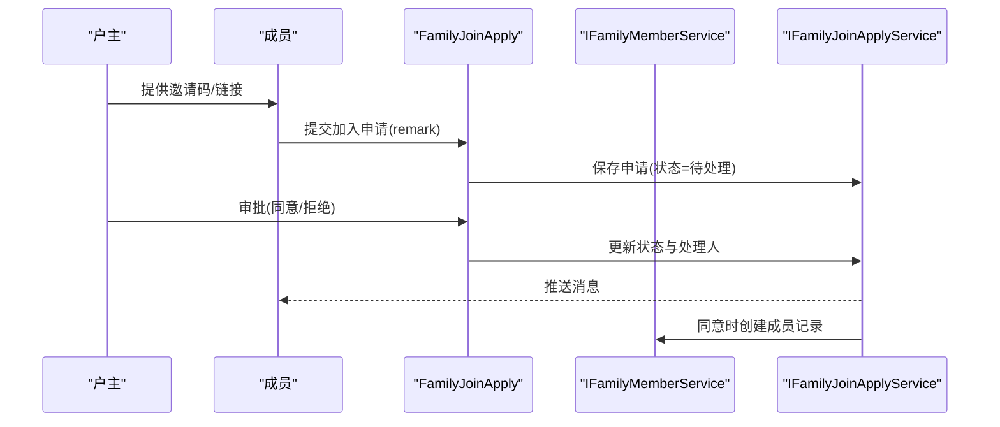
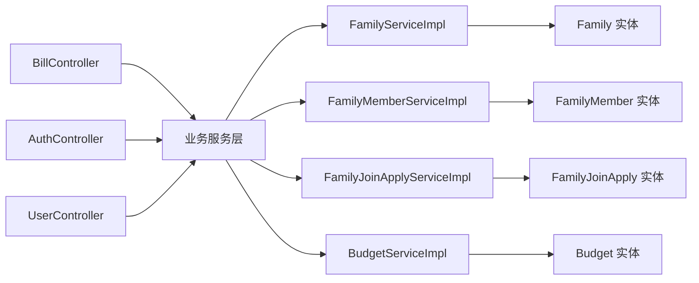

# 家庭共享接口

<cite>
**本文引用的文件**
- [PRD.md](file://PRD.md)
- [init.sql](file://chuan-bill-server/init.sql)
- [Family.java](file://chuan-bill-server/src/main/java/com/samoy/chuanbillserver/entity/Family.java)
- [FamilyMember.java](file://chuan-bill-server/src/main/java/com/samoy/chuanbillserver/entity/FamilyMember.java)
- [FamilyJoinApply.java](file://chuan-bill-server/src/main/java/com/samoy/chuanbillserver/entity/FamilyJoinApply.java)
- [Budget.java](file://chuan-bill-server/src/main/java/com/samoy/chuanbillserver/entity/Budget.java)
- [Message.java](file://chuan-bill-server/src/main/java/com/samoy/chuanbillserver/entity/Message.java)
- [IFamilyService.java](file://chuan-bill-server/src/main/java/com/samoy/chuanbillserver/service/IFamilyService.java)
- [IFamilyMemberService.java](file://chuan-bill-server/src/main/java/com/samoy/chuanbillserver/service/IFamilyMemberService.java)
- [IFamilyJoinApplyService.java](file://chuan-bill-server/src/main/java/com/samoy/chuanbillserver/service/IFamilyJoinApplyService.java)
- [IBudgetService.java](file://chuan-bill-server/src/main/java/com/samoy/chuanbillserver/service/IBudgetService.java)
- [IMessageService.java](file://chuan-bill-server/src/main/java/com/samoy/chuanbillserver/service/IMessageService.java)
- [FamilyServiceImpl.java](file://chuan-bill-server/src/main/java/com/samoy/chuanbillserver/service/impl/FamilyServiceImpl.java)
- [FamilyMemberServiceImpl.java](file://chuan-bill-server/src/main/java/com/samoy/chuanbillserver/service/impl/FamilyMemberServiceImpl.java)
- [FamilyJoinApplyServiceImpl.java](file://chuan-bill-server/src/main/java/com/samoy/chuanbillserver/service/impl/FamilyJoinApplyServiceImpl.java)
- [BudgetServiceImpl.java](file://chuan-bill-server/src/main/java/com/samoy/chuanbillserver/service/impl/BudgetServiceImpl.java)
- [BillController.java](file://chuan-bill-server/src/main/java/com/samoy/chuanbillserver/controller/BillController.java)
- [AuthController.java](file://chuan-bill-server/src/main/java/com/samoy/chuanbillserver/controller/AuthController.java)
- [UserController.java](file://chuan-bill-server/src/main/java/com/samoy/chuanbillserver/controller/UserController.java)
</cite>

## 目录
1. [简介](#简介)
2. [项目结构](#项目结构)
3. [核心组件](#核心组件)
4. [架构概览](#架构概览)
5. [详细组件分析](#详细组件分析)
6. [依赖分析](#依赖分析)
7. [性能考虑](#性能考虑)
8. [故障排查指南](#故障排查指南)
9. [结论](#结论)
10. [附录](#附录)

## 简介
本文件面向“家庭共享接口”的完整API文档，覆盖家庭创建、加入、退出、成员管理、权限控制、家庭预算、共享账单、消息通知、申请审批、数据同步与冲突处理等关键能力。基于仓库中的实体模型、服务层与控制器层，结合产品需求文档，给出接口定义、调用流程、权限模型与错误处理策略，帮助前后端协同开发与上线验证。

## 项目结构
后端采用Spring Boot工程，按领域分层组织：controller（接口）、service（业务）、entity/dao（数据模型与持久化）、mapper（SQL映射）、result（统一返回封装）、vo/dto（传输对象）。前端为UniApp工程，通过API定义与适配器生成工具对接后端接口。

图示来源
- [AuthController.java:1-66](file://chuan-bill-server/src/main/java/com/samoy/chuanbillserver/controller/AuthController.java#L1-L66)
- [UserController.java:1-62](file://chuan-bill-server/src/main/java/com/samoy/chuanbillserver/controller/UserController.java#L1-L62)
- [BillController.java:1-91](file://chuan-bill-server/src/main/java/com/samoy/chuanbillserver/controller/BillController.java#L1-L91)
- [IFamilyService.java:1-14](file://chuan-bill-server/src/main/java/com/samoy/chuanbillserver/service/IFamilyService.java#L1-L14)
- [IFamilyMemberService.java:1-14](file://chuan-bill-server/src/main/java/com/samoy/chuanbillserver/service/IFamilyMemberService.java#L1-L14)
- [IFamilyJoinApplyService.java:1-14](file://chuan-bill-server/src/main/java/com/samoy/chuanbillserver/service/IFamilyJoinApplyService.java#L1-L14)
- [IBudgetService.java:1-14](file://chuan-bill-server/src/main/java/com/samoy/chuanbillserver/service/IBudgetService.java#L1-L14)
- [IMessageService.java:1-15](file://chuan-bill-server/src/main/java/com/samoy/chuanbillserver/service/IMessageService.java#L1-L15)
- [Family.java:1-82](file://chuan-bill-server/src/main/java/com/samoy/chuanbillserver/entity/Family.java#L1-L82)
- [FamilyMember.java:1-82](file://chuan-bill-server/src/main/java/com/samoy/chuanbillserver/entity/FamilyMember.java#L1-L82)
- [FamilyJoinApply.java:1-88](file://chuan-bill-server/src/main/java/com/samoy/chuanbillserver/entity/FamilyJoinApply.java#L1-L88)
- [Budget.java:1-83](file://chuan-bill-server/src/main/java/com/samoy/chuanbillserver/entity/Budget.java#L1-L83)
- [Message.java:1-94](file://chuan-bill-server/src/main/java/com/samoy/chuanbillserver/entity/Message.java#L1-L94)

章节来源
- [AuthController.java:1-66](file://chuan-bill-server/src/main/java/com/samoy/chuanbillserver/controller/AuthController.java#L1-L66)
- [UserController.java:1-62](file://chuan-bill-server/src/main/java/com/samoy/chuanbillserver/controller/UserController.java#L1-L62)
- [BillController.java:1-91](file://chuan-bill-server/src/main/java/com/samoy/chuanbillserver/controller/BillController.java#L1-L91)

## 核心组件
- 家庭实体：包含家庭标识、名称、图标、户主、邀请码、描述及时间戳字段。
- 家庭成员实体：记录成员在家庭中的身份（户主/普通成员）、昵称、加入时间等。
- 家庭加入申请实体：记录成员申请加入的状态流转（待处理/同意/拒绝）及处理人、时间。
- 预算实体：支持个人与家庭两种预算维度，按月聚合，含已使用金额与时间戳。
- 消息实体：支持系统、家庭、账单、预算四类消息，关联相关ID与类型，便于定向提醒。

章节来源
- [Family.java:1-82](file://chuan-bill-server/src/main/java/com/samoy/chuanbillserver/entity/Family.java#L1-L82)
- [FamilyMember.java:1-82](file://chuan-bill-server/src/main/java/com/samoy/chuanbillserver/entity/FamilyMember.java#L1-L82)
- [FamilyJoinApply.java:1-88](file://chuan-bill-server/src/main/java/com/samoy/chuanbillserver/entity/FamilyJoinApply.java#L1-L88)
- [Budget.java:1-83](file://chuan-bill-server/src/main/java/com/samoy/chuanbillserver/entity/Budget.java#L1-L83)
- [Message.java:1-94](file://chuan-bill-server/src/main/java/com/samoy/chuanbillserver/entity/Message.java#L1-L94)

## 架构概览
后端采用REST风格控制器，统一返回包装；服务层负责业务编排；MyBatis-Plus实体与Mapper映射数据库表。家庭相关接口通过鉴权上下文获取当前用户ID，贯穿成员校验、权限判定与数据隔离。

图示来源
- [AuthController.java:35-51](file://chuan-bill-server/src/main/java/com/samoy/chuanbillserver/controller/AuthController.java#L35-L51)
- [UserController.java:25-38](file://chuan-bill-server/src/main/java/com/samoy/chuanbillserver/controller/UserController.java#L25-L38)
- [BillController.java:37-42](file://chuan-bill-server/src/main/java/com/samoy/chuanbillserver/controller/BillController.java#L37-L42)

## 详细组件分析

### 家庭关系模型与权限设计
- 家庭与成员：一个家庭包含多个成员，成员中存在户主角色，户主拥有更高权限。
- 权限矩阵（依据产品需求）：
  - 户主：批准加入申请、转让户主、逐出成员、设置家庭预算。
  - 普通成员：邀请新成员、自行离开家庭。
- 数据模型要点：
  - 家庭表包含户主标识与邀请码，用于加入与权限判定。
  - 成员表包含是否户主标记与加入时间，用于成员排序与权限判断。
  - 申请表记录申请状态与处理人，支撑审批流程。

图示来源
- [Family.java:24-82](file://chuan-bill-server/src/main/java/com/samoy/chuanbillserver/entity/Family.java#L24-L82)
- [FamilyMember.java:24-82](file://chuan-bill-server/src/main/java/com/samoy/chuanbillserver/entity/FamilyMember.java#L24-L82)
- [FamilyJoinApply.java:24-88](file://chuan-bill-server/src/main/java/com/samoy/chuanbillserver/entity/FamilyJoinApply.java#L24-L88)

章节来源
- [Family.java:1-82](file://chuan-bill-server/src/main/java/com/samoy/chuanbillserver/entity/Family.java#L1-L82)
- [FamilyMember.java:1-82](file://chuan-bill-server/src/main/java/com/samoy/chuanbillserver/entity/FamilyMember.java#L1-L82)
- [FamilyJoinApply.java:1-88](file://chuan-bill-server/src/main/java/com/samoy/chuanbillserver/entity/FamilyJoinApply.java#L1-L88)
- [PRD.md:46-56](file://PRD.md#L46-L56)

### 家庭预算管理
- 支持个人预算与家庭预算两种维度，均按月聚合。
- 预算表包含预算金额与已使用金额，用于计算使用进度与超支提醒。
- 月初重置与提醒策略由业务侧触发，数据库层面提供按月唯一索引保障。

图示来源
- [Budget.java:26-83](file://chuan-bill-server/src/main/java/com/samoy/chuanbillserver/entity/Budget.java#L26-L83)
- [init.sql:163-178](file://chuan-bill-server/init.sql#L163-L178)

章节来源
- [Budget.java:1-83](file://chuan-bill-server/src/main/java/com/samoy/chuanbillserver/entity/Budget.java#L1-L83)
- [init.sql:160-178](file://chuan-bill-server/init.sql#L160-L178)
- [PRD.md:64-76](file://PRD.md#L64-L76)

### 共享账单与数据同步
- 账单可选择是否共享至家庭，共享账单对全体成员可见。
- 历史共享账单在成员退出后仍可查看，体现“数据可回溯”原则。
- 控制器层通过鉴权上下文获取当前用户ID，结合家庭维度进行数据隔离与查询。

图示来源
- [BillController.java:37-42](file://chuan-bill-server/src/main/java/com/samoy/chuanbillserver/controller/BillController.java#L37-L42)

章节来源
- [BillController.java:1-91](file://chuan-bill-server/src/main/java/com/samoy/chuanbillserver/controller/BillController.java#L1-L91)
- [PRD.md:58-62](file://PRD.md#L58-L62)

### 消息通知与申请审批
- 消息类型涵盖系统、家庭、账单、预算四类，支持按用户与状态筛选。
- 家庭加入申请支持待处理、同意、拒绝三种状态，记录处理人与处理时间，便于审计与追踪。
- 申请审批流程：成员提交申请 → 户主处理 → 状态变更 → 消息推送。

图示来源
- [FamilyJoinApply.java:24-88](file://chuan-bill-server/src/main/java/com/samoy/chuanbillserver/entity/FamilyJoinApply.java#L24-L88)
- [Message.java:24-94](file://chuan-bill-server/src/main/java/com/samoy/chuanbillserver/entity/Message.java#L24-L94)

章节来源
- [FamilyJoinApply.java:1-88](file://chuan-bill-server/src/main/java/com/samoy/chuanbillserver/entity/FamilyJoinApply.java#L1-L88)
- [Message.java:1-94](file://chuan-bill-server/src/main/java/com/samoy/chuanbillserver/entity/Message.java#L1-L94)
- [PRD.md:96-103](file://PRD.md#L96-L103)

### 家庭创建、加入、退出与成员管理
- 创建家庭：户主自动绑定，生成邀请码，用于他人加入。
- 加入家庭：通过邀请码或链接提交申请，户主审批。
- 退出家庭：普通成员可主动离开，户主可逐出成员。
- 成员列表：所有成员可见。

图示来源
- [FamilyJoinApply.java:24-88](file://chuan-bill-server/src/main/java/com/samoy/chuanbillserver/entity/FamilyJoinApply.java#L24-L88)
- [FamilyMember.java:24-82](file://chuan-bill-server/src/main/java/com/samoy/chuanbillserver/entity/FamilyMember.java#L24-L82)
- [IFamilyJoinApplyService.java:1-14](file://chuan-bill-server/src/main/java/com/samoy/chuanbillserver/service/IFamilyJoinApplyService.java#L1-L14)
- [IFamilyMemberService.java:1-14](file://chuan-bill-server/src/main/java/com/samoy/chuanbillserver/service/IFamilyMemberService.java#L1-L14)

章节来源
- [PRD.md:46-56](file://PRD.md#L46-L56)

## 依赖分析
- 控制器依赖服务接口，服务实现依赖Mapper与实体。
- 家庭相关服务与实体形成闭环，预算与消息分别独立但与家庭/成员存在外键关联。
- 数据库层面通过唯一索引与时间索引保障预算与消息查询效率。

图示来源
- [BillController.java:1-91](file://chuan-bill-server/src/main/java/com/samoy/chuanbillserver/controller/BillController.java#L1-L91)
- [AuthController.java:1-66](file://chuan-bill-server/src/main/java/com/samoy/chuanbillserver/controller/AuthController.java#L1-L66)
- [UserController.java:1-62](file://chuan-bill-server/src/main/java/com/samoy/chuanbillserver/controller/UserController.java#L1-L62)
- [FamilyServiceImpl.java:1-19](file://chuan-bill-server/src/main/java/com/samoy/chuanbillserver/service/impl/FamilyServiceImpl.java#L1-L19)
- [FamilyMemberServiceImpl.java:1-19](file://chuan-bill-server/src/main/java/com/samoy/chuanbillserver/service/impl/FamilyMemberServiceImpl.java#L1-L19)
- [FamilyJoinApplyServiceImpl.java:1-20](file://chuan-bill-server/src/main/java/com/samoy/chuanbillserver/service/impl/FamilyJoinApplyServiceImpl.java#L1-L20)
- [BudgetServiceImpl.java:1-19](file://chuan-bill-server/src/main/java/com/samoy/chuanbillserver/service/impl/BudgetServiceImpl.java#L1-L19)

章节来源
- [IFamilyService.java:1-14](file://chuan-bill-server/src/main/java/com/samoy/chuanbillserver/service/IFamilyService.java#L1-L14)
- [IFamilyMemberService.java:1-14](file://chuan-bill-server/src/main/java/com/samoy/chuanbillserver/service/IFamilyMemberService.java#L1-L14)
- [IFamilyJoinApplyService.java:1-14](file://chuan-bill-server/src/main/java/com/samoy/chuanbillserver/service/IFamilyJoinApplyService.java#L1-L14)
- [IBudgetService.java:1-14](file://chuan-bill-server/src/main/java/com/samoy/chuanbillserver/service/IBudgetService.java#L1-L14)
- [IMessageService.java:1-15](file://chuan-bill-server/src/main/java/com/samoy/chuanbillserver/service/IMessageService.java#L1-L15)

## 性能考虑
- 预算与账单查询：数据库为预算与账单表建立复合索引与时间索引，建议按用户ID与家庭ID、月份、时间范围进行过滤，避免全表扫描。
- 消息查询：按用户ID与状态组合索引，支持高效分页与未读统计。
- 缓存策略：对热点配置（如分类、支付方式）可引入缓存；对高频查询结果进行短期缓存以降低数据库压力。
- 并发控制：预算更新与账单写入需保证原子性，必要时使用乐观锁或事务控制。

## 故障排查指南
- 权限不足：户主操作失败时，检查成员表中是否为户主标记；申请审批状态异常时，核对申请表状态与处理人字段。
- 邀请码无效：确认家庭表邀请码字段未被篡改且未过期；加入申请是否被拒绝。
- 预算异常：核对预算表金额与使用金额是否正确累加；检查是否存在重复月度预算导致唯一索引冲突。
- 消息未达：检查消息表类型与相关ID是否正确；确认用户未屏蔽相关类型消息。
- 账单不可见：确认账单是否标记为共享；成员是否仍在家庭内；查询条件是否包含家庭维度。

章节来源
- [FamilyJoinApply.java:24-88](file://chuan-bill-server/src/main/java/com/samoy/chuanbillserver/entity/FamilyJoinApply.java#L24-L88)
- [FamilyMember.java:24-82](file://chuan-bill-server/src/main/java/com/samoy/chuanbillserver/entity/FamilyMember.java#L24-L82)
- [Budget.java:26-83](file://chuan-bill-server/src/main/java/com/samoy/chuanbillserver/entity/Budget.java#L26-L83)
- [Message.java:24-94](file://chuan-bill-server/src/main/java/com/samoy/chuanbillserver/entity/Message.java#L24-L94)

## 结论
本方案以清晰的数据模型与服务层解耦为核心，围绕家庭生命周期（创建、加入、退出、成员管理）、预算与消息两大运营抓手，构建了可扩展、可审计、可监控的家庭共享能力。建议在上线前完善审批流与预算提醒的自动化任务，并持续优化查询索引与缓存策略。

## 附录

### 接口清单与调用顺序（示例）
- 认证与用户
  - POST /auth/loginByPassword：账号密码登录
  - POST /auth/loginByPhone：手机验证码登录
  - POST /auth/sendCode：发送验证码
  - GET /user/profile：获取用户资料
  - POST /user/updateProfile：更新用户资料
  - POST /user/updatePasswordByOld：旧密码改密
  - POST /user/updatePasswordByCode：验证码改密
  - GET /user/hasPassword：检查是否设置密码
- 账单
  - GET /bill/list：分页获取账单列表
  - GET /bill/detail：获取账单详情
  - POST /bill/add：新增账单
  - POST /bill/update：更新账单
  - POST /bill/delete：删除账单
  - GET /bill/categories：获取分类列表
  - GET /bill/payment-methods：获取支付方式列表
- 家庭（示意）
  - POST /family/create：创建家庭（户主）
  - POST /family/join：提交加入申请
  - POST /family/leave：成员主动退出
  - POST /family/approve：户主审批申请
  - GET /family/members：获取成员列表
  - POST /family/budget/set：户主设置家庭预算
  - GET /family/budget/status：查询预算使用情况
  - GET /family/messages：获取家庭相关消息

说明
- 上述家庭接口为概念性列举，具体路径与参数以实际后端实现为准。
- 所有接口均需携带认证信息；部分接口需具备相应权限（如户主）。