# 家庭加入申请接口

<cite>
**本文档引用的文件**
- [FamilyJoinApply.java](file://chuan-bill-server/src/main/java/com/samoy/chuanbillserver/entity/FamilyJoinApply.java)
- [FamilyJoinApplyMapper.java](file://chuan-bill-server/src/main/java/com/samoy/chuanbillserver/dao/FamilyJoinApplyMapper.java)
- [FamilyJoinApplyServiceImpl.java](file://chuan-bill-server/src/main/java/com/samoy/chuanbillserver/service/impl/FamilyJoinApplyServiceImpl.java)
- [IFamilyJoinApplyService.java](file://chuan-bill-server/src/main/java/com/samoy/chuanbillserver/service/IFamilyJoinApplyService.java)
- [FamilyJoinApplyMapper.xml](file://chuan-bill-server/src/main/resources/mapper/FamilyJoinApplyMapper.xml)
- [init.sql](file://chuan-bill-server/init.sql)
- [SystemConstants.java](file://chuan-bill-server/src/main/java/com/samoy/chuanbillserver/constant/SystemConstants.java)
- [FamilyMember.java](file://chuan-bill-server/src/main/java/com/samoy/chuanbillserver/entity/FamilyMember.java)
- [apiDefinitions.ts](file://chuan-bill-app/src/api/apiDefinitions.ts)
- [createApis.ts](file://chuan-bill-app/src/api/createApis.ts)
</cite>

## 目录
1. [简介](#简介)
2. [项目结构](#项目结构)
3. [核心组件](#核心组件)
4. [架构概览](#架构概览)
5. [详细组件分析](#详细组件分析)
6. [依赖关系分析](#依赖关系分析)
7. [性能考虑](#性能考虑)
8. [故障排除指南](#故障排除指南)
9. [结论](#结论)

## 简介

家庭加入申请接口是小川记账系统中的核心功能模块，负责管理用户申请加入家庭的完整生命周期。该接口实现了从申请提交、申请查询到申请处理的全流程管理，包括申请状态管理、审批流程、通知机制等功能。

本系统采用前后端分离架构，后端基于Spring Boot + MyBatis Plus开发，前端使用Vue 3 + UniApp构建跨平台应用。数据库采用MySQL，通过MyBatis进行数据持久化操作。

## 项目结构

家庭加入申请功能涉及以下关键文件和组件：

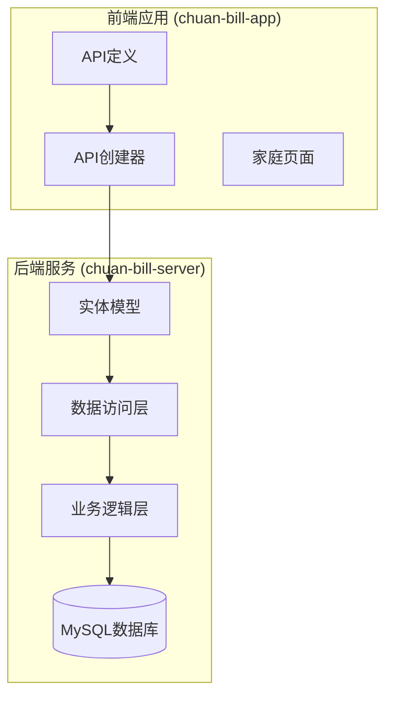

**图表来源**
- [apiDefinitions.ts:19-37](file://chuan-bill-app/src/api/apiDefinitions.ts#L19-L37)
- [createApis.ts:65-76](file://chuan-bill-app/src/api/createApis.ts#L65-L76)
- [FamilyJoinApply.java:24-87](file://chuan-bill-server/src/main/java/com/samoy/chuanbillserver/entity/FamilyJoinApply.java#L24-L87)

**章节来源**
- [apiDefinitions.ts:19-37](file://chuan-bill-app/src/api/apiDefinitions.ts#L19-L37)
- [createApis.ts:65-76](file://chuan-bill-app/src/api/createApis.ts#L65-L76)
- [FamilyJoinApply.java:24-87](file://chuan-bill-server/src/main/java/com/samoy/chuanbillserver/entity/FamilyJoinApply.java#L24-L87)

## 核心组件

### 数据模型设计

家庭加入申请的核心数据模型采用标准的实体-关系设计，支持完整的生命周期管理：

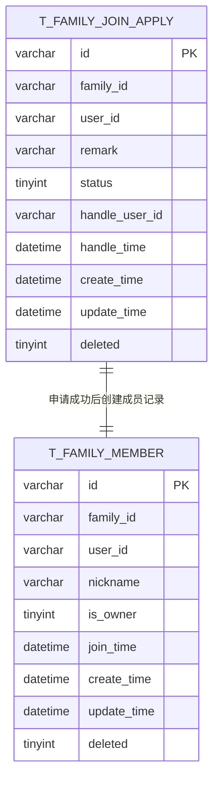

**图表来源**
- [FamilyJoinApply.java:28-86](file://chuan-bill-server/src/main/java/com/samoy/chuanbillserver/entity/FamilyJoinApply.java#L28-L86)
- [FamilyMember.java:28-80](file://chuan-bill-server/src/main/java/com/samoy/chuanbillserver/entity/FamilyMember.java#L28-L80)

### 状态枚举定义

申请状态采用整数枚举方式定义，确保数据一致性和可维护性：

| 状态值 | 状态名称 | 描述 |
|--------|----------|------|
| 0 | PENDING | 待处理 |
| 1 | APPROVED | 已同意 |
| 2 | REJECTED | 已拒绝 |

### 时间戳管理

系统采用统一的时间戳管理策略：
- `create_time`: 记录创建时间，默认当前时间
- `update_time`: 记录更新时间，默认当前时间，支持自动更新
- `handle_time`: 处理完成时间，仅在状态变更时更新

**章节来源**
- [FamilyJoinApply.java:52-86](file://chuan-bill-server/src/main/java/com/samoy/chuanbillserver/entity/FamilyJoinApply.java#L52-L86)
- [init.sql:118-122](file://chuan-bill-server/init.sql#L118-L122)

## 架构概览

家庭加入申请系统的整体架构采用分层设计模式：

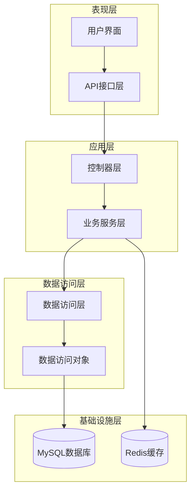

**图表来源**
- [FamilyJoinApplyMapper.java:1-14](file://chuan-bill-server/src/main/java/com/samoy/chuanbillserver/dao/FamilyJoinApplyMapper.java#L1-L14)
- [FamilyJoinApplyServiceImpl.java:1-19](file://chuan-bill-server/src/main/java/com/samoy/chuanbillserver/service/impl/FamilyJoinApplyServiceImpl.java#L1-L19)

## 详细组件分析

### 实体模型类分析

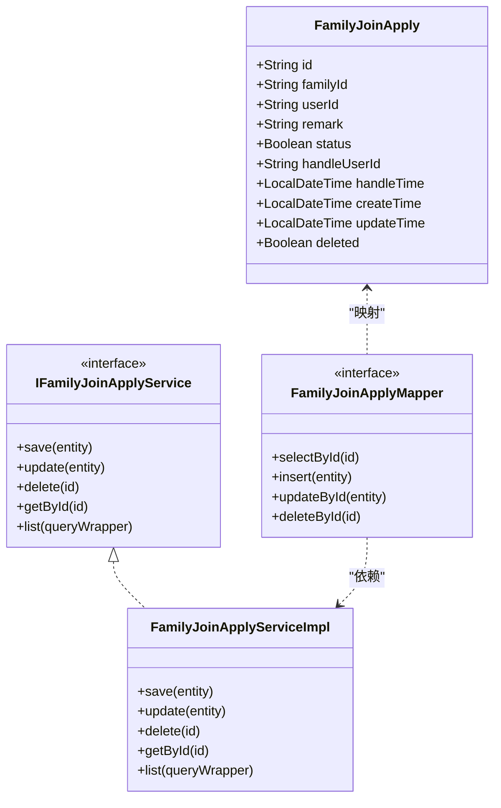

**图表来源**
- [FamilyJoinApply.java:24-87](file://chuan-bill-server/src/main/java/com/samoy/chuanbillserver/entity/FamilyJoinApply.java#L24-L87)
- [IFamilyJoinApplyService.java:1-14](file://chuan-bill-server/src/main/java/com/samoy/chuanbillserver/service/IFamilyJoinApplyService.java#L1-L14)
- [FamilyJoinApplyMapper.java:1-14](file://chuan-bill-server/src/main/java/com/samoy/chuanbillserver/dao/FamilyJoinApplyMapper.java#L1-L14)
- [FamilyJoinApplyServiceImpl.java:1-19](file://chuan-bill-server/src/main/java/com/samoy/chuanbillserver/service/impl/FamilyJoinApplyServiceImpl.java#L1-L19)

### API接口定义

#### 申请提交接口

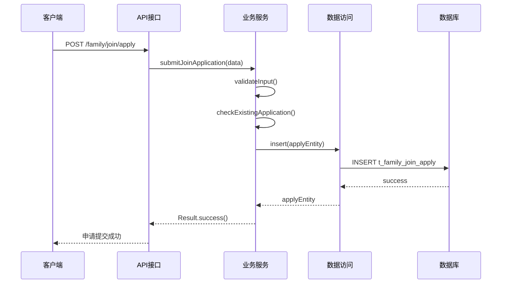

**图表来源**
- [FamilyJoinApplyServiceImpl.java:1-19](file://chuan-bill-server/src/main/java/com/samoy/chuanbillserver/service/impl/FamilyJoinApplyServiceImpl.java#L1-L19)
- [FamilyJoinApplyMapper.java:1-14](file://chuan-bill-server/src/main/java/com/samoy/chuanbillserver/dao/FamilyJoinApplyMapper.java#L1-L14)

#### 申请查询接口

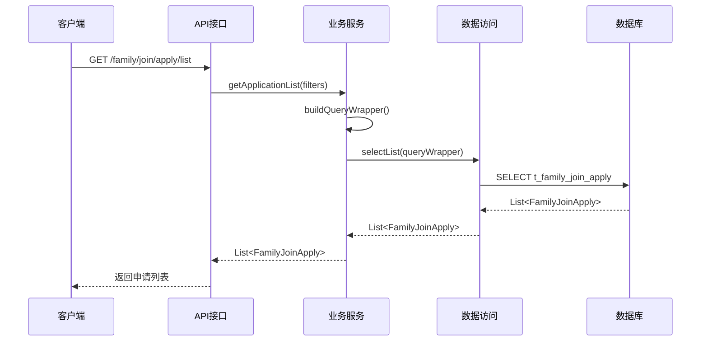

**图表来源**
- [FamilyJoinApplyServiceImpl.java:1-19](file://chuan-bill-server/src/main/java/com/samoy/chuanbillserver/service/impl/FamilyJoinApplyServiceImpl.java#L1-L19)
- [FamilyJoinApplyMapper.java:1-14](file://chuan-bill-server/src/main/java/com/samoy/chuanbillserver/dao/FamilyJoinApplyMapper.java#L1-L14)

#### 申请处理接口

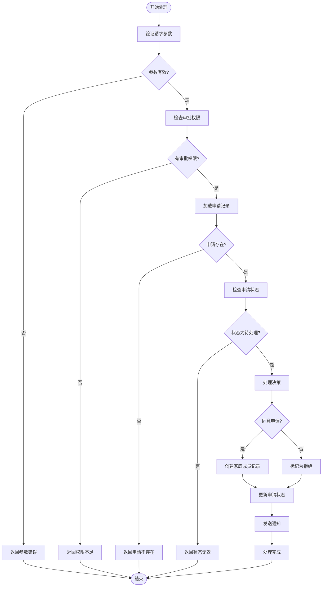

**图表来源**
- [FamilyJoinApplyServiceImpl.java:1-19](file://chuan-bill-server/src/main/java/com/samoy/chuanbillserver/service/impl/FamilyJoinApplyServiceImpl.java#L1-L19)
- [FamilyMember.java:28-80](file://chuan-bill-server/src/main/java/com/samoy/chuanbillserver/entity/FamilyMember.java#L28-L80)

### 权限控制机制

系统采用多层级权限控制机制：

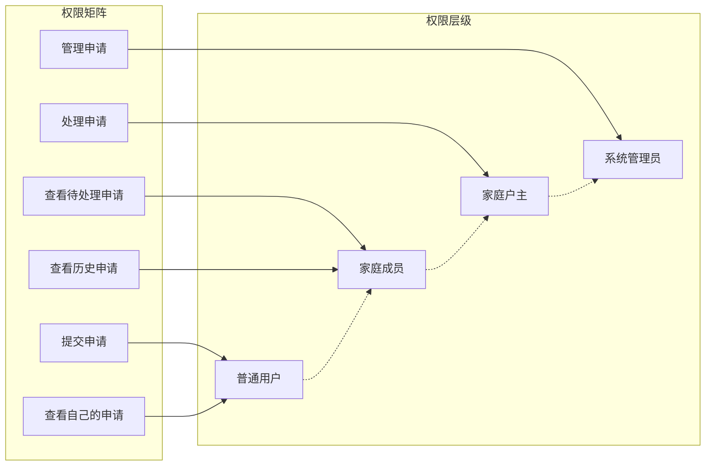

**图表来源**
- [FamilyMember.java:53-56](file://chuan-bill-server/src/main/java/com/samoy/chuanbillserver/entity/FamilyMember.java#L53-L56)

**章节来源**
- [FamilyJoinApply.java:52-56](file://chuan-bill-server/src/main/java/com/samoy/chuanbillserver/entity/FamilyJoinApply.java#L52-L56)
- [FamilyMember.java:53-56](file://chuan-bill-server/src/main/java/com/samoy/chuanbillserver/entity/FamilyMember.java#L53-L56)

## 依赖关系分析

### 组件依赖图

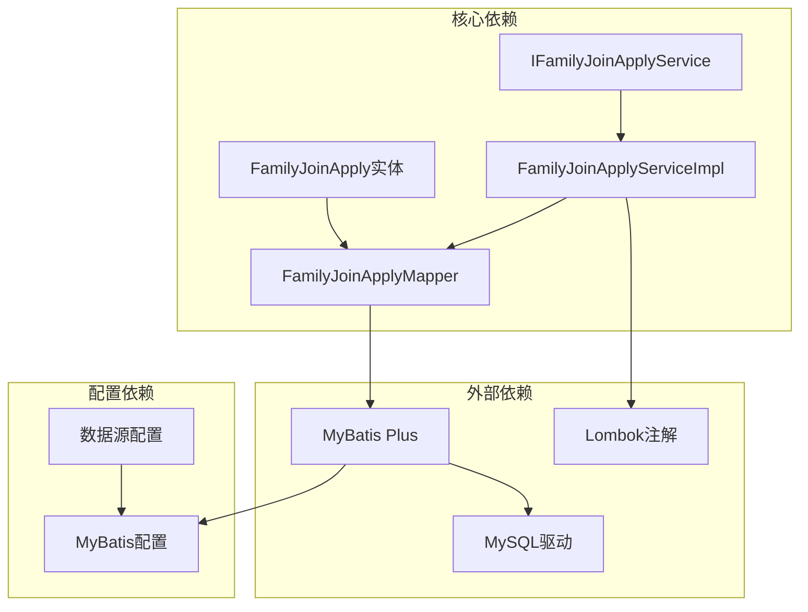

**图表来源**
- [FamilyJoinApply.java:24-24](file://chuan-bill-server/src/main/java/com/samoy/chuanbillserver/entity/FamilyJoinApply.java#L24-L24)
- [IFamilyJoinApplyService.java:1-14](file://chuan-bill-server/src/main/java/com/samoy/chuanbillserver/service/IFamilyJoinApplyService.java#L1-L14)
- [FamilyJoinApplyMapper.java:1-14](file://chuan-bill-server/src/main/java/com/samoy/chuanbillserver/dao/FamilyJoinApplyMapper.java#L1-L14)
- [FamilyJoinApplyServiceImpl.java:1-19](file://chuan-bill-server/src/main/java/com/samoy/chuanbillserver/service/impl/FamilyJoinApplyServiceImpl.java#L1-L19)

### 数据库索引分析

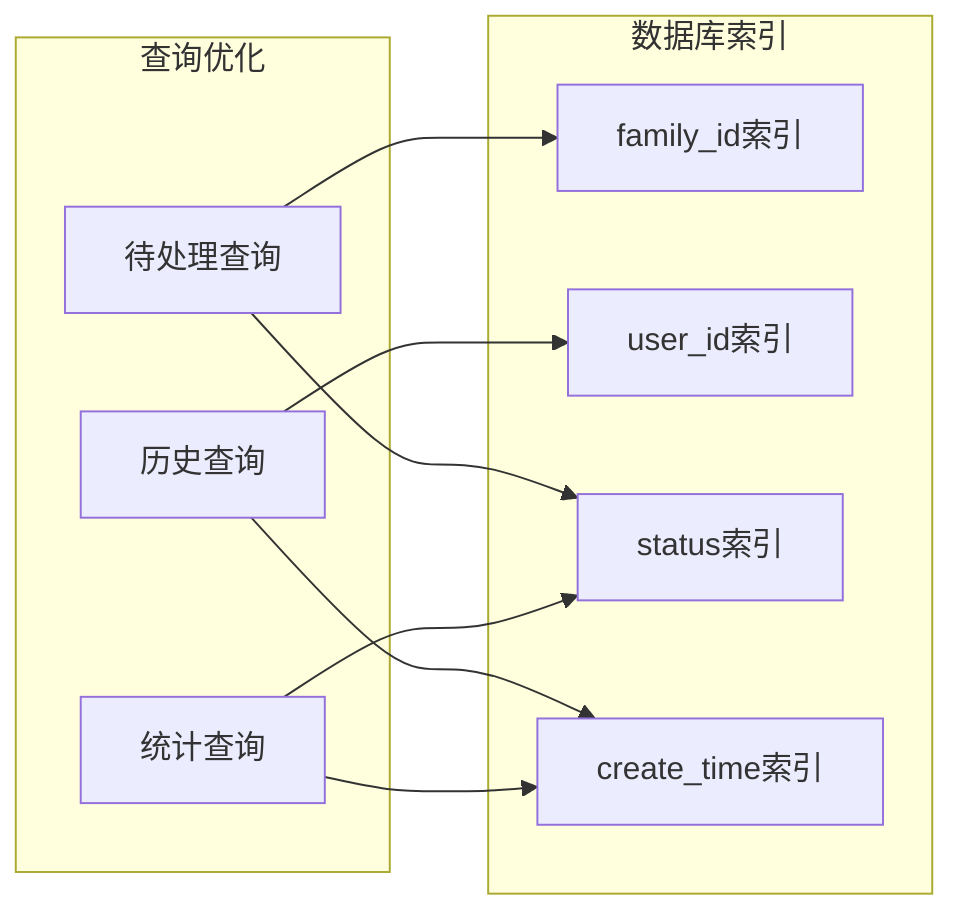

**图表来源**
- [init.sql:124-127](file://chuan-bill-server/init.sql#L124-L127)

**章节来源**
- [init.sql:109-128](file://chuan-bill-server/init.sql#L109-L128)

## 性能考虑

### 查询性能优化

1. **索引策略**
   - `family_id`：支持按家庭维度快速查询
   - `user_id`：支持按用户维度快速查询
   - `status`：支持按状态过滤查询
   - `create_time`：支持按时间排序查询

2. **查询优化建议**
   - 使用分页查询处理大量数据
   - 合理使用索引避免全表扫描
   - 缓存常用查询结果

### 并发控制

系统采用乐观锁机制防止并发更新冲突：
- 使用`update_time`字段作为版本号
- 在更新时检查时间戳一致性
- 自动重试机制处理并发冲突

## 故障排除指南

### 常见问题及解决方案

| 问题类型 | 症状描述 | 可能原因 | 解决方案 |
|----------|----------|----------|----------|
| 权限错误 | 403 Forbidden | 用户无审批权限 | 检查用户角色和家庭成员状态 |
| 参数错误 | 400 Bad Request | 请求参数不合法 | 验证必填字段和数据格式 |
| 业务异常 | 409 Conflict | 业务规则冲突 | 检查申请状态和重复提交 |
| 数据库错误 | 500 Internal Server Error | 数据库连接问题 | 检查数据库连接和事务配置 |

### 错误处理策略

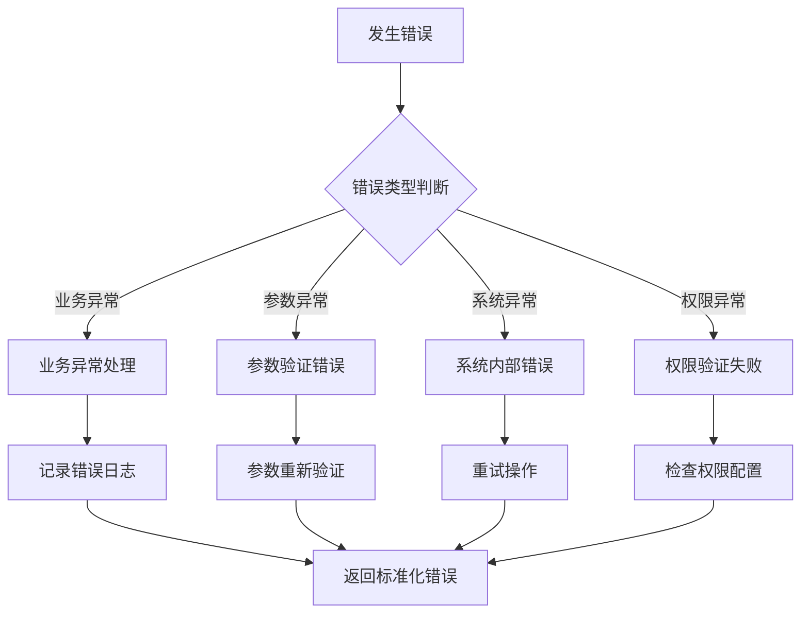

**图表来源**
- [FamilyJoinApplyServiceImpl.java:1-19](file://chuan-bill-server/src/main/java/com/samoy/chuanbillserver/service/impl/FamilyJoinApplyServiceImpl.java#L1-L19)

**章节来源**
- [SystemConstants.java:1-35](file://chuan-bill-server/src/main/java/com/samoy/chuanbillserver/constant/SystemConstants.java#L1-L35)

## 结论

家庭加入申请接口通过清晰的分层架构和完善的权限控制机制，为小川记账系统提供了稳定可靠的家庭管理功能。系统采用现代化的技术栈，具备良好的扩展性和维护性。

### 主要优势

1. **架构清晰**：采用标准的分层设计，职责分离明确
2. **权限完善**：多层级权限控制，确保数据安全
3. **性能优化**：合理的索引设计和查询优化策略
4. **错误处理**：完善的异常处理和故障恢复机制
5. **扩展性强**：模块化设计便于功能扩展和维护

### 改进建议

1. **增加自动过期机制**：可考虑添加申请超时自动处理功能
2. **增强通知系统**：完善消息推送和通知机制
3. **优化批量处理**：支持批量审批和批量查询功能
4. **增强监控告警**：添加系统监控和性能告警功能

该接口设计充分考虑了实际业务需求，为用户提供流畅的家庭加入体验，同时为后续功能扩展奠定了坚实基础。