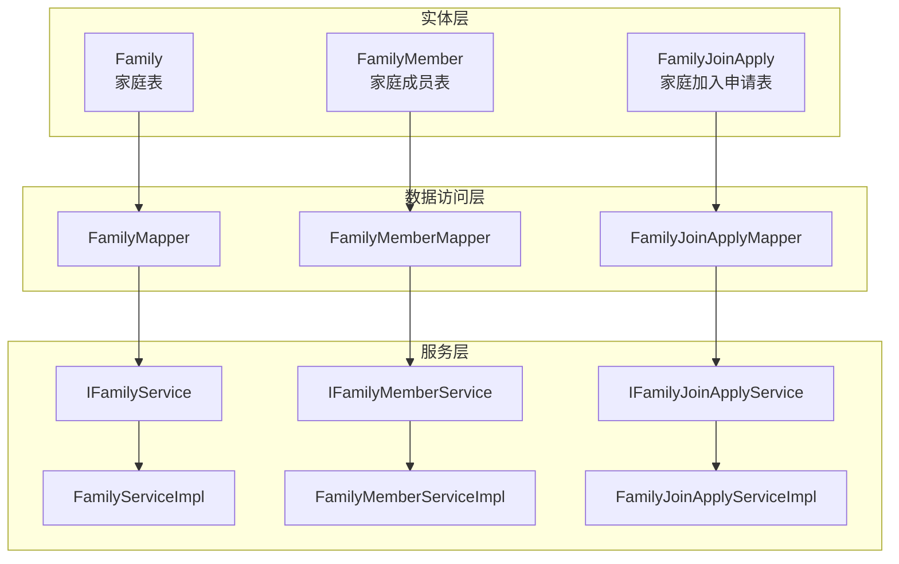
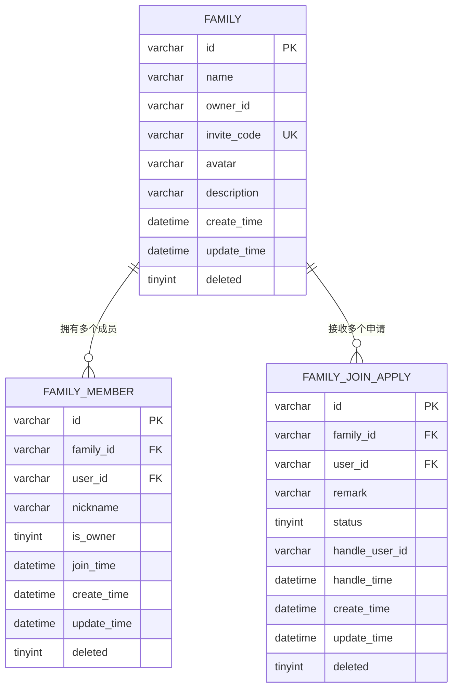
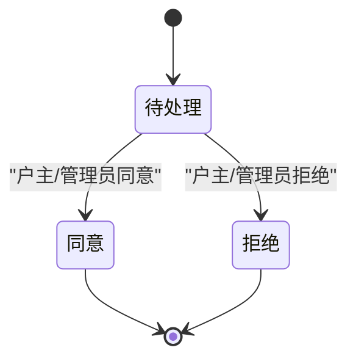
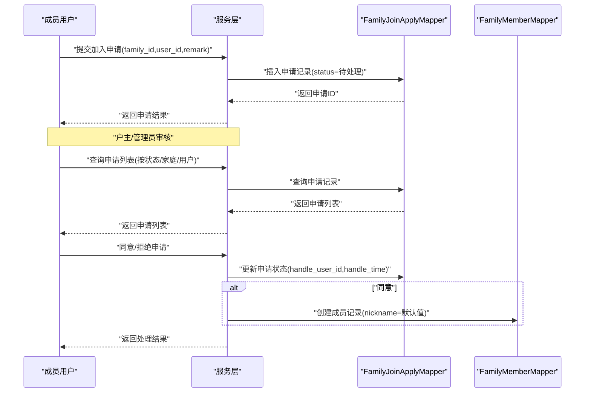

# 家庭成员接口

<cite>
**本文引用的文件**
- [Family.java](file://chuan-bill-server/src/main/java/com/samoy/chuanbillserver/entity/Family.java)
- [FamilyMember.java](file://chuan-bill-server/src/main/java/com/samoy/chuanbillserver/entity/FamilyMember.java)
- [FamilyJoinApply.java](file://chuan-bill-server/src/main/java/com/samoy/chuanbillserver/entity/FamilyJoinApply.java)
- [FamilyMapper.java](file://chuan-bill-server/src/main/java/com/samoy/chuanbillserver/dao/FamilyMapper.java)
- [FamilyMemberMapper.java](file://chuan-bill-server/src/main/java/com/samoy/chuanbillserver/dao/FamilyMemberMapper.java)
- [FamilyJoinApplyMapper.java](file://chuan-bill-server/src/main/java/com/samoy/chuanbillserver/dao/FamilyJoinApplyMapper.java)
- [IFamilyService.java](file://chuan-bill-server/src/main/java/com/samoy/chuanbillserver/service/IFamilyService.java)
- [IFamilyMemberService.java](file://chuan-bill-server/src/main/java/com/samoy/chuanbillserver/service/IFamilyMemberService.java)
- [IFamilyJoinApplyService.java](file://chuan-bill-server/src/main/java/com/samoy/chuanbillserver/service/IFamilyJoinApplyService.java)
- [FamilyServiceImpl.java](file://chuan-bill-server/src/main/java/com/samoy/chuanbillserver/service/impl/FamilyServiceImpl.java)
- [FamilyMemberServiceImpl.java](file://chuan-bill-server/src/main/java/com/samoy/chuanbillserver/service/impl/FamilyMemberServiceImpl.java)
- [FamilyJoinApplyServiceImpl.java](file://chuan-bill-server/src/main/java/com/samoy/chuanbillserver/service/impl/FamilyJoinApplyServiceImpl.java)
- [init.sql](file://chuan-bill-server/init.sql)
</cite>

## 目录
1. [简介](#简介)
2. [项目结构](#项目结构)
3. [核心组件](#核心组件)
4. [架构总览](#架构总览)
5. [详细组件分析](#详细组件分析)
6. [依赖分析](#依赖分析)
7. [性能考虑](#性能考虑)
8. [故障排查指南](#故障排查指南)
9. [结论](#结论)
10. [附录](#附录)

## 简介
本文件面向“家庭成员接口”的后端API设计与实现，聚焦以下核心能力：
- 成员邀请：生成邀请码、分享邀请链接、接收者扫码/点击加入
- 申请加入：成员提交加入申请、填写备注、等待审核
- 审核批准：户主或管理员对申请进行同意/拒绝
- 移除成员：户主或管理员将成员从家庭中移除
- 成员关系模型：家庭、成员、申请三张表的关系与字段设计
- 角色权限：户主、普通成员的角色区分与权限边界
- 状态流转：申请状态（待处理/同意/拒绝）
- 列表查询：按角色、按状态、成员详情等查询能力
- 生命周期管理：主动退出、系统自动清理策略
- 权限控制与错误处理：管理员校验、操作限制、异常处理策略

本说明以数据库表结构与实体类为基础，结合服务层与数据访问层的职责划分，给出清晰的接口语义、调用顺序、权限规则与错误处理建议。

## 项目结构
后端采用标准分层架构：
- 实体层：定义数据库表映射的Java对象
- 数据访问层：MyBatis-Plus Mapper 接口
- 服务层：IService 接口与实现类
- 控制器层：REST API（本仓库未直接暴露家庭成员控制器，但实体与服务已就绪）

图表来源
- [Family.java:24-81](file://chuan-bill-server/src/main/java/com/samoy/chuanbillserver/entity/Family.java#L24-L81)
- [FamilyMember.java:24-81](file://chuan-bill-server/src/main/java/com/samoy/chuanbillserver/entity/FamilyMember.java#L24-L81)
- [FamilyJoinApply.java:24-87](file://chuan-bill-server/src/main/java/com/samoy/chuanbillserver/entity/FamilyJoinApply.java#L24-L87)
- [FamilyMapper.java:14-14](file://chuan-bill-server/src/main/java/com/samoy/chuanbillserver/dao/FamilyMapper.java#L14-L14)
- [FamilyMemberMapper.java:14-14](file://chuan-bill-server/src/main/java/com/samoy/chuanbillserver/dao/FamilyMemberMapper.java#L14-L14)
- [FamilyJoinApplyMapper.java:14-14](file://chuan-bill-server/src/main/java/com/samoy/chuanbillserver/dao/FamilyJoinApplyMapper.java#L14-L14)
- [IFamilyService.java:14-14](file://chuan-bill-server/src/main/java/com/samoy/chuanbillserver/service/IFamilyService.java#L14-L14)
- [IFamilyMemberService.java:14-14](file://chuan-bill-server/src/main/java/com/samoy/chuanbillserver/service/IFamilyMemberService.java#L14-L14)
- [IFamilyJoinApplyService.java:14-14](file://chuan-bill-server/src/main/java/com/samoy/chuanbillserver/service/IFamilyJoinApplyService.java#L14-L14)
- [FamilyServiceImpl.java:17-18](file://chuan-bill-server/src/main/java/com/samoy/chuanbillserver/service/impl/FamilyServiceImpl.java#L17-L18)
- [FamilyMemberServiceImpl.java:17-19](file://chuan-bill-server/src/main/java/com/samoy/chuanbillserver/service/impl/FamilyMemberServiceImpl.java#L17-L19)
- [FamilyJoinApplyServiceImpl.java:17-18](file://chuan-bill-server/src/main/java/com/samoy/chuanbillserver/service/impl/FamilyJoinApplyServiceImpl.java#L17-L18)

章节来源
- [Family.java:1-82](file://chuan-bill-server/src/main/java/com/samoy/chuanbillserver/entity/Family.java#L1-L82)
- [FamilyMember.java:1-82](file://chuan-bill-server/src/main/java/com/samoy/chuanbillserver/entity/FamilyMember.java#L1-L82)
- [FamilyJoinApply.java:1-88](file://chuan-bill-server/src/main/java/com/samoy/chuanbillserver/entity/FamilyJoinApply.java#L1-L88)
- [FamilyMapper.java:1-15](file://chuan-bill-server/src/main/java/com/samoy/chuanbillserver/dao/FamilyMapper.java#L1-L15)
- [FamilyMemberMapper.java:1-15](file://chuan-bill-server/src/main/java/com/samoy/chuanbillserver/dao/FamilyMemberMapper.java#L1-L15)
- [FamilyJoinApplyMapper.java:1-15](file://chuan-bill-server/src/main/java/com/samoy/chuanbillserver/dao/FamilyJoinApplyMapper.java#L1-L15)
- [IFamilyService.java:1-15](file://chuan-bill-server/src/main/java/com/samoy/chuanbillserver/service/IFamilyService.java#L1-L15)
- [IFamilyMemberService.java:1-15](file://chuan-bill-server/src/main/java/com/samoy/chuanbillserver/service/IFamilyMemberService.java#L1-L15)
- [IFamilyJoinApplyService.java:1-14](file://chuan-bill-server/src/main/java/com/samoy/chuanbillserver/service/IFamilyJoinApplyService.java#L1-L14)
- [FamilyServiceImpl.java:1-19](file://chuan-bill-server/src/main/java/com/samoy/chuanbillserver/service/impl/FamilyServiceImpl.java#L1-L19)
- [FamilyMemberServiceImpl.java:1-20](file://chuan-bill-server/src/main/java/com/samoy/chuanbillserver/service/impl/FamilyMemberServiceImpl.java#L1-L20)
- [FamilyJoinApplyServiceImpl.java:1-19](file://chuan-bill-server/src/main/java/com/samoy/chuanbillserver/service/impl/FamilyJoinApplyServiceImpl.java#L1-L19)

## 核心组件
- 家庭表（t_family）
  - 关键字段：家庭ID、名称、户主ID、邀请码、描述、时间戳、逻辑删除标记
  - 用途：承载家庭基本信息与邀请入口
- 家庭成员表（t_family_member）
  - 关键字段：成员ID、家庭ID、用户ID、昵称、是否户主、加入时间、时间戳、逻辑删除标记
  - 用途：记录成员身份、角色（户主/成员）、加入时间
- 家庭加入申请表（t_family_join_apply）
  - 关键字段：申请ID、家庭ID、用户ID、备注、状态（待处理/同意/拒绝）、处理人ID、处理时间、时间戳、逻辑删除标记
  - 用途：记录成员申请加入的审批流程与状态

章节来源
- [init.sql:74-128](file://chuan-bill-server/init.sql#L74-L128)
- [Family.java:24-81](file://chuan-bill-server/src/main/java/com/samoy/chuanbillserver/entity/Family.java#L24-L81)
- [FamilyMember.java:24-81](file://chuan-bill-server/src/main/java/com/samoy/chuanbillserver/entity/FamilyMember.java#L24-L81)
- [FamilyJoinApply.java:24-87](file://chuan-bill-server/src/main/java/com/samoy/chuanbillserver/entity/FamilyJoinApply.java#L24-L87)

## 架构总览
下图展示家庭成员相关的核心数据模型与服务层关系：

图表来源
- [init.sql:74-128](file://chuan-bill-server/init.sql#L74-L128)
- [Family.java:24-81](file://chuan-bill-server/src/main/java/com/samoy/chuanbillserver/entity/Family.java#L24-L81)
- [FamilyMember.java:24-81](file://chuan-bill-server/src/main/java/com/samoy/chuanbillserver/entity/FamilyMember.java#L24-L81)
- [FamilyJoinApply.java:24-87](file://chuan-bill-server/src/main/java/com/samoy/chuanbillserver/entity/FamilyJoinApply.java#L24-L87)

## 详细组件分析

### 数据模型与字段说明
- 家庭表（t_family）
  - 邀请码（invite_code）唯一索引，用于生成邀请链接与识别家庭
  - 户主ID（owner_id）用于权限校验
- 家庭成员表（t_family_member）
  - 唯一索引（family_id,user_id），避免重复加入
  - is_owner 字段标识户主角色
- 家庭加入申请表（t_family_join_apply）
  - status 字段表示申请状态（待处理/同意/拒绝）
  - handle_user_id 与 handle_time 记录处理人与处理时间

章节来源
- [init.sql:74-128](file://chuan-bill-server/init.sql#L74-L128)
- [Family.java:24-81](file://chuan-bill-server/src/main/java/com/samoy/chuanbillserver/entity/Family.java#L24-L81)
- [FamilyMember.java:24-81](file://chuan-bill-server/src/main/java/com/samoy/chuanbillserver/entity/FamilyMember.java#L24-L81)
- [FamilyJoinApply.java:24-87](file://chuan-bill-server/src/main/java/com/samoy/chuanbillserver/entity/FamilyJoinApply.java#L24-L87)

### 角色与权限定义
- 角色
  - 户主：is_owner=1 的成员，具备最高权限
  - 普通成员：is_owner=0 的成员，仅能执行自身相关操作
- 权限边界
  - 仅户主可发起“移除成员”“审核申请”等敏感操作
  - 申请加入需经过户主或管理员审核（此处“管理员”由业务上下文决定；若无管理员角色，可默认户主即管理员）
  - 成员只能查看与自身相关的成员信息与申请状态

章节来源
- [FamilyMember.java:55-56](file://chuan-bill-server/src/main/java/com/samoy/chuanbillserver/entity/FamilyMember.java#L55-L56)
- [FamilyJoinApply.java:55-56](file://chuan-bill-server/src/main/java/com/samoy/chuanbillserver/entity/FamilyJoinApply.java#L55-L56)

### 状态流转机制
申请状态机如下：
- 待处理（0）：提交申请后初始状态
- 同意（1）：户主/管理员同意，系统自动创建成员记录
- 拒绝（2）：户主/管理员拒绝，申请结束

图表来源
- [FamilyJoinApply.java:55-56](file://chuan-bill-server/src/main/java/com/samoy/chuanbillserver/entity/FamilyJoinApply.java#L55-L56)

### 成员邀请与邀请链接生成
- 邀请码生成
  - 在创建家庭时生成唯一邀请码（invite_code），并存储于 t_family 表
- 邀请链接
  - 邀请链接携带家庭ID或邀请码，供被邀请人访问
- 接收方加入
  - 接收方提交加入申请（FamilyJoinApply），进入审批流程
  - 审批通过后在 t_family_member 中创建成员记录

章节来源
- [init.sql:74-87](file://chuan-bill-server/init.sql#L74-L87)
- [Family.java:55-56](file://chuan-bill-server/src/main/java/com/samoy/chuanbillserver/entity/Family.java#L55-L56)
- [FamilyJoinApply.java:24-87](file://chuan-bill-server/src/main/java/com/samoy/chuanbillserver/entity/FamilyJoinApply.java#L24-L87)

### 申请加入与审核流程
- 提交申请
  - 参数：family_id、user_id、remark
  - 状态：默认待处理（0）
- 审核处理
  - 同意：status=1，handle_user_id、handle_time 填写，随后创建成员记录
  - 拒绝：status=2，handle_user_id、handle_time 填写
- 查询申请
  - 支持按状态查询（待处理/同意/拒绝）
  - 支持按家庭、用户过滤

图表来源
- [FamilyJoinApply.java:24-87](file://chuan-bill-server/src/main/java/com/samoy/chuanbillserver/entity/FamilyJoinApply.java#L24-L87)
- [FamilyJoinApplyMapper.java:14-14](file://chuan-bill-server/src/main/java/com/samoy/chuanbillserver/dao/FamilyJoinApplyMapper.java#L14-L14)
- [FamilyMemberMapper.java:14-14](file://chuan-bill-server/src/main/java/com/samoy/chuanbillserver/dao/FamilyMemberMapper.java#L14-L14)

### 移除成员
- 调用方：户主或管理员
- 操作：将目标成员标记为已删除（逻辑删除），或物理删除
- 注意：移除后应同步清理其相关数据（如账单分摊、预算关联等，具体视业务而定）

章节来源
- [FamilyMember.java:79-80](file://chuan-bill-server/src/main/java/com/samoy/chuanbillserver/entity/FamilyMember.java#L79-L80)

### 成员列表查询与详情
- 查询维度
  - 按角色：户主/成员（is_owner）
  - 按状态：仅查询有效成员（非删除）
  - 成员详情：包含昵称、加入时间、用户ID等
- 接口建议
  - GET /family/{familyId}/members
  - GET /family/{familyId}/members/{memberId}

章节来源
- [FamilyMember.java:24-81](file://chuan-bill-server/src/main/java/com/samoy/chuanbillserver/entity/FamilyMember.java#L24-L81)

### 主动退出流程
- 调用方：成员本人
- 流程：成员请求退出，系统将其从 t_family_member 中移除（逻辑删除）
- 注意：若成员为户主，需先移交户主身份再允许退出

章节来源
- [FamilyMember.java:79-80](file://chuan-bill-server/src/main/java/com/samoy/chuanbillserver/entity/FamilyMember.java#L79-L80)

### 系统自动清理策略
- 逻辑删除：所有表均支持 deleted 字段，便于后续审计与恢复
- 清理建议
  - 申请记录：超过一定期限（如90天）未处理的申请可归档或清理
  - 成员记录：长期不活跃成员可标记为非活跃，配合业务策略处理
  - 定时任务：基于 deleted 与时间戳定期清理无效数据

章节来源
- [init.sql:74-128](file://chuan-bill-server/init.sql#L74-L128)
- [Family.java:79-80](file://chuan-bill-server/src/main/java/com/samoy/chuanbillserver/entity/Family.java#L79-L80)
- [FamilyMember.java:79-80](file://chuan-bill-server/src/main/java/com/samoy/chuanbillserver/entity/FamilyMember.java#L79-L80)
- [FamilyJoinApply.java:85-86](file://chuan-bill-server/src/main/java/com/samoy/chuanbillserver/entity/FamilyJoinApply.java#L85-L86)

## 依赖分析
- 组件耦合
  - 服务层通过 MyBatis-Plus 的 IService/ServiceImpl 封装数据访问，降低控制器与DAO的耦合
  - 实体类与表结构一一对应，字段命名规范，便于维护
- 外部依赖
  - MyBatis-Plus：提供通用 CRUD 与分页能力
  - Sa-Token：鉴权框架（用于用户认证，与家庭成员接口权限校验配合使用）
- 潜在风险
  - 未发现循环依赖
  - 若引入新的权限角色（如“管理员”），需扩展权限校验逻辑

图表来源
- [IFamilyService.java:14-14](file://chuan-bill-server/src/main/java/com/samoy/chuanbillserver/service/IFamilyService.java#L14-L14)
- [IFamilyMemberService.java:14-14](file://chuan-bill-server/src/main/java/com/samoy/chuanbillserver/service/IFamilyMemberService.java#L14-L14)
- [IFamilyJoinApplyService.java:14-14](file://chuan-bill-server/src/main/java/com/samoy/chuanbillserver/service/IFamilyJoinApplyService.java#L14-L14)
- [FamilyMapper.java:14-14](file://chuan-bill-server/src/main/java/com/samoy/chuanbillserver/dao/FamilyMapper.java#L14-L14)
- [FamilyMemberMapper.java:14-14](file://chuan-bill-server/src/main/java/com/samoy/chuanbillserver/dao/FamilyMemberMapper.java#L14-L14)
- [FamilyJoinApplyMapper.java:14-14](file://chuan-bill-server/src/main/java/com/samoy/chuanbillserver/dao/FamilyJoinApplyMapper.java#L14-L14)

章节来源
- [FamilyServiceImpl.java:17-18](file://chuan-bill-server/src/main/java/com/samoy/chuanbillserver/service/impl/FamilyServiceImpl.java#L17-L18)
- [FamilyMemberServiceImpl.java:17-19](file://chuan-bill-server/src/main/java/com/samoy/chuanbillserver/service/impl/FamilyMemberServiceImpl.java#L17-L19)
- [FamilyJoinApplyServiceImpl.java:17-18](file://chuan-bill-server/src/main/java/com/samoy/chuanbillserver/service/impl/FamilyJoinApplyServiceImpl.java#L17-L18)

## 性能考虑
- 索引优化
  - 家庭表：invite_code 唯一索引，owner_id 索引
  - 成员表：family_id、user_id 唯一索引，is_owner 索引
  - 申请表：family_id、user_id、status、create_time 索引
- 分页查询
  - 列表查询建议使用分页参数，避免一次性加载大量数据
- 缓存策略
  - 家庭基本信息与成员列表可适度缓存，注意与数据库的最终一致性
- 批量操作
  - 对批量移除、批量清理等场景，建议使用批处理与事务控制

章节来源
- [init.sql:84-127](file://chuan-bill-server/init.sql#L84-L127)

## 故障排查指南
- 常见问题
  - 重复加入：成员表存在 (family_id,user_id) 唯一约束，重复加入会报错
  - 非法操作：非户主尝试移除成员会被拒绝
  - 申请状态异常：status 不在 0/1/2 会导致流程中断
- 错误处理建议
  - 参数校验：对 family_id、user_id、status 等字段进行必填与范围校验
  - 异常捕获：统一异常处理，返回明确的错误码与提示
  - 日志记录：记录关键操作（创建申请、同意/拒绝、移除成员）的日志，便于审计

章节来源
- [FamilyMember.java:103-103](file://chuan-bill-server/src/main/java/com/samoy/chuanbillserver/entity/FamilyMember.java#L103-L103)
- [FamilyJoinApply.java:55-56](file://chuan-bill-server/src/main/java/com/samoy/chuanbillserver/entity/FamilyJoinApply.java#L55-L56)

## 结论
本方案以清晰的数据模型与服务层封装为基础，提供了完整的家庭成员生命周期管理能力。通过邀请码、申请-审批、成员角色与权限控制，以及完善的查询与清理策略，能够满足日常家庭记账场景下的成员管理需求。后续可在控制器层补充具体的API接口，并完善权限校验与错误处理细节。

## 附录

### API 接口建议（语义化描述）
- 成员邀请
  - 获取邀请链接：GET /family/{familyId}/invite-link
  - 返回内容：包含邀请码或完整邀请链接
- 申请加入
  - 提交申请：POST /family/join-apply
    - 请求体：family_id、user_id、remark
    - 返回：申请ID与初始状态
  - 查询申请：GET /family/join-apply
    - 查询参数：family_id、user_id、status
- 审核批准
  - 同意：PUT /family/join-apply/{applyId}/approve
  - 拒绝：PUT /family/join-apply/{applyId}/reject
  - 返回：处理结果与成员创建状态
- 移除成员
  - DELETE /family/{familyId}/member/{memberId}
  - 返回：移除结果
- 成员列表与详情
  - 列表：GET /family/{familyId}/members
    - 查询参数：角色（is_owner）、状态（非删除）
  - 详情：GET /family/{familyId}/member/{memberId}
- 主动退出
  - DELETE /family/{familyId}/member/self-exit
  - 返回：退出结果

[本节为概念性接口说明，不直接对应具体源码文件]