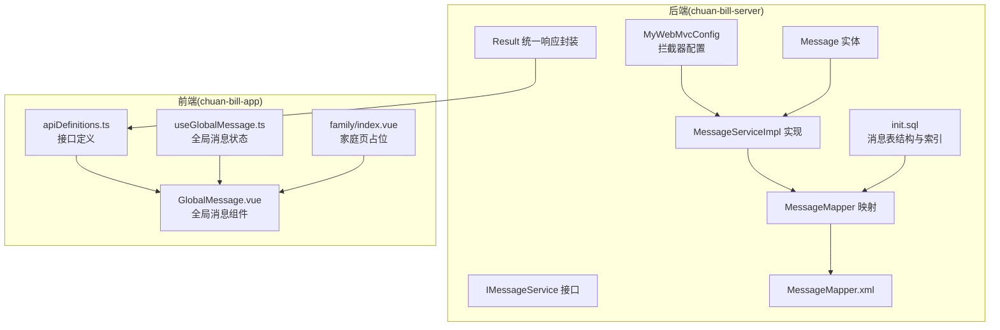
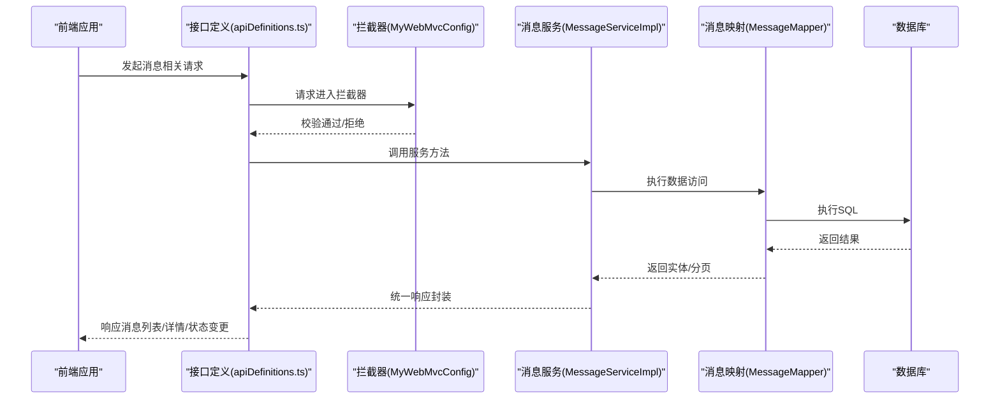
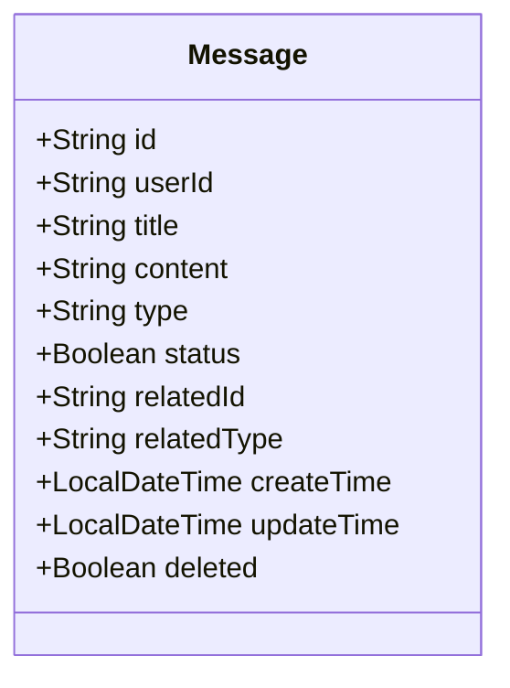
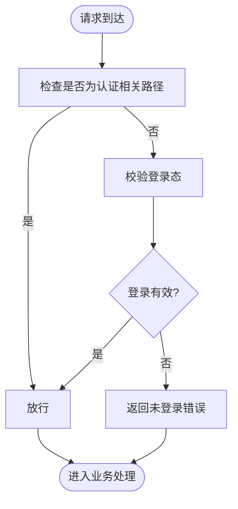
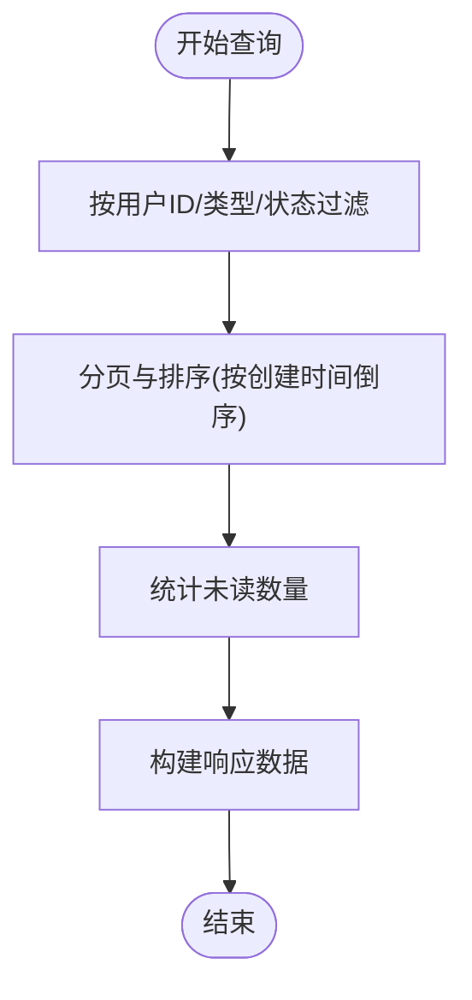
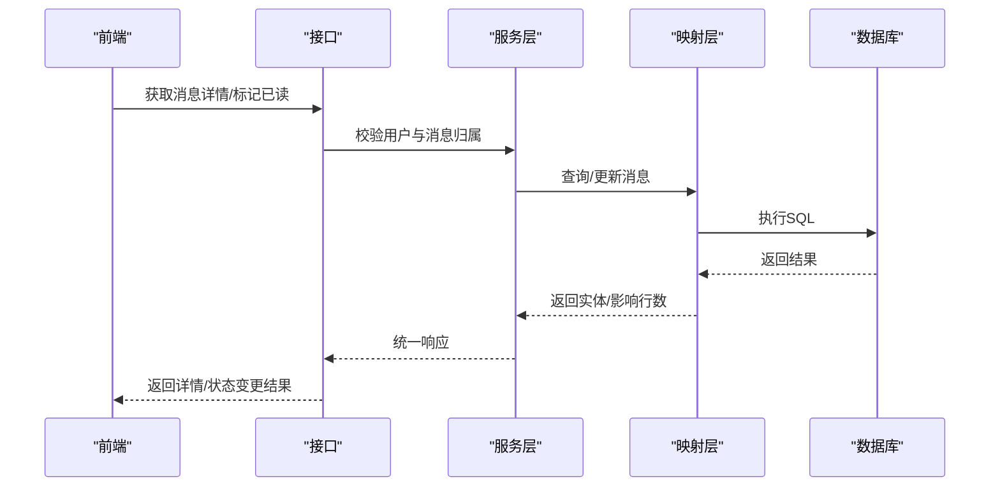
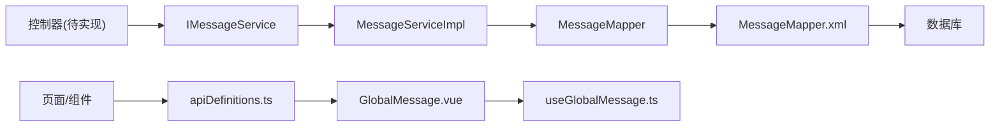
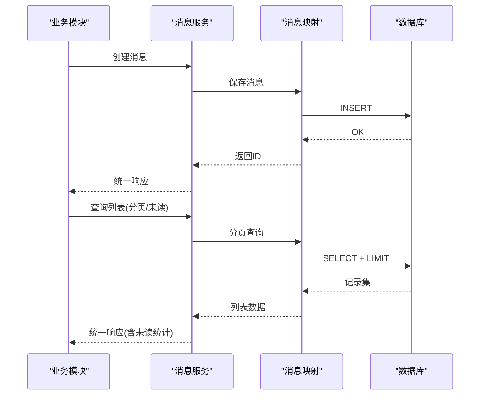

# 家庭消息通知接口

<cite>
**本文档引用的文件**
- [Message.java](file://chuan-bill-server/src/main/java/com/samoy/chuanbillserver/entity/Message.java)
- [IMessageService.java](file://chuan-bill-server/src/main/java/com/samoy/chuanbillserver/service/IMessageService.java)
- [MessageServiceImpl.java](file://chuan-bill-server/src/main/java/com/samoy/chuanbillserver/service/impl/MessageServiceImpl.java)
- [MessageMapper.java](file://chuan-bill-server/src/main/java/com/samoy/chuanbillserver/dao/MessageMapper.java)
- [MessageMapper.xml](file://chuan-bill-server/src/main/resources/mapper/MessageMapper.xml)
- [MyWebMvcConfig.java](file://chuan-bill-server/src/main/java/com/samoy/chuanbillserver/config/MyWebMvcConfig.java)
- [Result.java](file://chuan-bill-server/src/main/java/com/samoy/chuanbillserver/result/Result.java)
- [init.sql](file://chuan-bill-server/init.sql)
- [apiDefinitions.ts](file://chuan-bill-app/src/api/apiDefinitions.ts)
- [GlobalMessage.vue](file://chuan-bill-app/src/components/GlobalMessage.vue)
- [useGlobalMessage.ts](file://chuan-bill-app/src/composables/useGlobalMessage.ts)
- [index.vue](file://chuan-bill-app/src/pages/family/index.vue)
</cite>

## 目录
1. [简介](#简介)
2. [项目结构](#项目结构)
3. [核心组件](#核心组件)
4. [架构总览](#架构总览)
5. [详细组件分析](#详细组件分析)
6. [依赖关系分析](#依赖关系分析)
7. [性能考虑](#性能考虑)
8. [故障排查指南](#故障排查指南)
9. [结论](#结论)
10. [附录](#附录)

## 简介
本文件面向家庭消息通知接口的完整API文档，覆盖消息发送、消息接收、消息查询、消息状态管理等核心能力，并对消息实体模型设计、消息类型分类、消息状态管理进行深入说明。同时提供消息列表查询接口说明（未读消息统计、消息分类查询、消息详情获取）、消息权限控制机制、接收者权限验证、消息可见性控制、消息推送策略与实时通知机制、消息存储策略等。文档包含完整的业务流程示例、接口调用顺序、消息格式规范与错误处理策略，帮助前后端协同开发与集成。

## 项目结构
后端采用Spring Boot + MyBatis-Plus架构，消息模块位于服务端工程中；前端基于Vue 3 + UniApp生态，提供全局消息组件与消息弹窗展示能力。数据库初始化脚本包含消息表结构定义及索引设计。



**图表来源**
- [MyWebMvcConfig.java:1-21](file://chuan-bill-server/src/main/java/com/samoy/chuanbillserver/config/MyWebMvcConfig.java#L1-L21)
- [Message.java:1-94](file://chuan-bill-server/src/main/java/com/samoy/chuanbillserver/entity/Message.java#L1-L94)
- [IMessageService.java:1-15](file://chuan-bill-server/src/main/java/com/samoy/chuanbillserver/service/IMessageService.java#L1-L15)
- [MessageServiceImpl.java:1-19](file://chuan-bill-server/src/main/java/com/samoy/chuanbillserver/service/impl/MessageServiceImpl.java#L1-L19)
- [MessageMapper.java:1-15](file://chuan-bill-server/src/main/java/com/samoy/chuanbillserver/dao/MessageMapper.java#L1-L15)
- [MessageMapper.xml:1-6](file://chuan-bill-server/src/main/resources/mapper/MessageMapper.xml#L1-L6)
- [Result.java:1-50](file://chuan-bill-server/src/main/java/com/samoy/chuanbillserver/result/Result.java#L1-L50)
- [init.sql:180-201](file://chuan-bill-server/init.sql#L180-L201)
- [apiDefinitions.ts:1-38](file://chuan-bill-app/src/api/apiDefinitions.ts#L1-L38)
- [GlobalMessage.vue:1-56](file://chuan-bill-app/src/components/GlobalMessage.vue#L1-L56)
- [useGlobalMessage.ts:1-53](file://chuan-bill-app/src/composables/useGlobalMessage.ts#L1-L53)
- [index.vue:1-23](file://chuan-bill-app/src/pages/family/index.vue#L1-L23)

**章节来源**
- [MyWebMvcConfig.java:1-21](file://chuan-bill-server/src/main/java/com/samoy/chuanbillserver/config/MyWebMvcConfig.java#L1-L21)
- [Message.java:1-94](file://chuan-bill-server/src/main/java/com/samoy/chuanbillserver/entity/Message.java#L1-L94)
- [IMessageService.java:1-15](file://chuan-bill-server/src/main/java/com/samoy/chuanbillserver/service/IMessageService.java#L1-L15)
- [MessageServiceImpl.java:1-19](file://chuan-bill-server/src/main/java/com/samoy/chuanbillserver/service/impl/MessageServiceImpl.java#L1-L19)
- [MessageMapper.java:1-15](file://chuan-bill-server/src/main/java/com/samoy/chuanbillserver/dao/MessageMapper.java#L1-L15)
- [MessageMapper.xml:1-6](file://chuan-bill-server/src/main/resources/mapper/MessageMapper.xml#L1-L6)
- [Result.java:1-50](file://chuan-bill-server/src/main/java/com/samoy/chuanbillserver/result/Result.java#L1-L50)
- [init.sql:180-201](file://chuan-bill-server/init.sql#L180-L201)
- [apiDefinitions.ts:1-38](file://chuan-bill-app/src/api/apiDefinitions.ts#L1-L38)
- [GlobalMessage.vue:1-56](file://chuan-bill-app/src/components/GlobalMessage.vue#L1-L56)
- [useGlobalMessage.ts:1-53](file://chuan-bill-app/src/composables/useGlobalMessage.ts#L1-L53)
- [index.vue:1-23](file://chuan-bill-app/src/pages/family/index.vue#L1-L23)

## 核心组件
- 消息实体模型：定义消息ID、用户ID、标题、内容、类型、状态、关联ID与类型、创建/更新时间、删除标记等字段，支持按用户与状态组合索引优化查询。
- 服务层接口与实现：提供消息CRUD与分页查询能力，基于MyBatis-Plus简化数据访问。
- 数据访问层：通过Mapper接口与XML映射文件完成SQL执行。
- 统一响应封装：Result类提供成功/失败响应模板与时间戳。
- 权限控制：基于Sa-Token拦截器实现登录态校验，除认证相关路径外全站拦截。

**章节来源**
- [Message.java:24-92](file://chuan-bill-server/src/main/java/com/samoy/chuanbillserver/entity/Message.java#L24-L92)
- [IMessageService.java:1-15](file://chuan-bill-server/src/main/java/com/samoy/chuanbillserver/service/IMessageService.java#L1-L15)
- [MessageServiceImpl.java:1-19](file://chuan-bill-server/src/main/java/com/samoy/chuanbillserver/service/impl/MessageServiceImpl.java#L1-L19)
- [MessageMapper.java:1-15](file://chuan-bill-server/src/main/java/com/samoy/chuanbillserver/dao/MessageMapper.java#L1-L15)
- [MessageMapper.xml:1-6](file://chuan-bill-server/src/main/resources/mapper/MessageMapper.xml#L1-L6)
- [Result.java:12-48](file://chuan-bill-server/src/main/java/com/samoy/chuanbillserver/result/Result.java#L12-L48)
- [MyWebMvcConfig.java:10-19](file://chuan-bill-server/src/main/java/com/samoy/chuanbillserver/config/MyWebMvcConfig.java#L10-L19)

## 架构总览
消息通知接口遵循“请求-鉴权-服务-持久化”的标准分层架构。前端通过统一的接口定义发起请求，后端经由拦截器进行登录态校验，随后调用服务层处理业务逻辑，最终通过Mapper访问数据库。统一响应封装保证前后端交互的一致性。



**图表来源**
- [apiDefinitions.ts:19-37](file://chuan-bill-app/src/api/apiDefinitions.ts#L19-L37)
- [MyWebMvcConfig.java:10-19](file://chuan-bill-server/src/main/java/com/samoy/chuanbillserver/config/MyWebMvcConfig.java#L10-L19)
- [MessageServiceImpl.java:1-19](file://chuan-bill-server/src/main/java/com/samoy/chuanbillserver/service/impl/MessageServiceImpl.java#L1-L19)
- [MessageMapper.java:1-15](file://chuan-bill-server/src/main/java/com/samoy/chuanbillserver/dao/MessageMapper.java#L1-L15)
- [Result.java:12-48](file://chuan-bill-server/src/main/java/com/samoy/chuanbillserver/result/Result.java#L12-L48)

## 详细组件分析

### 消息实体模型设计
消息实体包含以下关键字段：
- 标识与归属：消息ID、用户ID
- 内容与元信息：标题、内容、创建/更新时间、删除标记
- 分类与状态：类型（system/family/bill/budget）、状态（未读/已读）
- 关联信息：相关ID与相关类型（family/bill/budget）



**图表来源**
- [Message.java:24-92](file://chuan-bill-server/src/main/java/com/samoy/chuanbillserver/entity/Message.java#L24-L92)

**章节来源**
- [Message.java:24-92](file://chuan-bill-server/src/main/java/com/samoy/chuanbillserver/entity/Message.java#L24-L92)
- [init.sql:183-201](file://chuan-bill-server/init.sql#L183-L201)

### 消息类型与状态管理
- 消息类型：system（系统消息）、family（家庭相关消息）、bill（账单相关消息）、budget（预算相关消息）
- 消息状态：0（未读）、1（已读）
- 关联关系：related_id与related_type用于指向具体业务对象（如家庭ID、账单ID、预算ID），便于跳转与详情展示

**章节来源**
- [Message.java:52-74](file://chuan-bill-server/src/main/java/com/samoy/chuanbillserver/entity/Message.java#L52-L74)
- [init.sql:189-192](file://chuan-bill-server/init.sql#L189-L192)

### 权限控制与拦截机制
- 登录拦截：所有受保护路径均需登录态，认证相关路径除外
- 全局拦截：通过Sa-Token拦截器统一校验，确保接口安全



**图表来源**
- [MyWebMvcConfig.java:10-19](file://chuan-bill-server/src/main/java/com/samoy/chuanbillserver/config/MyWebMvcConfig.java#L10-L19)

**章节来源**
- [MyWebMvcConfig.java:10-19](file://chuan-bill-server/src/main/java/com/samoy/chuanbillserver/config/MyWebMvcConfig.java#L10-L19)

### 消息列表查询与未读统计
- 查询维度：按用户ID、消息类型、状态（未读/已读）进行筛选
- 性能优化：利用用户+状态复合索引提升查询效率
- 未读统计：可按用户聚合统计未读数量，用于前端徽标显示



**图表来源**
- [init.sql:196-200](file://chuan-bill-server/init.sql#L196-L200)
- [MessageMapper.xml:1-6](file://chuan-bill-server/src/main/resources/mapper/MessageMapper.xml#L1-L6)

**章节来源**
- [init.sql:196-200](file://chuan-bill-server/init.sql#L196-L200)
- [MessageMapper.xml:1-6](file://chuan-bill-server/src/main/resources/mapper/MessageMapper.xml#L1-L6)

### 消息详情与状态变更
- 详情获取：按消息ID查询，返回完整消息内容与关联信息
- 状态变更：支持将消息标记为已读，更新状态字段并记录更新时间
- 可见性控制：仅允许消息所属用户查看或修改其消息



**图表来源**
- [MessageServiceImpl.java:1-19](file://chuan-bill-server/src/main/java/com/samoy/chuanbillserver/service/impl/MessageServiceImpl.java#L1-L19)
- [MessageMapper.java:1-15](file://chuan-bill-server/src/main/java/com/samoy/chuanbillserver/dao/MessageMapper.java#L1-L15)
- [Result.java:12-48](file://chuan-bill-server/src/main/java/com/samoy/chuanbillserver/result/Result.java#L12-L48)

**章节来源**
- [MessageServiceImpl.java:1-19](file://chuan-bill-server/src/main/java/com/samoy/chuanbillserver/service/impl/MessageServiceImpl.java#L1-L19)
- [MessageMapper.java:1-15](file://chuan-bill-server/src/main/java/com/samoy/chuanbillserver/dao/MessageMapper.java#L1-L15)
- [Result.java:12-48](file://chuan-bill-server/src/main/java/com/samoy/chuanbillserver/result/Result.java#L12-L48)

### 前端消息展示与交互
- 全局消息组件：在页面切换时自动弹出消息框，支持确认/取消回调
- 消息状态管理：通过Pinia Store维护当前消息选项与页面路径，避免跨页误触发
- 家庭页占位：提供基础页面结构，后续可扩展消息入口与导航

```mermaid
sequenceDiagram
participant PAGE as "页面"
participant STORE as "useGlobalMessage"
participant COMP as "GlobalMessage"
participant BOX as "消息框(wd-message-box)"
PAGE->>STORE : 设置消息选项
STORE->>COMP : 传递消息参数
COMP->>BOX : 展示消息框
BOX-->>COMP : 用户交互(确认/取消)
COMP-->>STORE : 回调success/fail
STORE-->>PAGE : 清空消息选项
```

**图表来源**
- [useGlobalMessage.ts:14-52](file://chuan-bill-app/src/composables/useGlobalMessage.ts#L14-L52)
- [GlobalMessage.vue:17-35](file://chuan-bill-app/src/components/GlobalMessage.vue#L17-L35)
- [index.vue:1-23](file://chuan-bill-app/src/pages/family/index.vue#L1-L23)

**章节来源**
- [useGlobalMessage.ts:1-53](file://chuan-bill-app/src/composables/useGlobalMessage.ts#L1-L53)
- [GlobalMessage.vue:1-56](file://chuan-bill-app/src/components/GlobalMessage.vue#L1-L56)
- [index.vue:1-23](file://chuan-bill-app/src/pages/family/index.vue#L1-L23)

## 依赖关系分析
- 后端依赖链：控制器 → 服务接口 → 服务实现 → Mapper → XML映射 → 数据库
- 前端依赖链：页面/组件 → 接口定义 → 全局消息组件/Store
- 关键耦合点：服务层与数据访问层解耦，统一响应封装贯穿前后端



**图表来源**
- [IMessageService.java:1-15](file://chuan-bill-server/src/main/java/com/samoy/chuanbillserver/service/IMessageService.java#L1-L15)
- [MessageServiceImpl.java:1-19](file://chuan-bill-server/src/main/java/com/samoy/chuanbillserver/service/impl/MessageServiceImpl.java#L1-L19)
- [MessageMapper.java:1-15](file://chuan-bill-server/src/main/java/com/samoy/chuanbillserver/dao/MessageMapper.java#L1-L15)
- [MessageMapper.xml:1-6](file://chuan-bill-server/src/main/resources/mapper/MessageMapper.xml#L1-L6)
- [apiDefinitions.ts:19-37](file://chuan-bill-app/src/api/apiDefinitions.ts#L19-L37)
- [GlobalMessage.vue:1-56](file://chuan-bill-app/src/components/GlobalMessage.vue#L1-L56)
- [useGlobalMessage.ts:1-53](file://chuan-bill-app/src/composables/useGlobalMessage.ts#L1-L53)

**章节来源**
- [IMessageService.java:1-15](file://chuan-bill-server/src/main/java/com/samoy/chuanbillserver/service/IMessageService.java#L1-L15)
- [MessageServiceImpl.java:1-19](file://chuan-bill-server/src/main/java/com/samoy/chuanbillserver/service/impl/MessageServiceImpl.java#L1-L19)
- [MessageMapper.java:1-15](file://chuan-bill-server/src/main/java/com/samoy/chuanbillserver/dao/MessageMapper.java#L1-L15)
- [MessageMapper.xml:1-6](file://chuan-bill-server/src/main/resources/mapper/MessageMapper.xml#L1-L6)
- [apiDefinitions.ts:19-37](file://chuan-bill-app/src/api/apiDefinitions.ts#L19-L37)
- [GlobalMessage.vue:1-56](file://chuan-bill-app/src/components/GlobalMessage.vue#L1-L56)
- [useGlobalMessage.ts:1-53](file://chuan-bill-app/src/composables/useGlobalMessage.ts#L1-L53)

## 性能考虑
- 索引策略：用户ID、状态、类型、创建时间等字段建立合适索引，优先使用用户+状态复合索引以加速未读统计与分页查询
- 分页查询：默认按创建时间倒序分页，避免全表扫描
- 缓存建议：未读计数可引入Redis缓存，降低数据库压力
- 批量操作：批量标记已读时采用批处理SQL减少往返

[本节为通用性能建议，不直接分析具体文件]

## 故障排查指南
- 登录态异常：检查拦截器配置与登录状态，确认请求头携带正确凭证
- 查询无结果：核对用户ID与消息归属，确认未被删除标记
- 统一响应：使用Result封装，关注code/message/data字段定位问题
- 前端消息不显示：检查store中的currentPage与当前路由是否一致，确认组件渲染时机

**章节来源**
- [MyWebMvcConfig.java:10-19](file://chuan-bill-server/src/main/java/com/samoy/chuanbillserver/config/MyWebMvcConfig.java#L10-L19)
- [Result.java:12-48](file://chuan-bill-server/src/main/java/com/samoy/chuanbillserver/result/Result.java#L12-L48)
- [useGlobalMessage.ts:14-52](file://chuan-bill-app/src/composables/useGlobalMessage.ts#L14-L52)
- [GlobalMessage.vue:17-35](file://chuan-bill-app/src/components/GlobalMessage.vue#L17-L35)

## 结论
本消息通知接口以清晰的实体模型、完善的权限控制与统一响应封装为基础，结合前端全局消息组件，形成从前端展示到后端存储的完整闭环。通过合理的索引与分页策略，可满足高并发下的消息查询与状态变更需求。后续可在现有基础上扩展消息推送策略与实时通知机制，进一步提升用户体验。

[本节为总结性内容，不直接分析具体文件]

## 附录

### 接口调用顺序与业务流程示例
- 发送消息：业务侧生成消息实体 → 调用服务层保存 → 返回统一响应
- 查询消息列表：前端发起分页查询 → 后端按用户与状态过滤 → 返回消息列表与未读统计
- 标记已读：前端选择消息 → 调用状态变更接口 → 后端更新状态并返回成功



**图表来源**
- [MessageServiceImpl.java:1-19](file://chuan-bill-server/src/main/java/com/samoy/chuanbillserver/service/impl/MessageServiceImpl.java#L1-L19)
- [MessageMapper.java:1-15](file://chuan-bill-server/src/main/java/com/samoy/chuanbillserver/dao/MessageMapper.java#L1-L15)
- [Result.java:12-48](file://chuan-bill-server/src/main/java/com/samoy/chuanbillserver/result/Result.java#L12-L48)

### 消息格式规范
- 请求体字段：标题、内容、类型、关联ID与类型、接收用户ID等（依据实际业务DTO定义）
- 响应体字段：code、message、data、timestamp（统一封装）
- 错误码：参考Result枚举定义，确保前后端一致

**章节来源**
- [Result.java:12-48](file://chuan-bill-server/src/main/java/com/samoy/chuanbillserver/result/Result.java#L12-L48)

### 权限与可见性控制要点
- 登录态校验：除认证接口外，所有接口均需登录
- 数据归属：仅允许访问属于当前用户的资源
- 可见性：删除标记为已删除的消息不应返回给客户端

**章节来源**
- [MyWebMvcConfig.java:10-19](file://chuan-bill-server/src/main/java/com/samoy/chuanbillserver/config/MyWebMvcConfig.java#L10-L19)
- [Message.java:91-92](file://chuan-bill-server/src/main/java/com/samoy/chuanbillserver/entity/Message.java#L91-L92)