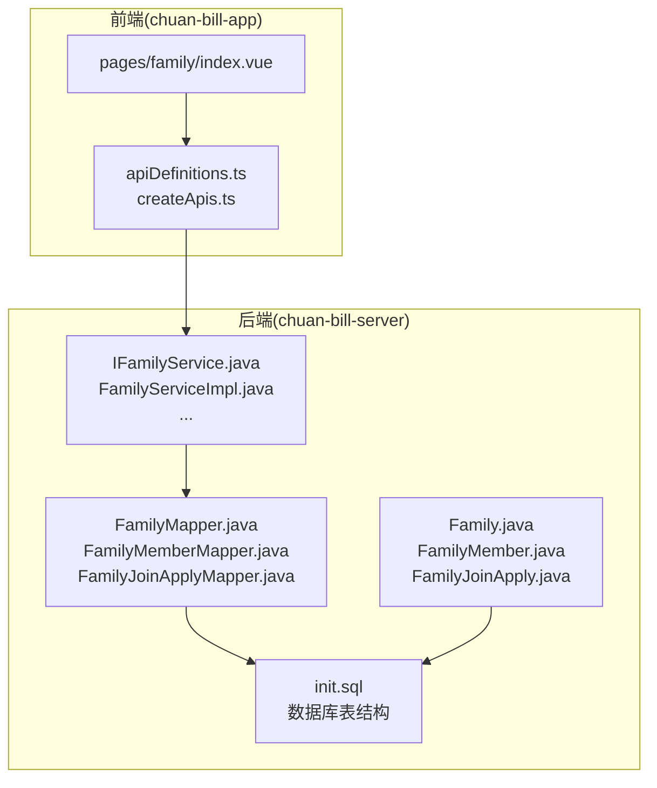
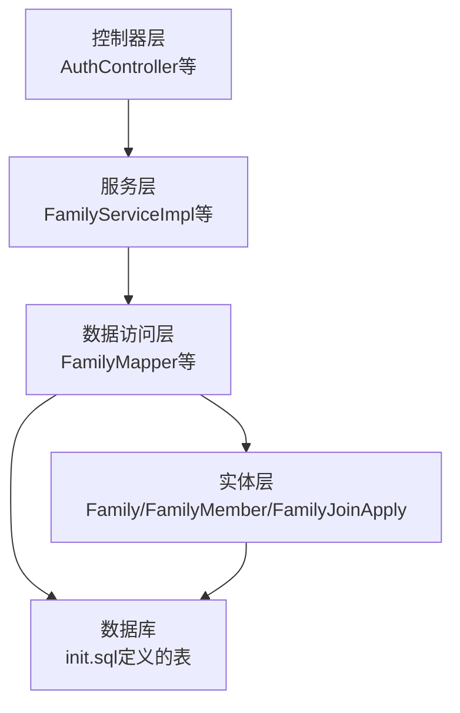
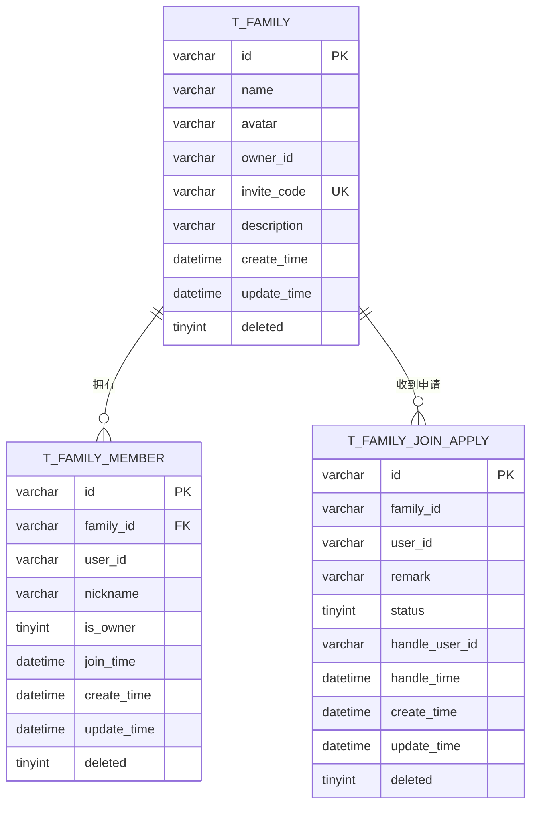
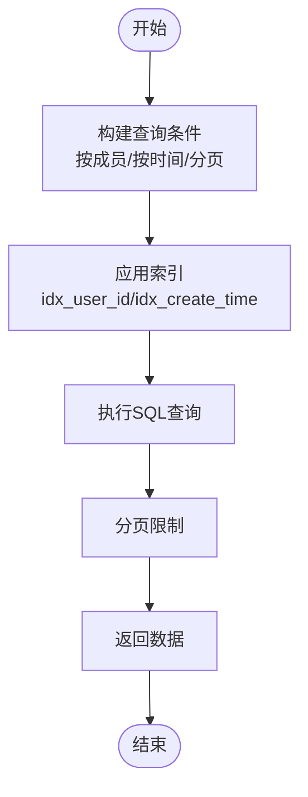
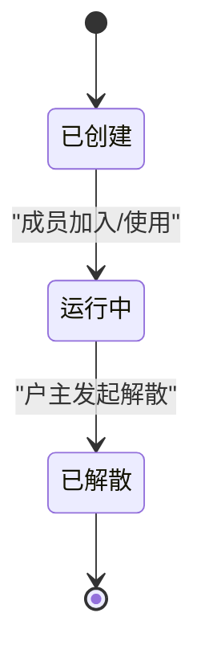
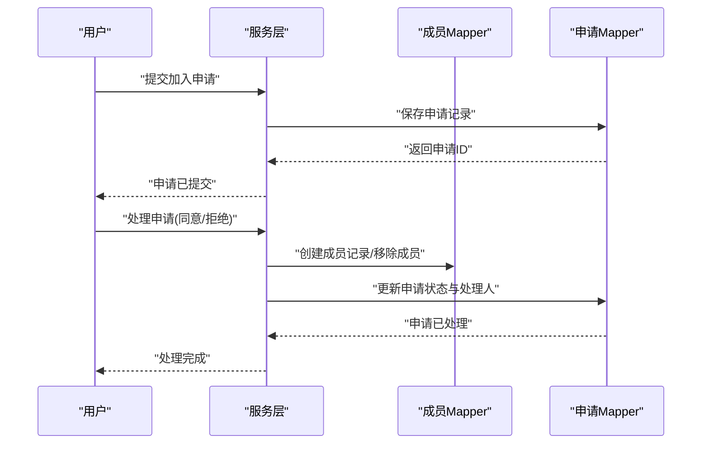
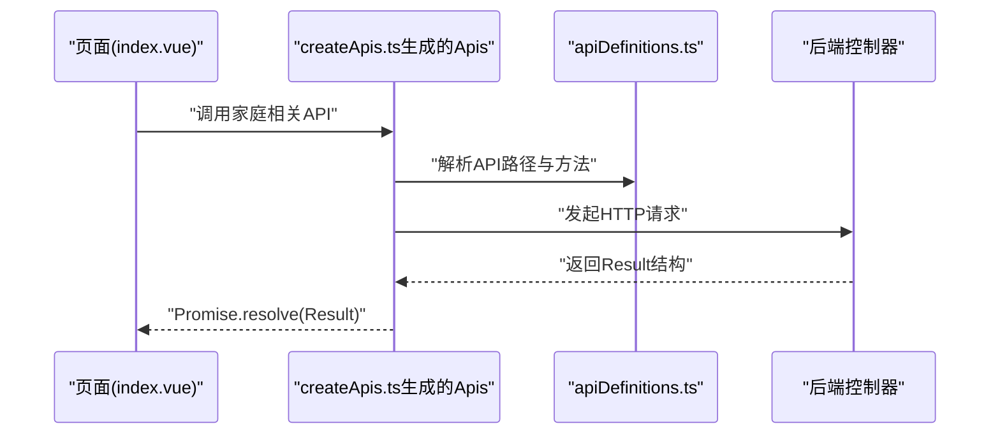
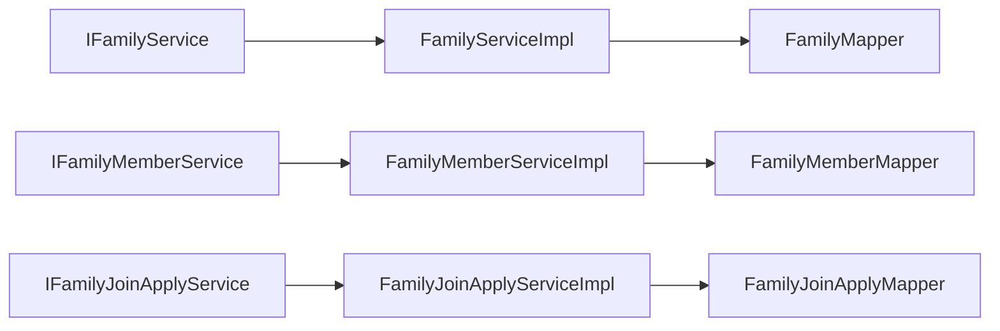

# 家庭管理接口

<cite>
**本文引用的文件**
- [Family.java](file://chuan-bill-server/src/main/java/com/samoy/chuanbillserver/entity/Family.java)
- [FamilyMember.java](file://chuan-bill-server/src/main/java/com/samoy/chuanbillserver/entity/FamilyMember.java)
- [FamilyJoinApply.java](file://chuan-bill-server/src/main/java/com/samoy/chuanbillserver/entity/FamilyJoinApply.java)
- [IFamilyService.java](file://chuan-bill-server/src/main/java/com/samoy/chuanbillserver/service/IFamilyService.java)
- [FamilyServiceImpl.java](file://chuan-bill-server/src/main/java/com/samoy/chuanbillserver/service/impl/FamilyServiceImpl.java)
- [IFamilyMemberService.java](file://chuan-bill-server/src/main/java/com/samoy/chuanbillserver/service/IFamilyMemberService.java)
- [FamilyMemberServiceImpl.java](file://chuan-bill-server/src/main/java/com/samoy/chuanbillserver/service/impl/FamilyMemberServiceImpl.java)
- [IFamilyJoinApplyService.java](file://chuan-bill-server/src/main/java/com/samoy/chuanbillserver/service/IFamilyJoinApplyService.java)
- [FamilyJoinApplyServiceImpl.java](file://chuan-bill-server/src/main/java/com/samoy/chuanbillserver/service/impl/FamilyJoinApplyServiceImpl.java)
- [FamilyMapper.java](file://chuan-bill-server/src/main/java/com/samoy/chuanbillserver/dao/FamilyMapper.java)
- [FamilyMemberMapper.java](file://chuan-bill-server/src/main/java/com/samoy/chuanbillserver/dao/FamilyMemberMapper.java)
- [FamilyJoinApplyMapper.java](file://chuan-bill-server/src/main/java/com/samoy/chuanbillserver/dao/FamilyJoinApplyMapper.java)
- [init.sql](file://chuan-bill-server/init.sql)
- [apiDefinitions.ts](file://chuan-bill-app/src/api/apiDefinitions.ts)
- [createApis.ts](file://chuan-bill-app/src/api/createApis.ts)
- [index.vue](file://chuan-bill-app/src/pages/family/index.vue)
</cite>

## 目录
1. [简介](#简介)
2. [项目结构](#项目结构)
3. [核心组件](#核心组件)
4. [架构总览](#架构总览)
5. [详细组件分析](#详细组件分析)
6. [依赖分析](#依赖分析)
7. [性能考虑](#性能考虑)
8. [故障排查指南](#故障排查指南)
9. [结论](#结论)
10. [附录](#附录)

## 简介
本文件面向“家庭管理接口”的API设计与实现，覆盖家庭创建、查询、修改、删除等核心能力，并扩展到家庭成员管理、加入申请、权限与数据隔离策略、生命周期与解散流程、以及数据清理策略。文档同时给出实体模型、字段约束、业务规则、查询接口说明（按成员、按创建时间、分页）、权限控制与管理员校验、错误处理策略与完整业务流程示例。

## 项目结构
后端采用Spring Boot + MyBatis-Plus，数据库初始化脚本中定义了家庭、家庭成员、家庭加入申请三张核心表；前端基于Vue + UniApp，通过Alova生成API定义与调用封装。

图表来源
- [apiDefinitions.ts:1-38](file://chuan-bill-app/src/api/apiDefinitions.ts#L1-L38)
- [createApis.ts:1-95](file://chuan-bill-app/src/api/createApis.ts#L1-L95)
- [index.vue:1-23](file://chuan-bill-app/src/pages/family/index.vue#L1-L23)
- [init.sql:70-128](file://chuan-bill-server/init.sql#L70-L128)
- [Family.java:1-82](file://chuan-bill-server/src/main/java/com/samoy/chuanbillserver/entity/Family.java#L1-L82)
- [FamilyMember.java:1-82](file://chuan-bill-server/src/main/java/com/samoy/chuanbillserver/entity/FamilyMember.java#L1-L82)
- [FamilyJoinApply.java:1-87](file://chuan-bill-server/src/main/java/com/samoy/chuanbillserver/entity/FamilyJoinApply.java#L1-L87)
- [IFamilyService.java:1-15](file://chuan-bill-server/src/main/java/com/samoy/chuanbillserver/service/IFamilyService.java#L1-L15)
- [FamilyServiceImpl.java:1-19](file://chuan-bill-server/src/main/java/com/samoy/chuanbillserver/service/impl/FamilyServiceImpl.java#L1-L19)
- [FamilyMapper.java:1-14](file://chuan-bill-server/src/main/java/com/samoy/chuanbillserver/dao/FamilyMapper.java#L1-L14)

章节来源
- [apiDefinitions.ts:1-38](file://chuan-bill-app/src/api/apiDefinitions.ts#L1-L38)
- [createApis.ts:1-95](file://chuan-bill-app/src/api/createApis.ts#L1-L95)
- [index.vue:1-23](file://chuan-bill-app/src/pages/family/index.vue#L1-L23)
- [init.sql:70-128](file://chuan-bill-server/init.sql#L70-L128)

## 核心组件
- 实体层：家庭(Family)、家庭成员(FamilyMember)、家庭加入申请(FamilyJoinApply)
- 服务层：家庭服务接口与实现、家庭成员服务接口与实现、家庭加入申请服务接口与实现
- 数据访问层：对应Mapper接口
- 前端API：通过apiDefinitions与createApis生成统一的API调用入口

章节来源
- [Family.java:1-82](file://chuan-bill-server/src/main/java/com/samoy/chuanbillserver/entity/Family.java#L1-L82)
- [FamilyMember.java:1-82](file://chuan-bill-server/src/main/java/com/samoy/chuanbillserver/entity/FamilyMember.java#L1-L82)
- [FamilyJoinApply.java:1-87](file://chuan-bill-server/src/main/java/com/samoy/chuanbillserver/entity/FamilyJoinApply.java#L1-L87)
- [IFamilyService.java:1-15](file://chuan-bill-server/src/main/java/com/samoy/chuanbillserver/service/IFamilyService.java#L1-L15)
- [FamilyServiceImpl.java:1-19](file://chuan-bill-server/src/main/java/com/samoy/chuanbillserver/service/impl/FamilyServiceImpl.java#L1-L19)
- [IFamilyMemberService.java:1-14](file://chuan-bill-server/src/main/java/com/samoy/chuanbillserver/service/IFamilyMemberService.java#L1-L14)
- [FamilyMemberServiceImpl.java:1-19](file://chuan-bill-server/src/main/java/com/samoy/chuanbillserver/service/impl/FamilyMemberServiceImpl.java#L1-L19)
- [IFamilyJoinApplyService.java:1-14](file://chuan-bill-server/src/main/java/com/samoy/chuanbillserver/service/IFamilyJoinApplyService.java#L1-L14)
- [FamilyJoinApplyServiceImpl.java:1-19](file://chuan-bill-server/src/main/java/com/samoy/chuanbillserver/service/impl/FamilyJoinApplyServiceImpl.java#L1-L19)
- [FamilyMapper.java:1-14](file://chuan-bill-server/src/main/java/com/samoy/chuanbillserver/dao/FamilyMapper.java#L1-L14)
- [FamilyMemberMapper.java:1-15](file://chuan-bill-server/src/main/java/com/samoy/chuanbillserver/dao/FamilyMemberMapper.java#L1-L15)
- [FamilyJoinApplyMapper.java:1-14](file://chuan-bill-server/src/main/java/com/samoy/chuanbillserver/dao/FamilyJoinApplyMapper.java#L1-L14)

## 架构总览
后端采用分层架构：控制器(Controller)接收请求，服务(Service)处理业务逻辑，数据访问(DAO)与MyBatis-Plus交互数据库，实体(Entity)映射表结构。前端通过Alova生成的API定义统一发起HTTP请求。

图表来源
- [AuthController.java:1-66](file://chuan-bill-server/src/main/java/com/samoy/chuanbillserver/controller/AuthController.java#L1-L66)
- [FamilyServiceImpl.java:1-19](file://chuan-bill-server/src/main/java/com/samoy/chuanbillserver/service/impl/FamilyServiceImpl.java#L1-L19)
- [FamilyMapper.java:1-14](file://chuan-bill-server/src/main/java/com/samoy/chuanbillserver/dao/FamilyMapper.java#L1-L14)
- [Family.java:1-82](file://chuan-bill-server/src/main/java/com/samoy/chuanbillserver/entity/Family.java#L1-L82)
- [init.sql:70-128](file://chuan-bill-server/init.sql#L70-L128)

## 详细组件分析

### 家庭实体模型与字段约束
- 家庭表(t_family)
  - 主键：id(字符串，唯一)
  - 名称：name(非空，最大长度64)
  - 图标：avatar(可空，最大长度512)
  - 户主：owner_id(非空，外键关联用户)
  - 邀请码：invite_code(非空，唯一索引)
  - 描述：description(可空，最大长度256)
  - 时间：create_time、update_time(默认值与自动更新)
  - 删除标记：deleted(0未删，1已删)
  - 索引：唯一索引(invite_code)，普通索引(owner_id)

- 家庭成员表(t_family_member)
  - 主键：id(字符串，唯一)
  - 家庭：family_id(非空，外键关联t_family)
  - 用户：user_id(非空)
  - 昵称：nickname(非空，最大长度64)
  - 户主标识：is_owner(0否，1是)
  - 加入时间：join_time(默认当前时间)
  - 时间：create_time、update_time(默认值与自动更新)
  - 删除标记：deleted(0未删，1已删)
  - 约束：联合唯一索引(family_id,user_id)，普通索引(family_id,user_id,is_owner)

- 家庭加入申请表(t_family_join_apply)
  - 主键：id(字符串，唯一)
  - 家庭：family_id(非空)
  - 用户：user_id(非空)
  - 备注：remark(非空，最大长度256)
  - 状态：status(0待处理，1同意，2拒绝)
  - 处理人：handle_user_id(非空)
  - 处理时间：handle_time(可空)
  - 时间：create_time、update_time(默认值与自动更新)
  - 删除标记：deleted(0未删，1已删)
  - 索引：普通索引(family_id,user_id,status,create_time)

图表来源
- [init.sql:70-128](file://chuan-bill-server/init.sql#L70-L128)

章节来源
- [init.sql:70-128](file://chuan-bill-server/init.sql#L70-L128)
- [Family.java:1-82](file://chuan-bill-server/src/main/java/com/samoy/chuanbillserver/entity/Family.java#L1-L82)
- [FamilyMember.java:1-82](file://chuan-bill-server/src/main/java/com/samoy/chuanbillserver/entity/FamilyMember.java#L1-L82)
- [FamilyJoinApply.java:1-87](file://chuan-bill-server/src/main/java/com/samoy/chuanbillserver/entity/FamilyJoinApply.java#L1-L87)

### 家庭查询接口说明
- 按成员查询
  - 查询条件：家庭成员表中的user_id
  - 返回：该用户所属的所有家庭列表
  - 索引利用：idx_user_id
- 按创建时间查询
  - 查询条件：家庭表的create_time
  - 返回：按时间排序的家庭列表
  - 索引利用：idx_create_time(在账单表中存在，家庭表亦建议维护)
- 分页查询
  - 参数：page、size
  - 返回：分页后的家庭列表
  - 索引利用：主键id或复合索引

图表来源
- [init.sql:70-128](file://chuan-bill-server/init.sql#L70-L128)

章节来源
- [init.sql:70-128](file://chuan-bill-server/init.sql#L70-L128)

### 权限控制机制与数据隔离
- 户主权限
  - 家庭成员表的is_owner字段标识户主身份
  - 户主具备对家庭的修改、删除、成员管理等高级权限
- 数据隔离
  - 家庭成员表通过family_id隔离不同家庭的数据
  - 查询与写入均需携带当前用户上下文，确保仅访问其所属家庭
- 管理员权限验证
  - 可通过额外的管理员角色表或配置中心进行授权校验
  - 对敏感操作（如强制删除、批量清理）应增加管理员二次确认

章节来源
- [FamilyMember.java:1-82](file://chuan-bill-server/src/main/java/com/samoy/chuanbillserver/entity/FamilyMember.java#L1-L82)
- [init.sql:90-107](file://chuan-bill-server/init.sql#L90-L107)

### 家庭生命周期管理与解散流程
- 生命周期阶段
  - 创建：生成家庭记录、生成唯一邀请码、设置户主
  - 运行：成员加入、账单与预算共享、消息通知
  - 解散：标记deleted=1，停止共享数据，保留历史账单与预算
- 解散流程
  1) 户主发起解散
  2) 校验户主身份与无未处理申请
  3) 标记家庭deleted=1
  4) 清理共享数据（如共享账单、预算）并保留历史
  5) 通知成员并移除成员关系
- 数据清理策略
  - 软删除：deleted=1，便于审计与恢复
  - 历史保留：账单、预算等历史数据保留，仅停止共享

图表来源
- [Family.java:1-82](file://chuan-bill-server/src/main/java/com/samoy/chuanbillserver/entity/Family.java#L1-L82)
- [FamilyMember.java:1-82](file://chuan-bill-server/src/main/java/com/samoy/chuanbillserver/entity/FamilyMember.java#L1-L82)

章节来源
- [Family.java:1-82](file://chuan-bill-server/src/main/java/com/samoy/chuanbillserver/entity/Family.java#L1-L82)
- [FamilyMember.java:1-82](file://chuan-bill-server/src/main/java/com/samoy/chuanbillserver/entity/FamilyMember.java#L1-L82)

### 家庭加入申请与成员管理
- 加入申请
  - 用户提交申请，包含family_id、user_id、remark
  - 户主或管理员处理申请（同意/拒绝），记录handle_user_id与handle_time
- 成员管理
  - 新成员加入：插入t_family_member，设置join_time
  - 成员退出：标记deleted=1或物理删除（视策略）
  - 户主变更：更新is_owner字段并同步权限

图表来源
- [FamilyJoinApply.java:1-87](file://chuan-bill-server/src/main/java/com/samoy/chuanbillserver/entity/FamilyJoinApply.java#L1-L87)
- [FamilyJoinApplyServiceImpl.java:1-19](file://chuan-bill-server/src/main/java/com/samoy/chuanbillserver/service/impl/FamilyJoinApplyServiceImpl.java#L1-L19)
- [FamilyJoinApplyMapper.java:1-14](file://chuan-bill-server/src/main/java/com/samoy/chuanbillserver/dao/FamilyJoinApplyMapper.java#L1-L14)
- [FamilyMember.java:1-82](file://chuan-bill-server/src/main/java/com/samoy/chuanbillserver/entity/FamilyMember.java#L1-L82)

章节来源
- [FamilyJoinApply.java:1-87](file://chuan-bill-server/src/main/java/com/samoy/chuanbillserver/entity/FamilyJoinApply.java#L1-L87)
- [FamilyJoinApplyServiceImpl.java:1-19](file://chuan-bill-server/src/main/java/com/samoy/chuanbillserver/service/impl/FamilyJoinApplyServiceImpl.java#L1-L19)
- [FamilyJoinApplyMapper.java:1-14](file://chuan-bill-server/src/main/java/com/samoy/chuanbillserver/dao/FamilyJoinApplyMapper.java#L1-L14)
- [FamilyMember.java:1-82](file://chuan-bill-server/src/main/java/com/samoy/chuanbillserver/entity/FamilyMember.java#L1-L82)

### 前端API与调用封装
- 前端通过apiDefinitions.ts定义API路径，createApis.ts基于Alova生成方法调用
- 当前接口定义中未包含家庭管理相关路径，可在apiDefinitions.ts中补充

图表来源
- [index.vue:1-23](file://chuan-bill-app/src/pages/family/index.vue#L1-L23)
- [createApis.ts:1-95](file://chuan-bill-app/src/api/createApis.ts#L1-L95)
- [apiDefinitions.ts:1-38](file://chuan-bill-app/src/api/apiDefinitions.ts#L1-L38)

章节来源
- [index.vue:1-23](file://chuan-bill-app/src/pages/family/index.vue#L1-L23)
- [createApis.ts:1-95](file://chuan-bill-app/src/api/createApis.ts#L1-L95)
- [apiDefinitions.ts:1-38](file://chuan-bill-app/src/api/apiDefinitions.ts#L1-L38)

## 依赖分析
- 组件耦合
  - 服务层依赖DAO层，DAO层依赖MyBatis-Plus与数据库
  - 实体层与数据库表一一对应，字段与索引约束清晰
- 外部依赖
  - Spring Boot、MyBatis-Plus、Swagger注解用于接口文档与校验
- 潜在风险
  - 前端API定义缺失家庭管理接口，需补充
  - 权限校验与管理员校验逻辑需在控制器层实现

图表来源
- [IFamilyService.java:1-15](file://chuan-bill-server/src/main/java/com/samoy/chuanbillserver/service/IFamilyService.java#L1-L15)
- [FamilyServiceImpl.java:1-19](file://chuan-bill-server/src/main/java/com/samoy/chuanbillserver/service/impl/FamilyServiceImpl.java#L1-L19)
- [IFamilyMemberService.java:1-14](file://chuan-bill-server/src/main/java/com/samoy/chuanbillserver/service/IFamilyMemberService.java#L1-L14)
- [FamilyMemberServiceImpl.java:1-19](file://chuan-bill-server/src/main/java/com/samoy/chuanbillserver/service/impl/FamilyMemberServiceImpl.java#L1-L19)
- [IFamilyJoinApplyService.java:1-14](file://chuan-bill-server/src/main/java/com/samoy/chuanbillserver/service/IFamilyJoinApplyService.java#L1-L14)
- [FamilyJoinApplyServiceImpl.java:1-19](file://chuan-bill-server/src/main/java/com/samoy/chuanbillserver/service/impl/FamilyJoinApplyServiceImpl.java#L1-L19)
- [FamilyMapper.java:1-14](file://chuan-bill-server/src/main/java/com/samoy/chuanbillserver/dao/FamilyMapper.java#L1-L14)
- [FamilyMemberMapper.java:1-15](file://chuan-bill-server/src/main/java/com/samoy/chuanbillserver/dao/FamilyMemberMapper.java#L1-L15)
- [FamilyJoinApplyMapper.java:1-14](file://chuan-bill-server/src/main/java/com/samoy/chuanbillserver/dao/FamilyJoinApplyMapper.java#L1-L14)

章节来源
- [IFamilyService.java:1-15](file://chuan-bill-server/src/main/java/com/samoy/chuanbillserver/service/IFamilyService.java#L1-L15)
- [FamilyServiceImpl.java:1-19](file://chuan-bill-server/src/main/java/com/samoy/chuanbillserver/service/impl/FamilyServiceImpl.java#L1-L19)
- [IFamilyMemberService.java:1-14](file://chuan-bill-server/src/main/java/com/samoy/chuanbillserver/service/IFamilyMemberService.java#L1-L14)
- [FamilyMemberServiceImpl.java:1-19](file://chuan-bill-server/src/main/java/com/samoy/chuanbillserver/service/impl/FamilyMemberServiceImpl.java#L1-L19)
- [IFamilyJoinApplyService.java:1-14](file://chuan-bill-server/src/main/java/com/samoy/chuanbillserver/service/IFamilyJoinApplyService.java#L1-L14)
- [FamilyJoinApplyServiceImpl.java:1-19](file://chuan-bill-server/src/main/java/com/samoy/chuanbillserver/service/impl/FamilyJoinApplyServiceImpl.java#L1-L19)
- [FamilyMapper.java:1-14](file://chuan-bill-server/src/main/java/com/samoy/chuanbillserver/dao/FamilyMapper.java#L1-L14)
- [FamilyMemberMapper.java:1-15](file://chuan-bill-server/src/main/java/com/samoy/chuanbillserver/dao/FamilyMemberMapper.java#L1-L15)
- [FamilyJoinApplyMapper.java:1-14](file://chuan-bill-server/src/main/java/com/samoy/chuanbillserver/dao/FamilyJoinApplyMapper.java#L1-L14)

## 性能考虑
- 索引优化
  - t_family：invite_code唯一索引，owner_id普通索引
  - t_family_member：联合唯一索引(family_id,user_id)，普通索引(family_id,user_id,is_owner)
  - t_family_join_apply：多列索引(family_id,user_id,status,create_time)
- 查询优化
  - 使用精确匹配与范围查询结合，避免全表扫描
  - 分页查询时优先使用主键或索引列排序
- 写入优化
  - 批量插入成员与申请时减少事务开销
  - 控制并发下的重复申请与重复加入

## 故障排查指南
- 常见错误
  - 邀请码不存在：检查invite_code是否正确且未被软删除
  - 重复加入：检查联合唯一索引(idx_family_user)冲突
  - 权限不足：校验is_owner或管理员身份
- 错误处理策略
  - 返回统一Result结构，包含状态码与错误信息
  - 对于重复、冲突、权限不足等情况，返回明确提示
- 日志与监控
  - 记录关键操作日志（创建、加入、解散、删除）
  - 监控慢查询与高并发场景下的性能指标

## 结论
本方案提供了清晰的家庭实体模型与权限控制策略，明确了查询、成员管理、加入申请、生命周期与解散流程。建议尽快完善前端API定义与控制器层的权限校验逻辑，确保接口安全与可用性。

## 附录
- API定义补充建议
  - 在apiDefinitions.ts中新增家庭相关接口路径，如“family.create”、“family.listByMember”、“family.update”、“family.delete”
  - 使用createApis.ts生成对应的调用方法，保持前后端一致的命名规范
- 字段约束与业务规则
  - 家庭名称与邀请码必填且唯一
  - 成员加入需经户主或管理员处理
  - 解散前需清理共享数据并保留历史