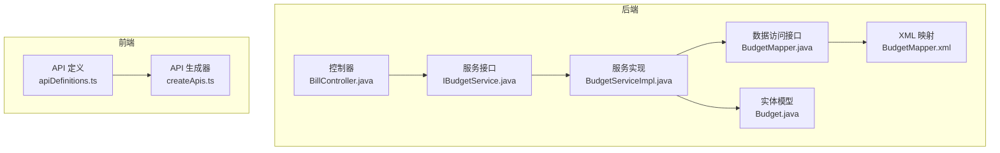
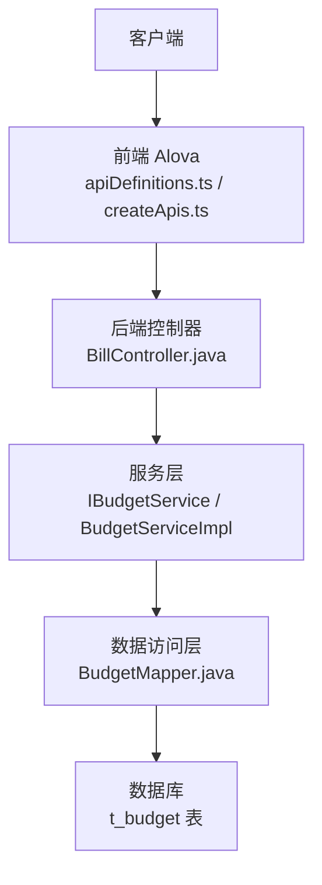
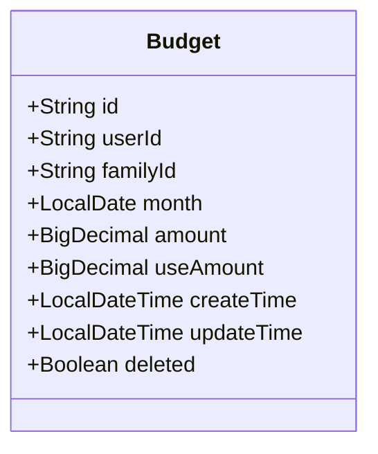
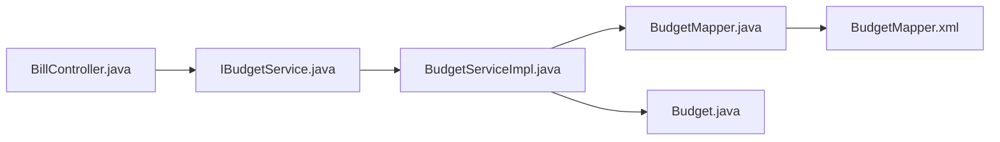
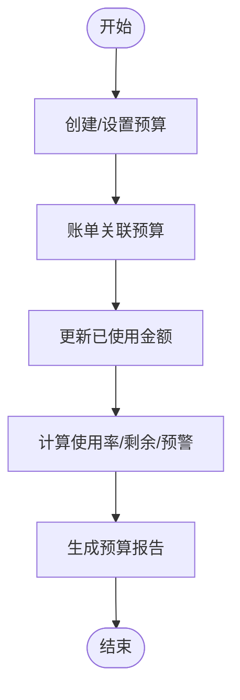
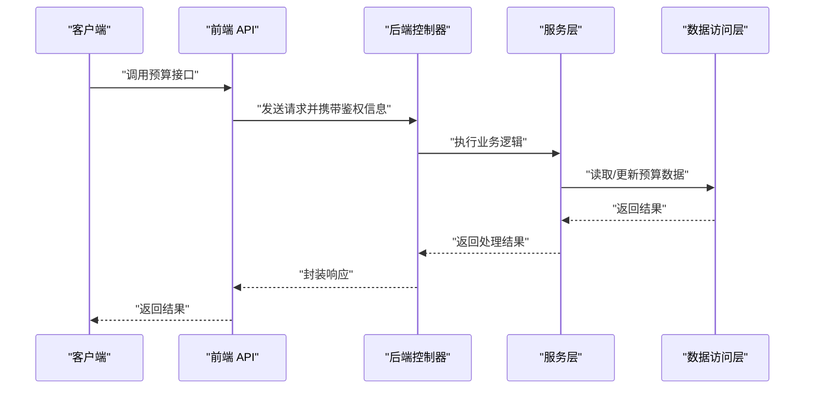

# 家庭预算接口

<cite>
**本文引用的文件**
- [Budget.java](file://chuan-bill-server/src/main/java/com/samoy/chuanbillserver/entity/Budget.java)
- [IBudgetService.java](file://chuan-bill-server/src/main/java/com/samoy/chuanbillserver/service/IBudgetService.java)
- [BudgetServiceImpl.java](file://chuan-bill-server/src/main/java/com/samoy/chuanbillserver/service/impl/BudgetServiceImpl.java)
- [BudgetMapper.java](file://chuan-bill-server/src/main/java/com/samoy/chuanbillserver/dao/BudgetMapper.java)
- [BudgetMapper.xml](file://chuan-bill-server/src/main/resources/mapper/BudgetMapper.xml)
- [BillController.java](file://chuan-bill-server/src/main/java/com/samoy/chuanbillserver/controller/BillController.java)
- [apiDefinitions.ts](file://chuan-bill-app/src/api/apiDefinitions.ts)
- [createApis.ts](file://chuan-bill-app/src/api/createApis.ts)
</cite>

## 目录
1. [简介](#简介)
2. [项目结构](#项目结构)
3. [核心组件](#核心组件)
4. [架构概览](#架构概览)
5. [详细组件分析](#详细组件分析)
6. [依赖分析](#依赖分析)
7. [性能考虑](#性能考虑)
8. [故障排查指南](#故障排查指南)
9. [结论](#结论)
10. [附录](#附录)

## 简介
本文件面向“家庭预算接口”的后端与前端集成，聚焦于预算实体模型、预算周期管理、预算与账单关联机制、预算统计（使用率、剩余、预警）、权限控制与修改限制、执行监控与实时跟踪、预算报告生成等能力。当前仓库中后端预算实体与基础服务/DAO 已具备，但预算相关控制器与统计接口尚未在现有代码中实现；前端已具备通用 API 定义与生成器，可作为后续扩展的基础。

## 项目结构
- 后端采用 Spring Boot + MyBatis-Plus 架构，预算实体位于 entity 层，服务层与数据访问层分别在 service 与 dao 包中，XML 映射位于 resources/mapper。
- 前端使用 Alova 生成 API 方法，通过 apiDefinitions.ts 统一维护接口映射，createApis.ts 提供方法构造逻辑。

图表来源
- [BillController.java:23-91](file://chuan-bill-server/src/main/java/com/samoy/chuanbillserver/controller/BillController.java#L23-L91)
- [IBudgetService.java:1-15](file://chuan-bill-server/src/main/java/com/samoy/chuanbillserver/service/IBudgetService.java#L1-L15)
- [BudgetServiceImpl.java:1-19](file://chuan-bill-server/src/main/java/com/samoy/chuanbillserver/service/impl/BudgetServiceImpl.java#L1-L19)
- [BudgetMapper.java:1-15](file://chuan-bill-server/src/main/java/com/samoy/chuanbillserver/dao/BudgetMapper.java#L1-L15)
- [BudgetMapper.xml:1-6](file://chuan-bill-server/src/main/resources/mapper/BudgetMapper.xml#L1-L6)
- [Budget.java:14-84](file://chuan-bill-server/src/main/java/com/samoy/chuanbillserver/entity/Budget.java#L14-L84)
- [apiDefinitions.ts:19-38](file://chuan-bill-app/src/api/apiDefinitions.ts#L19-L38)
- [createApis.ts:18-95](file://chuan-bill-app/src/api/createApis.ts#L18-L95)

章节来源
- [Budget.java:14-84](file://chuan-bill-server/src/main/java/com/samoy/chuanbillserver/entity/Budget.java#L14-L84)
- [IBudgetService.java:1-15](file://chuan-bill-server/src/main/java/com/samoy/chuanbillserver/service/IBudgetService.java#L1-L15)
- [BudgetServiceImpl.java:1-19](file://chuan-bill-server/src/main/java/com/samoy/chuanbillserver/service/impl/BudgetServiceImpl.java#L1-L19)
- [BudgetMapper.java:1-15](file://chuan-bill-server/src/main/java/com/samoy/chuanbillserver/dao/BudgetMapper.java#L1-L15)
- [BudgetMapper.xml:1-6](file://chuan-bill-server/src/main/resources/mapper/BudgetMapper.xml#L1-L6)
- [BillController.java:23-91](file://chuan-bill-server/src/main/java/com/samoy/chuanbillserver/controller/BillController.java#L23-L91)
- [apiDefinitions.ts:19-38](file://chuan-bill-app/src/api/apiDefinitions.ts#L19-L38)
- [createApis.ts:18-95](file://chuan-bill-app/src/api/createApis.ts#L18-L95)

## 核心组件
- 实体模型 Budget：描述预算主键、用户/家庭关联、预算月份、预算金额、已使用金额、时间戳与删除标记。
- 服务接口与实现：IBudgetService 定义预算服务契约，BudgetServiceImpl 基于 MyBatis-Plus 的 IService 扩展。
- 数据访问层：BudgetMapper 继承 BaseMapper，BudgetMapper.xml 为空 XML（可扩展 SQL）。
- 控制器：当前后端未提供预算控制器，账单控制器位于 BillController.java，提供账单 CRUD 与分类/支付方式查询。
- 前端 API：apiDefinitions.ts 统一声明接口路径，createApis.ts 提供 Alova 方法生成逻辑。

章节来源
- [Budget.java:30-82](file://chuan-bill-server/src/main/java/com/samoy/chuanbillserver/entity/Budget.java#L30-L82)
- [IBudgetService.java:3-14](file://chuan-bill-server/src/main/java/com/samoy/chuanbillserver/service/IBudgetService.java#L3-L14)
- [BudgetServiceImpl.java:3-18](file://chuan-bill-server/src/main/java/com/samoy/chuanbillserver/service/impl/BudgetServiceImpl.java#L3-L18)
- [BudgetMapper.java:3-14](file://chuan-bill-server/src/main/java/com/samoy/chuanbillserver/dao/BudgetMapper.java#L3-L14)
- [BudgetMapper.xml:3-5](file://chuan-bill-server/src/main/resources/mapper/BudgetMapper.xml#L3-L5)
- [BillController.java:23-91](file://chuan-bill-server/src/main/java/com/samoy/chuanbillserver/controller/BillController.java#L23-L91)
- [apiDefinitions.ts:19-38](file://chuan-bill-app/src/api/apiDefinitions.ts#L19-L38)
- [createApis.ts:18-95](file://chuan-bill-app/src/api/createApis.ts#L18-L95)

## 架构概览
后端采用分层架构：控制器层负责鉴权与参数校验，服务层封装业务规则，数据访问层对接数据库。前端通过 Alova 以统一定义的接口映射发起请求。

图表来源
- [BillController.java:23-91](file://chuan-bill-server/src/main/java/com/samoy/chuanbillserver/controller/BillController.java#L23-L91)
- [IBudgetService.java:1-15](file://chuan-bill-server/src/main/java/com/samoy/chuanbillserver/service/IBudgetService.java#L1-L15)
- [BudgetServiceImpl.java:1-19](file://chuan-bill-server/src/main/java/com/samoy/chuanbillserver/service/impl/BudgetServiceImpl.java#L1-L19)
- [BudgetMapper.java:1-15](file://chuan-bill-server/src/main/java/com/samoy/chuanbillserver/dao/BudgetMapper.java#L1-L15)
- [BudgetMapper.xml:1-6](file://chuan-bill-server/src/main/resources/mapper/BudgetMapper.xml#L1-L6)
- [apiDefinitions.ts:19-38](file://chuan-bill-app/src/api/apiDefinitions.ts#L19-L38)
- [createApis.ts:18-95](file://chuan-bill-app/src/api/createApis.ts#L18-L95)

## 详细组件分析

### 预算实体模型设计
- 关键字段与含义
  - id：预算唯一标识
  - userId：预算归属用户
  - familyId：共享预算时的家庭标识
  - month：预算周期（按月存储，通常为当月第一天）
  - amount：预算总额
  - useAmount：已使用金额
  - createTime/updateTime：记录创建与更新时间
  - deleted：逻辑删除标记
- 设计要点
  - 使用 LocalDate 存储月份，便于按月聚合与范围查询
  - BigDecimal 存储金额，避免浮点误差
  - useAmount 与 amount 的差值可用于剩余预算与使用率计算

图表来源
- [Budget.java:26-82](file://chuan-bill-server/src/main/java/com/samoy/chuanbillserver/entity/Budget.java#L26-L82)

章节来源
- [Budget.java:30-82](file://chuan-bill-server/src/main/java/com/samoy/chuanbillserver/entity/Budget.java#L30-L82)

### 预算周期管理
- 月度预算：以 month 字段表示预算周期，建议统一为每月 1 日，便于跨月对齐与统计。
- 跨月处理：新增预算时需判断是否同月；若不同月则创建新记录。
- 查询策略：按 userId/familyId + month 进行精确匹配，支持范围查询用于报表。

章节来源
- [Budget.java:48-52](file://chuan-bill-server/src/main/java/com/samoy/chuanbillserver/entity/Budget.java#L48-L52)

### 预算与账单关联机制
- 关联思路
  - 账单记录应包含预算标识（如 budgetId），以便统计时进行聚合。
  - useAmount 可由账单明细累加更新，或在统计时动态计算。
- 权限与可见性
  - 若为家庭共享预算，需同时校验用户与家庭成员身份。
  - 非本人且非家庭成员不应看到或修改他人预算。

章节来源
- [Budget.java:39-46](file://chuan-bill-server/src/main/java/com/samoy/chuanbillserver/entity/Budget.java#L39-L46)
- [BillController.java:37-90](file://chuan-bill-server/src/main/java/com/samoy/chuanbillserver/controller/BillController.java#L37-L90)

### 预算统计接口说明
- 计算指标
  - 预算使用率：useAmount / amount
  - 剩余预算：amount - useAmount
  - 超支预警：当 useAmount > amount 时触发
- 统计维度
  - 总预算：按用户或家庭聚合
  - 类别预算：在预算基础上增加类别字段（建议扩展）
  - 月度预算：按 month 聚合
- 报表生成
  - 按月汇总使用情况，输出预算执行报告

章节来源
- [Budget.java:56-64](file://chuan-bill-server/src/main/java/com/samoy/chuanbillserver/entity/Budget.java#L56-L64)

### 权限控制与修改限制
- 登录态与鉴权
  - 后端通过 Sa-Token 获取登录用户 ID，所有预算操作需绑定 userId 或 familyId。
- 管理员权限验证
  - 家庭场景下，仅家庭成员可查看与修改共享预算；建议引入角色字段（如 owner/member）。
- 修改限制
  - 已删除记录不应被修改
  - 跨月预算需独立维护，避免误改历史周期
  - 超过预算上限的调整需二次确认或审批流程

章节来源
- [BillController.java:40-41](file://chuan-bill-server/src/main/java/com/samoy/chuanbillserver/controller/BillController.java#L40-L41)

### 执行监控与实时跟踪
- 实时跟踪
  - 新增/更新账单后，同步更新对应预算的 useAmount
  - 支持异步任务批量刷新统计，降低写入压力
- 执行监控
  - 记录预算变更日志（用户、时间、变更前后值）
  - 对超支预警进行通知（站内信/消息推送）

章节来源
- [Budget.java:63-76](file://chuan-bill-server/src/main/java/com/samoy/chuanbillserver/entity/Budget.java#L63-L76)

### 当前后端预算接口现状与扩展建议
- 现状
  - 已有 Budget 实体、IBudgetService、BudgetServiceImpl、BudgetMapper 与空 XML 映射
  - 未发现预算相关控制器与统计接口
  - 前端 apiDefinitions.ts 中未包含预算相关接口
- 扩展建议
  - 新增预算控制器，提供预算设置、查询、调整、统计等接口
  - 在 BudgetMapper.xml 中补充常用查询 SQL（按用户/家庭、按月、按状态）
  - 在前端 apiDefinitions.ts 与 createApis.ts 中补充预算接口定义与生成

章节来源
- [Budget.java:14-84](file://chuan-bill-server/src/main/java/com/samoy/chuanbillserver/entity/Budget.java#L14-L84)
- [IBudgetService.java:1-15](file://chuan-bill-server/src/main/java/com/samoy/chuanbillserver/service/IBudgetService.java#L1-L15)
- [BudgetServiceImpl.java:1-19](file://chuan-bill-server/src/main/java/com/samoy/chuanbillserver/service/impl/BudgetServiceImpl.java#L1-L19)
- [BudgetMapper.java:1-15](file://chuan-bill-server/src/main/java/com/samoy/chuanbillserver/dao/BudgetMapper.java#L1-L15)
- [BudgetMapper.xml:1-6](file://chuan-bill-server/src/main/resources/mapper/BudgetMapper.xml#L1-L6)
- [apiDefinitions.ts:19-38](file://chuan-bill-app/src/api/apiDefinitions.ts#L19-L38)
- [createApis.ts:18-95](file://chuan-bill-app/src/api/createApis.ts#L18-L95)

## 依赖分析
- 组件耦合
  - 控制器依赖服务接口；服务实现依赖数据访问接口；实体作为数据载体贯穿各层
- 外部依赖
  - Sa-Token 用于鉴权
  - MyBatis-Plus 用于 ORM
  - Swagger 注解用于接口文档元数据（账单控制器已标注）

图表来源
- [BillController.java:23-91](file://chuan-bill-server/src/main/java/com/samoy/chuanbillserver/controller/BillController.java#L23-L91)
- [IBudgetService.java:1-15](file://chuan-bill-server/src/main/java/com/samoy/chuanbillserver/service/IBudgetService.java#L1-L15)
- [BudgetServiceImpl.java:1-19](file://chuan-bill-server/src/main/java/com/samoy/chuanbillserver/service/impl/BudgetServiceImpl.java#L1-L19)
- [BudgetMapper.java:1-15](file://chuan-bill-server/src/main/java/com/samoy/chuanbillserver/dao/BudgetMapper.java#L1-L15)
- [BudgetMapper.xml:1-6](file://chuan-bill-server/src/main/resources/mapper/BudgetMapper.xml#L1-L6)
- [Budget.java:14-84](file://chuan-bill-server/src/main/java/com/samoy/chuanbillserver/entity/Budget.java#L14-L84)

章节来源
- [BillController.java:23-91](file://chuan-bill-server/src/main/java/com/samoy/chuanbillserver/controller/BillController.java#L23-L91)
- [IBudgetService.java:1-15](file://chuan-bill-server/src/main/java/com/samoy/chuanbillserver/service/IBudgetService.java#L1-L15)
- [BudgetServiceImpl.java:1-19](file://chuan-bill-server/src/main/java/com/samoy/chuanbillserver/service/impl/BudgetServiceImpl.java#L1-L19)
- [BudgetMapper.java:1-15](file://chuan-bill-server/src/main/java/com/samoy/chuanbillserver/dao/BudgetMapper.java#L1-L15)
- [BudgetMapper.xml:1-6](file://chuan-bill-server/src/main/resources/mapper/BudgetMapper.xml#L1-L6)
- [Budget.java:14-84](file://chuan-bill-server/src/main/java/com/samoy/chuanbillserver/entity/Budget.java#L14-L84)

## 性能考虑
- 查询优化
  - 为 userId、familyId、month、deleted 建立索引，提升按用户/家庭/周期/状态的过滤效率
- 写入优化
  - useAmount 更新采用批量或延迟更新策略，减少频繁写入
- 缓存策略
  - 预算总览与最近统计结果可缓存，结合失效策略保证时效性
- 分页与范围
  - 按月/年范围查询时，限制最大跨度，防止大范围扫描

## 故障排查指南
- 常见问题
  - 预算使用率异常：检查 useAmount 是否正确累加，是否存在重复计算或遗漏
  - 超支未预警：确认阈值配置与通知通道是否启用
  - 权限错误：核对 Sa-Token 登录态与家庭成员关系
- 排查步骤
  - 核对实体字段与数据库表结构一致性
  - 检查服务层 SQL 与 XML 映射是否正确
  - 查看控制器参数绑定与 DTO 校验是否生效

## 结论
当前仓库已具备预算实体与基础服务/DAO 能力，但预算相关控制器与统计接口尚未实现。建议尽快完成预算控制器与统计接口开发，并完善前端接口映射与生成器，以支撑月度预算、类别预算、总预算管理与执行监控等核心功能。

## 附录

### 预算业务流程示例（概念流程图）

### 预算接口调用序列（概念序列图）
