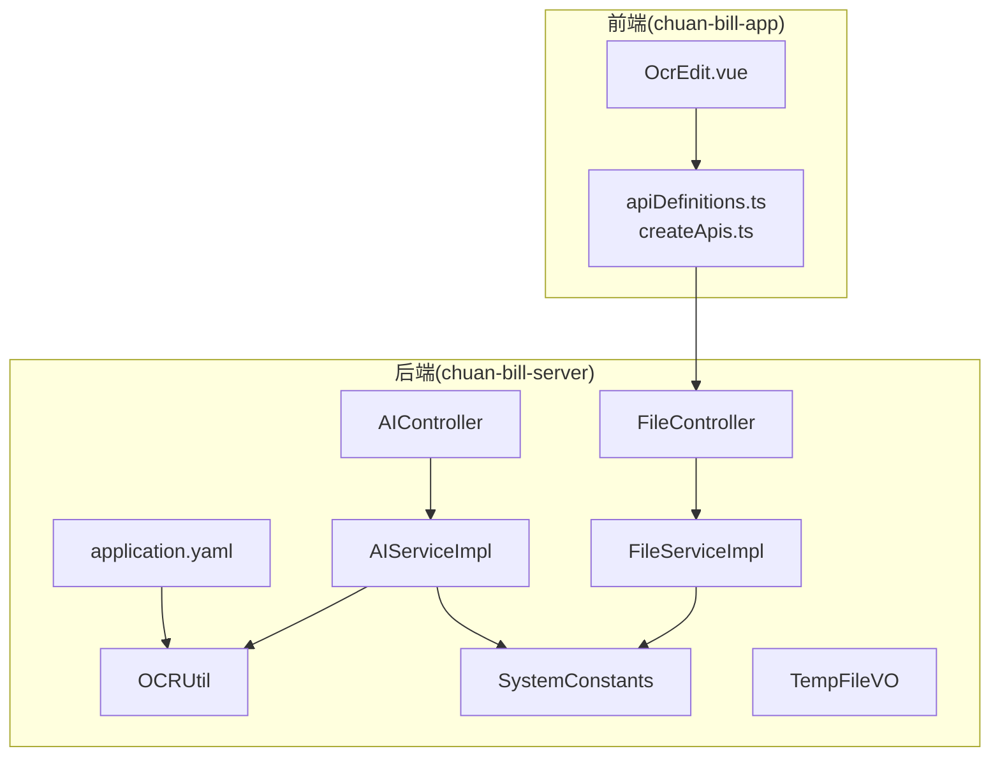
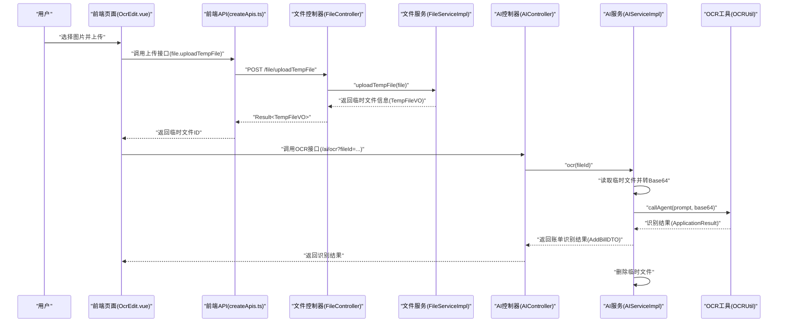
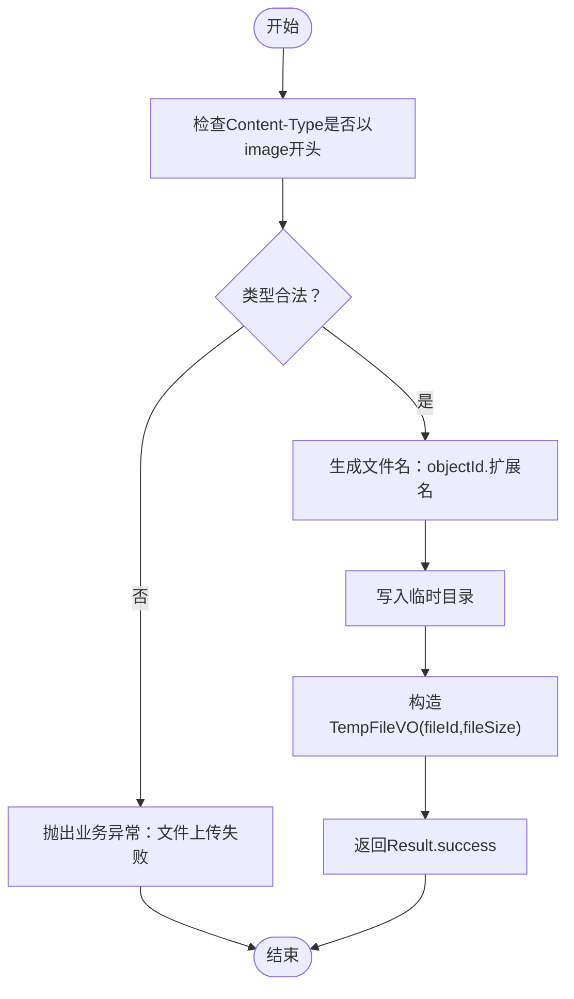
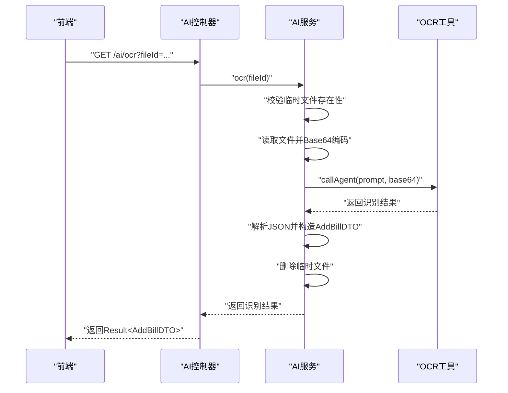
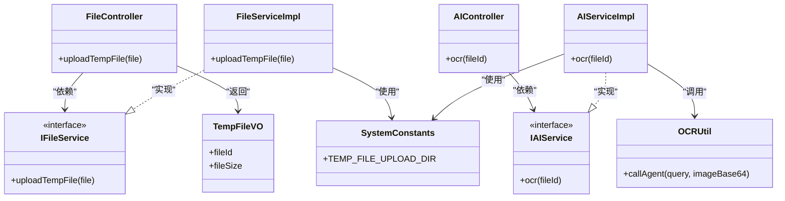

# 文件上传接口

<cite>
**本文引用的文件**
- [FileController.java](file://chuan-bill-server/src/main/java/com/samoy/chuanbillserver/controller/FileController.java)
- [IFileService.java](file://chuan-bill-server/src/main/java/com/samoy/chuanbillserver/service/IFileService.java)
- [FileServiceImpl.java](file://chuan-bill-server/src/main/java/com/samoy/chuanbillserver/service/impl/FileServiceImpl.java)
- [SystemConstants.java](file://chuan-bill-server/src/main/java/com/samoy/chuanbillserver/constant/SystemConstants.java)
- [TempFileVO.java](file://chuan-bill-server/src/main/java/com/samoy/chuanbillserver/vo/TempFileVO.java)
- [application.yaml](file://chuan-bill-server/src/main/resources/application.yaml)
- [OCRUtil.java](file://chuan-bill-server/src/main/java/com/samoy/chuanbillserver/utils/OCRUtil.java)
- [AIController.java](file://chuan-bill-server/src/main/java/com/samoy/chuanbillserver/controller/AIController.java)
- [AIServiceImpl.java](file://chuan-bill-server/src/main/java/com/samoy/chuanbillserver/service/impl/AIServiceImpl.java)
- [apiDefinitions.ts](file://chuan-bill-app/src/api/apiDefinitions.ts)
- [createApis.ts](file://chuan-bill-app/src/api/createApis.ts)
- [OcrEdit.vue](file://chuan-bill-app/src/pages/bill/components/OcrEdit.vue)
- [Result.java](file://chuan-bill-server/src/main/java/com/samoy/chuanbillserver/result/Result.java)
- [ResultEnum.java](file://chuan-bill-server/src/main/java/com/samoy/chuanbillserver/result/ResultEnum.java)
</cite>

## 目录
1. [简介](#简介)
2. [项目结构](#项目结构)
3. [核心组件](#核心组件)
4. [架构总览](#架构总览)
5. [详细组件分析](#详细组件分析)
6. [依赖关系分析](#依赖关系分析)
7. [性能考虑](#性能考虑)
8. [故障排查指南](#故障排查指南)
9. [结论](#结论)
10. [附录](#附录)

## 简介
本文件面向“文件上传接口”的完整技术文档，覆盖以下能力：
- 临时文件上传：仅支持图片类型，返回临时文件标识，供后续OCR识别使用
- 图片上传与OCR识别：前端上传图片后，后端调用DashScope OCR进行账单信息提取，并在识别成功后清理临时文件
- 存储策略与命名：临时文件采用对象ID+原扩展名的命名规则，统一存放于本地临时目录
- 类型与大小限制：当前实现仅允许图片类型；未设置明确的文件大小上限
- 安全检查：基于MIME类型前缀校验，确保仅接受图片；异常统一通过业务异常枚举返回
- 文件预览、下载、删除：当前版本未提供通用文件预览/下载/删除接口，OCR流程结束后临时文件会被清理
- 大文件分片/断点续传/并发上传：当前未实现，建议参考后续章节的优化建议
- 进度监控、错误处理、安全防护：统一通过响应封装与异常枚举实现，前端可结合上传组件回调进行交互

## 项目结构
后端采用Spring Boot + MyBatis-Plus，前端采用Vue + UniApp生态，文件上传与OCR识别主要涉及以下模块：
- 控制器层：文件上传控制器与AI识别控制器
- 服务层：文件服务与AI服务实现
- 工具层：OCR工具类封装DashScope调用
- 常量与VO：系统常量与临时文件信息载体
- 前端API定义与页面组件：上传组件、OCR识别流程

图表来源
- [FileController.java:1-27](file://chuan-bill-server/src/main/java/com/samoy/chuanbillserver/controller/FileController.java#L1-L27)
- [AIController.java:1-26](file://chuan-bill-server/src/main/java/com/samoy/chuanbillserver/controller/AIController.java#L1-L26)
- [FileServiceImpl.java:1-43](file://chuan-bill-server/src/main/java/com/samoy/chuanbillserver/service/impl/FileServiceImpl.java#L1-L43)
- [AIServiceImpl.java:1-52](file://chuan-bill-server/src/main/java/com/samoy/chuanbillserver/service/impl/AIServiceImpl.java#L1-L52)
- [OCRUtil.java:1-37](file://chuan-bill-server/src/main/java/com/samoy/chuanbillserver/utils/OCRUtil.java#L1-L37)
- [SystemConstants.java:1-35](file://chuan-bill-server/src/main/java/com/samoy/chuanbillserver/constant/SystemConstants.java#L1-L35)
- [apiDefinitions.ts:1-38](file://chuan-bill-app/src/api/apiDefinitions.ts#L1-L38)
- [OcrEdit.vue:1-167](file://chuan-bill-app/src/pages/bill/components/OcrEdit.vue#L1-L167)
- [application.yaml:1-51](file://chuan-bill-server/src/main/resources/application.yaml#L1-L51)

章节来源
- [FileController.java:1-27](file://chuan-bill-server/src/main/java/com/samoy/chuanbillserver/controller/FileController.java#L1-L27)
- [AIController.java:1-26](file://chuan-bill-server/src/main/java/com/samoy/chuanbillserver/controller/AIController.java#L1-L26)
- [FileServiceImpl.java:1-43](file://chuan-bill-server/src/main/java/com/samoy/chuanbillserver/service/impl/FileServiceImpl.java#L1-L43)
- [AIServiceImpl.java:1-52](file://chuan-bill-server/src/main/java/com/samoy/chuanbillserver/service/impl/AIServiceImpl.java#L1-L52)
- [OCRUtil.java:1-37](file://chuan-bill-server/src/main/java/com/samoy/chuanbillserver/utils/OCRUtil.java#L1-L37)
- [SystemConstants.java:1-35](file://chuan-bill-server/src/main/java/com/samoy/chuanbillserver/constant/SystemConstants.java#L1-L35)
- [apiDefinitions.ts:1-38](file://chuan-bill-app/src/api/apiDefinitions.ts#L1-L38)
- [OcrEdit.vue:1-167](file://chuan-bill-app/src/pages/bill/components/OcrEdit.vue#L1-L167)
- [application.yaml:1-51](file://chuan-bill-server/src/main/resources/application.yaml#L1-L51)

## 核心组件
- 文件上传控制器：提供临时文件上传接口，接收multipart/form-data，返回临时文件标识
- 文件服务实现：校验图片类型、生成唯一文件名、保存到临时目录、返回文件信息
- AI识别控制器：提供OCR识别接口，接收临时文件ID，返回账单识别结果
- AI服务实现：读取临时文件、转为Base64、调用DashScope OCR、解析结果并清理临时文件
- OCR工具类：封装DashScope API Key与AppId，构建调用参数并发起识别
- 前端API定义与页面组件：定义上传接口路径、上传组件配置、触发OCR识别流程

章节来源
- [FileController.java:1-27](file://chuan-bill-server/src/main/java/com/samoy/chuanbillserver/controller/FileController.java#L1-L27)
- [IFileService.java:1-16](file://chuan-bill-server/src/main/java/com/samoy/chuanbillserver/service/IFileService.java#L1-L16)
- [FileServiceImpl.java:1-43](file://chuan-bill-server/src/main/java/com/samoy/chuanbillserver/service/impl/FileServiceImpl.java#L1-L43)
- [AIController.java:1-26](file://chuan-bill-server/src/main/java/com/samoy/chuanbillserver/controller/AIController.java#L1-L26)
- [AIServiceImpl.java:1-52](file://chuan-bill-server/src/main/java/com/samoy/chuanbillserver/service/impl/AIServiceImpl.java#L1-L52)
- [OCRUtil.java:1-37](file://chuan-bill-server/src/main/java/com/samoy/chuanbillserver/utils/OCRUtil.java#L1-L37)
- [apiDefinitions.ts:1-38](file://chuan-bill-app/src/api/apiDefinitions.ts#L1-L38)
- [OcrEdit.vue:1-167](file://chuan-bill-app/src/pages/bill/components/OcrEdit.vue#L1-L167)

## 架构总览
整体流程：前端上传图片至后端临时目录 → 后端返回临时文件ID → 前端调用OCR接口 → 后端读取临时文件并调用DashScope OCR → 解析结果并清理临时文件。

图表来源
- [OcrEdit.vue:1-167](file://chuan-bill-app/src/pages/bill/components/OcrEdit.vue#L1-L167)
- [createApis.ts:1-95](file://chuan-bill-app/src/api/createApis.ts#L1-L95)
- [apiDefinitions.ts:1-38](file://chuan-bill-app/src/api/apiDefinitions.ts#L1-L38)
- [FileController.java:1-27](file://chuan-bill-server/src/main/java/com/samoy/chuanbillserver/controller/FileController.java#L1-L27)
- [FileServiceImpl.java:1-43](file://chuan-bill-server/src/main/java/com/samoy/chuanbillserver/service/impl/FileServiceImpl.java#L1-L43)
- [AIController.java:1-26](file://chuan-bill-server/src/main/java/com/samoy/chuanbillserver/controller/AIController.java#L1-L26)
- [AIServiceImpl.java:1-52](file://chuan-bill-server/src/main/java/com/samoy/chuanbillserver/service/impl/AIServiceImpl.java#L1-L52)
- [OCRUtil.java:1-37](file://chuan-bill-server/src/main/java/com/samoy/chuanbillserver/utils/OCRUtil.java#L1-L37)

## 详细组件分析

### 文件上传接口
- 接口路径：/file/uploadTempFile
- 方法：POST
- 请求体：multipart/form-data，字段名为file
- 响应：Result<TempFileVO>，包含fileId与fileSize
- 校验逻辑：
  - 仅允许图片类型（基于Content-Type以image开头）
  - 保存到临时目录，文件名为objectId.原扩展名
- 错误处理：非图片类型或IO异常统一抛出业务异常，返回统一错误码

图表来源
- [FileServiceImpl.java:1-43](file://chuan-bill-server/src/main/java/com/samoy/chuanbillserver/service/impl/FileServiceImpl.java#L1-L43)
- [SystemConstants.java:1-35](file://chuan-bill-server/src/main/java/com/samoy/chuanbillserver/constant/SystemConstants.java#L1-L35)
- [TempFileVO.java:1-15](file://chuan-bill-server/src/main/java/com/samoy/chuanbillserver/vo/TempFileVO.java#L1-L15)

章节来源
- [FileController.java:1-27](file://chuan-bill-server/src/main/java/com/samoy/chuanbillserver/controller/FileController.java#L1-L27)
- [IFileService.java:1-16](file://chuan-bill-server/src/main/java/com/samoy/chuanbillserver/service/IFileService.java#L1-L16)
- [FileServiceImpl.java:1-43](file://chuan-bill-server/src/main/java/com/samoy/chuanbillserver/service/impl/FileServiceImpl.java#L1-L43)
- [SystemConstants.java:1-35](file://chuan-bill-server/src/main/java/com/samoy/chuanbillserver/constant/SystemConstants.java#L1-L35)
- [TempFileVO.java:1-15](file://chuan-bill-server/src/main/java/com/samoy/chuanbillserver/vo/TempFileVO.java#L1-L15)

### OCR识别接口
- 接口路径：/ai/ocr
- 方法：GET
- 查询参数：fileId（临时文件ID）
- 流程：
  - 校验临时文件是否存在
  - 读取文件并转为Base64（含MIME类型）
  - 调用DashScope OCR，解析输出JSON，提取识别结果
  - 删除临时文件
- 错误处理：文件不存在、OCR调用异常均抛出业务异常

图表来源
- [AIController.java:1-26](file://chuan-bill-server/src/main/java/com/samoy/chuanbillserver/controller/AIController.java#L1-L26)
- [AIServiceImpl.java:1-52](file://chuan-bill-server/src/main/java/com/samoy/chuanbillserver/service/impl/AIServiceImpl.java#L1-L52)
- [OCRUtil.java:1-37](file://chuan-bill-server/src/main/java/com/samoy/chuanbillserver/utils/OCRUtil.java#L1-L37)

章节来源
- [AIController.java:1-26](file://chuan-bill-server/src/main/java/com/samoy/chuanbillserver/controller/AIController.java#L1-L26)
- [AIServiceImpl.java:1-52](file://chuan-bill-server/src/main/java/com/samoy/chuanbillserver/service/impl/AIServiceImpl.java#L1-L52)
- [OCRUtil.java:1-37](file://chuan-bill-server/src/main/java/com/samoy/chuanbillserver/utils/OCRUtil.java#L1-L37)

### 前端集成与流程
- 前端API定义：file.uploadTempFile映射到POST /file/uploadTempFile
- 页面组件：OcrEdit.vue
  - 上传组件配置：accept=image、limit=1、自定义header携带token
  - 上传成功回调：解析响应，拿到临时文件ID后自动触发OCR
  - OCR状态：pending/success/failed，失败时提供重试与手动输入入口

章节来源
- [apiDefinitions.ts:1-38](file://chuan-bill-app/src/api/apiDefinitions.ts#L1-L38)
- [createApis.ts:1-95](file://chuan-bill-app/src/api/createApis.ts#L1-L95)
- [OcrEdit.vue:1-167](file://chuan-bill-app/src/pages/bill/components/OcrEdit.vue#L1-L167)

### 数据模型与返回封装
- 临时文件信息：TempFileVO，包含fileId与fileSize
- 统一响应：Result<T>，包含code/message/data/timestamp
- 业务错误码：ResultEnum，涵盖文件相关错误码（如FILE_UPLOAD_FAILED、FILE_NOT_FOUND）

章节来源
- [TempFileVO.java:1-15](file://chuan-bill-server/src/main/java/com/samoy/chuanbillserver/vo/TempFileVO.java#L1-L15)
- [Result.java:1-50](file://chuan-bill-server/src/main/java/com/samoy/chuanbillserver/result/Result.java#L1-L50)
- [ResultEnum.java:1-56](file://chuan-bill-server/src/main/java/com/samoy/chuanbillserver/result/ResultEnum.java#L1-L56)

## 依赖关系分析
- 控制器依赖服务接口，服务实现依赖系统常量与工具类
- 前端通过API定义与创建函数生成方法，自动将Blob数据转换为FormData
- OCR识别依赖DashScope配置（API Key与AppId），从环境变量注入

图表来源
- [FileController.java:1-27](file://chuan-bill-server/src/main/java/com/samoy/chuanbillserver/controller/FileController.java#L1-L27)
- [IFileService.java:1-16](file://chuan-bill-server/src/main/java/com/samoy/chuanbillserver/service/IFileService.java#L1-L16)
- [FileServiceImpl.java:1-43](file://chuan-bill-server/src/main/java/com/samoy/chuanbillserver/service/impl/FileServiceImpl.java#L1-L43)
- [AIController.java:1-26](file://chuan-bill-server/src/main/java/com/samoy/chuanbillserver/controller/AIController.java#L1-L26)
- [AIServiceImpl.java:1-52](file://chuan-bill-server/src/main/java/com/samoy/chuanbillserver/service/impl/AIServiceImpl.java#L1-L52)
- [OCRUtil.java:1-37](file://chuan-bill-server/src/main/java/com/samoy/chuanbillserver/utils/OCRUtil.java#L1-L37)
- [SystemConstants.java:1-35](file://chuan-bill-server/src/main/java/com/samoy/chuanbillserver/constant/SystemConstants.java#L1-L35)
- [TempFileVO.java:1-15](file://chuan-bill-server/src/main/java/com/samoy/chuanbillserver/vo/TempFileVO.java#L1-L15)

章节来源
- [FileController.java:1-27](file://chuan-bill-server/src/main/java/com/samoy/chuanbillserver/controller/FileController.java#L1-L27)
- [IFileService.java:1-16](file://chuan-bill-server/src/main/java/com/samoy/chuanbillserver/service/IFileService.java#L1-L16)
- [FileServiceImpl.java:1-43](file://chuan-bill-server/src/main/java/com/samoy/chuanbillserver/service/impl/FileServiceImpl.java#L1-L43)
- [AIController.java:1-26](file://chuan-bill-server/src/main/java/com/samoy/chuanbillserver/controller/AIController.java#L1-L26)
- [AIServiceImpl.java:1-52](file://chuan-bill-server/src/main/java/com/samoy/chuanbillserver/service/impl/AIServiceImpl.java#L1-L52)
- [OCRUtil.java:1-37](file://chuan-bill-server/src/main/java/com/samoy/chuanbillserver/utils/OCRUtil.java#L1-L37)
- [SystemConstants.java:1-35](file://chuan-bill-server/src/main/java/com/samoy/chuanbillserver/constant/SystemConstants.java#L1-L35)
- [TempFileVO.java:1-15](file://chuan-bill-server/src/main/java/com/samoy/chuanbillserver/vo/TempFileVO.java#L1-L15)

## 性能考虑
- IO与内存：临时文件读取与Base64编码会占用内存，建议对大图进行压缩或限制尺寸
- 并发与限流：当前未实现限流与并发控制，建议在网关或控制器层增加限速与队列
- 存储清理：OCR成功后自动清理临时文件，避免磁盘膨胀；建议定期巡检与清理异常残留
- 缓存与CDN：若未来扩展为正式文件存储，建议引入CDN与缓存策略

## 故障排查指南
- 上传失败（文件类型不合法）
  - 现象：返回业务错误码（文件上传失败）
  - 排查：确认Content-Type是否以image开头；检查文件扩展名与实际类型一致性
- OCR失败（文件不存在或DashScope异常）
  - 现象：返回业务错误码（文件不存在或OCR识别失败）
  - 排查：确认fileId对应临时文件是否存在；核对DashScope API Key与AppId配置
- 前端上传无响应
  - 现象：上传成功回调未触发
  - 排查：确认API定义路径与后端一致；FormData构造是否包含Blob；网络与跨域问题

章节来源
- [FileServiceImpl.java:1-43](file://chuan-bill-server/src/main/java/com/samoy/chuanbillserver/service/impl/FileServiceImpl.java#L1-L43)
- [AIServiceImpl.java:1-52](file://chuan-bill-server/src/main/java/com/samoy/chuanbillserver/service/impl/AIServiceImpl.java#L1-L52)
- [ResultEnum.java:1-56](file://chuan-bill-server/src/main/java/com/samoy/chuanbillserver/result/ResultEnum.java#L1-L56)
- [application.yaml:1-51](file://chuan-bill-server/src/main/resources/application.yaml#L1-L51)

## 结论
当前版本实现了“临时文件上传 + 图片OCR识别”的闭环流程，具备清晰的类型校验、统一的错误返回与临时文件清理机制。对于通用文件预览/下载/删除、大文件分片/断点续传/并发上传、进度监控与更严格的安全防护，建议在后续版本中逐步增强。

## 附录

### API定义与调用示例（路径与行为）
- 上传临时文件
  - 方法：POST
  - 路径：/file/uploadTempFile
  - 请求体：multipart/form-data，字段名file
  - 响应：Result<TempFileVO>
- OCR识别
  - 方法：GET
  - 路径：/ai/ocr
  - 查询参数：fileId
  - 响应：Result<AddBillDTO>

章节来源
- [apiDefinitions.ts:1-38](file://chuan-bill-app/src/api/apiDefinitions.ts#L1-L38)
- [FileController.java:1-27](file://chuan-bill-server/src/main/java/com/samoy/chuanbillserver/controller/FileController.java#L1-L27)
- [AIController.java:1-26](file://chuan-bill-server/src/main/java/com/samoy/chuanbillserver/controller/AIController.java#L1-L26)

### 配置项与环境变量
- DashScope配置（从环境变量注入）
  - dashscope.apiKey
  - dashscope.ocr.appId
- 临时文件存储目录
  - SystemConstants.TEMP_FILE_UPLOAD_DIR

章节来源
- [application.yaml:1-51](file://chuan-bill-server/src/main/resources/application.yaml#L1-L51)
- [SystemConstants.java:1-35](file://chuan-bill-server/src/main/java/com/samoy/chuanbillserver/constant/SystemConstants.java#L1-L35)