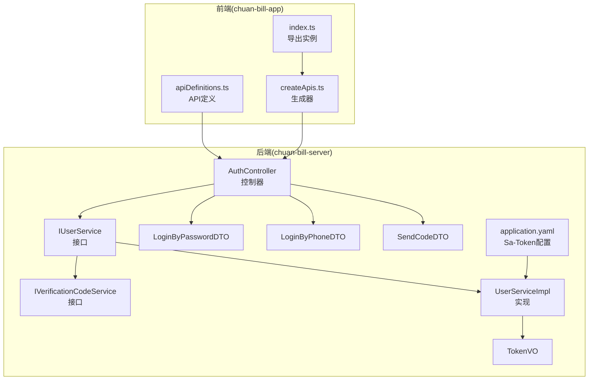
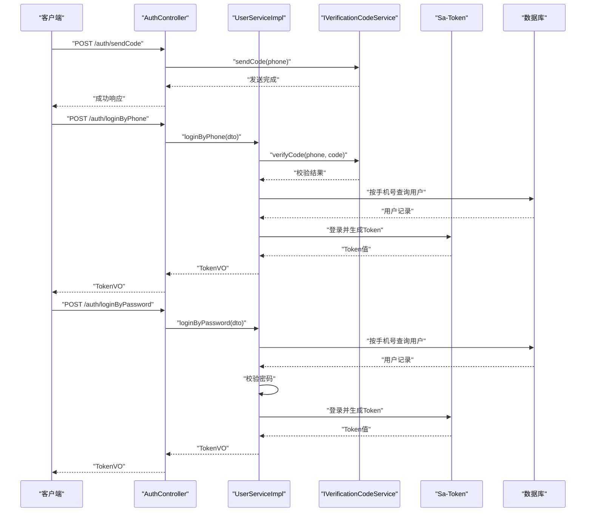
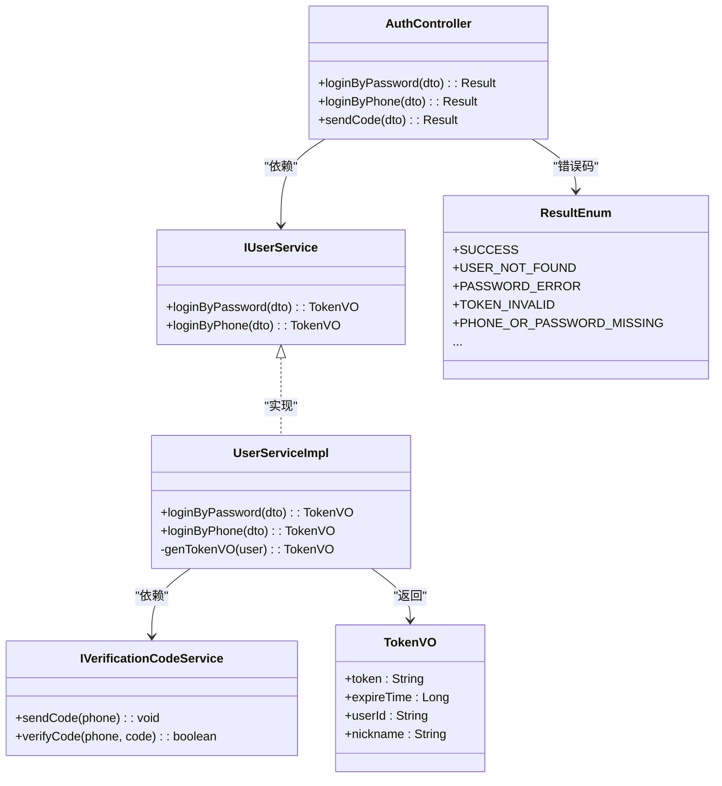
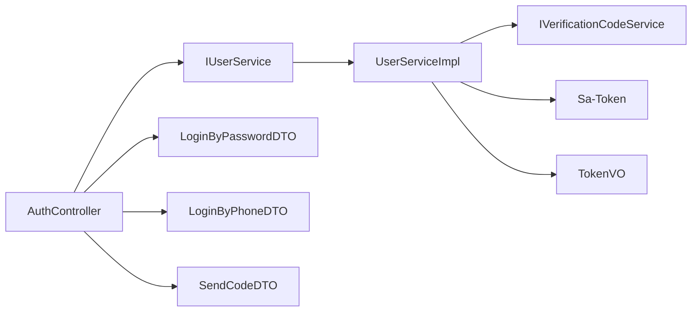

# 用户认证接口

<cite>
**本文引用的文件**
- [AuthController.java](file://chuan-bill-server/src/main/java/com/samoy/chuanbillserver/controller/AuthController.java)
- [LoginByPasswordDTO.java](file://chuan-bill-server/src/main/java/com/samoy/chuanbillserver/dto/LoginByPasswordDTO.java)
- [LoginByPhoneDTO.java](file://chuan-bill-server/src/main/java/com/samoy/chuanbillserver/dto/LoginByPhoneDTO.java)
- [SendCodeDTO.java](file://chuan-bill-server/src/main/java/com/samoy/chuanbillserver/dto/SendCodeDTO.java)
- [IUserService.java](file://chuan-bill-server/src/main/java/com/samoy/chuanbillserver/service/IUserService.java)
- [UserServiceImpl.java](file://chuan-bill-server/src/main/java/com/samoy/chuanbillserver/service/impl/UserServiceImpl.java)
- [IVerificationCodeService.java](file://chuan-bill-server/src/main/java/com/samoy/chuanbillserver/service/IVerificationCodeService.java)
- [TokenVO.java](file://chuan-bill-server/src/main/java/com/samoy/chuanbillserver/vo/TokenVO.java)
- [ResultEnum.java](file://chuan-bill-server/src/main/java/com/samoy/chuanbillserver/result/ResultEnum.java)
- [BusinessException.java](file://chuan-bill-server/src/main/java/com/samoy/chuanbillserver/expection/BusinessException.java)
- [application.yaml](file://chuan-bill-server/src/main/resources/application.yaml)
- [apiDefinitions.ts](file://chuan-bill-app/src/api/apiDefinitions.ts)
- [createApis.ts](file://chuan-bill-app/src/api/createApis.ts)
- [index.ts](file://chuan-bill-app/src/api/index.ts)
</cite>

## 目录
1. [简介](#简介)
2. [项目结构](#项目结构)
3. [核心组件](#核心组件)
4. [架构总览](#架构总览)
5. [详细组件分析](#详细组件分析)
6. [依赖分析](#依赖分析)
7. [性能考虑](#性能考虑)
8. [故障排查指南](#故障排查指南)
9. [结论](#结论)
10. [附录](#附录)

## 简介
本文件为“用户认证接口”的完整API文档，覆盖以下能力：
- 手机号登录（验证码模式）
- 密码登录
- 发送短信验证码
并围绕认证流程设计、Token生成与验证机制、会话管理策略、参数校验规则、错误码定义、安全防护、幂等性与重试、限流策略、前后端调用示例与异常处理机制进行系统化说明。

## 项目结构
后端采用Spring Boot + Sa-Token实现认证与会话管理；前端基于Alova生成API调用，通过统一的API定义文件映射到后端路由。

图表来源
- [AuthController.java:19-66](file://chuan-bill-server/src/main/java/com/samoy/chuanbillserver/controller/AuthController.java#L19-L66)
- [IUserService.java:17-74](file://chuan-bill-server/src/main/java/com/samoy/chuanbillserver/service/IUserService.java#L17-L74)
- [UserServiceImpl.java:34-192](file://chuan-bill-server/src/main/java/com/samoy/chuanbillserver/service/impl/UserServiceImpl.java#L34-L192)
- [IVerificationCodeService.java:3-8](file://chuan-bill-server/src/main/java/com/samoy/chuanbillserver/service/IVerificationCodeService.java#L3-L8)
- [TokenVO.java:1-21](file://chuan-bill-server/src/main/java/com/samoy/chuanbillserver/vo/TokenVO.java#L1-L21)
- [application.yaml:23-31](file://chuan-bill-server/src/main/resources/application.yaml#L23-L31)
- [apiDefinitions.ts:19-37](file://chuan-bill-app/src/api/apiDefinitions.ts#L19-L37)
- [createApis.ts:65-76](file://chuan-bill-app/src/api/createApis.ts#L65-L76)
- [index.ts:14-18](file://chuan-bill-app/src/api/index.ts#L14-L18)

章节来源
- [AuthController.java:19-66](file://chuan-bill-server/src/main/java/com/samoy/chuanbillserver/controller/AuthController.java#L19-L66)
- [apiDefinitions.ts:19-37](file://chuan-bill-app/src/api/apiDefinitions.ts#L19-L37)

## 核心组件
- 控制器：提供三个认证相关接口，分别对应“密码登录”、“手机号登录（验证码）”、“发送验证码”。
- 服务层：实现登录逻辑、Token生成、用户查询与创建、密码校验与更新、验证码校验。
- 数据传输对象：对请求参数进行约束与校验。
- 响应模型：统一返回TokenVO，包含token、过期时间、用户标识与昵称。
- 异常与错误码：统一的ResultEnum错误码体系，配合BusinessException抛出业务异常。
- Sa-Token：负责会话与Token生命周期管理。

章节来源
- [AuthController.java:29-64](file://chuan-bill-server/src/main/java/com/samoy/chuanbillserver/controller/AuthController.java#L29-L64)
- [UserServiceImpl.java:40-83](file://chuan-bill-server/src/main/java/com/samoy/chuanbillserver/service/impl/UserServiceImpl.java#L40-L83)
- [TokenVO.java:8-20](file://chuan-bill-server/src/main/java/com/samoy/chuanbillserver/vo/TokenVO.java#L8-L20)
- [ResultEnum.java:6-56](file://chuan-bill-server/src/main/java/com/samoy/chuanbillserver/result/ResultEnum.java#L6-L56)
- [BusinessException.java:6-35](file://chuan-bill-server/src/main/java/com/samoy/chuanbillserver/expection/BusinessException.java#L6-L35)

## 架构总览
认证流程以控制器为入口，经由服务层完成用户身份校验与Token签发，并通过Sa-Token维护会话。前端通过API定义与生成器发起请求。

图表来源
- [AuthController.java:35-64](file://chuan-bill-server/src/main/java/com/samoy/chuanbillserver/controller/AuthController.java#L35-L64)
- [UserServiceImpl.java:40-83](file://chuan-bill-server/src/main/java/com/samoy/chuanbillserver/service/impl/UserServiceImpl.java#L40-L83)
- [IVerificationCodeService.java:5-7](file://chuan-bill-server/src/main/java/com/samoy/chuanbillserver/service/IVerificationCodeService.java#L5-L7)
- [application.yaml:23-31](file://chuan-bill-server/src/main/resources/application.yaml#L23-L31)

## 详细组件分析

### 接口清单与调用方式
- 发送验证码
  - 方法与路径：POST /auth/sendCode
  - 请求体：SendCodeDTO（手机号phone）
  - 响应：Result<Void>（成功即200）
  - 前端调用键：auth.sendCode
- 手机号登录（验证码）
  - 方法与路径：POST /auth/loginByPhone
  - 请求体：LoginByPhoneDTO（手机号phone、验证码code）
  - 响应：Result<TokenVO>
  - 前端调用键：auth.loginByPhone
- 密码登录
  - 方法与路径：POST /auth/loginByPassword
  - 请求体：LoginByPasswordDTO（手机号phone、密码password）
  - 响应：Result<TokenVO>
  - 前端调用键：auth.loginByPassword

章节来源
- [AuthController.java:35-64](file://chuan-bill-server/src/main/java/com/samoy/chuanbillserver/controller/AuthController.java#L35-L64)
- [apiDefinitions.ts:27-29](file://chuan-bill-app/src/api/apiDefinitions.ts#L27-L29)

### 参数校验规则
- 手机号格式：必须为11位数字，且以1开头，第二位为3-9。
- 密码长度：6-20字符。
- 非空校验：手机号与验证码/密码均不能为空。
- 示例与必填标记：各DTO通过注解明确示例值与必填要求。

章节来源
- [SendCodeDTO.java:11](file://chuan-bill-server/src/main/java/com/samoy/chuanbillserver/dto/SendCodeDTO.java#L11)
- [LoginByPhoneDTO.java:11-15](file://chuan-bill-server/src/main/java/com/samoy/chuanbillserver/dto/LoginByPhoneDTO.java#L11-L15)
- [LoginByPasswordDTO.java:13-17](file://chuan-bill-server/src/main/java/com/samoy/chuanbillserver/dto/LoginByPasswordDTO.java#L13-L17)

### 认证流程与Token机制
- 登录流程
  - 密码登录：校验手机号与密码，匹配则生成Token并返回。
  - 手机号登录：先校验验证码，再按手机号查询用户；若用户不存在则自动创建，随后生成Token。
- Token生成与会话
  - 使用Sa-Token进行登录与Token生成，Token名称、超时时间、风格等在配置中定义。
  - 返回TokenVO包含token、userId、nickname与expireTime。
- 会话管理
  - 超时时间由Sa-Token配置决定；并发登录、共享会话等策略可按需调整。

图表来源
- [AuthController.java:23-27](file://chuan-bill-server/src/main/java/com/samoy/chuanbillserver/controller/AuthController.java#L23-L27)
- [IUserService.java:25-33](file://chuan-bill-server/src/main/java/com/samoy/chuanbillserver/service/IUserService.java#L25-L33)
- [UserServiceImpl.java:40-83](file://chuan-bill-server/src/main/java/com/samoy/chuanbillserver/service/impl/UserServiceImpl.java#L40-L83)
- [IVerificationCodeService.java:5-7](file://chuan-bill-server/src/main/java/com/samoy/chuanbillserver/service/IVerificationCodeService.java#L5-L7)
- [TokenVO.java:9-19](file://chuan-bill-server/src/main/java/com/samoy/chuanbillserver/vo/TokenVO.java#L9-L19)
- [ResultEnum.java:6-56](file://chuan-bill-server/src/main/java/com/samoy/chuanbillserver/result/ResultEnum.java#L6-L56)

### 错误码定义
- 通用错误码：4xx（请求错误）、5xx（服务器错误）
- 业务错误码（用户相关）：如用户不存在、密码错误、验证码错误/过期、手机号或密码缺失、未设置密码等
- 前端可通过错误码进行本地提示与分支处理

章节来源
- [ResultEnum.java:10-35](file://chuan-bill-server/src/main/java/com/samoy/chuanbillserver/result/ResultEnum.java#L10-L35)

### 前端调用示例
- 基于API定义与生成器，前端通过Apis对象调用：
  - 发送验证码：Apis.auth.sendCode({ phone })
  - 手机号登录：Apis.auth.loginByPhone({ phone, code })
  - 密码登录：Apis.auth.loginByPassword({ phone, password })
- Alova会根据apiDefinitions.ts中的映射构造HTTP请求并处理FormData等细节

章节来源
- [apiDefinitions.ts:27-29](file://chuan-bill-app/src/api/apiDefinitions.ts#L27-L29)
- [createApis.ts:32-60](file://chuan-bill-app/src/api/createApis.ts#L32-L60)
- [index.ts:14-18](file://chuan-bill-app/src/api/index.ts#L14-L18)

### 后端实现细节
- 登录By密码
  - 校验参数非空与格式
  - 按手机号查询用户并校验是否存在密码
  - 使用BCrypt校验密码
  - 生成TokenVO并更新最近登录时间
- 登录By手机（验证码）
  - 校验手机号非空
  - 调用验证码服务校验验证码
  - 若用户不存在则创建默认用户
  - 生成TokenVO
- TokenVO
  - 包含token、过期时间、userId、nickname
- Sa-Token配置
  - token名称、超时时间、随机风格等

章节来源
- [UserServiceImpl.java:40-83](file://chuan-bill-server/src/main/java/com/samoy/chuanbillserver/service/impl/UserServiceImpl.java#L40-L83)
- [UserServiceImpl.java:174-190](file://chuan-bill-server/src/main/java/com/samoy/chuanbillserver/service/impl/UserServiceImpl.java#L174-L190)
- [TokenVO.java:9-19](file://chuan-bill-server/src/main/java/com/samoy/chuanbillserver/vo/TokenVO.java#L9-L19)
- [application.yaml:23-31](file://chuan-bill-server/src/main/resources/application.yaml#L23-L31)

### 异常处理机制
- 业务异常：通过BusinessException携带ResultEnum错误码抛出
- 全局异常：结合ResultEnum统一返回错误信息
- 建议前端依据错误码进行友好提示与引导（例如重新获取验证码、检查密码）

章节来源
- [BusinessException.java:6-35](file://chuan-bill-server/src/main/java/com/samoy/chuanbillserver/expection/BusinessException.java#L6-L35)
- [ResultEnum.java:6-56](file://chuan-bill-server/src/main/java/com/samoy/chuanbillserver/result/ResultEnum.java#L6-L56)

## 依赖分析
- 控制器依赖服务接口，服务实现依赖验证码服务与Sa-Token
- DTO用于参数校验，VO封装响应
- 前端通过API定义与生成器间接依赖后端路由

图表来源
- [AuthController.java:23-27](file://chuan-bill-server/src/main/java/com/samoy/chuanbillserver/controller/AuthController.java#L23-L27)
- [IUserService.java:25-33](file://chuan-bill-server/src/main/java/com/samoy/chuanbillserver/service/IUserService.java#L25-L33)
- [UserServiceImpl.java:38-38](file://chuan-bill-server/src/main/java/com/samoy/chuanbillserver/service/impl/UserServiceImpl.java#L38-L38)
- [IVerificationCodeService.java:5-7](file://chuan-bill-server/src/main/java/com/samoy/chuanbillserver/service/IVerificationCodeService.java#L5-L7)
- [TokenVO.java:9-19](file://chuan-bill-server/src/main/java/com/samoy/chuanbillserver/vo/TokenVO.java#L9-L19)

## 性能考虑
- Token生成与会话：使用内存/Redis存储（取决于Sa-Token配置），建议开启持久化与合理超时
- 并发登录：Sa-Token支持并发登录策略，可根据业务需求调整
- 数据库查询：按手机号查询用户时建议在phone字段建立索引
- 验证码发送：建议引入限流与去重策略，避免重复发送

## 故障排查指南
- 常见错误码定位
  - 用户不存在：检查手机号是否正确、用户是否被禁用
  - 密码错误：确认密码长度与字符范围、是否已设置密码
  - 验证码错误/过期：确认验证码有效期与发送频率
  - 手机号或密码缺失：检查请求体参数是否为空
- 前端排查
  - 确认API定义键名与后端路由一致
  - 检查请求头与Content-Type（如使用FormData）
- 后端排查
  - 查看Sa-Token配置与日志
  - 核对数据库连接与验证码服务可用性

章节来源
- [ResultEnum.java:26-35](file://chuan-bill-server/src/main/java/com/samoy/chuanbillserver/result/ResultEnum.java#L26-L35)
- [BusinessException.java:6-35](file://chuan-bill-server/src/main/java/com/samoy/chuanbillserver/expection/BusinessException.java#L6-L35)

## 结论
本认证接口以清晰的DTO校验、稳定的Token生成与会话管理为核心，结合前后端约定的API定义，提供了手机号登录（验证码/密码）与验证码发送的完整能力。建议在生产环境中完善限流、日志与监控，并持续优化用户体验与安全性。

## 附录

### 请求与响应示例（示意）
- 发送验证码
  - 请求：POST /auth/sendCode
  - 请求体：{ "phone": "13800138000" }
  - 成功响应：200 OK，无业务体
- 手机号登录（验证码）
  - 请求：POST /auth/loginByPhone
  - 请求体：{ "phone": "13800138000", "code": "123456" }
  - 成功响应：{ "token": "...", "userId": "...", "nickname": "...", "expireTime": 86400000 }
  - 失败响应：错误码与消息（如验证码错误）
- 密码登录
  - 请求：POST /auth/loginByPassword
  - 请求体：{ "phone": "13800138000", "password": "123456" }
  - 成功响应：{ "token": "...", "userId": "...", "nickname": "...", "expireTime": 86400000 }
  - 失败响应：错误码与消息（如密码错误）

### 幂等性与重试
- 发送验证码：建议幂等，前端可按手机号+时间戳去重；后端应避免重复发送
- 登录接口：非幂等；重试需谨慎，避免重复创建用户或多次生成Token

### 限流策略建议
- 验证码发送：按手机号维度限制QPS与日累计
- 登录尝试：限制失败次数与速率，防止暴力破解
- Token刷新：控制频率，结合过期时间与主动登出