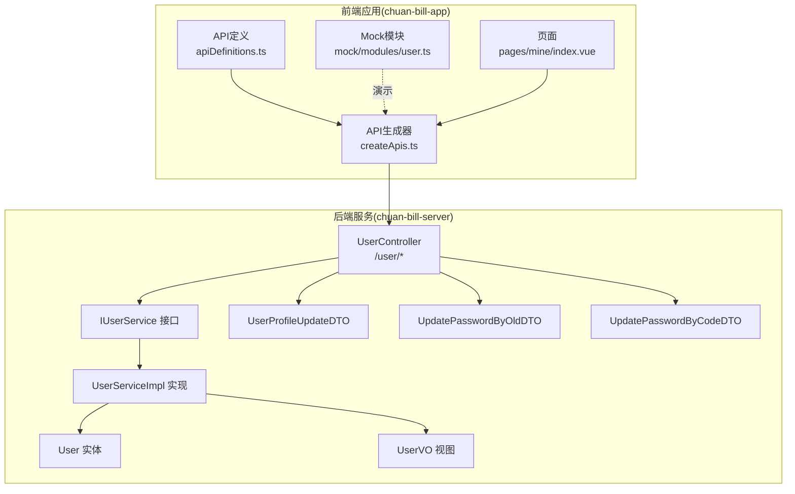
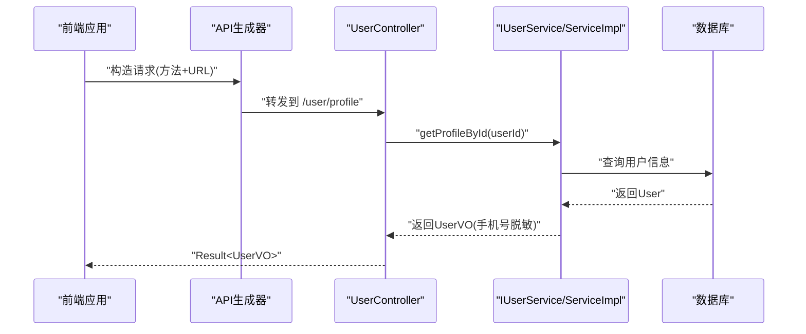
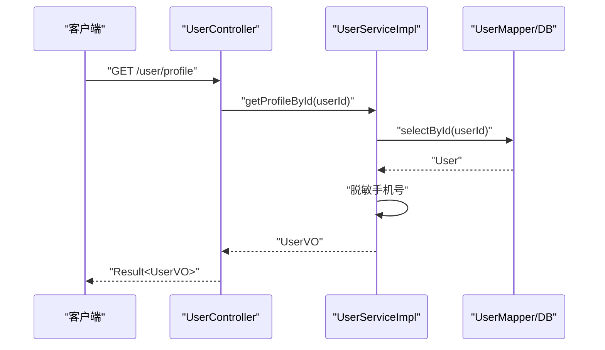
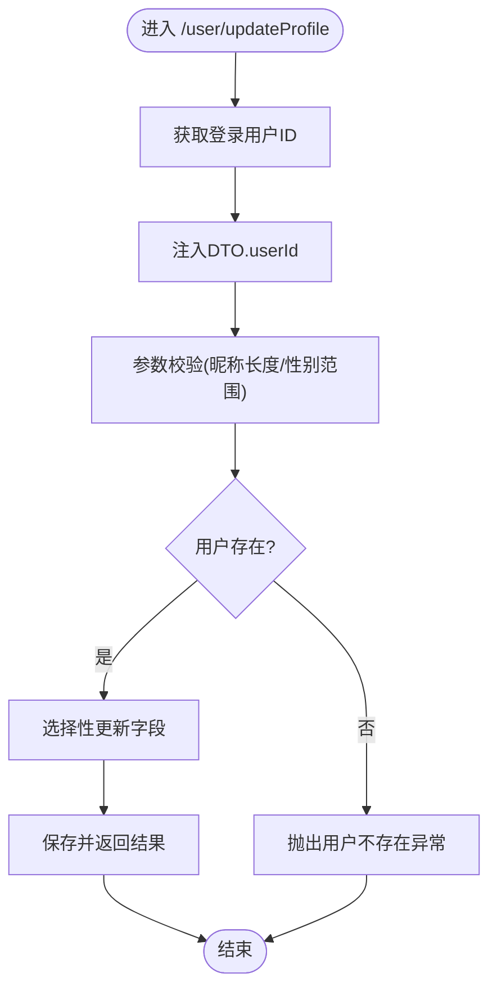
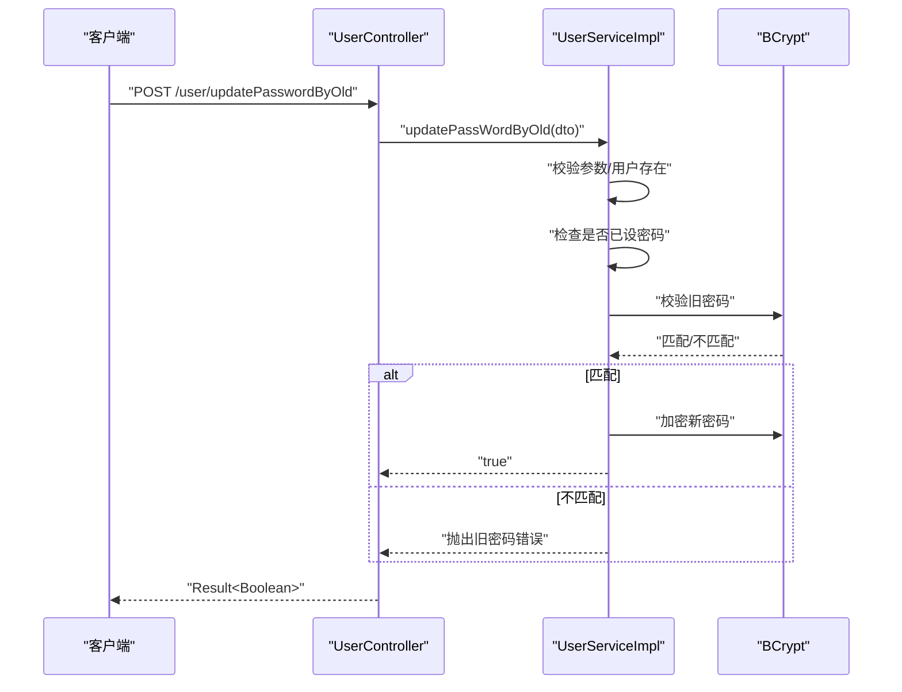
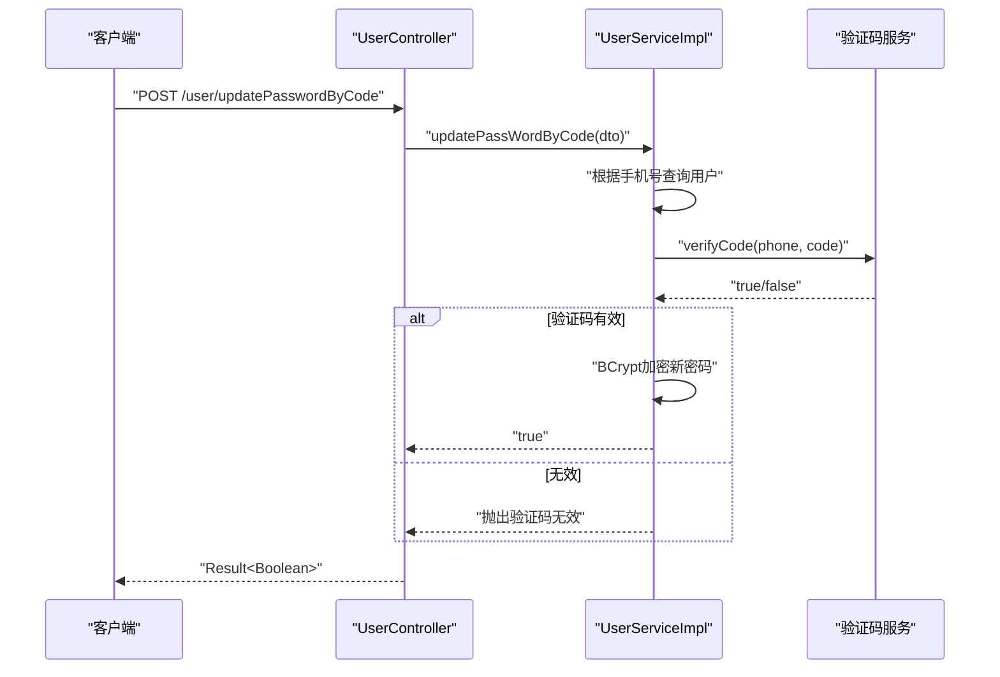
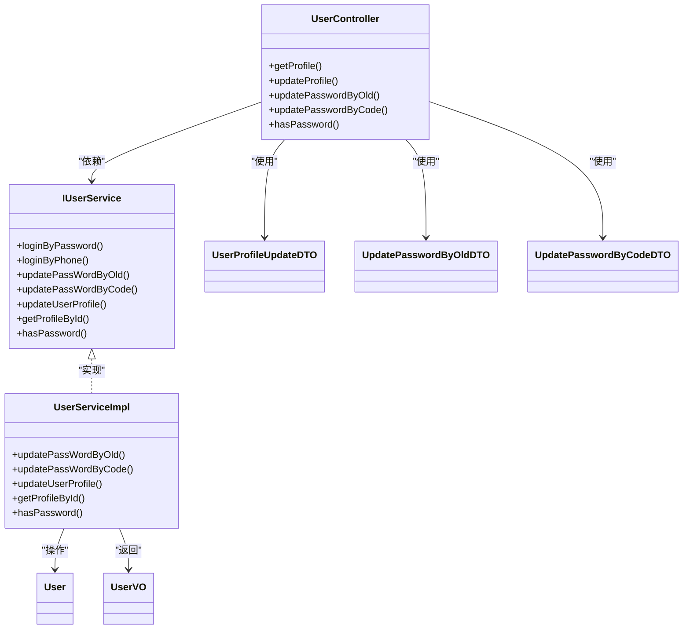

# 用户资料接口

<cite>
**本文引用的文件**
- [UserController.java](file://chuan-bill-server/src/main/java/com/samoy/chuanbillserver/controller/UserController.java)
- [IUserService.java](file://chuan-bill-server/src/main/java/com/samoy/chuanbillserver/service/IUserService.java)
- [UserServiceImpl.java](file://chuan-bill-server/src/main/java/com/samoy/chuanbillserver/service/impl/UserServiceImpl.java)
- [UserProfileUpdateDTO.java](file://chuan-bill-server/src/main/java/com/samoy/chuanbillserver/dto/UserProfileUpdateDTO.java)
- [UpdatePasswordByOldDTO.java](file://chuan-bill-server/src/main/java/com/samoy/chuanbillserver/dto/UpdatePasswordByOldDTO.java)
- [UpdatePasswordByCodeDTO.java](file://chuan-bill-server/src/main/java/com/samoy/chuanbillserver/dto/UpdatePasswordByCodeDTO.java)
- [User.java](file://chuan-bill-server/src/main/java/com/samoy/chuanbillserver/entity/User.java)
- [UserVO.java](file://chuan-bill-server/src/main/java/com/samoy/chuanbillserver/vo/UserVO.java)
- [apiDefinitions.ts](file://chuan-bill-app/src/api/apiDefinitions.ts)
- [createApis.ts](file://chuan-bill-app/src/api/createApis.ts)
- [user.ts](file://chuan-bill-app/src/api/mock/modules/user.ts)
- [index.vue](file://chuan-bill-app/src/pages/mine/index.vue)
</cite>

## 目录
1. [简介](#简介)
2. [项目结构](#项目结构)
3. [核心组件](#核心组件)
4. [架构总览](#架构总览)
5. [详细组件分析](#详细组件分析)
6. [依赖关系分析](#依赖关系分析)
7. [性能考虑](#性能考虑)
8. [故障排查指南](#故障排查指南)
9. [结论](#结论)
10. [附录](#附录)

## 简介
本文件面向“用户资料接口”的完整API文档，覆盖以下能力：
- 获取与更新用户资料（昵称、头像、性别）
- 密码管理（基于旧密码修改、基于短信验证码修改）
- 账户设置辅助能力（判断是否已设置密码）
- 数据验证规则、隐私保护机制（如手机号脱敏）
- 安全设计要点（旧密码校验、验证码校验、密码强度约束）
- 权限控制与访问日志、安全审计建议
- 请求/响应示例、错误处理策略、数据一致性保障

## 项目结构
用户资料相关代码主要分布在后端Spring Boot工程与前端Alova调用层：
- 后端控制器：UserController 提供REST接口
- 业务服务：IUserService 及其实现 UserServiceImpl
- 数据传输对象：UserProfileUpdateDTO、UpdatePasswordByOldDTO、UpdatePasswordByCodeDTO
- 实体与视图对象：User、UserVO
- 前端API定义与调用：apiDefinitions.ts、createApis.ts
- Mock数据：user.ts（用于演示与测试）

图表来源
- [apiDefinitions.ts:19-37](file://chuan-bill-app/src/api/apiDefinitions.ts#L19-L37)
- [createApis.ts:65-76](file://chuan-bill-app/src/api/createApis.ts#L65-L76)
- [UserController.java:17-61](file://chuan-bill-server/src/main/java/com/samoy/chuanbillserver/controller/UserController.java#L17-L61)
- [IUserService.java:17-74](file://chuan-bill-server/src/main/java/com/samoy/chuanbillserver/service/IUserService.java#L17-L74)
- [UserServiceImpl.java:35-191](file://chuan-bill-server/src/main/java/com/samoy/chuanbillserver/service/impl/UserServiceImpl.java#L35-L191)
- [UserProfileUpdateDTO.java:10-22](file://chuan-bill-server/src/main/java/com/samoy/chuanbillserver/dto/UserProfileUpdateDTO.java#L10-L22)
- [UpdatePasswordByOldDTO.java:10-20](file://chuan-bill-server/src/main/java/com/samoy/chuanbillserver/dto/UpdatePasswordByOldDTO.java#L10-L20)
- [UpdatePasswordByCodeDTO.java:10-20](file://chuan-bill-server/src/main/java/com/samoy/chuanbillserver/dto/UpdatePasswordByCodeDTO.java#L10-L20)
- [User.java:24-93](file://chuan-bill-server/src/main/java/com/samoy/chuanbillserver/entity/User.java#L24-L93)
- [UserVO.java:10-40](file://chuan-bill-server/src/main/java/com/samoy/chuanbillserver/vo/UserVO.java#L10-L40)

章节来源
- [apiDefinitions.ts:19-37](file://chuan-bill-app/src/api/apiDefinitions.ts#L19-L37)
- [createApis.ts:65-76](file://chuan-bill-app/src/api/createApis.ts#L65-L76)
- [UserController.java:17-61](file://chuan-bill-server/src/main/java/com/samoy/chuanbillserver/controller/UserController.java#L17-L61)
- [IUserService.java:17-74](file://chuan-bill-server/src/main/java/com/samoy/chuanbillserver/service/IUserService.java#L17-L74)
- [UserServiceImpl.java:35-191](file://chuan-bill-server/src/main/java/com/samoy/chuanbillserver/service/impl/UserServiceImpl.java#L35-L191)
- [UserProfileUpdateDTO.java:10-22](file://chuan-bill-server/src/main/java/com/samoy/chuanbillserver/dto/UserProfileUpdateDTO.java#L10-L22)
- [UpdatePasswordByOldDTO.java:10-20](file://chuan-bill-server/src/main/java/com/samoy/chuanbillserver/dto/UpdatePasswordByOldDTO.java#L10-L20)
- [UpdatePasswordByCodeDTO.java:10-20](file://chuan-bill-server/src/main/java/com/samoy/chuanbillserver/dto/UpdatePasswordByCodeDTO.java#L10-L20)
- [User.java:24-93](file://chuan-bill-server/src/main/java/com/samoy/chuanbillserver/entity/User.java#L24-L93)
- [UserVO.java:10-40](file://chuan-bill-server/src/main/java/com/samoy/chuanbillserver/vo/UserVO.java#L10-L40)

## 核心组件
- 控制器层：UserController 提供四个核心接口
  - GET /user/profile：获取当前用户资料
  - POST /user/updateProfile：更新用户资料（昵称、头像、性别）
  - POST /user/updatePasswordByOld：基于旧密码修改密码
  - POST /user/updatePasswordByCode：基于短信验证码修改密码
  - GET /user/hasPassword：判断当前用户是否已设置密码
- 服务层：IUserService + UserServiceImpl
  - 实现资料更新、密码修改、资料查询、密码存在性判断
  - 内置旧密码校验、验证码校验、密码强度约束、手机号脱敏
- 数据模型：
  - DTO：UserProfileUpdateDTO、UpdatePasswordByOldDTO、UpdatePasswordByCodeDTO
  - Entity：User（持久化字段）
  - VO：UserVO（对外展示字段，含脱敏手机号）

章节来源
- [UserController.java:25-60](file://chuan-bill-server/src/main/java/com/samoy/chuanbillserver/controller/UserController.java#L25-L60)
- [IUserService.java:17-74](file://chuan-bill-server/src/main/java/com/samoy/chuanbillserver/service/IUserService.java#L17-L74)
- [UserServiceImpl.java:85-166](file://chuan-bill-server/src/main/java/com/samoy/chuanbillserver/service/impl/UserServiceImpl.java#L85-L166)
- [UserProfileUpdateDTO.java:10-22](file://chuan-bill-server/src/main/java/com/samoy/chuanbillserver/dto/UserProfileUpdateDTO.java#L10-L22)
- [UpdatePasswordByOldDTO.java:10-20](file://chuan-bill-server/src/main/java/com/samoy/chuanbillserver/dto/UpdatePasswordByOldDTO.java#L10-L20)
- [UpdatePasswordByCodeDTO.java:10-20](file://chuan-bill-server/src/main/java/com/samoy/chuanbillserver/dto/UpdatePasswordByCodeDTO.java#L10-L20)
- [User.java:24-93](file://chuan-bill-server/src/main/java/com/samoy/chuanbillserver/entity/User.java#L24-L93)
- [UserVO.java:10-40](file://chuan-bill-server/src/main/java/com/samoy/chuanbillserver/vo/UserVO.java#L10-L40)

## 架构总览
用户资料接口遵循典型的分层架构：
- 前端通过 Alova 发起HTTP请求，按 apiDefinitions.ts 中的路径映射调用后端
- 控制器接收请求，注入当前登录用户ID，调用服务层执行业务逻辑
- 服务层进行参数校验、业务规则校验（旧密码、验证码、密码强度）、数据更新
- 实体与视图对象负责数据结构与对外展示字段（手机号脱敏）

图表来源
- [apiDefinitions.ts:30](file://chuan-bill-app/src/api/apiDefinitions.ts#L30)
- [createApis.ts:42-60](file://chuan-bill-app/src/api/createApis.ts#L42-L60)
- [UserController.java:27-29](file://chuan-bill-server/src/main/java/com/samoy/chuanbillserver/controller/UserController.java#L27-L29)
- [UserServiceImpl.java:147-157](file://chuan-bill-server/src/main/java/com/samoy/chuanbillserver/service/impl/UserServiceImpl.java#L147-L157)

## 详细组件分析

### 获取用户资料 /user/profile
- 方法与路径：GET /user/profile
- 权限要求：需登录（控制器使用注解标识）
- 参数：无
- 返回：Result<UserVO>
- 业务流程：
  - 从登录上下文提取用户ID
  - 调用服务层按ID查询用户
  - 将实体拷贝为VO，并对手机号做中间段脱敏
- 错误处理：用户不存在时抛出业务异常

图表来源
- [UserController.java:27-29](file://chuan-bill-server/src/main/java/com/samoy/chuanbillserver/controller/UserController.java#L27-L29)
- [UserServiceImpl.java:147-157](file://chuan-bill-server/src/main/java/com/samoy/chuanbillserver/service/impl/UserServiceImpl.java#L147-L157)
- [UserVO.java:10-40](file://chuan-bill-server/src/main/java/com/samoy/chuanbillserver/vo/UserVO.java#L10-L40)

章节来源
- [UserController.java:25-30](file://chuan-bill-server/src/main/java/com/samoy/chuanbillserver/controller/UserController.java#L25-L30)
- [UserServiceImpl.java:147-157](file://chuan-bill-server/src/main/java/com/samoy/chuanbillserver/service/impl/UserServiceImpl.java#L147-L157)
- [UserVO.java:10-40](file://chuan-bill-server/src/main/java/com/samoy/chuanbillserver/vo/UserVO.java#L10-L40)

### 更新用户资料 /user/updateProfile
- 方法与路径：POST /user/updateProfile
- 权限要求：需登录
- 请求体：UserProfileUpdateDTO
  - 字段：userId（由控制器注入）、nickname、avatar、gender
  - 校验：昵称长度限制；性别仅允许0/1/2
- 业务流程：
  - 从登录上下文获取userId并注入DTO
  - 校验用户存在性
  - 选择性更新昵称、头像、性别
  - 保存并返回布尔结果
- 错误处理：用户不存在、参数非法

图表来源
- [UserController.java:34-37](file://chuan-bill-server/src/main/java/com/samoy/chuanbillserver/controller/UserController.java#L34-L37)
- [UserProfileUpdateDTO.java:14-21](file://chuan-bill-server/src/main/java/com/samoy/chuanbillserver/dto/UserProfileUpdateDTO.java#L14-L21)
- [UserServiceImpl.java:128-144](file://chuan-bill-server/src/main/java/com/samoy/chuanbillserver/service/impl/UserServiceImpl.java#L128-L144)

章节来源
- [UserController.java:32-38](file://chuan-bill-server/src/main/java/com/samoy/chuanbillserver/controller/UserController.java#L32-L38)
- [UserProfileUpdateDTO.java:10-22](file://chuan-bill-server/src/main/java/com/samoy/chuanbillserver/dto/UserProfileUpdateDTO.java#L10-L22)
- [UserServiceImpl.java:128-144](file://chuan-bill-server/src/main/java/com/samoy/chuanbillserver/service/impl/UserServiceImpl.java#L128-L144)

### 通过旧密码修改密码 /user/updatePasswordByOld
- 方法与路径：POST /user/updatePasswordByOld
- 权限要求：需登录
- 请求体：UpdatePasswordByOldDTO
  - 字段：userId、oldPassword、newPassword
  - 校验：旧密码与新密码非空；新密码长度6~20
- 业务流程：
  - 注入userId
  - 校验用户存在性
  - 校验是否已设置密码
  - 使用BCrypt校验旧密码
  - BCrypt加密新密码并保存
- 错误处理：缺少参数、用户不存在、未设置密码、旧密码错误

图表来源
- [UserController.java:42-45](file://chuan-bill-server/src/main/java/com/samoy/chuanbillserver/controller/UserController.java#L42-L45)
- [UpdatePasswordByOldDTO.java:12-19](file://chuan-bill-server/src/main/java/com/samoy/chuanbillserver/dto/UpdatePasswordByOldDTO.java#L12-L19)
- [UserServiceImpl.java:85-105](file://chuan-bill-server/src/main/java/com/samoy/chuanbillserver/service/impl/UserServiceImpl.java#L85-L105)

章节来源
- [UserController.java:40-46](file://chuan-bill-server/src/main/java/com/samoy/chuanbillserver/controller/UserController.java#L40-L46)
- [UpdatePasswordByOldDTO.java:10-20](file://chuan-bill-server/src/main/java/com/samoy/chuanbillserver/dto/UpdatePasswordByOldDTO.java#L10-L20)
- [UserServiceImpl.java:85-105](file://chuan-bill-server/src/main/java/com/samoy/chuanbillserver/service/impl/UserServiceImpl.java#L85-L105)

### 通过短信验证码修改密码 /user/updatePasswordByCode
- 方法与路径：POST /user/updatePasswordByCode
- 权限要求：无需登录
- 请求体：UpdatePasswordByCodeDTO
  - 字段：phone、code、newPassword
  - 校验：手机号格式、验证码非空、新密码长度6~20
- 业务流程：
  - 根据手机号查询用户
  - 校验验证码有效性
  - BCrypt加密新密码并保存
- 错误处理：手机号缺失/格式错误、验证码无效、用户不存在、密码缺失

图表来源
- [UserController.java:51-52](file://chuan-bill-server/src/main/java/com/samoy/chuanbillserver/controller/UserController.java#L51-L52)
- [UpdatePasswordByCodeDTO.java:12-19](file://chuan-bill-server/src/main/java/com/samoy/chuanbillserver/dto/UpdatePasswordByCodeDTO.java#L12-L19)
- [UserServiceImpl.java:107-125](file://chuan-bill-server/src/main/java/com/samoy/chuanbillserver/service/impl/UserServiceImpl.java#L107-L125)

章节来源
- [UserController.java:48-53](file://chuan-bill-server/src/main/java/com/samoy/chuanbillserver/controller/UserController.java#L48-L53)
- [UpdatePasswordByCodeDTO.java:10-20](file://chuan-bill-server/src/main/java/com/samoy/chuanbillserver/dto/UpdatePasswordByCodeDTO.java#L10-L20)
- [UserServiceImpl.java:107-125](file://chuan-bill-server/src/main/java/com/samoy/chuanbillserver/service/impl/UserServiceImpl.java#L107-L125)

### 判断是否已设置密码 /user/hasPassword
- 方法与路径：GET /user/hasPassword
- 权限要求：需登录
- 返回：Result<Boolean>
- 业务流程：查询用户是否存在密码字段，返回布尔值

章节来源
- [UserController.java:57-59](file://chuan-bill-server/src/main/java/com/samoy/chuanbillserver/controller/UserController.java#L57-L59)
- [UserServiceImpl.java:159-166](file://chuan-bill-server/src/main/java/com/samoy/chuanbillserver/service/impl/UserServiceImpl.java#L159-L166)

### 数据模型与字段定义
- UserProfileUpdateDTO
  - 字段：userId、nickname、avatar、gender
  - 校验：昵称长度上限、性别枚举范围
- UpdatePasswordByOldDTO
  - 字段：userId、oldPassword、newPassword
  - 校验：非空、新密码长度范围
- UpdatePasswordByCodeDTO
  - 字段：phone、code、newPassword
  - 校验：手机号格式、验证码非空、新密码长度范围
- User 实体
  - 字段：id、phone、password、nickname、avatar、gender、status、lastLoginTime、createTime、updateTime、deleted
- UserVO 视图
  - 字段：id、phone（脱敏）、nickname、avatar、gender、status、lastLoginTime、createTime、updateTime

章节来源
- [UserProfileUpdateDTO.java:10-22](file://chuan-bill-server/src/main/java/com/samoy/chuanbillserver/dto/UserProfileUpdateDTO.java#L10-L22)
- [UpdatePasswordByOldDTO.java:10-20](file://chuan-bill-server/src/main/java/com/samoy/chuanbillserver/dto/UpdatePasswordByOldDTO.java#L10-L20)
- [UpdatePasswordByCodeDTO.java:10-20](file://chuan-bill-server/src/main/java/com/samoy/chuanbillserver/dto/UpdatePasswordByCodeDTO.java#L10-L20)
- [User.java:24-93](file://chuan-bill-server/src/main/java/com/samoy/chuanbillserver/entity/User.java#L24-L93)
- [UserVO.java:10-40](file://chuan-bill-server/src/main/java/com/samoy/chuanbillserver/vo/UserVO.java#L10-L40)

## 依赖关系分析
- 控制器依赖服务接口，服务实现依赖实体与验证码服务
- DTO作为输入契约，VO作为输出契约
- 前端通过API定义与生成器统一构造请求

图表来源
- [UserController.java:22-23](file://chuan-bill-server/src/main/java/com/samoy/chuanbillserver/controller/UserController.java#L22-L23)
- [IUserService.java:17-74](file://chuan-bill-server/src/main/java/com/samoy/chuanbillserver/service/IUserService.java#L17-L74)
- [UserServiceImpl.java:35-191](file://chuan-bill-server/src/main/java/com/samoy/chuanbillserver/service/impl/UserServiceImpl.java#L35-L191)
- [UserProfileUpdateDTO.java:10-22](file://chuan-bill-server/src/main/java/com/samoy/chuanbillserver/dto/UserProfileUpdateDTO.java#L10-L22)
- [UpdatePasswordByOldDTO.java:10-20](file://chuan-bill-server/src/main/java/com/samoy/chuanbillserver/dto/UpdatePasswordByOldDTO.java#L10-L20)
- [UpdatePasswordByCodeDTO.java:10-20](file://chuan-bill-server/src/main/java/com/samoy/chuanbillserver/dto/UpdatePasswordByCodeDTO.java#L10-L20)
- [User.java:24-93](file://chuan-bill-server/src/main/java/com/samoy/chuanbillserver/entity/User.java#L24-L93)
- [UserVO.java:10-40](file://chuan-bill-server/src/main/java/com/samoy/chuanbillserver/vo/UserVO.java#L10-L40)

章节来源
- [UserController.java:22-23](file://chuan-bill-server/src/main/java/com/samoy/chuanbillserver/controller/UserController.java#L22-L23)
- [IUserService.java:17-74](file://chuan-bill-server/src/main/java/com/samoy/chuanbillserver/service/IUserService.java#L17-L74)
- [UserServiceImpl.java:35-191](file://chuan-bill-server/src/main/java/com/samoy/chuanbillserver/service/impl/UserServiceImpl.java#L35-L191)

## 性能考虑
- DTO参数校验在控制器层完成，减少无效请求进入服务层
- 服务层采用选择性字段更新，避免不必要的写放大
- 密码采用BCrypt哈希存储，降低暴力破解风险
- 前端统一通过API生成器构造请求，减少重复逻辑

## 故障排查指南
- 常见错误类型与定位
  - 参数缺失或格式错误：检查DTO校验消息
  - 用户不存在：确认登录态与userId
  - 旧密码错误：确认原密码是否正确
  - 验证码无效：确认发送与校验流程
- 建议的日志与审计
  - 记录关键操作（密码修改、资料更新）的时间、用户ID、IP、UA
  - 对异常场景（旧密码错误、验证码无效）进行告警
  - 定期审计高风险操作（如批量资料变更）

章节来源
- [UserServiceImpl.java:85-125](file://chuan-bill-server/src/main/java/com/samoy/chuanbillserver/service/impl/UserServiceImpl.java#L85-L125)

## 结论
用户资料接口以清晰的分层设计实现了资料管理与密码安全两大核心功能。通过严格的参数校验、BCrypt密码哈希、手机号脱敏与验证码校验，确保了数据完整性与安全性。配合前端统一的API生成与Mock支持，便于联调与测试。

## 附录

### 请求/响应示例（示意）
- 获取资料
  - 请求：GET /user/profile
  - 成功响应：Result<UserVO>，其中phone为脱敏后的字符串
- 更新资料
  - 请求体：UserProfileUpdateDTO（可选字段：nickname、avatar、gender）
  - 成功响应：Result<Boolean>
- 旧密码改密
  - 请求体：UpdatePasswordByOldDTO（包含userId、oldPassword、newPassword）
  - 成功响应：Result<Boolean>
- 验证码改密
  - 请求体：UpdatePasswordByCodeDTO（包含phone、code、newPassword）
  - 成功响应：Result<Boolean>
- 是否设密
  - 请求：GET /user/hasPassword
  - 成功响应：Result<Boolean>

章节来源
- [apiDefinitions.ts:19-37](file://chuan-bill-app/src/api/apiDefinitions.ts#L19-L37)
- [UserController.java:25-60](file://chuan-bill-server/src/main/java/com/samoy/chuanbillserver/controller/UserController.java#L25-L60)
- [UserServiceImpl.java:85-166](file://chuan-bill-server/src/main/java/com/samoy/chuanbillserver/service/impl/UserServiceImpl.java#L85-L166)

### 前端集成要点
- 使用 apiDefinitions.ts 中的键名构造请求
- 通过 createApis.ts 生成方法，自动拼接URL与处理FormData
- 页面入口参考 pages/mine/index.vue 的路由配置

章节来源
- [apiDefinitions.ts:19-37](file://chuan-bill-app/src/api/apiDefinitions.ts#L19-L37)
- [createApis.ts:42-60](file://chuan-bill-app/src/api/createApis.ts#L42-L60)
- [index.vue:1-22](file://chuan-bill-app/src/pages/mine/index.vue#L1-L22)