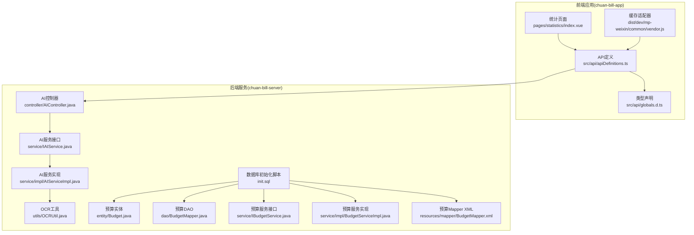
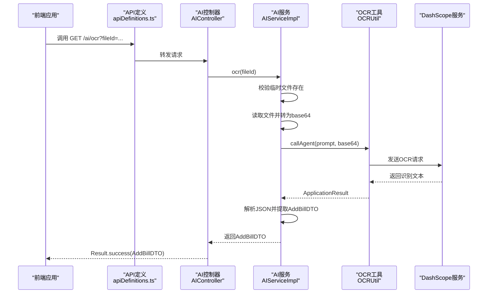
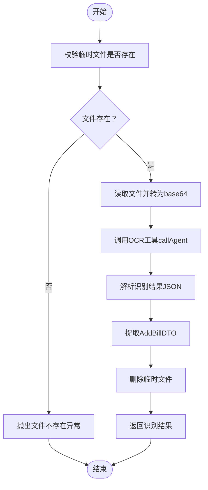
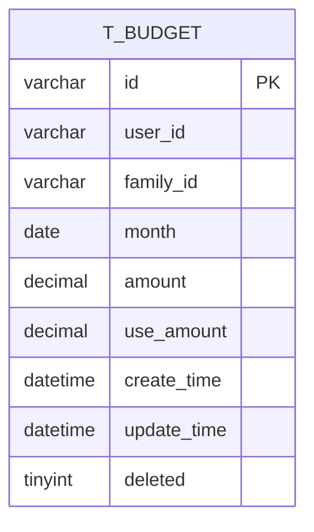
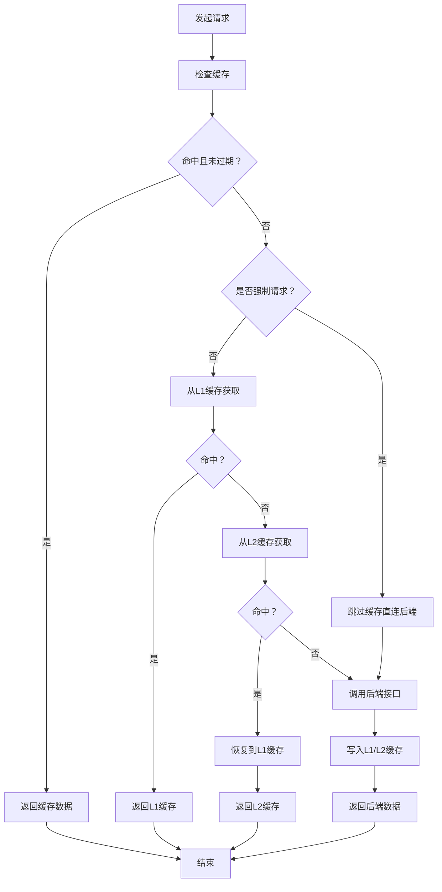
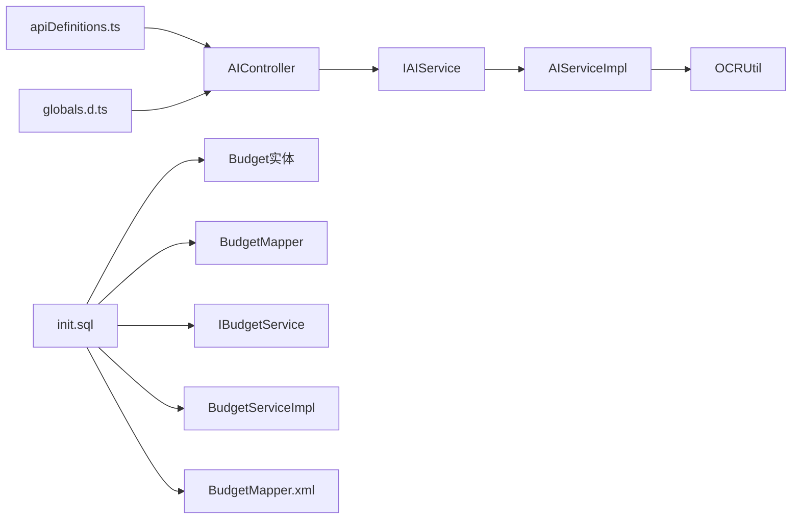

# 统计分析接口

<cite>
**本文引用的文件**
- [PRD.md](file://PRD.md)
- [AIController.java](file://chuan-bill-server/src/main/java/com/samoy/chuanbillserver/controller/AIController.java)
- [IAIService.java](file://chuan-bill-server/src/main/java/com/samoy/chuanbillserver/service/IAIService.java)
- [AIServiceImpl.java](file://chuan-bill-server/src/main/java/com/samoy/chuanbillserver/service/impl/AIServiceImpl.java)
- [OCRUtil.java](file://chuan-bill-server/src/main/java/com/samoy/chuanbillserver/utils/OCRUtil.java)
- [apiDefinitions.ts](file://chuan-bill-app/src/api/apiDefinitions.ts)
- [globals.d.ts](file://chuan-bill-app/src/api/globals.d.ts)
- [index.vue](file://chuan-bill-app/src/pages/statistics/index.vue)
- [init.sql](file://chuan-bill-server/init.sql)
- [Budget.java](file://chuan-bill-server/src/main/java/com/samoy/chuanbillserver/entity/Budget.java)
- [BudgetMapper.java](file://chuan-bill-server/src/main/java/com/samoy/chuanbillserver/dao/BudgetMapper.java)
- [BudgetServiceImpl.java](file://chuan-bill-server/src/main/java/com/samoy/chuanbillserver/service/impl/BudgetServiceImpl.java)
- [IBudgetService.java](file://chuan-bill-server/src/main/java/com/samoy/chuanbillserver/service/IBudgetService.java)
- [BudgetMapper.xml](file://chuan-bill-server/src/main/resources/mapper/BudgetMapper.xml)
- [vendor.js](file://chuan-bill-app/dist/dev/mp-weixin/common/vendor.js)
</cite>

## 目录
1. [简介](#简介)
2. [项目结构](#项目结构)
3. [核心组件](#核心组件)
4. [架构总览](#架构总览)
5. [详细组件分析](#详细组件分析)
6. [依赖分析](#依赖分析)
7. [性能考虑](#性能考虑)
8. [故障排查指南](#故障排查指南)
9. [结论](#结论)
10. [附录](#附录)

## 简介
本文件面向“统计分析接口”的完整API文档，聚焦以下目标：
- 收支统计、趋势分析、预算执行情况等分析接口的设计与实现
- 统计数据聚合算法、时间维度分析、分类维度统计的实现方案
- 图表数据接口说明（折线图、柱状图、饼图等可视化数据的获取方式）
- AI智能分析接口（消费预测、异常检测、理财建议等）
- 实时数据更新机制、缓存策略、性能优化方案
- 数据准确性验证、异常数据处理、历史数据回溯等技术实现细节

## 项目结构
统计分析相关能力由前端页面与后端接口共同构成，核心路径如下：
- 前端页面：统计分析页面位于应用前端 pages/statistics/index.vue
- 后端接口：AI相关接口位于 chuan-bill-server 的 AIController，OCR识别能力由 IAIService 及其实现类 AIServiceImpl 提供
- 数据模型：账单表、预算表等在数据库初始化脚本中定义，预算实体与DAO/Service层在后端工程中实现
- API定义：前端通过 apiDefinitions.ts 与 globals.d.ts 描述接口与参数类型

**图表来源**
- [index.vue:1-23](file://chuan-bill-app/src/pages/statistics/index.vue#L1-L23)
- [apiDefinitions.ts:1-38](file://chuan-bill-app/src/api/apiDefinitions.ts#L1-L38)
- [globals.d.ts:92-1181](file://chuan-bill-app/src/api/globals.d.ts#L92-L1181)
- [vendor.js:10759-11490](file://chuan-bill-app/dist/dev/mp-weixin/common/vendor.js#L10759-L11490)
- [AIController.java:1-26](file://chuan-bill-server/src/main/java/com/samoy/chuanbillserver/controller/AIController.java#L1-L26)
- [IAIService.java:1-14](file://chuan-bill-server/src/main/java/com/samoy/chuanbillserver/service/IAIService.java#L1-L14)
- [AIServiceImpl.java:1-52](file://chuan-bill-server/src/main/java/com/samoy/chuanbillserver/service/impl/AIServiceImpl.java#L1-L52)
- [OCRUtil.java:1-37](file://chuan-bill-server/src/main/java/com/samoy/chuanbillserver/utils/OCRUtil.java#L1-L37)
- [init.sql:33-178](file://chuan-bill-server/init.sql#L33-L178)
- [Budget.java:1-83](file://chuan-bill-server/src/main/java/com/samoy/chuanbillserver/entity/Budget.java#L1-L83)
- [BudgetMapper.java:1-14](file://chuan-bill-server/src/main/java/com/samoy/chuanbillserver/dao/BudgetMapper.java#L1-L14)
- [IBudgetService.java:1-14](file://chuan-bill-server/src/main/java/com/samoy/chuanbillserver/service/IBudgetService.java#L1-L14)
- [BudgetServiceImpl.java:1-18](file://chuan-bill-server/src/main/java/com/samoy/chuanbillserver/service/impl/BudgetServiceImpl.java#L1-L18)
- [BudgetMapper.xml:1-5](file://chuan-bill-server/src/main/resources/mapper/BudgetMapper.xml#L1-L5)

**章节来源**
- [index.vue:1-23](file://chuan-bill-app/src/pages/statistics/index.vue#L1-L23)
- [apiDefinitions.ts:1-38](file://chuan-bill-app/src/api/apiDefinitions.ts#L1-L38)
- [globals.d.ts:92-1181](file://chuan-bill-app/src/api/globals.d.ts#L92-L1181)
- [vendor.js:10759-11490](file://chuan-bill-app/dist/dev/mp-weixin/common/vendor.js#L10759-L11490)
- [AIController.java:1-26](file://chuan-bill-server/src/main/java/com/samoy/chuanbillserver/controller/AIController.java#L1-L26)
- [IAIService.java:1-14](file://chuan-bill-server/src/main/java/com/samoy/chuanbillserver/service/IAIService.java#L1-L14)
- [AIServiceImpl.java:1-52](file://chuan-bill-server/src/main/java/com/samoy/chuanbillserver/service/impl/AIServiceImpl.java#L1-L52)
- [OCRUtil.java:1-37](file://chuan-bill-server/src/main/java/com/samoy/chuanbillserver/utils/OCRUtil.java#L1-L37)
- [init.sql:33-178](file://chuan-bill-server/init.sql#L33-L178)
- [Budget.java:1-83](file://chuan-bill-server/src/main/java/com/samoy/chuanbillserver/entity/Budget.java#L1-L83)
- [BudgetMapper.java:1-14](file://chuan-bill-server/src/main/java/com/samoy/chuanbillserver/dao/BudgetMapper.java#L1-L14)
- [IBudgetService.java:1-14](file://chuan-bill-server/src/main/java/com/samoy/chuanbillserver/service/IBudgetService.java#L1-L14)
- [BudgetServiceImpl.java:1-18](file://chuan-bill-server/src/main/java/com/samoy/chuanbillserver/service/impl/BudgetServiceImpl.java#L1-L18)
- [BudgetMapper.xml:1-5](file://chuan-bill-server/src/main/resources/mapper/BudgetMapper.xml#L1-L5)

## 核心组件
- 统计分析页面：负责展示统计图表与分析结果，当前文件仅占位，后续扩展图表渲染与数据拉取逻辑
- AI控制器与OCR识别：提供 /ai/ocr 接口，基于DashScope调用OCR识别图片中的账单信息
- 预算实体与服务：提供预算查询与聚合能力，支持个人与家庭预算维度
- API定义与类型声明：统一前后端接口契约，明确参数与返回结构
- 缓存适配器：提供内存与持久化两级缓存能力，支持强制刷新与过期控制

**章节来源**
- [index.vue:1-23](file://chuan-bill-app/src/pages/statistics/index.vue#L1-L23)
- [AIController.java:1-26](file://chuan-bill-server/src/main/java/com/samoy/chuanbillserver/controller/AIController.java#L1-L26)
- [IAIService.java:1-14](file://chuan-bill-server/src/main/java/com/samoy/chuanbillserver/service/IAIService.java#L1-L14)
- [AIServiceImpl.java:1-52](file://chuan-bill-server/src/main/java/com/samoy/chuanbillserver/service/impl/AIServiceImpl.java#L1-L52)
- [OCRUtil.java:1-37](file://chuan-bill-server/src/main/java/com/samoy/chuanbillserver/utils/OCRUtil.java#L1-L37)
- [Budget.java:1-83](file://chuan-bill-server/src/main/java/com/samoy/chuanbillserver/entity/Budget.java#L1-L83)
- [BudgetMapper.java:1-14](file://chuan-bill-server/src/main/java/com/samoy/chuanbillserver/dao/BudgetMapper.java#L1-L14)
- [IBudgetService.java:1-14](file://chuan-bill-server/src/main/java/com/samoy/chuanbillserver/service/IBudgetService.java#L1-L14)
- [BudgetServiceImpl.java:1-18](file://chuan-bill-server/src/main/java/com/samoy/chuanbillserver/service/impl/BudgetServiceImpl.java#L1-L18)
- [BudgetMapper.xml:1-5](file://chuan-bill-server/src/main/resources/mapper/BudgetMapper.xml#L1-L5)
- [apiDefinitions.ts:1-38](file://chuan-bill-app/src/api/apiDefinitions.ts#L1-L38)
- [globals.d.ts:92-1181](file://chuan-bill-app/src/api/globals.d.ts#L92-L1181)
- [vendor.js:10759-11490](file://chuan-bill-app/dist/dev/mp-weixin/common/vendor.js#L10759-L11490)

## 架构总览
统计分析接口的整体交互链路如下：

**图表来源**
- [AIController.java:1-26](file://chuan-bill-server/src/main/java/com/samoy/chuanbillserver/controller/AIController.java#L1-L26)
- [AIServiceImpl.java:1-52](file://chuan-bill-server/src/main/java/com/samoy/chuanbillserver/service/impl/AIServiceImpl.java#L1-L52)
- [OCRUtil.java:1-37](file://chuan-bill-server/src/main/java/com/samoy/chuanbillserver/utils/OCRUtil.java#L1-L37)
- [apiDefinitions.ts:1-38](file://chuan-bill-app/src/api/apiDefinitions.ts#L1-L38)

## 详细组件分析

### 统计分析页面与图表数据接口
- 页面职责：承载统计分析视图，负责发起数据请求与渲染图表
- 当前现状：页面文件存在但未实现具体图表数据接口调用
- 建议扩展方向：
  - 收支统计：按时间维度（日/周/月/年）聚合收入与支出总额
  - 趋势分析：生成折线图数据，支持多指标对比
  - 分类统计：按类别生成饼图/柱状图数据
  - 预算执行：计算预算使用率与剩余金额，支持个人/家庭维度
- 接口建议（概念性说明，非现有实现）：
  - GET /statistics/income-expense?startDate=&endDate=&scope=personal|family
  - GET /statistics/trend?dimension=time&startDate=&endDate=&scope=
  - GET /statistics/category?startDate=&endDate=&scope=
  - GET /statistics/budget?yearMonth=&scope=

**章节来源**
- [index.vue:1-23](file://chuan-bill-app/src/pages/statistics/index.vue#L1-L23)
- [PRD.md:77-95](file://PRD.md#L77-L95)

### AI智能分析接口（OCR识别）
- 接口定义：GET /ai/ocr
- 参数：fileId（临时文件标识）
- 返回：识别结果（AddBillDTO），包含账单名称、金额、类目、支付方式等字段
- 流程要点：
  - 读取临时文件并转为base64
  - 调用DashScope OCR Agent进行识别
  - 解析输出JSON，提取AddBillDTO
  - 删除临时文件
  - 异常处理：缺少API Key或输入参数时抛出业务异常

**图表来源**
- [AIServiceImpl.java:27-50](file://chuan-bill-server/src/main/java/com/samoy/chuanbillserver/service/impl/AIServiceImpl.java#L27-L50)
- [OCRUtil.java:22-35](file://chuan-bill-server/src/main/java/com/samoy/chuanbillserver/utils/OCRUtil.java#L22-L35)

**章节来源**
- [AIController.java:1-26](file://chuan-bill-server/src/main/java/com/samoy/chuanbillserver/controller/AIController.java#L1-L26)
- [IAIService.java:1-14](file://chuan-bill-server/src/main/java/com/samoy/chuanbillserver/service/IAIService.java#L1-L14)
- [AIServiceImpl.java:1-52](file://chuan-bill-server/src/main/java/com/samoy/chuanbillserver/service/impl/AIServiceImpl.java#L1-L52)
- [OCRUtil.java:1-37](file://chuan-bill-server/src/main/java/com/samoy/chuanbillserver/utils/OCRUtil.java#L1-L37)
- [apiDefinitions.ts:36-36](file://chuan-bill-app/src/api/apiDefinitions.ts#L36-L36)

### 预算执行情况分析
- 数据模型：预算实体包含预算ID、用户ID、家庭ID、预算月份、预算金额、已使用金额等字段
- 查询维度：支持个人预算与家庭预算，按月聚合
- 建议接口（概念性说明，非现有实现）：
  - GET /budget/status?yearMonth=&userId=&familyId=
  - 返回：预算总额、已使用金额、剩余金额、使用率、预警状态

**图表来源**
- [Budget.java:25-83](file://chuan-bill-server/src/main/java/com/samoy/chuanbillserver/entity/Budget.java#L25-L83)
- [init.sql:163-178](file://chuan-bill-server/init.sql#L163-L178)

**章节来源**
- [Budget.java:1-83](file://chuan-bill-server/src/main/java/com/samoy/chuanbillserver/entity/Budget.java#L1-L83)
- [BudgetMapper.java:1-14](file://chuan-bill-server/src/main/java/com/samoy/chuanbillserver/dao/BudgetMapper.java#L1-L14)
- [IBudgetService.java:1-14](file://chuan-bill-server/src/main/java/com/samoy/chuanbillserver/service/IBudgetService.java#L1-L14)
- [BudgetServiceImpl.java:1-18](file://chuan-bill-server/src/main/java/com/samoy/chuanbillserver/service/impl/BudgetServiceImpl.java#L1-L18)
- [BudgetMapper.xml:1-5](file://chuan-bill-server/src/main/resources/mapper/BudgetMapper.xml#L1-L5)
- [init.sql:163-178](file://chuan-bill-server/init.sql#L163-L178)

### 数据聚合算法与时间/分类维度
- 时间维度聚合（日/周/月/年）：按账单时间字段进行分组求和，支持跨家庭与个人维度
- 分类维度统计：按类目类型（收入/支出）与类目ID进行分组，计算占比与金额
- 趋势分析：以时间序列生成多指标序列，支持同比/环比对比
- 预算执行：预算金额与已使用金额的比值，结合阈值进行预警

**章节来源**
- [PRD.md:77-95](file://PRD.md#L77-L95)
- [init.sql:151-158](file://chuan-bill-server/init.sql#L151-L158)

### 图表数据接口说明
- 折线图：返回时间序列数组，包含时间戳与对应指标值
- 柱状图：返回分类标签与数值数组
- 饼图：返回分类占比数组，支持阈值过滤与“其他”合并
- 接口建议（概念性说明，非现有实现）：
  - GET /charts/line?dimension=time&startDate=&endDate=&scope=
  - GET /charts/bar?dimension=category&startDate=&endDate=&scope=
  - GET /charts/pie?dimension=category&startDate=&endDate=&scope=

**章节来源**
- [PRD.md:77-95](file://PRD.md#L77-L95)

### 实时数据更新机制与缓存策略
- 缓存适配器：提供内存缓存与持久化缓存，支持按方法与标签命中、过期控制与强制刷新
- 缓存配置：可通过方法级配置决定是否启用缓存、过期时间与标签
- 刷新策略：支持强制请求跳过缓存，或在数据变更后主动清理相关缓存键

**图表来源**
- [vendor.js:10759-11490](file://chuan-bill-app/dist/dev/mp-weixin/common/vendor.js#L10759-L11490)

**章节来源**
- [vendor.js:10759-11490](file://chuan-bill-app/dist/dev/mp-weixin/common/vendor.js#L10759-L11490)

### 性能优化方案
- 分页与限流：账单列表与统计接口采用分页参数，避免一次性返回大量数据
- 索引优化：账单表按时间、用户/家庭维度建立复合索引，提升查询效率
- 缓存命中：热点统计接口开启缓存，减少重复计算与数据库压力
- 前端懒加载：图表组件按需渲染，避免首屏阻塞

**章节来源**
- [globals.d.ts:92-133](file://chuan-bill-app/src/api/globals.d.ts#L92-L133)
- [init.sql:151-158](file://chuan-bill-server/init.sql#L151-L158)

### 数据准确性验证与异常处理
- 输入校验：前端对日期范围、金额区间、分类ID等参数进行格式与范围校验
- 业务异常：OCR识别失败、文件不存在等场景抛出业务异常并返回统一错误码
- 历史回溯：通过时间维度参数支持历史数据查询与对比，便于核对与修正

**章节来源**
- [AIServiceImpl.java:27-50](file://chuan-bill-server/src/main/java/com/samoy/chuanbillserver/service/impl/AIServiceImpl.java#L27-L50)
- [globals.d.ts:92-133](file://chuan-bill-app/src/api/globals.d.ts#L92-L133)

## 依赖分析
- 前端依赖后端接口契约（apiDefinitions.ts 与 globals.d.ts），通过 Alova 进行HTTP调用
- AI控制器依赖AI服务接口，AI服务实现依赖OCR工具与DashScope服务
- 预算模块依赖数据库表结构与MyBatis映射，提供预算聚合与查询能力

**图表来源**
- [apiDefinitions.ts:1-38](file://chuan-bill-app/src/api/apiDefinitions.ts#L1-L38)
- [globals.d.ts:92-1181](file://chuan-bill-app/src/api/globals.d.ts#L92-L1181)
- [AIController.java:1-26](file://chuan-bill-server/src/main/java/com/samoy/chuanbillserver/controller/AIController.java#L1-L26)
- [IAIService.java:1-14](file://chuan-bill-server/src/main/java/com/samoy/chuanbillserver/service/IAIService.java#L1-L14)
- [AIServiceImpl.java:1-52](file://chuan-bill-server/src/main/java/com/samoy/chuanbillserver/service/impl/AIServiceImpl.java#L1-L52)
- [OCRUtil.java:1-37](file://chuan-bill-server/src/main/java/com/samoy/chuanbillserver/utils/OCRUtil.java#L1-L37)
- [init.sql:163-178](file://chuan-bill-server/init.sql#L163-L178)
- [Budget.java:1-83](file://chuan-bill-server/src/main/java/com/samoy/chuanbillserver/entity/Budget.java#L1-L83)
- [BudgetMapper.java:1-14](file://chuan-bill-server/src/main/java/com/samoy/chuanbillserver/dao/BudgetMapper.java#L1-L14)
- [IBudgetService.java:1-14](file://chuan-bill-server/src/main/java/com/samoy/chuanbillserver/service/IBudgetService.java#L1-L14)
- [BudgetServiceImpl.java:1-18](file://chuan-bill-server/src/main/java/com/samoy/chuanbillserver/service/impl/BudgetServiceImpl.java#L1-L18)
- [BudgetMapper.xml:1-5](file://chuan-bill-server/src/main/resources/mapper/BudgetMapper.xml#L1-L5)

**章节来源**
- [apiDefinitions.ts:1-38](file://chuan-bill-app/src/api/apiDefinitions.ts#L1-L38)
- [globals.d.ts:92-1181](file://chuan-bill-app/src/api/globals.d.ts#L92-L1181)
- [AIController.java:1-26](file://chuan-bill-server/src/main/java/com/samoy/chuanbillserver/controller/AIController.java#L1-L26)
- [AIServiceImpl.java:1-52](file://chuan-bill-server/src/main/java/com/samoy/chuanbillserver/service/impl/AIServiceImpl.java#L1-L52)
- [OCRUtil.java:1-37](file://chuan-bill-server/src/main/java/com/samoy/chuanbillserver/utils/OCRUtil.java#L1-L37)
- [init.sql:163-178](file://chuan-bill-server/init.sql#L163-L178)
- [Budget.java:1-83](file://chuan-bill-server/src/main/java/com/samoy/chuanbillserver/entity/Budget.java#L1-L83)
- [BudgetMapper.java:1-14](file://chuan-bill-server/src/main/java/com/samoy/chuanbillserver/dao/BudgetMapper.java#L1-L14)
- [IBudgetService.java:1-14](file://chuan-bill-server/src/main/java/com/samoy/chuanbillserver/service/IBudgetService.java#L1-L14)
- [BudgetServiceImpl.java:1-18](file://chuan-bill-server/src/main/java/com/samoy/chuanbillserver/service/impl/BudgetServiceImpl.java#L1-L18)
- [BudgetMapper.xml:1-5](file://chuan-bill-server/src/main/resources/mapper/BudgetMapper.xml#L1-L5)

## 性能考虑
- 数据库索引：账单表按时间、用户/家庭维度建立复合索引，提升统计查询性能
- 分页与缓存：统计接口采用分页与缓存策略，降低后端压力
- 前端渲染：图表组件按需渲染，避免全量数据一次性渲染导致卡顿

**章节来源**
- [init.sql:151-158](file://chuan-bill-server/init.sql#L151-L158)
- [vendor.js:10759-11490](file://chuan-bill-app/dist/dev/mp-weixin/common/vendor.js#L10759-L11490)

## 故障排查指南
- OCR识别失败：检查DashScope API Key与应用ID配置，确认临时文件存在且可读
- 文件不存在：确认fileId对应的临时文件已被正确上传与保留
- 统计数据异常：核对时间范围、分类ID、预算月份等参数；检查数据库索引是否生效

**章节来源**
- [AIServiceImpl.java:27-50](file://chuan-bill-server/src/main/java/com/samoy/chuanbillserver/service/impl/AIServiceImpl.java#L27-L50)
- [OCRUtil.java:16-20](file://chuan-bill-server/src/main/java/com/samoy/chuanbillserver/utils/OCRUtil.java#L16-L20)

## 结论
统计分析接口以“页面+接口+数据模型+缓存”的完整链路实现，当前已具备AI OCR识别能力与预算实体基础。建议下一步完善统计分析页面与图表接口，覆盖收支统计、趋势分析、分类统计与预算执行情况，并配套缓存与性能优化策略，确保在大数据量场景下的稳定与高效。

## 附录
- PRD中关于统计分析模块的描述与分析维度
- 数据库初始化脚本中的表结构与索引
- 预算实体、DAO、Service与Mapper的实现

**章节来源**
- [PRD.md:77-95](file://PRD.md#L77-L95)
- [init.sql:33-178](file://chuan-bill-server/init.sql#L33-L178)
- [Budget.java:1-83](file://chuan-bill-server/src/main/java/com/samoy/chuanbillserver/entity/Budget.java#L1-L83)
- [BudgetMapper.java:1-14](file://chuan-bill-server/src/main/java/com/samoy/chuanbillserver/dao/BudgetMapper.java#L1-L14)
- [IBudgetService.java:1-14](file://chuan-bill-server/src/main/java/com/samoy/chuanbillserver/service/IBudgetService.java#L1-L14)
- [BudgetServiceImpl.java:1-18](file://chuan-bill-server/src/main/java/com/samoy/chuanbillserver/service/impl/BudgetServiceImpl.java#L1-L18)
- [BudgetMapper.xml:1-5](file://chuan-bill-server/src/main/resources/mapper/BudgetMapper.xml#L1-L5)