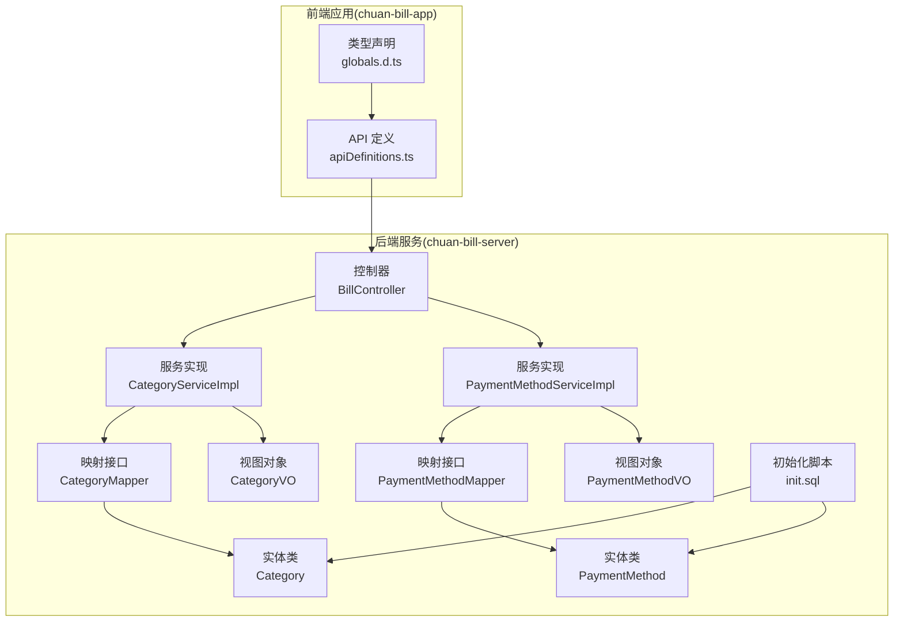
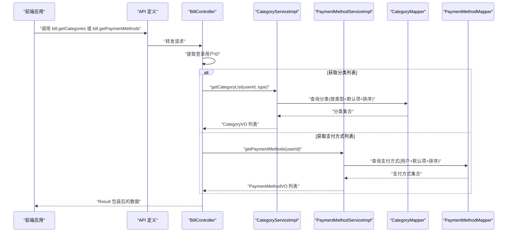
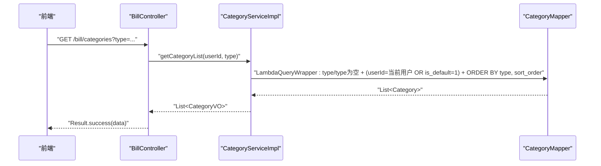
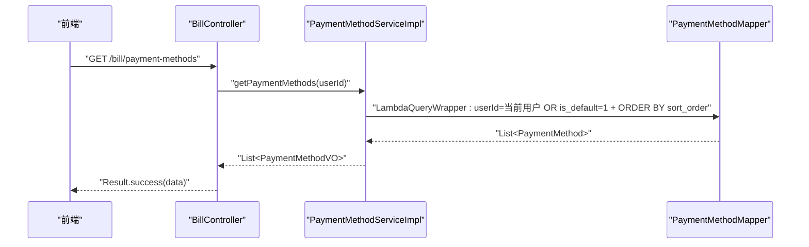
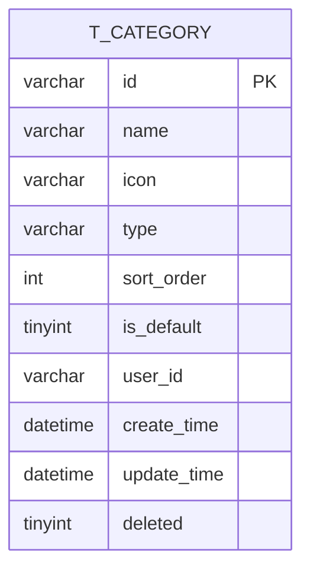
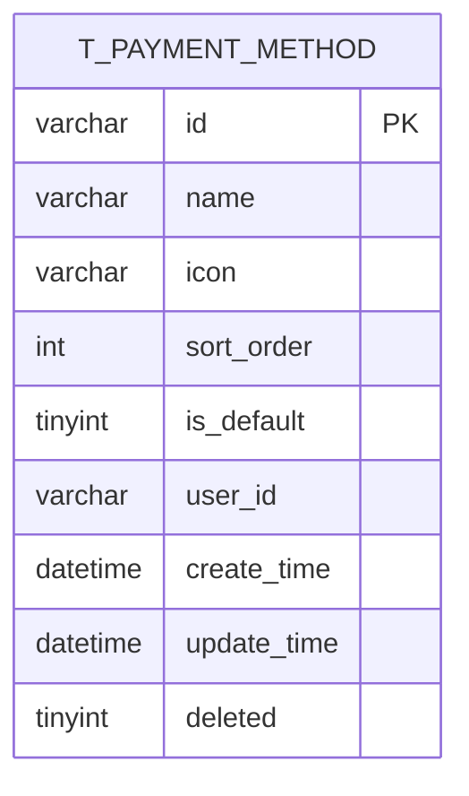
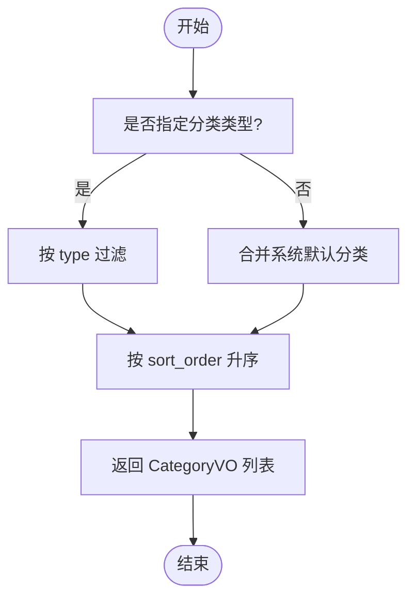
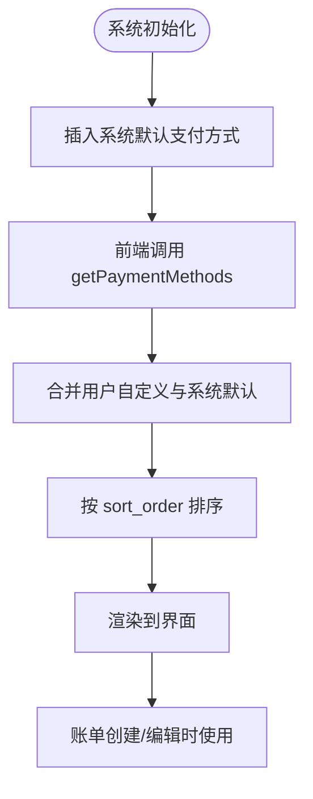
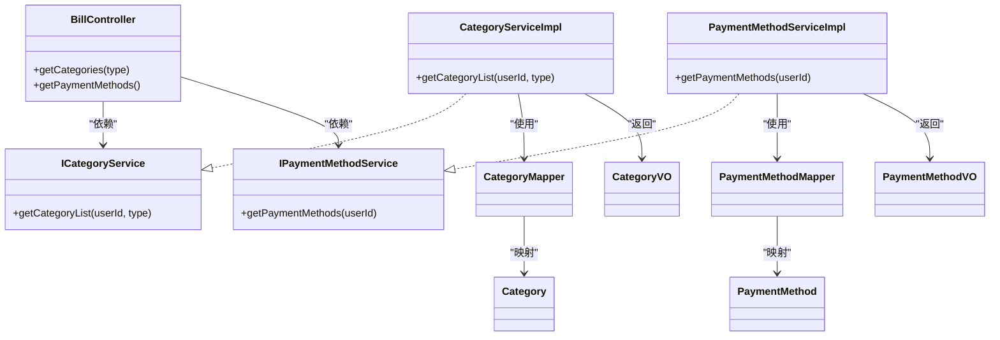

# 账单分类与支付方式管理

<cite>
**本文引用的文件**
- [chuan-bill-server/src/main/java/com/samoy/chuanbillserver/controller/BillController.java](file://chuan-bill-server/src/main/java/com/samoy/chuanbillserver/controller/BillController.java)
- [chuan-bill-server/src/main/java/com/samoy/chuanbillserver/service/impl/CategoryServiceImpl.java](file://chuan-bill-server/src/main/java/com/samoy/chuanbillserver/service/impl/CategoryServiceImpl.java)
- [chuan-bill-server/src/main/java/com/samoy/chuanbillserver/service/impl/PaymentMethodServiceImpl.java](file://chuan-bill-server/src/main/java/com/samoy/chuanbillserver/service/impl/PaymentMethodServiceImpl.java)
- [chuan-bill-server/src/main/java/com/samoy/chuanbillserver/entity/Category.java](file://chuan-bill-server/src/main/java/com/samoy/chuanbillserver/entity/Category.java)
- [chuan-bill-server/src/main/java/com/samoy/chuanbillserver/entity/PaymentMethod.java](file://chuan-bill-server/src/main/java/com/samoy/chuanbillserver/entity/PaymentMethod.java)
- [chuan-bill-server/src/main/java/com/samoy/chuanbillserver/vo/CategoryVO.java](file://chuan-bill-server/src/main/java/com/samoy/chuanbillserver/vo/CategoryVO.java)
- [chuan-bill-server/src/main/java/com/samoy/chuanbillserver/vo/PaymentMethodVO.java](file://chuan-bill-server/src/main/java/com/samoy/chuanbillserver/vo/PaymentMethodVO.java)
- [chuan-bill-server/init.sql](file://chuan-bill-server/init.sql)
- [chuan-bill-app/src/api/apiDefinitions.ts](file://chuan-bill-app/src/api/apiDefinitions.ts)
- [chuan-bill-app/src/api/globals.d.ts](file://chuan-bill-app/src/api/globals.d.ts)
</cite>

## 目录
1. [简介](#简介)
2. [项目结构](#项目结构)
3. [核心组件](#核心组件)
4. [架构总览](#架构总览)
5. [详细组件分析](#详细组件分析)
6. [依赖分析](#依赖分析)
7. [性能考虑](#性能考虑)
8. [故障排查指南](#故障排查指南)
9. [结论](#结论)
10. [附录](#附录)

## 简介
本文件聚焦于账单分类与支付方式管理功能的API设计与实现，覆盖以下目标：
- 明确获取分类列表接口(bill.getCategories)的数据结构、层级关系与分类类型定义
- 解释支付方式管理接口(bill.getPaymentMethods)的实现，包括默认支付方式与系统预设支付方式的展示策略
- 阐述分类体系的设计理念：收入分类与支出分类的区分、默认类目的作用与可见性规则
- 提供支付方式的默认值配置、排序规则与数据同步机制的实现思路
- 给出接口示例、数据模型说明与典型使用场景分析

## 项目结构
后端采用Spring Boot + MyBatis-Plus，接口集中在控制器层；业务逻辑在服务层；数据模型在实体与视图对象中定义；数据库初始化脚本包含系统预设的分类与支付方式。

图表来源
- [chuan-bill-server/src/main/java/com/samoy/chuanbillserver/controller/BillController.java:74-89](file://chuan-bill-server/src/main/java/com/samoy/chuanbillserver/controller/BillController.java#L74-L89)
- [chuan-bill-server/src/main/java/com/samoy/chuanbillserver/service/impl/CategoryServiceImpl.java:20-46](file://chuan-bill-server/src/main/java/com/samoy/chuanbillserver/service/impl/CategoryServiceImpl.java#L20-L46)
- [chuan-bill-server/src/main/java/com/samoy/chuanbillserver/service/impl/PaymentMethodServiceImpl.java:20-43](file://chuan-bill-server/src/main/java/com/samoy/chuanbillserver/service/impl/PaymentMethodServiceImpl.java#L20-L43)
- [chuan-bill-server/init.sql:33-326](file://chuan-bill-server/init.sql#L33-L326)

章节来源
- [chuan-bill-server/src/main/java/com/samoy/chuanbillserver/controller/BillController.java:23-89](file://chuan-bill-server/src/main/java/com/samoy/chuanbillserver/controller/BillController.java#L23-L89)
- [chuan-bill-app/src/api/apiDefinitions.ts:19-37](file://chuan-bill-app/src/api/apiDefinitions.ts#L19-L37)

## 核心组件
- 控制器层：提供REST接口，负责鉴权上下文提取与结果封装
- 服务层：实现分类与支付方式的查询逻辑，包含默认项合并与排序
- 数据访问层：基于MyBatis-Plus的Mapper接口
- 实体与视图：定义持久化字段与对外传输结构
- 初始化脚本：提供系统预设的分类与支付方式

章节来源
- [chuan-bill-server/src/main/java/com/samoy/chuanbillserver/controller/BillController.java:23-89](file://chuan-bill-server/src/main/java/com/samoy/chuanbillserver/controller/BillController.java#L23-L89)
- [chuan-bill-server/src/main/java/com/samoy/chuanbillserver/service/impl/CategoryServiceImpl.java:20-46](file://chuan-bill-server/src/main/java/com/samoy/chuanbillserver/service/impl/CategoryServiceImpl.java#L20-L46)
- [chuan-bill-server/src/main/java/com/samoy/chuanbillserver/service/impl/PaymentMethodServiceImpl.java:20-43](file://chuan-bill-server/src/main/java/com/samoy/chuanbillserver/service/impl/PaymentMethodServiceImpl.java#L20-L43)
- [chuan-bill-server/src/main/java/com/samoy/chuanbillserver/entity/Category.java:20-87](file://chuan-bill-server/src/main/java/com/samoy/chuanbillserver/entity/Category.java#L20-L87)
- [chuan-bill-server/src/main/java/com/samoy/chuanbillserver/entity/PaymentMethod.java:20-81](file://chuan-bill-server/src/main/java/com/samoy/chuanbillserver/entity/PaymentMethod.java#L20-L81)
- [chuan-bill-server/src/main/java/com/samoy/chuanbillserver/vo/CategoryVO.java:6-29](file://chuan-bill-server/src/main/java/com/samoy/chuanbillserver/vo/CategoryVO.java#L6-L29)
- [chuan-bill-server/src/main/java/com/samoy/chuanbillserver/vo/PaymentMethodVO.java:6-26](file://chuan-bill-server/src/main/java/com/samoy/chuanbillserver/vo/PaymentMethodVO.java#L6-L26)
- [chuan-bill-server/init.sql:33-326](file://chuan-bill-server/init.sql#L33-L326)

## 架构总览
账单分类与支付方式管理遵循“控制器-服务-数据访问-实体/视图”的分层架构。前端通过API定义文件调用后端接口，控制器从鉴权上下文中获取用户标识，服务层执行查询并返回视图对象，最终由控制器统一包装为标准响应。

图表来源
- [chuan-bill-server/src/main/java/com/samoy/chuanbillserver/controller/BillController.java:74-89](file://chuan-bill-server/src/main/java/com/samoy/chuanbillserver/controller/BillController.java#L74-L89)
- [chuan-bill-server/src/main/java/com/samoy/chuanbillserver/service/impl/CategoryServiceImpl.java:22-46](file://chuan-bill-server/src/main/java/com/samoy/chuanbillserver/service/impl/CategoryServiceImpl.java#L22-L46)
- [chuan-bill-server/src/main/java/com/samoy/chuanbillserver/service/impl/PaymentMethodServiceImpl.java:23-43](file://chuan-bill-server/src/main/java/com/samoy/chuanbillserver/service/impl/PaymentMethodServiceImpl.java#L23-L43)

## 详细组件分析

### 接口：获取分类列表（bill.getCategories）
- 接口路径：/bill/categories
- 方法：GET
- 参数：
  - type：可选，字符串，取值范围为 income（收入）或 expense（支出），用于筛选分类类型
- 返回：Result<List<CategoryVO>>
- 查询逻辑：
  - 若传入 type，则仅返回对应类型的分类
  - 无 type 时，返回该用户的自定义分类，并合并系统默认分类（is_default=1）
  - 排序规则：先按类型分组，再按 sort_order 升序排列
- 默认项策略：
  - 系统默认分类对所有用户可见，用户自定义分类仅对当前用户可见
  - 合并策略通过 OR 条件实现，确保系统默认项始终出现

图表来源
- [chuan-bill-server/src/main/java/com/samoy/chuanbillserver/controller/BillController.java:74-81](file://chuan-bill-server/src/main/java/com/samoy/chuanbillserver/controller/BillController.java#L74-L81)
- [chuan-bill-server/src/main/java/com/samoy/chuanbillserver/service/impl/CategoryServiceImpl.java:22-46](file://chuan-bill-server/src/main/java/com/samoy/chuanbillserver/service/impl/CategoryServiceImpl.java#L22-L46)

章节来源
- [chuan-bill-server/src/main/java/com/samoy/chuanbillserver/controller/BillController.java:74-81](file://chuan-bill-server/src/main/java/com/samoy/chuanbillserver/controller/BillController.java#L74-L81)
- [chuan-bill-server/src/main/java/com/samoy/chuanbillserver/service/impl/CategoryServiceImpl.java:22-46](file://chuan-bill-server/src/main/java/com/samoy/chuanbillserver/service/impl/CategoryServiceImpl.java#L22-L46)
- [chuan-bill-server/src/main/java/com/samoy/chuanbillserver/vo/CategoryVO.java:6-29](file://chuan-bill-server/src/main/java/com/samoy/chuanbillserver/vo/CategoryVO.java#L6-L29)
- [chuan-bill-server/src/main/java/com/samoy/chuanbillserver/entity/Category.java:20-87](file://chuan-bill-server/src/main/java/com/samoy/chuanbillserver/entity/Category.java#L20-L87)
- [chuan-bill-server/init.sql:33-120](file://chuan-bill-server/init.sql#L33-L120)

### 接口：获取支付方式列表（bill.getPaymentMethods）
- 接口路径：/bill/payment-methods
- 方法：GET
- 参数：无
- 返回：Result<List<PaymentMethodVO>>
- 查询逻辑：
  - 返回当前用户自定义的支付方式，并合并系统默认支付方式（is_default=1）
  - 按 sort_order 升序排列
- 默认项策略：
  - 系统默认支付方式对所有用户可见，作为基础选项
  - 用户可在个人设置中新增自定义支付方式，不影响系统默认项

图表来源
- [chuan-bill-server/src/main/java/com/samoy/chuanbillserver/controller/BillController.java:83-89](file://chuan-bill-server/src/main/java/com/samoy/chuanbillserver/controller/BillController.java#L83-L89)
- [chuan-bill-server/src/main/java/com/samoy/chuanbillserver/service/impl/PaymentMethodServiceImpl.java:23-43](file://chuan-bill-server/src/main/java/com/samoy/chuanbillserver/service/impl/PaymentMethodServiceImpl.java#L23-L43)

章节来源
- [chuan-bill-server/src/main/java/com/samoy/chuanbillserver/controller/BillController.java:83-89](file://chuan-bill-server/src/main/java/com/samoy/chuanbillserver/controller/BillController.java#L83-L89)
- [chuan-bill-server/src/main/java/com/samoy/chuanbillserver/service/impl/PaymentMethodServiceImpl.java:23-43](file://chuan-bill-server/src/main/java/com/samoy/chuanbillserver/service/impl/PaymentMethodServiceImpl.java#L23-L43)
- [chuan-bill-server/src/main/java/com/samoy/chuanbillserver/vo/PaymentMethodVO.java:6-26](file://chuan-bill-server/src/main/java/com/samoy/chuanbillserver/vo/PaymentMethodVO.java#L6-L26)
- [chuan-bill-server/src/main/java/com/samoy/chuanbillserver/entity/PaymentMethod.java:20-81](file://chuan-bill-server/src/main/java/com/samoy/chuanbillserver/entity/PaymentMethod.java#L20-L81)
- [chuan-bill-server/init.sql:314-326](file://chuan-bill-server/init.sql#L314-L326)

### 数据模型与字段说明

#### 分类模型（Category/CategoryVO）
- 字段要点
  - id：分类唯一标识
  - name：分类名称
  - icon：图标URL
  - type：分类类型，取值 income（收入）或 expense（支出）
  - sortOrder：排序权重，数值越小越靠前
  - isDefault：是否为系统默认分类
  - userId：所属用户ID；为空表示系统预设
  - createTime/updateTime/deleted：时间与软删除标记
- 视图对象（CategoryVO）用于对外传输，字段与实体一一对应

图表来源
- [chuan-bill-server/src/main/java/com/samoy/chuanbillserver/entity/Category.java:24-87](file://chuan-bill-server/src/main/java/com/samoy/chuanbillserver/entity/Category.java#L24-L87)
- [chuan-bill-server/src/main/java/com/samoy/chuanbillserver/vo/CategoryVO.java:8-29](file://chuan-bill-server/src/main/java/com/samoy/chuanbillserver/vo/CategoryVO.java#L8-L29)

章节来源
- [chuan-bill-server/src/main/java/com/samoy/chuanbillserver/entity/Category.java:24-87](file://chuan-bill-server/src/main/java/com/samoy/chuanbillserver/entity/Category.java#L24-L87)
- [chuan-bill-server/src/main/java/com/samoy/chuanbillserver/vo/CategoryVO.java:8-29](file://chuan-bill-server/src/main/java/com/samoy/chuanbillserver/vo/CategoryVO.java#L8-L29)

#### 支付方式模型（PaymentMethod/PaymentMethodVO）
- 字段要点
  - id：支付方式唯一标识
  - name：支付方式名称
  - icon：图标URL
  - sortOrder：排序权重，数值越小越靠前
  - isDefault：是否为系统默认支付方式
  - userId：所属用户ID；为空表示系统预设
  - createTime/updateTime/deleted：时间与软删除标记
- 视图对象（PaymentMethodVO）用于对外传输，字段与实体一一对应

图表来源
- [chuan-bill-server/src/main/java/com/samoy/chuanbillserver/entity/PaymentMethod.java:24-81](file://chuan-bill-server/src/main/java/com/samoy/chuanbillserver/entity/PaymentMethod.java#L24-L81)
- [chuan-bill-server/src/main/java/com/samoy/chuanbillserver/vo/PaymentMethodVO.java:7-26](file://chuan-bill-server/src/main/java/com/samoy/chuanbillserver/vo/PaymentMethodVO.java#L7-L26)

章节来源
- [chuan-bill-server/src/main/java/com/samoy/chuanbillserver/entity/PaymentMethod.java:24-81](file://chuan-bill-server/src/main/java/com/samoy/chuanbillserver/entity/PaymentMethod.java#L24-L81)
- [chuan-bill-server/src/main/java/com/samoy/chuanbillserver/vo/PaymentMethodVO.java:7-26](file://chuan-bill-server/src/main/java/com/samoy/chuanbillserver/vo/PaymentMethodVO.java#L7-L26)

### 分类体系设计理念
- 收入分类与支出分类的区分
  - 通过 type 字段明确区分 income 与 expense
  - 查询时可按 type 过滤，或在不传参时合并用户自定义与系统默认两类
- 默认类目的作用
  - 系统默认类目对所有用户可见，保证新用户有基础分类可用
  - 用户可基于默认类目进行二次编辑或新增自定义类目
- 层级关系与父子分类
  - 当前模型为扁平分类，未见父子关系字段
  - 若需扩展父子层级，建议增加 parentId 字段并在服务层实现树形组装

图表来源
- [chuan-bill-server/src/main/java/com/samoy/chuanbillserver/service/impl/CategoryServiceImpl.java:22-46](file://chuan-bill-server/src/main/java/com/samoy/chuanbillserver/service/impl/CategoryServiceImpl.java#L22-L46)

章节来源
- [chuan-bill-server/src/main/java/com/samoy/chuanbillserver/service/impl/CategoryServiceImpl.java:22-46](file://chuan-bill-server/src/main/java/com/samoy/chuanbillserver/service/impl/CategoryServiceImpl.java#L22-L46)
- [chuan-bill-server/init.sql:203-312](file://chuan-bill-server/init.sql#L203-L312)

### 支付方式的默认值配置与数据同步
- 默认值配置
  - 系统默认支付方式在初始化脚本中定义，is_default=1，sort_order 决定显示顺序
- 数据同步机制
  - 前端通过 bill.getPaymentMethods 获取最新列表，包含用户自定义与系统默认
  - 若用户新增自定义支付方式，应通过后续的账单创建/编辑流程体现其选择
  - 若系统默认项变更，需在服务端更新初始化脚本并重新部署，以保证新用户获得一致体验

图表来源
- [chuan-bill-server/init.sql:314-326](file://chuan-bill-server/init.sql#L314-L326)
- [chuan-bill-server/src/main/java/com/samoy/chuanbillserver/service/impl/PaymentMethodServiceImpl.java:23-43](file://chuan-bill-server/src/main/java/com/samoy/chuanbillserver/service/impl/PaymentMethodServiceImpl.java#L23-L43)

章节来源
- [chuan-bill-server/init.sql:314-326](file://chuan-bill-server/init.sql#L314-L326)
- [chuan-bill-server/src/main/java/com/samoy/chuanbillserver/service/impl/PaymentMethodServiceImpl.java:23-43](file://chuan-bill-server/src/main/java/com/samoy/chuanbillserver/service/impl/PaymentMethodServiceImpl.java#L23-L43)

### 接口示例与使用场景
- 获取分类列表
  - 请求：GET /bill/categories?type=expense
  - 场景：筛选支出类目，用于快速选择
- 获取支付方式列表
  - 请求：GET /bill/payment-methods
  - 场景：账单录入时展示支付方式，便于选择默认项
- 前端调用入口
  - bill.getCategories 与 bill.getPaymentMethods 在API定义文件中注册，前端通过类型声明进行调用

章节来源
- [chuan-bill-app/src/api/apiDefinitions.ts:19-37](file://chuan-bill-app/src/api/apiDefinitions.ts#L19-L37)
- [chuan-bill-app/src/api/globals.d.ts:937-971](file://chuan-bill-app/src/api/globals.d.ts#L937-L971)

## 依赖分析
- 控制器依赖服务接口，服务实现依赖Mapper接口
- 查询条件通过LambdaQueryWrapper构建，避免手写SQL
- 默认项与用户项通过OR条件合并，确保系统默认项始终可见

图表来源
- [chuan-bill-server/src/main/java/com/samoy/chuanbillserver/controller/BillController.java:23-89](file://chuan-bill-server/src/main/java/com/samoy/chuanbillserver/controller/BillController.java#L23-L89)
- [chuan-bill-server/src/main/java/com/samoy/chuanbillserver/service/impl/CategoryServiceImpl.java:20-46](file://chuan-bill-server/src/main/java/com/samoy/chuanbillserver/service/impl/CategoryServiceImpl.java#L20-L46)
- [chuan-bill-server/src/main/java/com/samoy/chuanbillserver/service/impl/PaymentMethodServiceImpl.java:20-43](file://chuan-bill-server/src/main/java/com/samoy/chuanbillserver/service/impl/PaymentMethodServiceImpl.java#L20-L43)

章节来源
- [chuan-bill-server/src/main/java/com/samoy/chuanbillserver/controller/BillController.java:23-89](file://chuan-bill-server/src/main/java/com/samoy/chuanbillserver/controller/BillController.java#L23-L89)
- [chuan-bill-server/src/main/java/com/samoy/chuanbillserver/service/impl/CategoryServiceImpl.java:20-46](file://chuan-bill-server/src/main/java/com/samoy/chuanbillserver/service/impl/CategoryServiceImpl.java#L20-L46)
- [chuan-bill-server/src/main/java/com/samoy/chuanbillserver/service/impl/PaymentMethodServiceImpl.java:20-43](file://chuan-bill-server/src/main/java/com/samoy/chuanbillserver/service/impl/PaymentMethodServiceImpl.java#L20-L43)

## 性能考虑
- 查询优化
  - 使用LambdaQueryWrapper进行条件拼接，避免复杂SQL
  - 对排序字段建立索引，提升排序效率
- 缓存策略
  - 可对系统默认分类与支付方式进行缓存，减少重复查询
- 分页与过滤
  - 若数据量增长，建议在账单列表等场景引入分页与更细粒度的过滤条件

## 故障排查指南
- 无法看到系统默认分类/支付方式
  - 检查服务层查询条件是否正确合并默认项
  - 确认初始化脚本是否成功执行
- 排序异常
  - 检查 sort_order 字段是否正确赋值
  - 确认查询是否按 sort_order 升序
- 类型筛选无效
  - 确认前端传参 type 的取值是否为 income 或 expense

章节来源
- [chuan-bill-server/src/main/java/com/samoy/chuanbillserver/service/impl/CategoryServiceImpl.java:22-46](file://chuan-bill-server/src/main/java/com/samoy/chuanbillserver/service/impl/CategoryServiceImpl.java#L22-L46)
- [chuan-bill-server/src/main/java/com/samoy/chuanbillserver/service/impl/PaymentMethodServiceImpl.java:23-43](file://chuan-bill-server/src/main/java/com/samoy/chuanbillserver/service/impl/PaymentMethodServiceImpl.java#L23-L43)
- [chuan-bill-server/init.sql:314-326](file://chuan-bill-server/init.sql#L314-L326)

## 结论
本方案通过清晰的分层架构与默认项合并策略，实现了分类与支付方式的灵活管理。系统默认项确保用户体验一致性，用户自定义项满足个性化需求。未来可进一步扩展父子分类、排序调整与批量操作能力，持续优化交互与性能。

## 附录
- 初始化脚本中的系统默认分类与支付方式
  - 收入类目：工资、奖金、投资、兼职、礼金、退款、其他收入
  - 支出类目：餐饮、购物、交通、娱乐、医疗、教育、其他支出
  - 支付方式：微信、支付宝、现金、银行卡、信用卡、花呗、其他

章节来源
- [chuan-bill-server/init.sql:203-326](file://chuan-bill-server/init.sql#L203-L326)