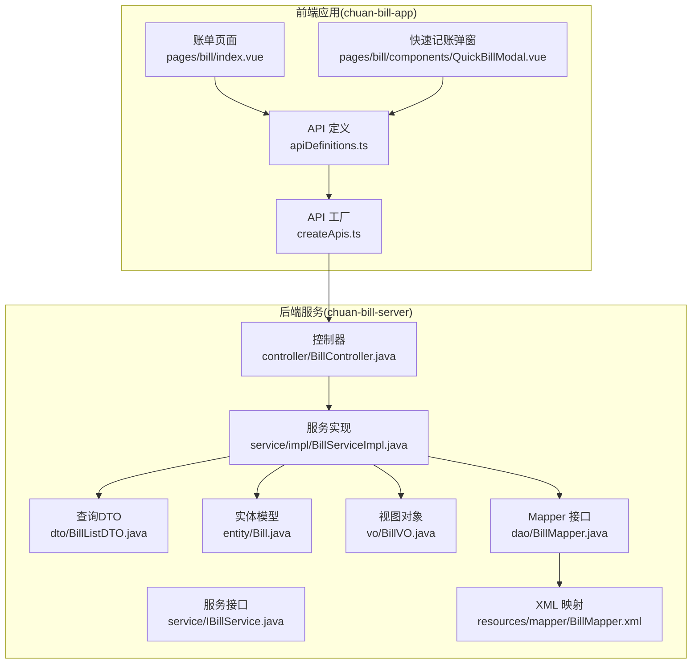
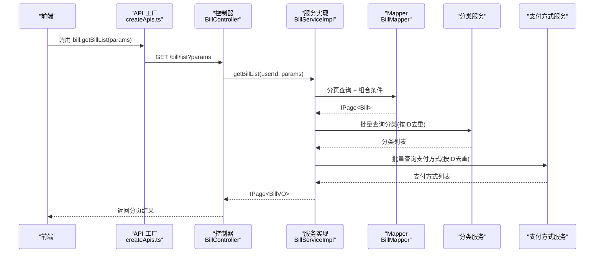
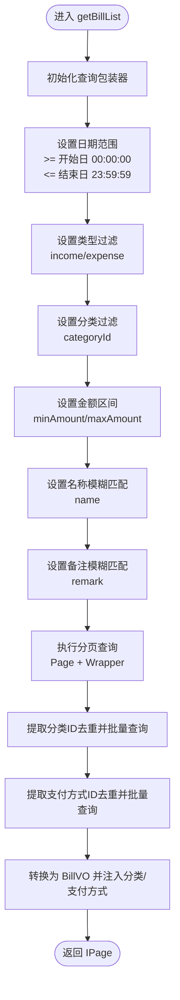
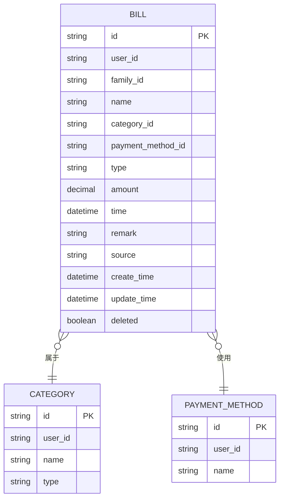
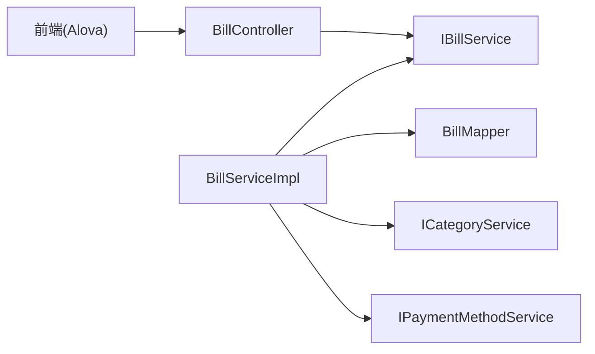

# 账单列表与搜索筛选

<cite>
**本文引用的文件**
- [BillController.java](file://chuan-bill-server/src/main/java/com/samoy/chuanbillserver/controller/BillController.java)
- [BillServiceImpl.java](file://chuan-bill-server/src/main/java/com/samoy/chuanbillserver/service/impl/BillServiceImpl.java)
- [IBillService.java](file://chuan-bill-server/src/main/java/com/samoy/chuanbillserver/service/IBillService.java)
- [BillListDTO.java](file://chuan-bill-server/src/main/java/com/samoy/chuanbillserver/dto/BillListDTO.java)
- [Bill.java](file://chuan-bill-server/src/main/java/com/samoy/chuanbillserver/entity/Bill.java)
- [BillVO.java](file://chuan-bill-server/src/main/java/com/samoy/chuanbillserver/vo/BillVO.java)
- [BillMapper.java](file://chuan-bill-server/src/main/java/com/samoy/chuanbillserver/dao/BillMapper.java)
- [BillMapper.xml](file://chuan-bill-server/src/main/resources/mapper/BillMapper.xml)
- [apiDefinitions.ts](file://chuan-bill-app/src/api/apiDefinitions.ts)
- [createApis.ts](file://chuan-bill-app/src/api/createApis.ts)
- [index.vue](file://chuan-bill-app/src/pages/bill/index.vue)
- [QuickBillModal.vue](file://chuan-bill-app/src/pages/bill/components/QuickBillModal.vue)
</cite>

## 目录
1. [简介](#简介)
2. [项目结构](#项目结构)
3. [核心组件](#核心组件)
4. [架构总览](#架构总览)
5. [详细组件分析](#详细组件分析)
6. [依赖分析](#依赖分析)
7. [性能考虑](#性能考虑)
8. [故障排查指南](#故障排查指南)
9. [结论](#结论)
10. [附录](#附录)

## 简介
本文件面向“账单列表查询与搜索筛选”能力，提供完整、可操作的API文档与实现解析。重点覆盖以下内容：
- 列表接口 bill.getBillList 的分页机制、排序规则与数据格式
- 搜索与筛选功能：时间范围、账单类型、金额区间、名称/备注关键词模糊匹配
- 高级筛选：分类、支付方式、来源等条件的使用方法
- 批量查询与条件组合查询的实现思路
- 查询参数说明、响应数据结构、性能优化建议与实际使用示例

## 项目结构
后端采用 Spring Boot + MyBatis-Plus 架构，账单模块通过控制器层接收请求，服务层进行业务处理与条件拼装，持久层基于 XML 映射器执行查询；前端通过 Alova 生成的 API 方法调用后端接口。

图表来源
- [apiDefinitions.ts:19-37](file://chuan-bill-app/src/api/apiDefinitions.ts#L19-L37)
- [createApis.ts:65-76](file://chuan-bill-app/src/api/createApis.ts#L65-L76)
- [BillController.java:23-42](file://chuan-bill-server/src/main/java/com/samoy/chuanbillserver/controller/BillController.java#L23-L42)
- [BillServiceImpl.java:50-123](file://chuan-bill-server/src/main/java/com/samoy/chuanbillserver/service/impl/BillServiceImpl.java#L50-L123)
- [BillMapper.java:1-15](file://chuan-bill-server/src/main/java/com/samoy/chuanbillserver/dao/BillMapper.java#L1-L15)
- [BillMapper.xml:1-6](file://chuan-bill-server/src/main/resources/mapper/BillMapper.xml#L1-L6)

章节来源
- [BillController.java:23-42](file://chuan-bill-server/src/main/java/com/samoy/chuanbillserver/controller/BillController.java#L23-L42)
- [BillServiceImpl.java:50-123](file://chuan-bill-server/src/main/java/com/samoy/chuanbillserver/service/impl/BillServiceImpl.java#L50-L123)
- [BillMapper.java:1-15](file://chuan-bill-server/src/main/java/com/samoy/chuanbillserver/dao/BillMapper.java#L1-L15)
- [BillMapper.xml:1-6](file://chuan-bill-server/src/main/resources/mapper/BillMapper.xml#L1-L6)
- [apiDefinitions.ts:19-37](file://chuan-bill-app/src/api/apiDefinitions.ts#L19-L37)
- [createApis.ts:65-76](file://chuan-bill-app/src/api/createApis.ts#L65-L76)
- [index.vue:1-54](file://chuan-bill-app/src/pages/bill/index.vue#L1-L54)
- [QuickBillModal.vue:1-64](file://chuan-bill-app/src/pages/bill/components/QuickBillModal.vue#L1-L64)

## 核心组件
- 控制器层：提供 /bill/list 接口，负责鉴权与参数转发
- 服务层：组装查询条件、执行分页查询、批量预加载关联信息
- 数据传输层：BillListDTO 定义查询参数，BillVO 定义响应结构
- 实体与映射：Bill 实体、BillMapper 接口与 XML 映射

章节来源
- [BillController.java:37-42](file://chuan-bill-server/src/main/java/com/samoy/chuanbillserver/controller/BillController.java#L37-L42)
- [BillServiceImpl.java:50-123](file://chuan-bill-server/src/main/java/com/samoy/chuanbillserver/service/impl/BillServiceImpl.java#L50-L123)
- [BillListDTO.java:10-41](file://chuan-bill-server/src/main/java/com/samoy/chuanbillserver/dto/BillListDTO.java#L10-L41)
- [BillVO.java:11-43](file://chuan-bill-server/src/main/java/com/samoy/chuanbillserver/vo/BillVO.java#L11-L43)
- [Bill.java:25-112](file://chuan-bill-server/src/main/java/com/samoy/chuanbillserver/entity/Bill.java#L25-L112)
- [BillMapper.java:1-15](file://chuan-bill-server/src/main/java/com/samoy/chuanbillserver/dao/BillMapper.java#L1-L15)

## 架构总览
账单列表查询的关键流程如下：

图表来源
- [BillController.java:37-42](file://chuan-bill-server/src/main/java/com/samoy/chuanbillserver/controller/BillController.java#L37-L42)
- [BillServiceImpl.java:50-123](file://chuan-bill-server/src/main/java/com/samoy/chuanbillserver/service/impl/BillServiceImpl.java#L50-L123)
- [BillMapper.java:1-15](file://chuan-bill-server/src/main/java/com/samoy/chuanbillserver/dao/BillMapper.java#L1-L15)
- [apiDefinitions.ts:33-33](file://chuan-bill-app/src/api/apiDefinitions.ts#L33-L33)

## 详细组件分析

### 接口：获取账单列表 bill.getBillList
- 请求方法与路径
  - 方法：GET
  - 路径：/bill/list
  - 前端调用：通过 Alova 生成的方法调用
- 鉴权与上下文
  - 通过统一鉴权工具获取当前登录用户ID，并作为查询条件之一
- 查询参数（BillListDTO）
  - 日期范围：startDate、endDate（格式：yyyy-MM-dd）
  - 类型过滤：type（枚举：income、expense）
  - 分类过滤：categoryId（字符串）
  - 金额区间：minAmount、maxAmount（BigDecimal，最多10位整数+2位小数）
  - 关键词搜索：name（账单名称，模糊匹配）、remark（账单备注，模糊匹配）
  - 分页参数：page（默认1，最小1）、size（默认10，最小1）
- 排序规则
  - 默认按时间降序，时间相同时按创建时间降序
- 响应数据结构（IPage<BillVO>）
  - 总条数、总页数、当前页数据 records
  - 每条记录包含：id、name、category、paymentMethod、type、amount、time、remark、source、familyId

章节来源
- [BillController.java:37-42](file://chuan-bill-server/src/main/java/com/samoy/chuanbillserver/controller/BillController.java#L37-L42)
- [BillServiceImpl.java:50-123](file://chuan-bill-server/src/main/java/com/samoy/chuanbillserver/service/impl/BillServiceImpl.java#L50-L123)
- [BillListDTO.java:10-41](file://chuan-bill-server/src/main/java/com/samoy/chuanbillserver/dto/BillListDTO.java#L10-L41)
- [BillVO.java:11-43](file://chuan-bill-server/src/main/java/com/samoy/chuanbillserver/vo/BillVO.java#L11-L43)

### 查询条件与实现要点
- 时间范围查询
  - 开始日期：取当日 00:00:00
  - 结束日期：取当日 23:59:59
- 类型过滤
  - 仅允许 income 或 expense
- 金额区间
  - 最小值与最大值均进行非负校验与精度校验
- 名称与备注模糊匹配
  - 使用数据库 LIKE 进行模糊匹配
- 分类与支付方式
  - 通过批量查询避免 N+1 问题，使用 Map 缓存结果
- 分页与排序
  - 使用 MyBatis-Plus Page 与 LambdaQueryWrapper
  - 默认排序：按时间降序，时间相同时按创建时间降序

图表来源
- [BillServiceImpl.java:50-123](file://chuan-bill-server/src/main/java/com/samoy/chuanbillserver/service/impl/BillServiceImpl.java#L50-L123)

章节来源
- [BillServiceImpl.java:50-123](file://chuan-bill-server/src/main/java/com/samoy/chuanbillserver/service/impl/BillServiceImpl.java#L50-L123)

### 数据模型与关系

图表来源
- [Bill.java:25-112](file://chuan-bill-server/src/main/java/com/samoy/chuanbillserver/entity/Bill.java#L25-L112)

章节来源
- [Bill.java:25-112](file://chuan-bill-server/src/main/java/com/samoy/chuanbillserver/entity/Bill.java#L25-L112)

### 前端集成与使用
- 前端通过 Alova 生成的 API 方法调用后端接口
- 页面提供搜索框与筛选入口，配合快速记账弹窗
- 常见调用方式
  - 传入分页参数与筛选条件，获取 IPage<BillVO>
  - 支持多条件组合查询（如：日期范围 + 类型 + 金额区间 + 关键词）

章节来源
- [apiDefinitions.ts:33-33](file://chuan-bill-app/src/api/apiDefinitions.ts#L33-L33)
- [createApis.ts:65-76](file://chuan-bill-app/src/api/createApis.ts#L65-L76)
- [index.vue:24-37](file://chuan-bill-app/src/pages/bill/index.vue#L24-L37)
- [QuickBillModal.vue:26-52](file://chuan-bill-app/src/pages/bill/components/QuickBillModal.vue#L26-L52)

## 依赖分析
- 控制器依赖服务接口与鉴权工具
- 服务实现依赖 Mapper、分类与支付方式服务
- Mapper 通过 XML 映射执行 SQL
- 前端通过 Alova 动态生成方法并发起请求

图表来源
- [BillController.java:28-35](file://chuan-bill-server/src/main/java/com/samoy/chuanbillserver/controller/BillController.java#L28-L35)
- [BillServiceImpl.java:44-48](file://chuan-bill-server/src/main/java/com/samoy/chuanbillserver/service/impl/BillServiceImpl.java#L44-L48)
- [BillMapper.java:1-15](file://chuan-bill-server/src/main/java/com/samoy/chuanbillserver/dao/BillMapper.java#L1-L15)
- [apiDefinitions.ts:33-33](file://chuan-bill-app/src/api/apiDefinitions.ts#L33-L33)

章节来源
- [BillController.java:28-35](file://chuan-bill-server/src/main/java/com/samoy/chuanbillserver/controller/BillController.java#L28-L35)
- [BillServiceImpl.java:44-48](file://chuan-bill-server/src/main/java/com/samoy/chuanbillserver/service/impl/BillServiceImpl.java#L44-L48)
- [BillMapper.java:1-15](file://chuan-bill-server/src/main/java/com/samoy/chuanbillserver/dao/BillMapper.java#L1-L15)
- [apiDefinitions.ts:33-33](file://chuan-bill-app/src/api/apiDefinitions.ts#L33-L33)

## 性能考虑
- 预加载与批量查询
  - 对分类与支付方式进行 ID 去重后的批量查询，避免 N+1 查询
- 分页与排序
  - 使用 MyBatis-Plus 分页插件，减少一次性加载大量数据
- 查询条件
  - 合理使用日期范围边界（起始日 00:00:00、结束日 23:59:59），避免跨天误差
- 前端缓存
  - 对高频筛选条件进行本地缓存，减少重复请求
- 数据量控制
  - 合理设置 size，避免过大的分页尺寸导致内存压力

## 故障排查指南
- 参数校验失败
  - 日期格式需为 yyyy-MM-dd；类型必须为 income 或 expense；金额需为非负且符合精度要求；分页参数需为正整数
- 无数据或数据异常
  - 确认是否正确传入用户ID（由鉴权工具自动注入）；检查筛选条件是否过于严格
- 性能问题
  - 检查是否存在未使用的模糊匹配；适当缩小日期范围；合并多个筛选条件以提高命中率
- 响应字段缺失
  - 确认前端是否正确解析 IPage 结构；核对 BillVO 字段映射

## 结论
账单列表查询与搜索筛选功能通过清晰的参数约束、合理的分页与排序策略以及高效的批量预加载机制，实现了高性能、易扩展的查询体验。结合前端的搜索与筛选入口，用户可以灵活地进行多条件组合查询，满足日常记账场景下的多样化需求。

## 附录

### 查询参数说明（BillListDTO）
- startDate：开始日期，格式：yyyy-MM-dd
- endDate：结束日期，格式：yyyy-MM-dd
- categoryId：分类 ID
- type：账单类型，枚举值：income、expense
- minAmount：最小金额（非负，最多10位整数+2位小数）
- maxAmount：最大金额（非负，最多10位整数+2位小数）
- name：账单名称（模糊匹配，最大50字符）
- remark：账单备注（模糊匹配，最大500字符）
- page：页码，默认1，最小1
- size：每页数量，默认10，最小1

章节来源
- [BillListDTO.java:10-41](file://chuan-bill-server/src/main/java/com/samoy/chuanbillserver/dto/BillListDTO.java#L10-L41)

### 响应数据结构（IPage<BillVO>）
- 总条数、总页数、当前页数据 records
- 每条记录字段：
  - id：账单 ID
  - name：账单名称
  - category：分类信息（包含分类名称等）
  - paymentMethod：支付方式信息（包含支付方式名称等）
  - type：账单类型（income/expense）
  - amount：金额（字符串格式）
  - time：账单时间（格式化为 yyyy-MM-dd HH:mm）
  - remark：备注
  - source：来源（manual/ocr/voice/import 等）
  - familyId：家庭 ID（共享账单时存在）

章节来源
- [BillVO.java:11-43](file://chuan-bill-server/src/main/java/com/samoy/chuanbillserver/vo/BillVO.java#L11-L43)

### 实际使用示例
- 示例1：获取2024年1月的支出账单，每页显示20条
  - 参数：startDate=2024-01-01、endDate=2024-01-31、type=expense、page=1、size=20
- 示例2：按名称关键词“早餐”搜索，同时限定金额在10~50之间
  - 参数：name=早餐、minAmount=10.00、maxAmount=50.00
- 示例3：按分类ID筛选并按时间倒序
  - 参数：categoryId=分类ID、page=1、size=10
- 示例4：多条件组合（日期+类型+金额+关键词）
  - 参数：startDate=2024-01-01、endDate=2024-01-31、type=expense、minAmount=10、maxAmount=1000、name=购物

章节来源
- [BillController.java:37-42](file://chuan-bill-server/src/main/java/com/samoy/chuanbillserver/controller/BillController.java#L37-L42)
- [BillServiceImpl.java:50-123](file://chuan-bill-server/src/main/java/com/samoy/chuanbillserver/service/impl/BillServiceImpl.java#L50-L123)
- [BillListDTO.java:10-41](file://chuan-bill-server/src/main/java/com/samoy/chuanbillserver/dto/BillListDTO.java#L10-L41)