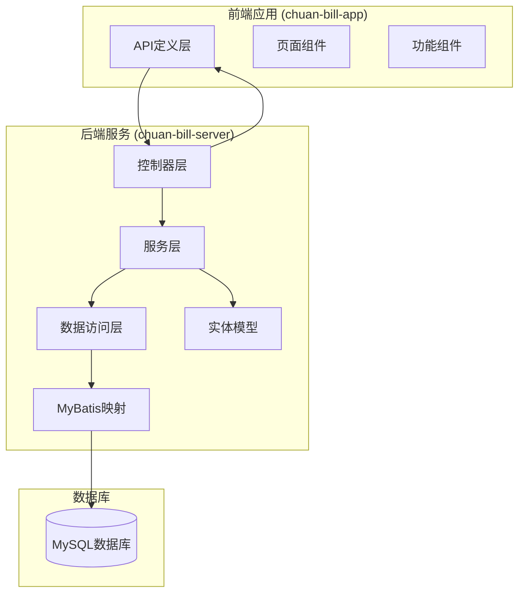
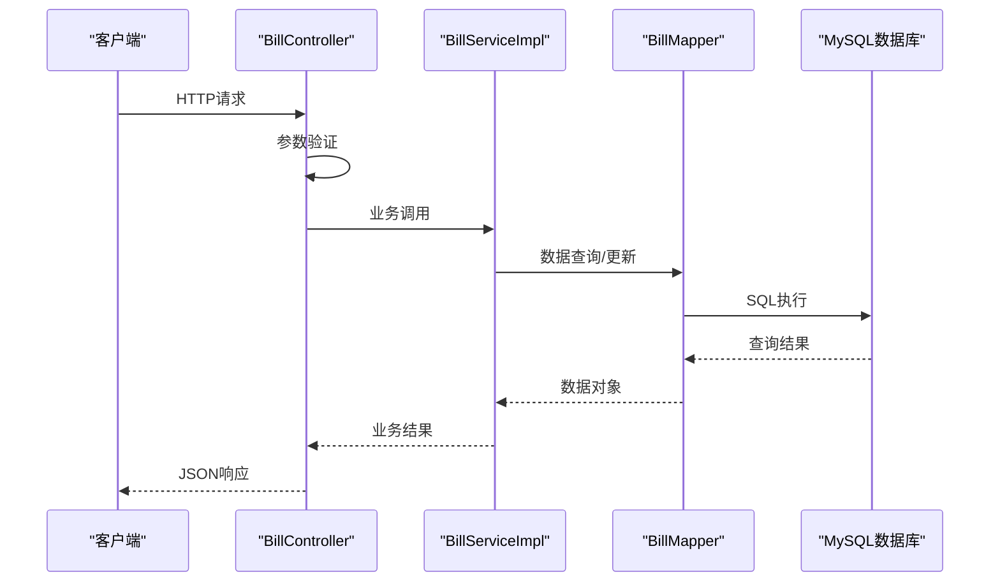
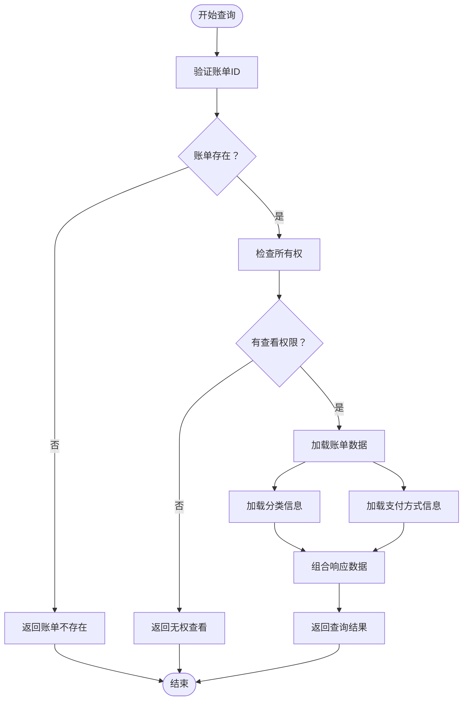
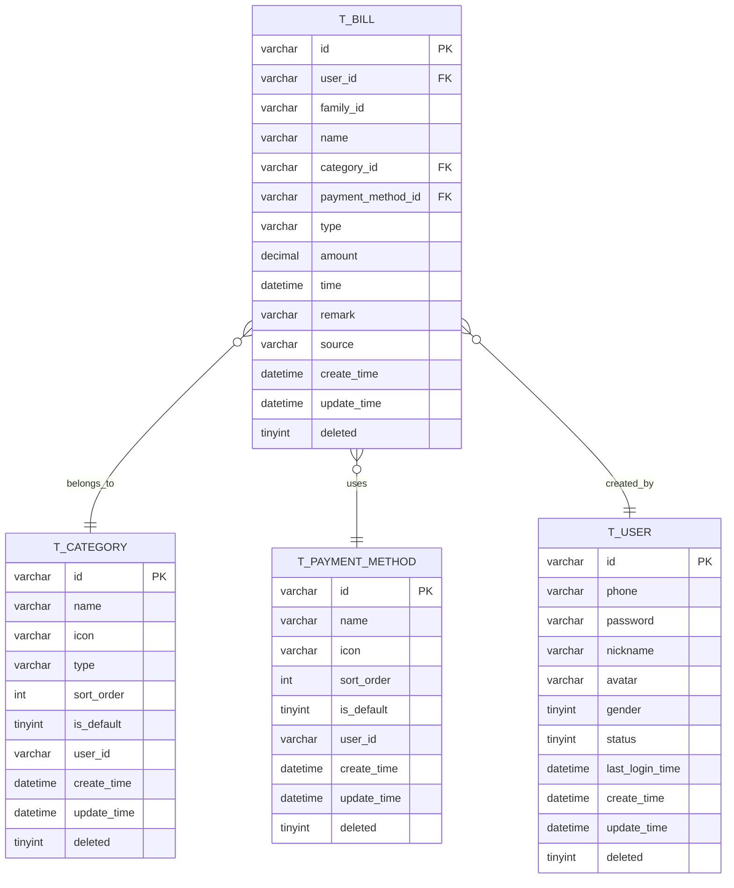
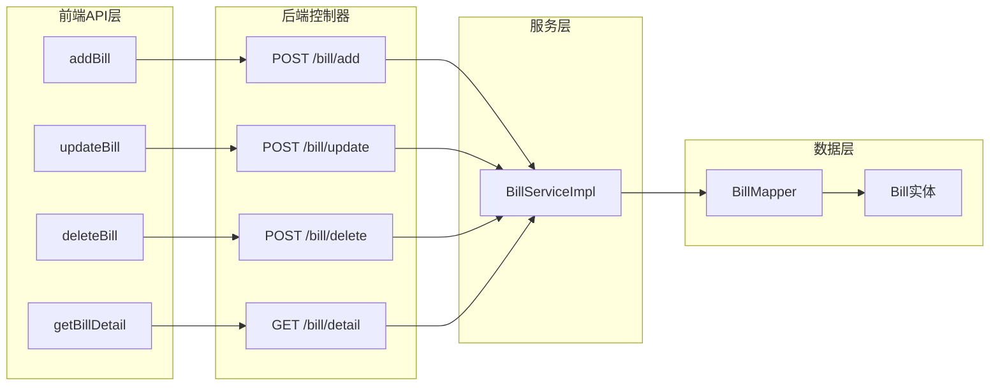

# 账单基础CRUD操作

<cite>
**本文档引用的文件**
- [BillController.java](file://chuan-bill-server/src/main/java/com/samoy/chuanbillserver/controller/BillController.java)
- [BillServiceImpl.java](file://chuan-bill-server/src/main/java/com/samoy/chuanbillserver/service/impl/BillServiceImpl.java)
- [Bill.java](file://chuan-bill-server/src/main/java/com/samoy/chuanbillserver/entity/Bill.java)
- [AddBillDTO.java](file://chuan-bill-server/src/main/java/com/samoy/chuanbillserver/dto/AddBillDTO.java)
- [UpdateBillDTO.java](file://chuan-bill-server/src/main/java/com/samoy/chuanbillserver/dto/UpdateBillDTO.java)
- [BillVO.java](file://chuan-bill-server/src/main/java/com/samoy/chuanbillserver/vo/BillVO.java)
- [Result.java](file://chuan-bill-server/src/main/java/com/samoy/chuanbillserver/result/Result.java)
- [ResultEnum.java](file://chuan-bill-server/src/main/java/com/samoy/chuanbillserver/result/ResultEnum.java)
- [BillMapper.xml](file://chuan-bill-server/src/main/resources/mapper/BillMapper.xml)
- [init.sql](file://chuan-bill-server/init.sql)
- [apiDefinitions.ts](file://chuan-bill-app/src/api/apiDefinitions.ts)
- [createApis.ts](file://chuan-bill-app/src/api/createApis.ts)
- [index.vue](file://chuan-bill-app/src/pages/bill/index.vue)
</cite>

## 目录
1. [简介](#简介)
2. [项目结构](#项目结构)
3. [核心组件](#核心组件)
4. [架构概览](#架构概览)
5. [详细组件分析](#详细组件分析)
6. [依赖分析](#依赖分析)
7. [性能考虑](#性能考虑)
8. [故障排除指南](#故障排除指南)
9. [结论](#结论)
10. [附录](#附录)

## 简介
本文档详细说明了账单基础CRUD操作的完整API规范，包括添加账单、修改账单、删除账单和账单详情查询接口。文档涵盖了请求参数、响应格式、数据验证规则、权限控制机制、软删除策略以及账单实体模型的字段定义。同时提供了实际的代码使用示例和最佳实践建议。

## 项目结构
该项目采用前后端分离架构，后端使用Spring Boot + MyBatis Plus，前端使用Vue 3 + UniApp框架。



**图表来源**
- [BillController.java:23-90](file://chuan-bill-server/src/main/java/com/samoy/chuanbillserver/controller/BillController.java#L23-L90)
- [BillServiceImpl.java:42-243](file://chuan-bill-server/src/main/java/com/samoy/chuanbillserver/service/impl/BillServiceImpl.java#L42-L243)

**章节来源**
- [BillController.java:1-91](file://chuan-bill-server/src/main/java/com/samoy/chuanbillserver/controller/BillController.java#L1-L91)
- [BillServiceImpl.java:1-244](file://chuan-bill-server/src/main/java/com/samoy/chuanbillserver/service/impl/BillServiceImpl.java#L1-L244)

## 核心组件
本节详细介绍账单CRUD操作的核心组件及其职责分工。

### 控制器层 (Controller Layer)
负责HTTP请求处理和响应封装，提供RESTful API接口。

### 服务层 (Service Layer)
实现业务逻辑，包括数据验证、权限检查、复杂查询和事务处理。

### 数据访问层 (DAO Layer)
通过MyBatis Plus进行数据库操作，提供数据持久化能力。

### 实体模型层 (Entity Layer)
定义账单数据结构，包含字段约束和业务规则。

**章节来源**
- [BillController.java:23-90](file://chuan-bill-server/src/main/java/com/samoy/chuanbillserver/controller/BillController.java#L23-L90)
- [BillServiceImpl.java:42-243](file://chuan-bill-server/src/main/java/com/samoy/chuanbillserver/service/impl/BillServiceImpl.java#L42-L243)

## 架构概览
系统采用经典的MVC架构模式，结合分层设计原则，确保代码的可维护性和扩展性。



**图表来源**
- [BillController.java:37-72](file://chuan-bill-server/src/main/java/com/samoy/chuanbillserver/controller/BillController.java#L37-L72)
- [BillServiceImpl.java:50-186](file://chuan-bill-server/src/main/java/com/samoy/chuanbillserver/service/impl/BillServiceImpl.java#L50-L186)

## 详细组件分析

### 添加账单接口 (bill.addBill)
添加账单接口负责创建新的账单记录，包含完整的数据验证和业务规则检查。

#### 请求参数规范
| 参数名 | 类型 | 必填 | 最大长度 | 正则表达式 | 示例 | 描述 |
|--------|------|------|----------|------------|------|------|
| name | String | 是 | 50 | - | "早餐" | 账单名称，1-50字符 |
| categoryId | String | 是 | - | - | "123456" | 分类ID |
| paymentMethodId | String | 否 | - | - | "123456" | 支付方式ID |
| type | String | 是 | - | ^(income\|expense)$ | "expense" | 账单类型：income-收入，expense-支出 |
| amount | BigDecimal | 是 | - | - | 10.50 | 账单金额，>0，最多10位整数+2位小数 |
| time | LocalDateTime | 是 | - | - | "2024-01-01 08:00" | 账单时间 |
| remark | String | 否 | 500 | - | "在公司楼下吃的早餐" | 账单备注，最大500字符 |
| familyId | String | 否 | - | - | "family123" | 家庭ID（共享账单时使用） |
| source | String | 否 | - | ^(manual\|ocr\|voice)$ | "manual" | 账单来源：manual-手动，ocr-OCR识别，voice-语音 |

#### 响应格式
```json
{
  "code": 200,
  "message": "操作成功",
  "data": true,
  "timestamp": 1700000000000
}
```

#### 数据验证规则
1. **必填字段验证**：所有标注为必填的字段都必须提供
2. **长度限制验证**：名称长度1-50字符，备注长度≤500字符
3. **数值范围验证**：金额必须>0，支持最多10位整数+2位小数
4. **格式验证**：时间格式为"yyyy-MM-dd HH:mm"
5. **枚举值验证**：type必须为"income"或"expense"，source必须为"manual"、"ocr"或"voice"

#### 错误码说明
- 400：请求参数错误
- 422：请求参数校验失败
- 500：服务器内部错误

**章节来源**
- [AddBillDTO.java:14-42](file://chuan-bill-server/src/main/java/com/samoy/chuanbillserver/dto/AddBillDTO.java#L14-L42)
- [BillController.java:52-57](file://chuan-bill-server/src/main/java/com/samoy/chuanbillserver/controller/BillController.java#L52-L57)
- [Result.java:18-32](file://chuan-bill-server/src/main/java/com/samoy/chuanbillserver/result/Result.java#L18-L32)

### 修改账单接口 (bill.updateBill)
修改账单接口支持对现有账单信息的部分字段更新，包含严格的权限控制。

#### 字段更新机制
接口支持以下字段的动态更新：
- name：账单名称
- categoryId：分类ID  
- paymentMethodId：支付方式ID
- type：账单类型
- amount：账单金额
- time：账单时间
- remark：账单备注

#### 权限控制机制
1. **存在性检查**：首先验证账单是否存在
2. **所有权验证**：确保当前用户是账单的所有者
3. **业务异常处理**：对违规操作抛出相应的业务异常

#### 请求参数规范
| 参数名 | 类型 | 必填 | 最大长度 | 正则表达式 | 示例 | 描述 |
|--------|------|------|----------|------------|------|------|
| id | String | 是 | - | - | "123456" | 账单ID |
| name | String | 否 | 50 | - | "午餐" | 账单名称，1-50字符 |
| categoryId | String | 否 | - | - | "123456" | 分类ID |
| paymentMethodId | String | 否 | - | - | "123456" | 支付方式ID |
| type | String | 否 | - | ^(income\|expense)$ | "expense" | 账单类型 |
| amount | BigDecimal | 否 | - | - | 25.00 | 账单金额，>0 |
| time | LocalDateTime | 否 | - | - | "2024-01-01 12:00" | 账单时间 |
| remark | String | 否 | 500 | - | "公司附近的餐厅" | 账单备注 |

#### 响应格式
```json
{
  "code": 200,
  "message": "操作成功", 
  "data": true,
  "timestamp": 1700000000000
}
```

#### 错误码说明
- 2001：账单不存在
- 2003：无权修改此账单

**章节来源**
- [UpdateBillDTO.java:13-38](file://chuan-bill-server/src/main/java/com/samoy/chuanbillserver/dto/UpdateBillDTO.java#L13-L38)
- [BillServiceImpl.java:144-161](file://chuan-bill-server/src/main/java/com/samoy/chuanbillserver/service/impl/BillServiceImpl.java#L144-L161)
- [ResultEnum.java:36-42](file://chuan-bill-server/src/main/java/com/samoy/chuanbillserver/result/ResultEnum.java#L36-L42)

### 删除账单接口 (bill.deleteBill)
删除账单接口采用软删除策略，不直接物理删除数据，而是标记删除状态。

#### 软删除策略
1. **状态标记**：将deleted字段设置为1表示已删除
2. **数据保留**：业务数据仍保留在数据库中
3. **查询隔离**：查询接口自动过滤已删除的数据
4. **审计追踪**：保留完整的审计信息

#### 级联操作
- **独立删除**：删除账单不影响关联的分类和支付方式
- **数据完整性**：通过外键约束保证数据一致性
- **批量处理**：支持单个和批量删除操作

#### 请求参数规范
| 参数名 | 类型 | 必填 | 示例 | 描述 |
|--------|------|------|------|------|
| id | String | 是 | "123456" | 账单ID |

#### 响应格式
```json
{
  "code": 200,
  "message": "操作成功",
  "data": true,
  "timestamp": 1700000000000
}
```

#### 错误码说明
- 2001：账单不存在
- 2004：无权删除此账单

**章节来源**
- [BillServiceImpl.java:163-173](file://chuan-bill-server/src/main/java/com/samoy/chuanbillserver/service/impl/BillServiceImpl.java#L163-L173)
- [Bill.java:108-112](file://chuan-bill-server/src/main/java/com/samoy/chuanbillserver/entity/Bill.java#L108-L112)

### 账单详情查询接口 (bill.getBillDetail)
账单详情查询接口提供单个账单的完整信息，包含关联数据的预加载优化。

#### 查询流程


**图表来源**
- [BillServiceImpl.java:175-186](file://chuan-bill-server/src/main/java/com/samoy/chuanbillserver/service/impl/BillServiceImpl.java#L175-L186)

#### 响应数据结构
```json
{
  "code": 200,
  "message": "操作成功",
  "data": {
    "id": "123456",
    "name": "早餐",
    "category": {
      "id": "cat_exp_001",
      "name": "餐饮",
      "icon": "icon-food"
    },
    "paymentMethod": {
      "id": "pay_001", 
      "name": "微信",
      "icon": "icon-wechat"
    },
    "type": "expense",
    "amount": "10.50",
    "time": "2024-01-01 08:00",
    "remark": "在公司楼下吃的早餐",
    "source": "manual",
    "familyId": "family123"
  },
  "timestamp": 1700000000000
}
```

#### 错误码说明
- 2001：账单不存在
- 2002：无权查看此账单

**章节来源**
- [BillController.java:44-50](file://chuan-bill-server/src/main/java/com/samoy/chuanbillserver/controller/BillController.java#L44-L50)
- [BillServiceImpl.java:175-186](file://chuan-bill-server/src/main/java/com/samoy/chuanbillserver/service/impl/BillServiceImpl.java#L175-L186)
- [BillVO.java:11-43](file://chuan-bill-server/src/main/java/com/samoy/chuanbillserver/vo/BillVO.java#L11-L43)

## 依赖分析

### 数据模型关系


**图表来源**
- [init.sql:133-158](file://chuan-bill-server/init.sql#L133-L158)
- [Bill.java:24-112](file://chuan-bill-server/src/main/java/com/samoy/chuanbillserver/entity/Bill.java#L24-L112)

### 接口依赖关系


**图表来源**
- [apiDefinitions.ts:24-35](file://chuan-bill-app/src/api/apiDefinitions.ts#L24-L35)
- [BillController.java:52-89](file://chuan-bill-server/src/main/java/com/samoy/chuanbillserver/controller/BillController.java#L52-L89)

**章节来源**
- [BillServiceImpl.java:42-243](file://chuan-bill-server/src/main/java/com/samoy/chuanbillserver/service/impl/BillServiceImpl.java#L42-L243)
- [BillMapper.xml:1-6](file://chuan-bill-server/src/main/resources/mapper/BillMapper.xml#L1-L6)

## 性能考虑

### 查询优化策略
1. **索引设计**：数据库表建立了多列复合索引，包括用户ID、时间、类型等常用查询字段
2. **N+1查询优化**：批量查询时使用Map缓存避免重复查询分类和支付方式信息
3. **分页查询**：支持大数据量的分页查询，减少内存占用

### 缓存策略
- **批量预加载**：列表查询时一次性加载所有关联数据到内存缓存
- **响应式缓存**：前端组件层面的缓存策略，减少重复请求

### 并发控制
- **乐观锁**：通过版本号机制防止并发更新冲突
- **事务管理**：关键业务操作使用数据库事务保证数据一致性

## 故障排除指南

### 常见错误及解决方案

#### 业务异常处理
| 错误码 | 错误信息 | 可能原因 | 解决方案 |
|--------|----------|----------|----------|
| 2001 | 账单不存在 | 账单ID错误或已被删除 | 检查账单ID有效性 |
| 2002 | 无权查看此账单 | 非账单所有者访问 | 确认用户身份认证 |
| 2003 | 无权修改此账单 | 非账单所有者修改 | 检查用户权限 |
| 2004 | 无权删除此账单 | 非账单所有者删除 | 验证操作权限 |

#### 数据验证错误
| 错误码 | 错误信息 | 可能原因 | 解决方案 |
|--------|----------|----------|----------|
| 400 | 请求参数错误 | 参数格式不正确 | 检查参数格式和类型 |
| 422 | 请求参数校验失败 | 参数值超出限制 | 遵循字段长度和范围限制 |

#### 服务器错误
| 错误码 | 错误信息 | 可能原因 | 解决方案 |
|--------|----------|----------|----------|
| 500 | 服务器内部错误 | 服务器异常 | 检查服务器日志 |
| 404 | 请求资源不存在 | 接口路径错误 | 验证API路径 |

**章节来源**
- [ResultEnum.java:36-42](file://chuan-bill-server/src/main/java/com/samoy/chuanbillserver/result/ResultEnum.java#L36-L42)
- [BillServiceImpl.java:146-152](file://chuan-bill-server/src/main/java/com/samoy/chuanbillserver/service/impl/BillServiceImpl.java#L146-L152)

## 结论
本账单基础CRUD操作API设计遵循了RESTful原则，实现了完整的数据验证、权限控制和错误处理机制。系统采用软删除策略保证数据安全，通过批量查询优化提升性能表现。整体架构清晰，职责分明，便于维护和扩展。

## 附录

### API使用示例

#### 添加账单示例
```javascript
// 前端调用示例
Apis.bill.addBill({
  body: {
    name: "午餐",
    categoryId: "cat_exp_001",
    paymentMethodId: "pay_001",
    type: "expense", 
    amount: 50.00,
    time: "2024-01-01 12:00",
    remark: "公司附近餐厅",
    source: "manual"
  }
}).send()
```

#### 更新账单示例
```javascript
// 前端调用示例  
Apis.bill.updateBill({
  body: {
    id: "123456",
    name: "晚餐",
    amount: 80.00,
    time: "2024-01-01 19:00"
  }
}).send()
```

#### 删除账单示例
```javascript
// 前端调用示例
Apis.bill.deleteBill({
  params: {
    id: "123456"
  }
}).send()
```

#### 查询账单详情示例
```javascript
// 前端调用示例
Apis.bill.getBillDetail({
  params: {
    id: "123456"
  }
}).send()
```

### 最佳实践建议

#### 前端开发建议
1. **参数验证**：在发送请求前进行本地参数验证
2. **错误处理**：统一处理各种错误码，提供友好的用户提示
3. **状态管理**：合理管理loading状态和错误状态
4. **缓存策略**：利用前端缓存减少重复请求

#### 后端开发建议
1. **异常处理**：统一异常处理机制，确保错误信息的一致性
2. **日志记录**：完善的日志记录，便于问题排查
3. **性能监控**：建立性能监控指标，及时发现性能瓶颈
4. **安全防护**：实施必要的安全防护措施

#### 数据库设计建议
1. **索引优化**：根据查询模式优化索引设计
2. **分区策略**：大数据量时考虑数据分区策略
3. **备份策略**：建立完善的数据备份和恢复机制
4. **监控告警**：建立数据库性能监控和告警机制

**章节来源**
- [apiDefinitions.ts:24-35](file://chuan-bill-app/src/api/apiDefinitions.ts#L24-L35)
- [createApis.ts:65-76](file://chuan-bill-app/src/api/createApis.ts#L65-L76)
- [index.vue:1-54](file://chuan-bill-app/src/pages/bill/index.vue#L1-L54)