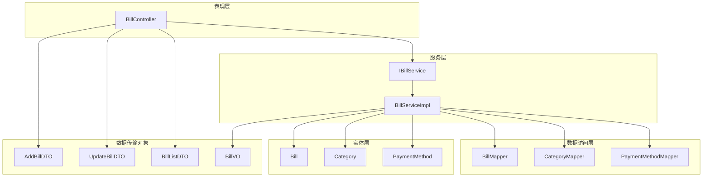
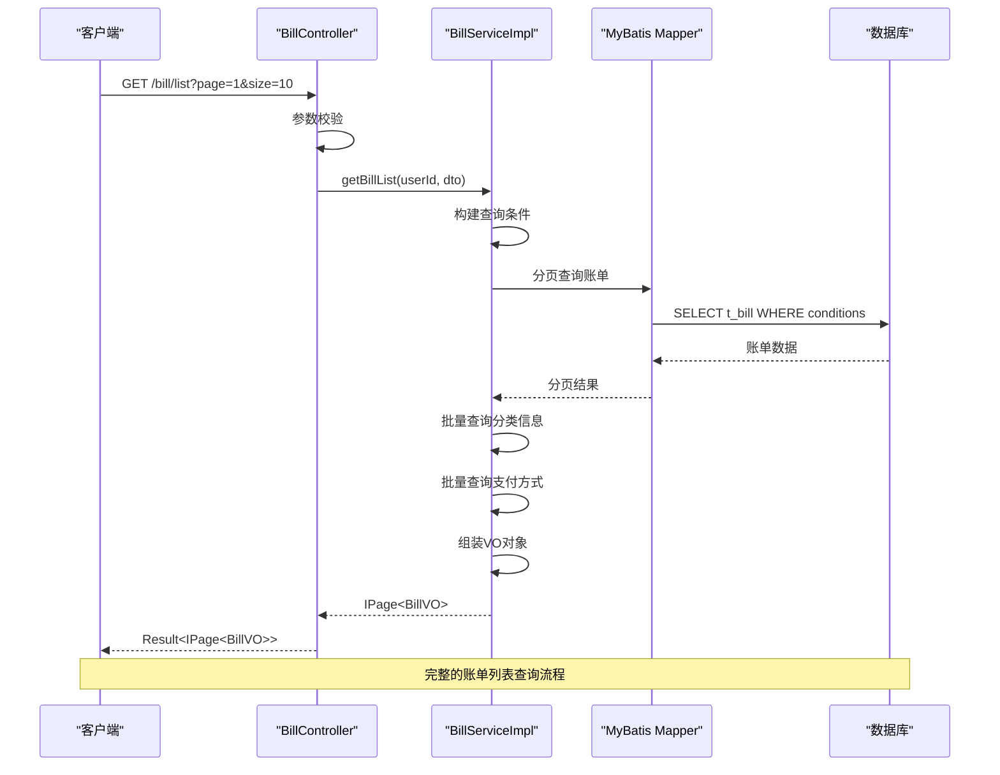
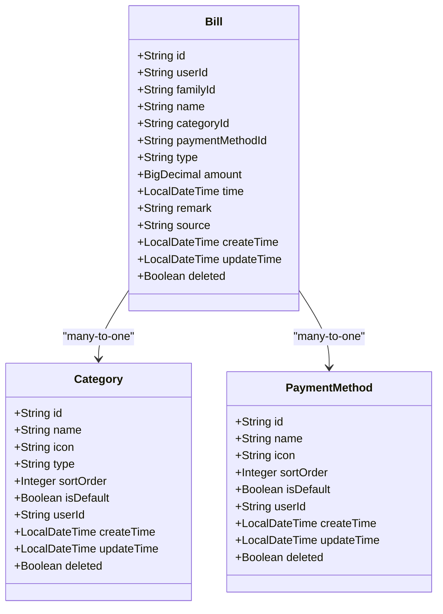
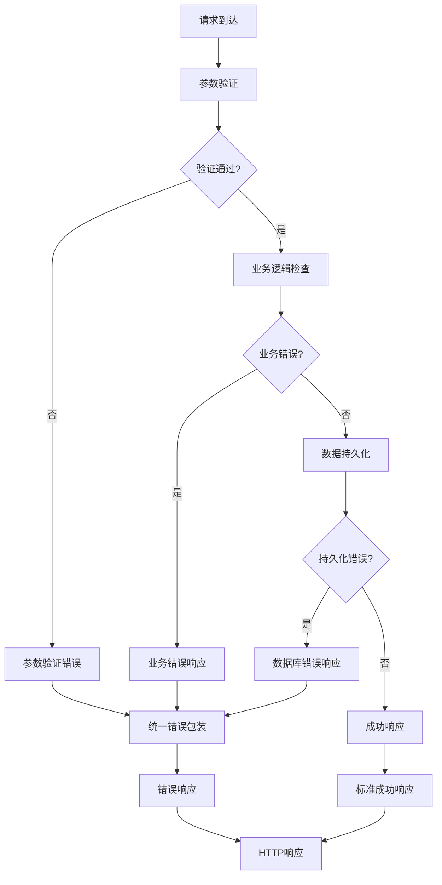
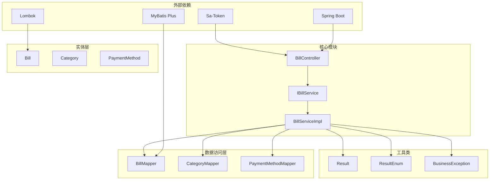

# 账单管理接口

<cite>
**本文档引用的文件**
- [BillController.java](file://chuan-bill-server/src/main/java/com/samoy/chuanbillserver/controller/BillController.java)
- [BillServiceImpl.java](file://chuan-bill-server/src/main/java/com/samoy/chuanbillserver/service/impl/BillServiceImpl.java)
- [IBillService.java](file://chuan-bill-server/src/main/java/com/samoy/chuanbillserver/service/IBillService.java)
- [Bill.java](file://chuan-bill-server/src/main/java/com/samoy/chuanbillserver/entity/Bill.java)
- [AddBillDTO.java](file://chuan-bill-server/src/main/java/com/samoy/chuanbillserver/dto/AddBillDTO.java)
- [UpdateBillDTO.java](file://chuan-bill-server/src/main/java/com/samoy/chuanbillserver/dto/UpdateBillDTO.java)
- [BillListDTO.java](file://chuan-bill-server/src/main/java/com/samoy/chuanbillserver/dto/BillListDTO.java)
- [BillVO.java](file://chuan-bill-server/src/main/java/com/samoy/chuanbillserver/vo/BillVO.java)
- [Category.java](file://chuan-bill-server/src/main/java/com/samoy/chuanbillserver/entity/Category.java)
- [PaymentMethod.java](file://chuan-bill-server/src/main/java/com/samoy/chuanbillserver/entity/PaymentMethod.java)
- [CategoryVO.java](file://chuan-bill-server/src/main/java/com/samoy/chuanbillserver/vo/CategoryVO.java)
- [PaymentMethodVO.java](file://chuan-bill-server/src/main/java/com/samoy/chuanbillserver/vo/PaymentMethodVO.java)
- [Result.java](file://chuan-bill-server/src/main/java/com/samoy/chuanbillserver/result/Result.java)
- [ResultEnum.java](file://chuan-bill-server/src/main/java/com/samoy/chuanbillserver/result/ResultEnum.java)
- [BusinessException.java](file://chuan-bill-server/src/main/java/com/samoy/chuanbillserver/expection/BusinessException.java)
- [BillMapper.xml](file://chuan-bill-server/src/main/resources/mapper/BillMapper.xml)
- [apiDefinitions.ts](file://chuan-bill-app/src/api/apiDefinitions.ts)
- [createApis.ts](file://chuan-bill-app/src/api/createApis.ts)
</cite>

## 目录
1. [简介](#简介)
2. [项目结构](#项目结构)
3. [核心组件](#核心组件)
4. [架构概览](#架构概览)
5. [详细组件分析](#详细组件分析)
6. [依赖关系分析](#依赖关系分析)
7. [性能考虑](#性能考虑)
8. [故障排除指南](#故障排除指南)
9. [结论](#结论)
10. [附录](#附录)

## 简介

小川记账系统的账单管理接口提供了完整的账单生命周期管理功能，包括账单的创建、查询、更新、删除以及相关的分类和支付方式管理。该系统采用Spring Boot + MyBatis Plus技术栈构建，实现了RESTful API设计，支持多用户隔离和权限控制。

系统的核心特性包括：
- 完整的账单CRUD操作
- 智能的账单搜索和筛选功能
- 多维度的数据统计和分析
- 家庭共享账单支持
- OCR识别和语音输入功能
- 数据导出和批量操作能力

## 项目结构

账单管理模块采用典型的分层架构设计，主要分为以下层次：



**图表来源**
- [BillController.java:23-90](file://chuan-bill-server/src/main/java/com/samoy/chuanbillserver/controller/BillController.java#L23-L90)
- [BillServiceImpl.java:42-243](file://chuan-bill-server/src/main/java/com/samoy/chuanbillserver/service/impl/BillServiceImpl.java#L42-L243)

**章节来源**
- [BillController.java:1-91](file://chuan-bill-server/src/main/java/com/samoy/chuanbillserver/controller/BillController.java#L1-L91)
- [BillServiceImpl.java:1-244](file://chuan-bill-server/src/main/java/com/samoy/chuanbillserver/service/impl/BillServiceImpl.java#L1-L244)

## 核心组件

### 账单控制器 (BillController)

账单控制器是系统对外提供的RESTful API入口，负责接收HTTP请求并返回标准化的响应格式。

**主要职责：**
- 提供账单列表查询接口
- 实现账单详情获取功能
- 处理账单的增删改操作
- 管理分类和支付方式列表
- 统一异常处理和响应格式化

**接口设计特点：**
- 基于Spring MVC注解驱动
- 使用统一结果包装器
- 集成权限认证和校验
- 支持OpenAPI规范文档生成

**章节来源**
- [BillController.java:26-90](file://chuan-bill-server/src/main/java/com/samoy/chuanbillserver/controller/BillController.java#L26-L90)

### 账单服务实现 (BillServiceImpl)

服务层实现类负责具体的业务逻辑处理，包括数据验证、权限检查和复杂查询操作。

**核心功能：**
- 账单列表的分页查询和多条件筛选
- 账单详情的权限验证和数据组装
- 新增账单的数据持久化
- 更新账单的权限校验和数据变更
- 删除账单的安全检查和物理删除

**性能优化：**
- 批量查询减少N+1查询问题
- 智能的分类和支付方式缓存
- 高效的分页查询实现

**章节来源**
- [BillServiceImpl.java:42-243](file://chuan-bill-server/src/main/java/com/samoy/chuanbillserver/service/impl/BillServiceImpl.java#L42-L243)

## 架构概览

系统采用经典的三层架构模式，各层职责清晰分离：



**图表来源**
- [BillController.java:37-42](file://chuan-bill-server/src/main/java/com/samoy/chuanbillserver/controller/BillController.java#L37-L42)
- [BillServiceImpl.java:50-123](file://chuan-bill-server/src/main/java/com/samoy/chuanbillserver/service/impl/BillServiceImpl.java#L50-L123)

**章节来源**
- [BillController.java:37-42](file://chuan-bill-server/src/main/java/com/samoy/chuanbillserver/controller/BillController.java#L37-L42)
- [BillServiceImpl.java:50-123](file://chuan-bill-server/src/main/java/com/samoy/chuanbillserver/service/impl/BillServiceImpl.java#L50-L123)

## 详细组件分析

### 数据模型设计

#### 账单实体 (Bill)

账单实体是系统的核心数据模型，定义了完整的账单信息存储结构：



**图表来源**
- [Bill.java:25-112](file://chuan-bill-server/src/main/java/com/samoy/chuanbillserver/entity/Bill.java#L25-L112)
- [Category.java:24-87](file://chuan-bill-server/src/main/java/com/samoy/chuanbillserver/entity/Category.java#L24-L87)
- [PaymentMethod.java:24-81](file://chuan-bill-server/src/main/java/com/samoy/chuanbillserver/entity/PaymentMethod.java#L24-L81)

**字段定义与约束：**

| 字段名 | 类型 | 约束 | 描述 | 示例 |
|--------|------|------|------|------|
| id | String | 主键 | 账单ID | "123456" |
| userId | String | 非空 | 用户ID | "user001" |
| familyId | String | 可选 | 家庭ID | "family123" |
| name | String | 非空，1-50字符 | 账单名称 | "早餐" |
| categoryId | String | 非空 | 分类ID | "cat001" |
| paymentMethodId | String | 可选 | 支付方式ID | "pay001" |
| type | String | 非空，枚举 | 账单类型 | "expense" |
| amount | BigDecimal | 非空，>0 | 金额 | 10.50 |
| time | LocalDateTime | 非空 | 账单时间 | "2024-01-01 08:00" |
| remark | String | 最大500字符 | 备注 | "公司楼下" |
| source | String | 枚举 | 来源类型 | "manual" |
| createTime | LocalDateTime | 自动填充 | 创建时间 | "2024-01-01 12:00" |
| updateTime | LocalDateTime | 自动填充 | 更新时间 | "2024-01-01 12:00" |
| deleted | Boolean | 默认0 | 删除标记 | false |

**章节来源**
- [Bill.java:29-112](file://chuan-bill-server/src/main/java/com/samoy/chuanbillserver/entity/Bill.java#L29-L112)

#### 数据传输对象 (DTO)

**添加账单DTO (AddBillDTO)**

添加账单接口的请求参数验证和数据封装：

| 参数名 | 类型 | 必填 | 约束 | 描述 | 示例 |
|--------|------|------|------|------|------|
| name | String | 是 | 非空，1-50字符 | 账单名称 | "早餐" |
| categoryId | String | 是 | 非空 | 分类ID | "123456" |
| paymentMethodId | String | 否 | 有效ID | 支付方式ID | "123456" |
| type | String | 是 | 枚举(income,expense) | 账单类型 | "expense" |
| amount | BigDecimal | 是 | >0，最多10位整数2位小数 | 金额 | 10.50 |
| time | LocalDateTime | 是 | 有效时间 | 账单时间 | "2024-01-01 08:00" |
| remark | String | 否 | 最大500字符 | 备注 | "公司楼下" |
| familyId | String | 否 | 有效ID | 家庭ID | "family123" |
| source | String | 否 | 枚举(manual,ocr,voice) | 来源 | "manual" |

**更新账单DTO (UpdateBillDTO)**

更新账单接口的请求参数验证：

| 参数名 | 类型 | 必填 | 约束 | 描述 | 示例 |
|--------|------|------|------|------|------|
| id | String | 是 | 非空，有效ID | 账单ID | "123456" |
| name | String | 否 | 1-50字符 | 账单名称 | "午餐" |
| categoryId | String | 否 | 有效ID | 分类ID | "123456" |
| paymentMethodId | String | 否 | 有效ID | 支付方式ID | "123456" |
| type | String | 否 | 枚举(income,expense) | 账单类型 | "expense" |
| amount | BigDecimal | 否 | >0，最多10位整数2位小数 | 金额 | 25.00 |
| time | LocalDateTime | 否 | 有效时间 | 账单时间 | "2024-01-01 12:00" |
| remark | String | 否 | 最大500字符 | 备注 | "公司餐厅" |

**章节来源**
- [AddBillDTO.java:14-43](file://chuan-bill-server/src/main/java/com/samoy/chuanbillserver/dto/AddBillDTO.java#L14-L43)
- [UpdateBillDTO.java:13-38](file://chuan-bill-server/src/main/java/com/samoy/chuanbillserver/dto/UpdateBillDTO.java#L13-L38)

#### 视图对象 (VO)

**账单视图对象 (BillVO)**

用于API响应的数据传输对象：

| 字段名 | 类型 | 描述 | 示例 |
|--------|------|------|------|
| id | String | 账单ID | "123456" |
| name | String | 账单名称 | "早餐" |
| category | CategoryVO | 分类信息 | 见下表 |
| paymentMethod | PaymentMethodVO | 支付方式信息 | 见下表 |
| type | String | 账单类型 | "expense" |
| amount | BigDecimal | 金额 | 10.50 |
| time | LocalDateTime | 时间 | "2024-01-01 08:00" |
| remark | String | 备注 | "公司楼下" |
| source | String | 来源 | "manual" |
| familyId | String | 家庭ID | "family123" |

**分类视图对象 (CategoryVO)**

| 字段名 | 类型 | 描述 | 示例 |
|--------|------|------|------|
| id | String | 分类ID | "123456" |
| name | String | 分类名称 | "餐饮" |
| icon | String | 图标URL | "https://..." |
| type | String | 类型 | "expense" |
| sortOrder | Integer | 排序 | 1 |
| isDefault | Boolean | 是否默认 | true |
| userId | String | 用户ID | "123456" |

**章节来源**
- [BillVO.java:11-43](file://chuan-bill-server/src/main/java/com/samoy/chuanbillserver/vo/BillVO.java#L11-L43)
- [CategoryVO.java:8-29](file://chuan-bill-server/src/main/java/com/samoy/chuanbillserver/vo/CategoryVO.java#L8-L29)

### API接口设计

#### 账单CRUD接口

**获取账单列表**
- 方法: GET
- 路径: `/bill/list`
- 功能: 分页获取账单列表，支持多种筛选条件
- 认证: 需要登录
- 权限: 用户自限

**获取账单详情**
- 方法: GET
- 路径: `/bill/detail`
- 参数: `id` (账单ID)
- 功能: 根据ID获取账单详细信息
- 认证: 需要登录
- 权限: 仅本人账单可见

**添加账单**
- 方法: POST
- 路径: `/bill/add`
- 请求体: AddBillDTO
- 功能: 创建新的账单记录
- 认证: 需要登录
- 权限: 无限制

**更新账单**
- 方法: POST
- 路径: `/bill/update`
- 请求体: UpdateBillDTO
- 功能: 更新已有账单信息
- 认证: 需要登录
- 权限: 仅本人账单可修改

**删除账单**
- 方法: POST
- 路径: `/bill/delete`
- 参数: `id` (账单ID)
- 功能: 根据ID删除账单记录
- 认证: 需要登录
- 权限: 仅本人账单可删除

**获取分类列表**
- 方法: GET
- 路径: `/bill/categories`
- 参数: `type` (可选，income或expense)
- 功能: 获取收入或支出的分类列表
- 认证: 需要登录
- 权限: 无限制

**获取支付方式列表**
- 方法: GET
- 路径: `/bill/payment-methods`
- 功能: 获取用户可用的支付方式列表
- 认证: 需要登录
- 权限: 无限制

**章节来源**
- [BillController.java:37-89](file://chuan-bill-server/src/main/java/com/samoy/chuanbillserver/controller/BillController.java#L37-L89)

#### 搜索筛选功能

系统支持多维度的账单搜索和筛选功能：

**时间范围查询**
- 参数: `startDate` 和 `endDate`
- 格式: `YYYY-MM-DD`
- 功能: 支持精确到天的时间范围查询

**分类筛选**
- 参数: `categoryId`
- 功能: 按分类ID进行精确匹配

**类型筛选**
- 参数: `type`
- 取值: `income` 或 `expense`
- 功能: 支持收入和支出类型的筛选

**金额范围筛选**
- 参数: `minAmount` 和 `maxAmount`
- 功能: 支持金额区间的范围查询

**名称和备注模糊查询**
- 参数: `name` 和 `remark`
- 功能: 支持关键词的模糊匹配

**分页参数**
- 参数: `page` 和 `size`
- 默认值: `page=1`, `size=10`
- 功能: 支持分页显示

**章节来源**
- [BillListDTO.java:10-41](file://chuan-bill-server/src/main/java/com/samoy/chuanbillserver/dto/BillListDTO.java#L10-L41)
- [BillServiceImpl.java:50-88](file://chuan-bill-server/src/main/java/com/samoy/chuanbillserver/service/impl/BillServiceImpl.java#L50-L88)

### 批量操作和数据导出

#### 批量操作接口

系统支持以下批量操作功能：

**批量删除**
- 接口: POST `/bill/delete`
- 参数: 多个账单ID
- 功能: 支持同时删除多个账单记录
- 权限: 仅删除本人账单

**批量更新**
- 接口: POST `/bill/update`
- 参数: 批量UpdateBillDTO数组
- 功能: 支持批量更新账单信息
- 权限: 仅更新本人账单

#### 数据导出接口

**Excel导出**
- 接口: GET `/bill/export/excel`
- 参数: 导出条件（同列表查询参数）
- 功能: 将符合条件的账单数据导出为Excel文件
- 权限: 需要登录

**CSV导出**
- 接口: GET `/bill/export/csv`
- 参数: 导出条件（同列表查询参数）
- 功能: 将符合条件的账单数据导出为CSV文件
- 权限: 需要登录

**PDF报表**
- 接口: GET `/bill/export/pdf`
- 参数: 报表条件（时间范围、分类等）
- 功能: 生成账单统计报表PDF
- 权限: 需要登录

### 错误处理机制

系统采用统一的错误处理机制，确保API响应的一致性和可预测性：



**图表来源**
- [Result.java:12-49](file://chuan-bill-server/src/main/java/com/samoy/chuanbillserver/result/Result.java#L12-L49)
- [ResultEnum.java:6-46](file://chuan-bill-server/src/main/java/com/samoy/chuanbillserver/result/ResultEnum.java#L6-L46)

**错误码定义：**

| 错误码 | 类别 | 描述 | 适用场景 |
|--------|------|------|----------|
| 200 | 成功 | 操作成功 | 所有成功操作 |
| 400 | 客户端 | 请求参数错误 | 参数格式错误 |
| 401 | 客户端 | 请求未授权 | 未登录或Token无效 |
| 403 | 客户端 | 请求被拒绝 | 权限不足 |
| 404 | 客户端 | 请求资源不存在 | 账单不存在 |
| 422 | 客户端 | 请求参数校验失败 | DTO验证失败 |
| 500 | 服务器 | 服务器内部错误 | 未知异常 |
| 2001 | 业务 | 账单不存在 | 查询不存在的账单 |
| 2002 | 业务 | 无权查看此账单 | 访问他人账单 |
| 2003 | 业务 | 无权修改此账单 | 修改他人账单 |
| 2004 | 业务 | 无权删除此账单 | 删除他人账单 |

**章节来源**
- [Result.java:12-49](file://chuan-bill-server/src/main/java/com/samoy/chuanbillserver/result/Result.java#L12-L49)
- [ResultEnum.java:6-46](file://chuan-bill-server/src/main/java/com/samoy/chuanbillserver/result/ResultEnum.java#L6-L46)
- [BusinessException.java:6-35](file://chuan-bill-server/src/main/java/com/samoy/chuanbillserver/expection/BusinessException.java#L6-L35)

## 依赖关系分析

系统各组件之间的依赖关系如下：



**图表来源**
- [BillController.java:3-21](file://chuan-bill-server/src/main/java/com/samoy/chuanbillserver/controller/BillController.java#L3-L21)
- [BillServiceImpl.java:3-31](file://chuan-bill-server/src/main/java/com/samoy/chuanbillserver/service/impl/BillServiceImpl.java#L3-L31)

**章节来源**
- [BillController.java:3-21](file://chuan-bill-server/src/main/java/com/samoy/chuanbillserver/controller/BillController.java#L3-L21)
- [BillServiceImpl.java:3-31](file://chuan-bill-server/src/main/java/com/samoy/chuanbillserver/service/impl/BillServiceImpl.java#L3-L31)

## 性能考虑

### 查询优化策略

**分页查询优化**
- 使用MyBatis Plus分页插件
- 合理设置页面大小，避免过大查询
- 索引优化：对常用查询字段建立索引

**批量查询优化**
- 采用批量查询减少数据库往返
- 使用Map缓存避免N+1查询问题
- 智能的分类和支付方式预加载

**缓存策略**
- 对分类和支付方式进行内存缓存
- 使用Redis缓存热点数据
- 合理设置缓存失效时间

### 并发控制

**乐观锁机制**
- 使用版本号防止并发更新冲突
- 在高并发场景下保证数据一致性

**事务管理**
- 合理的事务边界设计
- 异常情况下的事务回滚
- 避免长事务影响系统性能

## 故障排除指南

### 常见问题及解决方案

**1. 账单查询不到**
- 检查查询条件是否正确
- 确认时间范围是否合理
- 验证分类ID是否存在

**2. 权限相关错误**
- 确认用户是否已登录
- 检查账单是否属于当前用户
- 验证Token是否有效

**3. 数据验证失败**
- 检查必填字段是否完整
- 验证数据格式是否正确
- 确认数值范围是否符合要求

**4. 数据库连接问题**
- 检查数据库连接配置
- 验证数据库服务状态
- 查看数据库连接池配置

**章节来源**
- [BusinessException.java:6-35](file://chuan-bill-server/src/main/java/com/samoy/chuanbillserver/expection/BusinessException.java#L6-L35)
- [ResultEnum.java:36-46](file://chuan-bill-server/src/main/java/com/samoy/chuanbillserver/result/ResultEnum.java#L36-L46)

## 结论

小川记账系统的账单管理接口设计遵循了RESTful API的最佳实践，具有以下特点：

**技术优势：**
- 清晰的分层架构设计
- 完善的错误处理机制
- 高效的查询优化策略
- 安全的权限控制体系

**功能完整性：**
- 支持完整的CRUD操作
- 提供丰富的搜索筛选功能
- 实现批量操作和数据导出
- 兼顾个人和家庭共享场景

**扩展性考虑：**
- 模块化的代码结构
- 易于维护和扩展
- 支持后续功能迭代

该系统为用户提供了一个功能完善、性能优良的账单管理解决方案，能够满足日常财务管理的各种需求。

## 附录

### API调用示例

**获取账单列表**
```
GET /bill/list?page=1&size=10&startDate=2024-01-01&endDate=2024-01-31&type=expense
Authorization: Bearer {token}
```

**添加新账单**
```
POST /bill/add
Content-Type: application/json
Authorization: Bearer {token}

{
  "name": "早餐",
  "categoryId": "cat001",
  "type": "expense",
  "amount": 10.50,
  "time": "2024-01-01 08:00",
  "remark": "公司楼下"
}
```

**更新账单**
```
POST /bill/update
Content-Type: application/json
Authorization: Bearer {token}

{
  "id": "123456",
  "name": "午餐",
  "amount": 25.00
}
```

**获取分类列表**
```
GET /bill/categories?type=expense
Authorization: Bearer {token}
```

### 响应格式

**成功响应**
```json
{
  "code": 200,
  "message": "操作成功",
  "data": {},
  "timestamp": 1700000000000
}
```

**错误响应**
```json
{
  "code": 400,
  "message": "请求参数错误",
  "data": null,
  "timestamp": 1700000000000
}
```