# UI组件系统

<cite>
**本文引用的文件**
- [GlobalLoading.vue](file://chuan-bill-app/src/components/GlobalLoading.vue)
- [GlobalMessage.vue](file://chuan-bill-app/src/components/GlobalMessage.vue)
- [GlobalToast.vue](file://chuan-bill-app/src/components/GlobalToast.vue)
- [PrivacyPopup.vue](file://chuan-bill-app/src/components/PrivacyPopup.vue)
- [QuickBillModal.vue](file://chuan-bill-app/src/pages/bill/components/QuickBillModal.vue)
- [ManualEdit.vue](file://chuan-bill-app/src/pages/bill/components/ManualEdit.vue)
- [OcrEdit.vue](file://chuan-bill-app/src/pages/bill/components/OcrEdit.vue)
- [useGlobalLoading.ts](file://chuan-bill-app/src/composables/useGlobalLoading.ts)
- [useGlobalMessage.ts](file://chuan-bill-app/src/composables/useGlobalMessage.ts)
- [useGlobalToast.ts](file://chuan-bill-app/src/composables/useGlobalToast.ts)
- [useManualTheme.ts](file://chuan-bill-app/src/composables/useManualTheme.ts)
- [useTabbar.ts](file://chuan-bill-app/src/composables/useTabbar.ts)
- [default.vue](file://chuan-bill-app/src/layouts/default.vue)
- [tabbar.vue](file://chuan-bill-app/src/layouts/tabbar.vue)
- [theme.ts](file://chuan-bill-app/src/composables/types/theme.ts)
- [manualThemeStore.ts](file://chuan-bill-app/src/store/manualThemeStore.ts)
</cite>

## 目录
1. [简介](#简介)
2. [项目结构](#项目结构)
3. [核心组件](#核心组件)
4. [架构总览](#架构总览)
5. [组件详解](#组件详解)
6. [依赖关系分析](#依赖关系分析)
7. [性能与体验优化](#性能与体验优化)
8. [故障排查指南](#故障排查指南)
9. [结论](#结论)
10. [附录](#附录)

## 简介
本文件面向“小川记账”应用的UI组件系统，围绕基于 Wot Design Uni 的组件库，系统性梳理全局提示组件（GlobalLoading、GlobalMessage、GlobalToast、PrivacyPopup）、业务组件（QuickBillModal、ManualEdit、OcrEdit），以及配套的自定义 Hook（useGlobalLoading、useGlobalMessage、useGlobalToast、useManualTheme）与布局系统（默认布局、标签栏布局）。文档从设计理念、属性与事件、样式与主题、通信与状态管理、响应式实现等方面进行深入解析，并提供使用示例、最佳实践与性能优化建议。

## 项目结构
UI组件系统主要分布在以下位置：
- 组件层：src/components 与 pages/bill/components
- 组合式API：src/composables
- 布局层：src/layouts
- 主题状态：src/store/manualThemeStore.ts 与 types/theme.ts
- 使用示例与调用点：各页面与业务组件中通过 Pinia Store 与 Wot Design Uni 组件联动

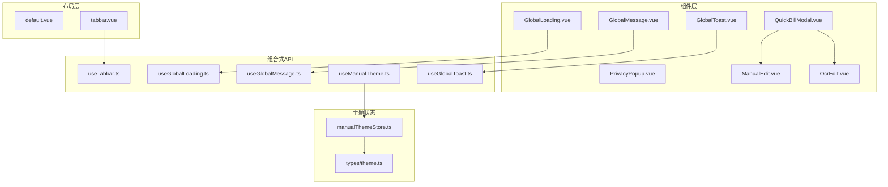

图表来源
- [GlobalLoading.vue:1-47](file://chuan-bill-app/src/components/GlobalLoading.vue#L1-L47)
- [GlobalMessage.vue:1-56](file://chuan-bill-app/src/components/GlobalMessage.vue#L1-L56)
- [GlobalToast.vue:1-47](file://chuan-bill-app/src/components/GlobalToast.vue#L1-L47)
- [PrivacyPopup.vue:1-174](file://chuan-bill-app/src/components/PrivacyPopup.vue#L1-L174)
- [QuickBillModal.vue:1-64](file://chuan-bill-app/src/pages/bill/components/QuickBillModal.vue#L1-L64)
- [ManualEdit.vue:1-174](file://chuan-bill-app/src/pages/bill/components/ManualEdit.vue#L1-L174)
- [OcrEdit.vue:1-167](file://chuan-bill-app/src/pages/bill/components/OcrEdit.vue#L1-L167)
- [useGlobalLoading.ts:1-38](file://chuan-bill-app/src/composables/useGlobalLoading.ts#L1-L38)
- [useGlobalMessage.ts:1-53](file://chuan-bill-app/src/composables/useGlobalMessage.ts#L1-L53)
- [useGlobalToast.ts:1-62](file://chuan-bill-app/src/composables/useGlobalToast.ts#L1-L62)
- [useManualTheme.ts:1-143](file://chuan-bill-app/src/composables/useManualTheme.ts#L1-L143)
- [useTabbar.ts:1-55](file://chuan-bill-app/src/composables/useTabbar.ts#L1-L55)
- [default.vue:1-17](file://chuan-bill-app/src/layouts/default.vue#L1-L17)
- [tabbar.vue:1-48](file://chuan-bill-app/src/layouts/tabbar.vue#L1-L48)
- [manualThemeStore.ts:1-151](file://chuan-bill-app/src/store/manualThemeStore.ts#L1-L151)
- [theme.ts:1-47](file://chuan-bill-app/src/composables/types/theme.ts#L1-L47)

章节来源
- [default.vue:1-17](file://chuan-bill-app/src/layouts/default.vue#L1-L17)
- [tabbar.vue:1-48](file://chuan-bill-app/src/layouts/tabbar.vue#L1-L48)

## 核心组件
本节聚焦四大全局提示组件与三大业务组件，说明其职责、数据流与交互模式。

- 全局加载（GlobalLoading）
  - 设计理念：统一入口的全局加载提示，避免重复弹窗与跨页干扰；通过 Pinia Store 管理状态与当前页面路径，仅在当前页生效。
  - 关键点：监听 loadingOptions，按需打开/关闭；支付宝平台做可见性兼容处理；与 Wot Design Uni 的 wd-toast 对接。
  - 使用场景：网络请求、异步任务、页面跳转前的阻塞等待。

- 全局消息（GlobalMessage）
  - 设计理念：集中式的消息框，支持确认/取消/提示等类型；通过 Promise 化回调对接 success/fail。
  - 关键点：深拷贝配置，避免污染原始参数；监听 messageOptions，按当前页打开；关闭时清理。
  - 使用场景：二次确认、错误提示、输入型提示。

- 全局吐司（GlobalToast）
  - 设计理念：统一的轻提示，支持成功/失败/信息/警告等图标与时长；默认居中显示，可覆盖遮罩。
  - 关键点：合并默认配置与传入配置；支持字符串简写；关闭时复位状态。
  - 使用场景：操作反馈、状态提示、错误提醒。

- 隐私弹窗（PrivacyPopup）
  - 设计理念：微信隐私授权流程的封装，拦截原生 wx.onNeedPrivacyAuthorization，统一展示与回调。
  - 关键点：注册隐私授权监听；记录多个 resolve；同意/拒绝分别回传事件；支持打开隐私协议。
  - 使用场景：合规要求下的隐私授权弹窗。

- 快速记账（QuickBillModal）
  - 设计理念：底部弹起的动作面板，内含“手动添加/图片识别/语音识别”三选一；根据选择渲染对应编辑器。
  - 关键点：使用 wd-action-sheet 与 wd-segmented；通过子组件 ManualEdit/OcrEdit 实现不同记账入口。
  - 使用场景：快速记账入口聚合。

- 手动编辑（ManualEdit）
  - 设计理念：表单驱动的账单录入，包含类型、金额、名称、时间、类目、支付方式、是否共享、备注等。
  - 关键点：动态类目选项随收支类型切换；加载支付方式列表；共享开关联动家庭选择。
  - 使用场景：精确录入账单。

- 图片识别（OcrEdit）
  - 设计理念：上传图片触发 AI 识别，展示扫描动画与结果状态；失败时提供重试与手动输入入口。
  - 关键点：上传成功后调用 AI 接口；根据状态渲染不同 UI；失败时通过全局吐司提示。
  - 使用场景：快速提取账单信息。

章节来源
- [GlobalLoading.vue:1-47](file://chuan-bill-app/src/components/GlobalLoading.vue#L1-L47)
- [GlobalMessage.vue:1-56](file://chuan-bill-app/src/components/GlobalMessage.vue#L1-L56)
- [GlobalToast.vue:1-47](file://chuan-bill-app/src/components/GlobalToast.vue#L1-L47)
- [PrivacyPopup.vue:1-174](file://chuan-bill-app/src/components/PrivacyPopup.vue#L1-L174)
- [QuickBillModal.vue:1-64](file://chuan-bill-app/src/pages/bill/components/QuickBillModal.vue#L1-L64)
- [ManualEdit.vue:1-174](file://chuan-bill-app/src/pages/bill/components/ManualEdit.vue#L1-L174)
- [OcrEdit.vue:1-167](file://chuan-bill-app/src/pages/bill/components/OcrEdit.vue#L1-L167)

## 架构总览
整体采用“组件 + 组合式API + 布局 + 主题”的分层架构。全局提示组件通过 Pinia Store 与 Wot Design Uni 组件解耦；业务组件通过组合式 API 进行状态与行为抽象；布局系统负责页面容器与标签栏；主题系统提供深浅色与主题色的统一管理。

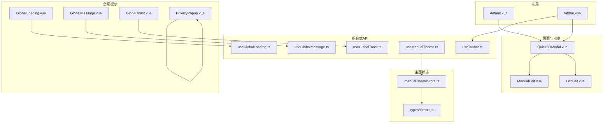

图表来源
- [QuickBillModal.vue:1-64](file://chuan-bill-app/src/pages/bill/components/QuickBillModal.vue#L1-L64)
- [ManualEdit.vue:1-174](file://chuan-bill-app/src/pages/bill/components/ManualEdit.vue#L1-L174)
- [OcrEdit.vue:1-167](file://chuan-bill-app/src/pages/bill/components/OcrEdit.vue#L1-L167)
- [GlobalLoading.vue:1-47](file://chuan-bill-app/src/components/GlobalLoading.vue#L1-L47)
- [GlobalMessage.vue:1-56](file://chuan-bill-app/src/components/GlobalMessage.vue#L1-L56)
- [GlobalToast.vue:1-47](file://chuan-bill-app/src/components/GlobalToast.vue#L1-L47)
- [PrivacyPopup.vue:1-174](file://chuan-bill-app/src/components/PrivacyPopup.vue#L1-L174)
- [useGlobalLoading.ts:1-38](file://chuan-bill-app/src/composables/useGlobalLoading.ts#L1-L38)
- [useGlobalMessage.ts:1-53](file://chuan-bill-app/src/composables/useGlobalMessage.ts#L1-L53)
- [useGlobalToast.ts:1-62](file://chuan-bill-app/src/composables/useGlobalToast.ts#L1-L62)
- [useManualTheme.ts:1-143](file://chuan-bill-app/src/composables/useManualTheme.ts#L1-L143)
- [useTabbar.ts:1-55](file://chuan-bill-app/src/composables/useTabbar.ts#L1-L55)
- [default.vue:1-17](file://chuan-bill-app/src/layouts/default.vue#L1-L17)
- [tabbar.vue:1-48](file://chuan-bill-app/src/layouts/tabbar.vue#L1-L48)
- [manualThemeStore.ts:1-151](file://chuan-bill-app/src/store/manualThemeStore.ts#L1-L151)
- [theme.ts:1-47](file://chuan-bill-app/src/composables/types/theme.ts#L1-L47)

## 组件详解

### 全局提示组件

#### GlobalLoading
- 数据与状态
  - 通过 useGlobalLoading 获取 loadingOptions 与 currentPage，watch 监听变化决定打开/关闭。
  - 在当前页匹配时才显示，避免跨页误触。
- 平台适配
  - 支付宝平台通过 hackAlipayVisible 控制可见性，确保组件正确渲染。
- 与 Wot Design Uni
  - 使用 wd-toast 的 selector 与 closed 回调，实现统一关闭。

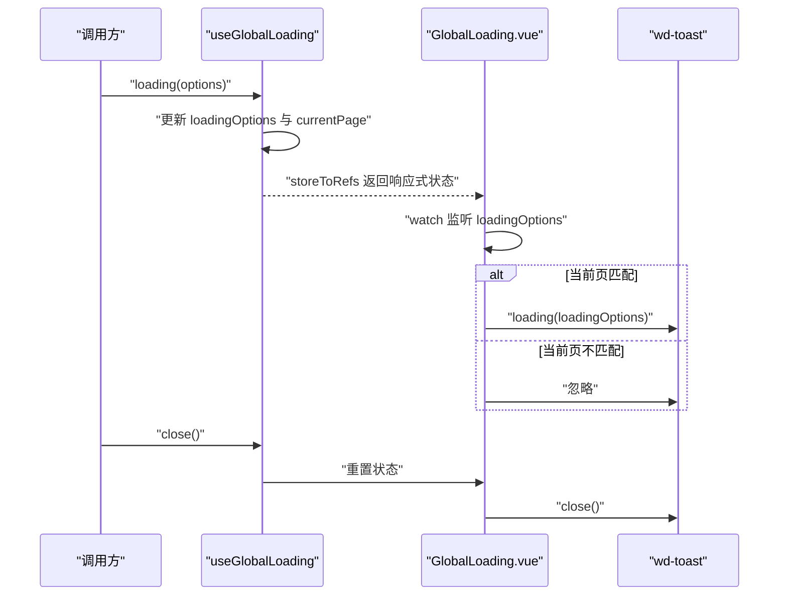

图表来源
- [GlobalLoading.vue:1-47](file://chuan-bill-app/src/components/GlobalLoading.vue#L1-L47)
- [useGlobalLoading.ts:1-38](file://chuan-bill-app/src/composables/useGlobalLoading.ts#L1-L38)

章节来源
- [GlobalLoading.vue:1-47](file://chuan-bill-app/src/components/GlobalLoading.vue#L1-L47)
- [useGlobalLoading.ts:1-38](file://chuan-bill-app/src/composables/useGlobalLoading.ts#L1-L38)

#### GlobalMessage
- 数据与状态
  - useGlobalMessage 提供 show/alert/confirm/prompt/close 等动作，内部维护 messageOptions 与 currentPage。
  - 打开时深拷贝配置，附加按钮圆角等细节。
- 事件与回调
  - Promise 化，通过 success/fail 回调处理用户选择。

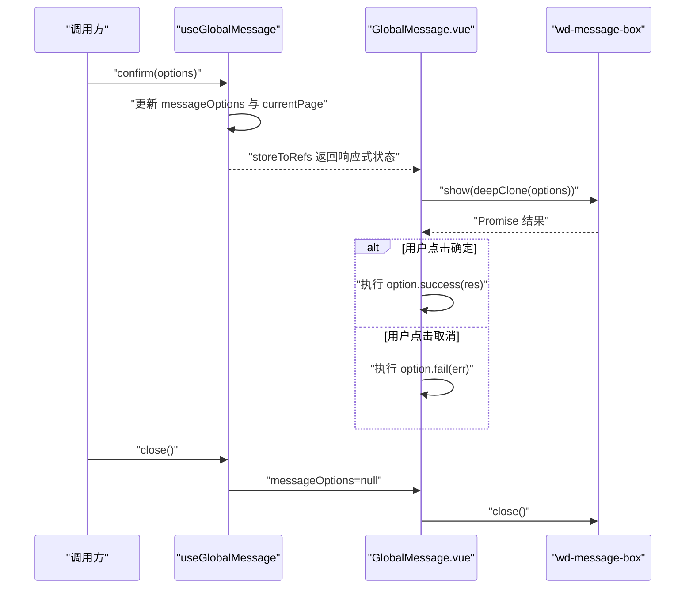

图表来源
- [GlobalMessage.vue:1-56](file://chuan-bill-app/src/components/GlobalMessage.vue#L1-L56)
- [useGlobalMessage.ts:1-53](file://chuan-bill-app/src/composables/useGlobalMessage.ts#L1-L53)

章节来源
- [GlobalMessage.vue:1-56](file://chuan-bill-app/src/components/GlobalMessage.vue#L1-L56)
- [useGlobalMessage.ts:1-53](file://chuan-bill-app/src/composables/useGlobalMessage.ts#L1-L53)

#### GlobalToast
- 数据与状态
  - useGlobalToast 提供 show/success/error/info/warning/close，合并默认配置与传入配置。
- 行为特征
  - 默认时长与位置策略；支持字符串简写；关闭时复位状态。

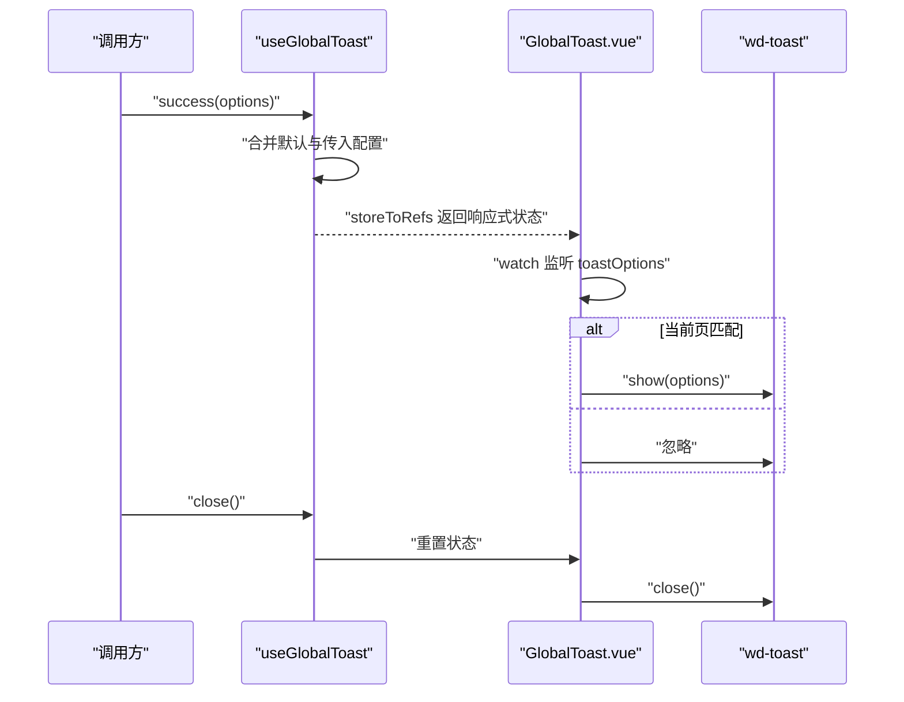

图表来源
- [GlobalToast.vue:1-47](file://chuan-bill-app/src/components/GlobalToast.vue#L1-L47)
- [useGlobalToast.ts:1-62](file://chuan-bill-app/src/composables/useGlobalToast.ts#L1-L62)

章节来源
- [GlobalToast.vue:1-47](file://chuan-bill-app/src/components/GlobalToast.vue#L1-L47)
- [useGlobalToast.ts:1-62](file://chuan-bill-app/src/composables/useGlobalToast.ts#L1-L62)

#### PrivacyPopup
- 事件与生命周期
  - 在 onBeforeMount 注册 wx.onNeedPrivacyAuthorization，拦截授权请求并统一展示。
  - 提供 agree/disagree 事件与 openPrivacyContract 打开隐私协议。
- 状态与清理
  - 使用 Set 存储多个 resolve，在关闭时逐一回传并清空。

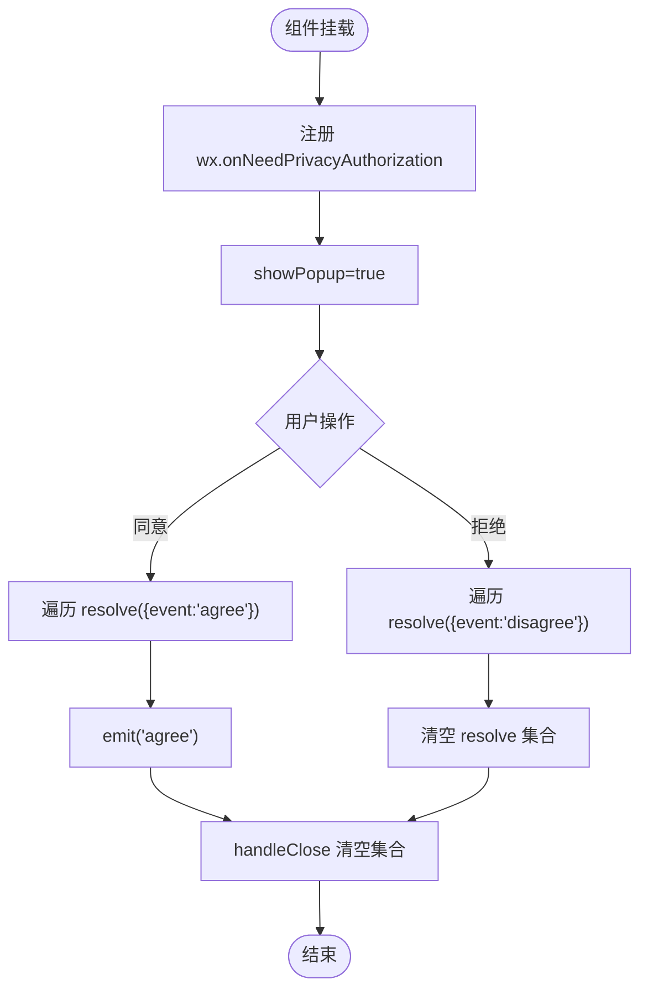

图表来源
- [PrivacyPopup.vue:1-174](file://chuan-bill-app/src/components/PrivacyPopup.vue#L1-L174)

章节来源
- [PrivacyPopup.vue:1-174](file://chuan-bill-app/src/components/PrivacyPopup.vue#L1-L174)

### 业务组件

#### QuickBillModal
- 交互与状态
  - 使用 wd-action-sheet 底部弹起；wd-segmented 切换“手动/OCR/语音”三种来源。
  - 通过子组件 ManualEdit/OcrEdit 渲染不同编辑界面。
- 样式与交互
  - 自定义圆角与标题样式；打开时更新分段样式。

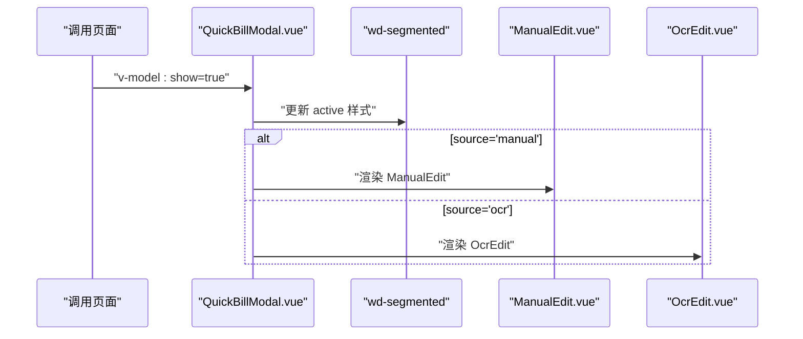

图表来源
- [QuickBillModal.vue:1-64](file://chuan-bill-app/src/pages/bill/components/QuickBillModal.vue#L1-L64)
- [ManualEdit.vue:1-174](file://chuan-bill-app/src/pages/bill/components/ManualEdit.vue#L1-L174)
- [OcrEdit.vue:1-167](file://chuan-bill-app/src/pages/bill/components/OcrEdit.vue#L1-L167)

章节来源
- [QuickBillModal.vue:1-64](file://chuan-bill-app/src/pages/bill/components/QuickBillModal.vue#L1-L64)

#### ManualEdit
- 表单与联动
  - 收支类型切换时动态更新类目选项；加载支付方式列表；共享开关联动家庭选择。
- 请求与数据
  - 通过 Apis.bill 获取类目与支付方式；watch 监听类型变更。
- UI 细节
  - 使用 radio-group、picker、datetime-picker、textarea、switch 等组件构建表单。

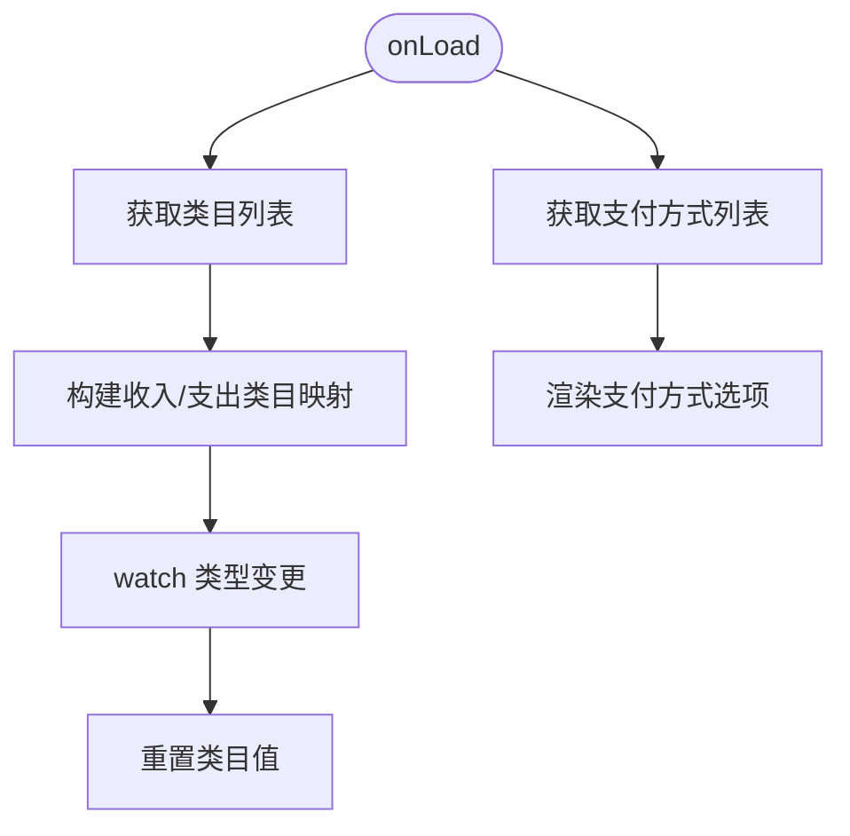

图表来源
- [ManualEdit.vue:1-174](file://chuan-bill-app/src/pages/bill/components/ManualEdit.vue#L1-L174)

章节来源
- [ManualEdit.vue:1-174](file://chuan-bill-app/src/pages/bill/components/ManualEdit.vue#L1-L174)

#### OcrEdit
- 流程与状态
  - 上传图片成功后触发 AI 识别；根据状态渲染扫描动画、失败提示与重试入口。
- 错误处理
  - 上传失败或识别异常时，通过 useGlobalToast 显示错误提示。
- 配置与环境
  - 使用 import.meta.env 的上传地址与临时 token（注释提示待修复）。

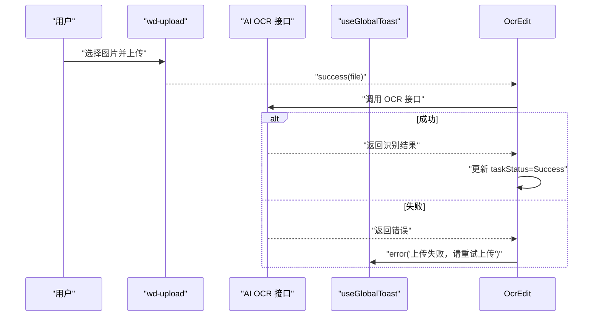

图表来源
- [OcrEdit.vue:1-167](file://chuan-bill-app/src/pages/bill/components/OcrEdit.vue#L1-L167)
- [useGlobalToast.ts:1-62](file://chuan-bill-app/src/composables/useGlobalToast.ts#L1-L62)

章节来源
- [OcrEdit.vue:1-167](file://chuan-bill-app/src/pages/bill/components/OcrEdit.vue#L1-L167)
- [useGlobalToast.ts:1-62](file://chuan-bill-app/src/composables/useGlobalToast.ts#L1-L62)

### 自定义Hook与主题系统

#### useGlobalLoading / useGlobalMessage / useGlobalToast
- 设计要点
  - 基于 Pinia defineStore，集中管理全局提示的状态与行为。
  - 提供便捷方法（如 success/error/info/warning）与通用 show/close。
- 使用建议
  - 在业务逻辑中通过调用 store 的方法统一触发提示，避免分散在各处。
  - 注意 currentPage 的一致性，确保只在当前页生效。

章节来源
- [useGlobalLoading.ts:1-38](file://chuan-bill-app/src/composables/useGlobalLoading.ts#L1-L38)
- [useGlobalMessage.ts:1-53](file://chuan-bill-app/src/composables/useGlobalMessage.ts#L1-L53)
- [useGlobalToast.ts:1-62](file://chuan-bill-app/src/composables/useGlobalToast.ts#L1-L62)

#### useManualTheme
- 功能概览
  - 支持手动切换深浅主题、跟随系统主题、主题色选择、持久化用户设置。
  - 自动同步导航栏颜色，监听页面 onShow 更新。
- 生命周期
  - onBeforeMount 初始化主题与系统主题监听；onUnmounted 清理监听。
- 与布局/组件配合
  - 通过 wd-config-provider 注入 themeVars，结合 dark 类名实现深色模式。

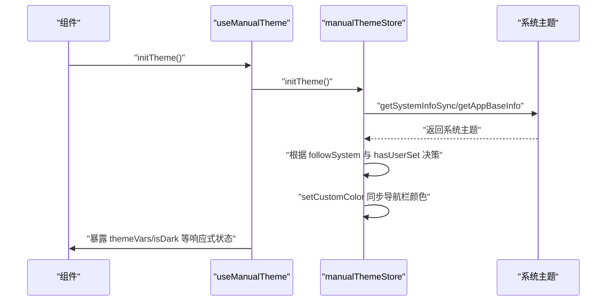

图表来源
- [useManualTheme.ts:1-143](file://chuan-bill-app/src/composables/useManualTheme.ts#L1-L143)
- [manualThemeStore.ts:1-151](file://chuan-bill-app/src/store/manualThemeStore.ts#L1-L151)
- [theme.ts:1-47](file://chuan-bill-app/src/composables/types/theme.ts#L1-L47)

章节来源
- [useManualTheme.ts:1-143](file://chuan-bill-app/src/composables/useManualTheme.ts#L1-L143)
- [manualThemeStore.ts:1-151](file://chuan-bill-app/src/store/manualThemeStore.ts#L1-L151)
- [theme.ts:1-47](file://chuan-bill-app/src/composables/types/theme.ts#L1-L47)

#### useTabbar
- 功能概览
  - 维护标签栏项列表、活跃项、数值徽标与激活状态。
  - 提供路由跳转与值更新能力。
- 与布局配合
  - 在 tabbar.vue 中绑定 wd-tabbar 与 wd-tabbar-item，实现自定义标签栏。

章节来源
- [useTabbar.ts:1-55](file://chuan-bill-app/src/composables/useTabbar.ts#L1-L55)
- [tabbar.vue:1-48](file://chuan-bill-app/src/layouts/tabbar.vue#L1-L48)

### 布局系统

#### 默认布局（default.vue）
- 特点
  - 最小化包裹，仅透传 slot，便于在页面级灵活组合其他布局或组件。
- 适用场景
  - 不需要标签栏的页面，或由业务组件自行控制布局。

章节来源
- [default.vue:1-17](file://chuan-bill-app/src/layouts/default.vue#L1-L17)

#### 标签栏布局（tabbar.vue）
- 特点
  - 将 useTabbar 的状态注入到 wd-tabbar 与 wd-tabbar-item，实现底部标签栏。
  - 在 APP 平台隐藏系统标签栏，避免重复。
- 交互
  - 监听 change 事件，更新活跃项并跳转至目标路由。

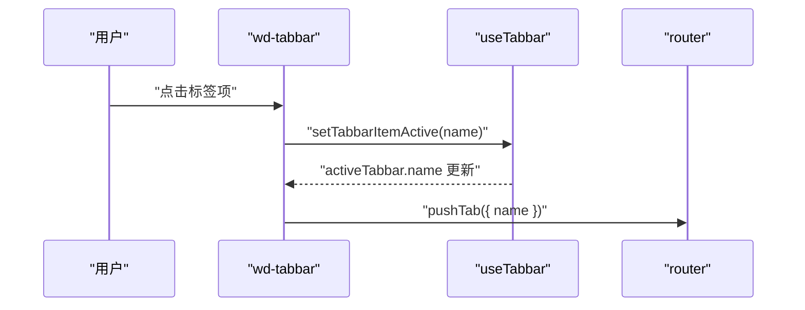

图表来源
- [tabbar.vue:1-48](file://chuan-bill-app/src/layouts/tabbar.vue#L1-L48)
- [useTabbar.ts:1-55](file://chuan-bill-app/src/composables/useTabbar.ts#L1-L55)

章节来源
- [tabbar.vue:1-48](file://chuan-bill-app/src/layouts/tabbar.vue#L1-L48)
- [useTabbar.ts:1-55](file://chuan-bill-app/src/composables/useTabbar.ts#L1-L55)

## 依赖关系分析
- 组件与 Store
  - 全局提示组件均通过 storeToRefs 订阅 useGlobalLoading/useGlobalMessage/useGlobalToast 的状态，实现声明式渲染。
- 组件与 Wot Design Uni
  - 通过 wd-toast、wd-message-box、wd-action-sheet、wd-segmented、wd-form、wd-picker、wd-datetime-picker、wd-upload 等组件实现交互。
- 主题系统
  - useManualTheme 与 manualThemeStore 负责主题状态与变量，通过 wd-config-provider 注入到组件树。
- 布局系统
  - default.vue 提供通用容器；tabbar.vue 通过 useTabbar 与路由联动，形成统一的导航体验。

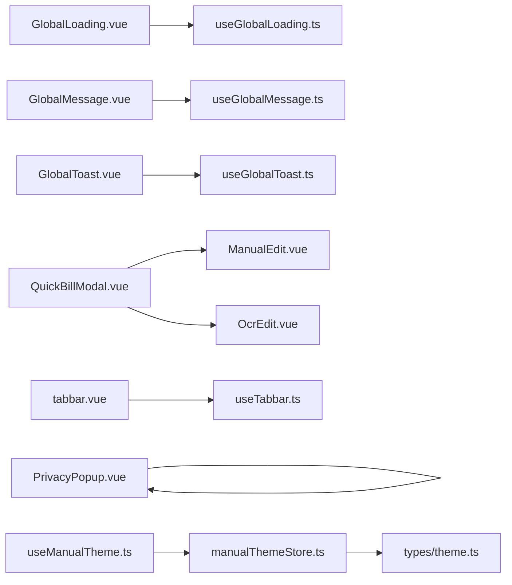

图表来源
- [GlobalLoading.vue:1-47](file://chuan-bill-app/src/components/GlobalLoading.vue#L1-L47)
- [GlobalMessage.vue:1-56](file://chuan-bill-app/src/components/GlobalMessage.vue#L1-L56)
- [GlobalToast.vue:1-47](file://chuan-bill-app/src/components/GlobalToast.vue#L1-L47)
- [PrivacyPopup.vue:1-174](file://chuan-bill-app/src/components/PrivacyPopup.vue#L1-L174)
- [QuickBillModal.vue:1-64](file://chuan-bill-app/src/pages/bill/components/QuickBillModal.vue#L1-L64)
- [ManualEdit.vue:1-174](file://chuan-bill-app/src/pages/bill/components/ManualEdit.vue#L1-L174)
- [OcrEdit.vue:1-167](file://chuan-bill-app/src/pages/bill/components/OcrEdit.vue#L1-L167)
- [useGlobalLoading.ts:1-38](file://chuan-bill-app/src/composables/useGlobalLoading.ts#L1-L38)
- [useGlobalMessage.ts:1-53](file://chuan-bill-app/src/composables/useGlobalMessage.ts#L1-L53)
- [useGlobalToast.ts:1-62](file://chuan-bill-app/src/composables/useGlobalToast.ts#L1-L62)
- [useManualTheme.ts:1-143](file://chuan-bill-app/src/composables/useManualTheme.ts#L1-L143)
- [useTabbar.ts:1-55](file://chuan-bill-app/src/composables/useTabbar.ts#L1-L55)
- [manualThemeStore.ts:1-151](file://chuan-bill-app/src/store/manualThemeStore.ts#L1-L151)
- [theme.ts:1-47](file://chuan-bill-app/src/composables/types/theme.ts#L1-L47)

## 性能与体验优化
- 全局提示
  - 通过 currentPage 与 watch 控制仅在当前页生效，减少不必要的渲染与动画。
  - 使用深拷贝避免配置污染，降低副作用。
- 上传与识别
  - 上传组件支持 reupload 与预览覆盖样式，提升用户感知；失败时及时提示，避免长时间无反馈。
- 主题切换
  - onShow 时同步导航栏颜色，保证每次进入页面颜色一致；系统主题监听仅在跟随模式下生效，减少无效计算。
- 响应式与样式
  - 使用 :deep 与 scoped 组合，确保主题变量与组件样式稳定；合理拆分样式块，避免过度全局污染。

## 故障排查指南
- 全局提示未显示
  - 检查 currentPage 与当前路由是否一致；确认 storeToRefs 的响应式状态已订阅。
  - 支付宝平台需确认 hackAlipayVisible 的初始化逻辑。
- 消息框回调未触发
  - 确认传入的 success/fail 是否为函数；检查 Promise 链路是否被 catch。
- 隐私授权弹窗不出现
  - 确认 wx.onNeedPrivacyAuthorization 是否存在；检查 showPopup 与 resolve 集合的生命周期。
- 主题颜色不生效
  - 确认 wd-config-provider 已注入 themeVars；检查 manualThemeStore 的初始化与 setCustomColor 调用。
- 标签栏不更新
  - 确认 onMounted 与 nextTick 的时机；检查 activeTabbar 的赋值与路由跳转。

章节来源
- [GlobalLoading.vue:1-47](file://chuan-bill-app/src/components/GlobalLoading.vue#L1-L47)
- [GlobalMessage.vue:1-56](file://chuan-bill-app/src/components/GlobalMessage.vue#L1-L56)
- [PrivacyPopup.vue:1-174](file://chuan-bill-app/src/components/PrivacyPopup.vue#L1-L174)
- [useManualTheme.ts:1-143](file://chuan-bill-app/src/composables/useManualTheme.ts#L1-L143)
- [tabbar.vue:1-48](file://chuan-bill-app/src/layouts/tabbar.vue#L1-L48)

## 结论
本UI组件系统以 Wot Design Uni 为基础，结合 Pinia Store 与组合式 API，实现了全局提示、业务组件与主题/布局的解耦与统一。通过声明式状态与平台适配，兼顾了多端一致性与开发效率。建议在后续迭代中进一步完善上传 token 的安全策略、统一错误提示文案与国际化支持，并持续优化主题变量的扩展性与性能表现。

## 附录
- 使用示例（路径）
  - 触发全局加载：[useGlobalLoading.ts:1-38](file://chuan-bill-app/src/composables/useGlobalLoading.ts#L1-L38)
  - 触发全局消息：[useGlobalMessage.ts:1-53](file://chuan-bill-app/src/composables/useGlobalMessage.ts#L1-L53)
  - 触发全局吐司：[useGlobalToast.ts:1-62](file://chuan-bill-app/src/composables/useGlobalToast.ts#L1-L62)
  - 主题切换与主题色选择：[useManualTheme.ts:1-143](file://chuan-bill-app/src/composables/useManualTheme.ts#L1-L143)
  - 标签栏交互：[useTabbar.ts:1-55](file://chuan-bill-app/src/composables/useTabbar.ts#L1-L55)
- 最佳实践
  - 将所有全局提示集中在对应的 Hook 中触发，避免散落各处。
  - 在组件中优先使用 :deep 与 scoped 组合，确保主题与样式稳定。
  - 对上传与识别等耗时操作，提供明确的反馈与重试机制。
  - 主题系统遵循“初始化一次、按需更新”的原则，减少重复计算。