# ManualEdit 手动编辑组件

<cite>
**本文档引用的文件**
- [ManualEdit.vue](file://chuan-bill-app/src/pages/bill/components/ManualEdit.vue)
- [ManualEdit.js](file://chuan-bill-app/dist/dev/mp-weixin/pages/bill/components/ManualEdit.js)
- [ManualEdit.json](file://chuan-bill-app/dist/dev/mp-weixin/pages/bill/components/ManualEdit.json)
- [ManualEdit.wxml](file://chuan-bill-app/dist/dev/mp-weixin/pages/bill/components/ManualEdit.wxml)
- [ManualEdit.wxss](file://chuan-bill-app/dist/dev/mp-weixin/pages/bill/components/ManualEdit.wxss)
- [QuickBillModal.vue](file://chuan-bill-app/src/pages/bill/components/QuickBillModal.vue)
- [index.vue](file://chuan-bill-app/src/pages/bill/index.vue)
- [apiDefinitions.ts](file://chuan-bill-app/src/api/apiDefinitions.ts)
- [createApis.ts](file://chuan-bill-app/src/api/createApis.ts)
- [globals.d.ts](file://chuan-bill-app/src/api/globals.d.ts)
- [BillController.java](file://chuan-bill-server/src/main/java/com/samoy/chuanbillserver/controller/BillController.java)
</cite>

## 目录
1. [简介](#简介)
2. [项目结构](#项目结构)
3. [核心组件](#核心组件)
4. [架构概览](#架构概览)
5. [详细组件分析](#详细组件分析)
6. [依赖关系分析](#依赖关系分析)
7. [性能考虑](#性能考虑)
8. [故障排除指南](#故障排除指南)
9. [结论](#结论)

## 简介

ManualEdit 是小川记账应用中的核心手动记账组件，为用户提供直观的账单录入界面。该组件采用 Vue 3 Composition API 构建，集成了 Wot Design Uni 组件库，提供了完整的账单数据收集、验证和提交功能。

组件支持多种记账方式，包括手动输入、图片识别和语音识别，其中手动编辑是最基础也是最重要的功能模块。用户可以通过该组件快速记录收入和支出信息，包括金额、分类、支付方式、时间、备注等关键字段。

## 项目结构

ManualEdit 组件位于账单页面的组件目录中，采用标准的 Vue 单文件组件结构：

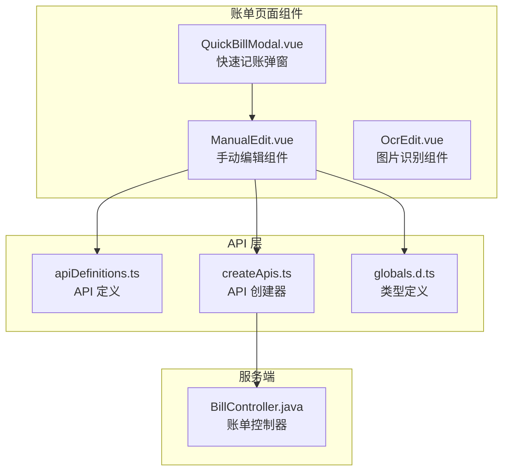

**图表来源**
- [ManualEdit.vue:1-174](file://chuan-bill-app/src/pages/bill/components/ManualEdit.vue#L1-L174)
- [QuickBillModal.vue:1-64](file://chuan-bill-app/src/pages/bill/components/QuickBillModal.vue#L1-L64)
- [apiDefinitions.ts:1-38](file://chuan-bill-app/src/api/apiDefinitions.ts#L1-L38)

**章节来源**
- [ManualEdit.vue:1-174](file://chuan-bill-app/src/pages/bill/components/ManualEdit.vue#L1-L174)
- [QuickBillModal.vue:1-64](file://chuan-bill-app/src/pages/bill/components/QuickBillModal.vue#L1-L64)

## 核心组件

ManualEdit 组件的核心功能围绕以下关键要素构建：

### 数据模型设计

组件使用响应式数据结构来管理表单状态：

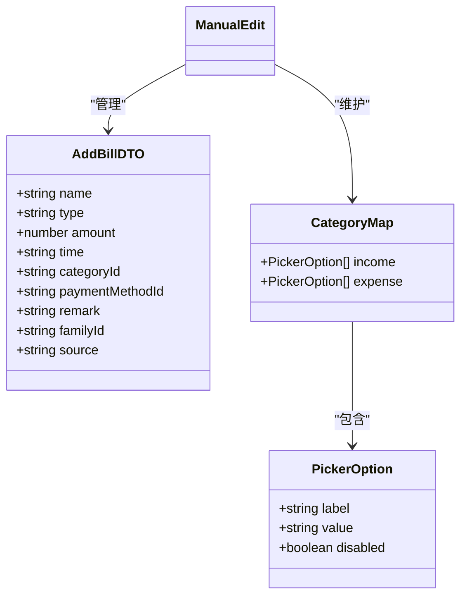

**图表来源**
- [ManualEdit.vue:12-30](file://chuan-bill-app/src/pages/bill/components/ManualEdit.vue#L12-L30)
- [globals.d.ts:214-251](file://chuan-bill-app/src/api/globals.d.ts#L214-L251)

### 表单字段设计

组件提供完整的账单录入字段：

| 字段 | 类型 | 必填 | 描述 | 组件 |
|------|------|------|------|------|
| 类型 | radio | 是 | 收入/支出选择 | wd-radio-group |
| 金额 | input | 是 | 账单金额 | wd-input(digit) |
| 名称 | input | 否 | 账单描述 | wd-input(text) |
| 时间 | datetime | 是 | 记账时间 | wd-datetime-picker |
| 类目 | picker | 是 | 收支分类 | wd-picker |
| 支付方式 | picker | 是 | 支付方式 | wd-picker |
| 共享 | switch | 否 | 家庭共享开关 | wd-switch |
| 备注 | textarea | 否 | 详细说明 | wd-textarea |

**章节来源**
- [ManualEdit.vue:69-135](file://chuan-bill-app/src/pages/bill/components/ManualEdit.vue#L69-L135)

## 架构概览

ManualEdit 组件采用分层架构设计，确保业务逻辑与视图层的良好分离：

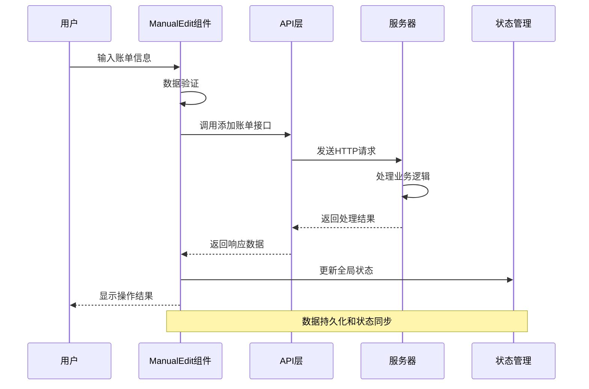

**图表来源**
- [ManualEdit.vue:31-66](file://chuan-bill-app/src/pages/bill/components/ManualEdit.vue#L31-L66)
- [BillController.java:52-57](file://chuan-bill-server/src/main/java/com/samoy/chuanbillserver/controller/BillController.java#L52-L57)

## 详细组件分析

### 组件生命周期管理

ManualEdit 组件采用 Vue 3 的组合式 API，实现了完整的生命周期管理：

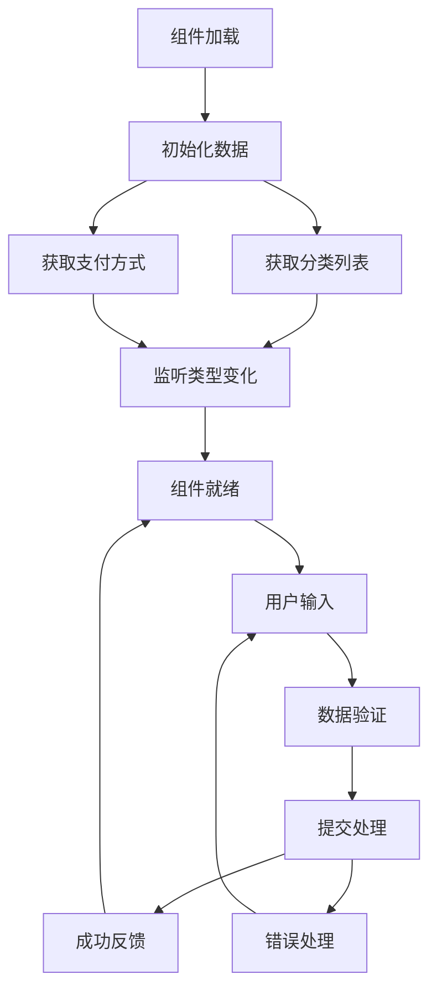

**图表来源**
- [ManualEdit.vue:58-66](file://chuan-bill-app/src/pages/bill/components/ManualEdit.vue#L58-L66)

### 数据绑定机制

组件使用 Vue 3 的响应式系统实现双向数据绑定：

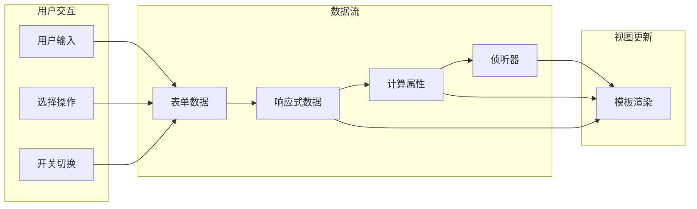

**图表来源**
- [ManualEdit.vue:23-29](file://chuan-bill-app/src/pages/bill/components/ManualEdit.vue#L23-L29)

### 实时验证规则

组件实现了多层次的数据验证机制：

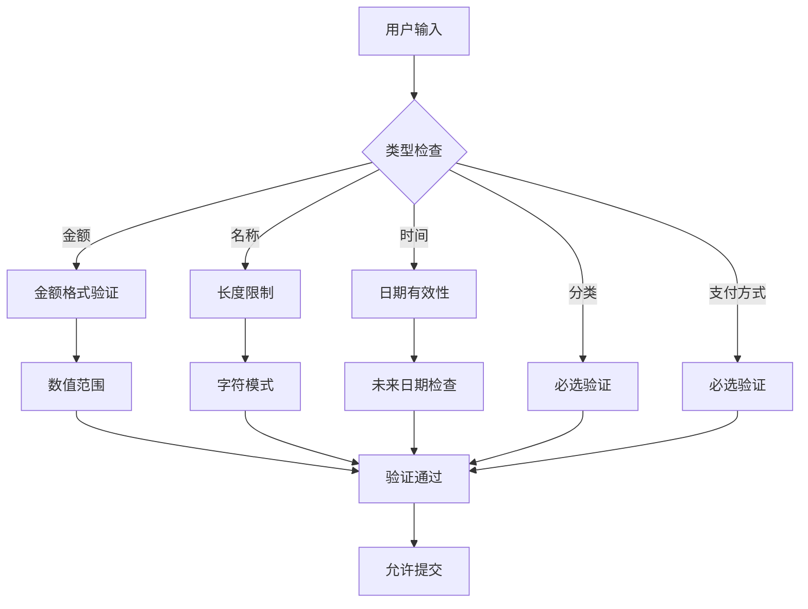

**图表来源**
- [ManualEdit.vue:82-93](file://chuan-bill-app/src/pages/bill/components/ManualEdit.vue#L82-L93)

### 业务逻辑实现

组件的核心业务逻辑包括数据收集、格式校验、错误提示和提交流程：

#### 数据收集流程

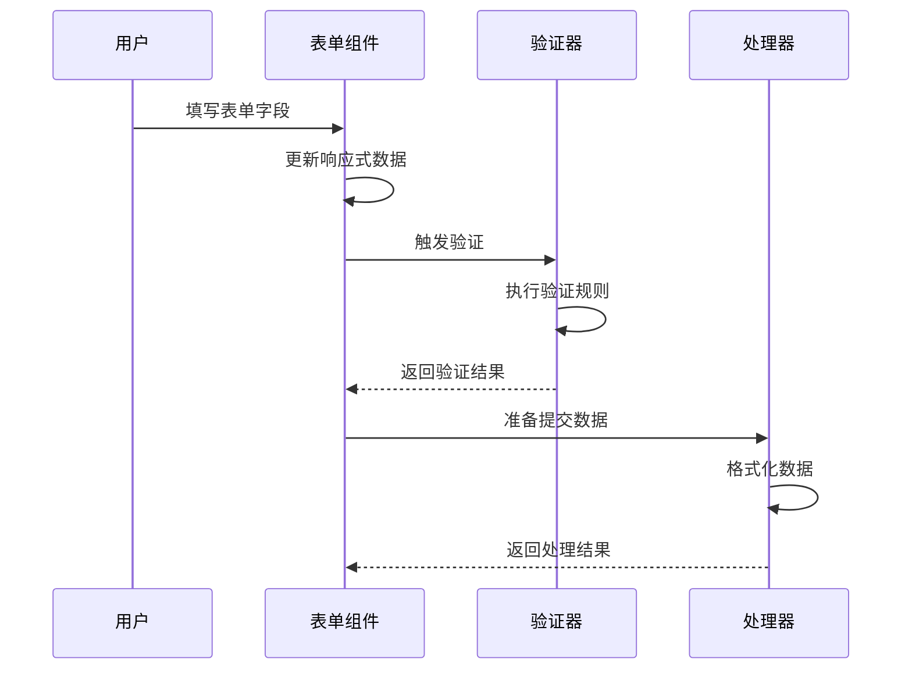

#### 提交流程

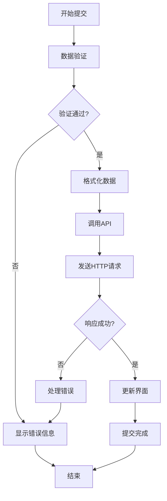

**图表来源**
- [ManualEdit.vue:31-66](file://chuan-bill-app/src/pages/bill/components/ManualEdit.vue#L31-L66)

### API 交互模式

组件通过 Alova 库实现与后端 API 的交互：

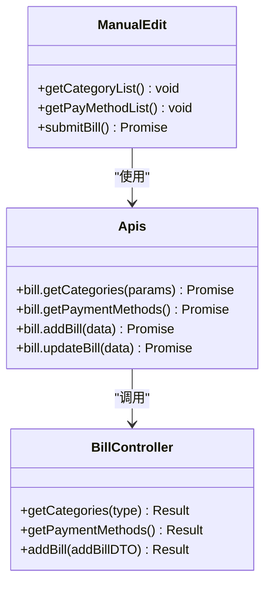

**图表来源**
- [ManualEdit.vue:31-56](file://chuan-bill-app/src/pages/bill/components/ManualEdit.vue#L31-L56)
- [BillController.java:74-89](file://chuan-bill-server/src/main/java/com/samoy/chuanbillserver/controller/BillController.java#L74-L89)

### 数据持久化策略

组件采用渐进式数据持久化策略：

1. **本地状态管理**：使用 Vue 3 响应式系统管理组件内部状态
2. **API 数据同步**：通过 Alova 库实现与后端数据的实时同步
3. **缓存策略**：对分类和支付方式数据进行本地缓存，减少重复请求
4. **错误恢复**：在网络异常时提供本地数据恢复机制

**章节来源**
- [ManualEdit.vue:31-66](file://chuan-bill-app/src/pages/bill/components/ManualEdit.vue#L31-L66)

## 依赖关系分析

### 组件依赖图

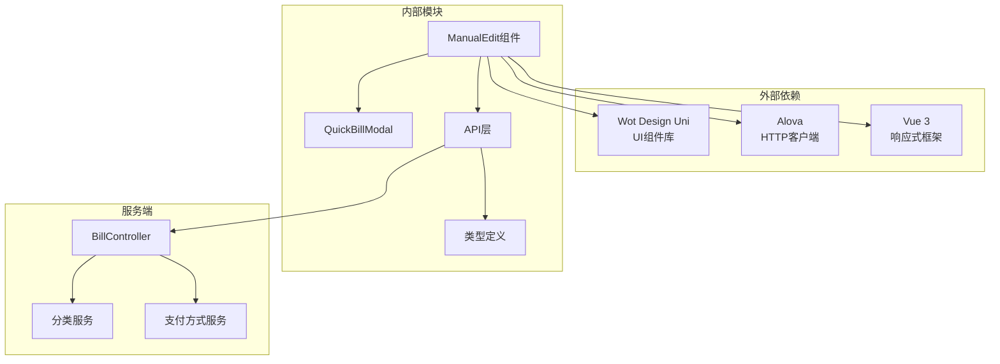

**图表来源**
- [ManualEdit.vue:1-10](file://chuan-bill-app/src/pages/bill/components/ManualEdit.vue#L1-L10)
- [QuickBillModal.vue:1-23](file://chuan-bill-app/src/pages/bill/components/QuickBillModal.vue#L1-L23)

### 状态管理集成

组件与全局状态管理系统的集成：

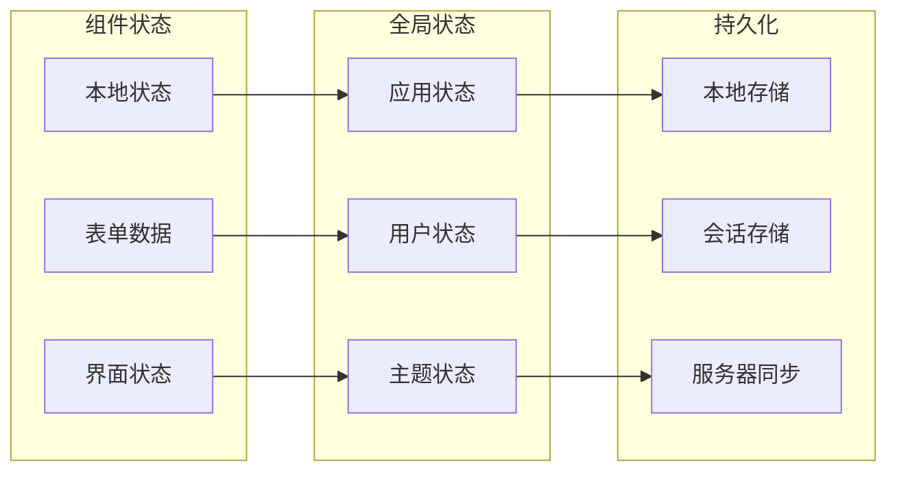

**图表来源**
- [ManualEdit.vue:23-29](file://chuan-bill-app/src/pages/bill/components/ManualEdit.vue#L23-L29)

**章节来源**
- [ManualEdit.vue:1-174](file://chuan-bill-app/src/pages/bill/components/ManualEdit.vue#L1-L174)

## 性能考虑

### 渲染优化

组件采用了多项性能优化措施：

1. **虚拟主机支持**：启用 `virtualHost: true` 减少 DOM 层级深度
2. **样式隔离**：使用 `styleIsolation: 'shared'` 提高样式渲染效率
3. **按需加载**：分类和支付方式数据按需加载，避免不必要的网络请求
4. **响应式优化**：合理使用 `ref` 和 `reactive` 提高响应式系统的性能

### 数据加载优化

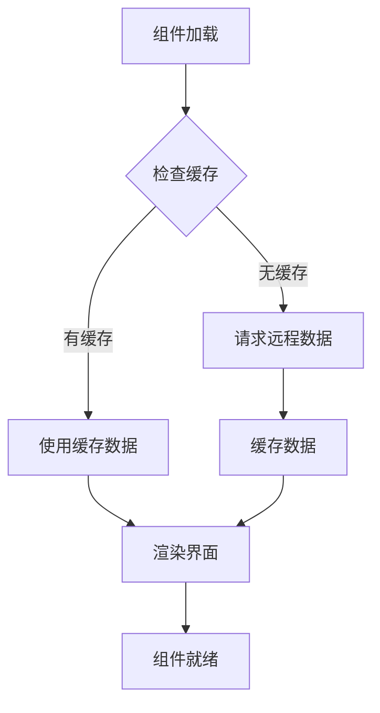

### 内存管理

组件实现了有效的内存管理策略：

- 及时清理事件监听器
- 合理使用 `onUnmounted` 生命周期钩子
- 避免内存泄漏的闭包引用

## 故障排除指南

### 常见问题诊断

#### 表单验证失败

**症状**：用户无法提交表单，出现验证错误提示

**排查步骤**：
1. 检查输入字段的值是否符合预期格式
2. 验证必填字段是否已填写
3. 确认数据类型转换是否正确
4. 查看控制台是否有 JavaScript 错误

#### API 请求失败

**症状**：网络请求超时或返回错误状态码

**排查步骤**：
1. 检查网络连接状态
2. 验证 API 端点地址
3. 确认请求参数格式
4. 查看服务器响应日志

#### 数据同步问题

**症状**：界面显示的数据与实际不符

**排查步骤**：
1. 检查本地缓存状态
2. 验证数据更新机制
3. 确认状态管理配置
4. 查看数据持久化日志

### 调试工具使用

#### 浏览器开发者工具

1. **Elements 面板**：检查组件渲染的 HTML 结构
2. **Console 面板**：查看 JavaScript 错误和警告
3. **Network 面板**：监控 API 请求和响应
4. **Sources 面板**：设置断点调试代码执行

#### 移动端调试

1. **微信开发者工具**：使用真机调试功能
2. **远程调试**：通过 USB 连接手机进行调试
3. **日志输出**：使用 `console.log` 输出调试信息

**章节来源**
- [ManualEdit.vue:31-66](file://chuan-bill-app/src/pages/bill/components/ManualEdit.vue#L31-L66)

## 结论

ManualEdit 手动编辑组件是一个功能完整、架构清晰的账单录入解决方案。组件通过合理的数据模型设计、完善的验证机制和高效的 API 交互，为用户提供了流畅的记账体验。

### 主要优势

1. **用户体验优秀**：简洁直观的界面设计，符合移动端操作习惯
2. **功能完整性**：覆盖了记账所需的所有关键字段和功能
3. **性能表现良好**：采用多项优化技术，确保组件运行效率
4. **可维护性强**：清晰的代码结构和完善的注释说明

### 技术亮点

- 采用 Vue 3 Composition API 构建，提供更好的类型支持和代码组织
- 集成 Alova HTTP 客户端，实现统一的 API 调用模式
- 使用 Wot Design Uni 组件库，确保跨平台兼容性
- 实现响应式数据绑定和实时验证机制

### 改进建议

1. **增强错误处理**：增加更详细的错误提示和恢复机制
2. **性能监控**：添加组件性能指标监控
3. **国际化支持**：考虑添加多语言支持
4. **无障碍访问**：提升组件的无障碍访问能力

ManualEdit 组件为小川记账应用提供了坚实的基础，通过持续的优化和改进，将继续为用户提供优质的记账服务体验。