# OcrEdit OCR识别组件

<cite>
**本文档引用的文件**
- [OcrEdit.vue](file://chuan-bill-app/src/pages/bill/components/OcrEdit.vue)
- [AIController.java](file://chuan-bill-server/src/main/java/com/samoy/chuanbillserver/controller/AIController.java)
- [FileController.java](file://chuan-bill-server/src/main/java/com/samoy/chuanbillserver/controller/FileController.java)
- [AIServiceImpl.java](file://chuan-bill-server/src/main/java/com/samoy/chuanbillserver/service/impl/AIServiceImpl.java)
- [OCRUtil.java](file://chuan-bill-server/src/main/java/com/samoy/chuanbillserver/utils/OCRUtil.java)
- [AddBillDTO.java](file://chuan-bill-server/src/main/java/com/samoy/chuanbillserver/dto/AddBillDTO.java)
- [application.yaml](file://chuan-bill-server/src/main/resources/application.yaml)
- [apiDefinitions.ts](file://chuan-bill-app/src/api/apiDefinitions.ts)
- [createApis.ts](file://chuan-bill-app/src/api/createApis.ts)
- [handlers.ts](file://chuan-bill-app/src/api/core/handlers.ts)
- [useGlobalToast.ts](file://chuan-bill-app/src/composables/useGlobalToast.ts)
- [index.vue](file://chuan-bill-app/src/pages/bill/index.vue)
</cite>

## 目录
1. [简介](#简介)
2. [项目结构](#项目结构)
3. [核心组件](#核心组件)
4. [架构概览](#架构概览)
5. [详细组件分析](#详细组件分析)
6. [依赖关系分析](#依赖关系分析)
7. [性能考虑](#性能考虑)
8. [故障排除指南](#故障排除指南)
9. [结论](#结论)
10. [附录](#附录)

## 简介

OcrEdit 是一个基于 Vue 3 和 TypeScript 的 OCR 识别组件，专为账单识别场景设计。该组件提供了完整的图片上传、OCR 识别调用、结果处理和展示功能，集成了 DashScope AI 服务来实现智能账单信息提取。

组件采用现代化的开发模式，使用 Alova 作为 HTTP 客户端，Wot Design Uni 作为 UI 组件库，并实现了完整的错误处理和状态管理机制。

## 项目结构

OcrEdit 组件位于项目的核心业务路径中，与账单管理功能紧密集成：

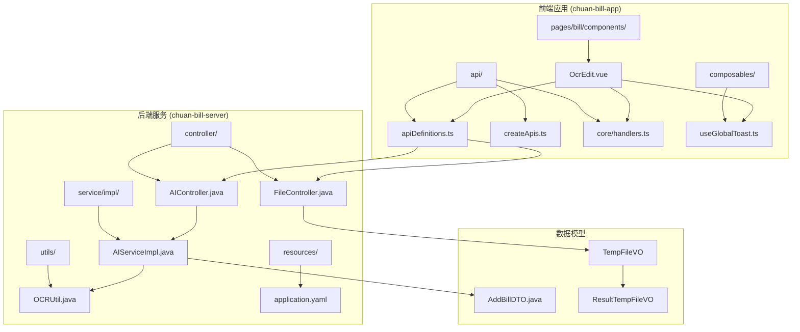

**图表来源**
- [OcrEdit.vue:1-167](file://chuan-bill-app/src/pages/bill/components/OcrEdit.vue#L1-L167)
- [AIController.java:1-25](file://chuan-bill-server/src/main/java/com/samoy/chuanbillserver/controller/AIController.java#L1-L25)
- [FileController.java:1-26](file://chuan-bill-server/src/main/java/com/samoy/chuanbillserver/controller/FileController.java#L1-L26)

**章节来源**
- [OcrEdit.vue:1-167](file://chuan-bill-app/src/pages/bill/components/OcrEdit.vue#L1-L167)
- [index.vue:1-54](file://chuan-bill-app/src/pages/bill/index.vue#L1-L54)

## 核心组件

### 组件状态管理

OcrEdit 组件实现了完整的任务状态管理机制：

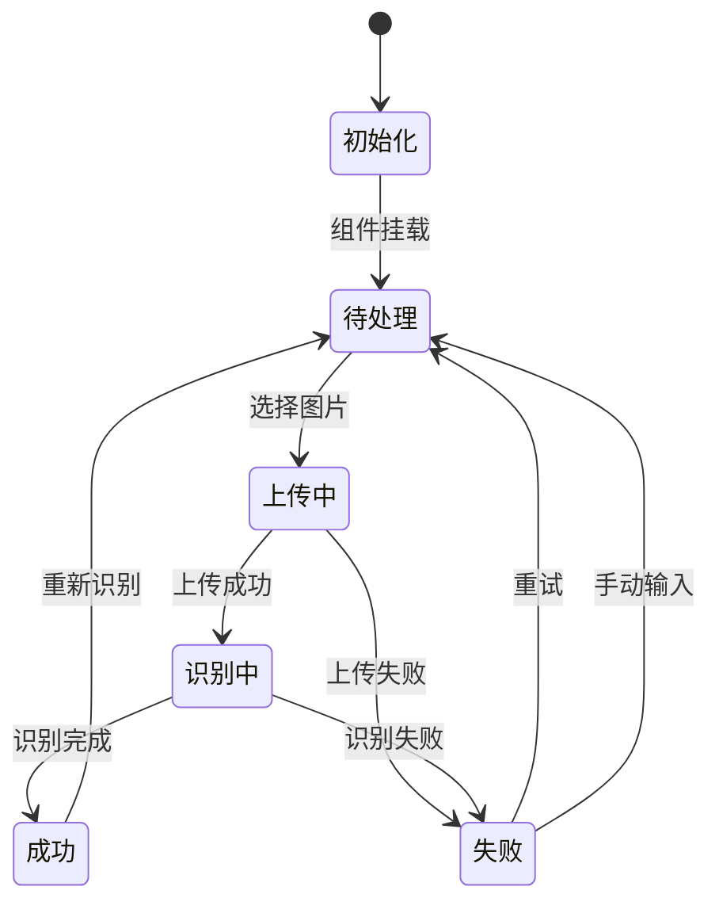

**图表来源**
- [OcrEdit.vue:13-18](file://chuan-bill-app/src/pages/bill/components/OcrEdit.vue#L13-L18)

组件的核心状态包括：
- **初始化状态 (Init)**: 组件刚加载完成
- **待处理状态 (Pending)**: 正在进行 OCR 识别
- **成功状态 (Success)**: 识别完成，结果可用
- **失败状态 (Failed)**: 识别失败，需要重试

### 数据流架构

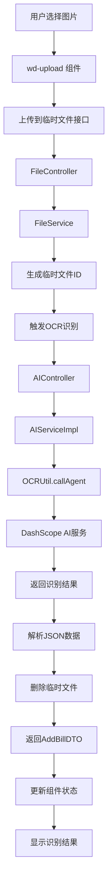

**图表来源**
- [OcrEdit.vue:27-69](file://chuan-bill-app/src/pages/bill/components/OcrEdit.vue#L27-L69)
- [AIServiceImpl.java:28-50](file://chuan-bill-server/src/main/java/com/samoy/chuanbillserver/service/impl/AIServiceImpl.java#L28-L50)

**章节来源**
- [OcrEdit.vue:20-69](file://chuan-bill-app/src/pages/bill/components/OcrEdit.vue#L20-L69)

## 架构概览

### 前后端交互模式

OcrEdit 采用了标准的前后端分离架构，通过 RESTful API 进行通信：

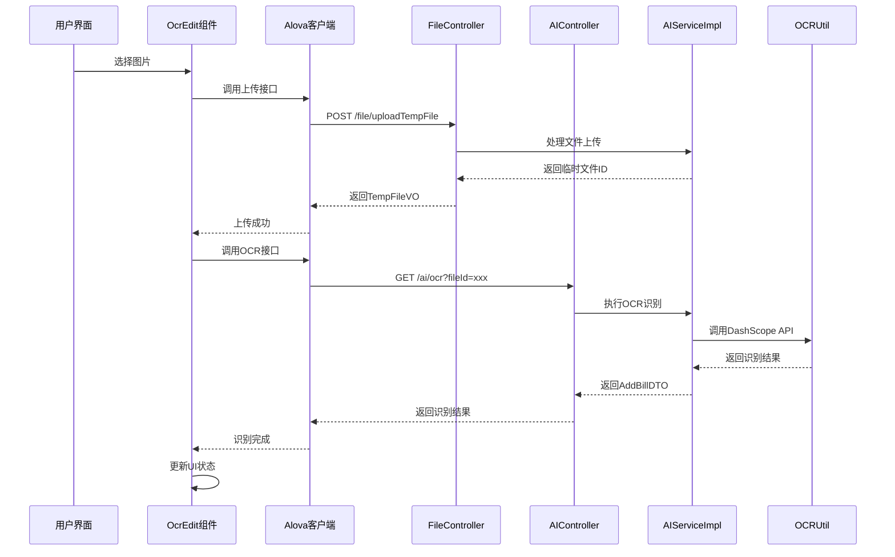

**图表来源**
- [OcrEdit.vue:27-49](file://chuan-bill-app/src/pages/bill/components/OcrEdit.vue#L27-L49)
- [apiDefinitions.ts:23-36](file://chuan-bill-app/src/api/apiDefinitions.ts#L23-L36)

### 错误处理机制

系统实现了多层次的错误处理机制：

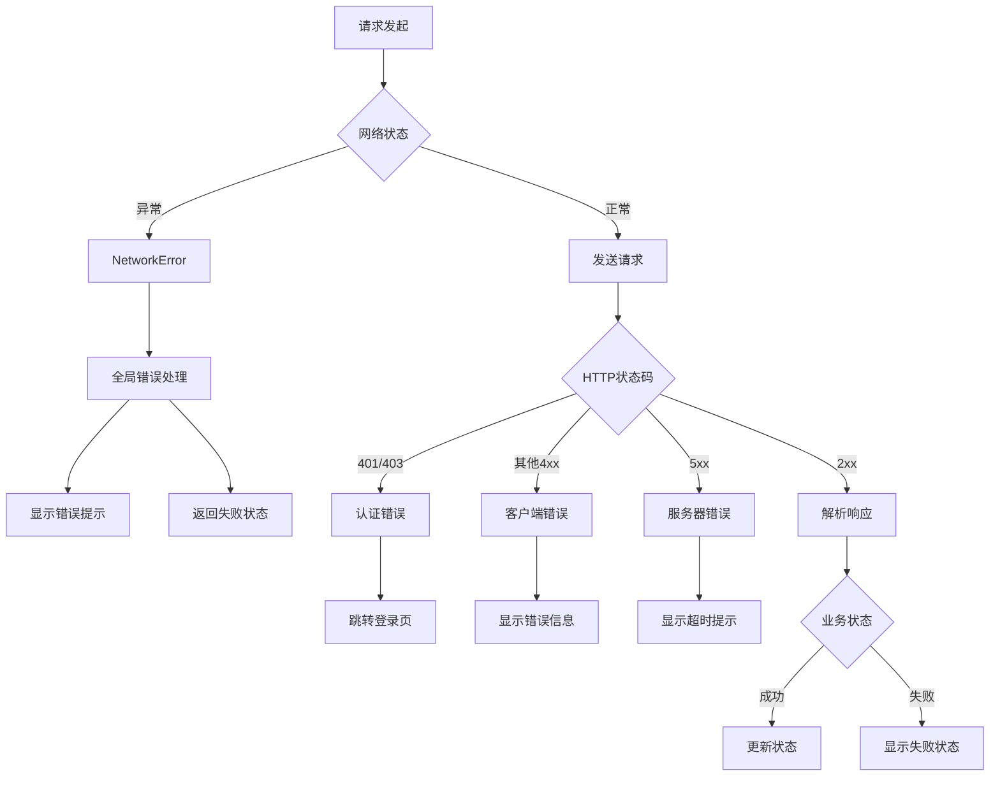

**图表来源**
- [handlers.ts:71-104](file://chuan-bill-app/src/api/core/handlers.ts#L71-L104)

**章节来源**
- [handlers.ts:50-104](file://chuan-bill-app/src/api/core/handlers.ts#L50-L104)

## 详细组件分析

### 组件类图

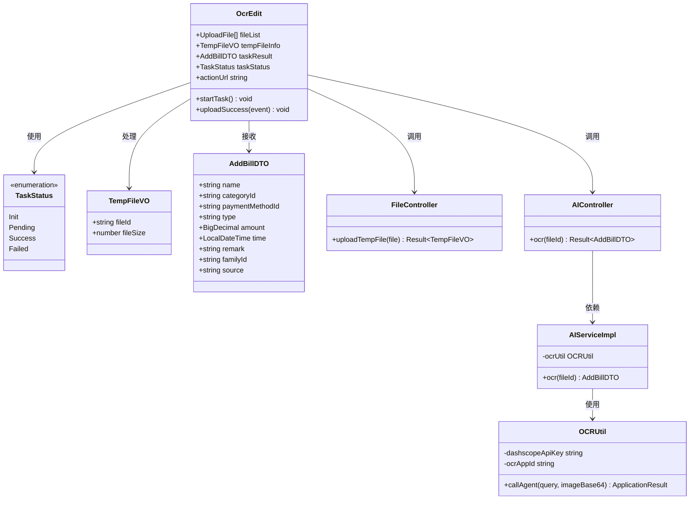

**图表来源**
- [OcrEdit.vue:13-25](file://chuan-bill-app/src/pages/bill/components/OcrEdit.vue#L13-L25)
- [AddBillDTO.java:12-43](file://chuan-bill-server/src/main/java/com/samoy/chuanbillserver/dto/AddBillDTO.java#L12-L43)

### 图片上传机制

组件使用 Wot Design Uni 的 wd-upload 组件实现图片上传功能：

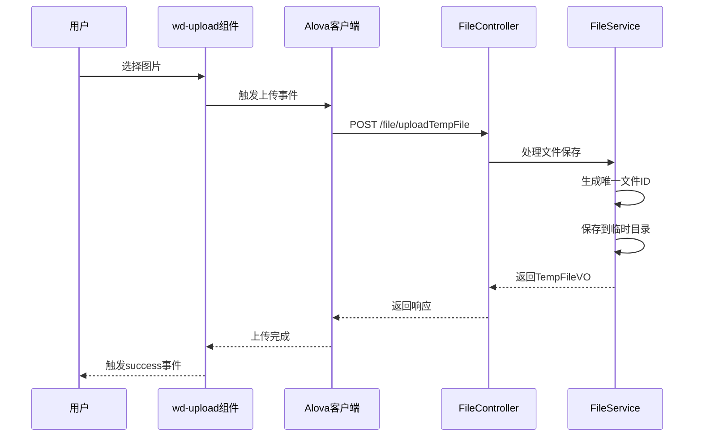

**图表来源**
- [OcrEdit.vue:74-86](file://chuan-bill-app/src/pages/bill/components/OcrEdit.vue#L74-L86)
- [FileController.java:21-25](file://chuan-bill-server/src/main/java/com/samoy/chuanbillserver/controller/FileController.java#L21-L25)

### OCR识别流程

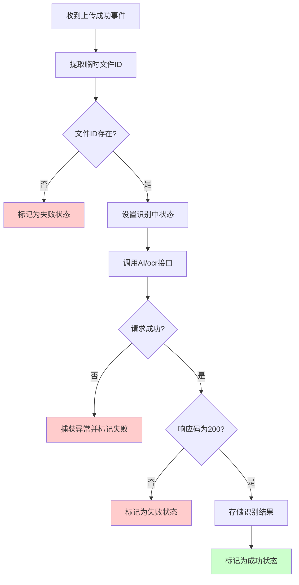

**图表来源**
- [OcrEdit.vue:27-49](file://chuan-bill-app/src/pages/bill/components/OcrEdit.vue#L27-L49)

**章节来源**
- [OcrEdit.vue:51-69](file://chuan-bill-app/src/pages/bill/components/OcrEdit.vue#L51-L69)

### 后端AI服务实现

后端服务采用分层架构设计，实现了完整的 OCR 识别流程：

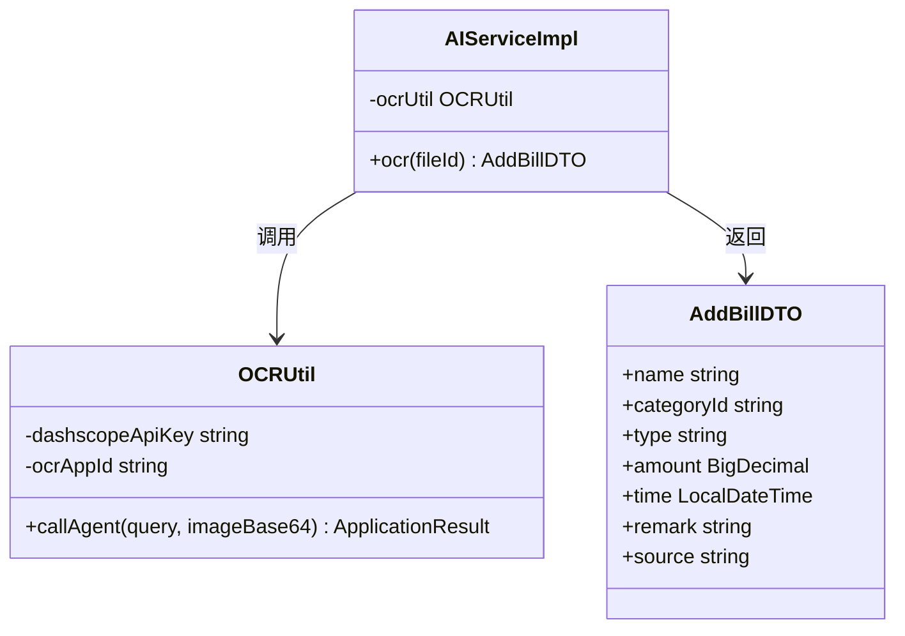

**图表来源**
- [AIServiceImpl.java:22-50](file://chuan-bill-server/src/main/java/com/samoy/chuanbillserver/service/impl/AIServiceImpl.java#L22-L50)
- [OCRUtil.java:22-35](file://chuan-bill-server/src/main/java/com/samoy/chuanbillserver/utils/OCRUtil.java#L22-L35)

**章节来源**
- [AIServiceImpl.java:28-50](file://chuan-bill-server/src/main/java/com/samoy/chuanbillserver/service/impl/AIServiceImpl.java#L28-L50)
- [OCRUtil.java:22-35](file://chuan-bill-server/src/main/java/com/samoy/chuanbillserver/utils/OCRUtil.java#L22-L35)

## 依赖关系分析

### 前端依赖关系

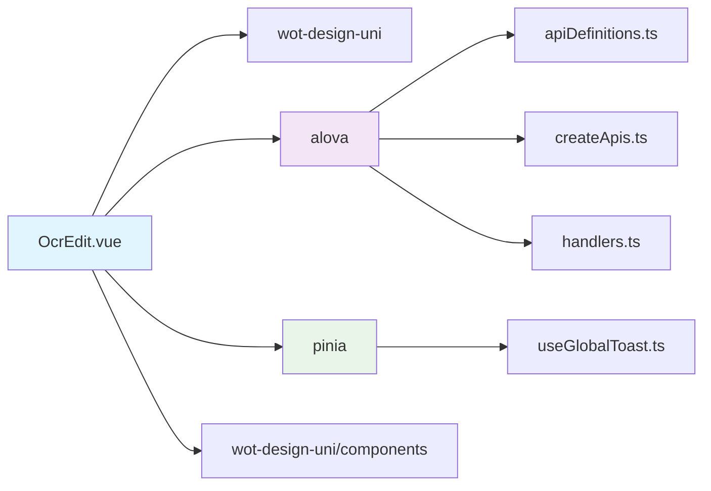

**图表来源**
- [OcrEdit.vue:2-3](file://chuan-bill-app/src/pages/bill/components/OcrEdit.vue#L2-L3)
- [apiDefinitions.ts:19-37](file://chuan-bill-app/src/api/apiDefinitions.ts#L19-L37)

### 后端依赖关系

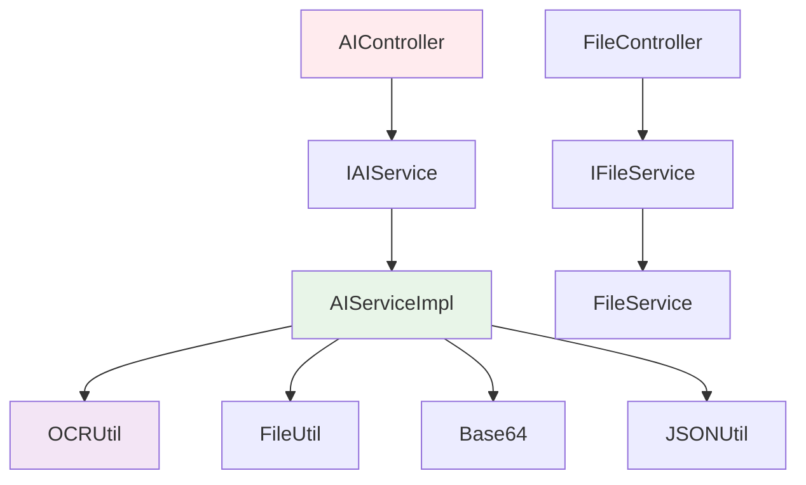

**图表来源**
- [AIController.java:16-24](file://chuan-bill-server/src/main/java/com/samoy/chuanbillserver/controller/AIController.java#L16-L24)
- [AIServiceImpl.java:22-25](file://chuan-bill-server/src/main/java/com/samoy/chuanbillserver/service/impl/AIServiceImpl.java#L22-L25)

**章节来源**
- [apiDefinitions.ts:19-37](file://chuan-bill-app/src/api/apiDefinitions.ts#L19-L37)
- [application.yaml:48-51](file://chuan-bill-server/src/main/resources/application.yaml#L48-L51)

## 性能考虑

### 上传性能优化

1. **文件大小限制**: 组件默认限制为单文件上传，避免大文件传输
2. **临时文件管理**: 识别完成后自动清理临时文件，释放存储空间
3. **并发控制**: 通过状态管理避免重复提交

### 识别性能优化

1. **缓存策略**: 识别结果在组件内缓存，避免重复请求
2. **超时控制**: 集成全局超时处理机制
3. **错误重试**: 提供手动重试机制

### UI性能优化

1. **懒加载**: 仅在需要时渲染识别界面
2. **动画优化**: 使用 CSS 动画而非 JavaScript 动画
3. **内存管理**: 及时清理事件监听器和定时器

## 故障排除指南

### 常见问题及解决方案

#### 1. 上传失败

**症状**: 上传后显示失败状态，无法开始识别

**可能原因**:
- 网络连接不稳定
- 服务器配置错误
- 文件格式不支持

**解决方法**:
- 检查网络连接状态
- 验证上传接口配置
- 确认文件类型为图片格式

#### 2. 识别失败

**症状**: 识别过程中出现错误提示

**可能原因**:
- DashScope API 配置错误
- 图片质量不佳
- AI 服务不可用

**解决方法**:
- 检查 DashScope API Key 配置
- 确认图片清晰度和角度
- 验证 AI 服务运行状态

#### 3. 状态管理问题

**症状**: 组件状态混乱，无法正确显示结果

**解决方法**:
- 检查状态更新逻辑
- 确认异步操作顺序
- 验证错误边界条件

**章节来源**
- [handlers.ts:71-104](file://chuan-bill-app/src/api/core/handlers.ts#L71-L104)
- [OcrEdit.vue:116-132](file://chuan-bill-app/src/pages/bill/components/OcrEdit.vue#L116-L132)

## 结论

OcrEdit OCR 识别组件是一个功能完整、架构清晰的现代化组件。它成功地整合了前端上传、后端 AI 识别和结果展示的完整流程，提供了良好的用户体验和可靠的错误处理机制。

组件的主要优势包括：
- **模块化设计**: 清晰的职责分离和依赖管理
- **完善的错误处理**: 多层次的错误捕获和用户提示
- **状态管理**: 有效的组件状态控制和生命周期管理
- **扩展性**: 易于维护和功能扩展的架构设计

## 附录

### 集成示例

#### 基本集成步骤

1. **安装依赖**:
```bash
npm install wot-design-uni alova
```

2. **配置环境变量**:
```env
VITE_API_UPLOAD_TEMP_FILE_URL=http://localhost:8080/file/uploadTempFile
```

3. **在页面中使用**:
```vue
<template>
  <OcrEdit />
</template>
```

#### 高级配置选项

| 配置项 | 类型 | 默认值 | 描述 |
|--------|------|--------|------|
| action | string | 环境变量 | 上传接口地址 |
| accept | string | "image" | 允许的文件类型 |
| limit | number | 1 | 最大上传数量 |
| headers | object | 包含token | 请求头配置 |

### 最佳实践

1. **错误处理**: 始终实现完整的错误处理逻辑
2. **状态管理**: 使用明确的状态枚举和状态转换
3. **性能优化**: 实现适当的缓存和防抖机制
4. **用户体验**: 提供清晰的进度反馈和错误提示
5. **安全性**: 确保 API Key 和敏感信息的安全存储

### 调试技巧

1. **开发工具**: 使用浏览器开发者工具监控网络请求
2. **日志记录**: 在关键节点添加详细的日志输出
3. **单元测试**: 为关键逻辑编写单元测试用例
4. **性能分析**: 使用性能分析工具识别瓶颈
5. **用户反馈**: 收集用户反馈改进用户体验