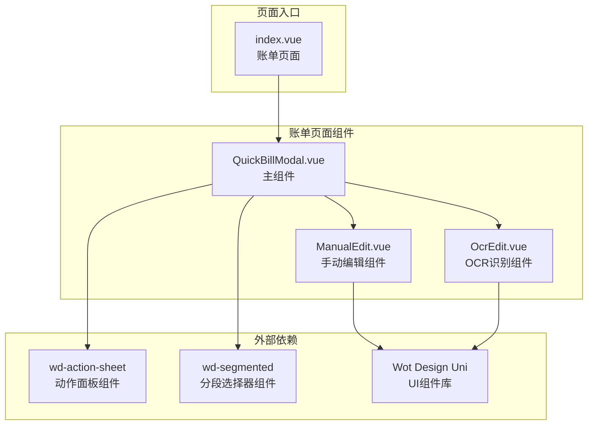
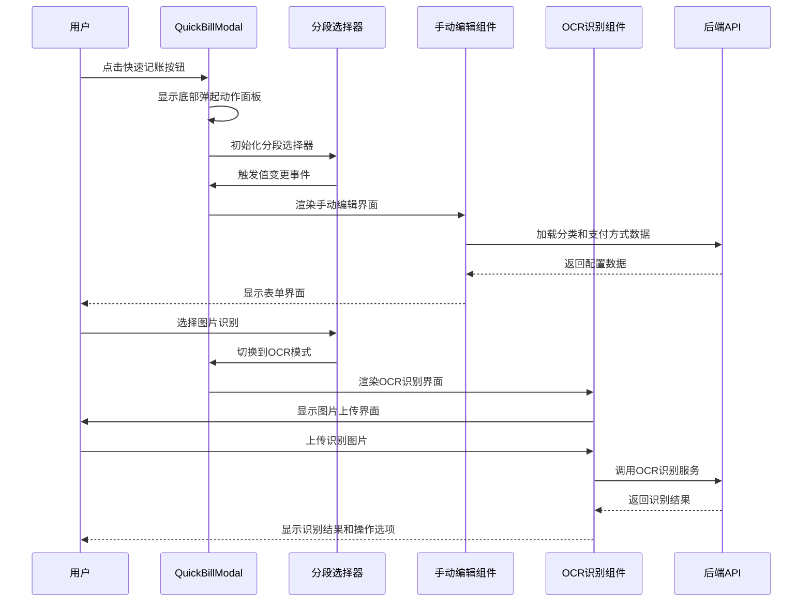
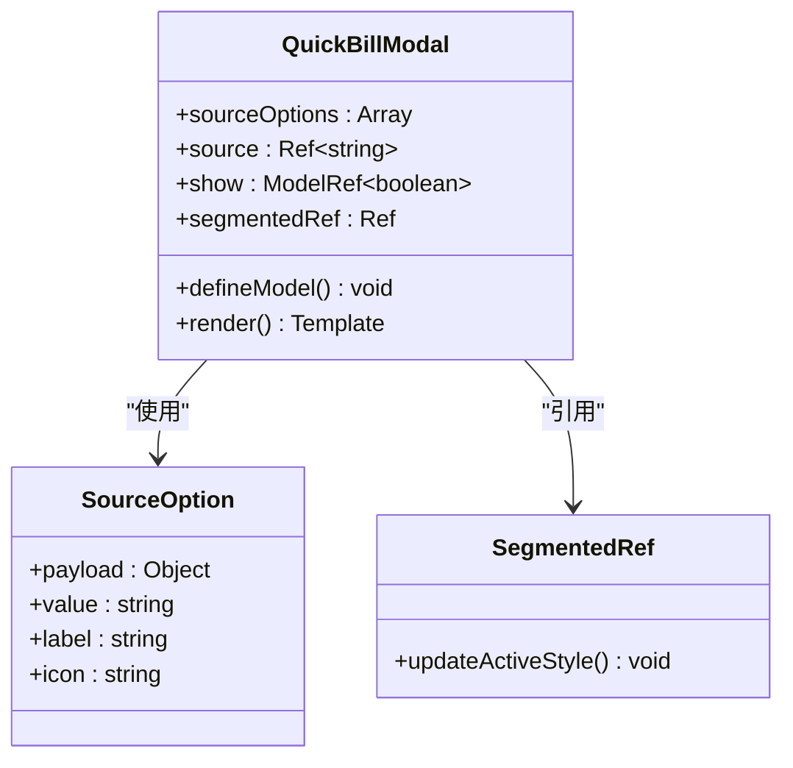
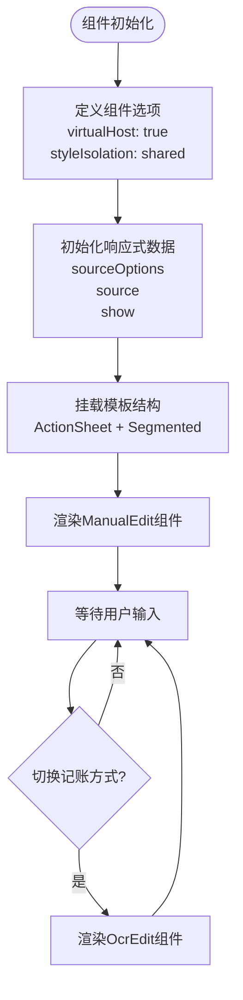
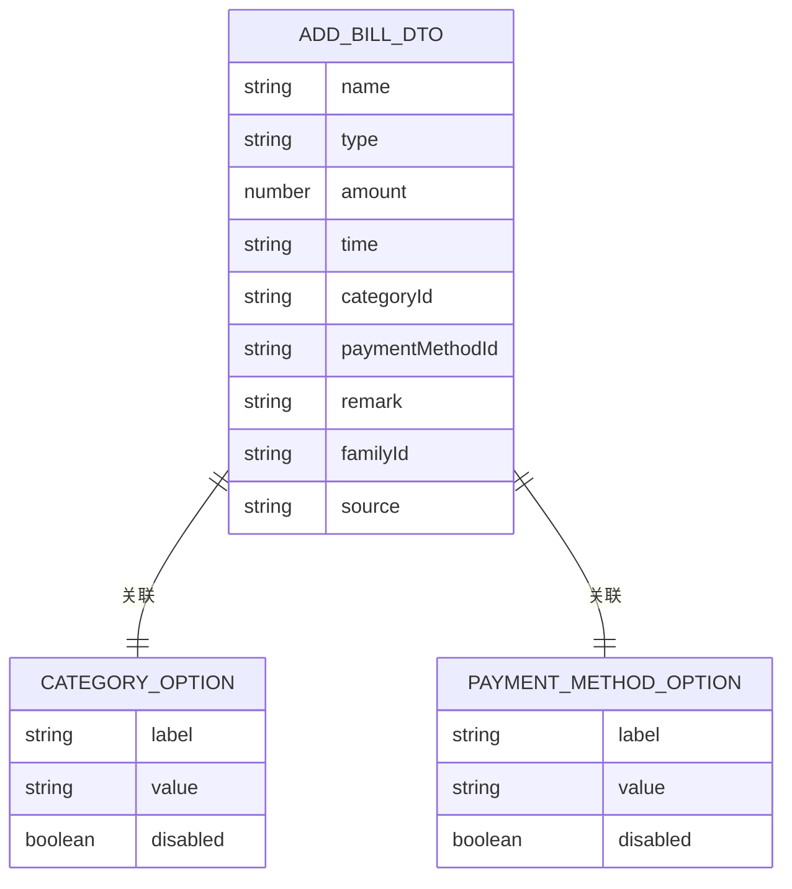
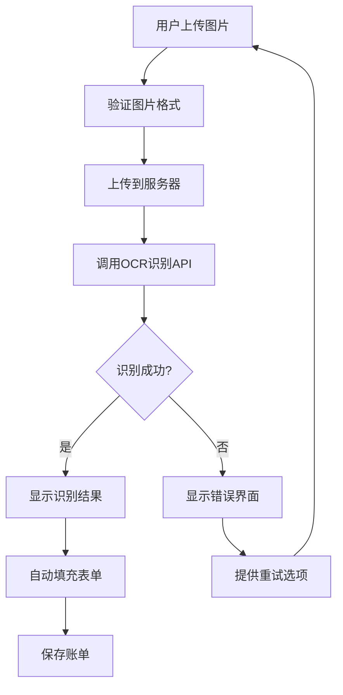
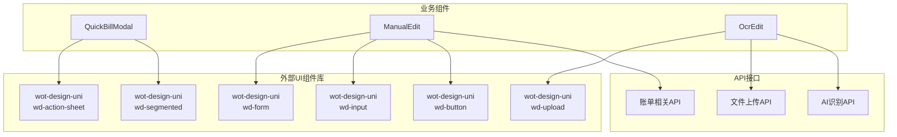
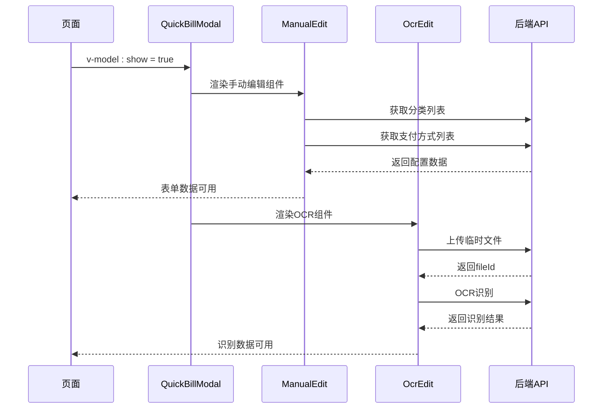
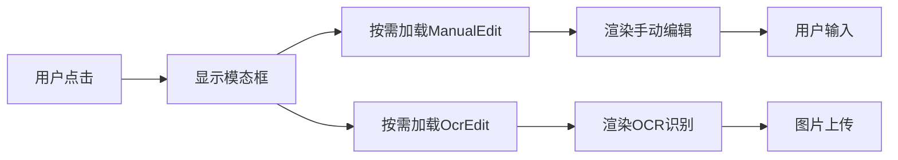

# QuickBillModal 快速记账模态框

<cite>
**本文档引用的文件**
- [QuickBillModal.vue](file://chuan-bill-app/src/pages/bill/components/QuickBillModal.vue)
- [QuickBillModal.js](file://chuan-bill-app/dist/dev/mp-weixin/pages/bill/components/QuickBillModal.js)
- [QuickBillModal.json](file://chuan-bill-app/dist/dev/mp-weixin/pages/bill/components/QuickBillModal.json)
- [QuickBillModal.wxss](file://chuan-bill-app/dist/dev/mp-weixin/pages/bill/components/QuickBillModal.wxss)
- [ManualEdit.vue](file://chuan-bill-app/src/pages/bill/components/ManualEdit.vue)
- [OcrEdit.vue](file://chuan-bill-app/src/pages/bill/components/OcrEdit.vue)
- [index.vue](file://chuan-bill-app/src/pages/bill/index.vue)
- [globals.d.ts](file://chuan-bill-app/src/api/globals.d.ts)
- [action-sheet.md](file://chuan-bill-app/.claude/skills/wot-ui/references/action-sheet.md)
</cite>

## 目录
1. [简介](#简介)
2. [项目结构](#项目结构)
3. [核心组件](#核心组件)
4. [架构概览](#架构概览)
5. [详细组件分析](#详细组件分析)
6. [依赖关系分析](#依赖关系分析)
7. [性能考虑](#性能考虑)
8. [故障排除指南](#故障排除指南)
9. [结论](#结论)
10. [附录](#附录)

## 简介

QuickBillModal 是一个快速记账模态框组件，作为记账入口的核心组件，提供了三种记账方式的统一入口：手动添加、图片识别和语音识别。该组件采用底部弹起的动作面板设计，结合分段选择器实现三种记账方式的无缝切换，为用户提供便捷的账单录入体验。

该组件具有以下核心特性：
- 底部弹起动作面板，提供流畅的移动端交互体验
- 分段选择器实现三种记账方式的直观切换
- 与ManualEdit和OcrEdit子组件的深度集成
- 虚拟宿主特性和样式隔离策略
- 完整的数据传递和状态同步机制

## 项目结构

QuickBillModal 组件位于账单页面的组件目录中，采用模块化的设计结构：



**图表来源**
- [QuickBillModal.vue:1-64](file://chuan-bill-app/src/pages/bill/components/QuickBillModal.vue#L1-L64)
- [index.vue:1-54](file://chuan-bill-app/src/pages/bill/index.vue#L1-L54)

**章节来源**
- [QuickBillModal.vue:1-64](file://chuan-bill-app/src/pages/bill/components/QuickBillModal.vue#L1-L64)
- [index.vue:1-54](file://chuan-bill-app/src/pages/bill/index.vue#L1-L54)

## 核心组件

### QuickBillModal 主组件

QuickBillModal 作为核心组件，实现了以下关键功能：

#### 组件配置
- **虚拟宿主**: 启用 `virtualHost: true` 和 `styleIsolation: 'shared'`
- **属性模型**: 使用 `defineModel<boolean>('show')` 实现双向绑定
- **分段选择器**: 集成 `wd-segmented` 组件实现三种记账方式切换

#### 记账方式配置
组件定义了三种记账方式的选项配置：

| 方式 | 值 | 图标 | 标签 |
|------|----|------|------|
| 手动添加 | manual | square-pen | 手动添加 |
| 图片识别 | ocr | camera | 图片识别 |
| 语音识别 | voice | mic | 语音识别 |

#### 事件处理机制
- `@opened` 事件：触发分段选择器的活动样式更新
- 内置状态管理：通过 `source` 响应式变量控制子组件渲染

**章节来源**
- [QuickBillModal.vue:5-23](file://chuan-bill-app/src/pages/bill/components/QuickBillModal.vue#L5-L23)
- [QuickBillModal.vue:14-18](file://chuan-bill-app/src/pages/bill/components/QuickBillModal.vue#L14-L18)

## 架构概览

QuickBillModal 采用了组件化的架构设计，实现了清晰的职责分离：



**图表来源**
- [QuickBillModal.vue:25-52](file://chuan-bill-app/src/pages/bill/components/QuickBillModal.vue#L25-L52)
- [ManualEdit.vue:31-66](file://chuan-bill-app/src/pages/bill/components/ManualEdit.vue#L31-L66)
- [OcrEdit.vue:27-69](file://chuan-bill-app/src/pages/bill/components/OcrEdit.vue#L27-L69)

## 详细组件分析

### QuickBillModal 组件详解

#### 数据结构设计



**图表来源**
- [QuickBillModal.vue:14-22](file://chuan-bill-app/src/pages/bill/components/QuickBillModal.vue#L14-L22)

#### 组件生命周期



**图表来源**
- [QuickBillModal.vue:1-64](file://chuan-bill-app/src/pages/bill/components/QuickBillModal.vue#L1-L64)

#### 属性配置详解

| 属性名 | 类型 | 默认值 | 描述 | 必需 |
|--------|------|--------|------|------|
| show | boolean | false | 控制模态框显示/隐藏的模型属性 | 是 |
| position | string | bottom | 动作面板弹出位置 | 否 |
| title | string | 记一笔 | 动作面板标题文本 | 否 |
| closeOnClickModal | boolean | false | 点击遮罩层是否关闭 | 否 |
| zIndex | number | 100 | 组件层级高度 | 否 |

**章节来源**
- [QuickBillModal.vue:21-28](file://chuan-bill-app/src/pages/bill/components/QuickBillModal.vue#L21-L28)

### ManualEdit 子组件分析

ManualEdit 提供了完整的手动记账功能，集成了多种表单控件：

#### 表单数据结构



**图表来源**
- [ManualEdit.vue:26](file://chuan-bill-app/src/pages/bill/components/ManualEdit.vue#L26)
- [ManualEdit.vue:12-16](file://chuan-bill-app/src/pages/bill/components/ManualEdit.vue#L12-L16)

#### 表单控件配置

| 控件类型 | 绑定字段 | 配置说明 |
|----------|----------|----------|
| RadioGroup | formData.type | 支出/收入切换按钮组 |
| Input | formData.amount | 数字输入框，支持小数点 |
| Input | formData.name | 文本输入框，最大100字符 |
| DateTimePicker | formData.time | 日期时间选择器，默认当前时间 |
| Picker | formData.categoryId | 分类选择器，动态加载 |
| Picker | formData.paymentMethodId | 支付方式选择器，动态加载 |
| Switch | isShared | 共享开关，控制家庭共享功能 |
| Picker | formData.familyId | 家庭选择器，仅在共享时显示 |
| Textarea | formData.remark | 备注输入框，最大500字符 |

**章节来源**
- [ManualEdit.vue:69-134](file://chuan-bill-app/src/pages/bill/components/ManualEdit.vue#L69-L134)

### OcrEdit 子组件分析

OcrEdit 实现了基于AI的图片识别记账功能：

#### OCR识别流程



**图表来源**
- [OcrEdit.vue:27-69](file://chuan-bill-app/src/pages/bill/components/OcrEdit.vue#L27-L69)

#### OCR识别状态管理

| 状态 | 值 | 描述 | UI表现 |
|------|----|------|--------|
| Init | init | 初始状态 | 显示上传界面 |
| Pending | pending | 识别中 | 显示扫描动画 |
| Success | success | 识别成功 | 显示识别结果 |
| Failed | failed | 识别失败 | 显示错误提示 |

**章节来源**
- [OcrEdit.vue:13-25](file://chuan-bill-app/src/pages/bill/components/OcrEdit.vue#L13-L25)

## 依赖关系分析

### 组件依赖图



**图表来源**
- [QuickBillModal.json:3-8](file://chuan-bill-app/dist/dev/mp-weixin/pages/bill/components/QuickBillModal.json#L3-L8)

### 数据流依赖



**图表来源**
- [index.vue:40-41](file://chuan-bill-app/src/pages/bill/index.vue#L40-L41)
- [QuickBillModal.vue:45-50](file://chuan-bill-app/src/pages/bill/components/QuickBillModal.vue#L45-L50)

**章节来源**
- [QuickBillModal.json:1-9](file://chuan-bill-app/dist/dev/mp-weixin/pages/bill/components/QuickBillModal.json#L1-L9)

## 性能考虑

### 虚拟宿主特性

QuickBillModal 启用了虚拟宿主特性，这带来了以下性能优势：

1. **DOM树扁平化**: 减少DOM层级深度，提升渲染性能
2. **样式隔离**: 通过 `styleIsolation: 'shared'` 实现样式共享，避免样式冲突
3. **内存优化**: 虚拟节点减少内存占用，特别适合移动端设备

### 组件懒加载策略



**图表来源**
- [QuickBillModal.vue:45-50](file://chuan-bill-app/src/pages/bill/components/QuickBillModal.vue#L45-L50)

### 样式优化策略

1. **深度选择器优化**: 使用 `:deep()` 选择器精确控制子组件样式
2. **响应式设计**: 适配不同屏幕尺寸和深色模式
3. **动画性能**: OCR扫描线动画使用CSS3硬件加速

## 故障排除指南

### 常见问题及解决方案

#### 1. 组件无法显示

**症状**: QuickBillModal 不显示或显示异常

**可能原因**:
- `show` 模型属性未正确绑定
- ActionSheet 组件加载失败
- 样式隔离导致的显示问题

**解决方案**:
- 检查父组件中的 `v-model:show` 绑定
- 验证 ActionSheet 组件的引入路径
- 确认 `styleIsolation` 配置正确

#### 2. 分段选择器不工作

**症状**: 无法在三种记账方式间切换

**可能原因**:
- `source` 响应式变量未正确更新
- Segmented 组件事件绑定问题
- 活动样式更新逻辑异常

**解决方案**:
- 检查 `@opened` 事件中的 `updateActiveStyle` 调用
- 验证 `v-model:value="source"` 的双向绑定
- 确认 `sourceOptions` 配置正确

#### 3. OCR识别失败

**症状**: 图片上传后无法识别或识别结果为空

**可能原因**:
- 上传接口配置错误
- OCR服务调用异常
- 网络连接问题

**解决方案**:
- 检查 `VITE_API_UPLOAD_TEMP_FILE_URL` 环境变量
- 验证 `fileId` 的获取和传递
- 查看控制台错误日志

#### 4. 手动编辑表单数据丢失

**症状**: 切换记账方式后表单数据丢失

**可能原因**:
- 子组件状态未正确持久化
- 组件重新渲染导致状态重置

**解决方案**:
- 在父组件中维护表单状态
- 使用 `keep-alive` 包装子组件
- 实现状态同步机制

**章节来源**
- [QuickBillModal.vue:28](file://chuan-bill-app/src/pages/bill/components/QuickBillModal.vue#L28)
- [OcrEdit.vue:27-49](file://chuan-bill-app/src/pages/bill/components/OcrEdit.vue#L27-L49)

## 结论

QuickBillModal 快速记账模态框组件通过精心设计的架构和实现，为用户提供了流畅的记账体验。组件的核心优势包括：

1. **用户体验优秀**: 底部弹起设计符合移动端交互习惯
2. **功能完整**: 支持三种记账方式，满足不同场景需求
3. **性能优化**: 虚拟宿主和懒加载策略确保良好的运行性能
4. **易于扩展**: 模块化设计便于功能扩展和维护

该组件的成功实现展示了如何在小程序环境中构建高质量的业务组件，为类似的功能模块提供了优秀的参考范例。

## 附录

### 使用示例

#### 基础使用

```vue
<template>
  <view>
    <wd-fab @click="showQuickBillModal = true" />
    <QuickBillModal v-model:show="showQuickBillModal" />
  </view>
</template>
```

#### 高级配置

```vue
<template>
  <QuickBillModal 
    v-model:show="showQuickBillModal"
    :position="'bottom'"
    :title="'快速记账'"
    :close-on-click-modal="false"
    :z-index="100"
  />
</template>
```

### 样式定制指南

#### 自定义分段选择器样式

```css
/* 活动项样式 */
.wd-segmented__item--active {
  border-radius: 16rpx;
}

/* 标签容器样式 */
.wd-segmented__item-label {
  height: 100% !important;
  display: flex !important;
  align-items: center !important;
  justify-content: center !important;
}
```

#### 自定义ActionSheet样式

```css
/* 圆角样式 */
.wd-action-sheet {
  border-radius: 32rpx 32rpx 0 0;
}
```

### API参考

#### QuickBillModal 属性

| 属性名 | 类型 | 默认值 | 描述 |
|--------|------|--------|------|
| show | boolean | false | 控制模态框显示状态 |
| position | string | bottom | 弹出位置 |
| title | string | 记一笔 | 标题文本 |
| closeOnClickModal | boolean | false | 点击遮罩关闭 |
| zIndex | number | 100 | 层级高度 |

#### QuickBillModal 事件

| 事件名 | 参数 | 描述 |
|--------|------|------|
| opened | - | 动作面板打开完成 |
| closed | - | 动作面板关闭完成 |