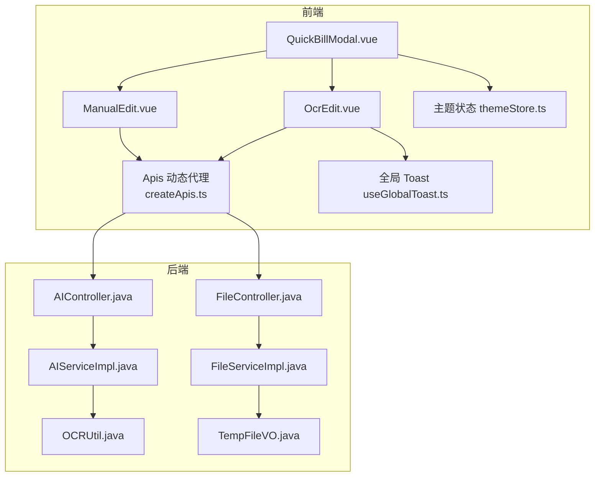
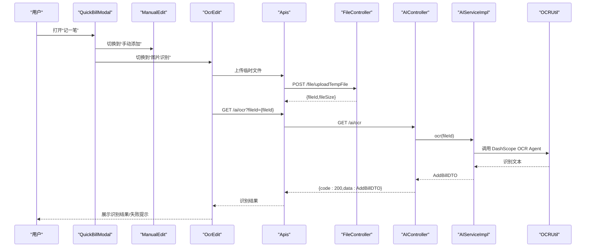
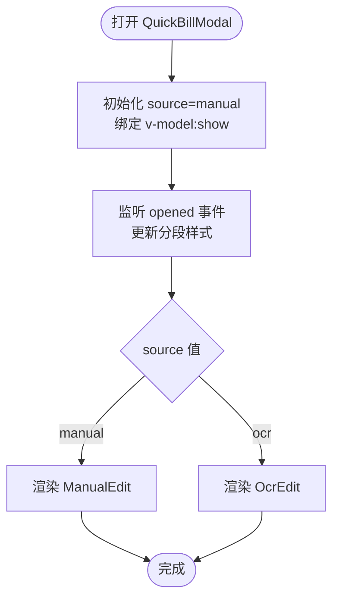
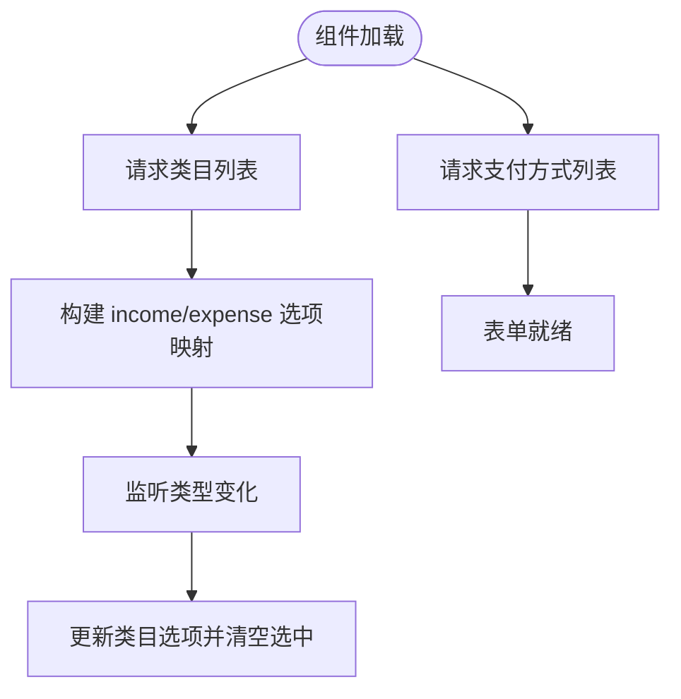
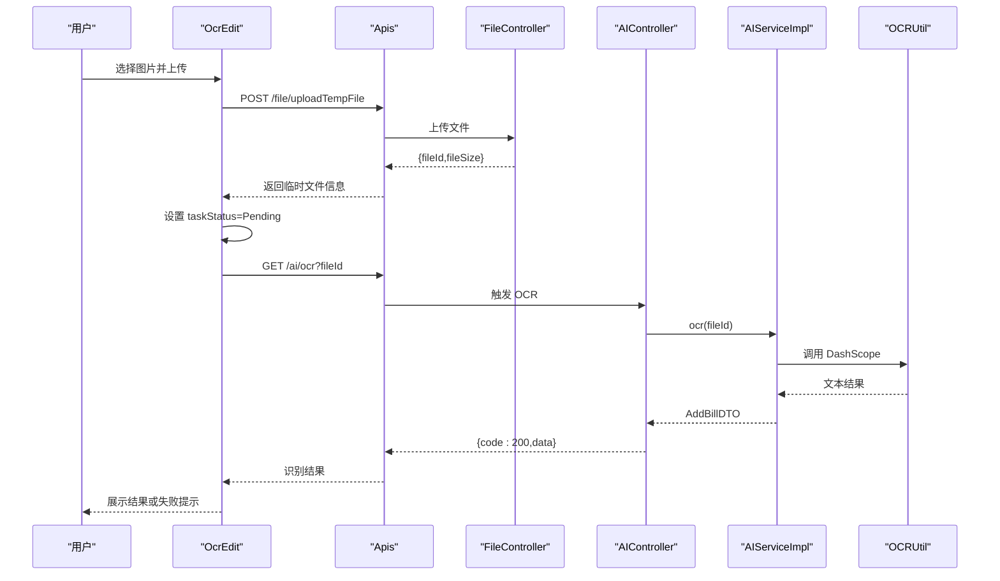
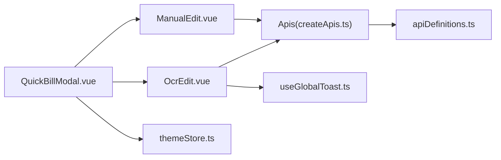

# 业务组件

<cite>
**本文引用的文件**
- [QuickBillModal.vue](file://chuan-bill-app/src/pages/bill/components/QuickBillModal.vue)
- [ManualEdit.vue](file://chuan-bill-app/src/pages/bill/components/ManualEdit.vue)
- [OcrEdit.vue](file://chuan-bill-app/src/pages/bill/components/OcrEdit.vue)
- [index.vue](file://chuan-bill-app/src/pages/bill/index.vue)
- [index.ts](file://chuan-bill-app/src/api/index.ts)
- [createApis.ts](file://chuan-bill-app/src/api/createApis.ts)
- [apiDefinitions.ts](file://chuan-bill-app/src/api/apiDefinitions.ts)
- [globals.d.ts](file://chuan-bill-app/src/api/globals.d.ts)
- [useGlobalToast.ts](file://chuan-bill-app/src/composables/useGlobalToast.ts)
- [themeStore.ts](file://chuan-bill-app/src/store/themeStore.ts)
- [AIController.java](file://chuan-bill-server/src/main/java/com/samoy/chuanbillserver/controller/AIController.java)
- [AIServiceImpl.java](file://chuan-bill-server/src/main/java/com/samoy/chuanbillserver/service/impl/AIServiceImpl.java)
- [OCRUtil.java](file://chuan-bill-server/src/main/java/com/samoy/chuanbillserver/utils/OCRUtil.java)
- [FileController.java](file://chuan-bill-server/src/main/java/com/samoy/chuanbillserver/controller/FileController.java)
- [FileServiceImpl.java](file://chuan-bill-server/src/main/java/com/samoy/chuanbillserver/service/impl/FileServiceImpl.java)
- [IFileService.java](file://chuan-bill-server/src/main/java/com/samoy/chuanbillserver/service/IFileService.java)
- [TempFileVO.java](file://chuan-bill-server/src/main/java/com/samoy/chuanbillserver/vo/TempFileVO.java)
</cite>

## 目录
1. [简介](#简介)
2. [项目结构](#项目结构)
3. [核心组件](#核心组件)
4. [架构总览](#架构总览)
5. [组件详细分析](#组件详细分析)
6. [依赖关系分析](#依赖关系分析)
7. [性能考量](#性能考量)
8. [故障排查指南](#故障排查指南)
9. [结论](#结论)
10. [附录](#附录)

## 简介
本文件面向“小川记账”业务中的三个核心组件：QuickBillModal 快速记账模态框、ManualEdit 手动编辑组件、OcrEdit OCR 识别组件。文档从设计与实现角度出发，系统阐述各组件的业务逻辑、数据流、错误处理、属性配置、事件处理、状态管理与生命周期使用方法，并给出与 API 层的交互模式、与全局状态的集成方式以及用户体验优化策略。

## 项目结构
- 组件位于账单页面目录，QuickBillModal 作为入口容器，内部按“手动/OCR”两种来源切换 ManualEdit 和 OcrEdit。
- API 通过 Alova 动态代理生成 Apis 对象，统一管理后端接口。
- 服务端提供文件上传、OCR 识别等能力，返回临时文件 ID 以驱动前端识别任务。

**图表来源**
- [QuickBillModal.vue:1-64](file://chuan-bill-app/src/pages/bill/components/QuickBillModal.vue#L1-L64)
- [ManualEdit.vue:1-174](file://chuan-bill-app/src/pages/bill/components/ManualEdit.vue#L1-L174)
- [OcrEdit.vue:1-167](file://chuan-bill-app/src/pages/bill/components/OcrEdit.vue#L1-L167)
- [createApis.ts:65-72](file://chuan-bill-app/src/api/createApis.ts#L65-L72)
- [index.vue:1-54](file://chuan-bill-app/src/pages/bill/index.vue#L1-L54)
- [themeStore.ts:10-75](file://chuan-bill-app/src/store/themeStore.ts#L10-L75)
- [useGlobalToast.ts:13-62](file://chuan-bill-app/src/composables/useGlobalToast.ts#L13-L62)
- [FileController.java:21-25](file://chuan-bill-server/src/main/java/com/samoy/chuanbillserver/controller/FileController.java#L21-L25)
- [AIController.java:20-24](file://chuan-bill-server/src/main/java/com/samoy/chuanbillserver/controller/AIController.java#L20-L24)
- [AIServiceImpl.java:27-50](file://chuan-bill-server/src/main/java/com/samoy/chuanbillserver/service/impl/AIServiceImpl.java#L27-L50)
- [OCRUtil.java:22-35](file://chuan-bill-server/src/main/java/com/samoy/chuanbillserver/utils/OCRUtil.java#L22-L35)
- [FileServiceImpl.java:21-41](file://chuan-bill-server/src/main/java/com/samoy/chuanbillserver/service/impl/FileServiceImpl.java#L21-L41)
- [TempFileVO.java:8-13](file://chuan-bill-server/src/main/java/com/samoy/chuanbillserver/vo/TempFileVO.java#L8-L13)

**章节来源**
- [index.vue:1-54](file://chuan-bill-app/src/pages/bill/index.vue#L1-L54)
- [QuickBillModal.vue:1-64](file://chuan-bill-app/src/pages/bill/components/QuickBillModal.vue#L1-L64)

## 核心组件
- QuickBillModal 快速记账模态框：提供底部弹起的动作面板，内含“手动添加/图片识别/语音识别”三段式选择器，动态渲染 ManualEdit 或 OcrEdit 子组件。
- ManualEdit 手动编辑组件：封装账单表单，包括收支类型、金额、名称、时间、类目、支付方式、共享家庭、备注等字段，加载时拉取类目与支付方式列表，支持联动更新。
- OcrEdit OCR 识别组件：负责图片上传、识别任务启动、结果展示与失败重试，使用全局 Toast 提示上传与识别状态。

**章节来源**
- [QuickBillModal.vue:1-64](file://chuan-bill-app/src/pages/bill/components/QuickBillModal.vue#L1-L64)
- [ManualEdit.vue:1-174](file://chuan-bill-app/src/pages/bill/components/ManualEdit.vue#L1-L174)
- [OcrEdit.vue:1-167](file://chuan-bill-app/src/pages/bill/components/OcrEdit.vue#L1-L167)

## 架构总览
- 前端通过 Apis 动态代理访问后端接口，接口定义来自 apiDefinitions，运行时由 createApis 生成 Apis 对象。
- QuickBillModal 作为页面级容器，承载 ManualEdit 与 OcrEdit 的切换与状态。
- ManualEdit 在加载时异步获取类目与支付方式列表，形成本地映射，用于表单联动。
- OcrEdit 通过上传临时文件获得 fileId，再调用 AI 接口触发 OCR 识别，识别成功后返回 AddBillDTO 类型数据。

**图表来源**
- [QuickBillModal.vue:25-52](file://chuan-bill-app/src/pages/bill/components/QuickBillModal.vue#L25-L52)
- [OcrEdit.vue:27-69](file://chuan-bill-app/src/pages/bill/components/OcrEdit.vue#L27-L69)
- [createApis.ts:65-72](file://chuan-bill-app/src/api/createApis.ts#L65-L72)
- [apiDefinitions.ts:23-36](file://chuan-bill-app/src/api/apiDefinitions.ts#L23-L36)
- [FileController.java:21-25](file://chuan-bill-server/src/main/java/com/samoy/chuanbillserver/controller/FileController.java#L21-L25)
- [AIController.java:20-24](file://chuan-bill-server/src/main/java/com/samoy/chuanbillserver/controller/AIController.java#L20-L24)
- [AIServiceImpl.java:27-50](file://chuan-bill-server/src/main/java/com/samoy/chuanbillserver/service/impl/AIServiceImpl.java#L27-L50)
- [OCRUtil.java:22-35](file://chuan-bill-server/src/main/java/com/samoy/chuanbillserver/utils/OCRUtil.java#L22-L35)

## 组件详细分析

### QuickBillModal 快速记账模态框
- 设计要点
  - 使用动作面板从底部弹出，标题为“记一笔”，禁用点击遮罩关闭。
  - 顶部使用分段选择器切换“手动添加/图片识别/语音识别”，默认值为“手动添加”。
  - 内容区根据 source 渲染 ManualEdit 或 OcrEdit。
- 数据绑定与状态
  - 通过 v-model:show 控制显示隐藏，内部维护 source 状态。
  - 通过 ref 引用分段组件，打开时更新活动样式。
- 生命周期与事件
  - opened 事件用于初始化分段样式。
- 与 ManualEdit/OcrEdit 的集成
  - 作为父容器，负责子组件的切换与复用。

**图表来源**
- [QuickBillModal.vue:25-52](file://chuan-bill-app/src/pages/bill/components/QuickBillModal.vue#L25-L52)

**章节来源**
- [QuickBillModal.vue:1-64](file://chuan-bill-app/src/pages/bill/components/QuickBillModal.vue#L1-L64)
- [index.vue:40-42](file://chuan-bill-app/src/pages/bill/index.vue#L40-L42)

### ManualEdit 手动编辑组件
- 表单字段与数据模型
  - 收支类型：expense/income，默认 expense。
  - 金额：数字输入，支持小数点。
  - 名称：文本输入，最大长度 100。
  - 时间：日期时间选择器，默认当前时间。
  - 类目：根据类型动态切换选项。
  - 支付方式：独立选择。
  - 共享到家庭：开关控制，开启后显示家庭选择。
  - 备注：多行文本，最大长度 500。
- 数据加载与联动
  - onLoad 生命周期中拉取类目列表与支付方式列表，构建 income/expense 两类选项映射。
  - watch 监听类型变化，同步更新类目选项并清空类目选中值。
- API 交互
  - 类目列表：GET /bill/categories
  - 支付方式列表：GET /bill/payment-methods
- 错误处理
  - 未在组件内显式处理接口异常，建议在调用处统一捕获并提示。

**图表来源**
- [ManualEdit.vue:31-66](file://chuan-bill-app/src/pages/bill/components/ManualEdit.vue#L31-L66)

**章节来源**
- [ManualEdit.vue:1-174](file://chuan-bill-app/src/pages/bill/components/ManualEdit.vue#L1-L174)
- [apiDefinitions.ts:32-35](file://chuan-bill-app/src/api/apiDefinitions.ts#L32-L35)

### OcrEdit OCR 识别组件
- 上传与识别流程
  - 上传临时文件：POST /file/uploadTempFile，返回临时文件信息（含 fileId）。
  - 启动识别：GET /ai/ocr?fileId={fileId}，返回识别结果 AddBillDTO。
  - 识别状态枚举：Init/Pending/Success/Failed。
- UI 与交互
  - 上传区域支持点击上传，限制为图片且仅一张。
  - 上传成功后进入“识别中”动画，显示扫描线效果。
  - 识别失败时提供“重试”和“手动输入”按钮。
  - 使用全局 Toast 提示上传失败。
- 错误处理
  - 上传失败：toast.error 并保持初始状态。
  - 识别失败：设置状态为 Failed，允许用户重试或转手动输入。
- 与全局状态/主题的集成
  - 通过 useGlobalToast 获取 toast 实例，统一提示风格。
  - 通过 themeStore 获取系统主题，配合暗色模式样式。

**图表来源**
- [OcrEdit.vue:27-69](file://chuan-bill-app/src/pages/bill/components/OcrEdit.vue#L27-L69)
- [apiDefinitions.ts:23-36](file://chuan-bill-app/src/api/apiDefinitions.ts#L23-L36)
- [FileController.java:21-25](file://chuan-bill-server/src/main/java/com/samoy/chuanbillserver/controller/FileController.java#L21-L25)
- [AIController.java:20-24](file://chuan-bill-server/src/main/java/com/samoy/chuanbillserver/controller/AIController.java#L20-L24)
- [AIServiceImpl.java:27-50](file://chuan-bill-server/src/main/java/com/samoy/chuanbillserver/service/impl/AIServiceImpl.java#L27-L50)
- [OCRUtil.java:22-35](file://chuan-bill-server/src/main/java/com/samoy/chuanbillserver/utils/OCRUtil.java#L22-L35)

**章节来源**
- [OcrEdit.vue:1-167](file://chuan-bill-app/src/pages/bill/components/OcrEdit.vue#L1-L167)
- [useGlobalToast.ts:13-62](file://chuan-bill-app/src/composables/useGlobalToast.ts#L13-L62)
- [themeStore.ts:10-75](file://chuan-bill-app/src/store/themeStore.ts#L10-L75)

## 依赖关系分析
- 组件间耦合
  - QuickBillModal 与 ManualEdit/OcrEdit 为组合关系，无直接依赖，通过 props 控制显示。
  - ManualEdit 与 OcrEdit 独立，均依赖 Apis 进行后端通信。
- 外部依赖
  - Apis 动态代理：基于 apiDefinitions 与 createApis 生成方法签名，确保类型安全与调用一致性。
  - 全局 Toast：统一错误与成功提示，避免重复实现。
  - 主题状态：useThemeStore 提供系统主题检测与切换能力，影响组件样式。
- 潜在循环依赖
  - 组件之间无循环导入；API 层与 UI 层通过 Apis 解耦。

**图表来源**
- [QuickBillModal.vue:1-23](file://chuan-bill-app/src/pages/bill/components/QuickBillModal.vue#L1-L23)
- [ManualEdit.vue:1-10](file://chuan-bill-app/src/pages/bill/components/ManualEdit.vue#L1-L10)
- [OcrEdit.vue:1-11](file://chuan-bill-app/src/pages/bill/components/OcrEdit.vue#L1-L11)
- [createApis.ts:65-72](file://chuan-bill-app/src/api/createApis.ts#L65-L72)
- [apiDefinitions.ts:19-37](file://chuan-bill-app/src/api/apiDefinitions.ts#L19-L37)
- [useGlobalToast.ts:13-62](file://chuan-bill-app/src/composables/useGlobalToast.ts#L13-L62)
- [themeStore.ts:10-75](file://chuan-bill-app/src/store/themeStore.ts#L10-L75)

**章节来源**
- [createApis.ts:65-72](file://chuan-bill-app/src/api/createApis.ts#L65-L72)
- [apiDefinitions.ts:19-37](file://chuan-bill-app/src/api/apiDefinitions.ts#L19-L37)

## 性能考量
- 图片上传与识别
  - 上传前建议对图片尺寸与格式做预检，减少无效请求与服务器压力。
  - 识别过程为异步，UI 应提供明确的加载反馈与取消能力（如需）。
- 表单渲染
  - ManualEdit 的 picker 选项在加载完成后一次性构建，避免频繁渲染。
- 状态管理
  - 使用 Pinia 管理 Toast 与主题，避免全局污染。
- 缓存与复用
  - QuickBillModal 作为容器，复用 ManualEdit/OcrEdit，减少重复实例化成本。

## 故障排查指南
- 上传失败
  - 现象：OcrEdit 上传后立即提示失败。
  - 排查：检查上传接口返回结构与 token 配置；确认临时文件目录权限与大小限制。
  - 参考
    - [OcrEdit.vue:51-69](file://chuan-bill-app/src/pages/bill/components/OcrEdit.vue#L51-L69)
    - [FileController.java:21-25](file://chuan-bill-server/src/main/java/com/samoy/chuanbillserver/controller/FileController.java#L21-L25)
    - [FileServiceImpl.java:21-41](file://chuan-bill-server/src/main/java/com/samoy/chuanbillserver/service/impl/FileServiceImpl.java#L21-L41)
- 识别失败
  - 现象：识别状态变为失败，出现重试按钮。
  - 排查：确认 fileId 是否存在、DashScope API Key 与 appId 配置正确、网络连通性。
  - 参考
    - [OcrEdit.vue:27-49](file://chuan-bill-app/src/pages/bill/components/OcrEdit.vue#L27-L49)
    - [AIController.java:20-24](file://chuan-bill-server/src/main/java/com/samoy/chuanbillserver/controller/AIController.java#L20-L24)
    - [AIServiceImpl.java:27-50](file://chuan-bill-server/src/main/java/com/samoy/chuanbillserver/service/impl/AIServiceImpl.java#L27-L50)
    - [OCRUtil.java:16-20](file://chuan-bill-server/src/main/java/com/samoy/chuanbillserver/utils/OCRUtil.java#L16-L20)
- 类目/支付方式为空
  - 现象：ManualEdit 中类目或支付方式列表为空。
  - 排查：确认接口返回结构与字段名一致；检查网络与鉴权。
  - 参考
    - [ManualEdit.vue:31-66](file://chuan-bill-app/src/pages/bill/components/ManualEdit.vue#L31-L66)
    - [apiDefinitions.ts:32-35](file://chuan-bill-app/src/api/apiDefinitions.ts#L32-L35)

**章节来源**
- [OcrEdit.vue:51-69](file://chuan-bill-app/src/pages/bill/components/OcrEdit.vue#L51-L69)
- [FileController.java:21-25](file://chuan-bill-server/src/main/java/com/samoy/chuanbillserver/controller/FileController.java#L21-L25)
- [FileServiceImpl.java:21-41](file://chuan-bill-server/src/main/java/com/samoy/chuanbillserver/service/impl/FileServiceImpl.java#L21-L41)
- [AIController.java:20-24](file://chuan-bill-server/src/main/java/com/samoy/chuanbillserver/controller/AIController.java#L20-L24)
- [AIServiceImpl.java:27-50](file://chuan-bill-server/src/main/java/com/samoy/chuanbillserver/service/impl/AIServiceImpl.java#L27-L50)
- [OCRUtil.java:16-20](file://chuan-bill-server/src/main/java/com/samoy/chuanbillserver/utils/OCRUtil.java#L16-L20)
- [ManualEdit.vue:31-66](file://chuan-bill-app/src/pages/bill/components/ManualEdit.vue#L31-L66)
- [apiDefinitions.ts:32-35](file://chuan-bill-app/src/api/apiDefinitions.ts#L32-L35)

## 结论
QuickBillModal、ManualEdit、OcrEdit 三者协同构成“快速记账”的完整体验：容器负责入口与切换，手动编辑提供可控的精确录入，OCR 识别提供便捷的智能录入。通过 Alova 动态代理与后端接口解耦，结合全局 Toast 与主题状态，既保证了开发效率也提升了用户体验。后续可在上传预检、识别超时与重试策略、表单校验增强等方面进一步完善。

## 附录

### 组件属性、事件与生命周期使用清单
- QuickBillModal
  - 属性：v-model:show（布尔），source（字符串，manual/ocr/voice）
  - 事件：opened（用于初始化分段样式）
  - 生命周期：opened
  - 参考
    - [QuickBillModal.vue:21-28](file://chuan-bill-app/src/pages/bill/components/QuickBillModal.vue#L21-L28)
- ManualEdit
  - 表单字段：type、amount、name、time、categoryId、paymentMethodId、isShared、familyId、remark
  - 生命周期：onLoad（加载类目与支付方式）
  - 事件：watch(type)
  - 参考
    - [ManualEdit.vue:23-66](file://chuan-bill-app/src/pages/bill/components/ManualEdit.vue#L23-L66)
- OcrEdit
  - 属性：action（上传地址）、fileList、headers（token）
  - 事件：@success（上传成功回调）
  - 生命周期：无
  - 参考
    - [OcrEdit.vue:20-86](file://chuan-bill-app/src/pages/bill/components/OcrEdit.vue#L20-L86)

### API 定义与类型参考
- 接口定义
  - file.uploadTempFile：POST /file/uploadTempFile
  - ai.ocr：GET /ai/ocr?fileId={fileId}
  - bill.getCategories：GET /bill/categories
  - bill.getPaymentMethods：GET /bill/payment-methods
  - 参考
    - [apiDefinitions.ts:23-36](file://chuan-bill-app/src/api/apiDefinitions.ts#L23-L36)
- 类型定义
  - AddBillDTO、TempFileVO、ResultTempFileVO 等
  - 参考
    - [globals.d.ts:889-932](file://chuan-bill-app/src/api/globals.d.ts#L889-L932)
    - [globals.d.ts:760-784](file://chuan-bill-app/src/api/globals.d.ts#L760-L784)
    - [TempFileVO.java:8-13](file://chuan-bill-server/src/main/java/com/samoy/chuanbillserver/vo/TempFileVO.java#L8-L13)

### 集成指南
- 在页面中引入 QuickBillModal，并通过 v-model:show 控制显示。
- ManualEdit 与 OcrEdit 由 QuickBillModal 内部按 source 切换，无需额外传参。
- 全局 Toast 与主题状态已在组件中使用，确保样式与提示一致。
- 参考
  - [index.vue:40-42](file://chuan-bill-app/src/pages/bill/index.vue#L40-L42)
  - [useGlobalToast.ts:13-62](file://chuan-bill-app/src/composables/useGlobalToast.ts#L13-L62)
  - [themeStore.ts:10-75](file://chuan-bill-app/src/store/themeStore.ts#L10-L75)