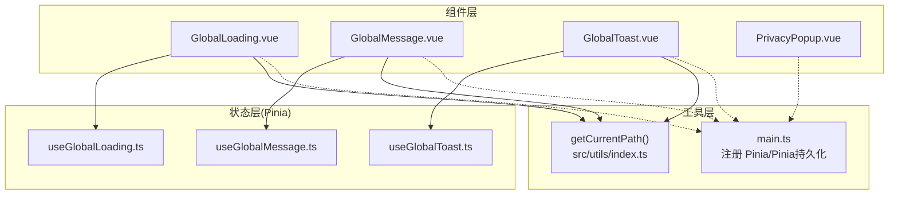
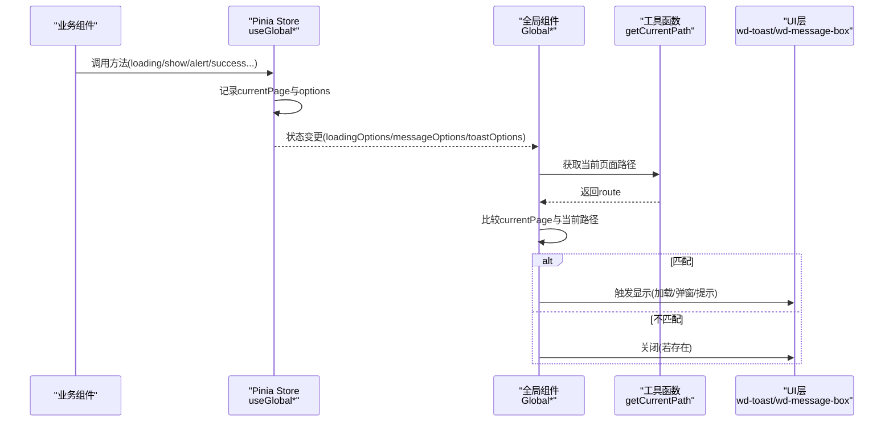
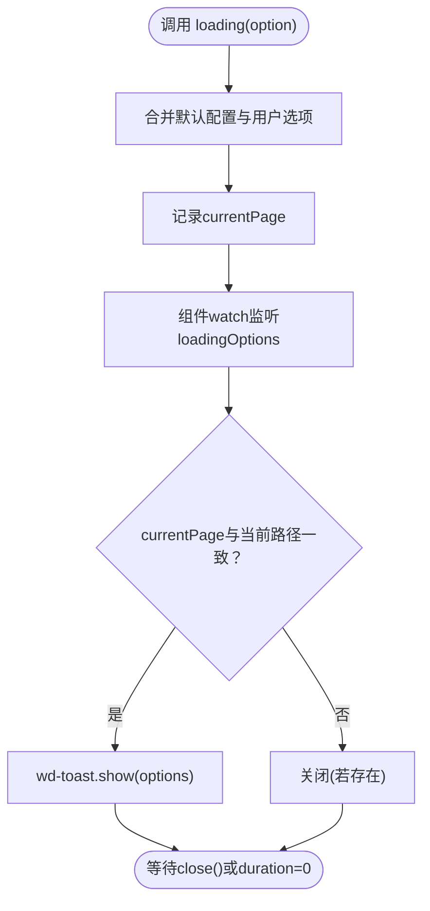
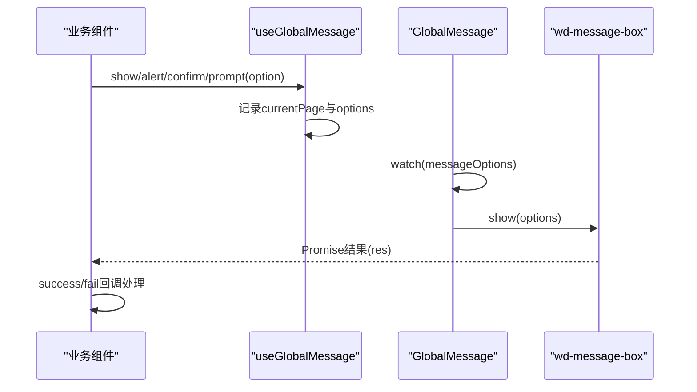
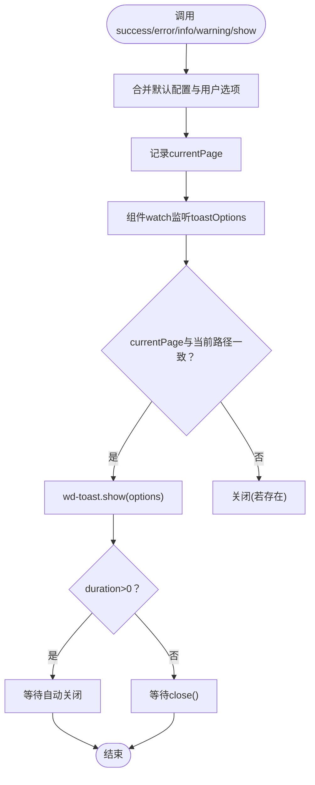
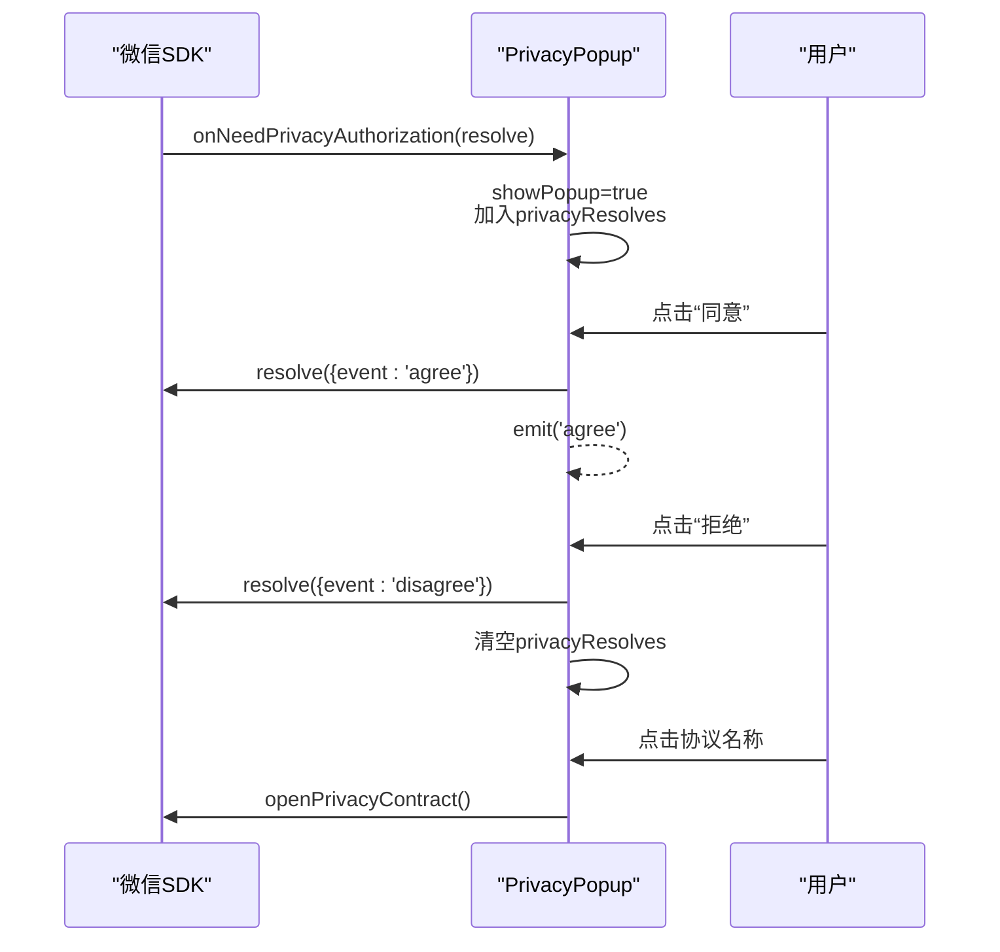
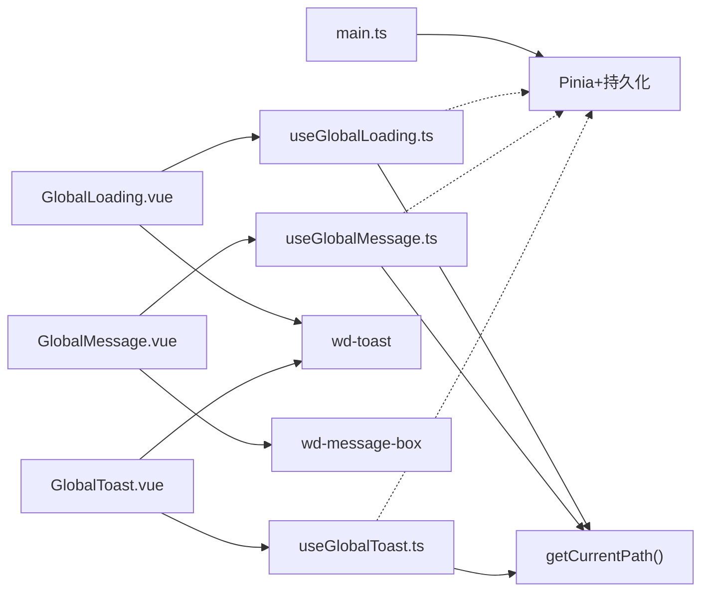

# 全局组件

<cite>
**本文引用的文件**   
- [GlobalLoading.vue](file://chuan-bill-app/src/components/GlobalLoading.vue)
- [GlobalMessage.vue](file://chuan-bill-app/src/components/GlobalMessage.vue)
- [GlobalToast.vue](file://chuan-bill-app/src/components/GlobalToast.vue)
- [PrivacyPopup.vue](file://chuan-bill-app/src/components/PrivacyPopup.vue)
- [useGlobalLoading.ts](file://chuan-bill-app/src/composables/useGlobalLoading.ts)
- [useGlobalMessage.ts](file://chuan-bill-app/src/composables/useGlobalMessage.ts)
- [useGlobalToast.ts](file://chuan-bill-app/src/composables/useGlobalToast.ts)
- [GlobalLoading.md](file://chuan-bill-app/src/components/GlobalLoading.md)
- [GlobalMessage.md](file://chuan-bill-app/src/components/GlobalMessage.md)
- [GlobalToast.md](file://chuan-bill-app/src/components/GlobalToast.md)
- [index.ts](file://chuan-bill-app/src/utils/index.ts)
- [main.ts](file://chuan-bill-app/src/main.ts)
</cite>

## 目录
1. [简介](#简介)
2. [项目结构](#项目结构)
3. [核心组件](#核心组件)
4. [架构总览](#架构总览)
5. [详细组件分析](#详细组件分析)
6. [依赖关系分析](#依赖关系分析)
7. [性能考量](#性能考量)
8. [故障排查指南](#故障排查指南)
9. [结论](#结论)
10. [附录](#附录)

## 简介
本文件系统性梳理“小川记账”小程序中的四大全局组件：GlobalLoading 加载组件、GlobalMessage 消息提示组件、GlobalToast 轻提示组件、PrivacyPopup 隐私弹窗组件。围绕设计理念、实现细节、状态管理、动画与交互、样式定制、使用示例与最佳实践展开，并给出性能优化建议与常见问题排查思路，帮助开发者在复杂业务场景下稳定、高效地使用这些组件。

## 项目结构
四大全局组件位于应用源代码目录的 components 与 composables 子目录中，配合 Pinia 状态管理与 wot-design-uni 基础组件实现统一的全局提示与交互体验。组件均采用虚拟节点与样式共享策略，确保在不同页面按需渲染且不影响常规 DOM 层级。

图表来源
- [GlobalLoading.vue:1-47](file://chuan-bill-app/src/components/GlobalLoading.vue#L1-L47)
- [GlobalMessage.vue:1-56](file://chuan-bill-app/src/components/GlobalMessage.vue#L1-L56)
- [GlobalToast.vue:1-47](file://chuan-bill-app/src/components/GlobalToast.vue#L1-L47)
- [PrivacyPopup.vue:1-174](file://chuan-bill-app/src/components/PrivacyPopup.vue#L1-L174)
- [useGlobalLoading.ts:1-38](file://chuan-bill-app/src/composables/useGlobalLoading.ts#L1-L38)
- [useGlobalMessage.ts:1-53](file://chuan-bill-app/src/composables/useGlobalMessage.ts#L1-L53)
- [useGlobalToast.ts:1-62](file://chuan-bill-app/src/composables/useGlobalToast.ts#L1-L62)
- [index.ts:5-9](file://chuan-bill-app/src/utils/index.ts#L5-L9)
- [main.ts:6-11](file://chuan-bill-app/src/main.ts#L6-L11)

章节来源
- [GlobalLoading.vue:1-47](file://chuan-bill-app/src/components/GlobalLoading.vue#L1-L47)
- [GlobalMessage.vue:1-56](file://chuan-bill-app/src/components/GlobalMessage.vue#L1-L56)
- [GlobalToast.vue:1-47](file://chuan-bill-app/src/components/GlobalToast.vue#L1-L47)
- [PrivacyPopup.vue:1-174](file://chuan-bill-app/src/components/PrivacyPopup.vue#L1-L174)
- [useGlobalLoading.ts:1-38](file://chuan-bill-app/src/composables/useGlobalLoading.ts#L1-L38)
- [useGlobalMessage.ts:1-53](file://chuan-bill-app/src/composables/useGlobalMessage.ts#L1-L53)
- [useGlobalToast.ts:1-62](file://chuan-bill-app/src/composables/useGlobalToast.ts#L1-L62)
- [index.ts:5-9](file://chuan-bill-app/src/utils/index.ts#L5-L9)
- [main.ts:6-11](file://chuan-bill-app/src/main.ts#L6-L11)

## 核心组件
- GlobalLoading：基于 wd-toast 的全局加载组件，通过 Pinia 管理加载状态，支持遮罩覆盖、中间显示、不自动关闭等特性，适用于网络请求、批量处理等场景。
- GlobalMessage：基于 wd-message-box 的全局弹窗组件，支持 alert/confirm/prompt 三类交互，提供成功/失败回调与 Promise 链式处理，适合确认、提醒、输入等交互。
- GlobalToast：基于 wd-toast 的全局轻提示组件，提供 success/error/info/warning 快捷方法，支持自定义图标、位置、时长，适合操作反馈与状态提示。
- PrivacyPopup：隐私弹窗组件，负责展示用户协议、处理同意/拒绝、与微信隐私授权事件联动，提供 openPrivacyContract 调用与事件回调。

章节来源
- [GlobalLoading.vue:1-47](file://chuan-bill-app/src/components/GlobalLoading.vue#L1-L47)
- [GlobalMessage.vue:1-56](file://chuan-bill-app/src/components/GlobalMessage.vue#L1-L56)
- [GlobalToast.vue:1-47](file://chuan-bill-app/src/components/GlobalToast.vue#L1-L47)
- [PrivacyPopup.vue:1-174](file://chuan-bill-app/src/components/PrivacyPopup.vue#L1-L174)
- [useGlobalLoading.ts:1-38](file://chuan-bill-app/src/composables/useGlobalLoading.ts#L1-L38)
- [useGlobalMessage.ts:1-53](file://chuan-bill-app/src/composables/useGlobalMessage.ts#L1-L53)
- [useGlobalToast.ts:1-62](file://chuan-bill-app/src/composables/useGlobalToast.ts#L1-L62)

## 架构总览
四大全局组件通过各自的 Pinia Store 管理状态，组件在挂载后监听状态变化并在当前页面路径匹配时触发对应 UI 动作。工具函数 getCurrentPath 提供页面路径检测，确保组件只在目标页面显示，避免跨页冲突。

图表来源
- [useGlobalLoading.ts:13-37](file://chuan-bill-app/src/composables/useGlobalLoading.ts#L13-L37)
- [useGlobalMessage.ts:14-52](file://chuan-bill-app/src/composables/useGlobalMessage.ts#L14-L52)
- [useGlobalToast.ts:13-61](file://chuan-bill-app/src/composables/useGlobalToast.ts#L13-L61)
- [GlobalLoading.vue:17-26](file://chuan-bill-app/src/components/GlobalLoading.vue#L17-L26)
- [GlobalMessage.vue:17-35](file://chuan-bill-app/src/components/GlobalMessage.vue#L17-L35)
- [GlobalToast.vue:17-26](file://chuan-bill-app/src/components/GlobalToast.vue#L17-L26)
- [index.ts:5-9](file://chuan-bill-app/src/utils/index.ts#L5-L9)

## 详细组件分析

### GlobalLoading 加载组件
- 设计理念
  - 单例模式：同一时刻仅显示一个加载状态，新的调用会覆盖旧的。
  - 页面隔离：通过 currentPage 与 getCurrentPath 检测，确保只在目标页面显示。
  - 遮罩覆盖：默认启用遮罩，防止用户误触。
- 状态管理
  - Store 状态：loadingOptions（加载配置）、currentPage（当前页面路径）。
  - 默认配置：iconName='loading'、duration=0（不自动关闭）、cover=true、position='middle'、show=true。
- 动画与交互
  - 基于 wd-toast 的 loading 图标，旋转动画。
  - 支持字符串或完整选项对象调用。
- 使用场景
  - 数据加载、表单提交、文件上传、批量处理、页面跳转前准备。
- props 与事件
  - 组件本身无外部 props，通过 Store 的 loadingOptions 驱动显示。
  - 关闭事件：通过 closed 回调与 useGlobalLoading.close 配合。
- 样式定制
  - 通过 wd-toast 的样式体系与 shared 样式隔离策略生效。
- 最佳实践
  - 使用 try-finally 确保 close() 总能执行。
  - 对重要操作开启 cover，对轻量操作可关闭以提升可用性。
  - 长时间操作提供进度文案更新。
- 性能建议
  - 避免嵌套调用；合并多次操作为一次加载。
  - 避免频繁切换页面导致的重复渲染。

图表来源
- [useGlobalLoading.ts:21-35](file://chuan-bill-app/src/composables/useGlobalLoading.ts#L21-L35)
- [GlobalLoading.vue:17-26](file://chuan-bill-app/src/components/GlobalLoading.vue#L17-L26)

章节来源
- [GlobalLoading.vue:1-47](file://chuan-bill-app/src/components/GlobalLoading.vue#L1-L47)
- [useGlobalLoading.ts:1-38](file://chuan-bill-app/src/composables/useGlobalLoading.ts#L1-L38)
- [GlobalLoading.md:1-367](file://chuan-bill-app/src/components/GlobalLoading.md#L1-L367)
- [index.ts:5-9](file://chuan-bill-app/src/utils/index.ts#L5-L9)

### GlobalMessage 消息提示组件
- 设计理念
  - 三类交互：alert（提醒）、confirm（确认）、prompt（输入）。
  - 回调与 Promise 双通道：success/fail 回调与 Promise 链式处理。
  - 页面隔离：仅在目标页面显示，切换页面自动关闭。
- 状态管理
  - Store 状态：messageOptions（弹窗配置）、currentPage（当前页面路径）。
  - 默认按钮为非圆角样式，便于统一风格。
- 交互行为
  - alert：仅确认按钮，适合信息提醒。
  - confirm：确认/取消按钮，适合危险操作。
  - prompt：带输入框的确认/取消，适合快速编辑。
- 使用场景
  - 删除确认、批量操作、表单提交前确认、安全验证、流程控制。
- props 与事件
  - 组件无外部 props，通过 Store 的 messageOptions 驱动显示。
  - 支持 success/fail 回调与 Promise 结果对象。
- 样式定制
  - 通过 wd-message-box 的样式体系与 shared 样式隔离策略生效。
- 最佳实践
  - 明确标题与内容，避免模糊表述。
  - prompt 类型务必校验输入。
  - 在回调中进行异步操作时做好错误处理。
- 性能建议
  - 避免在同一页面连续弹出多个弹窗。
  - 与 GlobalLoading/GlobalToast 协同使用，形成统一的交互节奏。

图表来源
- [useGlobalMessage.ts:19-51](file://chuan-bill-app/src/composables/useGlobalMessage.ts#L19-L51)
- [GlobalMessage.vue:17-35](file://chuan-bill-app/src/components/GlobalMessage.vue#L17-L35)

章节来源
- [GlobalMessage.vue:1-56](file://chuan-bill-app/src/components/GlobalMessage.vue#L1-L56)
- [useGlobalMessage.ts:1-53](file://chuan-bill-app/src/composables/useGlobalMessage.ts#L1-L53)
- [GlobalMessage.md:1-571](file://chuan-bill-app/src/components/GlobalMessage.md#L1-L571)
- [index.ts:5-9](file://chuan-bill-app/src/utils/index.ts#L5-L9)

### GlobalToast 轻提示组件
- 设计理念
  - 快捷方法：success/error/info/warning，内置默认图标与时长。
  - 自定义灵活：支持图标、位置、时长、遮罩等配置。
  - 单例显示：新提示覆盖旧提示，避免堆叠。
- 状态管理
  - Store 状态：toastOptions（提示配置）、currentPage（当前页面路径）。
  - 默认时长 2000ms，位置 middle。
- 交互行为
  - success：默认 1500ms，绿色成功图标。
  - error：默认 vertical 布局，红色错误图标。
  - info/warning：蓝色/黄色图标，可自定义时长与位置。
- 使用场景
  - 操作反馈、状态提示、长文本信息、重要提示（可设为不自动关闭）。
- props 与事件
  - 组件无外部 props，通过 Store 的 toastOptions 驱动显示。
  - 支持 closed 回调与 useGlobalToast.close。
- 样式定制
  - 通过 wd-toast 的样式体系与 shared 样式隔离策略生效。
- 最佳实践
  - 根据消息重要性选择合适类型与时长。
  - 长文本提示适当延长时长或设为手动关闭。
  - 避免短时间内连续调用，必要时合并提示。
- 性能建议
  - 避免频繁切换页面导致的重复渲染。
  - 对高频提示场景考虑节流或去重策略。

图表来源
- [useGlobalToast.ts:21-59](file://chuan-bill-app/src/composables/useGlobalToast.ts#L21-L59)
- [GlobalToast.vue:17-26](file://chuan-bill-app/src/components/GlobalToast.vue#L17-L26)

章节来源
- [GlobalToast.vue:1-47](file://chuan-bill-app/src/components/GlobalToast.vue#L1-L47)
- [useGlobalToast.ts:1-62](file://chuan-bill-app/src/composables/useGlobalToast.ts#L1-L62)
- [GlobalToast.md:1-262](file://chuan-bill-app/src/components/GlobalToast.md#L1-L262)
- [index.ts:5-9](file://chuan-bill-app/src/utils/index.ts#L5-L9)

### PrivacyPopup 隐私弹窗组件
- 设计理念
  - 与微信隐私授权事件联动，拦截 wx.onNeedPrivacyAuthorization。
  - 提供协议打开、同意/拒绝处理与事件回调。
  - 支持自定义标题、描述、协议名称。
- 交互行为
  - 打开隐私协议：wx.openPrivacyContract。
  - 同意：触发 resolve({ event:'agree', ... }) 并发出 agree 事件。
  - 拒绝：触发 resolve({ event:'disagree' }) 并清理队列。
  - 关闭：清理未决的 resolve 队列。
- props 与事件
  - Props：title/desc/subDesc/protocol。
  - Emits：agree/disagree。
- 样式定制
  - 内置基础样式，支持通过 scoped 与全局样式覆盖。
- 最佳实践
  - 在应用启动阶段尽早注册隐私授权监听。
  - 同意后可结合业务逻辑进行数据初始化。
  - 拒绝时应引导用户了解隐私政策的重要性。
- 性能建议
  - 避免在短时间内反复触发隐私授权事件。
  - 保持弹窗最小化渲染，减少不必要的 DOM 更新。

图表来源
- [PrivacyPopup.vue:28-79](file://chuan-bill-app/src/components/PrivacyPopup.vue#L28-L79)

章节来源
- [PrivacyPopup.vue:1-174](file://chuan-bill-app/src/components/PrivacyPopup.vue#L1-L174)

## 依赖关系分析
- 组件与 Store
  - GlobalLoading/GlobalMessage/GlobalToast 分别依赖对应的 useGlobal* Store。
  - Store 管理 options 与 currentPage，组件通过 watch 监听状态变化。
- 组件与工具
  - 三个全局组件均依赖 getCurrentPath 获取当前页面路径，实现页面隔离。
- 组件与 UI 库
  - GlobalLoading/GlobalToast 基于 wd-toast，GlobalMessage 基于 wd-message-box。
- 全局状态管理
  - main.ts 中注册 Pinia 与持久化插件，确保 Store 在应用生命周期内可用。

图表来源
- [GlobalLoading.vue:1-47](file://chuan-bill-app/src/components/GlobalLoading.vue#L1-L47)
- [GlobalMessage.vue:1-56](file://chuan-bill-app/src/components/GlobalMessage.vue#L1-L56)
- [GlobalToast.vue:1-47](file://chuan-bill-app/src/components/GlobalToast.vue#L1-L47)
- [useGlobalLoading.ts:1-38](file://chuan-bill-app/src/composables/useGlobalLoading.ts#L1-L38)
- [useGlobalMessage.ts:1-53](file://chuan-bill-app/src/composables/useGlobalMessage.ts#L1-L53)
- [useGlobalToast.ts:1-62](file://chuan-bill-app/src/composables/useGlobalToast.ts#L1-L62)
- [index.ts:5-9](file://chuan-bill-app/src/utils/index.ts#L5-L9)
- [main.ts:6-11](file://chuan-bill-app/src/main.ts#L6-L11)

章节来源
- [main.ts:6-11](file://chuan-bill-app/src/main.ts#L6-L11)
- [index.ts:5-9](file://chuan-bill-app/src/utils/index.ts#L5-L9)

## 性能考量
- 状态更新与渲染
  - 通过 Pinia 管理状态，组件仅在状态变化且路径匹配时渲染，降低不必要更新。
- 页面隔离
  - getCurrentPath 保证组件仅在目标页面显示，避免跨页渲染与事件干扰。
- 组件复用
  - 三个全局组件均采用虚拟节点与样式共享，减少 DOM 层级与样式计算成本。
- 交互节流
  - 对高频提示与弹窗，建议在业务层做去重与节流，避免 UI 抖动。
- 资源释放
  - 长时间加载与提示需确保 finally 中关闭，防止资源泄漏。

## 故障排查指南
- 加载组件无法关闭
  - 检查是否在 finally 中调用 close()。
  - 确认 currentPage 与当前页面路径一致，否则组件不会关闭。
- 弹窗不显示或显示在错误页面
  - 检查 getCurrentPath 返回值是否正确。
  - 确认调用 show/alert/confirm/prompt 时已记录 currentPage。
- 轻提示覆盖问题
  - 新提示会覆盖旧提示，避免短时间内连续调用。
  - 如需保留历史提示，考虑合并消息或延迟触发。
- 隐私弹窗未触发
  - 确认 wx.onNeedPrivacyAuthorization 是否被注册。
  - 检查 showPopup 与 privacyResolves 队列状态。
- 样式不生效
  - 确认组件 options 中的 styleIsolation 与 addGlobalClass 设置。
  - 检查 scoped 样式优先级与全局样式的覆盖关系。

章节来源
- [GlobalLoading.md:337-344](file://chuan-bill-app/src/components/GlobalLoading.md#L337-L344)
- [GlobalMessage.md:525-541](file://chuan-bill-app/src/components/GlobalMessage.md#L525-L541)
- [GlobalToast.md:256-262](file://chuan-bill-app/src/components/GlobalToast.md#L256-L262)
- [PrivacyPopup.vue:28-79](file://chuan-bill-app/src/components/PrivacyPopup.vue#L28-L79)

## 结论
四大全局组件通过统一的状态管理与页面隔离机制，实现了在不同页面、不同场景下的稳定提示与交互体验。结合最佳实践与性能建议，可在复杂业务中保持界面一致性与用户体验流畅性。建议在项目中规范使用这些组件，并在业务层做好去重、节流与错误处理，以获得更佳的开发与维护效率。

## 附录
- 使用示例与 API 参考详见各组件文档：
  - [GlobalLoading.md:1-367](file://chuan-bill-app/src/components/GlobalLoading.md#L1-L367)
  - [GlobalMessage.md:1-571](file://chuan-bill-app/src/components/GlobalMessage.md#L1-L571)
  - [GlobalToast.md:1-262](file://chuan-bill-app/src/components/GlobalToast.md#L1-L262)