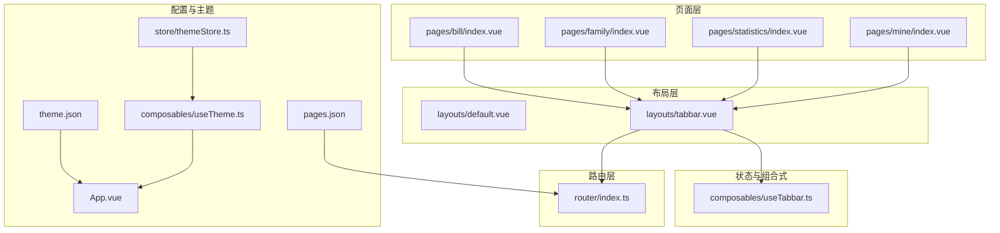
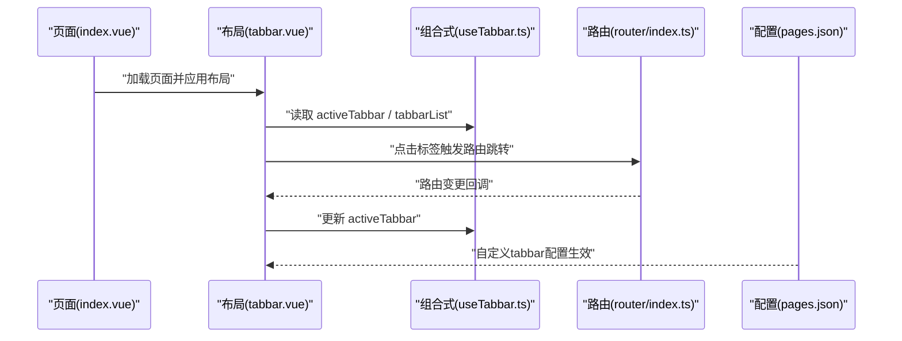
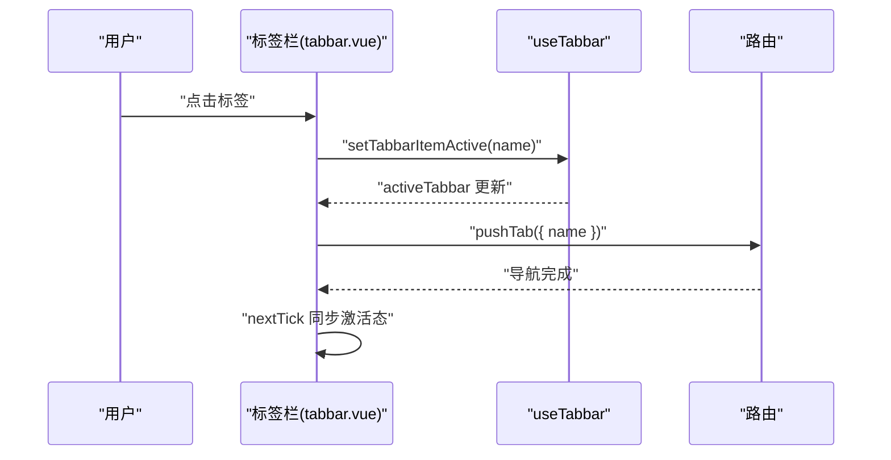
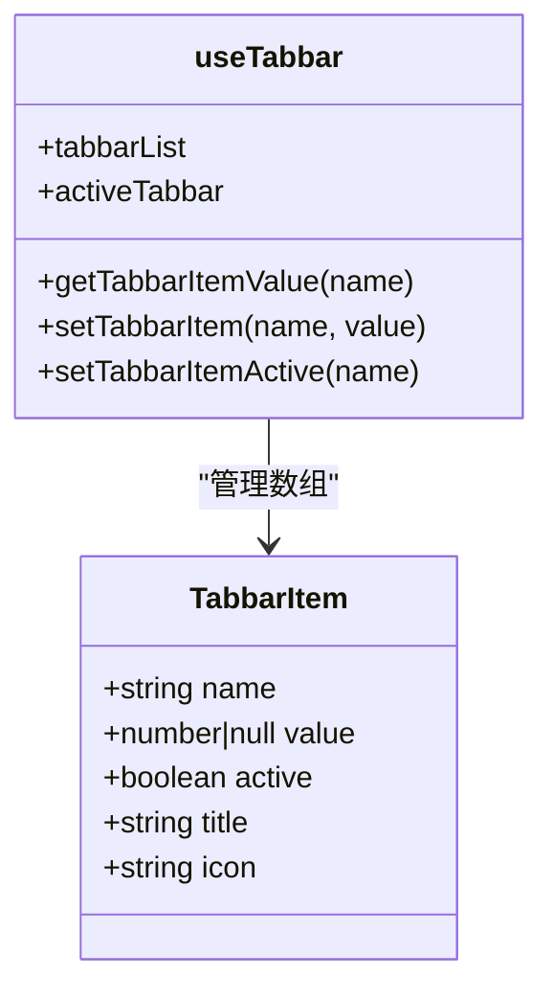
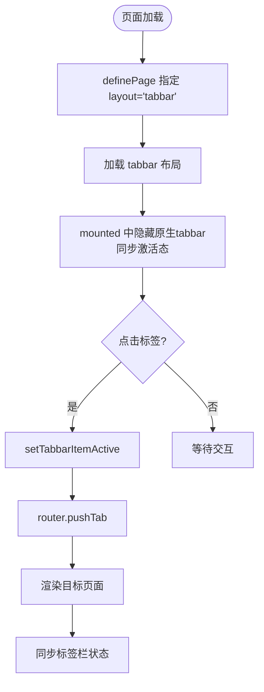
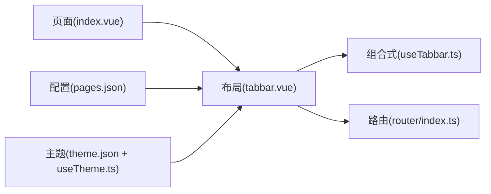

# 布局系统

<cite>
**本文引用的文件**
- [default.vue](file://chuan-bill-app/src/layouts/default.vue)
- [tabbar.vue](file://chuan-bill-app/src/layouts/tabbar.vue)
- [useTabbar.ts](file://chuan-bill-app/src/composables/useTabbar.ts)
- [index.ts](file://chuan-bill-app/src/router/index.ts)
- [index.vue](file://chuan-bill-app/src/pages/bill/index.vue)
- [index.vue](file://chuan-bill-app/src/pages/family/index.vue)
- [index.vue](file://chuan-bill-app/src/pages/statistics/index.vue)
- [index.vue](file://chuan-bill-app/src/pages/mine/index.vue)
- [pages.json](file://chuan-bill-app/src/pages.json)
- [theme.json](file://chuan-bill-app/src/theme.json)
- [themeStore.ts](file://chuan-bill-app/src/store/themeStore.ts)
- [useTheme.ts](file://chuan-bill-app/src/composables/useTheme.ts)
- [App.vue](file://chuan-bill-app/src/App.vue)
- [index.axml](file://chuan-bill-app/src/customize-tab-bar/index.axml)
- [index.js](file://chuan-bill-app/src/customize-tab-bar/index.js)
</cite>

## 目录
1. [简介](#简介)
2. [项目结构](#项目结构)
3. [核心组件](#核心组件)
4. [架构总览](#架构总览)
5. [详细组件分析](#详细组件分析)
6. [依赖关系分析](#依赖关系分析)
7. [性能考量](#性能考量)
8. [故障排查指南](#故障排查指南)
9. [结论](#结论)
10. [附录](#附录)

## 简介
本文件系统性梳理“小川记账”应用的布局系统，重点覆盖两大布局组件：default.vue 默认布局与 tabbar.vue 标签栏布局。文档从架构设计、数据流、状态管理、主题适配、路由集成、响应式与多端兼容等方面进行深入解析，并提供可操作的使用示例、最佳实践与性能优化建议。

## 项目结构
布局系统位于前端工程 chuan-bill-app 的 src/layouts 目录下，配合路由与页面定义实现统一的页面骨架与底部导航体验。关键文件包括：
- default.vue：默认布局，提供全局共享样式与插槽占位
- tabbar.vue：标签栏布局，封装 Wot Design 底部导航组件，负责路由跳转与状态同步
- useTabbar.ts：标签栏状态与行为的组合式 API
- pages.json：页面与分包声明、全局样式与自定义 tabbar 配置
- 各页面 index.vue：通过 definePage 指定布局为 tabbar

图表来源
- [default.vue:1-17](file://chuan-bill-app/src/layouts/default.vue#L1-L17)
- [tabbar.vue:1-48](file://chuan-bill-app/src/layouts/tabbar.vue#L1-L48)
- [useTabbar.ts:1-55](file://chuan-bill-app/src/composables/useTabbar.ts#L1-L55)
- [index.ts:1-80](file://chuan-bill-app/src/router/index.ts#L1-L80)
- [index.vue:1-54](file://chuan-bill-app/src/pages/bill/index.vue#L1-L54)
- [index.vue:1-23](file://chuan-bill-app/src/pages/family/index.vue#L1-L23)
- [index.vue:1-23](file://chuan-bill-app/src/pages/statistics/index.vue#L1-L23)
- [index.vue:1-23](file://chuan-bill-app/src/pages/mine/index.vue#L1-L23)
- [pages.json:1-83](file://chuan-bill-app/src/pages.json#L1-L83)
- [theme.json:1-27](file://chuan-bill-app/src/theme.json#L1-L27)
- [themeStore.ts:1-75](file://chuan-bill-app/src/store/themeStore.ts#L1-L75)
- [useTheme.ts:1-71](file://chuan-bill-app/src/composables/useTheme.ts#L1-L71)
- [App.vue:1-16](file://chuan-bill-app/src/App.vue#L1-L16)

章节来源
- [default.vue:1-17](file://chuan-bill-app/src/layouts/default.vue#L1-L17)
- [tabbar.vue:1-48](file://chuan-bill-app/src/layouts/tabbar.vue#L1-L48)
- [pages.json:1-83](file://chuan-bill-app/src/pages.json#L1-L83)

## 核心组件
- default.vue 默认布局
  - 作用：提供全局共享样式、虚拟宿主与样式隔离策略，作为其他布局的基础容器
  - 关键点：通过 options 配置 addGlobalClass、virtualHost、styleIsolation，确保子组件样式可被全局类名影响且与原生组件桥接良好
  - 插槽：通过 <slot /> 承载具体页面内容

- tabbar.vue 标签栏布局
  - 作用：在页面内容下方渲染自定义底部导航，绑定路由跳转与标签状态同步
  - 关键点：使用 Wot Design 的 wd-tabbar 与 wd-tabbar-item 组件；在 mounted 中隐藏平台原生 tabbar 并根据当前路由激活对应标签；通过 useTabbar 提供的状态与方法实现点击切换与值显示

- useTabbar.ts 标签栏组合式 API
  - 数据模型：TabbarItem 数组，包含 name、value、active、title、icon 字段
  - 能力：提供 tabbarList、activeTabbar、getTabbarItemValue、setTabbarItem、setTabbarItemActive 等方法，集中管理标签栏状态与交互

章节来源
- [default.vue:1-17](file://chuan-bill-app/src/layouts/default.vue#L1-L17)
- [tabbar.vue:1-48](file://chuan-bill-app/src/layouts/tabbar.vue#L1-L48)
- [useTabbar.ts:1-55](file://chuan-bill-app/src/composables/useTabbar.ts#L1-L55)

## 架构总览
布局系统围绕“页面 -> 布局 -> 组合式 API -> 路由”的链路工作。页面通过 definePage 指定 layout 为 tabbar，进入 tabbar 布局后，标签栏组件与 useTabbar 协作，驱动路由跳转与状态同步；同时，pages.json 中的自定义 tabbar 配置与 theme.json 的主题变量共同决定 UI 外观。

图表来源
- [tabbar.vue:1-48](file://chuan-bill-app/src/layouts/tabbar.vue#L1-L48)
- [useTabbar.ts:1-55](file://chuan-bill-app/src/composables/useTabbar.ts#L1-L55)
- [index.ts:1-80](file://chuan-bill-app/src/router/index.ts#L1-L80)
- [pages.json:57-81](file://chuan-bill-app/src/pages.json#L57-L81)

## 详细组件分析

### default.vue 默认布局
- 设计要点
  - 使用 options 配置 addGlobalClass 与 styleIsolation，使全局样式类可作用于组件树，便于主题与暗色模式切换
  - virtualHost 保证与原生组件的桥接能力，提升多端兼容性
  - 通过 <slot /> 承载子内容，形成简洁的容器角色
- 适用场景
  - 作为通用布局基底，承载全局样式与通用容器逻辑
- 注意事项
  - 若需在默认布局中引入复杂逻辑，应避免与业务布局冲突

章节来源
- [default.vue:1-17](file://chuan-bill-app/src/layouts/default.vue#L1-L17)

### tabbar.vue 标签栏布局
- 设计要点
  - 在 mounted 中隐藏平台原生 tabbar，避免与自定义标签栏重复
  - 通过 useTabbar 获取当前激活项与标签列表，渲染 wd-tabbar 与 wd-tabbar-item
  - change 事件中调用 setTabbarItemActive 更新状态，并通过 router.pushTab 跳转到目标页面
  - onMounted 生命周期内根据当前路由 name 同步激活态，确保初始状态正确
- 交互流程
  - 用户点击标签 -> 更新激活态 -> 路由跳转 -> 页面渲染 -> 标签栏状态同步

图表来源
- [tabbar.vue:8-22](file://chuan-bill-app/src/layouts/tabbar.vue#L8-L22)
- [useTabbar.ts:36-45](file://chuan-bill-app/src/composables/useTabbar.ts#L36-L45)
- [index.ts:21-23](file://chuan-bill-app/src/router/index.ts#L21-L23)

章节来源
- [tabbar.vue:1-48](file://chuan-bill-app/src/layouts/tabbar.vue#L1-L48)

### useTabbar.ts 标签栏组合式 API
- 数据模型
  - TabbarItem 接口：name、value、active、title、icon
  - 内置标签列表：账单、家庭、统计、我的，分别对应不同页面 name
- 方法与职责
  - tabbarList：返回标签列表
  - activeTabbar：返回当前激活项，默认回退到第一个
  - getTabbarItemValue：按 name 获取数值型徽标值
  - setTabbarItem：设置某标签的数值徽标
  - setTabbarItemActive：切换激活项，确保只有一个标签处于 active 状态
- 状态同步机制
  - 通过 ref 与 computed 维护响应式状态，与 tabbar.vue 的 change 事件联动

图表来源
- [useTabbar.ts:1-55](file://chuan-bill-app/src/composables/useTabbar.ts#L1-L55)

章节来源
- [useTabbar.ts:1-55](file://chuan-bill-app/src/composables/useTabbar.ts#L1-L55)

### 页面与路由集成
- 页面定义
  - 各页面通过 definePage 指定 name、layout 为 tabbar、type、style 等属性
  - pages.json 中声明了 pages 与 subPackages，以及 tabBar.customize 为 true，启用自定义标签栏
- 路由行为
  - router.beforeEach/afterEach 提供导航守卫与页面切换后的副作用演示
  - pushTab 用于标签栏点击跳转，确保与自定义标签栏联动

图表来源
- [index.vue:4-13](file://chuan-bill-app/src/pages/bill/index.vue#L4-L13)
- [pages.json:57-81](file://chuan-bill-app/src/pages.json#L57-L81)
- [tabbar.vue:8-22](file://chuan-bill-app/src/layouts/tabbar.vue#L8-L22)
- [index.ts:21-23](file://chuan-bill-app/src/router/index.ts#L21-L23)

章节来源
- [index.vue:1-54](file://chuan-bill-app/src/pages/bill/index.vue#L1-L54)
- [index.vue:1-23](file://chuan-bill-app/src/pages/family/index.vue#L1-L23)
- [index.vue:1-23](file://chuan-bill-app/src/pages/statistics/index.vue#L1-L23)
- [index.vue:1-23](file://chuan-bill-app/src/pages/mine/index.vue#L1-L23)
- [pages.json:1-83](file://chuan-bill-app/src/pages.json#L1-L83)
- [index.ts:1-80](file://chuan-bill-app/src/router/index.ts#L1-L80)

### 主题适配与多端兼容
- 主题变量
  - theme.json 定义了 light/dark 两套主题变量，涵盖导航栏、标签栏背景与选中色等
  - App.vue 中通过类名切换与 CSS 变量实现页面背景随主题变化
- 主题状态管理
  - useTheme.ts 通过 uni.onThemeChange 监听系统主题变化，useThemeStore 获取系统主题并写入 store
  - 组件挂载前初始化系统主题，卸载时清理监听，保证生命周期内状态一致
- 多端兼容
  - default.vue 使用 virtualHost 与 styleIsolation，提升与原生组件的兼容性
  - tabbar.vue 在 APP 平台隐藏原生 tabbar，避免重复显示

章节来源
- [theme.json:1-27](file://chuan-bill-app/src/theme.json#L1-L27)
- [App.vue:1-16](file://chuan-bill-app/src/App.vue#L1-L16)
- [useTheme.ts:1-71](file://chuan-bill-app/src/composables/useTheme.ts#L1-L71)
- [themeStore.ts:1-75](file://chuan-bill-app/src/store/themeStore.ts#L1-L75)
- [default.vue:6-10](file://chuan-bill-app/src/layouts/default.vue#L6-L10)
- [tabbar.vue:14-16](file://chuan-bill-app/src/layouts/tabbar.vue#L14-L16)

### 自定义标签栏组件实现
- 配置入口
  - pages.json 中 tabBar.custom 与 customize 为 true，启用自定义标签栏
  - overlay 为 true，避免与原生 tabbar 重叠
- 实现文件
  - customize-tab-bar/index.axml 与 index.js 提供自定义标签栏的最小实现，便于在特定平台或场景下替换
- 与布局联动
  - tabbar.vue 通过 wd-tabbar 渲染标签项，结合 useTabbar 的状态与 router.pushTab 实现点击跳转

章节来源
- [pages.json:57-81](file://chuan-bill-app/src/pages.json#L57-L81)
- [index.axml:1-1](file://chuan-bill-app/src/customize-tab-bar/index.axml#L1-L1)
- [index.js:1-6](file://chuan-bill-app/src/customize-tab-bar/index.js#L1-L6)
- [tabbar.vue:37-46](file://chuan-bill-app/src/layouts/tabbar.vue#L37-L46)

## 依赖关系分析
- 组件耦合
  - tabbar.vue 依赖 useTabbar.ts 提供的状态与方法，耦合度低，便于测试与复用
  - 页面与布局通过 definePage 与 pages.json 解耦，路由与布局通过 router.pushTab 解耦
- 外部依赖
  - Wot Design 组件库的 wd-tabbar 与 wd-tabbar-item
  - uni-app 的路由与主题监听 API
- 潜在风险
  - 若未正确隐藏原生 tabbar，可能导致双层导航叠加
  - 若标签项 name 与路由 name 不一致，会导致激活态不同步

图表来源
- [tabbar.vue:1-48](file://chuan-bill-app/src/layouts/tabbar.vue#L1-L48)
- [useTabbar.ts:1-55](file://chuan-bill-app/src/composables/useTabbar.ts#L1-L55)
- [index.ts:1-80](file://chuan-bill-app/src/router/index.ts#L1-L80)
- [pages.json:1-83](file://chuan-bill-app/src/pages.json#L1-L83)
- [theme.json:1-27](file://chuan-bill-app/src/theme.json#L1-L27)
- [useTheme.ts:1-71](file://chuan-bill-app/src/composables/useTheme.ts#L1-L71)

章节来源
- [tabbar.vue:1-48](file://chuan-bill-app/src/layouts/tabbar.vue#L1-L48)
- [useTabbar.ts:1-55](file://chuan-bill-app/src/composables/useTabbar.ts#L1-L55)
- [index.ts:1-80](file://chuan-bill-app/src/router/index.ts#L1-L80)
- [pages.json:1-83](file://chuan-bill-app/src/pages.json#L1-L83)
- [theme.json:1-27](file://chuan-bill-app/src/theme.json#L1-L27)
- [useTheme.ts:1-71](file://chuan-bill-app/src/composables/useTheme.ts#L1-L71)

## 性能考量
- 渲染优化
  - 使用 computed 缓存 activeTabbar 与 tabbarList，减少不必要的重渲染
  - 标签项使用 v-for 渲染，key 采用索引，建议在稳定排序场景下使用唯一 id
- 路由跳转
  - pushTab 用于标签栏跳转，避免整页刷新带来的开销
- 主题切换
  - 通过 uni.onThemeChange 监听系统主题变化，避免频繁强制刷新
- 样式隔离
  - default.vue 的 styleIsolation: 'shared' 有助于减少样式计算成本，但需注意全局类名污染

## 故障排查指南
- 标签栏不显示或重复显示
  - 检查 pages.json 中 tabBar.customize 是否为 true，以及 tabbar.vue 是否在 APP 平台隐藏原生 tabbar
- 点击标签后页面未跳转
  - 确认 router.pushTab 的 name 与页面 definePage 的 name 一致
- 激活态不同步
  - 检查 tabbar.vue mounted 中是否根据 route.name 同步 activeTabbar
- 主题切换无效
  - 确认 useTheme.ts 已在 onBeforeMount 中初始化系统主题，并注册 uni.onThemeChange

章节来源
- [pages.json:57-81](file://chuan-bill-app/src/pages.json#L57-L81)
- [tabbar.vue:14-22](file://chuan-bill-app/src/layouts/tabbar.vue#L14-L22)
- [index.ts:21-23](file://chuan-bill-app/src/router/index.ts#L21-L23)
- [useTheme.ts:43-52](file://chuan-bill-app/src/composables/useTheme.ts#L43-L52)

## 结论
小川记账的布局系统以 tabbar.vue 为核心，结合 useTabbar.ts 的状态管理与 router.pushTab 的路由跳转，实现了统一的底部导航体验。通过 pages.json 的自定义 tabbar 配置与 theme.json 的主题变量，系统在多端环境下保持一致的外观与交互。整体设计遵循低耦合、高内聚原则，具备良好的可维护性与扩展性。

## 附录

### 使用示例与最佳实践
- 为新页面启用标签栏布局
  - 在页面 definePage 中指定 layout 为 tabbar，并设置 name 与 style
  - 确保 pages.json 中存在对应的 tabbar 列表项
- 自定义标签徽标
  - 使用 useTabbar 的 setTabbarItem 设置某标签的数值徽标，再通过 getTabbarItemValue 在标签栏显示
- 主题适配
  - 在 theme.json 中调整导航栏与标签栏颜色，确保 light/dark 两套变量齐全
  - 在 App.vue 或页面根节点添加主题类名，实现背景与文字颜色的自动切换

### 配置选项与嵌套规则
- 布局配置
  - default.vue：options.addGlobalClass、options.virtualHost、options.styleIsolation
  - tabbar.vue：wd-tabbar 的 shape、safe-area-inset-bottom、fixed 等属性
- 页面配置
  - definePage 的 name、layout、type、style 等字段
  - pages.json 的 pages、subPackages、tabBar.customize 等字段
- 状态管理
  - useTabbar 返回的 activeTabbar、tabbarList、getTabbarItemValue、setTabbarItem、setTabbarItemActive

### 扩展方法
- 新增标签项
  - 在 useTabbar.ts 的 tabbarItems 中新增一项，包含 name、title、icon 等
- 替换自定义标签栏
  - 修改 customize-tab-bar 下的 index.axml 与 index.js，适配平台差异
- 路由守卫
  - 在 router.beforeEach/afterEach 中增加登录校验或埋点逻辑