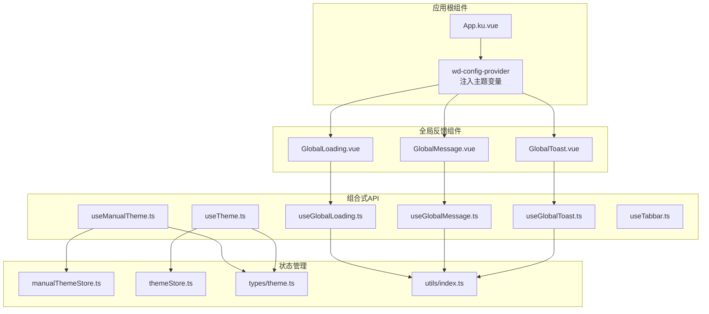
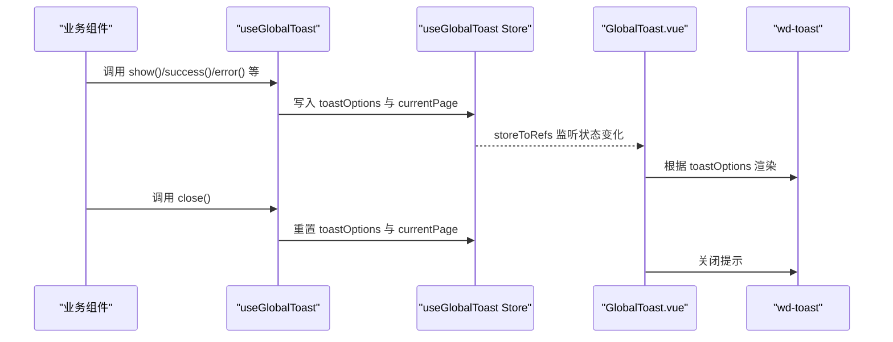
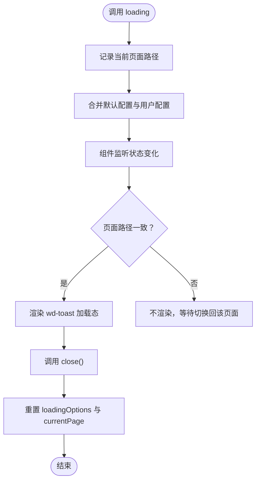
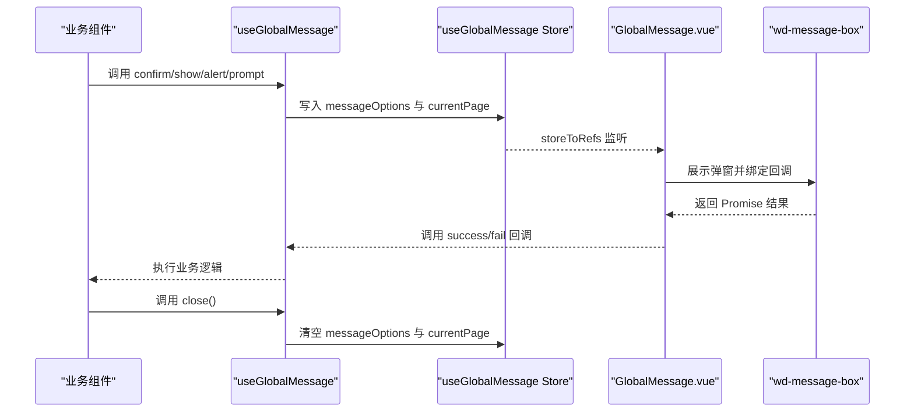
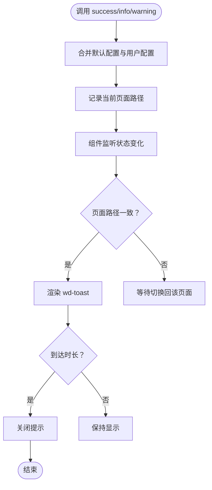
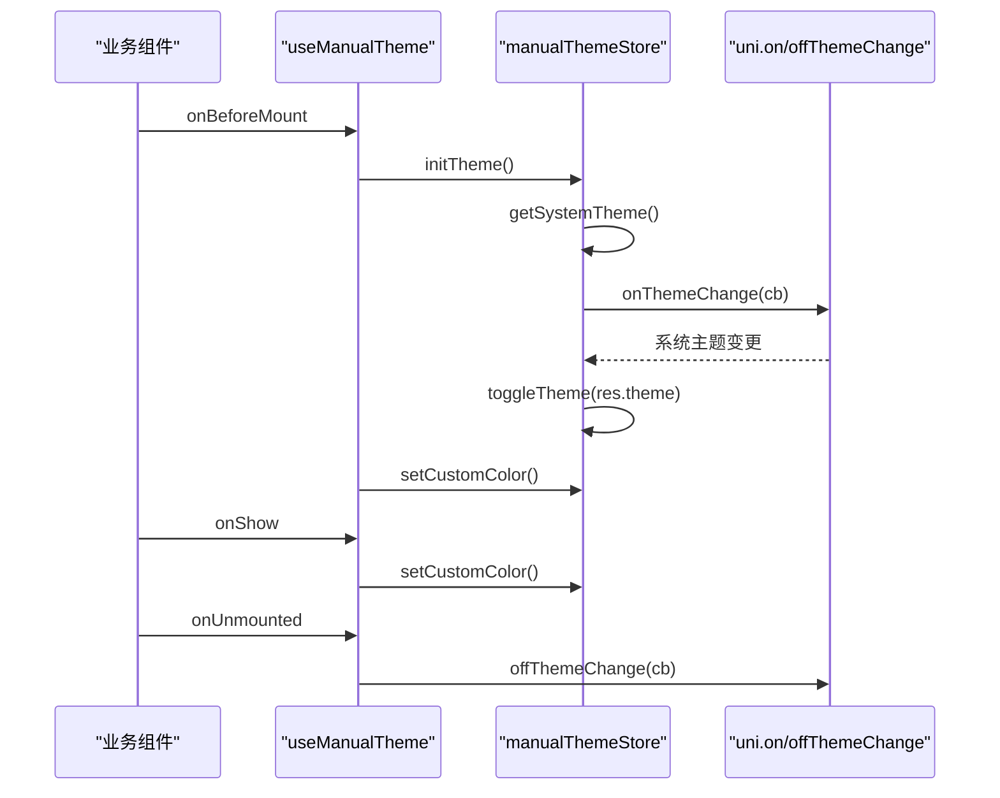
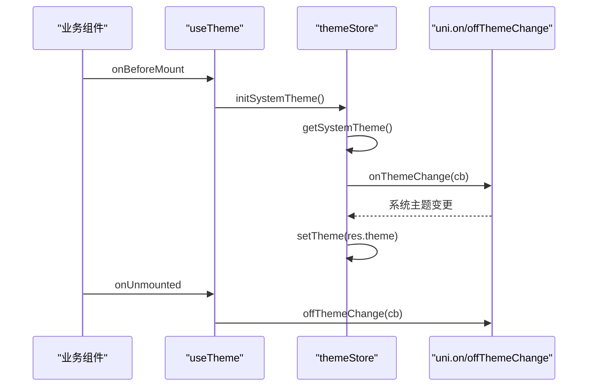
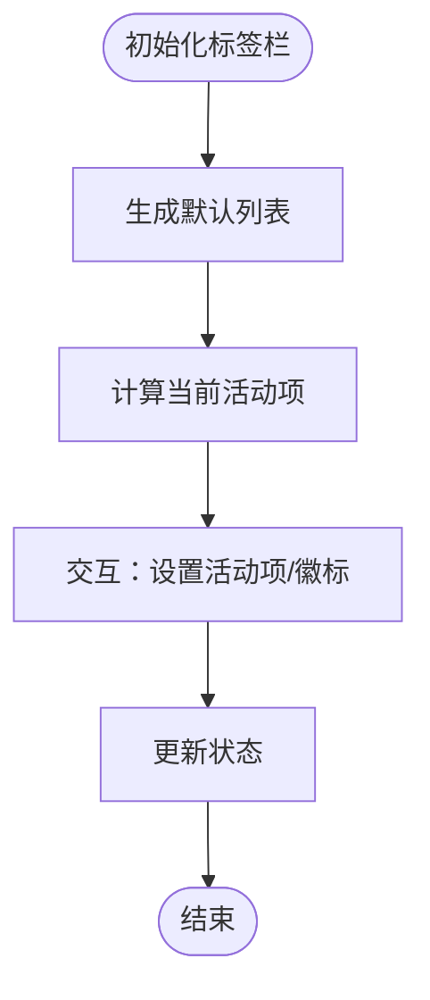
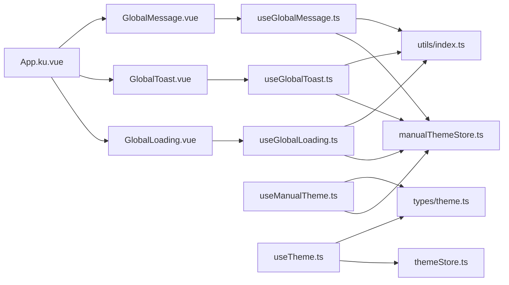

# 自定义Hook

<cite>
**本文引用的文件**
- [useGlobalLoading.ts](file://chuan-bill-app/src/composables/useGlobalLoading.ts)
- [useGlobalMessage.ts](file://chuan-bill-app/src/composables/useGlobalMessage.ts)
- [useGlobalToast.ts](file://chuan-bill-app/src/composables/useGlobalToast.ts)
- [useManualTheme.ts](file://chuan-bill-app/src/composables/useManualTheme.ts)
- [useTabbar.ts](file://chuan-bill-app/src/composables/useTabbar.ts)
- [useTheme.ts](file://chuan-bill-app/src/composables/useTheme.ts)
- [theme.ts](file://chuan-bill-app/src/composables/types/theme.ts)
- [manualThemeStore.ts](file://chuan-bill-app/src/store/manualThemeStore.ts)
- [themeStore.ts](file://chuan-bill-app/src/store/themeStore.ts)
- [index.ts](file://chuan-bill-app/src/utils/index.ts)
- [GlobalLoading.vue](file://chuan-bill-app/src/components/GlobalLoading.vue)
- [GlobalMessage.vue](file://chuan-bill-app/src/components/GlobalMessage.vue)
- [GlobalToast.vue](file://chuan-bill-app/src/components/GlobalToast.vue)
- [App.ku.vue](file://chuan-bill-app/src/App.ku.vue)
</cite>

## 目录
1. [简介](#简介)
2. [项目结构](#项目结构)
3. [核心组件](#核心组件)
4. [架构总览](#架构总览)
5. [详细组件分析](#详细组件分析)
6. [依赖分析](#依赖分析)
7. [性能考虑](#性能考虑)
8. [故障排查指南](#故障排查指南)
9. [结论](#结论)
10. [附录](#附录)

## 简介
本文件面向“小川记账”应用中的六个核心自定义Hook，提供从设计理念、实现细节到使用范式的系统化文档。重点覆盖以下Hook：
- useGlobalLoading：全局加载状态管理
- useGlobalMessage：全局消息队列处理
- useGlobalToast：全局轻提示调度
- useManualTheme：手动主题切换（完整版）
- useTabbar：标签栏状态控制
- useTheme：主题系统集成（简化版）

文档将给出每个Hook的参数配置、返回值结构、典型使用场景、生命周期管理、与Vue 3 Composition API的集成方式、与Pinia的状态协作、以及性能优化、错误处理与内存泄漏防护等高级话题。

## 项目结构
这些Hook位于应用的组合式API层，配合Pinia Store与Wot Design Uni组件库，形成统一的全局反馈与主题体系。根组件通过wd-config-provider注入主题变量，全局反馈组件作为虚拟节点挂载在根组件之下，实现跨页面统一展示。

**图示来源**
- [App.ku.vue:1-21](file://chuan-bill-app/src/App.ku.vue#L1-L21)
- [GlobalLoading.vue:1-47](file://chuan-bill-app/src/components/GlobalLoading.vue#L1-L47)
- [GlobalToast.vue:1-47](file://chuan-bill-app/src/components/GlobalToast.vue#L1-L47)
- [GlobalMessage.vue:1-56](file://chuan-bill-app/src/components/GlobalMessage.vue#L1-L56)
- [useGlobalLoading.ts:1-38](file://chuan-bill-app/src/composables/useGlobalLoading.ts#L1-L38)
- [useGlobalToast.ts:1-62](file://chuan-bill-app/src/composables/useGlobalToast.ts#L1-L62)
- [useGlobalMessage.ts:1-53](file://chuan-bill-app/src/composables/useGlobalMessage.ts#L1-L53)
- [useManualTheme.ts:1-143](file://chuan-bill-app/src/composables/useManualTheme.ts#L1-L143)
- [useTheme.ts:1-71](file://chuan-bill-app/src/composables/useTheme.ts#L1-L71)
- [useTabbar.ts:1-55](file://chuan-bill-app/src/composables/useTabbar.ts#L1-L55)
- [manualThemeStore.ts:1-151](file://chuan-bill-app/src/store/manualThemeStore.ts#L1-L151)
- [themeStore.ts:1-75](file://chuan-bill-app/src/store/themeStore.ts#L1-L75)
- [theme.ts:1-47](file://chuan-bill-app/src/composables/types/theme.ts#L1-L47)
- [index.ts:1-79](file://chuan-bill-app/src/utils/index.ts#L1-L79)

**章节来源**
- [App.ku.vue:1-21](file://chuan-bill-app/src/App.ku.vue#L1-L21)
- [GlobalLoading.vue:1-47](file://chuan-bill-app/src/components/GlobalLoading.vue#L1-L47)
- [GlobalToast.vue:1-47](file://chuan-bill-app/src/components/GlobalToast.vue#L1-L47)
- [GlobalMessage.vue:1-56](file://chuan-bill-app/src/components/GlobalMessage.vue#L1-L56)

## 核心组件
本节概览六个Hook的职责与协作关系：
- useGlobalLoading：集中管理全局加载状态，通过Pinia Store与GlobalLoading组件联动，按页面路径精确显示。
- useGlobalMessage：集中管理全局消息弹窗，支持alert/confirm/prompt三类，回调与Promise链路统一处理。
- useGlobalToast：集中管理全局轻提示，提供success/error/info/warning快捷方法，支持自定义图标与位置。
- useManualTheme：完整主题管理，支持手动切换、跟随系统、主题色选择、导航栏颜色同步与持久化。
- useTheme：简化版主题管理，仅跟随系统主题，适合轻量化需求。
- useTabbar：标签栏状态控制，维护活动项、数值徽标与激活状态。

**章节来源**
- [useGlobalLoading.ts:1-38](file://chuan-bill-app/src/composables/useGlobalLoading.ts#L1-L38)
- [useGlobalMessage.ts:1-53](file://chuan-bill-app/src/composables/useGlobalMessage.ts#L1-L53)
- [useGlobalToast.ts:1-62](file://chuan-bill-app/src/composables/useGlobalToast.ts#L1-L62)
- [useManualTheme.ts:1-143](file://chuan-bill-app/src/composables/useManualTheme.ts#L1-L143)
- [useTheme.ts:1-71](file://chuan-bill-app/src/composables/useTheme.ts#L1-L71)
- [useTabbar.ts:1-55](file://chuan-bill-app/src/composables/useTabbar.ts#L1-L55)

## 架构总览
全局反馈与主题体系采用“组合式API + Pinia Store + Wot Design Uni组件”的分层架构：
- 组合式API层负责状态暴露与生命周期管理；
- Pinia Store层负责状态持久化与跨页面共享；
- 组件层负责UI渲染与事件绑定；
- 工具层提供页面路径与颜色转换等通用能力。

**图示来源**
- [useGlobalToast.ts:1-62](file://chuan-bill-app/src/composables/useGlobalToast.ts#L1-L62)
- [GlobalToast.vue:1-47](file://chuan-bill-app/src/components/GlobalToast.vue#L1-L47)

**章节来源**
- [useGlobalToast.ts:1-62](file://chuan-bill-app/src/composables/useGlobalToast.ts#L1-L62)
- [GlobalToast.vue:1-47](file://chuan-bill-app/src/components/GlobalToast.vue#L1-L47)

## 详细组件分析

### useGlobalLoading：全局加载状态管理
- 设计理念
  - 基于Pinia Store实现全局状态，避免重复渲染与跨页面状态丢失。
  - 通过页面路径检测，确保加载状态仅在目标页面显示，防止跨页污染。
  - 默认禁用自动关闭，要求显式关闭，避免资源泄漏。
- 参数与返回
  - 方法：
    - loading(option: ToastOptions | string)：显示加载，支持字符串简写与完整配置。
    - close()：关闭加载。
  - 状态：
    - loadingOptions: ToastOptions（当前加载配置）
    - currentPage: string（记录触发页面路径）
- 使用场景
  - 网络请求、文件上传、批量操作、页面跳转前准备等。
- 生命周期
  - 触发时记录currentPage；组件watch监听状态变化并在同页时渲染；切换页面或close时自动隐藏。
- 类型与默认值
  - 默认配置包含图标、遮罩、位置与显示标志，duration=0表示不自动关闭。
- 最佳实践
  - 使用try-finally确保关闭；对重要操作开启遮罩；避免嵌套调用导致覆盖。
- 错误处理与边界
  - 若页面路径不匹配，组件不渲染；若store被意外清空，需保证currentPage与当前路径一致。

**图示来源**
- [useGlobalLoading.ts:1-38](file://chuan-bill-app/src/composables/useGlobalLoading.ts#L1-L38)
- [GlobalLoading.vue:1-47](file://chuan-bill-app/src/components/GlobalLoading.vue#L1-L47)

**章节来源**
- [useGlobalLoading.ts:1-38](file://chuan-bill-app/src/composables/useGlobalLoading.ts#L1-L38)
- [GlobalLoading.vue:1-47](file://chuan-bill-app/src/components/GlobalLoading.vue#L1-L47)
- [index.ts:1-79](file://chuan-bill-app/src/utils/index.ts#L1-L79)

### useGlobalMessage：全局消息队列处理
- 设计理念
  - 统一alert/confirm/prompt三类消息，内置按钮样式配置，支持回调与Promise链路。
  - 通过storeToRefs与组件watch联动，按页面路径精确显示。
- 参数与返回
  - 方法：
    - show(option)：通用弹窗。
    - alert(option)：仅确认按钮。
    - confirm(option)：确认/取消按钮。
    - prompt(option)：带输入框的确认/取消。
    - close()：关闭弹窗。
  - 状态：
    - messageOptions: GlobalMessageOptions | null
    - currentPage: string
- 使用场景
  - 删除确认、表单提交确认、输入校验与二次确认等。
- 生命周期
  - 组件watch监听messageOptions，按类型自动设置取消按钮可见性，并在回调中调用success/fail。
- 类型与默认值
  - 默认按钮为非圆角样式，支持title/message/type/inputValue等。
- 最佳实践
  - 明确标题与内容；完整处理success/fail；prompt需做输入校验；避免连续弹窗覆盖。
- 错误处理与边界
  - 若option为字符串，自动映射为title；showCancelButton根据类型自动设置。

**图示来源**
- [useGlobalMessage.ts:1-53](file://chuan-bill-app/src/composables/useGlobalMessage.ts#L1-L53)
- [GlobalMessage.vue:1-56](file://chuan-bill-app/src/components/GlobalMessage.vue#L1-L56)

**章节来源**
- [useGlobalMessage.ts:1-53](file://chuan-bill-app/src/composables/useGlobalMessage.ts#L1-L53)
- [GlobalMessage.vue:1-56](file://chuan-bill-app/src/components/GlobalMessage.vue#L1-L56)

### useGlobalToast：全局轻提示调度
- 设计理念
  - 提供success/error/info/warning四类快捷方法，统一图标与时长策略。
  - 支持自定义图标、位置与持续时间，按页面路径精准显示。
- 参数与返回
  - 方法：
    - show(option)：通用提示。
    - success(option)/error(option)/info(option)/warning(option)：快捷方法。
    - close()：关闭提示。
  - 状态：
    - toastOptions: ToastOptions
    - currentPage: string
- 使用场景
  - 操作成功/失败反馈、信息提示、警告提醒等。
- 生命周期
  - 组件watch监听toastOptions，同页渲染；close或duration结束后自动隐藏。
- 类型与默认值
  - 默认时长2000ms，位置默认居中；success默认1500ms。
- 最佳实践
  - 避免频繁调用；长文本提升时长；重要提示可设为不自动关闭。
- 错误处理与边界
  - 若页面路径不匹配，组件不渲染；注意与加载提示的互斥使用。

**图示来源**
- [useGlobalToast.ts:1-62](file://chuan-bill-app/src/composables/useGlobalToast.ts#L1-L62)
- [GlobalToast.vue:1-47](file://chuan-bill-app/src/components/GlobalToast.vue#L1-L47)

**章节来源**
- [useGlobalToast.ts:1-62](file://chuan-bill-app/src/composables/useGlobalToast.ts#L1-L62)
- [GlobalToast.vue:1-47](file://chuan-bill-app/src/components/GlobalToast.vue#L1-L47)

### useManualTheme：手动主题切换（完整版）
- 设计理念
  - 支持手动切换明暗主题、跟随系统主题、主题色选择、导航栏颜色同步与持久化。
  - 在组件挂载前初始化主题，在页面显示时更新导航栏颜色，在卸载时清理系统主题监听。
- 参数与返回
  - 状态：
    - theme: 'light' | 'dark'
    - isDark: boolean
    - followSystem: boolean
    - hasUserSet: boolean
    - currentThemeColor: ThemeColorOption
    - themeVars: ConfigProviderThemeVars
    - showThemeColorSheet: boolean
  - 方法：
    - initTheme()：初始化主题。
    - toggleTheme(mode?, isFollow=false)：切换主题。
    - setFollowSystem(follow: boolean)：设置跟随系统。
    - openThemeColorPicker()/closeThemeColorPicker()：主题色选择器开关。
    - selectThemeColor(option: ThemeColorOption)：选择主题色。
- 使用场景
  - 需要用户手动控制主题、主题色自定义、完整主题管理的复杂应用。
- 生命周期
  - onBeforeMount：initTheme并监听系统主题变化；onShow：setCustomColor；onUnmounted：offThemeChange。
- 类型与默认值
  - 预定义主题色选项数组；themeVars包含暗色背景、主题色、边框等变量。
- 最佳实践
  - 首次启动或切换系统主题时，优先遵循系统设置；用户手动切换后停止跟随系统。
- 错误处理与边界
  - 获取系统主题失败时降级为light；清理监听防止内存泄漏。

**图示来源**
- [useManualTheme.ts:1-143](file://chuan-bill-app/src/composables/useManualTheme.ts#L1-L143)
- [manualThemeStore.ts:1-151](file://chuan-bill-app/src/store/manualThemeStore.ts#L1-L151)

**章节来源**
- [useManualTheme.ts:1-143](file://chuan-bill-app/src/composables/useManualTheme.ts#L1-L143)
- [manualThemeStore.ts:1-151](file://chuan-bill-app/src/store/manualThemeStore.ts#L1-L151)
- [theme.ts:1-47](file://chuan-bill-app/src/composables/types/theme.ts#L1-L47)

### useTheme：主题系统集成（简化版）
- 设计理念
  - 仅跟随系统主题，自动响应系统主题切换，导航栏颜色通过theme.json自动处理。
  - 轻量级实现，适合不需要用户手动控制主题的应用。
- 参数与返回
  - 状态：
    - theme: 'light' | 'dark'
    - isDark: boolean
    - themeVars: ConfigProviderThemeVars
- 使用场景
  - 简单应用、不需要用户手动切换主题、追求轻量级主题管理。
- 生命周期
  - onBeforeMount：initSystemTheme并监听系统主题变化；onUnmounted：清理监听。
- 类型与默认值
  - SystemThemeState包含theme与themeVars。
- 最佳实践
  - 与App.ku.vue的wd-config-provider配合使用；确保theme.json正确配置导航栏颜色。
- 错误处理与边界
  - 获取系统主题失败时降级为light；清理监听防止内存泄漏。

**图示来源**
- [useTheme.ts:1-71](file://chuan-bill-app/src/composables/useTheme.ts#L1-L71)
- [themeStore.ts:1-75](file://chuan-bill-app/src/store/themeStore.ts#L1-L75)

**章节来源**
- [useTheme.ts:1-71](file://chuan-bill-app/src/composables/useTheme.ts#L1-L71)
- [themeStore.ts:1-75](file://chuan-bill-app/src/store/themeStore.ts#L1-L75)
- [App.ku.vue:1-21](file://chuan-bill-app/src/App.ku.vue#L1-L21)

### useTabbar：标签栏状态控制
- 设计理念
  - 维护标签栏列表、活动项、徽标数值与激活状态，提供查询与设置方法。
- 参数与返回
  - 状态：
    - tabbarList: TabbarItem[]
    - activeTabbar: TabbarItem
  - 方法：
    - getTabbarItemValue(name: string): number | null
    - setTabbarItem(name: string, value: number): void
    - setTabbarItemActive(name: string): void
- 使用场景
  - 应用主框架的底部标签栏，显示未读数或徽标。
- 生命周期
  - 无特殊生命周期钩子，纯计算与方法集合。
- 类型与默认值
  - TabbarItem包含name/value/active/title/icon字段。
- 最佳实践
  - 通过setTabbarItemActive统一设置活动项，避免多处直接修改状态。
- 错误处理与边界
  - 查找不到name时返回null；设置不存在的项时忽略。

**图示来源**
- [useTabbar.ts:1-55](file://chuan-bill-app/src/composables/useTabbar.ts#L1-L55)

**章节来源**
- [useTabbar.ts:1-55](file://chuan-bill-app/src/composables/useTabbar.ts#L1-L55)

## 依赖分析
- 组合式API与Store
  - useGlobalLoading/Toast/Message均依赖Pinia Store与utils.getCurrentPath进行页面路径检测。
  - useManualTheme/useTheme依赖各自Store与系统主题API。
- 组件与Hook
  - GlobalLoading/Toast/Message组件通过storeToRefs订阅Store状态，watch监听并渲染对应UI。
- 类型与工具
  - types/theme.ts提供主题相关类型与预设主题色；utils/index.ts提供getCurrentPath与颜色转换工具。

**图示来源**
- [useGlobalLoading.ts:1-38](file://chuan-bill-app/src/composables/useGlobalLoading.ts#L1-L38)
- [useGlobalToast.ts:1-62](file://chuan-bill-app/src/composables/useGlobalToast.ts#L1-L62)
- [useGlobalMessage.ts:1-53](file://chuan-bill-app/src/composables/useGlobalMessage.ts#L1-L53)
- [useManualTheme.ts:1-143](file://chuan-bill-app/src/composables/useManualTheme.ts#L1-L143)
- [useTheme.ts:1-71](file://chuan-bill-app/src/composables/useTheme.ts#L1-L71)
- [manualThemeStore.ts:1-151](file://chuan-bill-app/src/store/manualThemeStore.ts#L1-L151)
- [themeStore.ts:1-75](file://chuan-bill-app/src/store/themeStore.ts#L1-L75)
- [theme.ts:1-47](file://chuan-bill-app/src/composables/types/theme.ts#L1-L47)
- [index.ts:1-79](file://chuan-bill-app/src/utils/index.ts#L1-L79)
- [GlobalLoading.vue:1-47](file://chuan-bill-app/src/components/GlobalLoading.vue#L1-L47)
- [GlobalToast.vue:1-47](file://chuan-bill-app/src/components/GlobalToast.vue#L1-L47)
- [GlobalMessage.vue:1-56](file://chuan-bill-app/src/components/GlobalMessage.vue#L1-L56)
- [App.ku.vue:1-21](file://chuan-bill-app/src/App.ku.vue#L1-L21)

**章节来源**
- [useGlobalLoading.ts:1-38](file://chuan-bill-app/src/composables/useGlobalLoading.ts#L1-L38)
- [useGlobalToast.ts:1-62](file://chuan-bill-app/src/composables/useGlobalToast.ts#L1-L62)
- [useGlobalMessage.ts:1-53](file://chuan-bill-app/src/composables/useGlobalMessage.ts#L1-L53)
- [useManualTheme.ts:1-143](file://chuan-bill-app/src/composables/useManualTheme.ts#L1-L143)
- [useTheme.ts:1-71](file://chuan-bill-app/src/composables/useTheme.ts#L1-L71)
- [manualThemeStore.ts:1-151](file://chuan-bill-app/src/store/manualThemeStore.ts#L1-L151)
- [themeStore.ts:1-75](file://chuan-bill-app/src/store/themeStore.ts#L1-L75)
- [theme.ts:1-47](file://chuan-bill-app/src/composables/types/theme.ts#L1-L47)
- [index.ts:1-79](file://chuan-bill-app/src/utils/index.ts#L1-L79)
- [GlobalLoading.vue:1-47](file://chuan-bill-app/src/components/GlobalLoading.vue#L1-L47)
- [GlobalToast.vue:1-47](file://chuan-bill-app/src/components/GlobalToast.vue#L1-L47)
- [GlobalMessage.vue:1-56](file://chuan-bill-app/src/components/GlobalMessage.vue#L1-L56)
- [App.ku.vue:1-21](file://chuan-bill-app/src/App.ku.vue#L1-L21)

## 性能考虑
- 状态最小化
  - 仅在触发时写入currentPage与配置，避免冗余渲染。
- 组件渲染控制
  - 通过页面路径检测减少无效渲染；组件采用虚拟节点，避免DOM层级膨胀。
- 主题切换
  - 仅在主题或颜色变化时更新themeVars与导航栏颜色，避免频繁重绘。
- 资源释放
  - 卸载时清理系统主题监听与定时器，防止内存泄漏。

## 故障排查指南
- 加载/提示未显示
  - 检查currentPage与当前页面路径是否一致；确认组件已注册在App.ku.vue。
- 加载/提示无法关闭
  - 确保finally块或异常分支调用close；检查是否存在嵌套调用覆盖。
- 主题切换无效
  - 检查followSystem与hasUserSet状态；确认系统主题监听已注册与清理。
- 导航栏颜色不生效
  - 确认manualThemeStore.setCustomColor已调用；检查theme.json配置。
- 页面切换后残留提示
  - 确认组件watch逻辑与currentPage一致性；避免跨页状态污染。

**章节来源**
- [GlobalLoading.vue:1-47](file://chuan-bill-app/src/components/GlobalLoading.vue#L1-L47)
- [GlobalToast.vue:1-47](file://chuan-bill-app/src/components/GlobalToast.vue#L1-L47)
- [GlobalMessage.vue:1-56](file://chuan-bill-app/src/components/GlobalMessage.vue#L1-L56)
- [useManualTheme.ts:1-143](file://chuan-bill-app/src/composables/useManualTheme.ts#L1-L143)
- [manualThemeStore.ts:1-151](file://chuan-bill-app/src/store/manualThemeStore.ts#L1-L151)

## 结论
六个Hook围绕“全局反馈”与“主题系统”两大核心域构建，通过Pinia Store实现跨页面状态共享，通过组件层实现UI渲染与事件绑定。useGlobalLoading/Toast/Message提供统一的用户反馈体验；useManualTheme/useTheme满足不同复杂度的主题管理需求；useTabbar完善主框架的标签栏控制。整体架构清晰、职责分明、易于扩展与维护。

## 附录
- 类型定义参考
  - 主题色选项、主题模式、主题状态与系统主题状态定义见types/theme.ts。
- 使用示例参考
  - 各Hook的README文档提供了基础用法、参数说明与最佳实践，建议结合实际业务场景灵活使用。