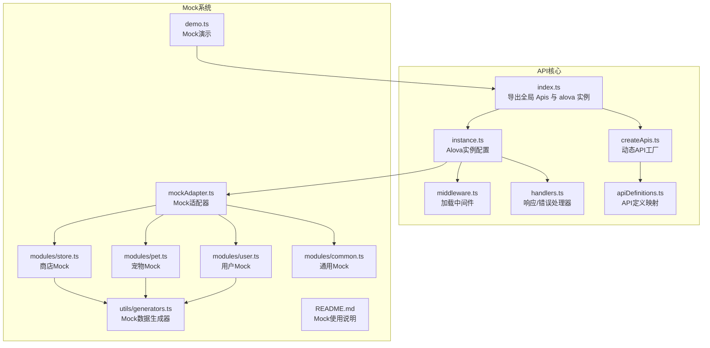
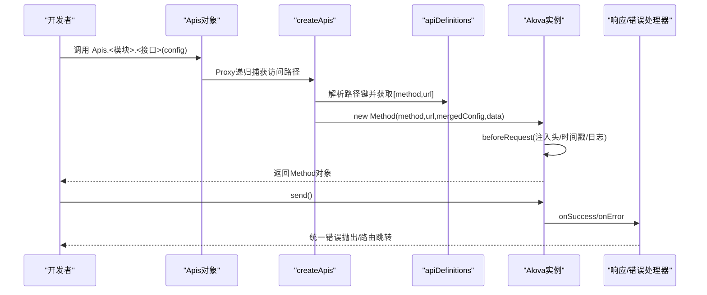
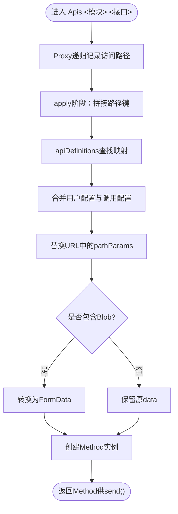
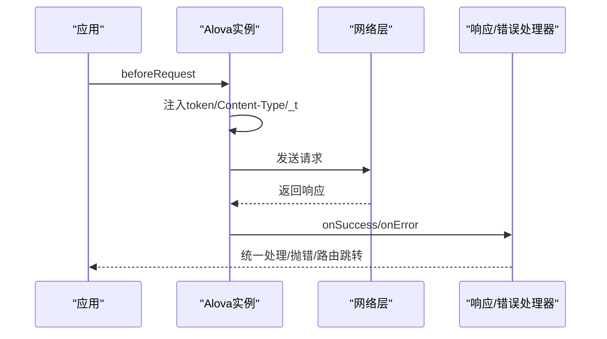
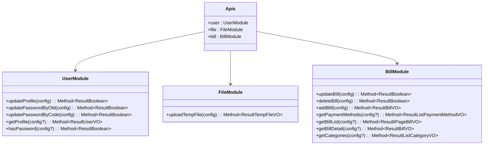
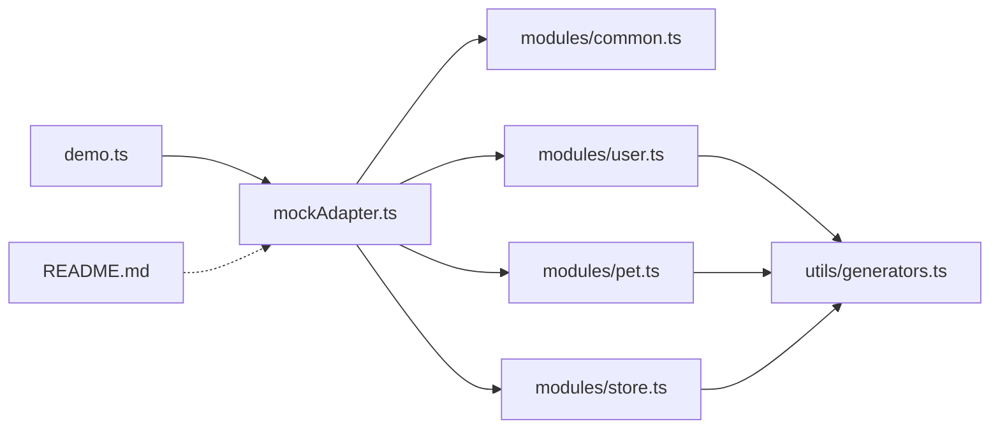
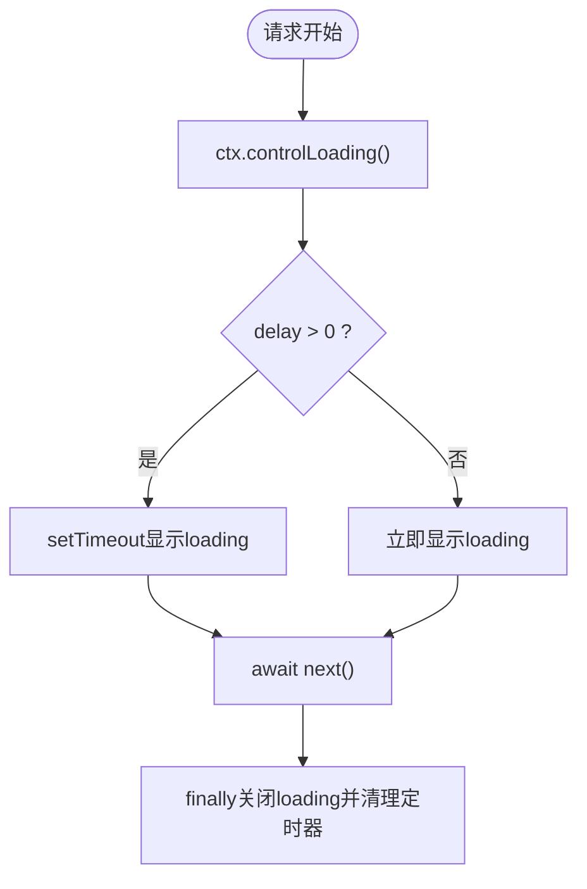
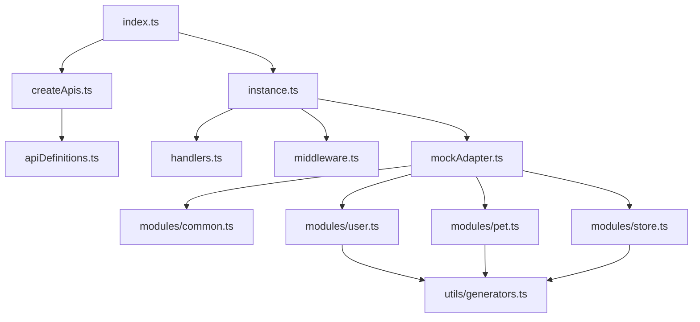

# API定义系统

<cite>
**本文档引用的文件**
- [index.ts](file://chuan-bill-app/src/api/index.ts)
- [createApis.ts](file://chuan-bill-app/src/api/createApis.ts)
- [apiDefinitions.ts](file://chuan-bill-app/src/api/apiDefinitions.ts)
- [instance.ts](file://chuan-bill-app/src/api/core/instance.ts)
- [handlers.ts](file://chuan-bill-app/src/api/core/handlers.ts)
- [middleware.ts](file://chuan-bill-app/src/api/core/middleware.ts)
- [mockAdapter.ts](file://chuan-bill-app/src/api/mock/mockAdapter.ts)
- [common.ts](file://chuan-bill-app/src/api/mock/modules/common.ts)
- [user.ts](file://chuan-bill-app/src/api/mock/modules/user.ts)
- [pet.ts](file://chuan-bill-app/src/api/mock/modules/pet.ts)
- [store.ts](file://chuan-bill-app/src/api/mock/modules/store.ts)
- [generators.ts](file://chuan-bill-app/src/api/mock/utils/generators.ts)
- [demo.ts](file://chuan-bill-app/src/api/mock/demo.ts)
- [README.md](file://chuan-bill-app/src/api/mock/README.md)
- [globals.d.ts](file://chuan-bill-app/src/api/globals.d.ts)
</cite>

## 目录
1. [简介](#简介)
2. [项目结构](#项目结构)
3. [核心组件](#核心组件)
4. [架构总览](#架构总览)
5. [详细组件分析](#详细组件分析)
6. [依赖关系分析](#依赖关系分析)
7. [性能考虑](#性能考虑)
8. [故障排查指南](#故障排查指南)
9. [结论](#结论)
10. [附录](#附录)

## 简介
本文件面向小川记账API定义系统，系统基于 Alova 构建，采用模块化设计与类型安全机制，结合动态API生成、方法链式调用与配置继承，提供统一的前端API访问层。系统同时内置Mock能力，支持按模块组织的模拟数据与自动化生成工具，便于开发与联调。

## 项目结构
前端API层位于 chuan-bill-app/src/api，主要由以下子模块构成：
- 核心实例与中间件：core/instance.ts、core/handlers.ts、core/middleware.ts
- 动态API工厂：createApis.ts、apiDefinitions.ts
- 类型声明与泛型约束：globals.d.ts
- Mock系统：mock/mockAdapter.ts、mock/modules/*、mock/utils/generators.ts、mock/demo.ts、mock/README.md
- 入口导出：index.ts

**图表来源**
- [index.ts:1-19](file://chuan-bill-app/src/api/index.ts#L1-L19)
- [createApis.ts:1-95](file://chuan-bill-app/src/api/createApis.ts#L1-L95)
- [apiDefinitions.ts:1-38](file://chuan-bill-app/src/api/apiDefinitions.ts#L1-L38)
- [instance.ts:1-63](file://chuan-bill-app/src/api/core/instance.ts#L1-L63)
- [handlers.ts:1-105](file://chuan-bill-app/src/api/core/handlers.ts#L1-L105)
- [middleware.ts:1-93](file://chuan-bill-app/src/api/core/middleware.ts#L1-L93)
- [mockAdapter.ts:1-48](file://chuan-bill-app/src/api/mock/mockAdapter.ts#L1-L48)
- [common.ts:1-31](file://chuan-bill-app/src/api/mock/modules/common.ts#L1-L31)
- [user.ts:1-305](file://chuan-bill-app/src/api/mock/modules/user.ts#L1-L305)
- [pet.ts:1-240](file://chuan-bill-app/src/api/mock/modules/pet.ts#L1-L240)
- [store.ts:1-174](file://chuan-bill-app/src/api/mock/modules/store.ts#L1-L174)
- [generators.ts:1-143](file://chuan-bill-app/src/api/mock/utils/generators.ts#L1-L143)
- [demo.ts:1-437](file://chuan-bill-app/src/api/mock/demo.ts#L1-L437)
- [README.md:1-108](file://chuan-bill-app/src/api/mock/README.md#L1-L108)

**章节来源**
- [index.ts:1-19](file://chuan-bill-app/src/api/index.ts#L1-L19)
- [createApis.ts:1-95](file://chuan-bill-app/src/api/createApis.ts#L1-L95)
- [apiDefinitions.ts:1-38](file://chuan-bill-app/src/api/apiDefinitions.ts#L1-L38)
- [instance.ts:1-63](file://chuan-bill-app/src/api/core/instance.ts#L1-L63)
- [handlers.ts:1-105](file://chuan-bill-app/src/api/core/handlers.ts#L1-L105)
- [middleware.ts:1-93](file://chuan-bill-app/src/api/core/middleware.ts#L1-L93)
- [mockAdapter.ts:1-48](file://chuan-bill-app/src/api/mock/mockAdapter.ts#L1-L48)
- [common.ts:1-31](file://chuan-bill-app/src/api/mock/modules/common.ts#L1-L31)
- [user.ts:1-305](file://chuan-bill-app/src/api/mock/modules/user.ts#L1-L305)
- [pet.ts:1-240](file://chuan-bill-app/src/api/mock/modules/pet.ts#L1-L240)
- [store.ts:1-174](file://chuan-bill-app/src/api/mock/modules/store.ts#L1-L174)
- [generators.ts:1-143](file://chuan-bill-app/src/api/mock/utils/generators.ts#L1-L143)
- [demo.ts:1-437](file://chuan-bill-app/src/api/mock/demo.ts#L1-L437)
- [README.md:1-108](file://chuan-bill-app/src/api/mock/README.md#L1-L108)

## 核心组件
- 动态API工厂：通过 Proxy 递归记录访问路径，最终根据 apiDefinitions 映射生成 Alova Method，支持路径参数替换、FormData 自动转换、配置合并与类型推断。
- Alova实例：统一配置 baseURL、适配器、中间件钩子、超时与缓存策略；集成响应/错误处理与开发环境调试日志。
- 类型安全：globals.d.ts 定义了泛型约束、请求/响应类型映射、transform函数类型提取，确保 Apis 方法参数与返回值具备强类型支持。
- Mock系统：多模块Mock定义、通用匹配规则、延迟与日志、数据生成器，支持与真实请求无缝切换。

**章节来源**
- [createApis.ts:22-72](file://chuan-bill-app/src/api/createApis.ts#L22-L72)
- [instance.ts:7-60](file://chuan-bill-app/src/api/core/instance.ts#L7-L60)
- [globals.d.ts:25-90](file://chuan-bill-app/src/api/globals.d.ts#L25-L90)
- [mockAdapter.ts:19-45](file://chuan-bill-app/src/api/mock/mockAdapter.ts#L19-L45)

## 架构总览
系统采用“定义驱动”的API设计：apiDefinitions 提供路径与HTTP方法映射，createApis 基于 Proxy 动态生成 Apis 对象，Alova 实例负责请求生命周期与适配器，handlers 提供统一的成功/失败处理，middleware 提供加载状态控制，mockAdapter 将模块化Mock整合为统一适配器。

**图表来源**
- [createApis.ts:22-62](file://chuan-bill-app/src/api/createApis.ts#L22-L62)
- [apiDefinitions.ts:19-37](file://chuan-bill-app/src/api/apiDefinitions.ts#L19-L37)
- [instance.ts:15-51](file://chuan-bill-app/src/api/core/instance.ts#L15-L51)
- [handlers.ts:34-104](file://chuan-bill-app/src/api/core/handlers.ts#L34-L104)

## 详细组件分析

### 动态API工厂与方法链式调用
- Proxy递归代理：通过 createFunctionalProxy 递归记录访问路径，最终在 apply 阶段拼接路径键，读取 apiDefinitions 并生成 Method。
- 配置合并：优先使用 withConfigType 注入的用户配置，再与调用方传入配置合并；支持 pathParams 替换URL占位符；自动将对象参数转换为FormData（若包含Blob）。
- 类型约束：withConfigType 与 globals.d.ts 中的泛型推导确保 Apis 方法参数与返回值类型正确，transform函数类型可被用户自定义覆盖。

**图表来源**
- [createApis.ts:22-62](file://chuan-bill-app/src/api/createApis.ts#L22-L62)
- [apiDefinitions.ts:19-37](file://chuan-bill-app/src/api/apiDefinitions.ts#L19-L37)
- [globals.d.ts:48-90](file://chuan-bill-app/src/api/globals.d.ts#L48-L90)

**章节来源**
- [createApis.ts:22-72](file://chuan-bill-app/src/api/createApis.ts#L22-L72)
- [globals.d.ts:48-95](file://chuan-bill-app/src/api/globals.d.ts#L48-L95)

### Alova实例与生命周期
- 实例配置：baseURL、适配器（uniapp）、状态钩子（vue）、beforeRequest（注入token、Content-Type、GET防缓存时间戳）、responded（成功/失败/完成回调）。
- 开发环境增强：在H5环境下自动追加/api前缀，输出请求/响应日志与环境信息。
- 超时与缓存：默认超时6000*30毫秒，全局关闭缓存。

**图表来源**
- [instance.ts:15-51](file://chuan-bill-app/src/api/core/instance.ts#L15-L51)
- [handlers.ts:34-104](file://chuan-bill-app/src/api/core/handlers.ts#L34-L104)

**章节来源**
- [instance.ts:7-60](file://chuan-bill-app/src/api/core/instance.ts#L7-L60)
- [handlers.ts:12-104](file://chuan-bill-app/src/api/core/handlers.ts#L12-L104)

### 类型安全机制
- 泛型约束：Alova2MethodConfig/Alova2Method 通过 AlovaGenerics 提取请求/响应类型，结合用户自定义 transform 类型推断，确保 Apis 方法返回值类型与服务端响应一致。
- DTO与VO：globals.d.ts 中定义了丰富的请求DTO与响应VO类型，配合 Apis 方法签名，形成端到端类型安全。
- 配置类型：withConfigType 提供编译期配置校验，避免错误的配置键或类型。

**图表来源**
- [globals.d.ts:545-880](file://chuan-bill-app/src/api/globals.d.ts#L545-L880)

**章节来源**
- [globals.d.ts:25-90](file://chuan-bill-app/src/api/globals.d.ts#L25-L90)
- [globals.d.ts:545-880](file://chuan-bill-app/src/api/globals.d.ts#L545-L880)

### Mock系统与模块化组织
- Mock适配器：聚合 common、user、pet、store 等模块，统一启用/禁用、延迟、日志与路径匹配模式。
- 通用处理：common.ts 提供通配符GET/POST处理，便于快速验证。
- 模块化Mock：user/pet/store 定义各自接口的模拟逻辑，包含参数校验、错误场景与数据生成。
- 数据生成器：generators.ts 提供ID、名称、日期、布尔、数组、基础/列表响应、业务对象等生成函数，保证Mock数据一致性与多样性。
- 演示与文档：demo.ts 展示典型调用流程，README.md 提供使用说明与最佳实践。

**图表来源**
- [mockAdapter.ts:19-45](file://chuan-bill-app/src/api/mock/mockAdapter.ts#L19-L45)
- [common.ts:12-30](file://chuan-bill-app/src/api/mock/modules/common.ts#L12-L30)
- [user.ts:35-304](file://chuan-bill-app/src/api/mock/modules/user.ts#L35-L304)
- [pet.ts:54-239](file://chuan-bill-app/src/api/mock/modules/pet.ts#L54-L239)
- [store.ts:30-173](file://chuan-bill-app/src/api/mock/modules/store.ts#L30-L173)
- [generators.ts:11-142](file://chuan-bill-app/src/api/mock/utils/generators.ts#L11-L142)
- [demo.ts:1-437](file://chuan-bill-app/src/api/mock/demo.ts#L1-L437)
- [README.md:1-108](file://chuan-bill-app/src/api/mock/README.md#L1-L108)

**章节来源**
- [mockAdapter.ts:19-45](file://chuan-bill-app/src/api/mock/mockAdapter.ts#L19-L45)
- [common.ts:12-30](file://chuan-bill-app/src/api/mock/modules/common.ts#L12-L30)
- [user.ts:35-304](file://chuan-bill-app/src/api/mock/modules/user.ts#L35-L304)
- [pet.ts:54-239](file://chuan-bill-app/src/api/mock/modules/pet.ts#L54-L239)
- [store.ts:30-173](file://chuan-bill-app/src/api/mock/modules/store.ts#L30-L173)
- [generators.ts:11-142](file://chuan-bill-app/src/api/mock/utils/generators.ts#L11-L142)
- [demo.ts:1-437](file://chuan-bill-app/src/api/mock/demo.ts#L1-L437)
- [README.md:1-108](file://chuan-bill-app/src/api/mock/README.md#L1-L108)

### 中间件与加载控制
- 延迟加载中间件：在请求前后控制 loading 状态，避免快速请求导致闪烁。
- 全局加载中间件：统一显示全局加载指示器，支持延迟显示与自定义文本。
- 默认中间件：提供开箱即用的延迟加载行为。

**图表来源**
- [middleware.ts:7-22](file://chuan-bill-app/src/api/core/middleware.ts#L7-L22)
- [middleware.ts:49-93](file://chuan-bill-app/src/api/core/middleware.ts#L49-L93)

**章节来源**
- [middleware.ts:1-93](file://chuan-bill-app/src/api/core/middleware.ts#L1-L93)

## 依赖关系分析
- 模块耦合：index.ts 仅依赖 createApis 与 alovaInstance；createApis 依赖 apiDefinitions 与 Alova；handlers 依赖全局toast与router；mockAdapter 依赖各模块与uniapp适配器。
- 外部依赖：alova、@alova/adapter-uniapp、@alova/mock、@alova/adapter-uniapp（mock）。
- 配置继承：$$userConfigMap 通过 withConfigType 注入，createApis 在生成 Method 时与调用配置合并，实现灵活的配置继承与覆盖。

**图表来源**
- [index.ts:1-19](file://chuan-bill-app/src/api/index.ts#L1-L19)
- [createApis.ts:18-21](file://chuan-bill-app/src/api/createApis.ts#L18-L21)
- [apiDefinitions.ts:19-37](file://chuan-bill-app/src/api/apiDefinitions.ts#L19-L37)
- [instance.ts:1-6](file://chuan-bill-app/src/api/core/instance.ts#L1-L6)
- [handlers.ts:9-10](file://chuan-bill-app/src/api/core/handlers.ts#L9-L10)
- [middleware.ts:1-93](file://chuan-bill-app/src/api/core/middleware.ts#L1-L93)
- [mockAdapter.ts:10-17](file://chuan-bill-app/src/api/mock/mockAdapter.ts#L10-L17)
- [user.ts:9-10](file://chuan-bill-app/src/api/mock/modules/user.ts#L9-L10)
- [pet.ts:9-10](file://chuan-bill-app/src/api/mock/modules/pet.ts#L9-L10)
- [store.ts:9-10](file://chuan-bill-app/src/api/mock/modules/store.ts#L9-L10)

**章节来源**
- [index.ts:1-19](file://chuan-bill-app/src/api/index.ts#L1-L19)
- [createApis.ts:18-21](file://chuan-bill-app/src/api/createApis.ts#L18-L21)
- [apiDefinitions.ts:19-37](file://chuan-bill-app/src/api/apiDefinitions.ts#L19-L37)
- [instance.ts:1-6](file://chuan-bill-app/src/api/core/instance.ts#L1-L6)
- [handlers.ts:9-10](file://chuan-bill-app/src/api/core/handlers.ts#L9-L10)
- [middleware.ts:1-93](file://chuan-bill-app/src/api/core/middleware.ts#L1-L93)
- [mockAdapter.ts:10-17](file://chuan-bill-app/src/api/mock/mockAdapter.ts#L10-L17)
- [user.ts:9-10](file://chuan-bill-app/src/api/mock/modules/user.ts#L9-L10)
- [pet.ts:9-10](file://chuan-bill-app/src/api/mock/modules/pet.ts#L9-L10)
- [store.ts:9-10](file://chuan-bill-app/src/api/mock/modules/store.ts#L9-L10)

## 性能考虑
- 缓存策略：当前全局关闭缓存，避免状态不一致问题；如需优化可按接口粒度开启缓存并设置合理TTL。
- 请求合并：对于高频接口，建议在业务层做去抖/节流，减少重复请求。
- Mock延迟：随机200-600ms延迟模拟网络，有助于发现UI闪烁与加载时机问题。
- 超时设置：默认超时较长，针对长耗时接口可按需调整。

## 故障排查指南
- 401/403处理：响应处理器与错误处理器均会触发登录过期提示与路由跳转，检查token注入与后端鉴权。
- 网络/超时错误：区分 NetworkError 与 TimeoutError，分别提示网络与超时。
- 参数校验：Mock模块对非法参数返回明确错误码与消息，便于定位问题。
- 日志定位：开发环境下输出请求/响应与环境信息，便于快速定位。

**章节来源**
- [handlers.ts:42-104](file://chuan-bill-app/src/api/core/handlers.ts#L42-L104)
- [user.ts:103-148](file://chuan-bill-app/src/api/mock/modules/user.ts#L103-L148)
- [pet.ts:130-158](file://chuan-bill-app/src/api/mock/modules/pet.ts#L130-L158)
- [store.ts:89-128](file://chuan-bill-app/src/api/mock/modules/store.ts#L89-L128)

## 结论
小川记账API定义系统通过模块化、类型安全与动态工厂实现了高内聚、低耦合的前端API层。结合统一的生命周期管理、中间件与Mock体系，系统在开发效率、可维护性与可测试性方面表现优异。建议后续持续完善版本管理与废弃API处理策略，以保障长期演进的稳定性。

## 附录
- 版本管理与兼容性：建议在 apiDefinitions 与 globals.d.ts 中引入版本注释与弃用标记，逐步迁移旧接口。
- 文档生成：利用 globals.d.ts 中的注释与类型定义，可自动生成OpenAPI/Swagger文档。
- 测试用例：基于 demo.ts 与各模块Mock，编写单元/集成测试，覆盖成功/失败/边界场景。
- Mock同步：通过 generators.ts 生成一致数据，确保Mock与真实接口数据结构一致。