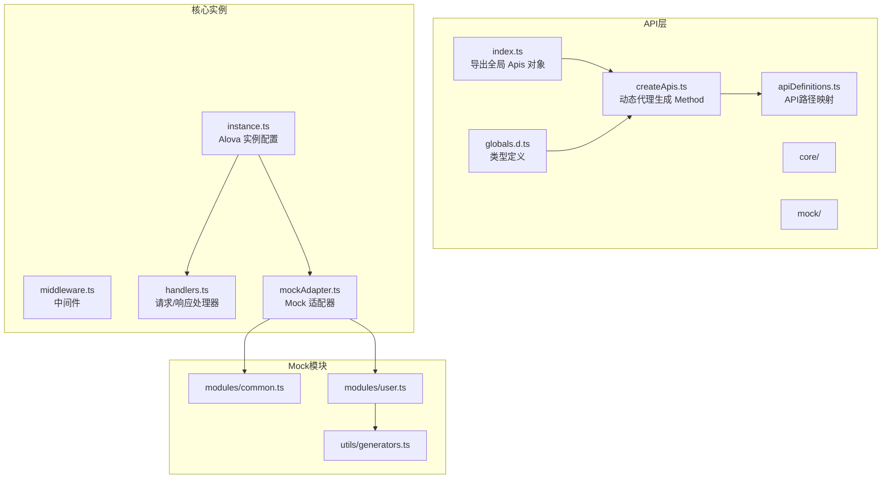
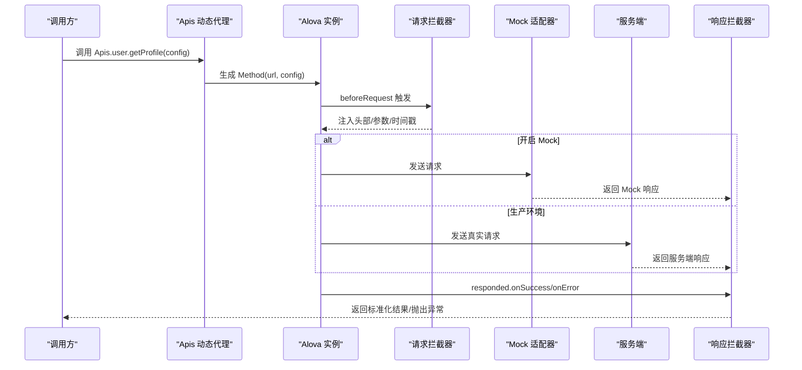
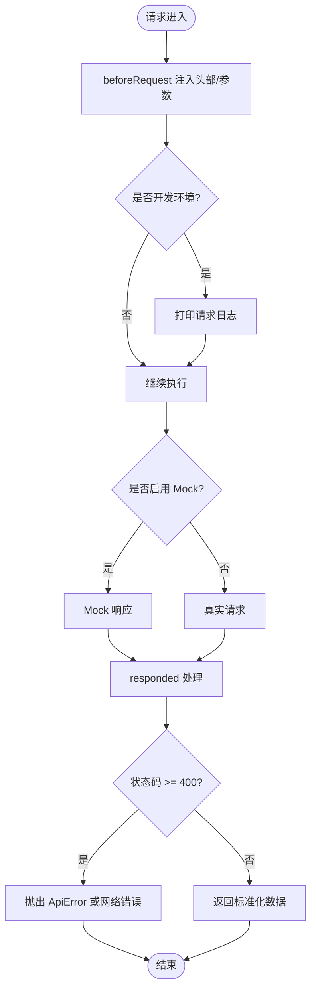
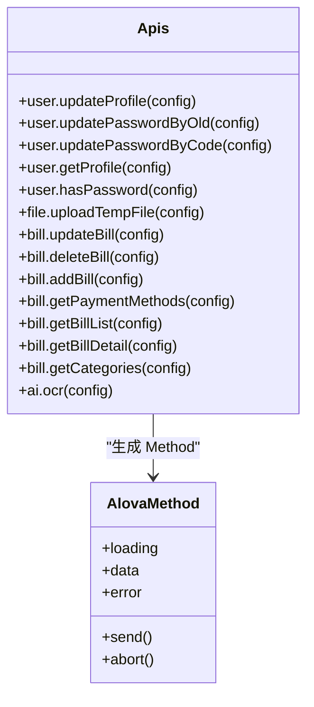
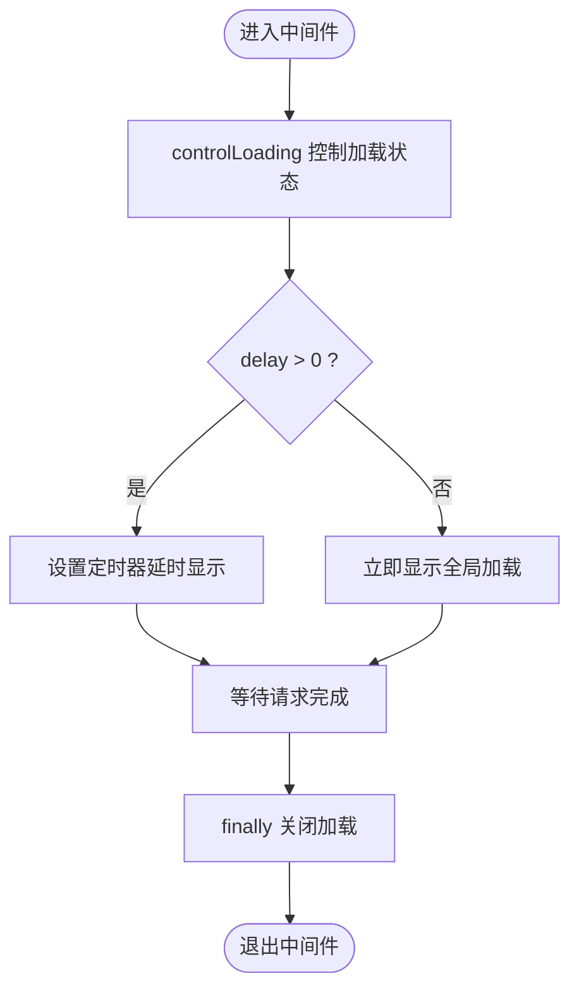
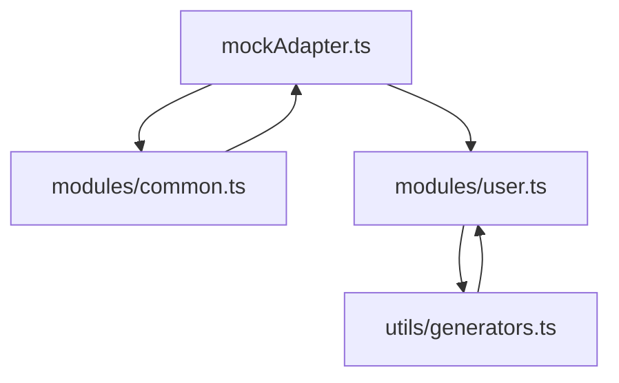
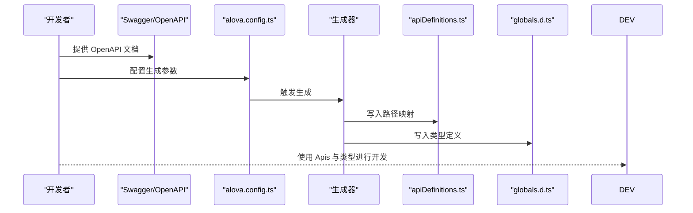
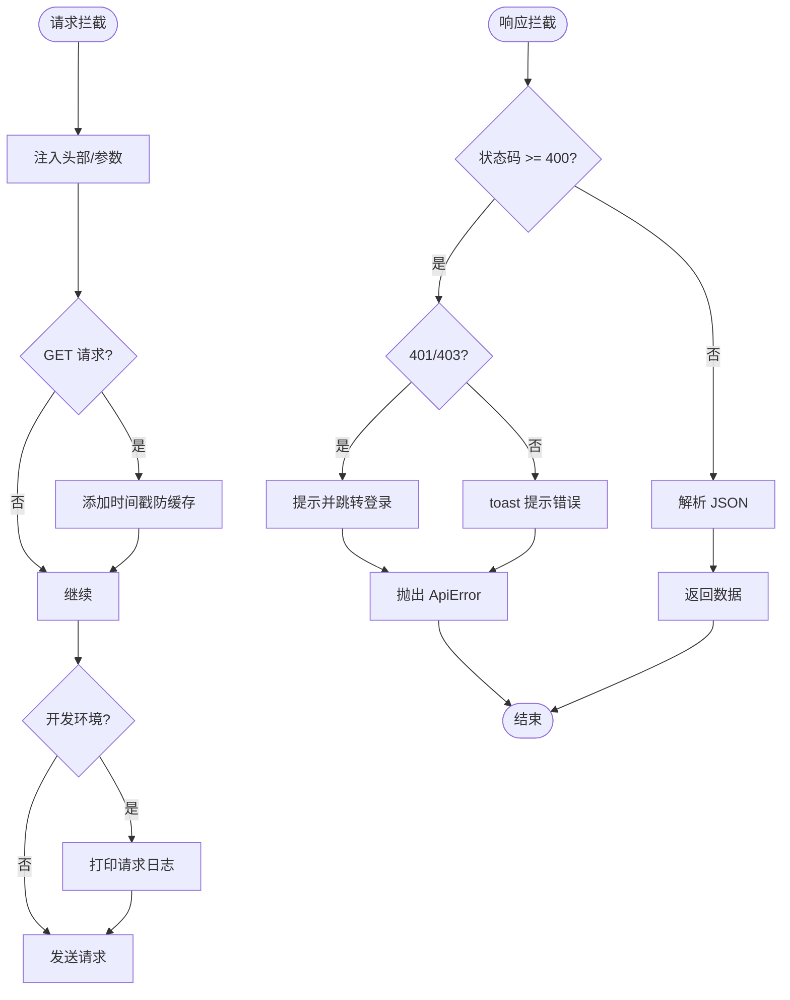
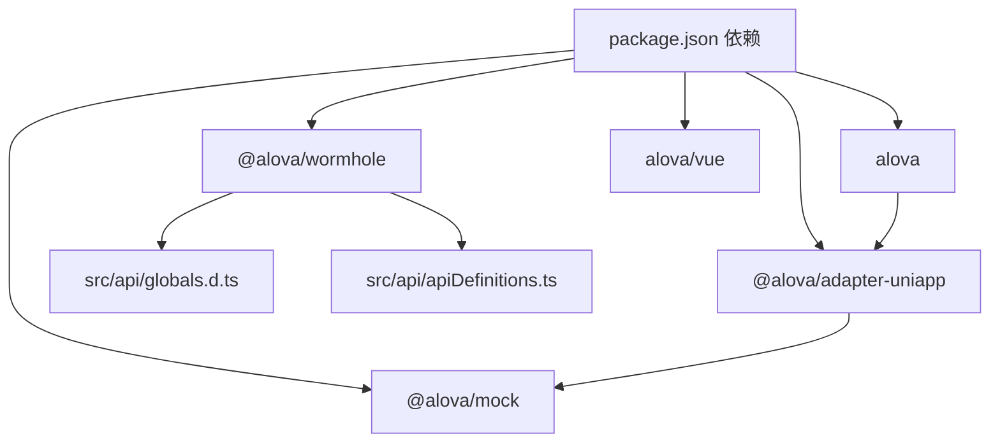

# API集成方案

<cite>
**本文档引用的文件**
- [index.ts](file://chuan-bill-app/src/api/index.ts)
- [createApis.ts](file://chuan-bill-app/src/api/createApis.ts)
- [apiDefinitions.ts](file://chuan-bill-app/src/api/apiDefinitions.ts)
- [instance.ts](file://chuan-bill-app/src/api/core/instance.ts)
- [middleware.ts](file://chuan-bill-app/src/api/core/middleware.ts)
- [handlers.ts](file://chuan-bill-app/src/api/core/handlers.ts)
- [mockAdapter.ts](file://chuan-bill-app/src/api/mock/mockAdapter.ts)
- [common.ts](file://chuan-bill-app/src/api/mock/modules/common.ts)
- [user.ts](file://chuan-bill-app/src/api/mock/modules/user.ts)
- [generators.ts](file://chuan-bill-app/src/api/mock/utils/generators.ts)
- [globals.d.ts](file://chuan-bill-app/src/api/globals.d.ts)
- [alova.config.ts](file://chuan-bill-app/alova.config.ts)
- [package.json](file://chuan-bill-app/package.json)
</cite>

## 目录
1. [简介](#简介)
2. [项目结构](#项目结构)
3. [核心组件](#核心组件)
4. [架构总览](#架构总览)
5. [详细组件分析](#详细组件分析)
6. [依赖关系分析](#依赖关系分析)
7. [性能考虑](#性能考虑)
8. [故障排除指南](#故障排除指南)
9. [结论](#结论)
10. [附录](#附录)

## 简介
本方案基于 alova HTTP 客户端为小川记账应用提供统一的 API 集成能力。整体架构采用模块化设计，结合 OpenAPI/Swagger 文档自动生成 API 类型与方法定义，配合请求/响应拦截器、中间件、Mock 数据系统以及环境化的部署切换机制，实现开发调试与生产部署的无缝衔接。同时，通过类型安全的 API 调用、参数校验、返回值处理与异常捕获，确保在多端（小程序、H5、App）场景下的稳定与一致性。

## 项目结构
前端 API 层位于 chuan-bill-app/src/api，包含以下关键目录与文件：
- core：核心实例与拦截器配置
- mock：Mock 数据系统与模块
- 类型与定义：OpenAPI 自动生成的类型与 API 定义
- 工具：Mock 数据生成器

**图表来源**
- [index.ts:1-19](file://chuan-bill-app/src/api/index.ts#L1-L19)
- [createApis.ts:1-95](file://chuan-bill-app/src/api/createApis.ts#L1-L95)
- [apiDefinitions.ts:1-38](file://chuan-bill-app/src/api/apiDefinitions.ts#L1-L38)
- [instance.ts:1-63](file://chuan-bill-app/src/api/core/instance.ts#L1-L63)
- [middleware.ts:1-93](file://chuan-bill-app/src/api/core/middleware.ts#L1-L93)
- [handlers.ts:1-105](file://chuan-bill-app/src/api/core/handlers.ts#L1-L105)
- [mockAdapter.ts:1-48](file://chuan-bill-app/src/api/mock/mockAdapter.ts#L1-L48)
- [common.ts:1-31](file://chuan-bill-app/src/api/mock/modules/common.ts#L1-L31)
- [user.ts:1-305](file://chuan-bill-app/src/api/mock/modules/user.ts#L1-L305)
- [generators.ts:1-143](file://chuan-bill-app/src/api/mock/utils/generators.ts#L1-L143)
- [globals.d.ts:1-1400](file://chuan-bill-app/src/api/globals.d.ts#L1-L1400)

**章节来源**
- [index.ts:1-19](file://chuan-bill-app/src/api/index.ts#L1-L19)
- [createApis.ts:1-95](file://chuan-bill-app/src/api/createApis.ts#L1-L95)
- [apiDefinitions.ts:1-38](file://chuan-bill-app/src/api/apiDefinitions.ts#L1-L38)
- [instance.ts:1-63](file://chuan-bill-app/src/api/core/instance.ts#L1-L63)
- [middleware.ts:1-93](file://chuan-bill-app/src/api/core/middleware.ts#L1-L93)
- [handlers.ts:1-105](file://chuan-bill-app/src/api/core/handlers.ts#L1-L105)
- [mockAdapter.ts:1-48](file://chuan-bill-app/src/api/mock/mockAdapter.ts#L1-L48)
- [common.ts:1-31](file://chuan-bill-app/src/api/mock/modules/common.ts#L1-L31)
- [user.ts:1-305](file://chuan-bill-app/src/api/mock/modules/user.ts#L1-L305)
- [generators.ts:1-143](file://chuan-bill-app/src/api/mock/utils/generators.ts#L1-L143)
- [globals.d.ts:1-1400](file://chuan-bill-app/src/api/globals.d.ts#L1-L1400)

## 核心组件
- Alova 实例：统一配置 baseURL、适配器、拦截器、超时与缓存策略，并注入全局错误与成功处理逻辑。
- 动态 API 生成器：基于 apiDefinitions 的路径映射，通过 Proxy 动态生成 Method，支持路径参数替换与表单数据转换。
- 中间件体系：提供延迟加载与全局加载中间件，统一处理加载状态与用户体验。
- Mock 系统：整合多模块 Mock 数据，支持按路径匹配、延迟与日志输出，开发环境自动启用。
- 类型安全：通过 OpenAPI 自动生成的类型定义，确保请求体、查询参数、响应结构的强类型约束。

**章节来源**
- [instance.ts:7-60](file://chuan-bill-app/src/api/core/instance.ts#L7-L60)
- [createApis.ts:22-72](file://chuan-bill-app/src/api/createApis.ts#L22-L72)
- [middleware.ts:7-93](file://chuan-bill-app/src/api/core/middleware.ts#L7-L93)
- [mockAdapter.ts:20-45](file://chuan-bill-app/src/api/mock/mockAdapter.ts#L20-L45)
- [globals.d.ts:545-950](file://chuan-bill-app/src/api/globals.d.ts#L545-L950)

## 架构总览
下图展示了从调用方到服务端的整体流程，包括请求拦截、响应处理、错误处理与 Mock 切换机制：

**图表来源**
- [index.ts:14-18](file://chuan-bill-app/src/api/index.ts#L14-L18)
- [createApis.ts:31-61](file://chuan-bill-app/src/api/createApis.ts#L31-L61)
- [instance.ts:15-51](file://chuan-bill-app/src/api/core/instance.ts#L15-L51)
- [handlers.ts:34-104](file://chuan-bill-app/src/api/core/handlers.ts#L34-L104)
- [mockAdapter.ts:28-45](file://chuan-bill-app/src/api/mock/mockAdapter.ts#L28-L45)

## 详细组件分析

### Alova 实例与拦截器
- 实例配置要点
  - baseURL：通过环境变量 VITE_API_BASE_URL 注入，H5 平台在开发时自动追加 /api 前缀。
  - 适配器：使用 @alova/adapter-uniapp，集成 Mock 适配器与真实请求适配器。
  - 状态钩子：集成 Vue Hook，便于在组件中使用响应式状态。
  - 请求拦截：统一注入 Content-Type、GET 请求添加时间戳防缓存；开发环境打印请求日志。
  - 响应拦截：统一处理 401/403 登录态失效、HTTP 错误码、网络错误与超时错误，并进行路由跳转与提示。
  - 超时：默认 180 秒；缓存策略：显式关闭缓存。
- 错误处理策略
  - ApiError 自定义异常类，携带 code 与 data，便于上层区分处理。
  - 成功与失败回调分别处理业务逻辑与错误提示，保证一致的用户体验。

**图表来源**
- [instance.ts:15-51](file://chuan-bill-app/src/api/core/instance.ts#L15-L51)
- [handlers.ts:34-104](file://chuan-bill-app/src/api/core/handlers.ts#L34-L104)

**章节来源**
- [instance.ts:7-60](file://chuan-bill-app/src/api/core/instance.ts#L7-L60)
- [handlers.ts:13-104](file://chuan-bill-app/src/api/core/handlers.ts#L13-L104)

### 动态 API 生成器与类型安全
- 生成器工作原理
  - 通过 Proxy 递归记录访问路径，最终在 apply 阶段根据 apiDefinitions 生成 Method。
  - 支持路径参数替换与 FormData 自动转换，提升易用性。
  - 与 withConfigType 结合，提供编译期类型约束，确保请求体、查询参数与响应类型正确。
- 类型安全
  - globals.d.ts 由 OpenAPI/Swagger 自动生成，包含 DTO、VO、分页模型与 Result 包装结构。
  - Apis 接口定义覆盖所有 tag 与 url，提供强类型方法签名与 transform 函数类型推断。

**图表来源**
- [createApis.ts:22-72](file://chuan-bill-app/src/api/createApis.ts#L22-L72)
- [apiDefinitions.ts:19-37](file://chuan-bill-app/src/api/apiDefinitions.ts#L19-L37)
- [globals.d.ts:545-950](file://chuan-bill-app/src/api/globals.d.ts#L545-L950)

**章节来源**
- [createApis.ts:22-72](file://chuan-bill-app/src/api/createApis.ts#L22-L72)
- [apiDefinitions.ts:19-37](file://chuan-bill-app/src/api/apiDefinitions.ts#L19-L37)
- [globals.d.ts:1-1400](file://chuan-bill-app/src/api/globals.d.ts#L1-L1400)

### 中间件机制
- 延迟加载中间件：在请求开始时控制 loading 状态，避免快速请求导致的闪烁。
- 全局加载中间件：统一显示全局加载指示器，支持延迟显示与自定义文本，确保用户体验一致。
- 默认中间件：提供开箱即用的延迟加载行为。

**图表来源**
- [middleware.ts:7-93](file://chuan-bill-app/src/api/core/middleware.ts#L7-L93)

**章节来源**
- [middleware.ts:7-93](file://chuan-bill-app/src/api/core/middleware.ts#L7-L93)

### Mock 数据系统与开发调试
- Mock 适配器：聚合 common 与 user 等模块的 Mock 定义，启用延迟与日志输出，开发环境自动生效。
- 通用模块：对所有 GET/POST 请求提供统一响应模板，便于快速联调。
- 用户模块：提供用户 CRUD 与登录登出示例，包含参数校验与状态码模拟。
- 数据生成器：提供丰富的随机数据生成函数，如 ID、名称、日期、布尔值、数组、基础响应与列表响应等。

**图表来源**
- [mockAdapter.ts:20-45](file://chuan-bill-app/src/api/mock/mockAdapter.ts#L20-L45)
- [common.ts:12-30](file://chuan-bill-app/src/api/mock/modules/common.ts#L12-L30)
- [user.ts:35-304](file://chuan-bill-app/src/api/mock/modules/user.ts#L35-L304)
- [generators.ts:11-142](file://chuan-bill-app/src/api/mock/utils/generators.ts#L11-L142)

**章节来源**
- [mockAdapter.ts:20-45](file://chuan-bill-app/src/api/mock/mockAdapter.ts#L20-L45)
- [common.ts:12-30](file://chuan-bill-app/src/api/mock/modules/common.ts#L12-L30)
- [user.ts:35-304](file://chuan-bill-app/src/api/mock/modules/user.ts#L35-L304)
- [generators.ts:11-142](file://chuan-bill-app/src/api/mock/utils/generators.ts#L11-L142)

### API 定义规范与 OpenAPI 集成
- 定义来源：apiDefinitions.ts 由 OpenAPI/Swagger 文档自动生成，包含所有 API 的 HTTP 方法与路径。
- 配置生成：alova.config.ts 配置了输入源（本地 Swagger 地址）、输出路径、媒体类型与版本等。
- 类型同步：globals.d.ts 同步生成 DTO、VO、Result 包装结构与 Apis 接口签名，确保前后端契约一致。

**图表来源**
- [alova.config.ts:8-84](file://chuan-bill-app/alova.config.ts#L8-L84)
- [apiDefinitions.ts:19-37](file://chuan-bill-app/src/api/apiDefinitions.ts#L19-L37)
- [globals.d.ts:1-1400](file://chuan-bill-app/src/api/globals.d.ts#L1-L1400)

**章节来源**
- [alova.config.ts:8-84](file://chuan-bill-app/alova.config.ts#L8-L84)
- [apiDefinitions.ts:19-37](file://chuan-bill-app/src/api/apiDefinitions.ts#L19-L37)
- [globals.d.ts:1-1400](file://chuan-bill-app/src/api/globals.d.ts#L1-L1400)

### 请求拦截器、响应拦截器与错误处理
- 请求拦截器：统一注入 token、Content-Type、GET 请求时间戳；开发环境打印请求详情与环境信息。
- 响应拦截器：处理 401/403 登录态失效（跳转登录页）、HTTP 错误码、网络错误与超时错误；统一 toast 提示。
- 错误处理：ApiError 自定义异常，携带 code 与 data；onError 统一处理网络与业务异常。

**图表来源**
- [instance.ts:15-51](file://chuan-bill-app/src/api/core/instance.ts#L15-L51)
- [handlers.ts:34-104](file://chuan-bill-app/src/api/core/handlers.ts#L34-L104)

**章节来源**
- [instance.ts:15-51](file://chuan-bill-app/src/api/core/instance.ts#L15-L51)
- [handlers.ts:34-104](file://chuan-bill-app/src/api/core/handlers.ts#L34-L104)

### 缓存策略与重试机制
- 缓存策略：实例中显式关闭缓存（cacheFor: null），避免重复请求命中缓存导致的数据陈旧。
- 重试机制：当前未实现自动重试；如需增强可靠性，可在中间件或业务层增加指数退避重试策略。

**章节来源**
- [instance.ts:56-60](file://chuan-bill-app/src/api/core/instance.ts#L56-L60)

### 类型安全、参数校验与异常捕获
- 类型安全：通过 OpenAPI 生成的 globals.d.ts，确保请求体、查询参数、响应结构的强类型约束。
- 参数校验：Mock 模块中对必填字段进行校验，服务端同样应进行严格校验；前端可结合类型系统减少运行时错误。
- 异常捕获：ApiError 统一封装，onSuccess/onError 分离处理业务与异常，确保错误信息可追踪且用户友好。

**章节来源**
- [globals.d.ts:1-1400](file://chuan-bill-app/src/api/globals.d.ts#L1-L1400)
- [handlers.ts:13-23](file://chuan-bill-app/src/api/core/handlers.ts#L13-L23)
- [user.ts:40-95](file://chuan-bill-app/src/api/mock/modules/user.ts#L40-L95)

### 开发环境调试与生产环境部署的 API 切换
- 开发环境：H5 平台自动追加 /api 前缀，Mock 适配器启用，延迟与日志输出开启，便于联调。
- 生产环境：关闭 Mock，使用真实 baseURL，统一错误处理与超时控制。
- 环境变量：通过 import.meta.env.VITE_API_BASE_URL 与 import.meta.env.MODE 控制行为。

**章节来源**
- [instance.ts:8-36](file://chuan-bill-app/src/api/core/instance.ts#L8-L36)
- [mockAdapter.ts:35-42](file://chuan-bill-app/src/api/mock/mockAdapter.ts#L35-L42)

## 依赖关系分析
- 核心依赖：alova、@alova/adapter-uniapp、@alova/mock、Vue Hook。
- 生成工具：@alova/wormhole，用于从 OpenAPI/Swagger 生成 TypeScript 类型与 API 定义。
- 运行时：在不同平台（小程序/H5/App）通过适配器统一请求行为。

**图表来源**
- [package.json:57-87](file://chuan-bill-app/package.json#L57-L87)
- [alova.config.ts:8-84](file://chuan-bill-app/alova.config.ts#L8-L84)

**章节来源**
- [package.json:57-87](file://chuan-bill-app/package.json#L57-L87)
- [alova.config.ts:8-84](file://chuan-bill-app/alova.config.ts#L8-L84)

## 性能考虑
- 超时控制：默认 180 秒，建议针对长耗时接口（如上传、OCR）单独设置更短超时并增加重试策略。
- 缓存策略：当前关闭缓存，避免数据陈旧；对于只读列表可考虑 L1/L2 缓存与失效策略。
- 并发控制：在业务层限制并发请求数，避免资源争用；对高频接口使用节流/去抖。
- 断线重连：结合中间件与业务层，在网络恢复后自动重试失败请求。
- Mock 延迟：合理设置随机延迟，模拟真实网络环境，避免过度乐观的性能表现。

## 故障排除指南
- 登录态失效（401/403）
  - 现象：toast 提示“登录已过期，请重新登录”，自动跳转登录页。
  - 处理：检查 token 注入逻辑与服务端鉴权；确认路由跳转时机。
- 网络错误与超时
  - 现象：toast 提示“网络错误/请求超时”。
  - 处理：检查 baseURL 与网络状态；必要时增加重试与降级策略。
- Mock 不生效
  - 现象：请求走真实接口而非 Mock。
  - 处理：确认环境变量与 matchMode；检查 enable 与 delay 配置。
- 类型不匹配
  - 现象：编译报错或运行时数据结构不符。
  - 处理：更新 OpenAPI 文档并重新生成 globals.d.ts 与 apiDefinitions.ts。

**章节来源**
- [handlers.ts:42-57](file://chuan-bill-app/src/api/core/handlers.ts#L42-L57)
- [handlers.ts:90-101](file://chuan-bill-app/src/api/core/handlers.ts#L90-L101)
- [mockAdapter.ts:35-45](file://chuan-bill-app/src/api/mock/mockAdapter.ts#L35-L45)
- [alova.config.ts:58-70](file://chuan-bill-app/alova.config.ts#L58-L70)

## 结论
本方案通过 Alova 的模块化架构与 OpenAPI/Swagger 的类型生成，构建了高内聚、低耦合的 API 集成体系。借助统一的拦截器、中间件与 Mock 系统，实现了开发调试与生产部署的平滑切换。类型安全与错误处理策略确保了在多端场景下的稳定性与可维护性。建议后续引入自动重试、缓存策略与并发控制等高级特性，进一步提升性能与可靠性。

## 附录
- 生成命令：使用 alova-gen 脚本触发 OpenAPI/Swagger 文档生成。
- 环境变量：VITE_API_BASE_URL、MODE 控制 baseURL 与 Mock 行为。
- 平台支持：通过 @alova/adapter-uniapp 支持小程序、H5、App 多端统一请求。

**章节来源**
- [package.json:55](file://chuan-bill-app/package.json#L55)
- [instance.ts:8-36](file://chuan-bill-app/src/api/core/instance.ts#L8-L36)
- [alova.config.ts:16](file://chuan-bill-app/alova.config.ts#L16)