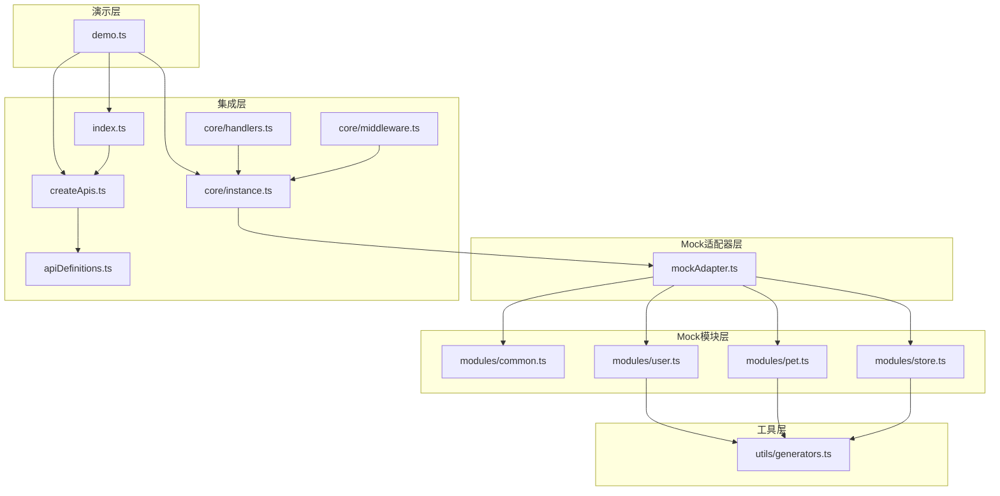
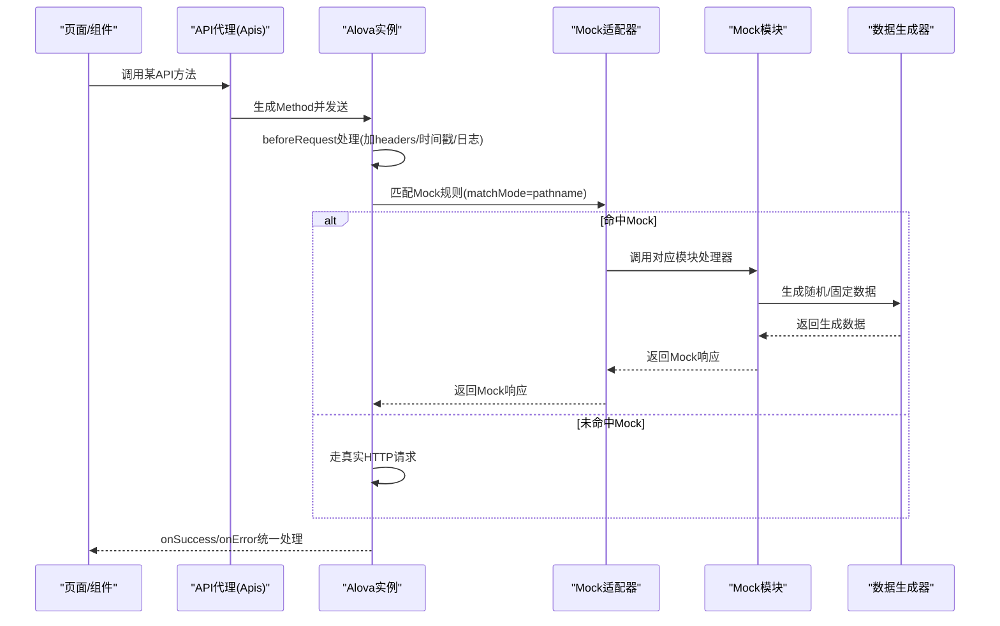
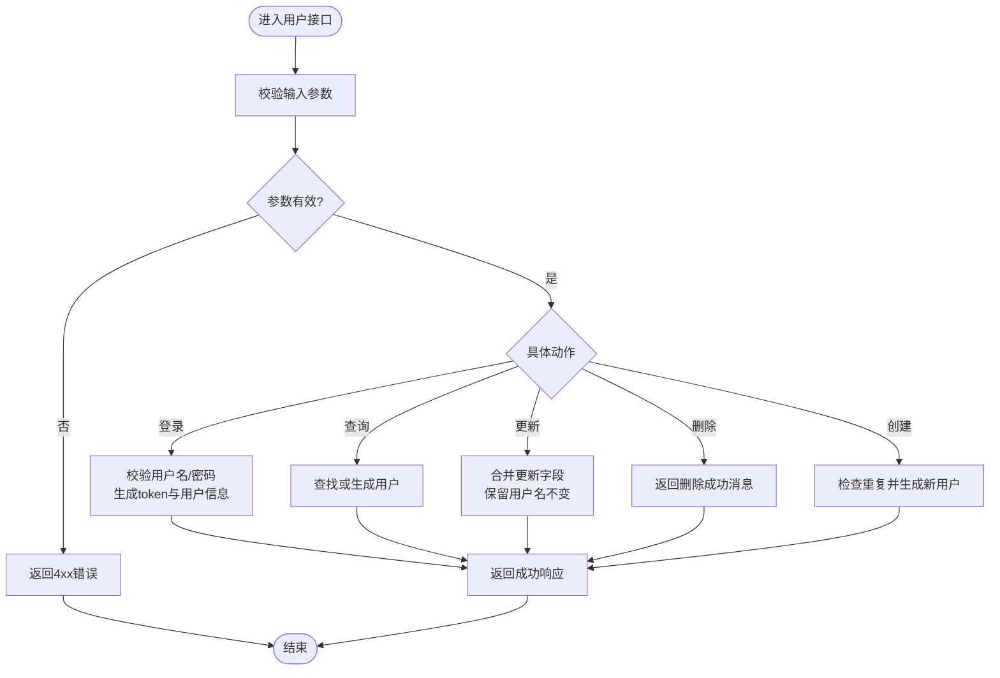
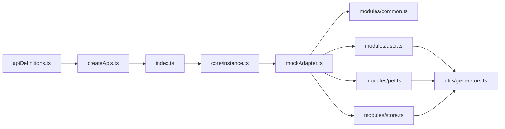

# Mock数据系统

<cite>
**本文档引用的文件**
- [mockAdapter.ts](file://chuan-bill-app/src/api/mock/mockAdapter.ts)
- [common.ts](file://chuan-bill-app/src/api/mock/modules/common.ts)
- [user.ts](file://chuan-bill-app/src/api/mock/modules/user.ts)
- [pet.ts](file://chuan-bill-app/src/api/mock/modules/pet.ts)
- [store.ts](file://chuan-bill-app/src/api/mock/modules/store.ts)
- [generators.ts](file://chuan-bill-app/src/api/mock/utils/generators.ts)
- [demo.ts](file://chuan-bill-app/src/api/mock/demo.ts)
- [README.md](file://chuan-bill-app/src/api/mock/README.md)
- [index.ts](file://chuan-bill-app/src/api/index.ts)
- [createApis.ts](file://chuan-bill-app/src/api/createApis.ts)
- [instance.ts](file://chuan-bill-app/src/api/core/instance.ts)
- [handlers.ts](file://chuan-bill-app/src/api/core/handlers.ts)
- [middleware.ts](file://chuan-bill-app/src/api/core/middleware.ts)
- [apiDefinitions.ts](file://chuan-bill-app/src/api/apiDefinitions.ts)
</cite>

## 目录
1. [简介](#简介)
2. [项目结构](#项目结构)
3. [核心组件](#核心组件)
4. [架构总览](#架构总览)
5. [详细组件分析](#详细组件分析)
6. [依赖关系分析](#依赖关系分析)
7. [性能考虑](#性能考虑)
8. [故障排除指南](#故障排除指南)
9. [结论](#结论)
10. [附录](#附录)

## 简介
本文件为小川记账项目的Mock数据系统技术文档，聚焦Mock模块化组织结构、适配器实现机制、数据生成策略以及开发/生产环境切换与维护策略。系统基于Alova与@alova/mock、@alova/adapter-uniapp构建，采用模块化Mock定义与统一适配器集成，支持通用与专用模块的数据模拟，并提供演示脚本帮助快速验证。

## 项目结构
Mock相关代码位于前端工程 chuan-bill-app/src/api/mock 目录，主要由以下层次构成：
- 适配器层：mockAdapter.ts 统一注册各模块Mock并配置HTTP适配器、延迟与日志
- 模块层：modules/common.ts、user.ts、pet.ts、store.ts 分别定义通用与业务域的Mock规则
- 工具层：utils/generators.ts 提供随机数据生成器，支撑Mock数据一致性与多样性
- 演示层：demo.ts 提供完整的业务流程演示与错误处理演示
- 集成层：index.ts、createApis.ts、instance.ts、handlers.ts、middleware.ts、apiDefinitions.ts 提供API定义、实例配置、响应/错误处理与中间件

图表来源
- [mockAdapter.ts:1-48](file://chuan-bill-app/src/api/mock/mockAdapter.ts#L1-L48)
- [common.ts:1-31](file://chuan-bill-app/src/api/mock/modules/common.ts#L1-L31)
- [user.ts:1-305](file://chuan-bill-app/src/api/mock/modules/user.ts#L1-L305)
- [pet.ts:1-240](file://chuan-bill-app/src/api/mock/modules/pet.ts#L1-L240)
- [store.ts:1-174](file://chuan-bill-app/src/api/mock/modules/store.ts#L1-L174)
- [generators.ts:1-143](file://chuan-bill-app/src/api/mock/utils/generators.ts#L1-L143)
- [demo.ts:1-437](file://chuan-bill-app/src/api/mock/demo.ts#L1-L437)
- [index.ts:1-19](file://chuan-bill-app/src/api/index.ts#L1-L19)
- [createApis.ts:1-95](file://chuan-bill-app/src/api/createApis.ts#L1-L95)
- [instance.ts:1-63](file://chuan-bill-app/src/api/core/instance.ts#L1-L63)
- [handlers.ts:1-105](file://chuan-bill-app/src/api/core/handlers.ts#L1-L105)
- [middleware.ts:1-93](file://chuan-bill-app/src/api/core/middleware.ts#L1-L93)
- [apiDefinitions.ts:1-38](file://chuan-bill-app/src/api/apiDefinitions.ts#L1-L38)

章节来源
- [mockAdapter.ts:1-48](file://chuan-bill-app/src/api/mock/mockAdapter.ts#L1-L48)
- [common.ts:1-31](file://chuan-bill-app/src/api/mock/modules/common.ts#L1-L31)
- [user.ts:1-305](file://chuan-bill-app/src/api/mock/modules/user.ts#L1-L305)
- [pet.ts:1-240](file://chuan-bill-app/src/api/mock/modules/pet.ts#L1-L240)
- [store.ts:1-174](file://chuan-bill-app/src/api/mock/modules/store.ts#L1-L174)
- [generators.ts:1-143](file://chuan-bill-app/src/api/mock/utils/generators.ts#L1-L143)
- [demo.ts:1-437](file://chuan-bill-app/src/api/mock/demo.ts#L1-L437)
- [index.ts:1-19](file://chuan-bill-app/src/api/index.ts#L1-L19)
- [createApis.ts:1-95](file://chuan-bill-app/src/api/createApis.ts#L1-L95)
- [instance.ts:1-63](file://chuan-bill-app/src/api/core/instance.ts#L1-L63)
- [handlers.ts:1-105](file://chuan-bill-app/src/api/core/handlers.ts#L1-L105)
- [middleware.ts:1-93](file://chuan-bill-app/src/api/core/middleware.ts#L1-L93)
- [apiDefinitions.ts:1-38](file://chuan-bill-app/src/api/apiDefinitions.ts#L1-L38)

## 核心组件
- Mock适配器：统一聚合common、user、pet、store模块，配置HTTP适配器、UniApp Mock响应、启用开关、随机延迟与开发日志，路径匹配采用完整路径模式
- Mock模块：按领域划分，提供通用请求处理与具体业务接口的Mock实现
- 数据生成器：提供随机ID、名称、日期时间、布尔值、数组、基础/列表响应、业务对象等生成能力
- API集成：通过Alova实例注入Mock适配器，结合API定义与代理生成器，形成统一的请求/响应处理链

章节来源
- [mockAdapter.ts:13-45](file://chuan-bill-app/src/api/mock/mockAdapter.ts#L13-L45)
- [generators.ts:11-142](file://chuan-bill-app/src/api/mock/utils/generators.ts#L11-L142)
- [instance.ts:7-60](file://chuan-bill-app/src/api/core/instance.ts#L7-L60)
- [createApis.ts:22-71](file://chuan-bill-app/src/api/createApis.ts#L22-L71)
- [apiDefinitions.ts:19-37](file://chuan-bill-app/src/api/apiDefinitions.ts#L19-L37)

## 架构总览
Mock系统通过适配器将模块化的Mock规则注入到Alova实例中，请求在beforeRequest阶段统一处理，随后根据匹配规则返回Mock响应或走真实HTTP请求；响应通过统一的处理函数进行成功/错误处理与全局提示。

图表来源
- [instance.ts:15-36](file://chuan-bill-app/src/api/core/instance.ts#L15-L36)
- [mockAdapter.ts:28-44](file://chuan-bill-app/src/api/mock/mockAdapter.ts#L28-L44)
- [user.ts:35-304](file://chuan-bill-app/src/api/mock/modules/user.ts#L35-L304)
- [pet.ts:54-239](file://chuan-bill-app/src/api/mock/modules/pet.ts#L54-L239)
- [store.ts:30-173](file://chuan-bill-app/src/api/mock/modules/store.ts#L30-L173)
- [generators.ts:11-142](file://chuan-bill-app/src/api/mock/utils/generators.ts#L11-L142)

## 详细组件分析

### Mock适配器分析
- 组合策略：导入common、user、pet、store四个模块，合并为allMocks数组
- 适配器配置：
  - httpAdapter: uniappRequestAdapter，用于非Mock请求走真实HTTP
  - onMockResponse: uniappMockResponse，统一Mock响应格式
  - enable: true，全局启用Mock
  - delay: 200-600ms随机延迟，模拟网络抖动
  - mockRequestLogger: 开发环境开启请求日志
  - matchMode: 'pathname'，使用完整路径匹配
- 作用：将Mock规则注入Alova实例，实现请求拦截与响应模拟

章节来源
- [mockAdapter.ts:14-45](file://chuan-bill-app/src/api/mock/mockAdapter.ts#L14-L45)
- [instance.ts:11-13](file://chuan-bill-app/src/api/core/instance.ts#L11-L13)

### 通用模块(common.ts)
- 通用规则：对GET/POST通配路径进行统一处理，记录请求参数并返回基础响应结构
- 设计意图：为未专门覆盖的接口提供兜底Mock，便于快速开发

章节来源
- [common.ts:14-30](file://chuan-bill-app/src/api/mock/modules/common.ts#L14-L30)

### 用户模块(user.ts)
- 数据模型：定义用户状态枚举、用户对象生成函数与模拟用户库
- 接口覆盖：
  - 批量创建用户（数组/列表）
  - 登录（含用户名/密码校验与令牌生成）
  - 登出
  - 根据用户名查询/更新/删除用户
  - 创建用户（含重复用户名校验）
- 错误处理：针对缺失参数、用户不存在、用户名冲突等情况返回相应状态码与消息
- 动态构造：利用生成器生成随机ID、姓名、电话、时间戳等字段

图表来源
- [user.ts:36-304](file://chuan-bill-app/src/api/mock/modules/user.ts#L36-L304)
- [generators.ts:17-30](file://chuan-bill-app/src/api/mock/utils/generators.ts#L17-L30)

章节来源
- [user.ts:17-30](file://chuan-bill-app/src/api/mock/modules/user.ts#L17-L30)
- [user.ts:36-304](file://chuan-bill-app/src/api/mock/modules/user.ts#L36-L304)

### 宠物模块(pet.ts)
- 数据模型：定义宠物状态、类别、标签集合与宠物对象生成函数
- 接口覆盖：
  - 图片上传
  - 新增/更新宠物
  - 按状态查询（支持多状态）
  - 按ID查询/更新/删除（含API Key校验）
- 错误处理：针对非法ID、状态校验失败、缺少API Key等情况返回相应状态码与消息
- 动态构造：随机生成类别、标签、照片URL、状态等

章节来源
- [pet.ts:17-52](file://chuan-bill-app/src/api/mock/modules/pet.ts#L17-L52)
- [pet.ts:54-239](file://chuan-bill-app/src/api/mock/modules/pet.ts#L54-L239)

### 商店模块(store.ts)
- 数据模型：定义订单状态与订单对象生成函数
- 接口覆盖：
  - 查询库存（随机生成各状态数量）
  - 下单购买（校验petId与quantity）
  - 按ID查询/删除订单（含ID范围校验）
- 错误处理：针对非法ID、数量校验失败等情况返回相应状态码与消息
- 动态构造：随机生成订单ID、数量、发货日期与状态

章节来源
- [store.ts:17-28](file://chuan-bill-app/src/api/mock/modules/store.ts#L17-L28)
- [store.ts:30-173](file://chuan-bill-app/src/api/mock/modules/store.ts#L30-L173)

### 数据生成器(utils/generators.ts)
- 能力清单：
  - 基础类型：id、name、code、boolean、number
  - 时间类：date、datetime（支持天数偏移）
  - 结构类：array、baseResponse、listResponse
  - 业务对象：gcn、faEmp、vehSaleEmp、permission、codeName、user、goods、stat
- 设计原则：统一的随机性与可扩展性，支持固定/随机组合，便于Mock数据一致性与多样性

章节来源
- [generators.ts:11-142](file://chuan-bill-app/src/api/mock/utils/generators.ts#L11-L142)

### 演示脚本(demo.ts)
- 功能：提供Pet、Store、User模块的演示方法，涵盖正常流程、错误处理与CRUD操作
- 使用：可直接在控制台运行runMockDemo或调用各模块演示方法，快速验证Mock行为

章节来源
- [demo.ts:7-437](file://chuan-bill-app/src/api/mock/demo.ts#L7-L437)

### API集成与实例配置
- API代理：通过createApis基于apiDefinitions生成类型安全的API代理对象
- Alova实例：注入Mock适配器，配置beforeRequest（统一header、Content-Type、GET防缓存）、响应/错误处理、超时与缓存策略
- 中间件：提供延迟加载与全局加载中间件，改善交互体验

章节来源
- [createApis.ts:22-71](file://chuan-bill-app/src/api/createApis.ts#L22-L71)
- [apiDefinitions.ts:19-37](file://chuan-bill-app/src/api/apiDefinitions.ts#L19-L37)
- [instance.ts:7-60](file://chuan-bill-app/src/api/core/instance.ts#L7-L60)
- [handlers.ts:34-104](file://chuan-bill-app/src/api/core/handlers.ts#L34-L104)
- [middleware.ts:7-93](file://chuan-bill-app/src/api/core/middleware.ts#L7-L93)

## 依赖关系分析
- 组件耦合：
  - mockAdapter依赖各模块导出的Mock定义
  - 各业务模块依赖generators进行数据生成
  - 实例配置依赖适配器与处理器
- 关键依赖链：
  - apiDefinitions → createApis → index → 实例 → mockAdapter → 各模块 → 生成器
- 潜在风险：
  - 模块间共享的生成器需保持稳定，避免破坏既有Mock契约
  - 路径匹配模式影响请求命中率，需确保API定义与Mock路径一致

图表来源
- [apiDefinitions.ts:19-37](file://chuan-bill-app/src/api/apiDefinitions.ts#L19-L37)
- [createApis.ts:22-71](file://chuan-bill-app/src/api/createApis.ts#L22-L71)
- [index.ts:14-18](file://chuan-bill-app/src/api/index.ts#L14-L18)
- [instance.ts:4-13](file://chuan-bill-app/src/api/core/instance.ts#L4-L13)
- [mockAdapter.ts:14-25](file://chuan-bill-app/src/api/mock/mockAdapter.ts#L14-L25)
- [generators.ts:10-11](file://chuan-bill-app/src/api/mock/utils/generators.ts#L10-L11)

## 性能考虑
- Mock延迟：随机200-600ms延迟有助于模拟真实网络，但可能影响自动化测试速度；建议在CI中关闭或缩短延迟
- 日志输出：开发环境开启请求日志便于调试，生产环境建议关闭以减少开销
- 数据生成：生成器采用简单随机算法，复杂度低；大量列表生成时注意内存占用
- 缓存策略：实例显式关闭缓存，避免Mock数据被缓存影响一致性

## 故障排除指南
- Mock未生效
  - 检查mockAdapter.enable是否为true
  - 确认请求路径与matchMode配置一致
- 响应异常
  - 查看beforeRequest中headers与GET防缓存参数是否正确
  - 检查响应处理函数是否抛出错误或触发路由跳转
- 常见错误场景
  - 用户/宠物/订单ID非法：检查ID合法性与边界条件
  - 登录失败：确认用户名/密码参数是否齐全
  - API Key缺失：确认删除宠物接口的headers配置

章节来源
- [mockAdapter.ts:35-44](file://chuan-bill-app/src/api/mock/mockAdapter.ts#L35-L44)
- [instance.ts:15-36](file://chuan-bill-app/src/api/core/instance.ts#L15-L36)
- [handlers.ts:42-51](file://chuan-bill-app/src/api/core/handlers.ts#L42-L51)
- [user.ts:103-147](file://chuan-bill-app/src/api/mock/modules/user.ts#L103-L147)
- [pet.ts:197-238](file://chuan-bill-app/src/api/mock/modules/pet.ts#L197-L238)
- [store.ts:131-172](file://chuan-bill-app/src/api/mock/modules/store.ts#L131-L172)

## 结论
该Mock数据系统通过模块化设计与统一适配器实现了高内聚、低耦合的Mock方案。通用模块提供兜底能力，业务模块覆盖关键接口，生成器保证数据一致性与多样性。配合完善的演示脚本与响应/错误处理机制，能够高效支撑开发与测试工作流。建议在团队协作中明确模块职责与生成器契约，确保Mock数据的稳定性与可维护性。

## 附录

### 开发/生产环境切换与Mock控制
- 环境变量：通过import.meta.env.MODE控制开发日志输出
- Mock开关：mockAdapter.enable可全局启用/禁用Mock
- 路径匹配：matchMode='pathname'确保精确匹配
- 基础URL：实例配置中根据环境设置baseURL与H5兼容

章节来源
- [mockAdapter.ts:42-44](file://chuan-bill-app/src/api/mock/mockAdapter.ts#L42-L44)
- [instance.ts:8-10](file://chuan-bill-app/src/api/core/instance.ts#L8-L10)
- [instance.ts:29-36](file://chuan-bill-app/src/api/core/instance.ts#L29-L36)

### Mock数据生成策略
- 固定模板：枚举状态、预设类别与标签
- 随机生成：ID、名称、日期时间、布尔值、数组长度
- 动态构造：根据输入参数与上下文生成响应数据
- 响应封装：统一的baseResponse与listResponse结构

章节来源
- [generators.ts:17-30](file://chuan-bill-app/src/api/mock/utils/generators.ts#L17-L30)
- [generators.ts:56-70](file://chuan-bill-app/src/api/mock/utils/generators.ts#L56-L70)
- [user.ts:17-30](file://chuan-bill-app/src/api/mock/modules/user.ts#L17-L30)
- [pet.ts:36-52](file://chuan-bill-app/src/api/mock/modules/pet.ts#L36-L52)
- [store.ts:17-28](file://chuan-bill-app/src/api/mock/modules/store.ts#L17-L28)

### 维护策略与协作规范
- 模块职责：common负责通用兜底，user/pet/store分别覆盖对应业务域
- 版本控制：通过Git管理Mock模块变更，配合PR审查确保一致性
- 团队协作：约定新增接口先在Mock中实现，再补充真实服务端实现
- 文档与演示：README与demo脚本同步更新，确保开发者快速上手

章节来源
- [README.md:1-108](file://chuan-bill-app/src/api/mock/README.md#L1-L108)
- [demo.ts:404-437](file://chuan-bill-app/src/api/mock/demo.ts#L404-L437)