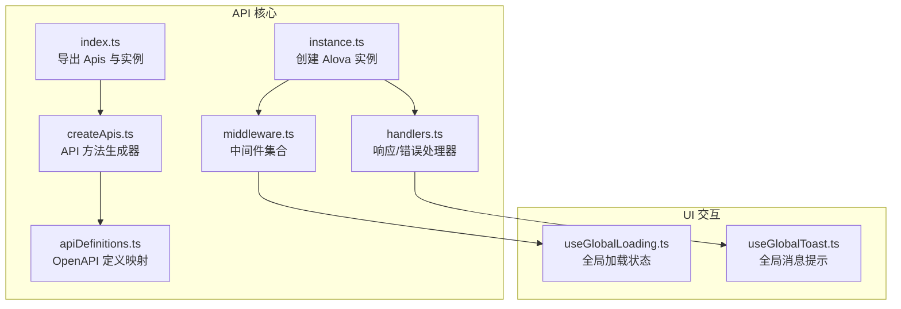
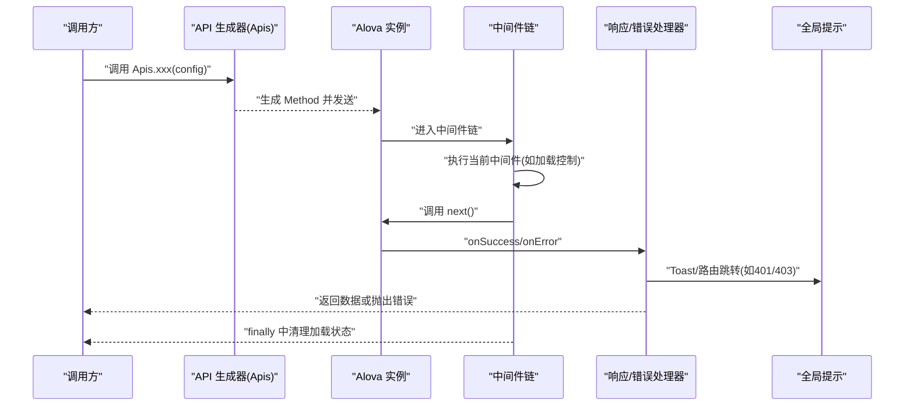
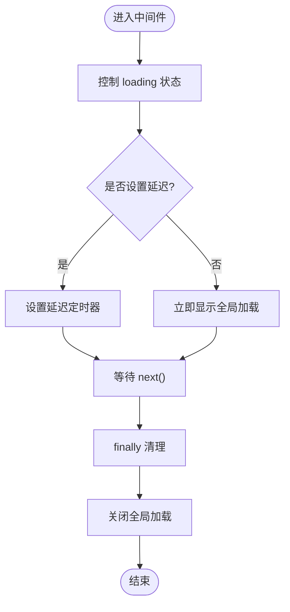
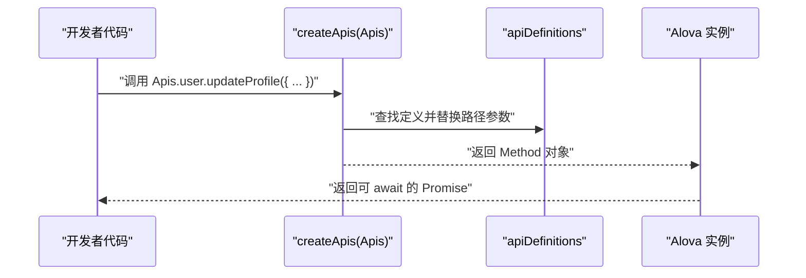
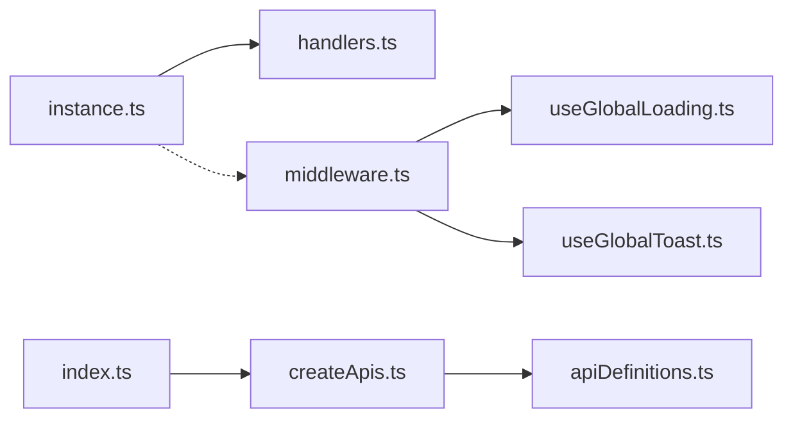

# 中间件系统

<cite>
**本文引用的文件**
- [middleware.ts](file://chuan-bill-app/src/api/core/middleware.ts)
- [handlers.ts](file://chuan-bill-app/src/api/core/handlers.ts)
- [instance.ts](file://chuan-bill-app/src/api/core/instance.ts)
- [createApis.ts](file://chuan-bill-app/src/api/createApis.ts)
- [apiDefinitions.ts](file://chuan-bill-app/src/api/apiDefinitions.ts)
- [index.ts](file://chuan-bill-app/src/api/index.ts)
- [useGlobalLoading.ts](file://chuan-bill-app/src/composables/useGlobalLoading.ts)
- [useGlobalToast.ts](file://chuan-bill-app/src/composables/useGlobalToast.ts)
</cite>

## 目录
1. [简介](#简介)
2. [项目结构](#项目结构)
3. [核心组件](#核心组件)
4. [架构总览](#架构总览)
5. [详细组件分析](#详细组件分析)
6. [依赖关系分析](#依赖关系分析)
7. [性能考量](#性能考量)
8. [故障排查指南](#故障排查指南)
9. [结论](#结论)
10. [附录：自定义中间件开发指南](#附录自定义中间件开发指南)

## 简介
本技术文档聚焦于“小川记账”前端中间件系统，围绕 Alova 中间件的注册、执行顺序与上下文传递进行深入解析，并结合项目现有实现，系统阐述请求中间件在 token 验证、权限检查、参数预处理方面的职责边界；以及响应中间件在数据转换、状态码判断与错误统一处理上的策略。同时，文档给出中间件链式调用机制、异常传播路径、性能监控建议，并提供可扩展的自定义中间件开发指南（异步中间件、条件中间件、错误恢复中间件）。

## 项目结构
本项目采用“按功能域分层”的组织方式，API 核心位于 chuan-bill-app/src/api，包含实例化、中间件、响应处理器、API 定义与生成器等模块；UI 交互通过 composables 提供全局 Loading/Toast 状态管理；页面与业务逻辑在 pages 与 composables 下实现。

图表来源
- [instance.ts:1-63](file://chuan-bill-app/src/api/core/instance.ts#L1-L63)
- [handlers.ts:1-105](file://chuan-bill-app/src/api/core/handlers.ts#L1-L105)
- [middleware.ts:1-93](file://chuan-bill-app/src/api/core/middleware.ts#L1-L93)
- [createApis.ts:1-95](file://chuan-bill-app/src/api/createApis.ts#L1-L95)
- [apiDefinitions.ts:1-38](file://chuan-bill-app/src/api/apiDefinitions.ts#L1-L38)
- [index.ts:1-19](file://chuan-bill-app/src/api/index.ts#L1-L19)
- [useGlobalLoading.ts:1-38](file://chuan-bill-app/src/composables/useGlobalLoading.ts#L1-L38)
- [useGlobalToast.ts:1-62](file://chuan-bill-app/src/composables/useGlobalToast.ts#L1-L62)

章节来源
- [index.ts:1-19](file://chuan-bill-app/src/api/index.ts#L1-L19)
- [createApis.ts:1-95](file://chuan-bill-app/src/api/createApis.ts#L1-L95)
- [apiDefinitions.ts:1-38](file://chuan-bill-app/src/api/apiDefinitions.ts#L1-L38)

## 核心组件
- Alova 实例与适配器
  - 在实例化阶段配置基础 URL、UniApp 适配器、Vue Hook、beforeRequest 请求前置钩子、responded 响应回调（onSuccess/onError/onComplete）、超时与缓存策略。
- 响应与错误处理器
  - 统一处理 HTTP 状态码、401/403 权限失效、网络/超时/未知错误，并通过全局 Toast 进行用户反馈。
- 中间件集合
  - 提供延迟加载与全局加载两类中间件，均通过上下文控制 loading 状态并在 finally 中清理。
- API 生成器
  - 基于 OpenAPI 定义动态生成 Method 对象，支持路径参数替换、FormData 转换与方法配置合并。
- 全局状态管理
  - useGlobalLoading/useGlobalToast 提供全局加载与消息提示的状态与动作。

章节来源
- [instance.ts:1-63](file://chuan-bill-app/src/api/core/instance.ts#L1-L63)
- [handlers.ts:1-105](file://chuan-bill-app/src/api/core/handlers.ts#L1-L105)
- [middleware.ts:1-93](file://chuan-bill-app/src/api/core/middleware.ts#L1-L93)
- [createApis.ts:1-95](file://chuan-bill-app/src/api/createApis.ts#L1-L95)
- [apiDefinitions.ts:1-38](file://chuan-bill-app/src/api/apiDefinitions.ts#L1-L38)
- [useGlobalLoading.ts:1-38](file://chuan-bill-app/src/composables/useGlobalLoading.ts#L1-L38)
- [useGlobalToast.ts:1-62](file://chuan-bill-app/src/composables/useGlobalToast.ts#L1-L62)

## 架构总览
下图展示了从调用方发起请求到响应处理的整体流程，以及中间件与响应处理器的协作关系。

图表来源
- [createApis.ts:65-72](file://chuan-bill-app/src/api/createApis.ts#L65-L72)
- [instance.ts:15-51](file://chuan-bill-app/src/api/core/instance.ts#L15-L51)
- [handlers.ts:34-68](file://chuan-bill-app/src/api/core/handlers.ts#L34-L68)
- [handlers.ts:71-104](file://chuan-bill-app/src/api/core/handlers.ts#L71-L104)
- [middleware.ts:58-86](file://chuan-bill-app/src/api/core/middleware.ts#L58-L86)

## 详细组件分析

### 中间件注册与执行顺序
- 注册位置
  - 当前项目在 Alova 实例中未直接配置 middleware，而是通过 useRequest/useCommand 等调用时传入 middleware 选项来启用中间件。
- 执行顺序
  - 中间件以链式顺序执行，每个中间件通过 next() 将控制权交给下一个中间件；最后由响应处理器接管。
- 上下文传递
  - 中间件接收上下文对象与 next 函数；上下文包含控制 loading 的能力与代理状态（proxyStates），用于在中间件内读取/更新 loading 状态。

章节来源
- [middleware.ts:7-22](file://chuan-bill-app/src/api/core/middleware.ts#L7-L22)
- [middleware.ts:49-87](file://chuan-bill-app/src/api/core/middleware.ts#L49-L87)
- [index.ts:14-18](file://chuan-bill-app/src/api/index.ts#L14-L18)

### 请求中间件：token 验证、权限检查、参数预处理
- token 验证与权限检查
  - 在 beforeRequest 钩子中为请求注入固定 token（当前为示例值），并在响应处理器中对 401/403 进行统一拦截与路由跳转。
- 参数预处理
  - 对 POST/PUT/PATCH 请求自动设置 Content-Type；对 GET 请求添加时间戳参数防止缓存；对 FormData 场景进行自动转换。
- 中间件补充建议
  - 若需基于会话/令牌续期，可在中间件中实现刷新令牌与重试策略；若需细粒度权限校验，可在中间件中根据路由/接口元信息进行拦截。

章节来源
- [instance.ts:15-37](file://chuan-bill-app/src/api/core/instance.ts#L15-L37)
- [handlers.ts:42-57](file://chuan-bill-app/src/api/core/handlers.ts#L42-L57)

### 响应中间件：数据转换、状态码判断、错误统一处理
- 数据转换
  - 响应处理器期望后端返回统一结构（含 code/message/data/timestamp），并打印开发环境日志。
- 状态码判断
  - 对 401/403 进行登录态失效处理（Toast+路由跳转）；对其他 4xx+ 抛出统一错误。
- 错误统一处理
  - 区分网络错误、超时、API 自定义错误与未知错误，统一通过 Toast 反馈给用户，并抛出原始错误以便上层捕获。

章节来源
- [handlers.ts:25-31](file://chuan-bill-app/src/api/core/handlers.ts#L25-L31)
- [handlers.ts:34-68](file://chuan-bill-app/src/api/core/handlers.ts#L34-L68)
- [handlers.ts:71-104](file://chuan-bill-app/src/api/core/handlers.ts#L71-L104)

### 中间件链式调用机制与异常传播
- 链式调用
  - 中间件通过 next() 串联，当前中间件完成自身逻辑后调用 next()，next 返回后再继续后续清理逻辑（如 finally 中关闭 loading）。
- 异常传播
  - 响应处理器抛出的错误会被上层捕获；若中间件内部发生异常，同样会中断链路并进入 onError 流程。
- 性能监控建议
  - 可在中间件链两端记录时间戳，统计请求耗时；在 finally 中确保资源释放与状态复位。

章节来源
- [middleware.ts:58-86](file://chuan-bill-app/src/api/core/middleware.ts#L58-L86)
- [handlers.ts:71-104](file://chuan-bill-app/src/api/core/handlers.ts#L71-L104)

### 加载中间件实现细节
- 延迟加载中间件
  - 控制 loading 状态，支持延迟显示，避免快速请求导致的闪烁。
- 全局加载中间件
  - 通过 useGlobalLoading 管理全局加载状态，支持延迟显示与自定义文案；在 finally 中统一关闭。

图表来源
- [middleware.ts:7-22](file://chuan-bill-app/src/api/core/middleware.ts#L7-L22)
- [middleware.ts:49-87](file://chuan-bill-app/src/api/core/middleware.ts#L49-L87)
- [useGlobalLoading.ts:21-35](file://chuan-bill-app/src/composables/useGlobalLoading.ts#L21-L35)

章节来源
- [middleware.ts:1-93](file://chuan-bill-app/src/api/core/middleware.ts#L1-L93)
- [useGlobalLoading.ts:1-38](file://chuan-bill-app/src/composables/useGlobalLoading.ts#L1-L38)

### API 生成与调用流程
- API 生成器
  - 基于 apiDefinitions 的映射，动态生成 Method 对象；支持路径参数替换、FormData 转换与方法配置合并。
- 调用入口
  - 通过 Apis.xxx(config) 发起请求，最终由 Alova 实例发送并进入中间件链与响应处理器。

图表来源
- [createApis.ts:22-63](file://chuan-bill-app/src/api/createApis.ts#L22-L63)
- [apiDefinitions.ts:19-37](file://chuan-bill-app/src/api/apiDefinitions.ts#L19-L37)
- [index.ts:14-18](file://chuan-bill-app/src/api/index.ts#L14-L18)

章节来源
- [createApis.ts:1-95](file://chuan-bill-app/src/api/createApis.ts#L1-L95)
- [apiDefinitions.ts:1-38](file://chuan-bill-app/src/api/apiDefinitions.ts#L1-L38)
- [index.ts:1-19](file://chuan-bill-app/src/api/index.ts#L1-L19)

## 依赖关系分析
- 模块耦合
  - instance.ts 依赖 handlers.ts；middleware.ts 依赖 composables（useGlobalLoading/useGlobalToast）；createApis.ts 依赖 apiDefinitions.ts；index.ts 聚合导出。
- 外部依赖
  - Alova、@alova/adapter-uniapp、vue hook、Pinia Store（用于全局状态）。
- 潜在风险
  - beforeRequest 中硬编码 token 存在安全风险，建议改为从状态管理或安全存储中读取；401/403 路由跳转逻辑集中在响应处理器，需确保不会被中间件覆盖。

图表来源
- [instance.ts:1-63](file://chuan-bill-app/src/api/core/instance.ts#L1-L63)
- [handlers.ts:1-105](file://chuan-bill-app/src/api/core/handlers.ts#L1-L105)
- [middleware.ts:1-93](file://chuan-bill-app/src/api/core/middleware.ts#L1-L93)
- [createApis.ts:1-95](file://chuan-bill-app/src/api/createApis.ts#L1-L95)
- [apiDefinitions.ts:1-38](file://chuan-bill-app/src/api/apiDefinitions.ts#L1-L38)
- [index.ts:1-19](file://chuan-bill-app/src/api/index.ts#L1-L19)
- [useGlobalLoading.ts:1-38](file://chuan-bill-app/src/composables/useGlobalLoading.ts#L1-L38)
- [useGlobalToast.ts:1-62](file://chuan-bill-app/src/composables/useGlobalToast.ts#L1-L62)

章节来源
- [instance.ts:1-63](file://chuan-bill-app/src/api/core/instance.ts#L1-L63)
- [middleware.ts:1-93](file://chuan-bill-app/src/api/core/middleware.ts#L1-L93)
- [createApis.ts:1-95](file://chuan-bill-app/src/api/createApis.ts#L1-L95)
- [index.ts:1-19](file://chuan-bill-app/src/api/index.ts#L1-L19)

## 性能考量
- 缓存策略
  - 已显式关闭缓存（cacheFor=null），避免重复请求带来的状态不一致；如需缓存，建议在具体接口上按需开启并设置合理过期策略。
- 超时与并发
  - 默认超时较长（30 秒），适合大文件上传场景；建议对普通接口设置更短超时并支持取消。
- 中间件开销
  - 延迟加载中间件通过定时器避免闪烁，但可能带来微小的额外开销；建议在高频请求场景评估是否需要延迟。
- 日志与监控
  - 开发环境下打印请求/响应日志便于调试；生产环境建议接入埋点上报请求耗时、成功率与错误类型。

## 故障排查指南
- 登录态失效（401/403）
  - 现有逻辑：Toast 提示后延时跳转至登录页；若未触发跳转，检查响应处理器与路由配置。
- 网络/超时错误
  - 现有逻辑：区分网络错误与超时并通过 Toast 提示；若无提示，检查 useGlobalToast 状态是否正确更新。
- 请求未携带 token
  - 现有逻辑：beforeRequest 固定注入 token；若无效，检查 headers 是否被后续修改或被中间件覆盖。
- 加载状态异常
  - 现有逻辑：全局加载通过中间件控制；若无法关闭，检查 finally 分支与定时器清理。

章节来源
- [handlers.ts:42-57](file://chuan-bill-app/src/api/core/handlers.ts#L42-L57)
- [handlers.ts:79-87](file://chuan-bill-app/src/api/core/handlers.ts#L79-L87)
- [instance.ts:15-27](file://chuan-bill-app/src/api/core/instance.ts#L15-L27)
- [middleware.ts:58-86](file://chuan-bill-app/src/api/core/middleware.ts#L58-L86)

## 结论
本中间件系统以 Alova 为核心，结合自定义中间件与统一响应/错误处理器，实现了加载控制、参数预处理与错误统一反馈。当前实现清晰地分离了请求前置处理（beforeRequest）、中间件链（middleware）与响应处理（responded），具备良好的扩展性。建议后续在安全、权限与监控方面进一步完善，以满足生产级需求。

## 附录：自定义中间件开发指南
以下为常见中间件类型的实现模式与注意事项，便于在现有体系中扩展：

- 异步中间件
  - 模式：在中间件函数内执行异步任务（如鉴权刷新、埋点上报），完成后调用 next()。
  - 注意：确保在 finally 中清理资源，避免泄漏。
- 条件中间件
  - 模式：根据请求配置或上下文决定是否执行中间件逻辑；可结合路由/接口元信息进行开关控制。
  - 注意：保持中间件职责单一，避免过度耦合。
- 错误恢复中间件
  - 模式：在中间件内捕获并处理部分错误，必要时重试或降级；对不可恢复错误向上抛出。
  - 注意：避免吞掉关键错误，确保异常链路可追踪。