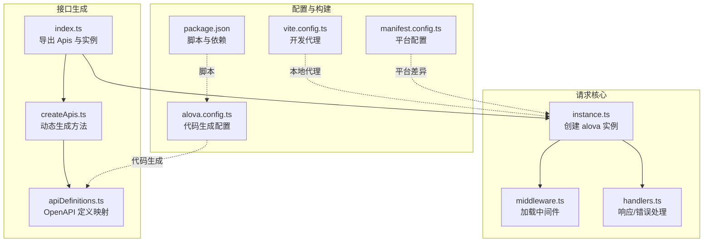
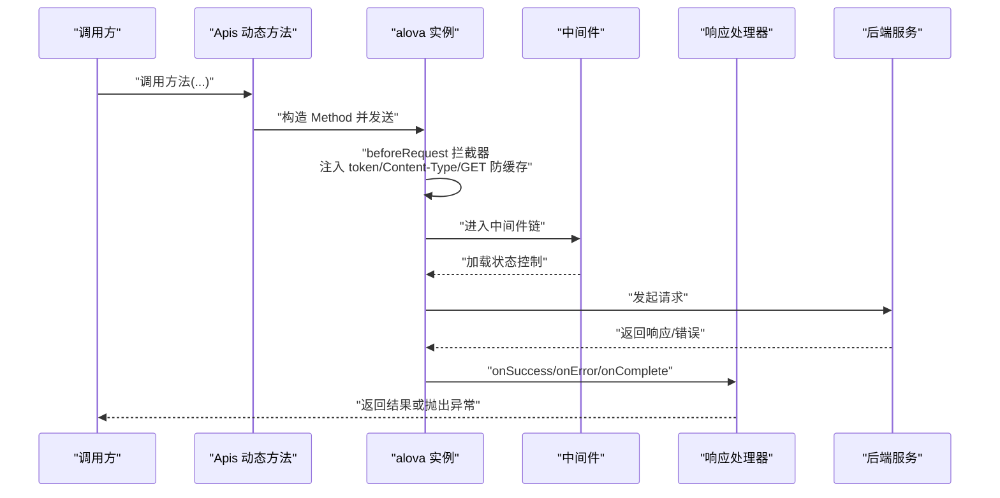
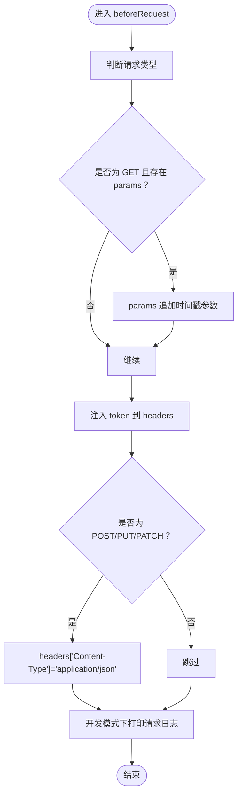
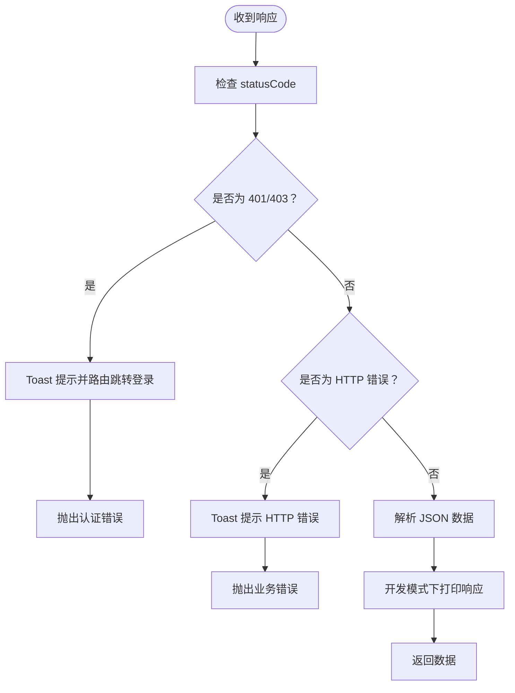
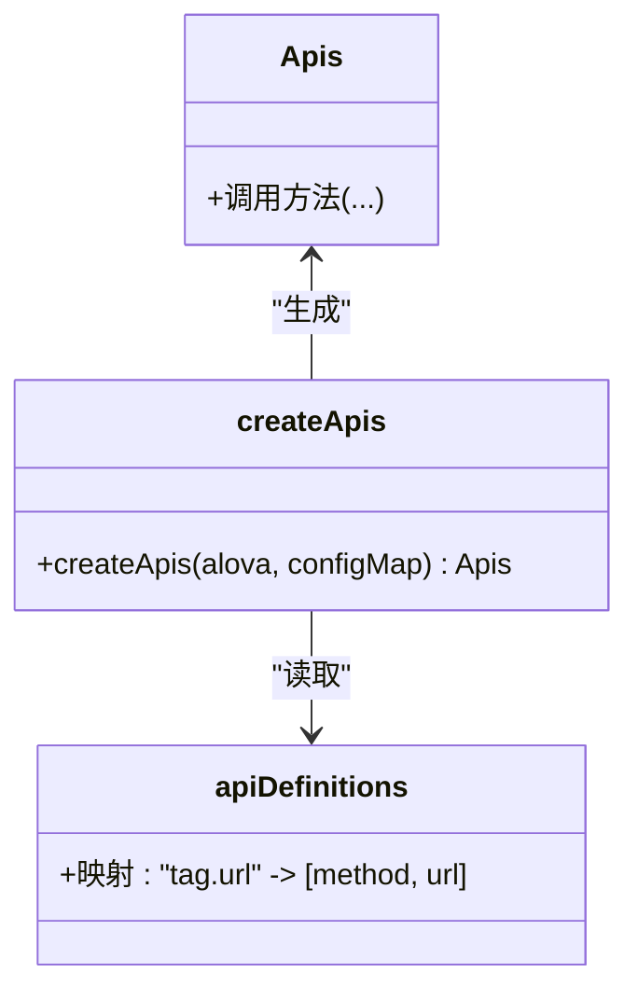
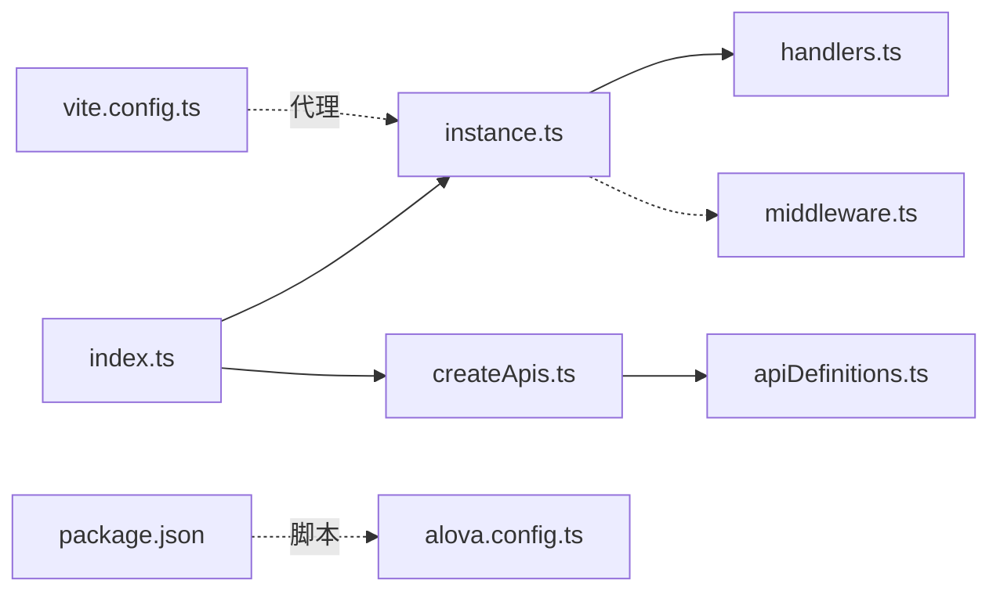

# 请求实例配置

<cite>
**本文引用的文件**
- [alova.config.ts](file://chuan-bill-app/alova.config.ts)
- [instance.ts](file://chuan-bill-app/src/api/core/instance.ts)
- [middleware.ts](file://chuan-bill-app/src/api/core/middleware.ts)
- [handlers.ts](file://chuan-bill-app/src/api/core/handlers.ts)
- [createApis.ts](file://chuan-bill-app/src/api/createApis.ts)
- [apiDefinitions.ts](file://chuan-bill-app/src/api/apiDefinitions.ts)
- [index.ts](file://chuan-bill-app/src/api/index.ts)
- [vite.config.ts](file://chuan-bill-app/vite.config.ts)
- [manifest.config.ts](file://chuan-bill-app/manifest.config.ts)
- [package.json](file://chuan-bill-app/package.json)
</cite>

## 目录
1. [简介](#简介)
2. [项目结构](#项目结构)
3. [核心组件](#核心组件)
4. [架构总览](#架构总览)
5. [详细组件分析](#详细组件分析)
6. [依赖关系分析](#依赖关系分析)
7. [性能与可用性建议](#性能与可用性建议)
8. [故障排查指南](#故障排查指南)
9. [结论](#结论)
10. [附录](#附录)

## 简介
本文件面向“小川记账”前端请求层，系统化梳理并解释基于 alova 的请求实例配置与运行机制。重点覆盖以下方面：
- alova 实例创建流程：baseURL、适配器、状态钩子、请求前拦截器、响应处理钩子、超时与缓存策略
- 请求前拦截器：token 注入、Content-Type 规范化、GET 防缓存参数注入
- 响应处理：成功/错误/完成回调的职责边界与异常分支
- 开发与生产环境差异、H5 平台特殊处理
- 高级配置：请求超时、缓存策略、并发控制、加载中间件等最佳实践

## 项目结构
围绕请求层的关键目录与文件如下：
- 请求核心：src/api/core 下的 instance.ts、middleware.ts、handlers.ts
- 接口生成与装配：src/api/createApis.ts、src/api/apiDefinitions.ts、src/api/index.ts
- 配置与生成：alova.config.ts
- 构建与代理：vite.config.ts
- 平台清单：manifest.config.ts
- 依赖与脚本：package.json

图表来源
- [instance.ts:1-63](file://chuan-bill-app/src/api/core/instance.ts#L1-L63)
- [middleware.ts:1-93](file://chuan-bill-app/src/api/core/middleware.ts#L1-L93)
- [handlers.ts:1-105](file://chuan-bill-app/src/api/core/handlers.ts#L1-L105)
- [createApis.ts:1-95](file://chuan-bill-app/src/api/createApis.ts#L1-L95)
- [apiDefinitions.ts:1-38](file://chuan-bill-app/src/api/apiDefinitions.ts#L1-L38)
- [index.ts:1-19](file://chuan-bill-app/src/api/index.ts#L1-L19)
- [alova.config.ts:1-85](file://chuan-bill-app/alova.config.ts#L1-L85)
- [vite.config.ts:1-80](file://chuan-bill-app/vite.config.ts#L1-L80)
- [manifest.config.ts:1-100](file://chuan-bill-app/manifest.config.ts#L1-L100)
- [package.json:1-135](file://chuan-bill-app/package.json#L1-L135)

章节来源
- [instance.ts:1-63](file://chuan-bill-app/src/api/core/instance.ts#L1-L63)
- [middleware.ts:1-93](file://chuan-bill-app/src/api/core/middleware.ts#L1-L93)
- [handlers.ts:1-105](file://chuan-bill-app/src/api/core/handlers.ts#L1-L105)
- [createApis.ts:1-95](file://chuan-bill-app/src/api/createApis.ts#L1-L95)
- [apiDefinitions.ts:1-38](file://chuan-bill-app/src/api/apiDefinitions.ts#L1-L38)
- [index.ts:1-19](file://chuan-bill-app/src/api/index.ts#L1-L19)
- [alova.config.ts:1-85](file://chuan-bill-app/alova.config.ts#L1-L85)
- [vite.config.ts:1-80](file://chuan-bill-app/vite.config.ts#L1-L80)
- [manifest.config.ts:1-100](file://chuan-bill-app/manifest.config.ts#L1-L100)
- [package.json:1-135](file://chuan-bill-app/package.json#L1-L135)

## 核心组件
- 请求实例 alovaInstance：负责统一的 baseURL、适配器、状态钩子、请求前拦截器、响应处理钩子、超时与缓存策略
- 中间件：提供延迟加载与全局加载中间件，用于优化 UI 体验
- 响应处理器：封装统一的成功/错误处理逻辑，含 401/403 特殊处理与 Toast 提示
- 接口生成器：根据 OpenAPI 定义动态生成方法调用，支持路径参数替换与表单数据自动转换

章节来源
- [instance.ts:7-60](file://chuan-bill-app/src/api/core/instance.ts#L7-L60)
- [middleware.ts:7-93](file://chuan-bill-app/src/api/core/middleware.ts#L7-L93)
- [handlers.ts:34-104](file://chuan-bill-app/src/api/core/handlers.ts#L34-L104)
- [createApis.ts:22-72](file://chuan-bill-app/src/api/createApis.ts#L22-L72)

## 架构总览
下图展示从调用方到后端服务的整体链路，以及关键节点的职责划分。

图表来源
- [instance.ts:15-51](file://chuan-bill-app/src/api/core/instance.ts#L15-L51)
- [middleware.ts:58-86](file://chuan-bill-app/src/api/core/middleware.ts#L58-L86)
- [handlers.ts:34-104](file://chuan-bill-app/src/api/core/handlers.ts#L34-L104)

## 详细组件分析

### 1) 请求实例创建与配置
- baseURL：在非 H5 平台通过环境变量注入；H5 平台在开发模式下会追加路径前缀以适配代理
- 适配器：使用 @alova/adapter-uniapp，并启用 mockRequest 以支持离线/联调
- 状态钩子：使用 vueHook，使请求状态可与 Vue 响应式系统联动
- 请求前拦截器：统一注入 token、规范化 Content-Type、对 GET 请求追加时间戳防缓存
- 响应处理钩子：统一 onSuccess、onError、onComplete 处理
- 超时与缓存：设置较长超时时间，全局关闭缓存
- 中间件：不在此处注册，而是通过 useRequest 的 middleware 选项按需启用

章节来源
- [instance.ts:8-13](file://chuan-bill-app/src/api/core/instance.ts#L8-L13)
- [instance.ts:15-37](file://chuan-bill-app/src/api/core/instance.ts#L15-L37)
- [instance.ts:40-51](file://chuan-bill-app/src/api/core/instance.ts#L40-L51)
- [instance.ts:56-60](file://chuan-bill-app/src/api/core/instance.ts#L56-L60)

### 2) 请求前拦截器实现
- token 添加：在 beforeRequest 中为 headers 注入固定 token（开发阶段占位）
- Content-Type 设置：对 POST/PUT/PATCH 请求统一设置为 application/json
- GET 防缓存：对 GET 请求且存在 params 时，追加时间戳参数以避免浏览器缓存

图表来源
- [instance.ts:15-37](file://chuan-bill-app/src/api/core/instance.ts#L15-L37)

章节来源
- [instance.ts:15-37](file://chuan-bill-app/src/api/core/instance.ts#L15-L37)

### 3) 响应处理机制
- 成功回调：校验状态码，记录开发日志，返回标准化响应对象
- 错误回调：区分网络错误、超时、业务错误与 401/403 场景，统一提示并抛出异常
- 完成回调：统一清理逻辑（如关闭 loading）

图表来源
- [handlers.ts:34-68](file://chuan-bill-app/src/api/core/handlers.ts#L34-L68)
- [handlers.ts:71-104](file://chuan-bill-app/src/api/core/handlers.ts#L71-L104)

章节来源
- [handlers.ts:34-68](file://chuan-bill-app/src/api/core/handlers.ts#L34-L68)
- [handlers.ts:71-104](file://chuan-bill-app/src/api/core/handlers.ts#L71-L104)

### 4) 接口生成与装配
- 动态生成：createApis 通过 Proxy 与 apiDefinitions 将 OpenAPI 描述映射为可调用的方法
- 路径参数替换：支持 {key} 形式的路径参数替换
- 表单数据处理：当 data 为对象且存在 Blob 时自动转换为 FormData
- 类型安全：withConfigType 与生成的 Apis 类型声明保证调用侧类型正确

图表来源
- [createApis.ts:22-72](file://chuan-bill-app/src/api/createApis.ts#L22-L72)
- [apiDefinitions.ts:19-37](file://chuan-bill-app/src/api/apiDefinitions.ts#L19-L37)

章节来源
- [createApis.ts:22-72](file://chuan-bill-app/src/api/createApis.ts#L22-L72)
- [apiDefinitions.ts:19-37](file://chuan-bill-app/src/api/apiDefinitions.ts#L19-L37)
- [index.ts:10-18](file://chuan-bill-app/src/api/index.ts#L10-L18)

### 5) 开发环境与生产环境差异化配置
- 环境变量：baseURL 通过 import.meta.env.VITE_API_BASE_URL 注入
- H5 平台：开发模式下自动追加 /api 前缀以适配本地代理
- 代理配置：vite.config.ts 中配置 /api 代理到后端服务地址
- 平台差异：manifest.config.ts 中针对不同小程序平台进行编译与运行时配置

章节来源
- [instance.ts:9,30-32](file://chuan-bill-app/src/api/core/instance.ts#L9,L30-L32)
- [vite.config.ts:70-78](file://chuan-bill-app/vite.config.ts#L70-L78)
- [manifest.config.ts:63-94](file://chuan-bill-app/manifest.config.ts#L63-L94)

### 6) 中间件与加载控制
- 延迟加载中间件：在请求完成后延迟关闭 loading，避免快速请求导致的闪烁
- 全局加载中间件：统一控制全局加载指示器，支持延迟显示与自定义文案
- 使用方式：通过 useRequest 的 middleware 选项启用

章节来源
- [middleware.ts:7-22](file://chuan-bill-app/src/api/core/middleware.ts#L7-L22)
- [middleware.ts:49-93](file://chuan-bill-app/src/api/core/middleware.ts#L49-L93)

## 依赖关系分析
- 组件耦合：instance.ts 依赖 handlers.ts 与中间件；createApis.ts 依赖 apiDefinitions.ts；index.ts 统一导出
- 外部依赖：@alova/adapter-uniapp、alova/vue、@alova/mock
- 构建与脚本：package.json 提供 alova 代码生成脚本；vite.config.ts 提供开发代理

图表来源
- [index.ts:1-19](file://chuan-bill-app/src/api/index.ts#L1-L19)
- [instance.ts:1-63](file://chuan-bill-app/src/api/core/instance.ts#L1-L63)
- [createApis.ts:1-95](file://chuan-bill-app/src/api/createApis.ts#L1-L95)
- [apiDefinitions.ts:1-38](file://chuan-bill-app/src/api/apiDefinitions.ts#L1-L38)
- [handlers.ts:1-105](file://chuan-bill-app/src/api/core/handlers.ts#L1-L105)
- [middleware.ts:1-93](file://chuan-bill-app/src/api/core/middleware.ts#L1-L93)
- [alova.config.ts:1-85](file://chuan-bill-app/alova.config.ts#L1-L85)
- [vite.config.ts:1-80](file://chuan-bill-app/vite.config.ts#L1-L80)
- [package.json:1-135](file://chuan-bill-app/package.json#L1-L135)

章节来源
- [index.ts:1-19](file://chuan-bill-app/src/api/index.ts#L1-L19)
- [instance.ts:1-63](file://chuan-bill-app/src/api/core/instance.ts#L1-L63)
- [createApis.ts:1-95](file://chuan-bill-app/src/api/createApis.ts#L1-L95)
- [apiDefinitions.ts:1-38](file://chuan-bill-app/src/api/apiDefinitions.ts#L1-L38)
- [handlers.ts:1-105](file://chuan-bill-app/src/api/core/handlers.ts#L1-L105)
- [middleware.ts:1-93](file://chuan-bill-app/src/api/core/middleware.ts#L1-L93)
- [alova.config.ts:1-85](file://chuan-bill-app/alova.config.ts#L1-L85)
- [vite.config.ts:1-80](file://chuan-bill-app/vite.config.ts#L1-L80)
- [package.json:1-135](file://chuan-bill-app/package.json#L1-L135)

## 性能与可用性建议
- 超时设置：当前实例设置较长超时时间，适合大文件上传或长耗时接口；对短链路接口可考虑缩短以提升交互反馈
- 缓存策略：全局关闭缓存可避免陈旧数据，但会增加带宽消耗；对 GET 列表类接口可结合服务端 ETag/Cache-Control 控制
- 并发控制：可通过中间件或上层调度限制并发请求数，避免资源争用
- 防抖与去重：对高频查询可在调用侧做防抖与重复请求去重
- 重试策略：对瞬时网络波动可引入指数退避重试，但需避免对幂等性差的请求滥用
- 日志与监控：开发模式下保留请求/响应日志，生产环境建议收敛日志并接入埋点

## 故障排查指南
- 401/403 异常：响应处理器与错误处理器均会识别并触发登录跳转，检查 token 注入与后端鉴权
- 网络错误/超时：检查代理配置与网络连通性；确认超时阈值与中间件加载策略
- GET 防缓存失效：确认 params 存在且为对象；H5 开发模式下 baseURL 已追加 /api 前缀
- H5 代理问题：确认 vite 代理规则与后端 CORS 配置一致
- 平台差异：小程序平台的编译与运行时配置可能影响请求行为，必要时在 manifest 中调整

章节来源
- [handlers.ts:42-51](file://chuan-bill-app/src/api/core/handlers.ts#L42-L51)
- [handlers.ts:79-87](file://chuan-bill-app/src/api/core/handlers.ts#L79-L87)
- [instance.ts:30-32](file://chuan-bill-app/src/api/core/instance.ts#L30-L32)
- [vite.config.ts:70-78](file://chuan-bill-app/vite.config.ts#L70-L78)
- [manifest.config.ts:63-94](file://chuan-bill-app/manifest.config.ts#L63-L94)

## 结论
本请求层以 alova 为核心，结合适配器与中间件，实现了统一的请求治理与响应处理。通过环境变量与平台配置，兼顾了多端一致性与差异化需求。建议在实际业务中进一步完善令牌管理、缓存与重试策略，并在调用侧做好并发与防抖控制，以获得更稳定与高效的用户体验。

## 附录
- 代码生成配置：alova.config.ts 定义了 OpenAPI 输入源、输出路径、媒体类型与自动更新策略
- 生成接口清单：apiDefinitions.ts 提供 tag.url 到 [method, url] 的映射
- 动态生成方法：createApis.ts 通过 Proxy 与 apiDefinitions.ts 生成可调用的 Apis 对象
- 导出入口：index.ts 统一导出 alova 实例与 Apis 对象

章节来源
- [alova.config.ts:8-84](file://chuan-bill-app/alova.config.ts#L8-L84)
- [apiDefinitions.ts:19-37](file://chuan-bill-app/src/api/apiDefinitions.ts#L19-L37)
- [createApis.ts:22-72](file://chuan-bill-app/src/api/createApis.ts#L22-L72)
- [index.ts:1-19](file://chuan-bill-app/src/api/index.ts#L1-L19)