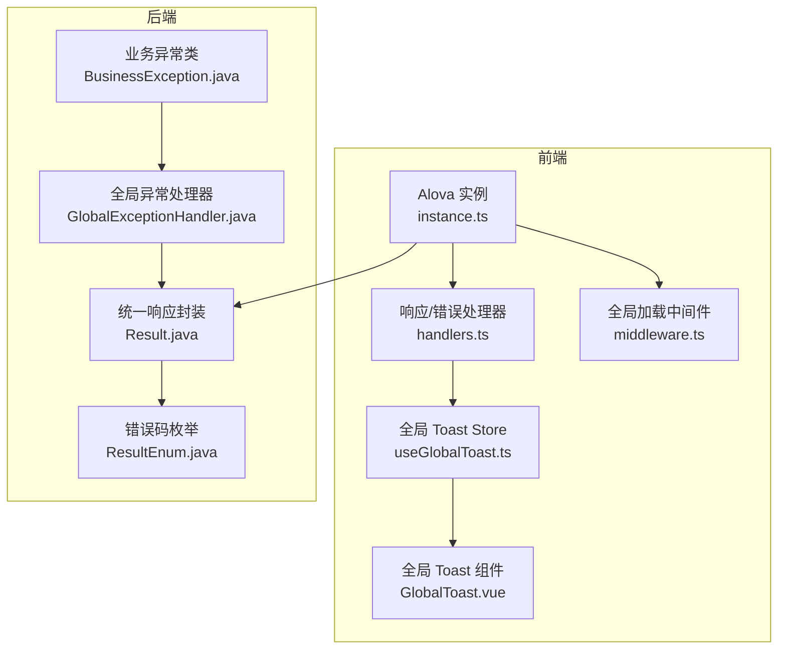
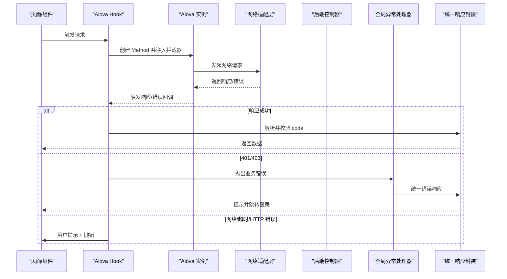
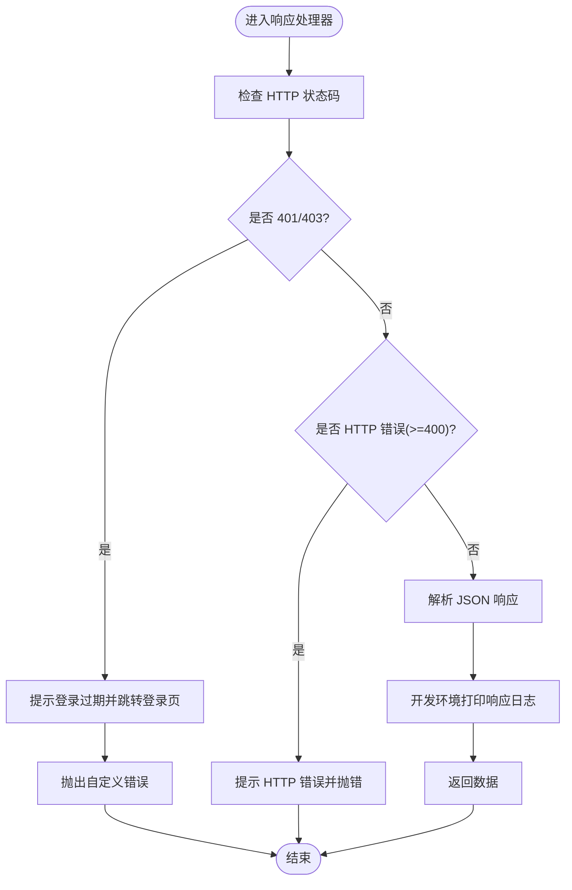
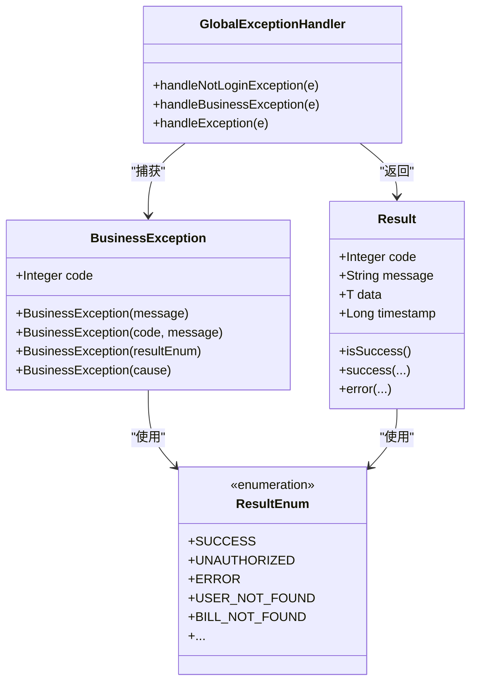
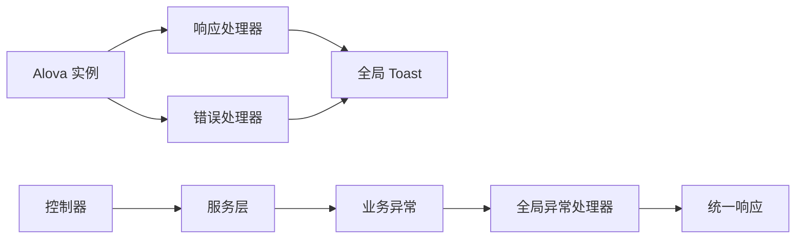

# 错误处理策略

<cite>
**本文引用的文件**
- [handlers.ts](file://chuan-bill-app/src/api/core/handlers.ts)
- [instance.ts](file://chuan-bill-app/src/api/core/instance.ts)
- [middleware.ts](file://chuan-bill-app/src/api/core/middleware.ts)
- [useGlobalToast.ts](file://chuan-bill-app/src/composables/useGlobalToast.ts)
- [GlobalToast.vue](file://chuan-bill-app/src/components/GlobalToast.vue)
- [GlobalExceptionHandler.java](file://chuan-bill-server/src/main/java/com/samoy/chuanbillserver/expection/GlobalExceptionHandler.java)
- [BusinessException.java](file://chuan-bill-server/src/main/java/com/samoy/chuanbillserver/expection/BusinessException.java)
- [Result.java](file://chuan-bill-server/src/main/java/com/samoy/chuanbillserver/result/Result.java)
- [ResultEnum.java](file://chuan-bill-server/src/main/java/com/samoy/chuanbillserver/result/ResultEnum.java)
- [AuthController.java](file://chuan-bill-server/src/main/java/com/samoy/chuanbillserver/controller/AuthController.java)
- [BillController.java](file://chuan-bill-server/src/main/java/com/samoy/chuanbillserver/controller/BillController.java)
</cite>

## 目录
1. [引言](#引言)
2. [项目结构](#项目结构)
3. [核心组件](#核心组件)
4. [架构总览](#架构总览)
5. [详细组件分析](#详细组件分析)
6. [依赖关系分析](#依赖关系分析)
7. [性能考虑](#性能考虑)
8. [故障排查指南](#故障排查指南)
9. [结论](#结论)
10. [附录](#附录)

## 引言
本文件面向“小川记账”项目的前端与后端错误处理策略，聚焦于全局错误处理机制、错误分类与处理流程、错误码映射、用户提示与日志记录、重试机制设计、错误恢复策略（降级、缓存回退、离线模式）、以及错误监控与性能影响评估方案。目标是帮助开发者在不深入源码的情况下理解整体错误处理体系，并为后续优化与扩展提供参考。

## 项目结构
小川记账采用前后端分离架构：
- 前端基于 Alova + UniApp，通过统一的响应与错误处理器完成网络层错误捕获与用户提示。
- 后端基于 Spring Boot，通过全局异常处理器统一捕获业务异常与系统异常，返回标准化响应。

图表来源
- [instance.ts:1-63](file://chuan-bill-app/src/api/core/instance.ts#L1-L63)
- [handlers.ts:1-105](file://chuan-bill-app/src/api/core/handlers.ts#L1-L105)
- [middleware.ts:1-93](file://chuan-bill-app/src/api/core/middleware.ts#L1-L93)
- [useGlobalToast.ts:1-62](file://chuan-bill-app/src/composables/useGlobalToast.ts#L1-L62)
- [GlobalToast.vue:1-47](file://chuan-bill-app/src/components/GlobalToast.vue#L1-L47)
- [GlobalExceptionHandler.java:1-50](file://chuan-bill-server/src/main/java/com/samoy/chuanbillserver/expection/GlobalExceptionHandler.java#L1-L50)
- [BusinessException.java:1-36](file://chuan-bill-server/src/main/java/com/samoy/chuanbillserver/expection/BusinessException.java#L1-L36)
- [Result.java:1-50](file://chuan-bill-server/src/main/java/com/samoy/chuanbillserver/result/Result.java#L1-L50)
- [ResultEnum.java:1-56](file://chuan-bill-server/src/main/java/com/samoy/chuanbillserver/result/ResultEnum.java#L1-L56)

章节来源
- [instance.ts:1-63](file://chuan-bill-app/src/api/core/instance.ts#L1-L63)
- [handlers.ts:1-105](file://chuan-bill-app/src/api/core/handlers.ts#L1-L105)
- [middleware.ts:1-93](file://chuan-bill-app/src/api/core/middleware.ts#L1-L93)
- [useGlobalToast.ts:1-62](file://chuan-bill-app/src/composables/useGlobalToast.ts#L1-L62)
- [GlobalToast.vue:1-47](file://chuan-bill-app/src/components/GlobalToast.vue#L1-L47)
- [GlobalExceptionHandler.java:1-50](file://chuan-bill-server/src/main/java/com/samoy/chuanbillserver/expection/GlobalExceptionHandler.java#L1-L50)
- [BusinessException.java:1-36](file://chuan-bill-server/src/main/java/com/samoy/chuanbillserver/expection/BusinessException.java#L1-L36)
- [Result.java:1-50](file://chuan-bill-server/src/main/java/com/samoy/chuanbillserver/result/Result.java#L1-L50)
- [ResultEnum.java:1-56](file://chuan-bill-server/src/main/java/com/samoy/chuanbillserver/result/ResultEnum.java#L1-L56)

## 核心组件
- 前端错误处理核心
  - 自定义错误类与统一响应结构：用于区分网络错误、超时、HTTP 状态错误与业务错误。
  - 响应处理器：解析响应、处理 401/403、HTTP 错误码、开发环境日志。
  - 错误处理器：对不同错误类型给出用户提示，必要时触发路由跳转。
  - 全局加载中间件：统一加载态管理，避免快速请求闪烁。
  - 全局 Toast：集中展示错误与成功提示。
- 后端错误处理核心
  - 全局异常处理器：统一捕获未登录、业务异常、系统异常，返回标准化 Result。
  - 业务异常类：携带业务错误码与消息。
  - 统一响应封装与错误码枚举：规范前后端交互格式。

章节来源
- [handlers.ts:1-105](file://chuan-bill-app/src/api/core/handlers.ts#L1-L105)
- [instance.ts:1-63](file://chuan-bill-app/src/api/core/instance.ts#L1-L63)
- [middleware.ts:1-93](file://chuan-bill-app/src/api/core/middleware.ts#L1-L93)
- [useGlobalToast.ts:1-62](file://chuan-bill-app/src/composables/useGlobalToast.ts#L1-L62)
- [GlobalExceptionHandler.java:1-50](file://chuan-bill-server/src/main/java/com/samoy/chuanbillserver/expection/GlobalExceptionHandler.java#L1-L50)
- [BusinessException.java:1-36](file://chuan-bill-server/src/main/java/com/samoy/chuanbillserver/expection/BusinessException.java#L1-L36)
- [Result.java:1-50](file://chuan-bill-server/src/main/java/com/samoy/chuanbillserver/result/Result.java#L1-L50)
- [ResultEnum.java:1-56](file://chuan-bill-server/src/main/java/com/samoy/chuanbillserver/result/ResultEnum.java#L1-L56)

## 架构总览
从前端到后端的错误处理链路如下：

图表来源
- [instance.ts:39-51](file://chuan-bill-app/src/api/core/instance.ts#L39-L51)
- [handlers.ts:34-68](file://chuan-bill-app/src/api/core/handlers.ts#L34-L68)
- [handlers.ts:70-104](file://chuan-bill-app/src/api/core/handlers.ts#L70-L104)
- [GlobalExceptionHandler.java:14-48](file://chuan-bill-server/src/main/java/com/samoy/chuanbillserver/expection/GlobalExceptionHandler.java#L14-L48)
- [Result.java:18-44](file://chuan-bill-server/src/main/java/com/samoy/chuanbillserver/result/Result.java#L18-L44)

## 详细组件分析

### 前端错误处理组件
- 自定义错误类与统一响应结构
  - 自定义错误类用于承载后端返回的业务错误码与数据，便于前端分支处理。
  - 统一响应结构包含 code、message、data、timestamp，便于前端统一解析与日志记录。
- 响应处理器
  - 对 401/403 进行特殊处理：提示登录过期并跳转登录页；抛出自定义错误以便上层统一处理。
  - 对 HTTP 错误码（>=400）进行提示并抛错。
  - 开发环境下打印响应日志，便于调试。
- 错误处理器
  - 区分网络错误、超时、自定义业务错误与未知错误，分别给出用户提示。
  - 对 401/403 的二次兜底处理：确保在响应处理器之外也能正确处理未授权。
  - 抛出原始错误以供上层捕获与进一步处理。
- 全局加载中间件
  - 支持延迟显示加载态，避免快速请求导致的闪烁。
  - 在请求完成后统一关闭加载态，清理定时器。
- 全局 Toast
  - 通过 Pinia Store 管理 Toast 状态，组件监听状态变化并调用 UI 组件显示。
  - 提供成功、错误、信息、警告等多类型提示。

图表来源
- [handlers.ts:34-68](file://chuan-bill-app/src/api/core/handlers.ts#L34-L68)

章节来源
- [handlers.ts:1-105](file://chuan-bill-app/src/api/core/handlers.ts#L1-L105)
- [instance.ts:39-51](file://chuan-bill-app/src/api/core/instance.ts#L39-L51)
- [middleware.ts:1-93](file://chuan-bill-app/src/api/core/middleware.ts#L1-L93)
- [useGlobalToast.ts:1-62](file://chuan-bill-app/src/composables/useGlobalToast.ts#L1-L62)
- [GlobalToast.vue:1-47](file://chuan-bill-app/src/components/GlobalToast.vue#L1-L47)

### 后端错误处理组件
- 全局异常处理器
  - 捕获未登录异常：返回未授权错误码与消息。
  - 捕获业务异常：返回业务错误码与消息。
  - 捕获其他异常：返回系统异常提示。
- 业务异常类
  - 支持多种构造方式，可传入固定错误码或 ResultEnum，便于统一错误码管理。
- 统一响应封装与错误码枚举
  - 统一响应包含 code、message、data、timestamp，提供 success/error 工厂方法。
  - 错误码枚举覆盖客户端错误（4xx）、服务端错误（5xx）与各类业务错误码（用户、账单、文件等）。

图表来源
- [GlobalExceptionHandler.java:14-48](file://chuan-bill-server/src/main/java/com/samoy/chuanbillserver/expection/GlobalExceptionHandler.java#L14-L48)
- [BusinessException.java:6-35](file://chuan-bill-server/src/main/java/com/samoy/chuanbillserver/expection/BusinessException.java#L6-L35)
- [Result.java:12-49](file://chuan-bill-server/src/main/java/com/samoy/chuanbillserver/result/Result.java#L12-L49)
- [ResultEnum.java:6-56](file://chuan-bill-server/src/main/java/com/samoy/chuanbillserver/result/ResultEnum.java#L6-L56)

章节来源
- [GlobalExceptionHandler.java:1-50](file://chuan-bill-server/src/main/java/com/samoy/chuanbillserver/expection/GlobalExceptionHandler.java#L1-L50)
- [BusinessException.java:1-36](file://chuan-bill-server/src/main/java/com/samoy/chuanbillserver/expection/BusinessException.java#L1-L36)
- [Result.java:1-50](file://chuan-bill-server/src/main/java/com/samoy/chuanbillserver/result/Result.java#L1-L50)
- [ResultEnum.java:1-56](file://chuan-bill-server/src/main/java/com/samoy/chuanbillserver/result/ResultEnum.java#L1-L56)

### 控制器与错误码映射
- 认证控制器与账单控制器均通过统一的 Result 封装返回数据，错误码由全局异常处理器与业务异常类决定。
- 常见错误码映射（节选）：
  - 401 未授权：UNAUTHORIZED
  - 404 资源不存在：NOT_FOUND
  - 422 参数校验失败：UNPROCESSABLE_ENTITY
  - 500 服务器内部错误：ERROR
  - 用户相关：USER_NOT_FOUND、PASSWORD_ERROR、TOKEN_INVALID、TOKEN_EXPIRED 等
  - 账单相关：BILL_NOT_FOUND、BILL_NOT_ALLOW_VIEW、BILL_NOT_ALLOW_UPDATE、BILL_NOT_ALLOW_DELETE、BILL_OCR_FAILED 等

章节来源
- [AuthController.java:1-66](file://chuan-bill-server/src/main/java/com/samoy/chuanbillserver/controller/AuthController.java#L1-L66)
- [BillController.java:1-91](file://chuan-bill-server/src/main/java/com/samoy/chuanbillserver/controller/BillController.java#L1-L91)
- [ResultEnum.java:6-56](file://chuan-bill-server/src/main/java/com/samoy/chuanbillserver/result/ResultEnum.java#L6-L56)

## 依赖关系分析
- 前端
  - Alova 实例负责请求生命周期钩子（beforeRequest、responded.onSuccess/onError/onComplete）。
  - 响应/错误处理器依赖全局 Toast 与路由，实现用户提示与会话失效处理。
  - 全局加载中间件与响应处理器配合，保证加载态一致性。
- 后端
  - 控制器依赖服务层，服务层抛出业务异常；全局异常处理器统一捕获并返回 Result。
  - 错误码枚举贯穿控制器、服务与异常处理器，确保前后端一致。

图表来源
- [instance.ts:15-51](file://chuan-bill-app/src/api/core/instance.ts#L15-L51)
- [handlers.ts:34-104](file://chuan-bill-app/src/api/core/handlers.ts#L34-L104)
- [useGlobalToast.ts:13-61](file://chuan-bill-app/src/composables/useGlobalToast.ts#L13-L61)
- [GlobalExceptionHandler.java:20-48](file://chuan-bill-server/src/main/java/com/samoy/chuanbillserver/expection/GlobalExceptionHandler.java#L20-L48)
- [BusinessException.java:6-35](file://chuan-bill-server/src/main/java/com/samoy/chuanbillserver/expection/BusinessException.java#L6-L35)
- [Result.java:18-44](file://chuan-bill-server/src/main/java/com/samoy/chuanbillserver/result/Result.java#L18-L44)

章节来源
- [instance.ts:1-63](file://chuan-bill-app/src/api/core/instance.ts#L1-L63)
- [handlers.ts:1-105](file://chuan-bill-app/src/api/core/handlers.ts#L1-L105)
- [useGlobalToast.ts:1-62](file://chuan-bill-app/src/composables/useGlobalToast.ts#L1-L62)
- [GlobalExceptionHandler.java:1-50](file://chuan-bill-server/src/main/java/com/samoy/chuanbillserver/expection/GlobalExceptionHandler.java#L1-L50)
- [BusinessException.java:1-36](file://chuan-bill-server/src/main/java/com/samoy/chuanbillserver/expection/BusinessException.java#L1-L36)
- [Result.java:1-50](file://chuan-bill-server/src/main/java/com/samoy/chuanbillserver/result/Result.java#L1-L50)

## 性能考虑
- 请求超时与缓存
  - 前端设置了较长的请求超时时间，避免长时间阻塞；同时明确关闭了 Alova 缓存，减少不必要的缓存开销。
- 加载态优化
  - 全局加载中间件支持延迟显示，降低快速请求场景下的闪烁与 UI 抖动。
- 日志与监控
  - 开发环境下打印请求与响应日志，便于定位问题；生产环境建议通过埋点或上报 SDK 记录关键错误事件，避免频繁日志带来的性能损耗。

章节来源
- [instance.ts:56-60](file://chuan-bill-app/src/api/core/instance.ts#L56-L60)
- [middleware.ts:7-22](file://chuan-bill-app/src/api/core/middleware.ts#L7-L22)

## 故障排查指南
- 常见问题与定位步骤
  - 401/403 未授权：确认令牌是否过期或丢失；检查响应处理器与错误处理器对 401/403 的处理逻辑是否生效。
  - 网络错误/超时：检查设备网络状态与后端可达性；关注错误处理器对 NetworkError/TimeoutError 的提示。
  - 业务错误：查看后端返回的错误码与消息，结合 ResultEnum 与业务异常类定位具体原因。
  - 控制台日志：开发环境下可观察请求/响应日志；生产环境建议接入错误上报与性能监控。
- 用户提示与体验
  - 全局 Toast 统一展示错误提示；确保在页面切换时正确关闭加载态与提示。

章节来源
- [handlers.ts:78-104](file://chuan-bill-app/src/api/core/handlers.ts#L78-L104)
- [GlobalExceptionHandler.java:20-48](file://chuan-bill-server/src/main/java/com/samoy/chuanbillserver/expection/GlobalExceptionHandler.java#L20-L48)
- [useGlobalToast.ts:19-61](file://chuan-bill-app/src/composables/useGlobalToast.ts#L19-L61)

## 结论
小川记账的错误处理策略在前端与后端形成了清晰的分工与协作：前端负责网络层错误捕获、用户提示与加载态管理，后端负责业务异常与系统异常的统一处理与标准化响应。通过自定义错误类、统一响应结构与错误码枚举，实现了前后端一致的错误语义与用户体验。当前实现未包含显式的重试机制与离线模式，建议在后续版本中按需引入指数退避与缓存回退策略，以进一步提升系统的鲁棒性与可用性。

## 附录
- 错误分类与处理建议
  - 网络错误：提示检查网络，允许用户重试；可考虑指数退避重试（见“重试机制设计”）。
  - 业务错误：根据错误码进行分支处理，必要时引导用户修正参数或联系客服。
  - 系统错误：统一提示“系统异常，请稍后再试”，并记录错误日志与上报。
- 重试机制设计（建议）
  - 指数退避：首次退避时间 × 2^n，叠加随机抖动，避免雪崩效应。
  - 最大重试次数：建议 3 次以内，避免加重后端压力。
  - 重试条件：仅对幂等请求（GET/HEAD/PUT/DELETE）且非 400/401/403/404 等明确失败状态进行重试。
- 错误恢复策略（建议）
  - 降级处理：在后端限流或熔断时，返回部分数据或默认值。
  - 缓存回退：优先读取本地缓存，再异步刷新。
  - 离线模式：对可读取的数据提供离线访问能力，写操作暂存至本地队列，联网后补发。
- 错误监控与上报（建议）
  - 前端：集成错误上报 SDK，收集错误堆栈、用户行为与网络状态。
  - 后端：统一日志采集与告警，结合链路追踪定位慢请求与异常热点。
- 性能影响评估
  - 重试与缓存：需评估并发与存储成本，避免放大流量与内存占用。
  - 日志与监控：控制采样率与字段大小，避免对性能造成显著影响。