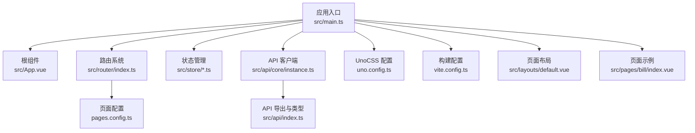
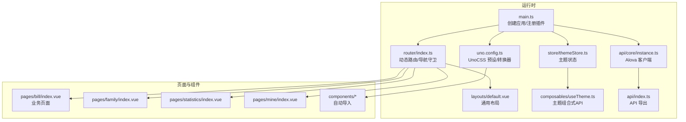
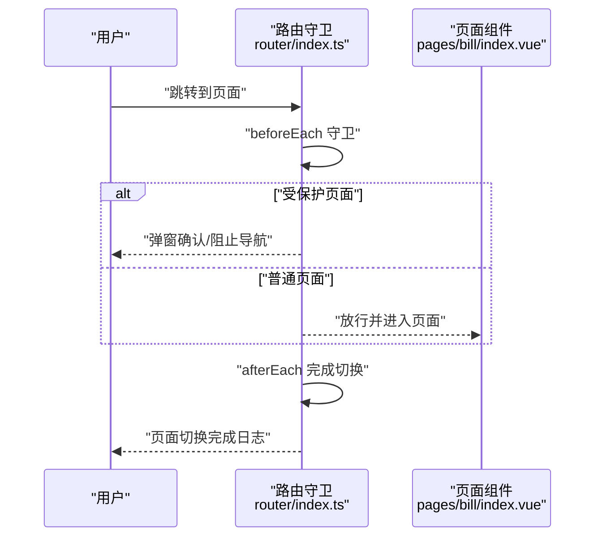
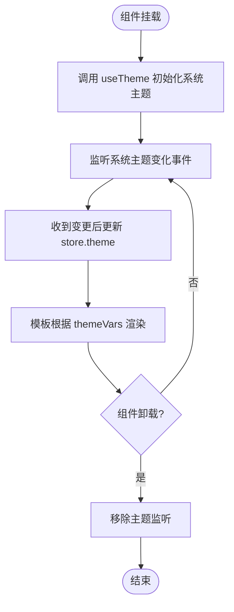
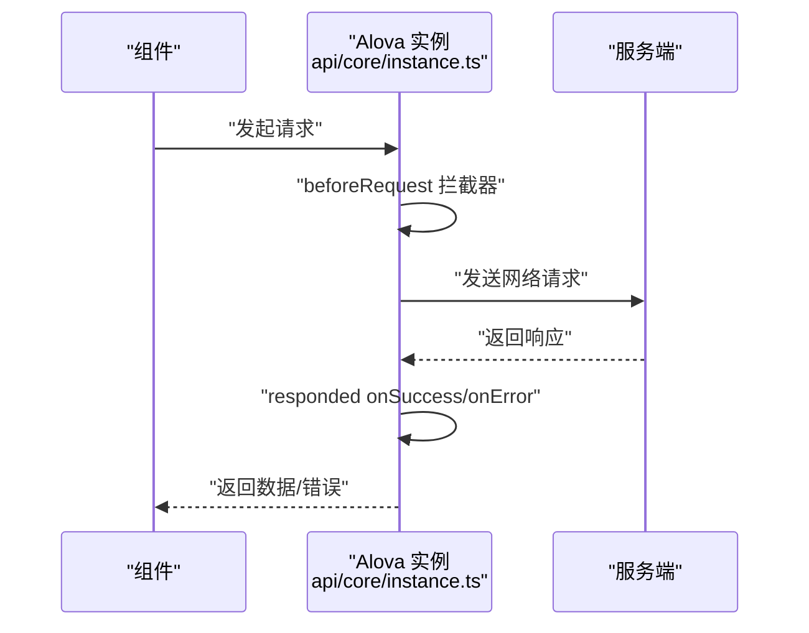
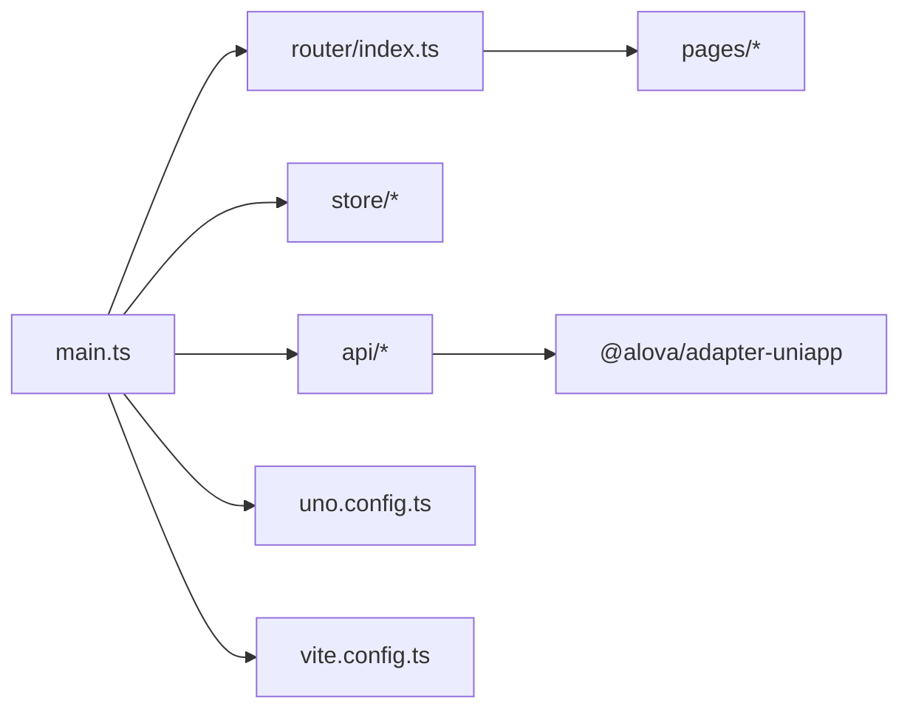

# 前端架构

<cite>
**本文引用的文件**
- [main.ts](file://chuan-bill-app/src/main.ts)
- [App.vue](file://chuan-bill-app/src/App.vue)
- [router/index.ts](file://chuan-bill-app/src/router/index.ts)
- [layouts/default.vue](file://chuan-bill-app/src/layouts/default.vue)
- [store/themeStore.ts](file://chuan-bill-app/src/store/themeStore.ts)
- [composables/useTheme.ts](file://chuan-bill-app/src/composables/useTheme.ts)
- [api/index.ts](file://chuan-bill-app/src/api/index.ts)
- [api/core/instance.ts](file://chuan-bill-app/src/api/core/instance.ts)
- [alova.config.ts](file://chuan-bill-app/alova.config.ts)
- [uno.config.ts](file://chuan-bill-app/uno.config.ts)
- [vite.config.ts](file://chuan-bill-app/vite.config.ts)
- [pages.config.ts](file://chuan-bill-app/pages.config.ts)
- [pages/bill/index.vue](file://chuan-bill-app/src/pages/bill/index.vue)
- [composables/useGlobalToast.ts](file://chuan-bill-app/src/composables/useGlobalToast.ts)
- [package.json](file://chuan-bill-app/package.json)
</cite>

## 目录
1. [引言](#引言)
2. [项目结构](#项目结构)
3. [核心组件](#核心组件)
4. [架构总览](#架构总览)
5. [详细组件分析](#详细组件分析)
6. [依赖关系分析](#依赖关系分析)
7. [性能考虑](#性能考虑)
8. [故障排查指南](#故障排查指南)
9. [结论](#结论)
10. [附录](#附录)

## 引言
本文件面向“小川记账”跨平台前端，围绕基于 uni-app 的 Vue 3 + TypeScript + UnoCSS 架构进行系统性技术说明。重点覆盖项目结构与模块职责、组件系统与布局体系、状态管理策略、路由与页面配置、API 集成方案（含 alova 客户端、请求拦截与错误处理）、跨平台编译与多端适配、性能优化与最佳实践等。

## 项目结构
- 采用“源码与产物分离”的工程组织：开发态源码位于 src 目录，构建产物位于 dist/dev/mp-weixin 等目标目录。
- 核心模块划分：
  - 应用入口与根组件：main.ts、App.vue
  - 路由与页面：router/index.ts、pages.config.ts、各页面组件
  - 布局系统：layouts/default.vue 等
  - 状态管理：store 下的主题与全局 Toast 等 Store
  - 组合式工具：composables 下的主题、消息、Toast 等
  - API 层：api/index.ts、api/core/instance.ts、alova 配置与生成器
  - 构建与样式：vite.config.ts、uno.config.ts、pages.config.ts
  - 第三方组件库：wot-design-uni 组件生态

图表来源
- [main.ts:1-16](file://chuan-bill-app/src/main.ts#L1-L16)
- [App.vue:1-16](file://chuan-bill-app/src/App.vue#L1-L16)
- [router/index.ts:1-80](file://chuan-bill-app/src/router/index.ts#L1-L80)
- [pages.config.ts:1-43](file://chuan-bill-app/pages.config.ts#L1-L43)
- [store/themeStore.ts:1-75](file://chuan-bill-app/src/store/themeStore.ts#L1-L75)
- [api/core/instance.ts:1-63](file://chuan-bill-app/src/api/core/instance.ts#L1-L63)
- [api/index.ts:1-19](file://chuan-bill-app/src/api/index.ts#L1-L19)
- [uno.config.ts:1-38](file://chuan-bill-app/uno.config.ts#L1-L38)
- [vite.config.ts:1-80](file://chuan-bill-app/vite.config.ts#L1-L80)
- [layouts/default.vue:1-17](file://chuan-bill-app/src/layouts/default.vue#L1-L17)
- [pages/bill/index.vue:1-54](file://chuan-bill-app/src/pages/bill/index.vue#L1-L54)

章节来源
- [main.ts:1-16](file://chuan-bill-app/src/main.ts#L1-L16)
- [package.json:1-135](file://chuan-bill-app/package.json#L1-L135)

## 核心组件
- 应用入口与依赖注入
  - 创建 SSR 应用实例，注册路由与 Pinia，并启用持久化插件；导出统一创建函数供多端使用。
- 根组件与全局样式
  - 提供页面容器基础样式与深色背景适配，配合主题系统实现视觉一致性。
- 路由与页面配置
  - 基于虚拟 pages 与 subPackages 自动生成路由表，结合 beforeEach/afterEach 实现导航守卫与页面切换日志。
- 布局系统
  - default.vue 提供通用布局选项与插槽，页面可按需选择布局（如 tabbar）。
- 状态管理
  - 主题 Store：读取系统主题、暴露计算属性与主题变量；全局 Toast Store：集中管理 Toast 行为。
- API 客户端
  - Alova 实例封装请求基地址、适配器、拦截器、超时与缓存策略；通过生成器对接后端 OpenAPI 文档。
- UnoCSS 与构建
  - UnoCSS 预设与转换器、自动导入、组件自动解析、页面/布局/清单插件、打包优化等。

章节来源
- [main.ts:1-16](file://chuan-bill-app/src/main.ts#L1-L16)
- [App.vue:1-16](file://chuan-bill-app/src/App.vue#L1-L16)
- [router/index.ts:1-80](file://chuan-bill-app/src/router/index.ts#L1-L80)
- [layouts/default.vue:1-17](file://chuan-bill-app/src/layouts/default.vue#L1-L17)
- [store/themeStore.ts:1-75](file://chuan-bill-app/src/store/themeStore.ts#L1-L75)
- [composables/useTheme.ts:1-71](file://chuan-bill-app/src/composables/useTheme.ts#L1-L71)
- [api/core/instance.ts:1-63](file://chuan-bill-app/src/api/core/instance.ts#L1-L63)
- [api/index.ts:1-19](file://chuan-bill-app/src/api/index.ts#L1-L19)
- [uno.config.ts:1-38](file://chuan-bill-app/uno.config.ts#L1-L38)
- [vite.config.ts:1-80](file://chuan-bill-app/vite.config.ts#L1-L80)

## 架构总览
整体采用“声明式页面 + 文件系统路由 + 组合式 API + 状态管理 + API 客户端”的分层架构。页面通过 definePage 声明元信息，路由由插件自动生成；组件通过自动导入与组件解析减少样板代码；API 通过 OpenAPI 生成器与 Alova 适配器统一接入。

图表来源
- [main.ts:1-16](file://chuan-bill-app/src/main.ts#L1-L16)
- [router/index.ts:1-80](file://chuan-bill-app/src/router/index.ts#L1-L80)
- [layouts/default.vue:1-17](file://chuan-bill-app/src/layouts/default.vue#L1-L17)
- [store/themeStore.ts:1-75](file://chuan-bill-app/src/store/themeStore.ts#L1-L75)
- [composables/useTheme.ts:1-71](file://chuan-bill-app/src/composables/useTheme.ts#L1-L71)
- [api/core/instance.ts:1-63](file://chuan-bill-app/src/api/core/instance.ts#L1-L63)
- [api/index.ts:1-19](file://chuan-bill-app/src/api/index.ts#L1-L19)
- [uno.config.ts:1-38](file://chuan-bill-app/uno.config.ts#L1-L38)
- [pages/bill/index.vue:1-54](file://chuan-bill-app/src/pages/bill/index.vue#L1-L54)

## 详细组件分析

### 路由与页面系统
- 文件系统动态路由
  - 使用虚拟 pages 与 subPackages，遍历生成完整路由表，支持分包场景。
- 导航守卫
  - beforeEach 记录导航日志、演示受保护页面拦截；afterEach 记录页面切换并触发简单提示。
- 页面配置
  - pages.config.ts 统一设置导航栏、下拉刷新、底部距离、tabBar 等全局样式与行为。

图表来源
- [router/index.ts:24-77](file://chuan-bill-app/src/router/index.ts#L24-L77)
- [pages/bill/index.vue:4-13](file://chuan-bill-app/src/pages/bill/index.vue#L4-L13)

章节来源
- [router/index.ts:1-80](file://chuan-bill-app/src/router/index.ts#L1-L80)
- [pages.config.ts:1-43](file://chuan-bill-app/pages.config.ts#L1-L43)
- [pages/bill/index.vue:1-54](file://chuan-bill-app/src/pages/bill/index.vue#L1-L54)

### 布局系统与页面装饰
- 布局组件
  - default.vue 提供通用布局选项与插槽，页面可按需选择布局（如 tabbar）。
- 页面装饰
  - 页面通过 definePage 声明标题、下拉刷新、上拉触底等样式与交互参数。

章节来源
- [layouts/default.vue:1-17](file://chuan-bill-app/src/layouts/default.vue#L1-L17)
- [pages/bill/index.vue:4-13](file://chuan-bill-app/src/pages/bill/index.vue#L4-L13)

### 状态管理策略
- 主题状态
  - themeStore：读取系统主题、暴露计算属性与主题变量；useTheme 组合式 API 在组件生命周期内监听系统主题变化并自动更新。
- 全局 Toast
  - useGlobalToast：集中管理 Toast 的显示/关闭、成功/错误/警告等快捷方法，支持合并默认配置与当前页标识。

图表来源
- [composables/useTheme.ts:39-70](file://chuan-bill-app/src/composables/useTheme.ts#L39-L70)
- [store/themeStore.ts:32-72](file://chuan-bill-app/src/store/themeStore.ts#L32-L72)

章节来源
- [store/themeStore.ts:1-75](file://chuan-bill-app/src/store/themeStore.ts#L1-L75)
- [composables/useTheme.ts:1-71](file://chuan-bill-app/src/composables/useTheme.ts#L1-L71)
- [composables/useGlobalToast.ts:1-62](file://chuan-bill-app/src/composables/useGlobalToast.ts#L1-L62)

### API 集成方案（Alova）
- 客户端配置
  - 基于 @alova/adapter-uniapp，设置 baseURL、适配器、拦截器、超时与缓存策略；在非 H5 环境使用环境变量作为基础地址。
- 请求拦截与错误处理
  - beforeRequest：统一添加 token、设置 Content-Type、GET 请求加时间戳防缓存；开发环境下打印请求信息。
  - responded：统一的成功/失败处理与完成回调。
- 接口生成与导出
  - alova.config.ts 配置 OpenAPI 输入与输出，生成 TypeScript 类型与接口；api/index.ts 导出 Alova 实例与全局 Apis 对象。

图表来源
- [api/core/instance.ts:7-60](file://chuan-bill-app/src/api/core/instance.ts#L7-L60)
- [alova.config.ts:8-84](file://chuan-bill-app/alova.config.ts#L8-L84)
- [api/index.ts:1-19](file://chuan-bill-app/src/api/index.ts#L1-L19)

章节来源
- [api/core/instance.ts:1-63](file://chuan-bill-app/src/api/core/instance.ts#L1-L63)
- [alova.config.ts:1-85](file://chuan-bill-app/alova.config.ts#L1-L85)
- [api/index.ts:1-19](file://chuan-bill-app/src/api/index.ts#L1-L19)

### UnoCSS 原子化样式
- 预设与转换器
  - 使用 @uni-helper/unocss-preset-uni 与图标预设、指令与变体转换器，支持类名即样式，提升开发效率。
- 主题变量映射
  - 通过主题变量映射 primary 颜色，页面中直接使用原子类与主题变量保持一致风格。
- 构建集成
  - Vite 插件统一启用 UnoCSS，页面中可直接使用原子类与图标别名。

章节来源
- [uno.config.ts:1-38](file://chuan-bill-app/uno.config.ts#L1-L38)
- [vite.config.ts:66-68](file://chuan-bill-app/vite.config.ts#L66-L68)
- [pages/bill/index.vue:21-43](file://chuan-bill-app/src/pages/bill/index.vue#L21-L43)

### 组件系统与自动加载
- 组件自动解析
  - Vite 插件自动扫描组件目录，解析 wot-design-uni 与 uni-echarts 组件，减少引入成本。
- 组合式 API 与自动导入
  - AutoImport 插件自动导入 Vue/Pinia/UniApp 等 API，以及自定义组合式与工具函数，提升开发体验。

章节来源
- [vite.config.ts:32-38](file://chuan-bill-app/vite.config.ts#L32-L38)
- [vite.config.ts:50-65](file://chuan-bill-app/vite.config.ts#L50-L65)

### 跨平台编译与多端适配
- 多端脚本
  - package.json 提供丰富的 dev/build 脚本，覆盖 App、H5、微信小程序、支付宝小程序等多端。
- 平台条件编译
  - 主题读取与 baseURL 判断使用条件编译宏，确保不同平台正确行为。
- 打包优化
  - @uni-ku/bundle-optimizer 在特定平台启用优化，减少包体与启动时间。

章节来源
- [package.json:11-55](file://chuan-bill-app/package.json#L11-L55)
- [store/themeStore.ts:38-54](file://chuan-bill-app/src/store/themeStore.ts#L38-L54)
- [api/core/instance.ts:8-10](file://chuan-bill-app/src/api/core/instance.ts#L8-L10)
- [vite.config.ts:46-49](file://chuan-bill-app/vite.config.ts#L46-L49)

## 依赖关系分析
- 模块耦合
  - main.ts 作为根入口，耦合路由、状态与 API；页面通过 definePage 与布局解耦；API 通过生成器与客户端解耦后端协议。
- 外部依赖
  - uni-app 生态、Vue 3、Pinia、Alova、UnoCSS、wot-design-uni、@uni-helper 系列插件。
- 可能的循环依赖
  - 当前结构以入口与插件为中心，未见明显循环依赖迹象。

图表来源
- [main.ts:1-16](file://chuan-bill-app/src/main.ts#L1-L16)
- [router/index.ts:1-80](file://chuan-bill-app/src/router/index.ts#L1-L80)
- [store/themeStore.ts:1-75](file://chuan-bill-app/src/store/themeStore.ts#L1-L75)
- [api/core/instance.ts:1-63](file://chuan-bill-app/src/api/core/instance.ts#L1-L63)
- [uno.config.ts:1-38](file://chuan-bill-app/uno.config.ts#L1-L38)
- [vite.config.ts:1-80](file://chuan-bill-app/vite.config.ts#L1-L80)

章节来源
- [package.json:57-87](file://chuan-bill-app/package.json#L57-L87)

## 性能考虑
- 构建期优化
  - 启用 @uni-ku/bundle-optimizer 与 @uni-helper 插件链，减少包体与启动时间。
  - 依赖预优化与排除策略，避免开发期不必要的打包。
- 运行期优化
  - Alova 关闭全局缓存，避免陈旧数据；GET 请求加时间戳防缓存；统一超时与错误处理降低异常开销。
  - UnoCSS 原子类按需使用，减少样式体积。
- 页面与组件
  - 页面使用 definePage 声明样式与交互参数，减少重复配置；组件自动解析减少冗余引入。

章节来源
- [vite.config.ts:19-21](file://chuan-bill-app/vite.config.ts#L19-L21)
- [vite.config.ts:46-49](file://chuan-bill-app/vite.config.ts#L46-L49)
- [api/core/instance.ts:56-60](file://chuan-bill-app/src/api/core/instance.ts#L56-L60)
- [pages/bill/index.vue:8-12](file://chuan-bill-app/src/pages/bill/index.vue#L8-L12)

## 故障排查指南
- 路由问题
  - 确认 pages.config.ts 与 definePage 声明是否匹配；检查 beforeEach/afterEach 日志定位拦截原因。
- API 请求问题
  - 检查 baseURL 与环境变量配置；确认 beforeRequest 是否正确设置 token 与 Content-Type；查看 responded 成功/失败回调日志。
- 主题与样式问题
  - 检查系统主题监听是否生效；确认 UnoCSS 预设与转换器配置；核对主题变量映射。
- 构建问题
  - 查看 Vite 插件配置与代理设置；确认 @uni-helper 插件版本与兼容性。

章节来源
- [router/index.ts:24-77](file://chuan-bill-app/src/router/index.ts#L24-L77)
- [api/core/instance.ts:15-51](file://chuan-bill-app/src/api/core/instance.ts#L15-L51)
- [uno.config.ts:10-37](file://chuan-bill-app/uno.config.ts#L10-L37)
- [vite.config.ts:70-78](file://chuan-bill-app/vite.config.ts#L70-L78)

## 结论
该架构以 uni-app 为核心，结合 Vue 3 Composition API、Pinia、Alova、UnoCSS 与 @uni-helper 生态，实现了跨平台前端的高内聚低耦合设计。文件系统路由与页面配置简化了路由管理；API 生成器与客户端拦截器统一了接口契约与错误处理；主题与样式系统保证了多端一致性。建议在后续迭代中进一步完善权限拦截、埋点与监控、国际化与无障碍等能力。

## 附录
- 开发与构建命令参考
  - 开发：多端分别执行 dev:* 脚本；H5 支持 SSR 模式。
  - 构建：多端分别执行 build:* 脚本；支持多模式（development/staging/production）。
  - 类型检查：type-check；代码规范：lint/fix。
  - API 生成：alova-gen。

章节来源
- [package.json:11-55](file://chuan-bill-app/package.json#L11-L55)