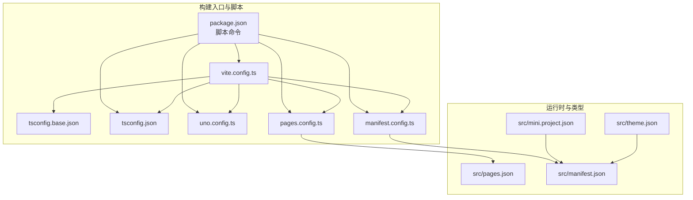
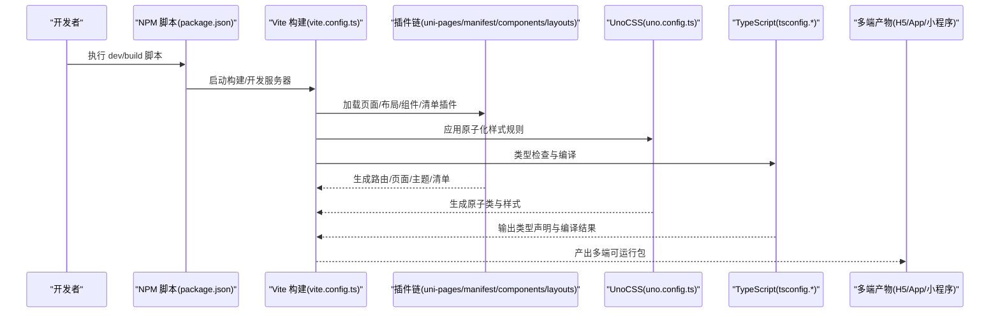
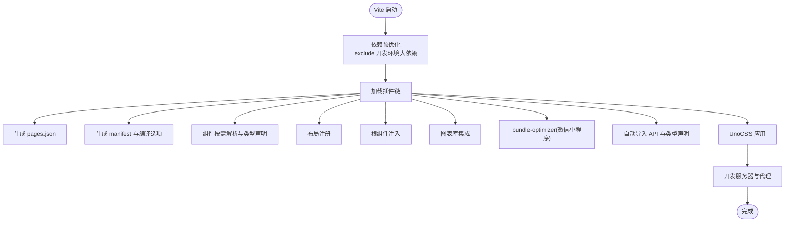
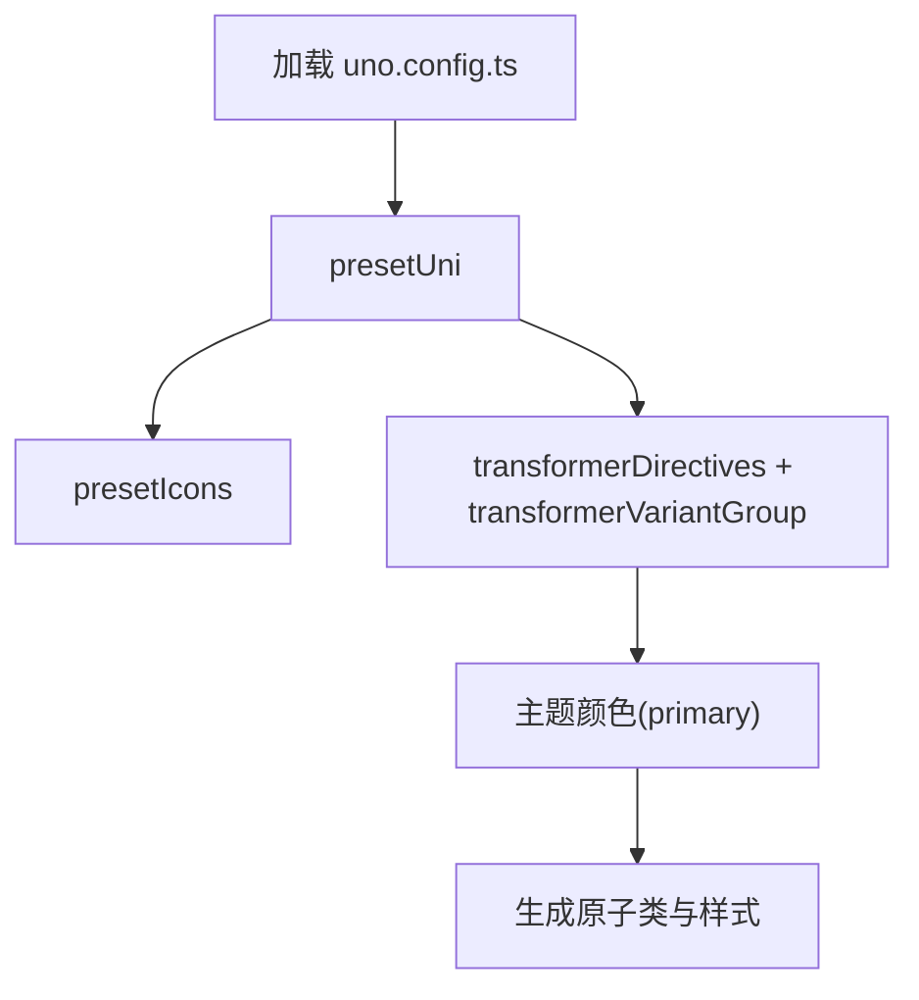
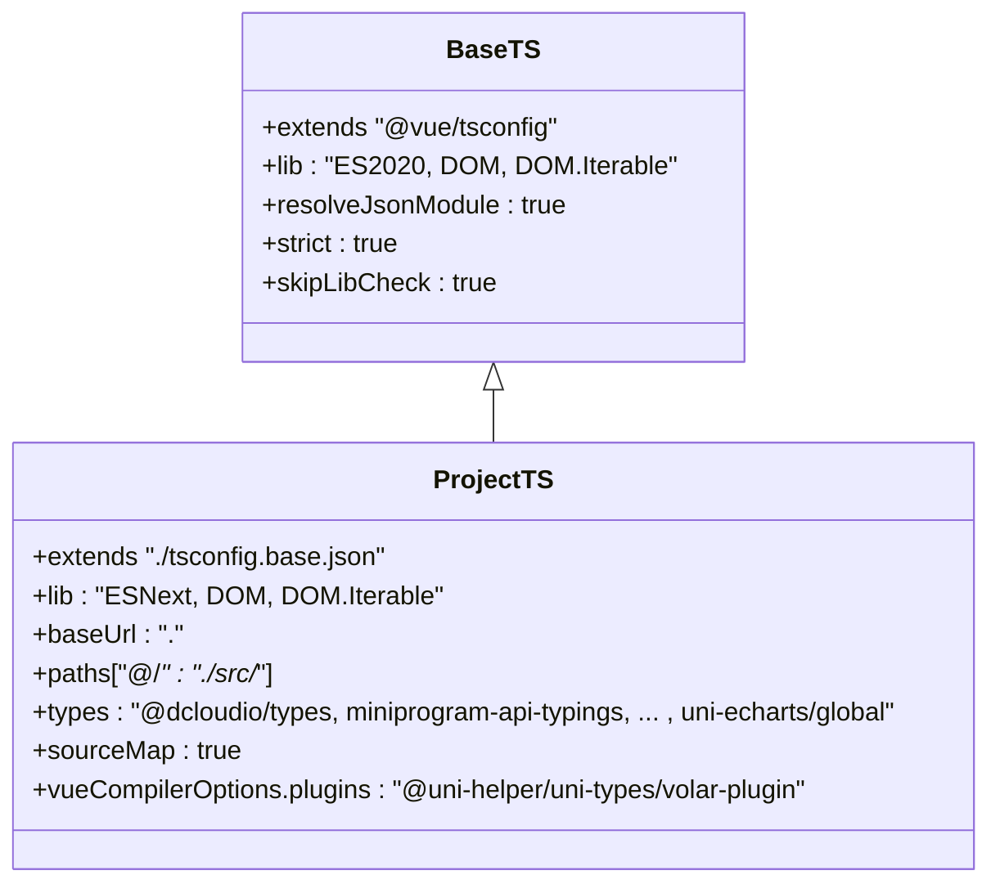
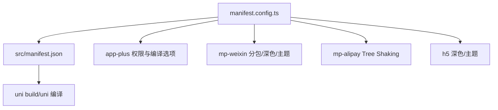
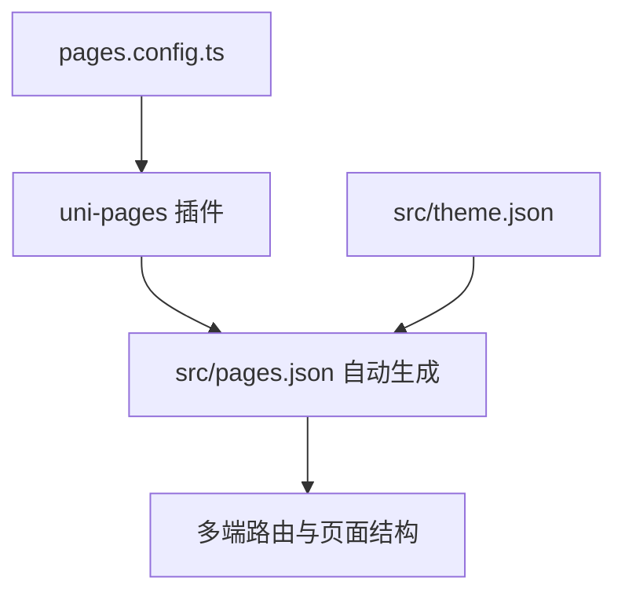
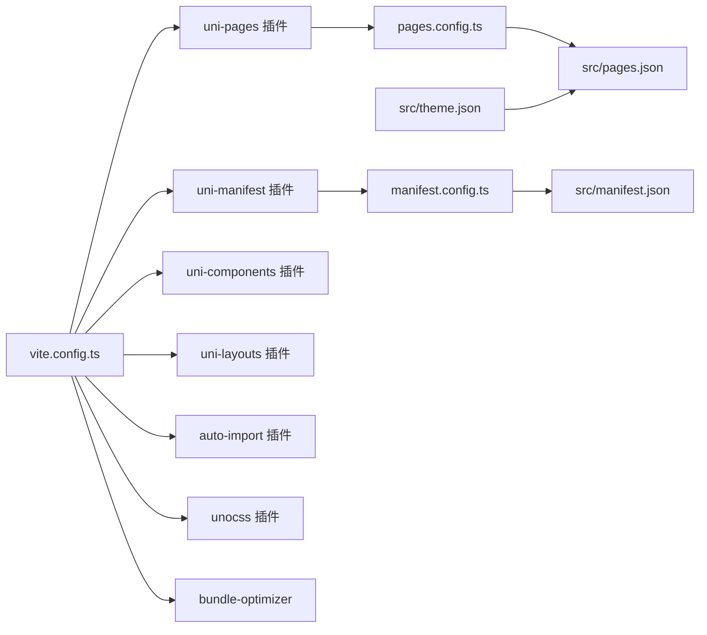

# 构建配置系统

<cite>
**本文引用的文件**
- [vite.config.ts](file://chuan-bill-app/vite.config.ts)
- [uno.config.ts](file://chuan-bill-app/uno.config.ts)
- [tsconfig.json](file://chuan-bill-app/tsconfig.json)
- [tsconfig.base.json](file://chuan-bill-app/tsconfig.base.json)
- [manifest.config.ts](file://chuan-bill-app/manifest.config.ts)
- [src/manifest.json](file://chuan-bill-app/src/manifest.json)
- [pages.config.ts](file://chuan-bill-app/pages.config.ts)
- [src/pages.json](file://chuan-bill-app/src/pages.json)
- [package.json](file://chuan-bill-app/package.json)
- [alova.config.ts](file://chuan-bill-app/alova.config.ts)
- [eslint.config.mjs](file://chuan-bill-app/eslint.config.mjs)
- [src/mini.project.json](file://chuan-bill-app/src/mini.project.json)
- [src/theme.json](file://chuan-bill-app/src/theme.json)
</cite>

## 目录
1. [简介](#简介)
2. [项目结构](#项目结构)
3. [核心组件](#核心组件)
4. [架构总览](#架构总览)
5. [详细组件分析](#详细组件分析)
6. [依赖关系分析](#依赖关系分析)
7. [性能考量](#性能考量)
8. [故障排查指南](#故障排查指南)
9. [结论](#结论)
10. [附录](#附录)

## 简介
本文件面向“小川记记账”项目的构建配置系统，系统性梳理并解释 Vite 构建配置、UnoCSS 原子化 CSS 配置、TypeScript 配置、manifest 配置与页面配置在多端（H5、小程序、App、快应用等）的集成方案。重点覆盖以下方面：
- 开发环境配置与代理、热更新与类型检查
- 生产环境优化：代码分割、Tree Shaking、资源压缩与懒加载策略
- 多端编译策略：平台差异、平台特定优化与产物分析
- 构建性能优化：依赖预优化、按需引入、插件链路优化
- 跨平台构建的配置差异与调试方法
- 最佳实践、常见问题排查与性能调优建议

## 项目结构
本项目采用 uni-app 3 的多端统一工程模型，前端构建以 Vite 为核心，结合一系列 uni-helper 插件实现页面、布局、组件、清单与主题的自动化生成与优化；同时通过 UnoCSS 提供原子化样式能力，并使用 TypeScript 进行强类型约束。

图表来源
- [package.json:11-55](file://chuan-bill-app/package.json#L11-L55)
- [vite.config.ts:17-79](file://chuan-bill-app/vite.config.ts#L17-L79)
- [uno.config.ts:10-37](file://chuan-bill-app/uno.config.ts#L10-L37)
- [manifest.config.ts:12-99](file://chuan-bill-app/manifest.config.ts#L12-L99)
- [pages.config.ts:3-42](file://chuan-bill-app/pages.config.ts#L3-L42)
- [tsconfig.base.json:1-11](file://chuan-bill-app/tsconfig.base.json#L1-L11)
- [tsconfig.json:1-30](file://chuan-bill-app/tsconfig.json#L1-L30)
- [src/mini.project.json:1-7](file://chuan-bill-app/src/mini.project.json#L1-L7)
- [src/theme.json:1-27](file://chuan-bill-app/src/theme.json#L1-L27)
- [src/pages.json:1-83](file://chuan-bill-app/src/pages.json#L1-L83)
- [src/manifest.json:1-84](file://chuan-bill-app/src/manifest.json#L1-L84)

章节来源
- [package.json:11-55](file://chuan-bill-app/package.json#L11-L55)
- [vite.config.ts:17-79](file://chuan-bill-app/vite.config.ts#L17-L79)
- [uno.config.ts:10-37](file://chuan-bill-app/uno.config.ts#L10-L37)
- [manifest.config.ts:12-99](file://chuan-bill-app/manifest.config.ts#L12-L99)
- [pages.config.ts:3-42](file://chuan-bill-app/pages.config.ts#L3-L42)
- [tsconfig.base.json:1-11](file://chuan-bill-app/tsconfig.base.json#L1-L11)
- [tsconfig.json:1-30](file://chuan-bill-app/tsconfig.json#L1-L30)
- [src/mini.project.json:1-7](file://chuan-bill-app/src/mini.project.json#L1-L7)
- [src/theme.json:1-27](file://chuan-bill-app/src/theme.json#L1-L27)
- [src/pages.json:1-83](file://chuan-bill-app/src/pages.json#L1-L83)
- [src/manifest.json:1-84](file://chuan-bill-app/src/manifest.json#L1-L84)

## 核心组件
- Vite 构建配置：集中定义基础路径、依赖预优化、代理、插件链与开发服务器配置，支撑多端构建与开发体验。
- UnoCSS 配置：基于 @uni-helper/unocss-preset-uni 提供 uni-app 场景的原子类与图标集，配合转换器提升可维护性。
- TypeScript 配置：通过 tsconfig.base.json 与 tsconfig.json 组合，启用严格模式、路径别名、类型声明与 Vue 语言服务增强。
- Manifest 配置：统一管理各平台（App、H5、小程序、快应用等）的编译选项、权限、主题与优化策略。
- 页面配置：pages.config.ts 与 src/pages.json 协同生成页面路由表与 TabBar 配置，支持条件编译与主题变量注入。
- 工具链与脚本：package.json 中的多端构建脚本、Alova 接口生成配置、ESLint 规则与自动导入插件。

章节来源
- [vite.config.ts:17-79](file://chuan-bill-app/vite.config.ts#L17-L79)
- [uno.config.ts:10-37](file://chuan-bill-app/uno.config.ts#L10-L37)
- [tsconfig.json:1-30](file://chuan-bill-app/tsconfig.json#L1-L30)
- [tsconfig.base.json:1-11](file://chuan-bill-app/tsconfig.base.json#L1-L11)
- [manifest.config.ts:12-99](file://chuan-bill-app/manifest.config.ts#L12-L99)
- [pages.config.ts:3-42](file://chuan-bill-app/pages.config.ts#L3-L42)
- [package.json:11-55](file://chuan-bill-app/package.json#L11-L55)
- [alova.config.ts:8-84](file://chuan-bill-app/alova.config.ts#L8-L84)
- [eslint.config.mjs:1-18](file://chuan-bill-app/eslint.config.mjs#L1-L18)

## 架构总览
下图展示从开发到多端构建的关键流程与组件交互：

图表来源
- [package.json:11-55](file://chuan-bill-app/package.json#L11-L55)
- [vite.config.ts:17-79](file://chuan-bill-app/vite.config.ts#L17-L79)
- [uno.config.ts:10-37](file://chuan-bill-app/uno.config.ts#L10-L37)
- [tsconfig.json:1-30](file://chuan-bill-app/tsconfig.json#L1-L30)
- [tsconfig.base.json:1-11](file://chuan-bill-app/tsconfig.base.json#L1-L11)
- [manifest.config.ts:12-99](file://chuan-bill-app/manifest.config.ts#L12-L99)
- [pages.config.ts:3-42](file://chuan-bill-app/pages.config.ts#L3-L42)

## 详细组件分析

### Vite 构建配置
- 基础路径与依赖优化：设置 base 为相对路径，开发环境下排除部分大型依赖以加速启动与热更新。
- 插件链：
  - uni-manifest：从 manifest.config.ts 生成各平台清单与编译选项。
  - uni-pages：自动生成 pages.json，支持 DTS 与排除规则。
  - uni-layouts：自动注册布局组件。
  - uni-components：按需解析 wot-design-uni 与 uni-echarts 组件，生成类型声明。
  - uni-ku/root：根组件注入。
  - uni-echarts：图表库集成。
  - plugin-uni：多端兼容与编译优化。
  - bundle-optimizer：微信小程序端优化开关与日志控制。
  - auto-import：自动导入 Vue/Pinia/uni-app 等常用 API，支持模板与目录扫描。
  - unocss：加载 UnoCSS 配置。
- 开发服务器：配置 /api 代理至后端服务，便于前后端联调。

图表来源
- [vite.config.ts:17-79](file://chuan-bill-app/vite.config.ts#L17-L79)

章节来源
- [vite.config.ts:17-79](file://chuan-bill-app/vite.config.ts#L17-L79)

### UnoCSS 原子化 CSS 配置
- 预设与转换器：
  - presetUni：适配 uni-app 的原子类与属性化模式。
  - presetIcons：图标集，支持额外样式属性与异步集合加载。
  - transformerDirectives：指令转换。
  - transformerVariantGroup：变体组合转换。
- 主题变量：通过主题颜色映射 primary 变量，与主题 JSON 对接。

图表来源
- [uno.config.ts:10-37](file://chuan-bill-app/uno.config.ts#L10-L37)

章节来源
- [uno.config.ts:10-37](file://chuan-bill-app/uno.config.ts#L10-L37)
- [src/theme.json:1-27](file://chuan-bill-app/src/theme.json#L1-L27)

### TypeScript 配置
- 基础配置：继承 @vue/tsconfig，启用严格模式、跳过库检查、解析 JSON 模块。
- 项目配置：设置路径别名、类型声明、源码映射与 Vue 语言服务插件，确保 uni-app 组件类型正确解析。

图表来源
- [tsconfig.base.json:1-11](file://chuan-bill-app/tsconfig.base.json#L1-L11)
- [tsconfig.json:1-30](file://chuan-bill-app/tsconfig.json#L1-L30)

章节来源
- [tsconfig.base.json:1-11](file://chuan-bill-app/tsconfig.base.json#L1-L11)
- [tsconfig.json:1-30](file://chuan-bill-app/tsconfig.json#L1-L30)

### Manifest 配置与多端编译策略
- 全局字段：应用名称、版本、px 转换策略等。
- App Plus：组件化、nvue 编译器版本、启动页配置、Android 权限列表等。
- 平台特定优化：
  - 微信小程序：分包优化、URL 校验关闭、深色模式、主题文件位置、虚拟节点合并。
  - 支付宝小程序：全局对象模式、Tree Shaking。
  - H5：深色模式与主题文件位置。
- 与运行时清单 src/manifest.json 的对应关系：由 manifest.config.ts 生成，用于 uni-app 编译期与运行期。

图表来源
- [manifest.config.ts:12-99](file://chuan-bill-app/manifest.config.ts#L12-L99)
- [src/manifest.json:1-84](file://chuan-bill-app/src/manifest.json#L1-L84)

章节来源
- [manifest.config.ts:12-99](file://chuan-bill-app/manifest.config.ts#L12-L99)
- [src/manifest.json:1-84](file://chuan-bill-app/src/manifest.json#L1-L84)

### 页面配置与路由生成
- pages.config.ts：定义全局样式、TabBar（含条件编译）、页面列表与样式覆盖。
- 生成 src/pages.json：由 uni-pages 插件根据 pages.config.ts 生成，包含页面、分包与 TabBar 配置。
- 与主题变量对接：导航栏、背景、TabBar 颜色等通过主题 JSON 注入。

图表来源
- [pages.config.ts:3-42](file://chuan-bill-app/pages.config.ts#L3-L42)
- [src/pages.json:1-83](file://chuan-bill-app/src/pages.json#L1-L83)
- [src/theme.json:1-27](file://chuan-bill-app/src/theme.json#L1-L27)

章节来源
- [pages.config.ts:3-42](file://chuan-bill-app/pages.config.ts#L3-L42)
- [src/pages.json:1-83](file://chuan-bill-app/src/pages.json#L1-L83)
- [src/theme.json:1-27](file://chuan-bill-app/src/theme.json#L1-L27)

### 开发环境配置与代理
- 代理配置：将 /api 请求转发至本地后端服务，支持 changeOrigin 与路径重写。
- 类型检查：通过 type-check 脚本执行 vue-tsc，避免构建阶段出现类型错误。
- ESLint：统一规则与忽略项，支持 UnoCSS 规则与编辑器忽略。

章节来源
- [vite.config.ts:70-78](file://chuan-bill-app/vite.config.ts#L70-L78)
- [package.json:52](file://chuan-bill-app/package.json#L52)
- [eslint.config.mjs:1-18](file://chuan-bill-app/eslint.config.mjs#L1-L18)

### 生产环境优化与多端策略
- 代码分割与懒加载：通过 uni-pages 与组件按需解析，减少首屏体积；结合平台特性进行分包与模块拆分。
- Tree Shaking：支付宝小程序开启 compileOptions.treeShaking；TypeScript 严格模式与自动导入减少无用导出。
- 资源优化：UnoCSS 仅生成使用到的原子类；bundle-optimizer 在微信小程序端启用优化。
- 构建产物分析：使用 uni build 的平台参数输出各端产物，结合 HBuilderX 或平台开发者工具分析体积与性能。

章节来源
- [manifest.config.ts:64-84](file://chuan-bill-app/manifest.config.ts#L64-L84)
- [vite.config.ts:46-49](file://chuan-bill-app/vite.config.ts#L46-L49)
- [tsconfig.json:17](file://chuan-bill-app/tsconfig.json#L17)

### 跨平台构建差异与平台特定优化
- H5：深色模式与主题文件位置；支持 SSR 模式脚本。
- App：组件化、nvue 编译器版本、启动页与权限配置。
- 微信小程序：分包优化、URL 校验关闭、深色模式、主题文件位置、虚拟节点合并。
- 支付宝小程序：全局对象模式、Tree Shaking。
- 快应用/其他小程序：统一 usingComponents 与基础配置。

章节来源
- [manifest.config.ts:20-99](file://chuan-bill-app/manifest.config.ts#L20-L99)
- [src/manifest.json:8-84](file://chuan-bill-app/src/manifest.json#L8-L84)

### 构建性能优化与调试
- 依赖预优化：开发环境排除大型依赖，缩短启动时间。
- 自动导入：减少样板代码，降低打包体积。
- UnoCSS：仅生成使用到的原子类，避免全局样式膨胀。
- bundle-optimizer：针对微信小程序进行体积与加载优化。
- 调试建议：结合 HBuilderX/IDE 的多端预览与真机调试；利用 ESLint 与类型检查提前发现问题。

章节来源
- [vite.config.ts:19-21](file://chuan-bill-app/vite.config.ts#L19-L21)
- [vite.config.ts:51-65](file://chuan-bill-app/vite.config.ts#L51-L65)
- [uno.config.ts:10-37](file://chuan-bill-app/uno.config.ts#L10-L37)
- [vite.config.ts:46-49](file://chuan-bill-app/vite.config.ts#L46-L49)

## 依赖关系分析
- 构建工具链：Vite 作为核心，配合 uni-helper 生态插件与 UnoCSS、AutoImport、TypeScript。
- 类型与语言服务：@uni-helper/uni-types 与 tsconfig 的 Vue 插件共同保障类型推断。
- 平台编译：manifest.config.ts 与 src/manifest.json 决定各端编译选项与权限。
- 页面与主题：pages.config.ts 与 src/pages.json、src/theme.json 影响路由与视觉一致性。

图表来源
- [vite.config.ts:17-79](file://chuan-bill-app/vite.config.ts#L17-L79)
- [manifest.config.ts:12-99](file://chuan-bill-app/manifest.config.ts#L12-L99)
- [pages.config.ts:3-42](file://chuan-bill-app/pages.config.ts#L3-L42)
- [src/pages.json:1-83](file://chuan-bill-app/src/pages.json#L1-L83)
- [src/theme.json:1-27](file://chuan-bill-app/src/theme.json#L1-L27)
- [src/manifest.json:1-84](file://chuan-bill-app/src/manifest.json#L1-L84)

章节来源
- [vite.config.ts:17-79](file://chuan-bill-app/vite.config.ts#L17-L79)
- [manifest.config.ts:12-99](file://chuan-bill-app/manifest.config.ts#L12-L99)
- [pages.config.ts:3-42](file://chuan-bill-app/pages.config.ts#L3-L42)
- [src/pages.json:1-83](file://chuan-bill-app/src/pages.json#L1-L83)
- [src/theme.json:1-27](file://chuan-bill-app/src/theme.json#L1-L27)
- [src/manifest.json:1-84](file://chuan-bill-app/src/manifest.json#L1-L84)

## 性能考量
- 依赖预优化与排除：开发环境排除大型依赖，提升冷启动速度。
- 自动导入与按需组件：减少全局导入，降低包体与重复依赖。
- UnoCSS 按需生成：仅生成使用到的原子类，避免全局样式膨胀。
- 平台特定优化：微信小程序分包与 bundle-optimizer、支付宝 Tree Shaking。
- 类型检查前置：通过 type-check 在构建前发现类型问题，减少失败重试成本。

章节来源
- [vite.config.ts:19-21](file://chuan-bill-app/vite.config.ts#L19-L21)
- [vite.config.ts:51-65](file://chuan-bill-app/vite.config.ts#L51-L65)
- [uno.config.ts:10-37](file://chuan-bill-app/uno.config.ts#L10-L37)
- [manifest.config.ts:64-84](file://chuan-bill-app/manifest.config.ts#L64-L84)
- [package.json:52](file://chuan-bill-app/package.json#L52)

## 故障排查指南
- 开发代理无效：确认 /api 代理配置与后端服务地址一致，检查 changeOrigin 与 rewrite。
- 类型报错：执行 type-check 脚本定位问题；检查 tsconfig 与 Volar 插件是否正确加载。
- UnoCSS 样式未生效：确认已加载 presetIcons 与转换器；检查主题变量与主题 JSON 是否匹配。
- 页面路由异常：检查 pages.config.ts 与生成的 src/pages.json；确认 TabBar 配置与页面路径。
- 平台编译失败：核对 manifest.config.ts 与 src/manifest.json 的平台段配置；检查权限与编译选项。
- ESLint 报错：根据 eslint.config.mjs 的规则调整代码风格或忽略项。

章节来源
- [vite.config.ts:70-78](file://chuan-bill-app/vite.config.ts#L70-L78)
- [package.json:52](file://chuan-bill-app/package.json#L52)
- [uno.config.ts:10-37](file://chuan-bill-app/uno.config.ts#L10-L37)
- [pages.config.ts:3-42](file://chuan-bill-app/pages.config.ts#L3-L42)
- [src/pages.json:1-83](file://chuan-bill-app/src/pages.json#L1-L83)
- [manifest.config.ts:12-99](file://chuan-bill-app/manifest.config.ts#L12-L99)
- [src/manifest.json:1-84](file://chuan-bill-app/src/manifest.json#L1-L84)
- [eslint.config.mjs:1-18](file://chuan-bill-app/eslint.config.mjs#L1-L18)

## 结论
本构建配置系统围绕 Vite 与 uni-helper 生态，实现了多端统一开发与编译。通过 manifest 与 pages 的自动化生成、UnoCSS 的原子化样式、TypeScript 的强类型约束以及插件链的按需优化，兼顾了开发效率与产物质量。建议在后续迭代中持续关注平台差异与体积分析，结合 bundle-optimizer 与 Tree Shaking 等手段进一步优化加载性能与包体大小。

## 附录
- 多端构建脚本参考：见 package.json 中 dev/build 相关脚本，覆盖 App/H5/小程序等平台。
- 接口生成：Alova 配置支持从 Swagger/OpenAPI 生成接口与类型，便于前后端协作。
- 主题与样式：主题 JSON 与 pages.json 的颜色变量保持一致，确保跨端视觉统一。

章节来源
- [package.json:11-55](file://chuan-bill-app/package.json#L11-L55)
- [alova.config.ts:8-84](file://chuan-bill-app/alova.config.ts#L8-L84)
- [src/theme.json:1-27](file://chuan-bill-app/src/theme.json#L1-L27)
- [src/pages.json:1-83](file://chuan-bill-app/src/pages.json#L1-L83)