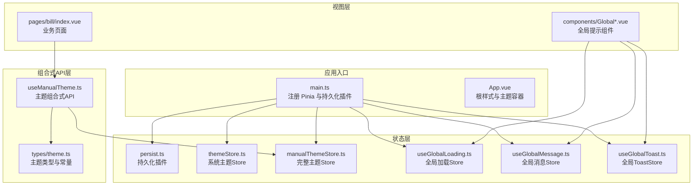
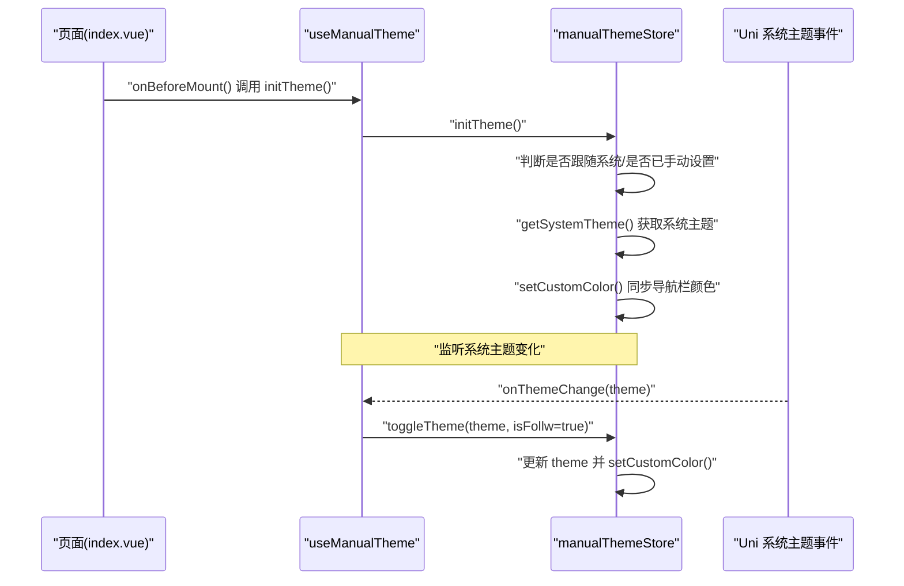
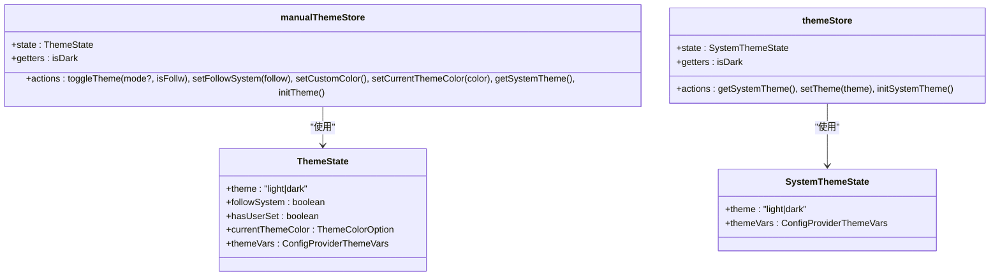
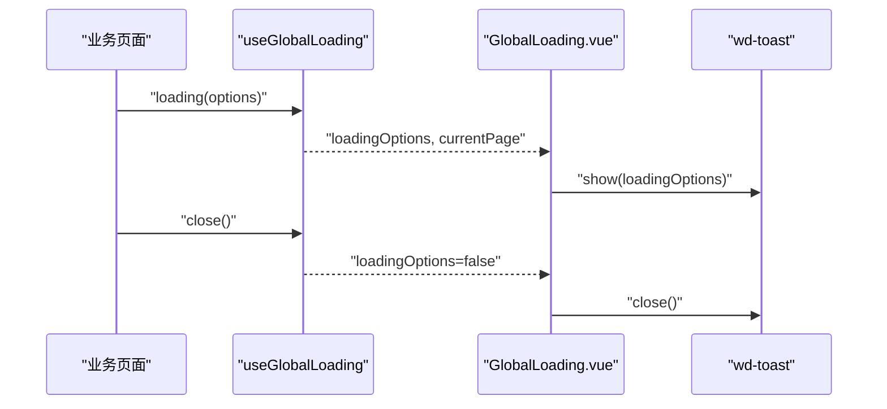
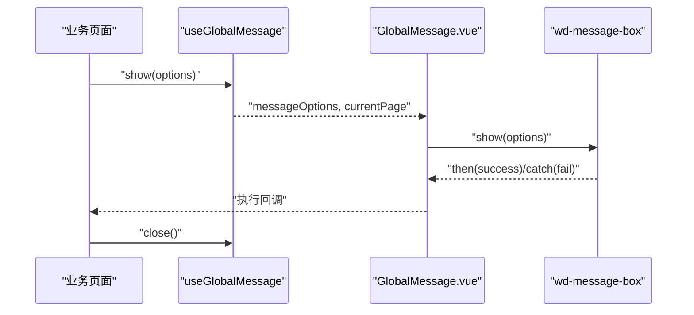
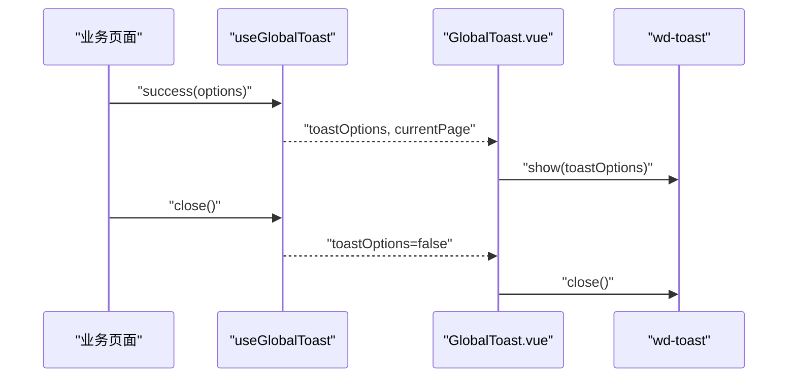
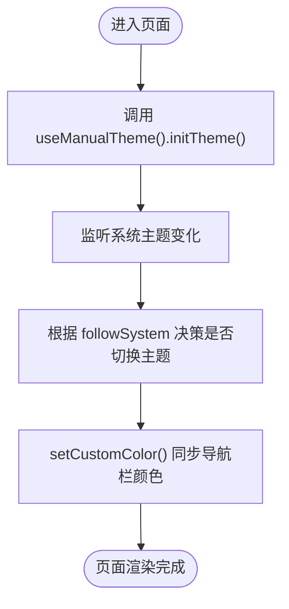
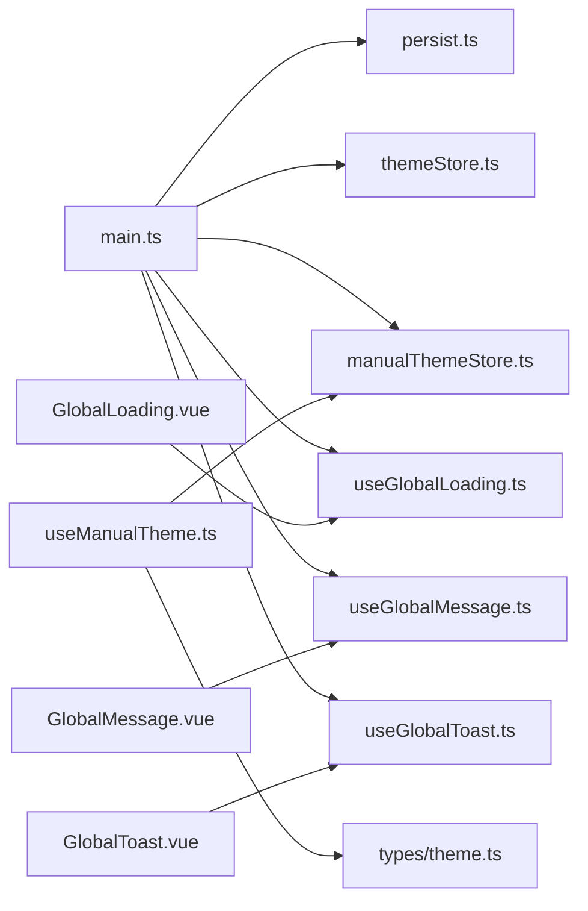

# 状态管理策略

<cite>
**本文引用的文件**
- [manualThemeStore.ts](file://chuan-bill-app/src/store/manualThemeStore.ts)
- [themeStore.ts](file://chuan-bill-app/src/store/themeStore.ts)
- [persist.ts](file://chuan-bill-app/src/store/persist.ts)
- [useManualTheme.ts](file://chuan-bill-app/src/composables/useManualTheme.ts)
- [useGlobalLoading.ts](file://chuan-bill-app/src/composables/useGlobalLoading.ts)
- [useGlobalMessage.ts](file://chuan-bill-app/src/composables/useGlobalMessage.ts)
- [useGlobalToast.ts](file://chuan-bill-app/src/composables/useGlobalToast.ts)
- [theme.ts](file://chuan-bill-app/src/composables/types/theme.ts)
- [main.ts](file://chuan-bill-app/src/main.ts)
- [App.vue](file://chuan-bill-app/src/App.vue)
- [GlobalLoading.vue](file://chuan-bill-app/src/components/GlobalLoading.vue)
- [GlobalMessage.vue](file://chuan-bill-app/src/components/GlobalMessage.vue)
- [GlobalToast.vue](file://chuan-bill-app/src/components/GlobalToast.vue)
- [index.vue](file://chuan-bill-app/src/pages/bill/index.vue)
</cite>

## 目录
1. [引言](#引言)
2. [项目结构](#项目结构)
3. [核心组件](#核心组件)
4. [架构总览](#架构总览)
5. [详细组件分析](#详细组件分析)
6. [依赖关系分析](#依赖关系分析)
7. [性能考量](#性能考量)
8. [故障排查指南](#故障排查指南)
9. [结论](#结论)
10. [附录](#附录)

## 引言
本文件系统性梳理“小川记账”的状态管理策略，围绕基于 Pinia 的架构展开，重点覆盖以下方面：
- Store 设计原则与模块化组织
- 状态持久化机制与插件化扩展
- 主题状态管理（完整版 manualThemeStore 与简化版 themeStore）
- 全局 loading、消息、toast 状态的设计与实现
- 组合式 API 在状态管理中的应用、useXxx 命名约定与响应式绑定
- 状态同步机制、副作用处理与异步状态管理
- 最佳实践、性能优化技巧、调试方法与常见问题解决

## 项目结构
本项目采用“组合式 API + Pinia Store”的前端状态管理方案，核心文件分布如下：
- store：集中存放 Pinia Store 及持久化插件
- composables：封装 useXxx 组合式 API，连接 Store 与组件
- components：全局提示类组件，消费对应 Store 的状态
- pages：业务页面，通过组合式 API 使用状态
- main.ts：应用入口，注册 Pinia 与持久化插件

图表来源
- [main.ts:1-16](file://chuan-bill-app/src/main.ts#L1-L16)
- [themeStore.ts:1-75](file://chuan-bill-app/src/store/themeStore.ts#L1-L75)
- [manualThemeStore.ts:1-151](file://chuan-bill-app/src/store/manualThemeStore.ts#L1-L151)
- [useManualTheme.ts:1-143](file://chuan-bill-app/src/composables/useManualTheme.ts#L1-L143)
- [useGlobalLoading.ts:1-38](file://chuan-bill-app/src/composables/useGlobalLoading.ts#L1-L38)
- [useGlobalMessage.ts:1-53](file://chuan-bill-app/src/composables/useGlobalMessage.ts#L1-L53)
- [useGlobalToast.ts:1-62](file://chuan-bill-app/src/composables/useGlobalToast.ts#L1-L62)
- [GlobalLoading.vue:1-47](file://chuan-bill-app/src/components/GlobalLoading.vue#L1-L47)
- [GlobalMessage.vue:1-56](file://chuan-bill-app/src/components/GlobalMessage.vue#L1-L56)
- [GlobalToast.vue:1-47](file://chuan-bill-app/src/components/GlobalToast.vue#L1-L47)
- [index.vue:1-54](file://chuan-bill-app/src/pages/bill/index.vue#L1-L54)

章节来源
- [main.ts:1-16](file://chuan-bill-app/src/main.ts#L1-L16)
- [App.vue:1-16](file://chuan-bill-app/src/App.vue#L1-L16)

## 核心组件
本节聚焦于主题与全局提示三类核心状态的 Store 与组合式 API 设计。

- 主题状态 Store
  - manualThemeStore：提供完整主题能力（手动切换、跟随系统、主题色、导航栏同步、持久化标记）
  - themeStore：提供简化系统主题能力（仅跟随系统主题）
- 全局提示 Store
  - useGlobalLoading：统一管理全局加载状态与当前页面上下文
  - useGlobalMessage：统一管理全局消息框（alert/confirm/prompt）状态与回调
  - useGlobalToast：统一管理全局 Toast 状态与类型化快捷方法

章节来源
- [manualThemeStore.ts:1-151](file://chuan-bill-app/src/store/manualThemeStore.ts#L1-L151)
- [themeStore.ts:1-75](file://chuan-bill-app/src/store/themeStore.ts#L1-L75)
- [useGlobalLoading.ts:1-38](file://chuan-bill-app/src/composables/useGlobalLoading.ts#L1-L38)
- [useGlobalMessage.ts:1-53](file://chuan-bill-app/src/composables/useGlobalMessage.ts#L1-L53)
- [useGlobalToast.ts:1-62](file://chuan-bill-app/src/composables/useGlobalToast.ts#L1-L62)

## 架构总览
整体采用“Store + 组合式 API + 视图组件”三层架构：
- Store 层：集中管理状态与动作，提供 getters 与 actions
- 组合式 API 层：封装 useXxx，负责生命周期副作用、系统事件监听、状态同步
- 视图层：组件通过 storeToRefs 与 computed 绑定 Store 状态，触发 actions 更新

图表来源
- [index.vue:1-54](file://chuan-bill-app/src/pages/bill/index.vue#L1-L54)
- [useManualTheme.ts:83-115](file://chuan-bill-app/src/composables/useManualTheme.ts#L83-L115)
- [manualThemeStore.ts:124-148](file://chuan-bill-app/src/store/manualThemeStore.ts#L124-L148)

## 详细组件分析

### 主题状态管理（manualThemeStore 与 themeStore）
- 设计原则
  - 分层职责：manualThemeStore 提供完整能力，themeStore 提供最小可用能力
  - 状态最小化：仅保存必要字段（主题模式、跟随系统、用户设置标记、当前主题色、主题变量）
  - 副作用内聚：导航栏颜色同步、系统主题监听等均在 Store 内部完成
- 状态持久化
  - 通过持久化插件在应用启动时恢复状态，并在状态变更时写回本地存储
  - 排除特定 Store（如临时状态）避免污染持久化空间
- 系统主题同步
  - 小程序端使用 getAppBaseInfo，其他平台使用 getSystemInfoSync
  - 监听系统主题变化事件，按需自动切换主题
- 主题变量与 UI 同步
  - 通过 Wot Design Uni 的 ConfigProvider 主题变量实现 UI 同步
  - 导航栏颜色随主题动态调整

图表来源
- [manualThemeStore.ts:9-151](file://chuan-bill-app/src/store/manualThemeStore.ts#L9-L151)
- [themeStore.ts:10-75](file://chuan-bill-app/src/store/themeStore.ts#L10-L75)
- [theme.ts:18-34](file://chuan-bill-app/src/composables/types/theme.ts#L18-L34)

章节来源
- [manualThemeStore.ts:1-151](file://chuan-bill-app/src/store/manualThemeStore.ts#L1-L151)
- [themeStore.ts:1-75](file://chuan-bill-app/src/store/themeStore.ts#L1-L75)
- [theme.ts:1-47](file://chuan-bill-app/src/composables/types/theme.ts#L1-L47)

### 全局 loading 状态
- 设计要点
  - 以 Store 管理 loadingOptions 与 currentPage，避免跨页面状态污染
  - 通过 watch 监听状态变化，结合组件级实例控制显示/关闭
  - 默认配置与用户配置合并，保证行为一致
- 使用流程
  - 页面调用 useGlobalLoading().loading(...) 设置加载态
  - GlobalLoading.vue 通过 storeToRefs 读取状态并在当前页匹配时显示
  - 关闭时重置状态并清空 currentPage

图表来源
- [useGlobalLoading.ts:13-37](file://chuan-bill-app/src/composables/useGlobalLoading.ts#L13-L37)
- [GlobalLoading.vue:17-26](file://chuan-bill-app/src/components/GlobalLoading.vue#L17-L26)

章节来源
- [useGlobalLoading.ts:1-38](file://chuan-bill-app/src/composables/useGlobalLoading.ts#L1-L38)
- [GlobalLoading.vue:1-47](file://chuan-bill-app/src/components/GlobalLoading.vue#L1-L47)

### 全局消息状态（消息框）
- 设计要点
  - 统一管理消息框配置与当前页面上下文
  - 提供 alert/confirm/prompt 三种常用交互类型
  - 支持成功/失败回调，便于解耦业务逻辑
- 使用流程
  - 页面调用 useGlobalMessage().show()/alert()/confirm()/prompt()
  - GlobalMessage.vue 监听状态变化，创建消息框实例并处理 Promise 回调
  - 关闭时清理状态

图表来源
- [useGlobalMessage.ts:14-52](file://chuan-bill-app/src/composables/useGlobalMessage.ts#L14-L52)
- [GlobalMessage.vue:17-35](file://chuan-bill-app/src/components/GlobalMessage.vue#L17-L35)

章节来源
- [useGlobalMessage.ts:1-53](file://chuan-bill-app/src/composables/useGlobalMessage.ts#L1-L53)
- [GlobalMessage.vue:1-56](file://chuan-bill-app/src/components/GlobalMessage.vue#L1-L56)

### 全局 Toast 状态
- 设计要点
  - 提供 success/error/info/warning 等快捷方法，统一图标与时长
  - 默认配置与用户配置合并，支持位置、时长、图标等定制
- 使用流程
  - 页面调用 useGlobalToast().success()/error()/info()/warning()
  - GlobalToast.vue 监听状态变化并显示对应 Toast
  - 关闭时重置状态

图表来源
- [useGlobalToast.ts:13-61](file://chuan-bill-app/src/composables/useGlobalToast.ts#L13-L61)
- [GlobalToast.vue:17-26](file://chuan-bill-app/src/components/GlobalToast.vue#L17-L26)

章节来源
- [useGlobalToast.ts:1-62](file://chuan-bill-app/src/composables/useGlobalToast.ts#L1-L62)
- [GlobalToast.vue:1-47](file://chuan-bill-app/src/components/GlobalToast.vue#L1-L47)

### 组合式 API 与响应式绑定
- useManualTheme
  - 负责主题初始化、系统主题监听、页面显示时的颜色同步、卸载时的事件清理
  - 返回响应式状态与方法，供页面直接使用
- useGlobalLoading/Message/Toast
  - 将 Store 状态映射为响应式值，供组件 watch 并驱动 UI
  - 通过 computed 与 storeToRefs 实现细粒度响应式绑定

图表来源
- [useManualTheme.ts:83-115](file://chuan-bill-app/src/composables/useManualTheme.ts#L83-L115)
- [manualThemeStore.ts:124-148](file://chuan-bill-app/src/store/manualThemeStore.ts#L124-L148)

章节来源
- [useManualTheme.ts:1-143](file://chuan-bill-app/src/composables/useManualTheme.ts#L1-L143)
- [index.vue:1-54](file://chuan-bill-app/src/pages/bill/index.vue#L1-L54)

## 依赖关系分析
- 应用入口依赖
  - main.ts 注册 Pinia 并启用持久化插件
- Store 间关系
  - manualThemeStore 与 themeStore 互不依赖，分别服务于不同场景
  - 全局提示 Store 之间无直接依赖，均独立维护 currentPage
- 组合式 API 与 Store
  - useManualTheme 依赖 manualThemeStore 与主题类型定义
  - useGlobalLoading/Message/Toast 依赖各自 Store
- 视图组件与 Store
  - GlobalLoading/Message/Toast 组件通过 storeToRefs 读取状态并驱动 UI

图表来源
- [main.ts:6-7](file://chuan-bill-app/src/main.ts#L6-L7)
- [persist.ts:35-38](file://chuan-bill-app/src/store/persist.ts#L35-L38)
- [useManualTheme.ts:44-45](file://chuan-bill-app/src/composables/useManualTheme.ts#L44-L45)
- [theme.ts:1-47](file://chuan-bill-app/src/composables/types/theme.ts#L1-L47)
- [GlobalLoading.vue:2](file://chuan-bill-app/src/components/GlobalLoading.vue#L2)
- [GlobalMessage.vue:4](file://chuan-bill-app/src/components/GlobalMessage.vue#L4)
- [GlobalToast.vue:2](file://chuan-bill-app/src/components/GlobalToast.vue#L2)

章节来源
- [main.ts:1-16](file://chuan-bill-app/src/main.ts#L1-L16)
- [persist.ts:1-39](file://chuan-bill-app/src/store/persist.ts#L1-L39)
- [useManualTheme.ts:1-143](file://chuan-bill-app/src/composables/useManualTheme.ts#L1-L143)
- [theme.ts:1-47](file://chuan-bill-app/src/composables/types/theme.ts#L1-L47)
- [GlobalLoading.vue:1-47](file://chuan-bill-app/src/components/GlobalLoading.vue#L1-L47)
- [GlobalMessage.vue:1-56](file://chuan-bill-app/src/components/GlobalMessage.vue#L1-L56)
- [GlobalToast.vue:1-47](file://chuan-bill-app/src/components/GlobalToast.vue#L1-L47)

## 性能考量
- 状态粒度与订阅范围
  - 将全局提示拆分为独立 Store，避免单一 Store 过大导致不必要的响应式更新
  - 通过 storeToRefs 仅订阅所需字段，减少组件重渲染
- 副作用与事件监听
  - 在 onBeforeMount 中初始化主题，在 onUnmounted 中清理监听，避免内存泄漏
  - 仅在需要时监听系统主题变化，降低事件处理频率
- 持久化策略
  - 使用持久化插件对关键状态进行本地存储，减少重复计算与初始化成本
  - 对临时状态进行排除，避免持久化冗余数据
- UI 同步与最小化更新
  - 通过主题变量与导航栏颜色同步，减少多处重复设置
  - Toast/Message 组件仅在当前页匹配时显示，避免跨页干扰

## 故障排查指南
- 主题未生效或切换异常
  - 检查 manualThemeStore.initTheme() 是否被正确调用（建议在页面 onBeforeMount 生命周期中）
  - 确认 followSystem 与 hasUserSet 标记是否符合预期
  - 核对系统主题监听是否注册成功（小程序端使用 getAppBaseInfo，其他平台使用 getSystemInfoSync）
- 导航栏颜色未同步
  - 确认 setCustomColor() 是否被调用（initTheme 或 toggleTheme 后）
  - 检查页面 onShow 生命周期中是否再次调用 setCustomColor()
- 全局提示不显示或跨页显示
  - 检查 currentPage 与当前路由路径是否一致
  - 确认 storeToRefs 读取到的 loadingOptions/messageOptions/toastOptions 是否为 true
  - 验证组件中 watch 逻辑是否正确触发
- 持久化失效
  - 确认持久化插件已注册（main.ts 中 pinia.use(persistPlugin)）
  - 检查排除列表是否包含目标 Store ID
  - 核对本地存储键名是否与 Store $id 一致

章节来源
- [manualThemeStore.ts:124-148](file://chuan-bill-app/src/store/manualThemeStore.ts#L124-L148)
- [useManualTheme.ts:87-115](file://chuan-bill-app/src/composables/useManualTheme.ts#L87-L115)
- [GlobalLoading.vue:17-26](file://chuan-bill-app/src/components/GlobalLoading.vue#L17-L26)
- [GlobalMessage.vue:17-35](file://chuan-bill-app/src/components/GlobalMessage.vue#L17-L35)
- [GlobalToast.vue:17-26](file://chuan-bill-app/src/components/GlobalToast.vue#L17-L26)
- [main.ts:6-7](file://chuan-bill-app/src/main.ts#L6-L7)
- [persist.ts:12-33](file://chuan-bill-app/src/store/persist.ts#L12-L33)

## 结论
本项目通过 Pinia 实现了清晰、可维护、可扩展的状态管理：
- 以 Store 为中心，组合式 API 负责副作用与生命周期，组件只关心展示
- 主题与全局提示两类状态分别采用完整与简化两种 Store 设计，满足不同场景需求
- 持久化插件与响应式绑定相结合，既保证用户体验又兼顾性能
- 建议在后续迭代中持续关注状态粒度划分、事件监听清理与跨端兼容性

## 附录
- 最佳实践
  - 将副作用集中在组合式 API 中，Store 专注状态与纯函数
  - 使用 storeToRefs 与 computed 精准订阅，避免过度响应式更新
  - 对关键状态启用持久化，对临时状态进行排除
- 调试建议
  - 在 Store actions 中添加日志，追踪状态变化轨迹
  - 使用浏览器/开发者工具断点定位组件 watch 与事件回调
  - 对跨端差异（如系统主题 API）进行条件编译与降级处理