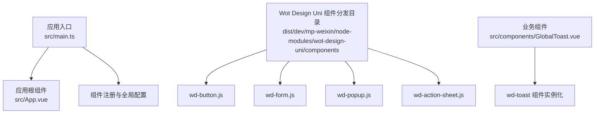
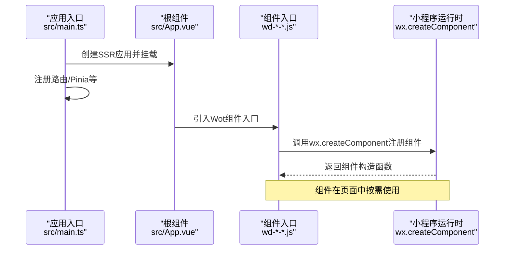
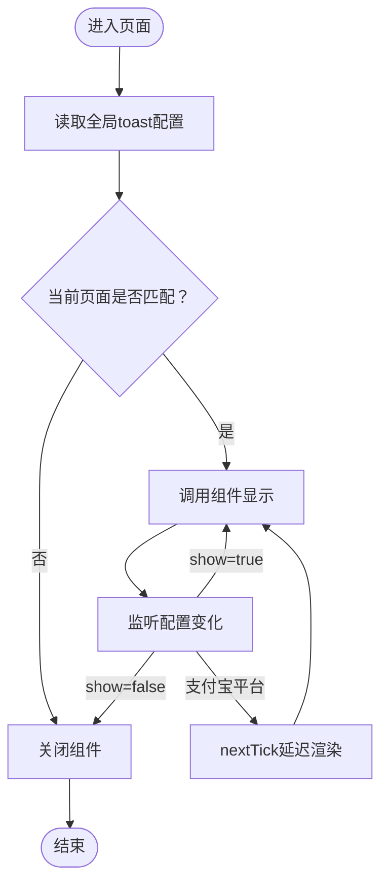
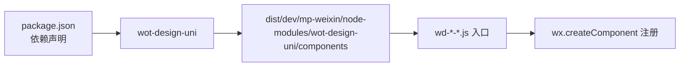

# UI组件库集成

<cite>
**本文引用的文件**
- [package.json](file://chuan-bill-app/package.json)
- [main.ts](file://chuan-bill-app/src/main.ts)
- [App.vue](file://chuan-bill-app/src/App.vue)
- [GlobalToast.vue](file://chuan-bill-app/src/components/GlobalToast.vue)
- [wd-button.js](file://chuan-bill-app/dist/dev/mp-weixin/node-modules/wot-design-uni/components/wd-button/wd-button.js)
- [wd-form.js](file://chuan-bill-app/dist/dev/mp-weixin/node-modules/wot-design-uni/components/wd-form/wd-form.js)
- [wd-popup.js](file://chuan-bill-app/dist/dev/mp-weixin/node-modules/wot-design-uni/components/wd-popup/wd-popup.js)
- [wd-action-sheet.js](file://chuan-bill-app/dist/dev/mp-weixin/node-modules/wot-design-uni/components/wd-action-sheet/wd-action-sheet.js)
</cite>

## 目录
1. [简介](#简介)
2. [项目结构](#项目结构)
3. [核心组件](#核心组件)
4. [架构总览](#架构总览)
5. [详细组件分析](#详细组件分析)
6. [依赖关系分析](#依赖关系分析)
7. [性能考虑](#性能考虑)
8. [故障排除指南](#故障排除指南)
9. [结论](#结论)
10. [附录](#附录)

## 简介
本文件面向“小川记账”应用的UI组件库集成，聚焦于Wot Design Uni组件库在多端（小程序、H5、App）环境中的安装配置、按需引入策略与主题定制方案，并对wd-action-sheet、wd-button、wd-form、wd-popup等核心UI组件进行使用说明与最佳实践指导。文档同时涵盖样式覆盖、响应式设计、性能优化与跨平台兼容性处理，帮助开发者快速、稳定地完成组件集成。

## 项目结构
项目采用Vue 3 + uni-app生态，构建工具为Vite，包管理器为pnpm。Wot Design Uni作为UI组件库通过依赖方式引入，组件在编译后以微信小程序形态分发至dist目录，组件入口文件统一通过require加载vendor变体并调用wx.createComponent注册。

图表来源
- [main.ts:1-16](file://chuan-bill-app/src/main.ts#L1-L16)
- [App.vue:1-16](file://chuan-bill-app/src/App.vue#L1-L16)
- [wd-button.js:1-4](file://chuan-bill-app/dist/dev/mp-weixin/node-modules/wot-design-uni/components/wd-button/wd-button.js#L1-L4)
- [wd-form.js:1-4](file://chuan-bill-app/dist/dev/mp-weixin/node-modules/wot-design-uni/components/wd-form/wd-form.js#L1-L4)
- [wd-popup.js:1-4](file://chuan-bill-app/dist/dev/mp-weixin/node-modules/wot-design-uni/components/wd-popup/wd-popup.js#L1-L4)
- [wd-action-sheet.js:1-4](file://chuan-bill-app/dist/dev/mp-weixin/node-modules/wot-design-uni/components/wd-action-sheet/wd-action-sheet.js#L1-L4)

章节来源
- [package.json:1-135](file://chuan-bill-app/package.json#L1-L135)
- [main.ts:1-16](file://chuan-bill-app/src/main.ts#L1-L16)
- [App.vue:1-16](file://chuan-bill-app/src/App.vue#L1-L16)

## 核心组件
本节概述本次集成涉及的核心组件及其职责：
- wd-button：基础按钮，支持多种尺寸、状态与主题色。
- wd-form：表单容器，提供校验上下文与布局能力。
- wd-popup：弹层容器，支持上/下/左/右滑出与遮罩层交互。
- wd-action-sheet：底部动作面板，用于选择操作项。

这些组件在编译产物中通过统一入口文件注册为小程序组件，业务侧可直接在页面或自定义组件中使用。

章节来源
- [wd-button.js:1-4](file://chuan-bill-app/dist/dev/mp-weixin/node-modules/wot-design-uni/components/wd-button/wd-button.js#L1-L4)
- [wd-form.js:1-4](file://chuan-bill-app/dist/dev/mp-weixin/node-modules/wot-design-uni/components/wd-form/wd-form.js#L1-L4)
- [wd-popup.js:1-4](file://chuan-bill-app/dist/dev/mp-weixin/node-modules/wot-design-uni/components/wd-popup/wd-popup.js#L1-L4)
- [wd-action-sheet.js:1-4](file://chuan-bill-app/dist/dev/mp-weixin/node-modules/wot-design-uni/components/wd-action-sheet/wd-action-sheet.js#L1-L4)

## 架构总览
下图展示从应用启动到组件渲染的关键路径：应用初始化 -> 注册全局依赖 -> 组件入口注册 -> 小程序运行时创建组件实例。

图表来源
- [main.ts:1-16](file://chuan-bill-app/src/main.ts#L1-L16)
- [App.vue:1-16](file://chuan-bill-app/src/App.vue#L1-L16)
- [wd-button.js:1-4](file://chuan-bill-app/dist/dev/mp-weixin/node-modules/wot-design-uni/components/wd-button/wd-button.js#L1-L4)
- [wd-form.js:1-4](file://chuan-bill-app/dist/dev/mp-weixin/node-modules/wot-design-uni/components/wd-form/wd-form.js#L1-L4)
- [wd-popup.js:1-4](file://chuan-bill-app/dist/dev/mp-weixin/node-modules/wot-design-uni/components/wd-popup/wd-popup.js#L1-L4)
- [wd-action-sheet.js:1-4](file://chuan-bill-app/dist/dev/mp-weixin/node-modules/wot-design-uni/components/wd-action-sheet/wd-action-sheet.js#L1-L4)

## 详细组件分析

### 安装与按需引入
- 安装：通过依赖管理器安装Wot Design Uni并在应用中引入。
- 按需引入：组件入口文件通过require加载vendor变体并注册为小程序组件，业务侧无需全局导入即可按需使用。
- 平台适配：部分平台（如支付宝小程序）存在特殊兼容处理，组件入口已内置条件编译逻辑。

章节来源
- [package.json:78-86](file://chuan-bill-app/package.json#L78-L86)
- [wd-button.js:1-4](file://chuan-bill-app/dist/dev/mp-weixin/node-modules/wot-design-uni/components/wd-button/wd-button.js#L1-L4)
- [wd-form.js:1-4](file://chuan-bill-app/dist/dev/mp-weixin/node-modules/wot-design-uni/components/wd-form/wd-form.js#L1-L4)
- [wd-popup.js:1-4](file://chuan-bill-app/dist/dev/mp-weixin/node-modules/wot-design-uni/components/wd-popup/wd-popup.js#L1-L4)
- [wd-action-sheet.js:1-4](file://chuan-bill-app/dist/dev/mp-weixin/node-modules/wot-design-uni/components/wd-action-sheet/wd-action-sheet.js#L1-L4)

### 主题定制方案
- 全局样式：在应用根组件中定义主题相关的CSS变量与类名，例如深色模式背景色切换。
- 组件级样式：通过组件的全局类名与样式隔离策略，结合UnoCSS等工具进行样式覆盖与扩展。
- 建议：集中维护主题变量，避免分散覆盖导致的维护成本上升。

章节来源
- [App.vue:5-14](file://chuan-bill-app/src/App.vue#L5-L14)

### wd-button 使用要点
- 使用场景：作为页面交互的主要触发器，支持禁用、加载态、不同尺寸与主题色。
- 注意事项：在特定平台（如支付宝小程序）可能需要额外的可见性处理，组件入口已内置条件编译。
- 最佳实践：按钮文案简洁明确；在异步操作中及时切换加载态；避免在同一页面重复渲染大量按钮。

章节来源
- [wd-button.js:1-4](file://chuan-bill-app/dist/dev/mp-weixin/node-modules/wot-design-uni/components/wd-button/wd-button.js#L1-L4)

### wd-form 使用要点
- 使用场景：承载输入类组件（如输入框、选择器），提供统一校验上下文与布局。
- 注意事项：表单字段需绑定正确的数据模型与校验规则；在提交前执行整体校验。
- 最佳实践：将复杂表单拆分为多个子表单模块；合理组织校验提示位置与样式。

章节来源
- [wd-form.js:1-4](file://chuan-bill-app/dist/dev/mp-weixin/node-modules/wot-design-uni/components/wd-form/wd-form.js#L1-L4)

### wd-popup 使用要点
- 使用场景：作为弹层容器，支持多方向滑出与遮罩层交互；常与动作面板、对话框组合使用。
- 注意事项：控制显隐时机，避免频繁创建销毁；注意与页面滚动的冲突。
- 最佳实践：在打开弹层时锁定背景滚动；关闭时清理事件监听与状态。

章节来源
- [wd-popup.js:1-4](file://chuan-bill-app/dist/dev/mp-weixin/node-modules/wot-design-uni/components/wd-popup/wd-popup.js#L1-L4)

### wd-action-sheet 使用要点
- 使用场景：底部动作面板，用于用户选择操作项；适合批量操作与危险操作确认。
- 注意事项：列表项数量不宜过多；为每个选项提供明确的文案与状态反馈。
- 最佳实践：在点击选项后立即关闭面板；对高风险操作增加二次确认。

章节来源
- [wd-action-sheet.js:1-4](file://chuan-bill-app/dist/dev/mp-weixin/node-modules/wot-design-uni/components/wd-action-sheet/wd-action-sheet.js#L1-L4)

### wd-toast 集成示例（参考）
- 使用场景：全局消息提示，支持自动关闭与手动关闭。
- 实现思路：业务组件通过组合式函数获取toast配置，根据当前页面路径决定是否显示；在支付宝小程序平台使用条件编译确保可见性。
- 关键点：watch监听配置变化；在非支付宝平台直接渲染组件；在支付宝平台通过nextTick延迟渲染以规避可见性问题。

图表来源
- [GlobalToast.vue:17-26](file://chuan-bill-app/src/components/GlobalToast.vue#L17-L26)
- [GlobalToast.vue:40-46](file://chuan-bill-app/src/components/GlobalToast.vue#L40-L46)

章节来源
- [GlobalToast.vue:1-47](file://chuan-bill-app/src/components/GlobalToast.vue#L1-L47)

## 依赖关系分析
Wot Design Uni作为UI组件库，通过依赖方式引入并在构建阶段被打包进最终产物。组件入口文件统一采用require加载vendor变体并注册为小程序组件，形成“依赖 → 编译产物 → 运行时注册”的链路。

图表来源
- [package.json:78-86](file://chuan-bill-app/package.json#L78-L86)
- [wd-button.js:1-4](file://chuan-bill-app/dist/dev/mp-weixin/node-modules/wot-design-uni/components/wd-button/wd-button.js#L1-L4)
- [wd-form.js:1-4](file://chuan-bill-app/dist/dev/mp-weixin/node-modules/wot-design-uni/components/wd-form/wd-form.js#L1-L4)
- [wd-popup.js:1-4](file://chuan-bill-app/dist/dev/mp-weixin/node-modules/wot-design-uni/components/wd-popup/wd-popup.js#L1-L4)
- [wd-action-sheet.js:1-4](file://chuan-bill-app/dist/dev/mp-weixin/node-modules/wot-design-uni/components/wd-action-sheet/wd-action-sheet.js#L1-L4)

章节来源
- [package.json:78-86](file://chuan-bill-app/package.json#L78-L86)

## 性能考虑
- 按需引入：仅在需要的页面或功能模块中使用对应组件，减少初始包体体积。
- 组件复用：将通用交互封装为可复用的业务组件（如全局提示），避免重复渲染。
- 平台差异：针对特定平台（如支付宝小程序）的兼容处理应尽量轻量，避免影响主线程。
- 样式优化：集中管理主题变量与样式覆盖，减少样式抖动与重绘。
- 渲染优化：在频繁更新的场景中，合理使用watch与nextTick，避免不必要的组件重建。

## 故障排除指南
- 组件不显示或白屏
  - 检查组件入口文件是否正确注册（wx.createComponent）。
  - 确认组件路径与vendor变体是否存在。
- 支付宝小程序可见性问题
  - 参考全局Toast组件的处理方式，在必要时使用nextTick延迟渲染。
- 样式覆盖无效
  - 确认组件的样式隔离策略与全局类名设置；检查UnoCSS等工具的优先级。
- 表单校验异常
  - 检查表单字段的数据绑定与校验规则；确保在提交前执行整体校验。

章节来源
- [GlobalToast.vue:9-15](file://chuan-bill-app/src/components/GlobalToast.vue#L9-L15)
- [GlobalToast.vue:40-46](file://chuan-bill-app/src/components/GlobalToast.vue#L40-L46)

## 结论
通过将Wot Design Uni集成到“小川记账”项目中，可以快速获得一套跨平台一致的UI组件体系。结合按需引入与主题定制策略，既能保证开发效率，又能兼顾性能与可维护性。建议在后续迭代中持续完善组件使用规范与最佳实践，确保多端体验的一致性与稳定性。

## 附录
- 快速开始
  - 在依赖中添加Wot Design Uni。
  - 在页面中直接使用wd-*组件标签。
  - 如需全局主题，可在根组件中集中定义CSS变量与类名。
- 推荐阅读
  - 组件入口文件的注册流程与平台适配逻辑。
  - 全局Toast组件的条件编译与可见性处理思路。