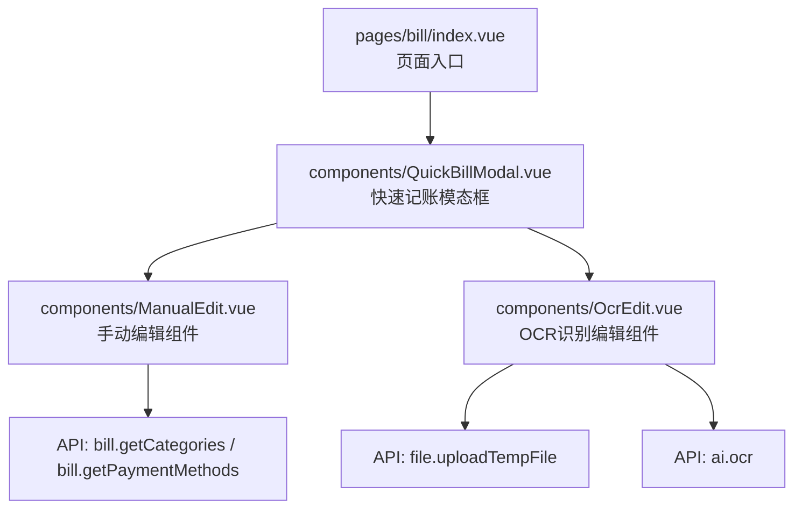
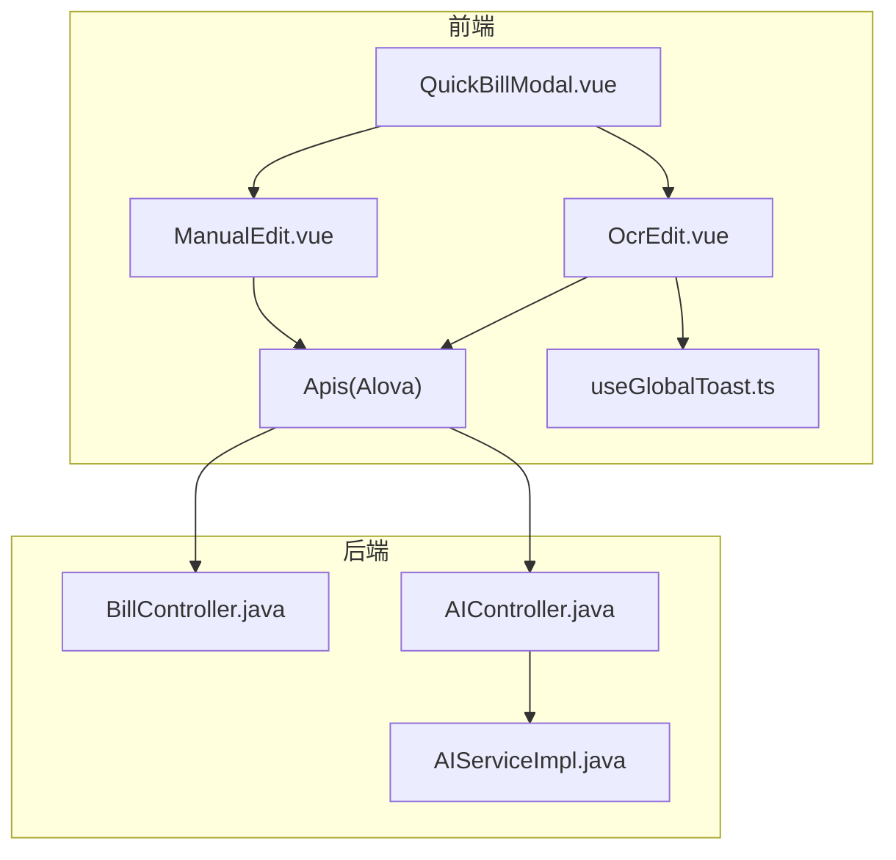
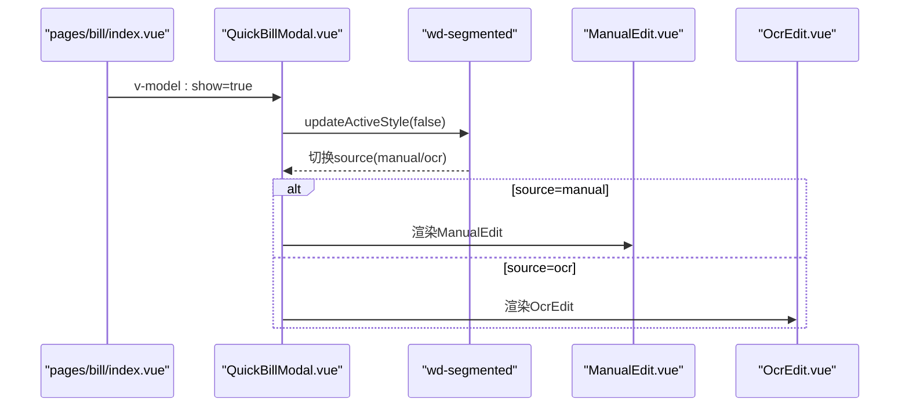
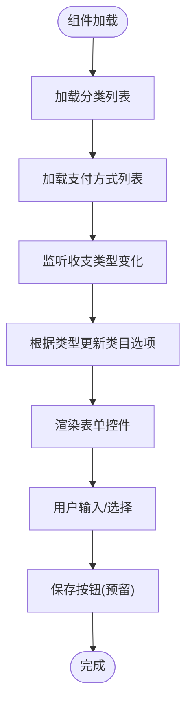
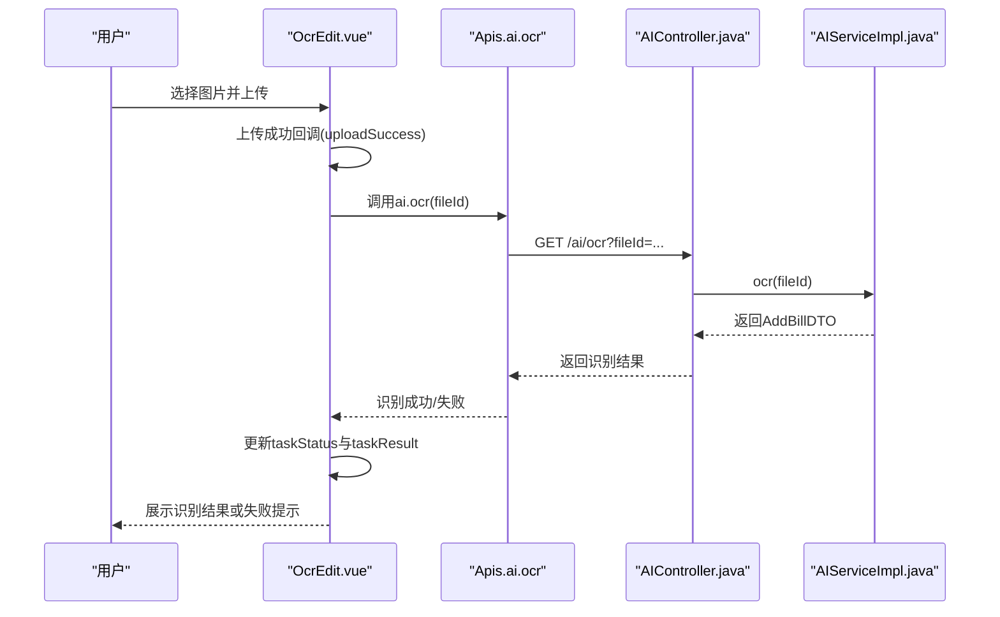
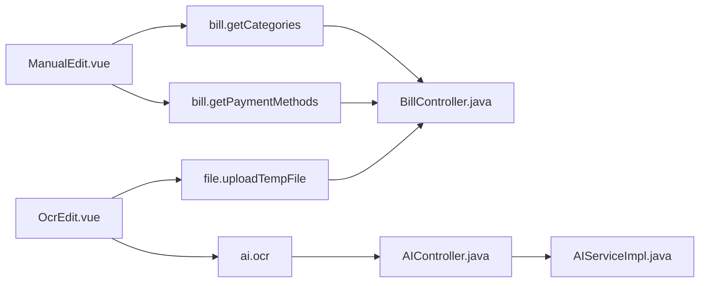

# 业务组件设计

<cite>
**本文引用的文件**
- [QuickBillModal.vue](file://chuan-bill-app/src/pages/bill/components/QuickBillModal.vue)
- [ManualEdit.vue](file://chuan-bill-app/src/pages/bill/components/ManualEdit.vue)
- [OcrEdit.vue](file://chuan-bill-app/src/pages/bill/components/OcrEdit.vue)
- [index.vue](file://chuan-bill-app/src/pages/bill/index.vue)
- [globals.d.ts](file://chuan-bill-app/src/api/globals.d.ts)
- [index.ts](file://chuan-bill-app/src/api/index.ts)
- [createApis.ts](file://chuan-bill-app/src/api/createApis.ts)
- [apiDefinitions.js](file://chuan-bill-app/dist/dev/mp-weixin/api/apiDefinitions.js)
- [AIController.java](file://chuan-bill-server/src/main/java/com/samoy/chuanbillserver/controller/AIController.java)
- [AIServiceImpl.java](file://chuan-bill-server/src/main/java/com/samoy/chuanbillserver/service/impl/AIServiceImpl.java)
- [BillController.java](file://chuan-bill-server/src/main/java/com/samoy/chuanbillserver/controller/BillController.java)
- [useGlobalToast.ts](file://chuan-bill-app/src/composables/useGlobalToast.ts)
</cite>

## 目录
1. [简介](#简介)
2. [项目结构](#项目结构)
3. [核心组件](#核心组件)
4. [架构总览](#架构总览)
5. [详细组件分析](#详细组件分析)
6. [依赖关系分析](#依赖关系分析)
7. [性能考虑](#性能考虑)
8. [故障排查指南](#故障排查指南)
9. [结论](#结论)
10. [附录](#附录)

## 简介
本技术文档围绕“小川记账”账单相关业务组件展开，重点解析以下三个组件的设计与实现：
- QuickBillModal 快速记账模态框：作为入口容器，聚合“手动添加”和“图片识别”两种记账入口，并提供底部弹起的交互体验。
- ManualEdit 手动编辑组件：提供完整的账单表单，支持收支类型、金额、名称、时间、类目、支付方式、共享家庭、备注等字段，具备动态联动与校验能力。
- OcrEdit OCR识别编辑组件：负责图片上传与AI识别流程，展示上传预览、扫描动画、识别状态与失败重试入口。

文档将从设计理念、功能职责、数据流转、状态管理、用户交互、组件通信、可配置性、错误处理与最佳实践等方面进行深入剖析，并给出使用示例与扩展开发指南。

## 项目结构
账单模块位于前端工程的 pages/bill 目录下，QuickBillModal 作为容器组件，内部按需渲染 ManualEdit 或 OcrEdit；页面入口 index.vue 中通过悬浮按钮触发 QuickBillModal 的显示。

图表来源
- [index.vue:1-54](file://chuan-bill-app/src/pages/bill/index.vue#L1-L54)
- [QuickBillModal.vue:1-64](file://chuan-bill-app/src/pages/bill/components/QuickBillModal.vue#L1-L64)
- [ManualEdit.vue:1-174](file://chuan-bill-app/src/pages/bill/components/ManualEdit.vue#L1-L174)
- [OcrEdit.vue:1-167](file://chuan-bill-app/src/pages/bill/components/OcrEdit.vue#L1-L167)

章节来源
- [index.vue:1-54](file://chuan-bill-app/src/pages/bill/index.vue#L1-L54)
- [QuickBillModal.vue:1-64](file://chuan-bill-app/src/pages/bill/components/QuickBillModal.vue#L1-L64)

## 核心组件
- QuickBillModal：以底部弹起的动作面板承载两种记账入口，通过分段选择器在 ManualEdit 与 OcrEdit 之间切换，具备虚拟宿主与样式隔离能力，保证组件复用性与主题兼容性。
- ManualEdit：基于表单模型驱动的完整账单录入界面，动态加载类目与支付方式列表，支持收支类型切换、金额输入、时间选择、共享开关、备注等，具备响应式联动与样式定制。
- OcrEdit：封装上传与识别流程，支持图片上传、上传预览、扫描动画、识别状态反馈与失败重试，内置全局 Toast 错误提示。

章节来源
- [QuickBillModal.vue:1-64](file://chuan-bill-app/src/pages/bill/components/QuickBillModal.vue#L1-L64)
- [ManualEdit.vue:1-174](file://chuan-bill-app/src/pages/bill/components/ManualEdit.vue#L1-L174)
- [OcrEdit.vue:1-167](file://chuan-bill-app/src/pages/bill/components/OcrEdit.vue#L1-L167)

## 架构总览
整体采用“前端组件 + 生成式API + 后端服务”的三层协作：
- 前端组件层：QuickBillModal、ManualEdit、OcrEdit 通过 Wot Design Uni 组件库与 Pinia 全局状态配合。
- API 层：通过 Alova 生成的 Apis 对象统一调用，涵盖账单、支付方式、分类、文件上传、AI OCR 等接口。
- 服务层：后端提供账单 CRUD、分类与支付方式查询、AI OCR 识别等接口，OCR 流程中读取临时文件并调用 OCR Agent 提取账单信息。

图表来源
- [QuickBillModal.vue:1-64](file://chuan-bill-app/src/pages/bill/components/QuickBillModal.vue#L1-L64)
- [ManualEdit.vue:1-174](file://chuan-bill-app/src/pages/bill/components/ManualEdit.vue#L1-L174)
- [OcrEdit.vue:1-167](file://chuan-bill-app/src/pages/bill/components/OcrEdit.vue#L1-L167)
- [index.ts:1-19](file://chuan-bill-app/src/api/index.ts#L1-L19)
- [createApis.ts:1-95](file://chuan-bill-app/src/api/createApis.ts#L1-L95)
- [BillController.java:1-90](file://chuan-bill-server/src/main/java/com/samoy/chuanbillserver/controller/BillController.java#L1-L90)
- [AIController.java:1-26](file://chuan-bill-server/src/main/java/com/samoy/chuanbillserver/controller/AIController.java#L1-L26)
- [AIServiceImpl.java:1-51](file://chuan-bill-server/src/main/java/com/samoy/chuanbillserver/service/impl/AIServiceImpl.java#L1-L51)
- [useGlobalToast.ts:1-62](file://chuan-bill-app/src/composables/useGlobalToast.ts#L1-L62)

## 详细组件分析

### QuickBillModal 快速记账模态框
- 设计理念
  - 以底部弹起的动作面板承载多种记账入口，降低页面层级复杂度，提升移动端交互效率。
  - 使用分段选择器在 ManualEdit 与 OcrEdit 间切换，保持单一入口与清晰的入口语义。
  - 通过虚拟宿主与样式隔离，确保组件可在不同页面复用且不受主题影响。
- 功能职责
  - 管理 source 选项（manual/ocr/voice），决定渲染哪个子组件。
  - 通过 v-model:show 控制模态框显隐。
  - 在 opened 事件中初始化分段选择器样式。
- 数据与状态
  - 内部状态：source（当前入口）、show（模态框显隐）。
  - 与子组件：ManualEdit、OcrEdit 通过模板插槽按需渲染。
- 用户交互
  - 底部弹起、点击遮罩可关闭（可配置）。
  - 分段选择器激活态样式由组件内部控制。
- 组件通信
  - 无跨组件事件冒泡，仅通过 props 与 v-model 传递状态。
- 可配置性
  - 支持虚拟宿主与样式隔离，便于在不同主题与布局中复用。
- 错误处理
  - 作为容器组件，不直接处理业务错误，交由子组件自行处理。

图表来源
- [index.vue:1-54](file://chuan-bill-app/src/pages/bill/index.vue#L1-L54)
- [QuickBillModal.vue:1-64](file://chuan-bill-app/src/pages/bill/components/QuickBillModal.vue#L1-L64)
- [ManualEdit.vue:1-174](file://chuan-bill-app/src/pages/bill/components/ManualEdit.vue#L1-L174)
- [OcrEdit.vue:1-167](file://chuan-bill-app/src/pages/bill/components/OcrEdit.vue#L1-L167)

章节来源
- [QuickBillModal.vue:1-64](file://chuan-bill-app/src/pages/bill/components/QuickBillModal.vue#L1-L64)
- [index.vue:1-54](file://chuan-bill-app/src/pages/bill/index.vue#L1-L54)

### ManualEdit 手动编辑组件
- 设计理念
  - 以表单模型为核心，集中管理账单录入的所有字段，支持动态联动（如收支类型切换导致类目选项变化）。
  - 通过统一的 AddBillDTO 类型约束前后端数据结构，减少映射成本。
- 功能职责
  - 加载分类与支付方式列表，构建表单项。
  - 支持收支类型切换、金额输入、名称输入、时间选择、类目与支付方式选择、共享开关与家庭选择、备注输入。
  - 通过全局 Toast 提示保存状态（保存按钮在模板中预留，实际保存逻辑在父组件或业务页面中处理）。
- 数据与状态
  - 表单模型：formData（AddBillDTO），包含 name、type、amount、time、categoryId、paymentMethodId、familyId、remark、source 等。
  - 下拉选项：categoryOptions、paymentMethodOptions，按收支类型动态切换。
  - 共享开关：isShared 控制是否显示家庭选择器。
- 用户交互
  - 收支类型为按钮组切换，金额输入为数字键盘，时间选择为日期时间选择器，类目与支付方式为选择器。
  - 共享开关开启后显示家庭选择器。
- 组件通信
  - 通过 Apis.bill.getCategories 与 Apis.bill.getPaymentMethods 获取数据，完成后填充下拉选项。
  - 保存按钮在模板中预留，具体保存逻辑由父组件接管。
- 可配置性
  - 通过虚拟宿主与样式隔离，适配不同主题与布局。
- 错误处理
  - 列表加载失败时，建议在父组件或页面层统一处理并提示。

图表来源
- [ManualEdit.vue:1-174](file://chuan-bill-app/src/pages/bill/components/ManualEdit.vue#L1-L174)
- [globals.d.ts:214-251](file://chuan-bill-app/src/api/globals.d.ts#L214-L251)

章节来源
- [ManualEdit.vue:1-174](file://chuan-bill-app/src/pages/bill/components/ManualEdit.vue#L1-L174)
- [globals.d.ts:214-251](file://chuan-bill-app/src/api/globals.d.ts#L214-L251)

### OcrEdit OCR识别编辑组件
- 设计理念
  - 将上传与识别流程封装为独立组件，提供直观的上传入口与识别状态反馈，失败时提供重试与手动输入入口。
  - 通过 TaskStatus 枚举管理上传、识别、成功、失败四种状态，保证流程可控。
- 功能职责
  - 图片上传：支持单文件、限制为图片类型，携带固定 token 请求头。
  - 识别任务：上传成功后触发 AI OCR 识别，展示扫描动画与状态提示。
  - 失败处理：识别失败时显示失败图标与提示，并提供重试与手动输入按钮。
- 数据与状态
  - 上传状态：fileList（上传队列）、tempFileInfo（临时文件信息）。
  - 识别状态：taskStatus（init/pending/success/failed）、taskResult（识别结果）。
  - 环境变量：VITE_API_UPLOAD_TEMP_FILE_URL。
- 用户交互
  - 点击上传区域触发选择图片，上传中显示扫描动画与遮罩层，识别完成后根据状态显示不同内容。
  - 失败时提供重试按钮与手动输入按钮。
- 组件通信
  - 通过 Apis.ai.ocr 触发识别，上传成功回调中解析响应并启动识别任务。
  - 识别失败时通过 useGlobalToast 提示错误。
- 可配置性
  - 上传地址与请求头可通过环境变量与组件属性配置。
- 错误处理
  - 上传失败或识别异常时，设置 taskStatus 为 failed 并提示用户重试或手动输入。

图表来源
- [OcrEdit.vue:1-167](file://chuan-bill-app/src/pages/bill/components/OcrEdit.vue#L1-L167)
- [AIController.java:1-26](file://chuan-bill-server/src/main/java/com/samoy/chuanbillserver/controller/AIController.java#L1-L26)
- [AIServiceImpl.java:1-51](file://chuan-bill-server/src/main/java/com/samoy/chuanbillserver/service/impl/AIServiceImpl.java#L1-L51)
- [globals.d.ts:1386-1395](file://chuan-bill-app/src/api/globals.d.ts#L1386-L1395)

章节来源
- [OcrEdit.vue:1-167](file://chuan-bill-app/src/pages/bill/components/OcrEdit.vue#L1-L167)
- [AIController.java:1-26](file://chuan-bill-server/src/main/java/com/samoy/chuanbillserver/controller/AIController.java#L1-L26)
- [AIServiceImpl.java:1-51](file://chuan-bill-server/src/main/java/com/samoy/chuanbillserver/service/impl/AIServiceImpl.java#L1-L51)
- [useGlobalToast.ts:1-62](file://chuan-bill-app/src/composables/useGlobalToast.ts#L1-L62)

## 依赖关系分析
- 组件依赖
  - QuickBillModal 依赖 ManualEdit 与 OcrEdit。
  - ManualEdit 依赖 Apis.bill.getCategories 与 Apis.bill.getPaymentMethods。
  - OcrEdit 依赖 Apis.file.uploadTempFile 与 Apis.ai.ocr。
- API 生成与调用
  - Apis 通过 Alova 生成，基于 apiDefinitions.js 中的路径映射，支持方法链式调用与类型推断。
- 后端接口
  - BillController 提供分类与支付方式查询。
  - AIController 提供 OCR 识别接口，AIServiceImpl 实现 OCR 逻辑并读取临时文件。

图表来源
- [ManualEdit.vue:1-174](file://chuan-bill-app/src/pages/bill/components/ManualEdit.vue#L1-L174)
- [OcrEdit.vue:1-167](file://chuan-bill-app/src/pages/bill/components/OcrEdit.vue#L1-L167)
- [apiDefinitions.js:1-19](file://chuan-bill-app/dist/dev/mp-weixin/api/apiDefinitions.js#L1-L19)
- [BillController.java:1-90](file://chuan-bill-server/src/main/java/com/samoy/chuanbillserver/controller/BillController.java#L1-L90)
- [AIController.java:1-26](file://chuan-bill-server/src/main/java/com/samoy/chuanbillserver/controller/AIController.java#L1-L26)
- [AIServiceImpl.java:1-51](file://chuan-bill-server/src/main/java/com/samoy/chuanbillserver/service/impl/AIServiceImpl.java#L1-L51)

章节来源
- [index.ts:1-19](file://chuan-bill-app/src/api/index.ts#L1-L19)
- [createApis.ts:1-95](file://chuan-bill-app/src/api/createApis.ts#L1-L95)
- [apiDefinitions.js:1-19](file://chuan-bill-app/dist/dev/mp-weixin/api/apiDefinitions.js#L1-L19)

## 性能考虑
- 组件渲染
  - QuickBillModal 通过条件渲染在 ManualEdit 与 OcrEdit 之间切换，避免同时渲染造成资源浪费。
- 列表加载
  - ManualEdit 在 onLoad 生命周期内一次性加载分类与支付方式，减少重复请求。
- 上传与识别
  - OcrEdit 限制上传为单文件，避免大文件带来的网络与内存压力；识别过程在后端执行，前端仅负责状态反馈。
- 主题与样式
  - 使用虚拟宿主与样式隔离，减少样式冲突与重绘开销。

## 故障排查指南
- 上传失败
  - 现象：OcrEdit 展示上传失败提示。
  - 排查：检查 VITE_API_UPLOAD_TEMP_FILE_URL 与 token 是否正确；确认后端文件上传接口可用。
  - 处理：使用 useGlobalToast 提示用户重试。
- 识别失败
  - 现象：识别状态为 failed，显示失败图标与提示。
  - 排查：确认 fileId 存在且临时文件未被删除；检查 AIController 与 AIServiceImpl 的 OCR 调用链路。
  - 处理：提供重试按钮，必要时引导用户手动输入。
- 分类/支付方式加载失败
  - 现象：ManualEdit 无法填充类目或支付方式下拉框。
  - 排查：检查 Apis.bill.getCategories 与 Apis.bill.getPaymentMethods 的返回值与网络状态。
  - 处理：在父组件或页面层统一捕获错误并提示用户刷新。

章节来源
- [OcrEdit.vue:1-167](file://chuan-bill-app/src/pages/bill/components/OcrEdit.vue#L1-L167)
- [useGlobalToast.ts:1-62](file://chuan-bill-app/src/composables/useGlobalToast.ts#L1-L62)
- [BillController.java:1-90](file://chuan-bill-server/src/main/java/com/samoy/chuanbillserver/controller/BillController.java#L1-L90)
- [AIController.java:1-26](file://chuan-bill-server/src/main/java/com/samoy/chuanbillserver/controller/AIController.java#L1-L26)

## 结论
QuickBillModal、ManualEdit、OcrEdit 三者协同构建了“小川记账”的账单录入体系：QuickBillModal 作为统一入口，ManualEdit 提供完善的表单录入能力，OcrEdit 通过上传与识别流程提升录入效率。组件均具备良好的可配置性与复用性，结合 Alova 生成式 API 与后端服务，形成清晰的数据流与交互闭环。建议在实际业务中进一步完善保存逻辑与错误兜底，确保用户体验与数据一致性。

## 附录
- 组件使用示例
  - 在页面中引入 QuickBillModal，并通过 v-model:show 控制显示与隐藏。
  - ManualEdit 与 OcrEdit 作为子组件按需渲染，无需额外传参即可使用。
- 扩展开发指南
  - 新增入口：在 QuickBillModal 的 sourceOptions 中新增入口项，并在模板中添加对应组件渲染分支。
  - 新增字段：在 ManualEdit 的 formData 与 AddBillDTO 中增加字段，并在表单与后端接口中同步扩展。
  - 新增识别入口：在 OcrEdit 中扩展上传类型与识别流程，保持状态机与错误处理一致。
- 最佳实践
  - 统一使用 Apis 对象进行接口调用，确保类型安全与可维护性。
  - 使用虚拟宿主与样式隔离，避免主题与布局对组件的影响。
  - 对上传与识别等异步流程，提供明确的状态反馈与错误提示。