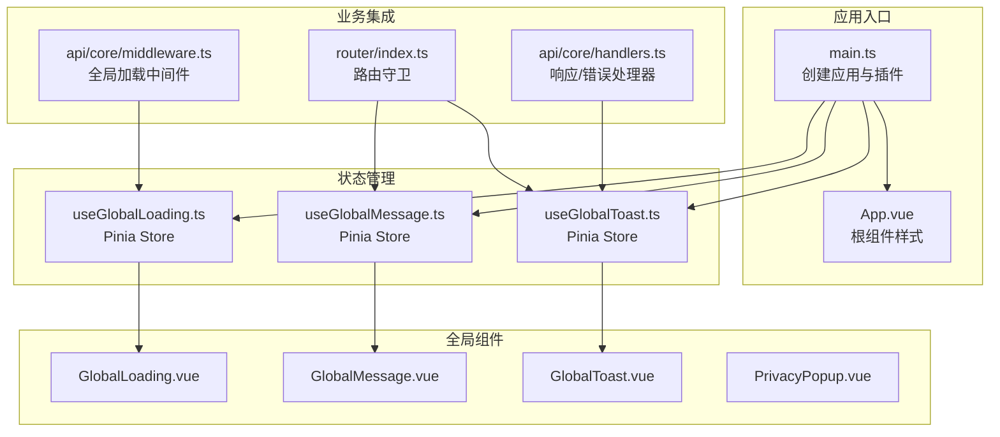
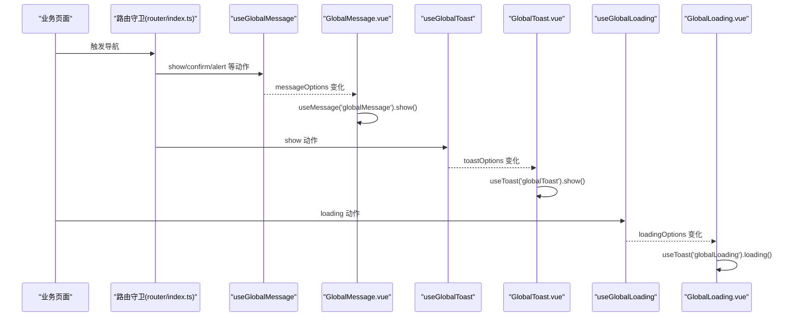
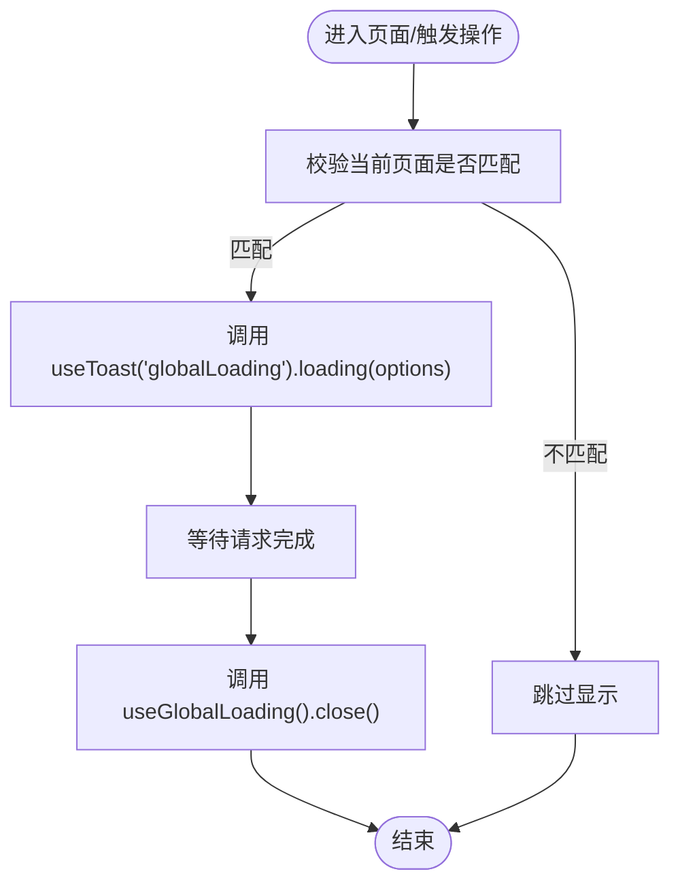
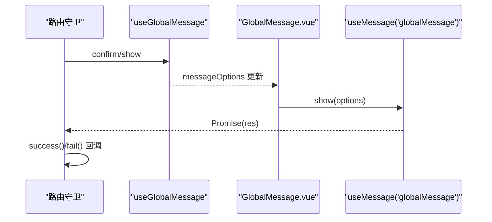
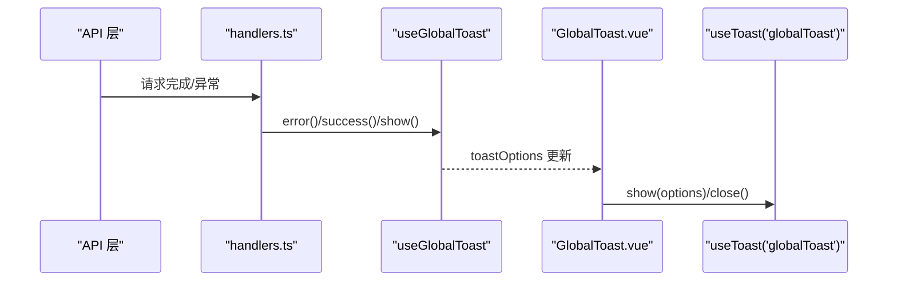
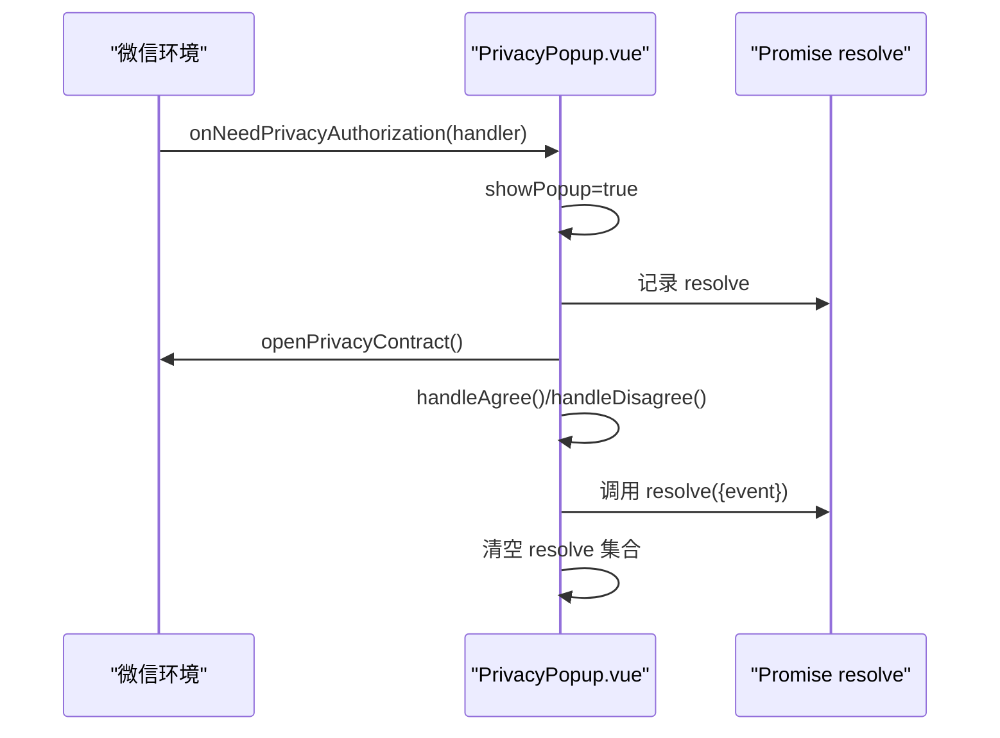
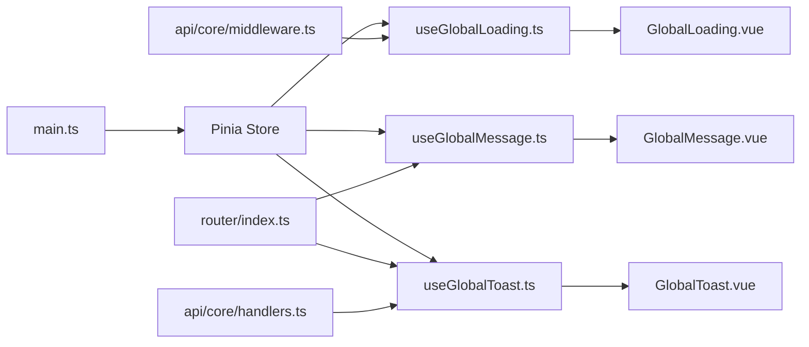

# 全局组件系统

<cite>
**本文引用的文件**
- [GlobalLoading.vue](file://chuan-bill-app/src/components/GlobalLoading.vue)
- [GlobalMessage.vue](file://chuan-bill-app/src/components/GlobalMessage.vue)
- [GlobalToast.vue](file://chuan-bill-app/src/components/GlobalToast.vue)
- [PrivacyPopup.vue](file://chuan-bill-app/src/components/PrivacyPopup.vue)
- [useGlobalLoading.ts](file://chuan-bill-app/src/composables/useGlobalLoading.ts)
- [useGlobalMessage.ts](file://chuan-bill-app/src/composables/useGlobalMessage.ts)
- [useGlobalToast.ts](file://chuan-bill-app/src/composables/useGlobalToast.ts)
- [main.ts](file://chuan-bill-app/src/main.ts)
- [App.vue](file://chuan-bill-app/src/App.vue)
- [router/index.ts](file://chuan-bill-app/src/router/index.ts)
- [api/core/middleware.ts](file://chuan-bill-app/src/api/core/middleware.ts)
- [api/core/handlers.ts](file://chuan-bill-app/src/api/core/handlers.ts)
</cite>

## 目录
1. [简介](#简介)
2. [项目结构](#项目结构)
3. [核心组件](#核心组件)
4. [架构总览](#架构总览)
5. [详细组件分析](#详细组件分析)
6. [依赖关系分析](#依赖关系分析)
7. [性能考量](#性能考量)
8. [故障排查指南](#故障排查指南)
9. [结论](#结论)
10. [附录](#附录)

## 简介
本文件系统性梳理“小川记账”小程序前端的全局组件体系，重点覆盖以下通用组件的设计与实现：
- 全局 Loading
- 全局消息提示（Message）
- 全局轻提示（Toast）
- 隐私弹窗（PrivacyPopup）

文档从架构、数据流、生命周期、状态共享、配置参数、显示/关闭策略、动画与交互、性能优化、可扩展性与样式定制、国际化支持等方面进行深入解析，并给出使用场景、调用方式与最佳实践。

## 项目结构
全局组件位于应用源码目录的组件与组合式函数层，配合 Pinia Store 实现跨页面的状态共享；同时通过路由守卫与 API 中间件在业务流程的关键节点自动触发全局提示与加载状态。

图表来源
- [main.ts:1-16](file://chuan-bill-app/src/main.ts#L1-L16)
- [App.vue:1-16](file://chuan-bill-app/src/App.vue#L1-L16)
- [GlobalLoading.vue:1-47](file://chuan-bill-app/src/components/GlobalLoading.vue#L1-L47)
- [GlobalMessage.vue:1-56](file://chuan-bill-app/src/components/GlobalMessage.vue#L1-L56)
- [GlobalToast.vue:1-47](file://chuan-bill-app/src/components/GlobalToast.vue#L1-L47)
- [PrivacyPopup.vue:1-174](file://chuan-bill-app/src/components/PrivacyPopup.vue#L1-L174)
- [useGlobalLoading.ts:1-38](file://chuan-bill-app/src/composables/useGlobalLoading.ts#L1-L38)
- [useGlobalMessage.ts:1-53](file://chuan-bill-app/src/composables/useGlobalMessage.ts#L1-L53)
- [useGlobalToast.ts:1-62](file://chuan-bill-app/src/composables/useGlobalToast.ts#L1-L62)
- [router/index.ts:1-80](file://chuan-bill-app/src/router/index.ts#L1-L80)
- [api/core/middleware.ts:1-93](file://chuan-bill-app/src/api/core/middleware.ts#L1-L93)
- [api/core/handlers.ts:1-105](file://chuan-bill-app/src/api/core/handlers.ts#L1-L105)

章节来源
- [main.ts:1-16](file://chuan-bill-app/src/main.ts#L1-L16)
- [router/index.ts:1-80](file://chuan-bill-app/src/router/index.ts#L1-L80)

## 核心组件
本节概述四个全局组件的职责与关键行为：
- 全局 Loading：统一显示/关闭加载状态，支持延迟显示以避免闪烁。
- 全局消息提示（Message）：统一的消息对话框，支持确认/取消、提示类型、回调。
- 全局轻提示（Toast）：统一的轻量提示，支持多种图标类型与持续时间。
- 隐私弹窗（PrivacyPopup）：微信隐私授权流程的弹窗封装，负责展示协议与处理同意/拒绝。

章节来源
- [GlobalLoading.vue:1-47](file://chuan-bill-app/src/components/GlobalLoading.vue#L1-L47)
- [GlobalMessage.vue:1-56](file://chuan-bill-app/src/components/GlobalMessage.vue#L1-L56)
- [GlobalToast.vue:1-47](file://chuan-bill-app/src/components/GlobalToast.vue#L1-L47)
- [PrivacyPopup.vue:1-174](file://chuan-bill-app/src/components/PrivacyPopup.vue#L1-L174)

## 架构总览
全局组件采用“Store 驱动 + 组件订阅”的模式：
- Store 管理全局状态（当前页面路径、显示配置等）。
- 组件通过 storeToRefs 订阅状态变化，按需显示/关闭。
- 路由守卫与 API 中间件在合适时机调用 Store 的动作方法，驱动全局提示。

图表来源
- [router/index.ts:24-77](file://chuan-bill-app/src/router/index.ts#L24-L77)
- [useGlobalMessage.ts:14-52](file://chuan-bill-app/src/composables/useGlobalMessage.ts#L14-L52)
- [useGlobalToast.ts:13-61](file://chuan-bill-app/src/composables/useGlobalToast.ts#L13-L61)
- [useGlobalLoading.ts:13-37](file://chuan-bill-app/src/composables/useGlobalLoading.ts#L13-L37)
- [GlobalMessage.vue:17-35](file://chuan-bill-app/src/components/GlobalMessage.vue#L17-L35)
- [GlobalToast.vue:17-26](file://chuan-bill-app/src/components/GlobalToast.vue#L17-L26)
- [GlobalLoading.vue:17-26](file://chuan-bill-app/src/components/GlobalLoading.vue#L17-L26)

## 详细组件分析

### 全局 Loading 组件
- 设计要点
  - 通过 Pinia Store 管理 loadingOptions 与当前页面路径，组件订阅状态变化后决定是否显示。
  - 支持平台差异（如支付宝小程序）通过条件渲染与 nextTick hack 保证首次渲染稳定。
  - 默认配置包含图标、遮罩、位置等，确保一致的视觉体验。
- 生命周期与状态共享
  - 组件挂载后监听 store 变化；当 currentPage 与当前路由一致时才显示，避免跨页面干扰。
  - 关闭时重置状态，清理当前页面标记。
- 配置参数与显示时机
  - 通过中间件在请求前后自动控制显示/关闭；可配置延迟显示以避免快速请求闪烁。
- 关闭策略与动画
  - 无显式动画配置，依赖底层组件库的默认过渡。
- 使用场景与调用方式
  - 在路由守卫、API 请求、业务操作前后调用 Store 的 loading/close 方法。
- 性能优化
  - 延迟加载中间件减少频繁闪烁；仅在当前页面变更时生效，降低无效渲染。

图表来源
- [GlobalLoading.vue:17-26](file://chuan-bill-app/src/components/GlobalLoading.vue#L17-L26)
- [useGlobalLoading.ts:21-35](file://chuan-bill-app/src/composables/useGlobalLoading.ts#L21-L35)
- [api/core/middleware.ts:58-86](file://chuan-bill-app/src/api/core/middleware.ts#L58-L86)

章节来源
- [GlobalLoading.vue:1-47](file://chuan-bill-app/src/components/GlobalLoading.vue#L1-L47)
- [useGlobalLoading.ts:1-38](file://chuan-bill-app/src/composables/useGlobalLoading.ts#L1-L38)
- [api/core/middleware.ts:1-93](file://chuan-bill-app/src/api/core/middleware.ts#L1-L93)

### 全局消息提示（Message）组件
- 设计要点
  - 封装消息框组件，支持 alert/confirm/prompt 等类型，统一按钮圆角风格。
  - 通过回调 success/fail 处理用户选择结果。
- 生命周期与状态共享
  - 组件订阅 messageOptions，当存在且当前页面匹配时调用 useMessage('globalMessage').show()。
- 配置参数与显示时机
  - 支持字符串快捷传参；默认隐藏取消按钮用于 alert 类型。
- 关闭策略
  - 无显式关闭按钮时，依赖底层组件的关闭逻辑；store 中置空 messageOptions。
- 使用场景与调用方式
  - 路由守卫中用于确认/取消导航；也可在业务流程中进行二次确认。

图表来源
- [router/index.ts:33-54](file://chuan-bill-app/src/router/index.ts#L33-L54)
- [useGlobalMessage.ts:19-50](file://chuan-bill-app/src/composables/useGlobalMessage.ts#L19-L50)
- [GlobalMessage.vue:17-35](file://chuan-bill-app/src/components/GlobalMessage.vue#L17-L35)

章节来源
- [GlobalMessage.vue:1-56](file://chuan-bill-app/src/components/GlobalMessage.vue#L1-L56)
- [useGlobalMessage.ts:1-53](file://chuan-bill-app/src/composables/useGlobalMessage.ts#L1-L53)
- [router/index.ts:1-80](file://chuan-bill-app/src/router/index.ts#L1-L80)

### 全局轻提示（Toast）组件
- 设计要点
  - 提供 success/info/warning/error 等便捷方法，统一图标与时长。
  - 默认居中显示，支持自定义时长与文案。
- 生命周期与状态共享
  - 组件订阅 toastOptions，当 show 为真且当前页面匹配时调用 useToast('globalToast').show()。
- 配置参数与显示时机
  - 支持字符串快捷传参；默认时长与位置可覆盖。
- 关闭策略
  - 到期自动关闭；也可通过 close 动作手动关闭。
- 使用场景与调用方式
  - API 错误/成功提示、路由守卫后的页面切换提示等。

图表来源
- [api/core/handlers.ts:34-104](file://chuan-bill-app/src/api/core/handlers.ts#L34-L104)
- [useGlobalToast.ts:19-59](file://chuan-bill-app/src/composables/useGlobalToast.ts#L19-L59)
- [GlobalToast.vue:17-26](file://chuan-bill-app/src/components/GlobalToast.vue#L17-L26)

章节来源
- [GlobalToast.vue:1-47](file://chuan-bill-app/src/components/GlobalToast.vue#L1-L47)
- [useGlobalToast.ts:1-62](file://chuan-bill-app/src/composables/useGlobalToast.ts#L1-L62)
- [api/core/handlers.ts:1-105](file://chuan-bill-app/src/api/core/handlers.ts#L1-L105)

### 隐私弹窗（PrivacyPopup）
- 设计要点
  - 封装微信隐私授权流程，监听 wx.onNeedPrivacyAuthorization 并弹窗展示。
  - 提供 agree/disagree 事件与 openPrivacyContract 打开协议。
- 生命周期与状态共享
  - 组件内部维护 showPopup 与 resolve 集合，处理多处授权需求。
- 配置参数
  - 支持标题、描述、子描述、协议名称等 props 自定义。
- 关闭策略
  - 同意/拒绝后清理 resolve 集合；关闭时也清空集合。
- 使用场景与调用方式
  - 作为应用根组件的一部分，在启动阶段自动注册监听，无需手动调用。

图表来源
- [PrivacyPopup.vue:28-79](file://chuan-bill-app/src/components/PrivacyPopup.vue#L28-L79)
- [PrivacyPopup.vue:92-123](file://chuan-bill-app/src/components/PrivacyPopup.vue#L92-L123)

章节来源
- [PrivacyPopup.vue:1-174](file://chuan-bill-app/src/components/PrivacyPopup.vue#L1-L174)

## 依赖关系分析
- 应用入口
  - main.ts 创建应用并注入 Pinia，确保全局 Store 可用。
- 组件与 Store
  - GlobalLoading/GlobalMessage/GlobalToast 通过 storeToRefs 订阅对应 Store 的状态。
  - Store 的动作方法在路由守卫与 API 中间件中被调用。
- 路由与业务集成
  - 路由守卫在导航前后触发全局提示；API 中间件在请求前后控制 Loading。
- 第三方组件库
  - 组件基于 wot-design-uni 的 wd-toast、wd-message-box、wd-popup 等组件实现。

图表来源
- [main.ts:6-11](file://chuan-bill-app/src/main.ts#L6-L11)
- [useGlobalLoading.ts:13-37](file://chuan-bill-app/src/composables/useGlobalLoading.ts#L13-L37)
- [useGlobalMessage.ts:14-52](file://chuan-bill-app/src/composables/useGlobalMessage.ts#L14-L52)
- [useGlobalToast.ts:13-61](file://chuan-bill-app/src/composables/useGlobalToast.ts#L13-L61)
- [router/index.ts:33-71](file://chuan-bill-app/src/router/index.ts#L33-L71)
- [api/core/middleware.ts:62-84](file://chuan-bill-app/src/api/core/middleware.ts#L62-L84)
- [api/core/handlers.ts:37-101](file://chuan-bill-app/src/api/core/handlers.ts#L37-L101)

章节来源
- [main.ts:1-16](file://chuan-bill-app/src/main.ts#L1-L16)
- [router/index.ts:1-80](file://chuan-bill-app/src/router/index.ts#L1-L80)
- [api/core/middleware.ts:1-93](file://chuan-bill-app/src/api/core/middleware.ts#L1-L93)
- [api/core/handlers.ts:1-105](file://chuan-bill-app/src/api/core/handlers.ts#L1-L105)

## 性能考量
- 避免闪烁
  - 使用延迟加载中间件（默认 300ms）在快速请求时抑制 Loading 显示。
- 减少无效渲染
  - 仅在 currentPage 与当前路由一致时显示全局组件，避免跨页面重复渲染。
- 轻提示时长
  - Toast 默认时长与图标类型按场景预设，减少不必要的配置开销。
- 资源占用
  - 组件库为全局引入，建议在构建阶段按需裁剪或启用 Tree Shaking（视项目配置而定）。

章节来源
- [api/core/middleware.ts:7-22](file://chuan-bill-app/src/api/core/middleware.ts#L7-L22)
- [useGlobalLoading.ts:21-35](file://chuan-bill-app/src/composables/useGlobalLoading.ts#L21-L35)
- [useGlobalToast.ts:9-12](file://chuan-bill-app/src/composables/useGlobalToast.ts#L9-L12)

## 故障排查指南
- 隐私授权未弹窗
  - 检查微信环境是否注册了 wx.onNeedPrivacyAuthorization；确认 PrivacyPopup 已挂载。
- 全局 Loading 不显示
  - 确认 currentPage 与当前路由一致；检查延迟中间件是否提前关闭。
- 全局消息提示不触发
  - 检查 messageOptions 是否正确设置；确认 useMessage('globalMessage').show() 被调用。
- Toast 未自动关闭
  - 检查 toastOptions.duration 设置；确认 useGlobalToast().close() 是否被调用。
- 路由守卫中提示无效
  - 确保在导航守卫中正确调用 useGlobalMessage/useGlobalToast 的动作方法，并处理回调。

章节来源
- [PrivacyPopup.vue:28-37](file://chuan-bill-app/src/components/PrivacyPopup.vue#L28-L37)
- [GlobalLoading.vue:17-26](file://chuan-bill-app/src/components/GlobalLoading.vue#L17-L26)
- [GlobalMessage.vue:17-35](file://chuan-bill-app/src/components/GlobalMessage.vue#L17-L35)
- [useGlobalToast.ts:56-59](file://chuan-bill-app/src/composables/useGlobalToast.ts#L56-L59)
- [router/index.ts:33-71](file://chuan-bill-app/src/router/index.ts#L33-L71)

## 结论
全局组件系统通过 Pinia Store 实现跨页面状态共享，结合路由守卫与 API 中间件在关键节点自动触发提示与加载，形成一致、可控、低侵入的用户体验。组件具备良好的扩展性与可维护性，适合在复杂业务场景中复用与定制。

## 附录

### 组件配置参数速览
- 全局 Loading
  - 关键字段：show、iconName、duration、cover、position
  - 默认值：show=false
  - 适用场景：请求前显示加载，避免闪烁
- 全局消息提示（Message）
  - 关键字段：type、title、msg、showCancelButton、confirmButtonProps、cancelButtonProps
  - 默认值：confirmButtonProps.round=false、cancelButtonProps.round=false
  - 适用场景：确认/取消、提示类交互
- 全局轻提示（Toast）
  - 关键字段：msg、iconName、duration、position、show
  - 默认值：duration=2000、show=false、position='middle'
  - 适用场景：成功/失败/警告/信息提示
- 隐私弹窗（PrivacyPopup）
  - 关键字段：title、desc、subDesc、protocol
  - 默认值：标题/描述/子描述/协议名称
  - 适用场景：微信隐私授权流程

章节来源
- [useGlobalLoading.ts:10-12](file://chuan-bill-app/src/composables/useGlobalLoading.ts#L10-L12)
- [useGlobalMessage.ts:24-29](file://chuan-bill-app/src/composables/useGlobalMessage.ts#L24-L29)
- [useGlobalToast.ts:9-12](file://chuan-bill-app/src/composables/useGlobalToast.ts#L9-L12)
- [PrivacyPopup.vue:4-16](file://chuan-bill-app/src/components/PrivacyPopup.vue#L4-L16)

### 使用场景与调用方式
- 路由守卫
  - 导航拦截：使用 useGlobalMessage().confirm/show，处理 success/fail 回调。
  - 页面切换提示：使用 useGlobalToast().show。
- API 请求
  - 全局加载：使用 createGlobalLoadingMiddleware 控制 Loading 显示/关闭。
  - 错误提示：在 handleAlovaError 中根据错误类型调用 useGlobalToast().error。
- 隐私授权
  - 无需手动调用，PrivacyPopup 在启动时自动注册监听。

章节来源
- [router/index.ts:33-71](file://chuan-bill-app/src/router/index.ts#L33-L71)
- [api/core/middleware.ts:49-86](file://chuan-bill-app/src/api/core/middleware.ts#L49-L86)
- [api/core/handlers.ts:71-101](file://chuan-bill-app/src/api/core/handlers.ts#L71-L101)
- [PrivacyPopup.vue:28-37](file://chuan-bill-app/src/components/PrivacyPopup.vue#L28-L37)

### 扩展开发与样式定制
- 扩展新全局组件
  - 新建 Store（参考 useGlobalLoading.ts）与组件（参考 GlobalLoading.vue）。
  - 在组件中订阅 storeToRefs，按需调用底层组件库方法。
- 样式定制
  - 组件采用 shared 样式隔离，可在全局样式中覆盖组件库默认样式。
  - PrivacyPopup 提供 scoped 样式与深选择器示例，便于主题化。
- 国际化支持
  - 文案通过 props 传入（PrivacyPopup）或 Store 动作参数（Message/Toast），可在上层按语言切换动态传入。

章节来源
- [GlobalLoading.vue:29-36](file://chuan-bill-app/src/components/GlobalLoading.vue#L29-L36)
- [GlobalMessage.vue:38-46](file://chuan-bill-app/src/components/GlobalMessage.vue#L38-L46)
- [GlobalToast.vue:29-36](file://chuan-bill-app/src/components/GlobalToast.vue#L29-L36)
- [PrivacyPopup.vue:82-89](file://chuan-bill-app/src/components/PrivacyPopup.vue#L82-L89)