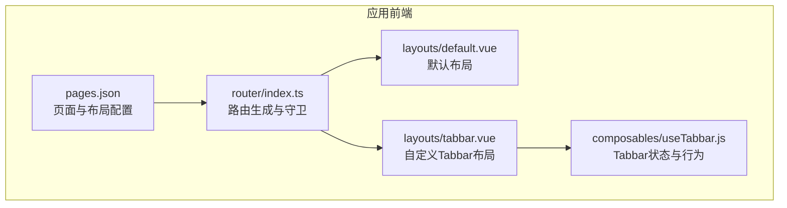
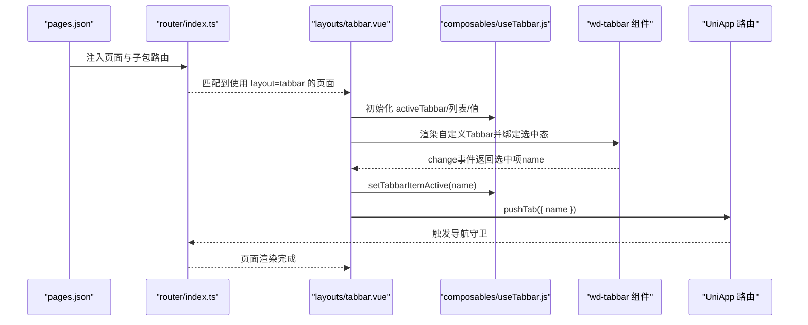
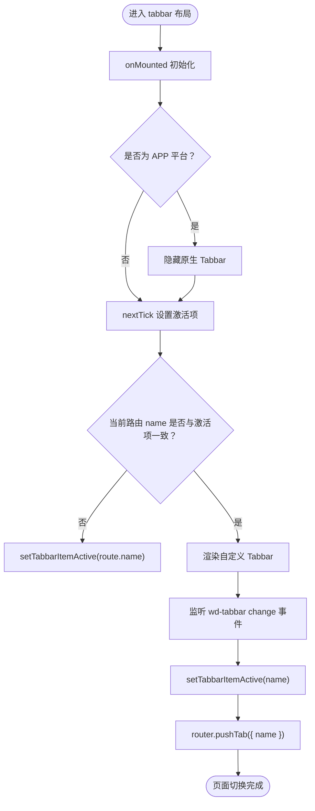
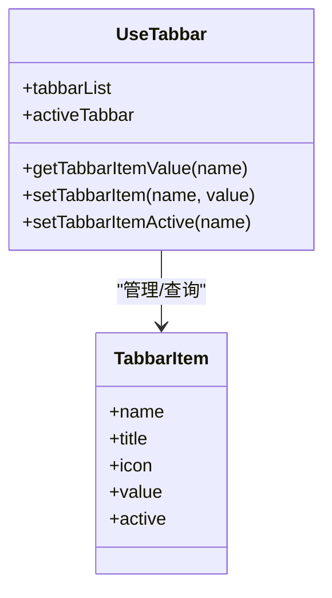
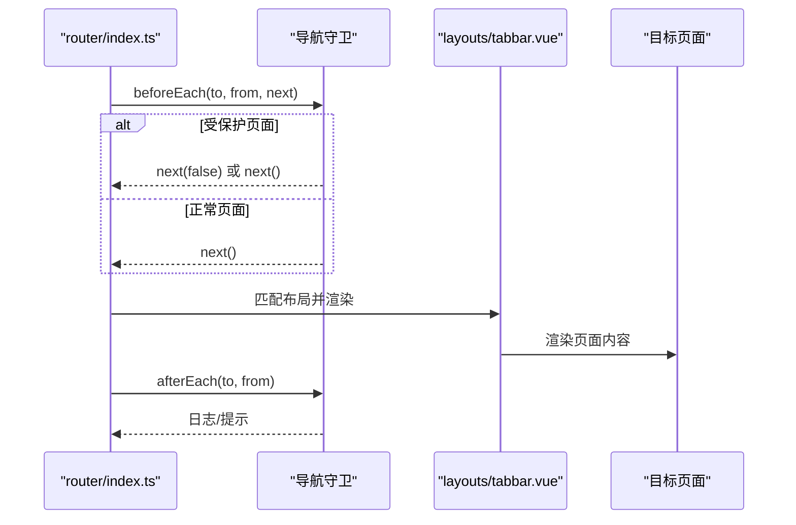
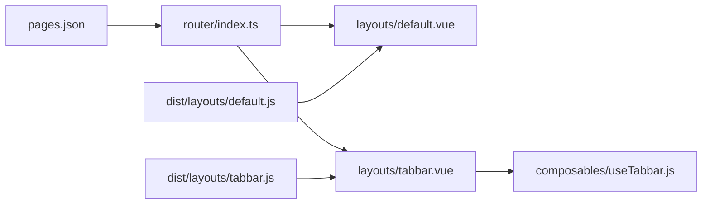

# 布局组件系统

<cite>
**本文引用的文件**
- [src/layouts/default.vue](file://chuan-bill-app/src/layouts/default.vue)
- [src/layouts/tabbar.vue](file://chuan-bill-app/src/layouts/tabbar.vue)
- [dist/dev/mp-weixin/layouts/default.js](file://chuan-bill-app/dist/dev/mp-weixin/layouts/default.js)
- [dist/dev/mp-weixin/layouts/tabbar.js](file://chuan-bill-app/dist/dev/mp-weixin/layouts/tabbar.js)
- [dist/dev/mp-weixin/composables/useTabbar.js](file://chuan-bill-app/dist/dev/mp-weixin/composables/useTabbar.js)
- [src/router/index.ts](file://chuan-bill-app/src/router/index.ts)
- [src/pages.json](file://chuan-bill-app/src/pages.json)
- [src/theme.json](file://chuan-bill-app/src/theme.json)
- [dist/dev/mp-weixin/theme.json](file://chuan-bill-app/dist/dev/mp-weixin/theme.json)
</cite>

## 目录
1. [简介](#简介)
2. [项目结构](#项目结构)
3. [核心组件](#核心组件)
4. [架构总览](#架构总览)
5. [详细组件分析](#详细组件分析)
6. [依赖关系分析](#依赖关系分析)
7. [性能考虑](#性能考虑)
8. [故障排查指南](#故障排查指南)
9. [结论](#结论)
10. [附录](#附录)

## 简介
本技术文档聚焦于“小川记账”的布局组件系统，围绕 default 布局与 tabbar 布局展开，系统性解析其设计架构、实现原理与运行机制。内容涵盖：
- 布局组件的结构设计与职责边界
- 路由集成与页面切换机制
- 导航状态管理（含自定义 Tabbar）
- 布局与页面组件的通信方式与数据传递策略
- 主题适配、响应式布局与跨平台兼容性
- 扩展开发建议、性能优化与最佳实践

## 项目结构
布局组件位于应用前端源码的 layouts 目录中，并通过 pages.json 的 layout 字段与具体页面进行绑定；路由配置由虚拟生成的 pages 与 subPackages 合并而来，统一注入到路由器中。

图示来源
- [src/pages.json:15-55](file://chuan-bill-app/src/pages.json#L15-L55)
- [src/router/index.ts:4-23](file://chuan-bill-app/src/router/index.ts#L4-L23)
- [src/layouts/default.vue:14-16](file://chuan-bill-app/src/layouts/default.vue#L14-L16)
- [src/layouts/tabbar.vue:35-47](file://chuan-bill-app/src/layouts/tabbar.vue#L35-L47)
- [dist/dev/mp-weixin/composables/useTabbar.js:3-8](file://chuan-bill-app/dist/dev/mp-weixin/composables/useTabbar.js#L3-L8)

章节来源
- [src/pages.json:15-55](file://chuan-bill-app/src/pages.json#L15-L55)
- [src/router/index.ts:4-23](file://chuan-bill-app/src/router/index.ts#L4-L23)

## 核心组件
- default 布局：作为通用兜底布局，提供全局样式隔离与插槽承载能力，适合非 Tabbar 场景或需要统一容器包装的页面。
- tabbar 布局：在 default 基础上叠加自定义 Tabbar 组件，负责 Tabbar 的渲染、选中态管理、点击切换与路由跳转，同时隐藏平台原生 Tabbar 以统一视觉体验。

章节来源
- [src/layouts/default.vue:14-16](file://chuan-bill-app/src/layouts/default.vue#L14-L16)
- [src/layouts/tabbar.vue:35-47](file://chuan-bill-app/src/layouts/tabbar.vue#L35-L47)

## 架构总览
下图展示从页面配置到布局渲染、路由切换与 Tabbar 状态联动的整体流程：

图示来源
- [src/pages.json:21-50](file://chuan-bill-app/src/pages.json#L21-L50)
- [src/router/index.ts:21-59](file://chuan-bill-app/src/router/index.ts#L21-L59)
- [src/layouts/tabbar.vue:6-11](file://chuan-bill-app/src/layouts/tabbar.vue#L6-L11)
- [dist/dev/mp-weixin/composables/useTabbar.js:9-40](file://chuan-bill-app/dist/dev/mp-weixin/composables/useTabbar.js#L9-L40)

## 详细组件分析

### default 布局
- 设计定位：轻量容器，提供全局样式共享与插槽承载，便于在不引入 Tabbar 的页面中复用统一的外层结构。
- 关键特性：
  - 全局类名注入与虚拟宿主启用，确保样式可穿透与隔离策略可控。
  - 通过插槽承载具体页面内容，形成“布局-页面”解耦。
- 适用场景：设置页、详情页等无需底部导航的页面。

章节来源
- [src/layouts/default.vue:5-11](file://chuan-bill-app/src/layouts/default.vue#L5-L11)
- [src/layouts/default.vue:14-16](file://chuan-bill-app/src/layouts/default.vue#L14-L16)

### tabbar 布局
- 设计定位：在 default 基础上集成自定义 Tabbar，统一管理 Tabbar 选中态与页面切换，屏蔽平台差异。
- 关键逻辑：
  - 初始化时根据当前路由设置激活项，避免初始状态错位。
  - 在非 APP 平台隐藏原生 Tabbar，确保自定义 Tabbar 统一显示。
  - 监听 Tabbar 变化事件，更新激活项并调用路由跳转至对应页面。
- 与路由集成：
  - 使用路由实例的 pushTab 方法进行页面切换，保证与当前路由栈一致。
  - 导航守卫在切换前后分别输出日志，便于调试与监控。

图示来源
- [src/layouts/tabbar.vue:13-22](file://chuan-bill-app/src/layouts/tabbar.vue#L13-L22)
- [src/layouts/tabbar.vue:8-11](file://chuan-bill-app/src/layouts/tabbar.vue#L8-L11)
- [src/router/index.ts:24-59](file://chuan-bill-app/src/router/index.ts#L24-L59)

章节来源
- [src/layouts/tabbar.vue:6-11](file://chuan-bill-app/src/layouts/tabbar.vue#L6-L11)
- [src/layouts/tabbar.vue:13-22](file://chuan-bill-app/src/layouts/tabbar.vue#L13-L22)
- [src/layouts/tabbar.vue:35-47](file://chuan-bill-app/src/layouts/tabbar.vue#L35-L47)

### 自定义 Tabbar 状态管理（useTabbar）
- 数据模型：
  - tabbarList：Tabbar 列表，包含名称、标题、图标与激活状态。
  - activeTabbar：当前激活项，若未找到则回退到首项。
  - 值管理：支持为每个 Tabbar 项设置动态值（如角标），并在渲染时读取。
- 行为接口：
  - setTabbarItemActive：设置指定项为激活，其余置为非激活。
  - getTabbarItemValue：按名称查询值，为空时返回空值。
  - setTabbarItem：按名称设置值。
- 复杂度分析：
  - 查找与更新均为线性复杂度 O(n)，n 为 Tabbar 项数量；在当前规模下开销极低，可忽略。

图示来源
- [dist/dev/mp-weixin/composables/useTabbar.js:3-8](file://chuan-bill-app/dist/dev/mp-weixin/composables/useTabbar.js#L3-L8)
- [dist/dev/mp-weixin/composables/useTabbar.js:9-40](file://chuan-bill-app/dist/dev/mp-weixin/composables/useTabbar.js#L9-L40)

章节来源
- [dist/dev/mp-weixin/composables/useTabbar.js:3-8](file://chuan-bill-app/dist/dev/mp-weixin/composables/useTabbar.js#L3-L8)
- [dist/dev/mp-weixin/composables/useTabbar.js:9-40](file://chuan-bill-app/dist/dev/mp-weixin/composables/useTabbar.js#L9-L40)

### 路由集成与页面切换机制
- 路由生成：
  - 通过虚拟 pages 与 subPackages 合并生成完整路由表，统一注入到路由器。
- 导航守卫：
  - beforeEach：演示受保护页面拦截与日志记录，可扩展鉴权与权限控制。
  - afterEach：演示页面切换完成后的提示与日志记录，可用于埋点与状态同步。
- 页面切换：
  - 使用 pushTab 进行 Tabbar 页面切换，保持路由栈一致性与平台兼容性。

图示来源
- [src/router/index.ts:24-77](file://chuan-bill-app/src/router/index.ts#L24-L77)
- [src/pages.json:21-50](file://chuan-bill-app/src/pages.json#L21-L50)

章节来源
- [src/router/index.ts:4-23](file://chuan-bill-app/src/router/index.ts#L4-L23)
- [src/router/index.ts:24-77](file://chuan-bill-app/src/router/index.ts#L24-L77)

### 布局与页面组件的通信与数据传递
- 插槽通信：default 与 tabbar 布局通过插槽承载页面内容，实现布局与页面的零耦合。
- 状态共享：通过 useTabbar 提供的状态与方法，布局与页面可共享 Tabbar 选中态与值。
- 事件驱动：Tabbar 的 change 事件作为布局内部事件，页面无需感知底层实现细节。

章节来源
- [src/layouts/default.vue:14-16](file://chuan-bill-app/src/layouts/default.vue#L14-L16)
- [src/layouts/tabbar.vue:37-46](file://chuan-bill-app/src/layouts/tabbar.vue#L37-L46)
- [dist/dev/mp-weixin/composables/useTabbar.js:9-40](file://chuan-bill-app/dist/dev/mp-weixin/composables/useTabbar.js#L9-L40)

### 主题适配与响应式布局
- 主题配置：theme.json 定义亮/暗两套主题变量，覆盖导航栏与 Tabbar 的背景色、文字色等。
- 页面级主题占位：pages.json 中使用 @ 变量引用主题键，构建期由主题系统替换为具体值。
- 响应式布局：通过全局样式与组件样式隔离策略，结合安全区域 inset 底部固定属性，适配不同设备与系统状态栏高度。

章节来源
- [src/theme.json:1-27](file://chuan-bill-app/src/theme.json#L1-L27)
- [src/pages.json:2-14](file://chuan-bill-app/src/pages.json#L2-L14)
- [src/layouts/tabbar.vue:39](file://chuan-bill-app/src/layouts/tabbar.vue#L39)

### 跨平台兼容性
- 平台差异处理：在 tabbar 布局中通过条件编译隐藏原生 Tabbar，避免与自定义 Tabbar 冲突。
- 组件封装：布局与状态管理均通过 uni-app 生态组件与组合式函数实现，具备良好的多端一致性。

章节来源
- [src/layouts/tabbar.vue:14-16](file://chuan-bill-app/src/layouts/tabbar.vue#L14-L16)

## 依赖关系分析
- 布局与页面：通过 pages.json 的 layout 字段建立绑定关系，实现按需加载与渲染。
- 布局与路由：tabbar 布局依赖路由实例进行页面切换，同时受导航守卫影响。
- 布局与状态：tabbar 布局依赖 useTabbar 提供的状态与方法，实现 Tabbar 选中态与值的统一管理。
- 构建产物映射：dist 下的 default.js 与 tabbar.js 作为打包后的入口，调用 vendor 组件实现运行时注册。

图示来源
- [src/pages.json:21-50](file://chuan-bill-app/src/pages.json#L21-L50)
- [src/router/index.ts:21-23](file://chuan-bill-app/src/router/index.ts#L21-L23)
- [src/layouts/tabbar.vue:6-11](file://chuan-bill-app/src/layouts/tabbar.vue#L6-L11)
- [dist/dev/mp-weixin/layouts/default.js:2-3](file://chuan-bill-app/dist/dev/mp-weixin/layouts/default.js#L2-L3)
- [dist/dev/mp-weixin/layouts/tabbar.js:2-3](file://chuan-bill-app/dist/dev/mp-weixin/layouts/tabbar.js#L2-L3)

章节来源
- [src/pages.json:21-50](file://chuan-bill-app/src/pages.json#L21-L50)
- [src/router/index.ts:21-23](file://chuan-bill-app/src/router/index.ts#L21-L23)
- [dist/dev/mp-weixin/layouts/default.js:2-3](file://chuan-bill-app/dist/dev/mp-weixin/layouts/default.js#L2-L3)
- [dist/dev/mp-weixin/layouts/tabbar.js:2-3](file://chuan-bill-app/dist/dev/mp-weixin/layouts/tabbar.js#L2-L3)

## 性能考虑
- 组件渲染：default 布局仅包含插槽与基础选项，渲染开销极低；tabbar 布局在初始化阶段进行一次状态同步，后续交互通过事件驱动，避免频繁重渲染。
- 状态更新：useTabbar 的状态更新为 O(n) 查找，当前项数较少，性能影响可忽略；如未来扩展更多 Tabbar 项，可考虑引入索引缓存优化。
- 路由切换：pushTab 与导航守卫在切换前后执行，建议在守卫中避免重型同步操作，必要时采用异步处理与节流。

## 故障排查指南
- Tabbar 初始状态异常：
  - 检查路由匹配与激活项设置逻辑，确保在 mounted 生命周期内完成状态同步。
  - 确认 pages.json 中目标页面的 name 与 Tabbar 项 name 一致。
- 页面切换无效：
  - 核对路由守卫是否正确调用 next，以及 pushTab 的参数是否正确。
- 主题不生效：
  - 检查 pages.json 中 @ 变量是否与 theme.json 键一致，构建产物中的 theme.json 是否正确替换。
- 平台差异问题：
  - 确认条件编译块是否正确隐藏原生 Tabbar，避免双 Tabbar 显示。

章节来源
- [src/layouts/tabbar.vue:13-22](file://chuan-bill-app/src/layouts/tabbar.vue#L13-L22)
- [src/router/index.ts:24-59](file://chuan-bill-app/src/router/index.ts#L24-L59)
- [src/pages.json:21-50](file://chuan-bill-app/src/pages.json#L21-L50)
- [src/theme.json:1-27](file://chuan-bill-app/src/theme.json#L1-L27)

## 结论
该布局组件系统以简洁的 default 布局为基础，通过 tabbar 布局与 useTabbar 状态管理实现统一的导航体验与跨平台兼容。配合 pages.json 的布局绑定与虚拟路由生成，系统实现了清晰的职责分离与良好的扩展性。建议在后续迭代中关注 Tabbar 项数量增长带来的状态查找成本，以及在导航守卫中进一步完善权限与埋点策略。

## 附录
- 扩展开发建议：
  - 新增布局：在 layouts 目录新增 Vue 文件，遵循 default 的选项配置与插槽模式。
  - 新增 Tabbar 项：在 useTabbar 的 tabbarItems 中添加新项，并在 pages.json 中为相关页面配置 layout=tabbar。
  - 主题扩展：在 theme.json 中新增键值，在 pages.json 中通过 @ 引用，确保构建产物替换正确。
- 性能优化：
  - 对 useTabbar 的状态更新进行批量处理，减少多次重渲染。
  - 在路由守卫中使用异步与防抖，避免阻塞主线程。
- 跨平台兼容：
  - 通过条件编译屏蔽平台差异，确保 UI 一致性；在需要时为不同平台提供差异化配置。