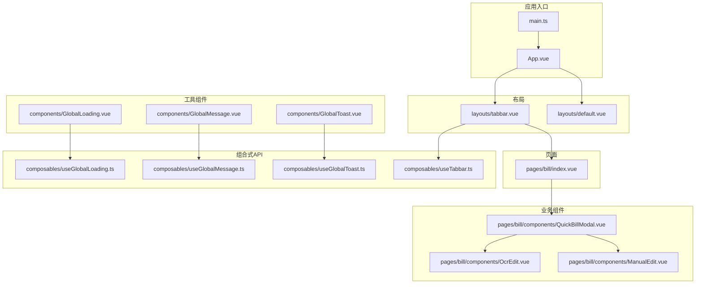
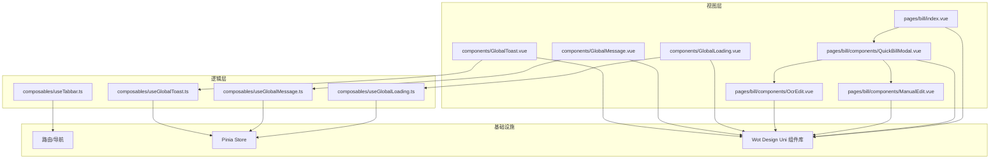
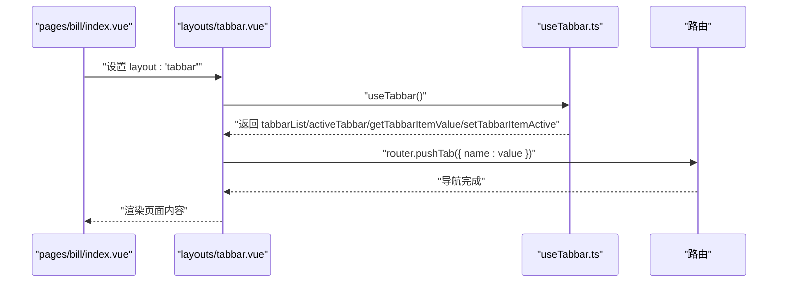
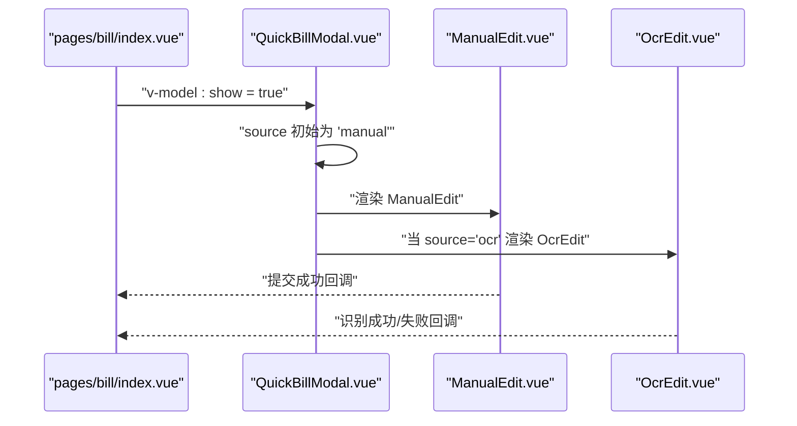
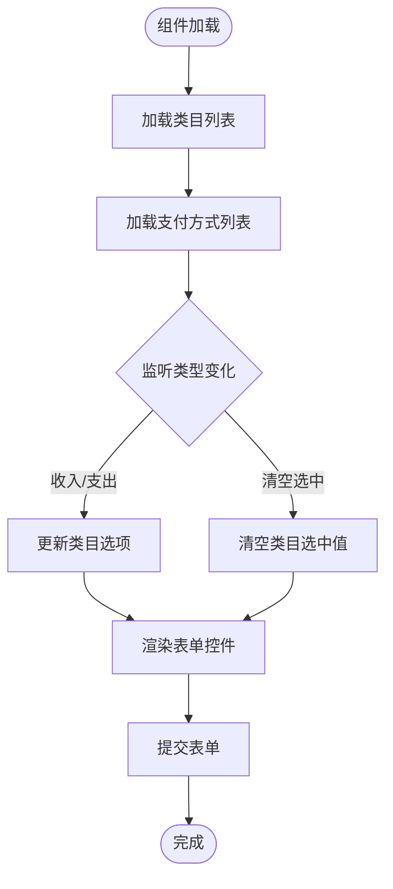
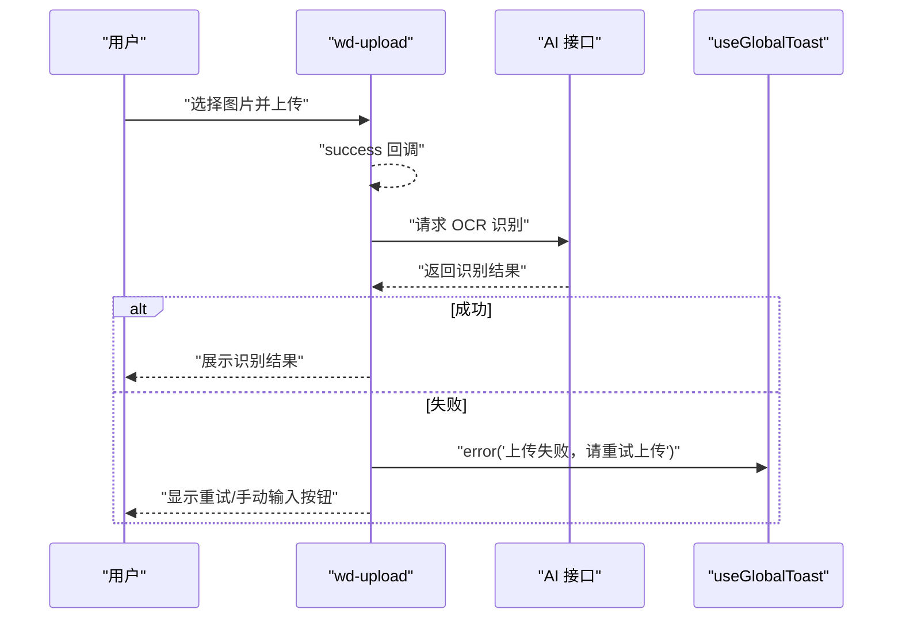
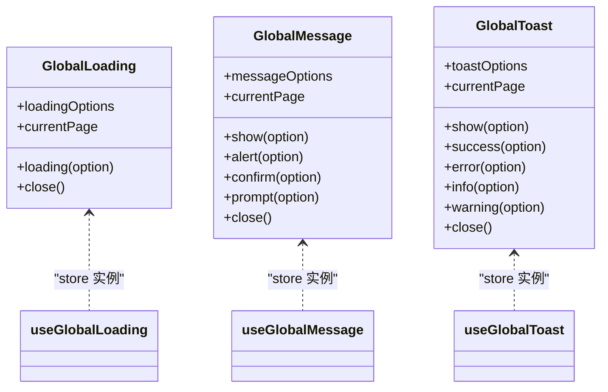
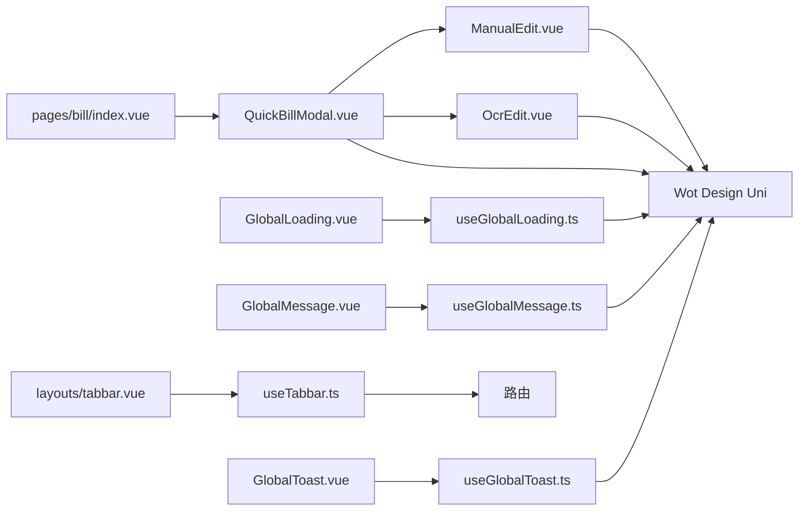

# 组件系统设计

<cite>
**本文引用的文件**
- [main.ts](file://chuan-bill-app/src/main.ts)
- [App.vue](file://chuan-bill-app/src/App.vue)
- [layouts/default.vue](file://chuan-bill-app/src/layouts/default.vue)
- [layouts/tabbar.vue](file://chuan-bill-app/src/layouts/tabbar.vue)
- [pages/bill/index.vue](file://chuan-bill-app/src/pages/bill/index.vue)
- [pages/bill/components/QuickBillModal.vue](file://chuan-bill-app/src/pages/bill/components/QuickBillModal.vue)
- [pages/bill/components/ManualEdit.vue](file://chuan-bill-app/src/pages/bill/components/ManualEdit.vue)
- [pages/bill/components/OcrEdit.vue](file://chuan-bill-app/src/pages/bill/components/OcrEdit.vue)
- [components/GlobalLoading.vue](file://chuan-bill-app/src/components/GlobalLoading.vue)
- [components/GlobalMessage.vue](file://chuan-bill-app/src/components/GlobalMessage.vue)
- [components/GlobalToast.vue](file://chuan-bill-app/src/components/GlobalToast.vue)
- [composables/useTabbar.ts](file://chuan-bill-app/src/composables/useTabbar.ts)
- [composables/useGlobalLoading.ts](file://chuan-bill-app/src/composables/useGlobalLoading.ts)
- [composables/useGlobalMessage.ts](file://chuan-bill-app/src/composables/useGlobalMessage.ts)
- [composables/useGlobalToast.ts](file://chuan-bill-app/src/composables/useGlobalToast.ts)
</cite>

## 目录
1. [引言](#引言)
2. [项目结构](#项目结构)
3. [核心组件](#核心组件)
4. [架构总览](#架构总览)
5. [详细组件分析](#详细组件分析)
6. [依赖关系分析](#依赖关系分析)
7. [性能考虑](#性能考虑)
8. [故障排查指南](#故障排查指南)
9. [结论](#结论)
10. [附录](#附录)

## 引言
本技术文档面向“小川记账”组件系统，聚焦于基于 Wot Design Uni 的 UI 组件库集成方案与可复用组件设计。内容涵盖：
- 全局组件注册与业务组件封装
- 布局组件系统（default、tabbar）
- 业务组件（QuickBillModal、ManualEdit、OcrEdit）
- 工具组件（GlobalLoading、GlobalMessage、GlobalToast）
- 组合式 API 使用模式与自定义 Hook 设计原则
- 组件通信机制、props 设计、事件处理、插槽使用与样式定制最佳实践
- 组件开发规范、性能优化策略与跨平台兼容性处理

## 项目结构
前端采用 Vue 3 + UniApp 技术栈，组件按功能分层组织：
- 应用入口与全局配置：应用启动、路由与状态管理初始化
- 布局层：default 与 tabbar 两种布局，统一页面骨架与导航
- 页面层：bill 首页承载记账入口与快速记账弹窗
- 业务组件层：QuickBillModal 及其子组件 ManualEdit、OcrEdit
- 工具组件层：GlobalLoading、GlobalMessage、GlobalToast
- 组合式 API 层：useTabbar、useGlobalLoading、useGlobalMessage、useGlobalToast

图表来源
- [main.ts:1-16](file://chuan-bill-app/src/main.ts#L1-L16)
- [App.vue:1-16](file://chuan-bill-app/src/App.vue#L1-L16)
- [layouts/default.vue:1-17](file://chuan-bill-app/src/layouts/default.vue#L1-L17)
- [layouts/tabbar.vue:1-48](file://chuan-bill-app/src/layouts/tabbar.vue#L1-L48)
- [pages/bill/index.vue:1-54](file://chuan-bill-app/src/pages/bill/index.vue#L1-L54)
- [pages/bill/components/QuickBillModal.vue:1-64](file://chuan-bill-app/src/pages/bill/components/QuickBillModal.vue#L1-L64)
- [pages/bill/components/ManualEdit.vue:1-174](file://chuan-bill-app/src/pages/bill/components/ManualEdit.vue#L1-L174)
- [pages/bill/components/OcrEdit.vue:1-167](file://chuan-bill-app/src/pages/bill/components/OcrEdit.vue#L1-L167)
- [components/GlobalLoading.vue:1-47](file://chuan-bill-app/src/components/GlobalLoading.vue#L1-L47)
- [components/GlobalMessage.vue:1-56](file://chuan-bill-app/src/components/GlobalMessage.vue#L1-L56)
- [components/GlobalToast.vue:1-47](file://chuan-bill-app/src/components/GlobalToast.vue#L1-L47)
- [composables/useTabbar.ts:1-55](file://chuan-bill-app/src/composables/useTabbar.ts#L1-L55)
- [composables/useGlobalLoading.ts:1-38](file://chuan-bill-app/src/composables/useGlobalLoading.ts#L1-L38)
- [composables/useGlobalMessage.ts:1-53](file://chuan-bill-app/src/composables/useGlobalMessage.ts#L1-L53)
- [composables/useGlobalToast.ts:1-62](file://chuan-bill-app/src/composables/useGlobalToast.ts#L1-L62)

章节来源
- [main.ts:1-16](file://chuan-bill-app/src/main.ts#L1-L16)
- [App.vue:1-16](file://chuan-bill-app/src/App.vue#L1-L16)

## 核心组件
本节从系统视角梳理关键组件职责与交互关系：
- 布局组件
  - default：通用页面骨架，支持全局样式注入与虚拟节点隔离策略
  - tabbar：统一页脚导航，结合 useTabbar 提供激活态管理与路由跳转
- 业务组件
  - QuickBillModal：底部弹窗容器，切换“手动/OCR/语音”三种记账入口
  - ManualEdit：表单驱动的记账录入界面，联动类目、支付方式、时间选择等
  - OcrEdit：图片上传与 AI 识别流程，包含上传、预览遮罩动画与结果反馈
- 工具组件
  - GlobalLoading/GlobalMessage/GlobalToast：基于 Pinia Store 的全局消息通道，通过 watch 监听状态变化驱动 Wot Design Uni 对应组件显示

章节来源
- [layouts/default.vue:1-17](file://chuan-bill-app/src/layouts/default.vue#L1-L17)
- [layouts/tabbar.vue:1-48](file://chuan-bill-app/src/layouts/tabbar.vue#L1-L48)
- [pages/bill/components/QuickBillModal.vue:1-64](file://chuan-bill-app/src/pages/bill/components/QuickBillModal.vue#L1-L64)
- [pages/bill/components/ManualEdit.vue:1-174](file://chuan-bill-app/src/pages/bill/components/ManualEdit.vue#L1-L174)
- [pages/bill/components/OcrEdit.vue:1-167](file://chuan-bill-app/src/pages/bill/components/OcrEdit.vue#L1-L167)
- [components/GlobalLoading.vue:1-47](file://chuan-bill-app/src/components/GlobalLoading.vue#L1-L47)
- [components/GlobalMessage.vue:1-56](file://chuan-bill-app/src/components/GlobalMessage.vue#L1-L56)
- [components/GlobalToast.vue:1-47](file://chuan-bill-app/src/components/GlobalToast.vue#L1-L47)

## 架构总览
整体架构以“布局-页面-业务组件-工具组件-组合式 API”分层组织，数据流由 Pinia Store 驱动，通过 watch 监听状态变化触发 UI 更新；路由与导航由 useTabbar 协调。

图表来源
- [pages/bill/index.vue:1-54](file://chuan-bill-app/src/pages/bill/index.vue#L1-L54)
- [pages/bill/components/QuickBillModal.vue:1-64](file://chuan-bill-app/src/pages/bill/components/QuickBillModal.vue#L1-L64)
- [pages/bill/components/ManualEdit.vue:1-174](file://chuan-bill-app/src/pages/bill/components/ManualEdit.vue#L1-L174)
- [pages/bill/components/OcrEdit.vue:1-167](file://chuan-bill-app/src/pages/bill/components/OcrEdit.vue#L1-L167)
- [components/GlobalLoading.vue:1-47](file://chuan-bill-app/src/components/GlobalLoading.vue#L1-L47)
- [components/GlobalMessage.vue:1-56](file://chuan-bill-app/src/components/GlobalMessage.vue#L1-L56)
- [components/GlobalToast.vue:1-47](file://chuan-bill-app/src/components/GlobalToast.vue#L1-L47)
- [composables/useTabbar.ts:1-55](file://chuan-bill-app/src/composables/useTabbar.ts#L1-L55)
- [composables/useGlobalLoading.ts:1-38](file://chuan-bill-app/src/composables/useGlobalLoading.ts#L1-L38)
- [composables/useGlobalMessage.ts:1-53](file://chuan-bill-app/src/composables/useGlobalMessage.ts#L1-L53)
- [composables/useGlobalToast.ts:1-62](file://chuan-bill-app/src/composables/useGlobalToast.ts#L1-L62)

## 详细组件分析

### 布局组件系统
- default 布局
  - 作用：提供通用页面骨架，开启全局样式注入与虚拟宿主隔离，确保主题与样式在子组件中正确传播
  - 关键点：通过 options 配置 addGlobalClass、virtualHost、styleIsolation，保证与 Wot Design Uni 样式体系兼容
- tabbar 布局
  - 作用：统一页脚导航，结合 useTabbar 管理激活项、读取徽标值、路由跳转
  - 关键点：在挂载阶段隐藏原生 tabbar，避免重复导航；根据当前路由设置激活项；通过 change 事件更新状态并跳转

图表来源
- [layouts/tabbar.vue:1-48](file://chuan-bill-app/src/layouts/tabbar.vue#L1-L48)
- [composables/useTabbar.ts:1-55](file://chuan-bill-app/src/composables/useTabbar.ts#L1-L55)
- [pages/bill/index.vue:1-54](file://chuan-bill-app/src/pages/bill/index.vue#L1-L54)

章节来源
- [layouts/default.vue:1-17](file://chuan-bill-app/src/layouts/default.vue#L1-L17)
- [layouts/tabbar.vue:1-48](file://chuan-bill-app/src/layouts/tabbar.vue#L1-L48)
- [composables/useTabbar.ts:1-55](file://chuan-bill-app/src/composables/useTabbar.ts#L1-L55)

### 快速记账弹窗 QuickBillModal
- 设计理念：以底部弹窗承载多种记账入口，通过分段控制器在“手动/OCR/语音”之间切换
- 关键实现：
  - 使用 v-model:show 控制显隐
  - 分段控制器绑定 source，动态渲染 ManualEdit 或 OcrEdit
  - 打开时对齐分段样式，提升视觉一致性
- 与业务组件协作：
  - ManualEdit：表单驱动录入，联动类目/支付方式/时间选择
  - OcrEdit：图片上传与 AI 识别，包含上传遮罩动画与失败重试

图表来源
- [pages/bill/index.vue:1-54](file://chuan-bill-app/src/pages/bill/index.vue#L1-L54)
- [pages/bill/components/QuickBillModal.vue:1-64](file://chuan-bill-app/src/pages/bill/components/QuickBillModal.vue#L1-L64)
- [pages/bill/components/ManualEdit.vue:1-174](file://chuan-bill-app/src/pages/bill/components/ManualEdit.vue#L1-L174)
- [pages/bill/components/OcrEdit.vue:1-167](file://chuan-bill-app/src/pages/bill/components/OcrEdit.vue#L1-L167)

章节来源
- [pages/bill/components/QuickBillModal.vue:1-64](file://chuan-bill-app/src/pages/bill/components/QuickBillModal.vue#L1-L64)

### 手动记账 ManualEdit
- 表单驱动：使用 wd-form 包裹，集中管理表单字段与校验
- 数据联动：
  - 类目列表按收支类型动态切换
  - 支付方式列表异步加载
  - 共享开关控制是否显示家庭选择
- UI 组件组合：radio-group、input、textarea、picker、datetime-picker、switch、divider 等
- 样式定制：通过 :deep 选择器覆盖 Wot Design Uni 默认样式，适配深色主题

图表来源
- [pages/bill/components/ManualEdit.vue:1-174](file://chuan-bill-app/src/pages/bill/components/ManualEdit.vue#L1-L174)

章节来源
- [pages/bill/components/ManualEdit.vue:1-174](file://chuan-bill-app/src/pages/bill/components/ManualEdit.vue#L1-L174)

### OCR 识别 OcrEdit
- 流程设计：上传图片 -> 触发 AI 识别 -> 显示扫描动画 -> 结果反馈
- 关键实现：
  - 上传组件限制单文件、接受 image 类型，携带固定 token 请求头
  - 上传成功后读取临时文件信息并发起 OCR 任务
  - 识别中显示扫描动画遮罩，失败时提供重试与手动输入入口
- 错误处理：捕获异常并回退到失败状态，引导用户重试或手动输入

图表来源
- [pages/bill/components/OcrEdit.vue:1-167](file://chuan-bill-app/src/pages/bill/components/OcrEdit.vue#L1-L167)
- [composables/useGlobalToast.ts:1-62](file://chuan-bill-app/src/composables/useGlobalToast.ts#L1-L62)

章节来源
- [pages/bill/components/OcrEdit.vue:1-167](file://chuan-bill-app/src/pages/bill/components/OcrEdit.vue#L1-L167)

### 工具组件 GlobalLoading/GlobalMessage/GlobalToast
- 设计原则：通过 Pinia Store 维护全局状态，组件仅负责监听状态变化并调用 Wot Design Uni 对应组件显示
- 生命周期与平台兼容：
  - 针对支付宝小程序进行可见性 hack，确保组件在 nextTick 后再渲染
  - 通过 watch 监听 store 中的 options 与 currentPage，仅在同一页面时显示
- 能力边界：不直接处理业务逻辑，仅作为 UI 通道，业务侧通过调用对应 Hook 设置 store 状态

图表来源
- [components/GlobalLoading.vue:1-47](file://chuan-bill-app/src/components/GlobalLoading.vue#L1-L47)
- [components/GlobalMessage.vue:1-56](file://chuan-bill-app/src/components/GlobalMessage.vue#L1-L56)
- [components/GlobalToast.vue:1-47](file://chuan-bill-app/src/components/GlobalToast.vue#L1-L47)
- [composables/useGlobalLoading.ts:1-38](file://chuan-bill-app/src/composables/useGlobalLoading.ts#L1-L38)
- [composables/useGlobalMessage.ts:1-53](file://chuan-bill-app/src/composables/useGlobalMessage.ts#L1-L53)
- [composables/useGlobalToast.ts:1-62](file://chuan-bill-app/src/composables/useGlobalToast.ts#L1-L62)

章节来源
- [components/GlobalLoading.vue:1-47](file://chuan-bill-app/src/components/GlobalLoading.vue#L1-L47)
- [components/GlobalMessage.vue:1-56](file://chuan-bill-app/src/components/GlobalMessage.vue#L1-L56)
- [components/GlobalToast.vue:1-47](file://chuan-bill-app/src/components/GlobalToast.vue#L1-L47)
- [composables/useGlobalLoading.ts:1-38](file://chuan-bill-app/src/composables/useGlobalLoading.ts#L1-L38)
- [composables/useGlobalMessage.ts:1-53](file://chuan-bill-app/src/composables/useGlobalMessage.ts#L1-L53)
- [composables/useGlobalToast.ts:1-62](file://chuan-bill-app/src/composables/useGlobalToast.ts#L1-L62)

## 依赖关系分析
- 组件耦合与内聚
  - QuickBillModal 与 ManualEdit/OcrEdit 为组合关系，内部解耦，便于扩展新入口
  - 工具组件与业务组件通过 store 解耦，降低耦合度
- 直接与间接依赖
  - 页面依赖布局与业务组件
  - 业务组件依赖 Wot Design Uni 组件与 API
  - 工具组件依赖 store 与 Wot Design Uni 组件
- 外部依赖与集成点
  - 路由与导航：useTabbar 与 router 协作
  - API：ManualEdit 与 OcrEdit 通过 Apis 调用后端接口
  - 主题与样式：通过 UnoCSS 与 Wot Design Uni 主题变量协同

图表来源
- [pages/bill/index.vue:1-54](file://chuan-bill-app/src/pages/bill/index.vue#L1-L54)
- [pages/bill/components/QuickBillModal.vue:1-64](file://chuan-bill-app/src/pages/bill/components/QuickBillModal.vue#L1-L64)
- [pages/bill/components/ManualEdit.vue:1-174](file://chuan-bill-app/src/pages/bill/components/ManualEdit.vue#L1-L174)
- [pages/bill/components/OcrEdit.vue:1-167](file://chuan-bill-app/src/pages/bill/components/OcrEdit.vue#L1-L167)
- [components/GlobalLoading.vue:1-47](file://chuan-bill-app/src/components/GlobalLoading.vue#L1-L47)
- [components/GlobalMessage.vue:1-56](file://chuan-bill-app/src/components/GlobalMessage.vue#L1-L56)
- [components/GlobalToast.vue:1-47](file://chuan-bill-app/src/components/GlobalToast.vue#L1-L47)
- [composables/useGlobalLoading.ts:1-38](file://chuan-bill-app/src/composables/useGlobalLoading.ts#L1-L38)
- [composables/useGlobalMessage.ts:1-53](file://chuan-bill-app/src/composables/useGlobalMessage.ts#L1-L53)
- [composables/useGlobalToast.ts:1-62](file://chuan-bill-app/src/composables/useGlobalToast.ts#L1-L62)
- [layouts/tabbar.vue:1-48](file://chuan-bill-app/src/layouts/tabbar.vue#L1-L48)
- [composables/useTabbar.ts:1-55](file://chuan-bill-app/src/composables/useTabbar.ts#L1-L55)

章节来源
- [layouts/tabbar.vue:1-48](file://chuan-bill-app/src/layouts/tabbar.vue#L1-L48)
- [composables/useTabbar.ts:1-55](file://chuan-bill-app/src/composables/useTabbar.ts#L1-L55)

## 性能考虑
- 组件懒加载与按需渲染
  - QuickBillModal 仅在需要时打开，减少初始渲染压力
  - ManualEdit/OcrEdit 在分段切换时才渲染，避免同时挂载多个重型表单
- 状态管理优化
  - 工具组件通过 store 管理全局状态，避免重复实例化与内存泄漏
  - 仅在同一页面时显示全局提示，避免跨页面干扰
- 图片上传与识别
  - 限制单文件上传，减少并发与带宽占用
  - 识别中使用局部遮罩动画，避免全屏阻塞
- 样式与主题
  - 使用 :deep 选择器精准覆盖样式，避免全局污染
  - 通过主题变量与深色模式适配，减少运行时样式计算

## 故障排查指南
- 支付宝小程序显示问题
  - 现象：GlobalLoading/GlobalMessage/GlobalToast 在支付宝小程序不显示
  - 处理：组件已内置 hack，等待 nextTick 后再渲染，确保组件可见
- 上传失败或识别失败
  - 现象：OcrEdit 上传成功但无临时文件信息，或识别返回非 200
  - 处理：toast 提示“上传失败，请重试上传”，提供重试与手动输入入口
- 导航与激活态不一致
  - 现象：tabbar 激活项与当前路由不一致
  - 处理：在 mounted 后根据路由设置激活项，并在 change 事件中同步状态

章节来源
- [components/GlobalLoading.vue:1-47](file://chuan-bill-app/src/components/GlobalLoading.vue#L1-L47)
- [components/GlobalMessage.vue:1-56](file://chuan-bill-app/src/components/GlobalMessage.vue#L1-L56)
- [components/GlobalToast.vue:1-47](file://chuan-bill-app/src/components/GlobalToast.vue#L1-L47)
- [pages/bill/components/OcrEdit.vue:1-167](file://chuan-bill-app/src/pages/bill/components/OcrEdit.vue#L1-L167)
- [layouts/tabbar.vue:1-48](file://chuan-bill-app/src/layouts/tabbar.vue#L1-L48)

## 结论
本组件系统以 Wot Design Uni 为基础，结合组合式 API 与 Pinia Store，实现了布局统一、业务清晰、工具解耦的前端架构。通过分层设计与状态驱动，系统具备良好的可维护性与扩展性；配合跨平台兼容策略与性能优化手段，能够稳定支撑多端体验。

## 附录
- 组件开发规范
  - 统一使用 defineOptions 与 options 配置，开启 virtualHost 与 styleIsolation
  - 表单组件建议使用 wd-form 包裹，集中管理校验与联动
  - 工具组件仅承担 UI 展示职责，业务侧通过 Hook 设置 store 状态
- props 设计与事件处理
  - 使用 defineModel/v-model 管理双向绑定，保持语义清晰
  - 事件命名采用 onXxx，避免与 Wot Design Uni 内置事件冲突
- 插槽与样式定制
  - 合理使用默认插槽与具名插槽，避免过度封装导致不可控
  - 使用 :deep 选择器覆盖样式，注意与主题变量协同
- 跨平台兼容
  - 针对支付宝小程序进行条件编译与 hack 处理
  - 避免使用平台独有 API，必要时提供降级方案