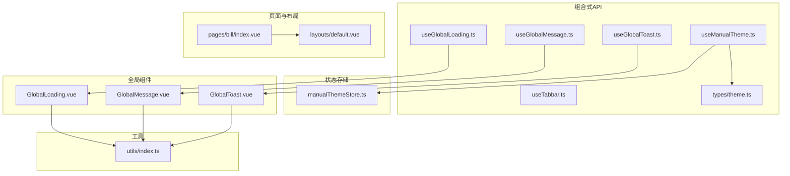
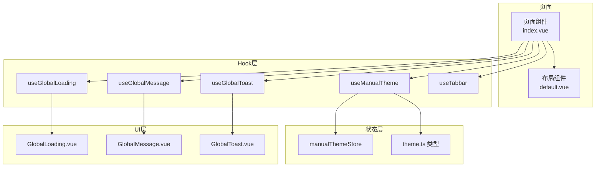
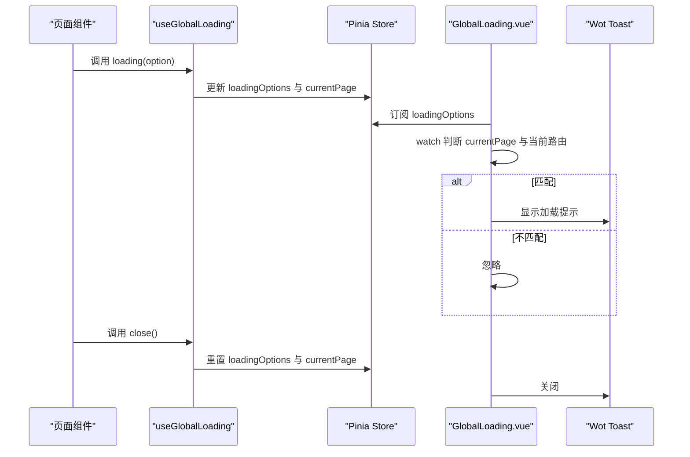
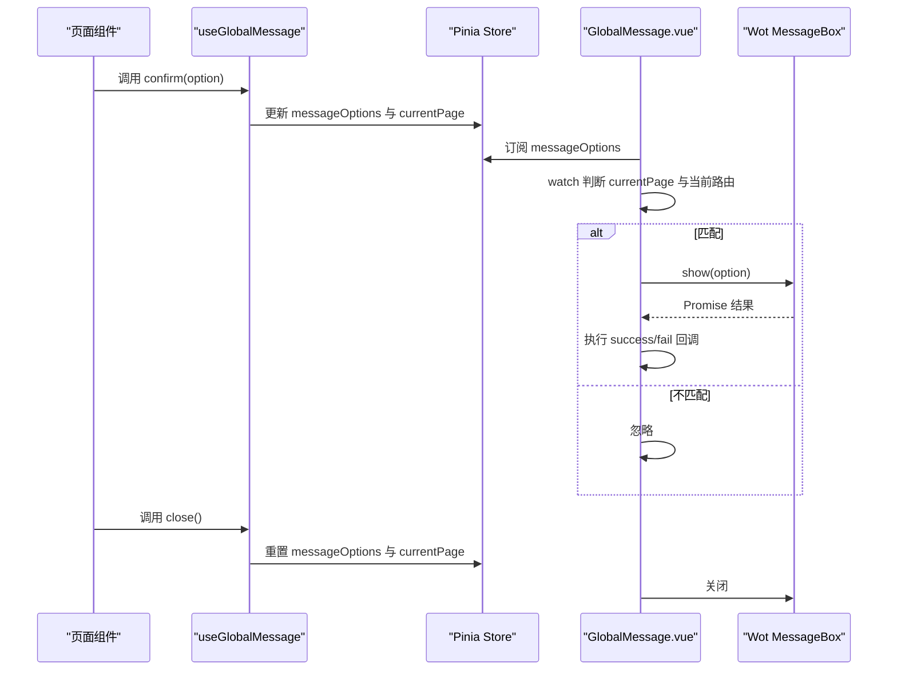
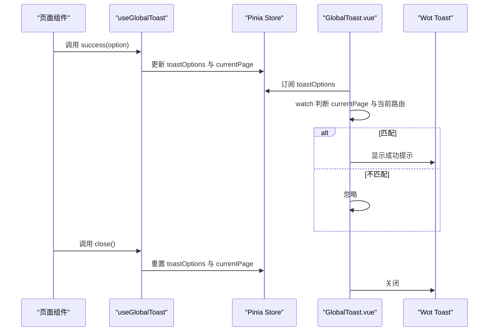
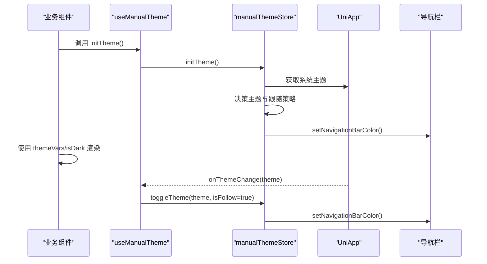
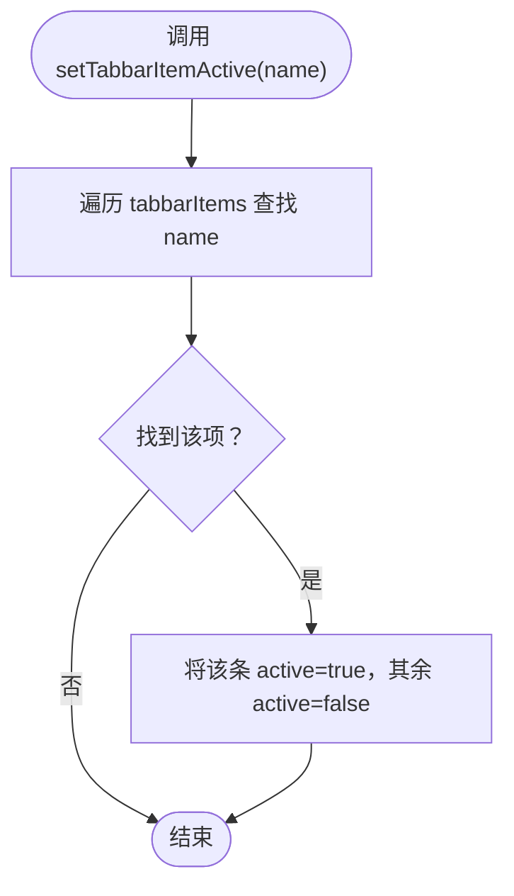
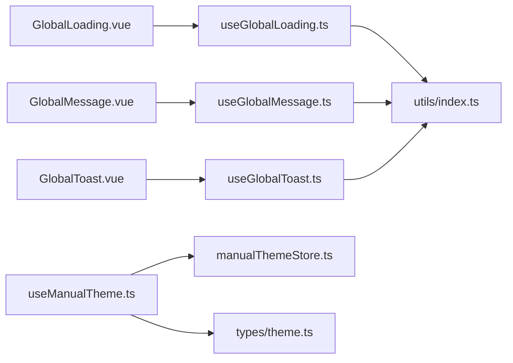

# 组合式API与自定义Hook

<cite>
**本文引用的文件**
- [useGlobalLoading.ts](file://chuan-bill-app/src/composables/useGlobalLoading.ts)
- [useGlobalMessage.ts](file://chuan-bill-app/src/composables/useGlobalMessage.ts)
- [useGlobalToast.ts](file://chuan-bill-app/src/composables/useGlobalToast.ts)
- [useManualTheme.ts](file://chuan-bill-app/src/composables/useManualTheme.ts)
- [useTabbar.ts](file://chuan-bill-app/src/composables/useTabbar.ts)
- [theme.ts](file://chuan-bill-app/src/composables/types/theme.ts)
- [manualThemeStore.ts](file://chuan-bill-app/src/store/manualThemeStore.ts)
- [index.ts](file://chuan-bill-app/src/utils/index.ts)
- [GlobalLoading.vue](file://chuan-bill-app/src/components/GlobalLoading.vue)
- [GlobalMessage.vue](file://chuan-bill-app/src/components/GlobalMessage.vue)
- [GlobalToast.vue](file://chuan-bill-app/src/components/GlobalToast.vue)
- [index.vue](file://chuan-bill-app/src/pages/bill/index.vue)
- [default.vue](file://chuan-bill-app/src/layouts/default.vue)
</cite>

## 目录
1. [简介](#简介)
2. [项目结构](#项目结构)
3. [核心组件](#核心组件)
4. [架构总览](#架构总览)
5. [详细组件分析](#详细组件分析)
6. [依赖关系分析](#依赖关系分析)
7. [性能考虑](#性能考虑)
8. [故障排查指南](#故障排查指南)
9. [结论](#结论)
10. [附录](#附录)

## 简介
本文件面向小川记账的组合式API与自定义Hook，系统性解析以下Hook的设计理念与实现细节：
- useGlobalLoading：全局加载提示的状态与动作封装
- useGlobalMessage：全局消息框（确认/提示/输入）的状态与动作封装
- useGlobalToast：全局Toast（成功/错误/信息/警告）的状态与动作封装
- useManualTheme：完整主题管理（手动切换、跟随系统、主题色选择、导航栏同步）
- useTabbar：底部导航状态与操作（激活项、徽标值、切换）

文档将从职责划分、状态管理、副作用处理、依赖注入机制入手，解释Hook与组件的集成方式、数据传递策略、事件绑定方法，并提供开发规范、性能优化、错误处理最佳实践，以及测试方法、调试技巧与扩展开发指南。

## 项目结构
围绕组合式API与自定义Hook的相关目录与文件组织如下：
- composables：存放各Hook与类型定义
  - useGlobalLoading.ts、useGlobalMessage.ts、useGlobalToast.ts、useManualTheme.ts、useTabbar.ts
  - types/theme.ts：主题相关类型与常量
- store：Pinia状态存储（主题）
  - manualThemeStore.ts：完整主题状态管理
- utils：通用工具函数
  - index.ts：getCurrentPath等
- components：全局UI组件（与Hook联动）
  - GlobalLoading.vue、GlobalMessage.vue、GlobalToast.vue
- pages与layouts：页面布局与示例页面

图表来源
- [useGlobalLoading.ts:1-38](file://chuan-bill-app/src/composables/useGlobalLoading.ts#L1-L38)
- [useGlobalMessage.ts:1-53](file://chuan-bill-app/src/composables/useGlobalMessage.ts#L1-L53)
- [useGlobalToast.ts:1-62](file://chuan-bill-app/src/composables/useGlobalToast.ts#L1-L62)
- [useManualTheme.ts:1-143](file://chuan-bill-app/src/composables/useManualTheme.ts#L1-L143)
- [useTabbar.ts:1-55](file://chuan-bill-app/src/composables/useTabbar.ts#L1-L55)
- [theme.ts:1-47](file://chuan-bill-app/src/composables/types/theme.ts#L1-L47)
- [manualThemeStore.ts:1-151](file://chuan-bill-app/src/store/manualThemeStore.ts#L1-L151)
- [index.ts:1-79](file://chuan-bill-app/src/utils/index.ts#L1-L79)
- [GlobalLoading.vue:1-47](file://chuan-bill-app/src/components/GlobalLoading.vue#L1-L47)
- [GlobalMessage.vue:1-56](file://chuan-bill-app/src/components/GlobalMessage.vue#L1-L56)
- [GlobalToast.vue:1-47](file://chuan-bill-app/src/components/GlobalToast.vue#L1-L47)
- [index.vue:1-54](file://chuan-bill-app/src/pages/bill/index.vue#L1-L54)
- [default.vue:1-17](file://chuan-bill-app/src/layouts/default.vue#L1-L17)

章节来源
- [useGlobalLoading.ts:1-38](file://chuan-bill-app/src/composables/useGlobalLoading.ts#L1-L38)
- [useGlobalMessage.ts:1-53](file://chuan-bill-app/src/composables/useGlobalMessage.ts#L1-L53)
- [useGlobalToast.ts:1-62](file://chuan-bill-app/src/composables/useGlobalToast.ts#L1-L62)
- [useManualTheme.ts:1-143](file://chuan-bill-app/src/composables/useManualTheme.ts#L1-L143)
- [useTabbar.ts:1-55](file://chuan-bill-app/src/composables/useTabbar.ts#L1-L55)
- [theme.ts:1-47](file://chuan-bill-app/src/composables/types/theme.ts#L1-L47)
- [manualThemeStore.ts:1-151](file://chuan-bill-app/src/store/manualThemeStore.ts#L1-L151)
- [index.ts:1-79](file://chuan-bill-app/src/utils/index.ts#L1-L79)
- [GlobalLoading.vue:1-47](file://chuan-bill-app/src/components/GlobalLoading.vue#L1-L47)
- [GlobalMessage.vue:1-56](file://chuan-bill-app/src/components/GlobalMessage.vue#L1-L56)
- [GlobalToast.vue:1-47](file://chuan-bill-app/src/components/GlobalToast.vue#L1-L47)
- [index.vue:1-54](file://chuan-bill-app/src/pages/bill/index.vue#L1-L54)
- [default.vue:1-17](file://chuan-bill-app/src/layouts/default.vue#L1-L17)

## 核心组件
本节对每个Hook进行职责、状态、动作与副作用的拆解，并给出与组件的集成方式与数据流要点。

- useGlobalLoading
  - 职责：统一管理全局加载提示的显示/关闭，记录触发页面路径，避免跨页误触
  - 状态：loadingOptions（ToastOptions）、currentPage（string）
  - 动作：loading(option)、close()
  - 集成：GlobalLoading.vue通过watch监听loadingOptions，结合currentPage与getCurrentPath判断是否展示
  - 依赖：Pinia Store、Wot Design Uni Toast、工具函数getCurrentPath

- useGlobalMessage
  - 职责：统一管理全局消息框（alert/confirm/prompt），支持回调success/fail
  - 状态：messageOptions（GlobalMessageOptions|null）、currentPage（string）
  - 动作：show(option)、alert(option)、confirm(option)、prompt(option)、close()
  - 集成：GlobalMessage.vue通过watch监听messageOptions，深拷贝后调用消息框组件，完成后执行回调
  - 依赖：Pinia Store、Wot Design Uni MessageBox、工具函数getCurrentPath

- useGlobalToast
  - 职责：统一管理全局Toast（成功/错误/信息/警告），支持默认位置与时长
  - 状态：toastOptions（ToastOptions）、currentPage（string）
  - 动作：show(option)、success(option)、error(option)、info(option)、warning(option)、close()
  - 集成：GlobalToast.vue通过watch监听toastOptions，结合currentPage与getCurrentPath判断是否展示
  - 依赖：Pinia Store、Wot Design Uni Toast、工具函数getCurrentPath

- useManualTheme
  - 职责：完整主题管理（手动切换、跟随系统、主题色选择、导航栏颜色同步）
  - 状态：来自manualThemeStore（主题模式、是否跟随系统、当前主题色、主题变量）
  - 动作：toggleTheme(mode?, isFollow?)、setFollowSystem(follow)、setCurrentThemeColor(option)、initTheme()
  - 副作用：onBeforeMount监听系统主题变化；onShow同步导航栏颜色；onUnmounted清理监听
  - 集成：组件中通过wd-config-provider消费themeVars，根据isDark切换类名
  - 依赖：manualThemeStore、theme.ts类型、UniApp主题变更事件

- useTabbar
  - 职责：底部导航状态与操作（激活项、徽标值、切换）
  - 状态：内部响应式数组tabbarItems（name/value/active/title/icon）
  - 动作：tabbarList、activeTabbar、getTabbarItemValue(name)、setTabbarItem(name,value)、setTabbarItemActive(name)
  - 集成：页面布局或导航组件可直接使用返回值渲染与交互
  - 依赖：无外部状态存储，纯本地响应式状态

章节来源
- [useGlobalLoading.ts:1-38](file://chuan-bill-app/src/composables/useGlobalLoading.ts#L1-L38)
- [useGlobalMessage.ts:1-53](file://chuan-bill-app/src/composables/useGlobalMessage.ts#L1-L53)
- [useGlobalToast.ts:1-62](file://chuan-bill-app/src/composables/useGlobalToast.ts#L1-L62)
- [useManualTheme.ts:1-143](file://chuan-bill-app/src/composables/useManualTheme.ts#L1-L143)
- [useTabbar.ts:1-55](file://chuan-bill-app/src/composables/useTabbar.ts#L1-L55)
- [GlobalLoading.vue:1-47](file://chuan-bill-app/src/components/GlobalLoading.vue#L1-L47)
- [GlobalMessage.vue:1-56](file://chuan-bill-app/src/components/GlobalMessage.vue#L1-L56)
- [GlobalToast.vue:1-47](file://chuan-bill-app/src/components/GlobalToast.vue#L1-L47)

## 架构总览
整体架构采用“Hook + 组合式状态 + 全局UI组件”的模式：
- Hook负责业务语义与状态动作
- Pinia Store承载持久化与共享状态（主题）
- 工具函数提供跨端能力（getCurrentPath）
- 全局组件作为UI桥接层，订阅Hook状态并通过watch触发具体UI组件

图表来源
- [index.vue:1-54](file://chuan-bill-app/src/pages/bill/index.vue#L1-L54)
- [default.vue:1-17](file://chuan-bill-app/src/layouts/default.vue#L1-L17)
- [useGlobalLoading.ts:1-38](file://chuan-bill-app/src/composables/useGlobalLoading.ts#L1-L38)
- [useGlobalMessage.ts:1-53](file://chuan-bill-app/src/composables/useGlobalMessage.ts#L1-L53)
- [useGlobalToast.ts:1-62](file://chuan-bill-app/src/composables/useGlobalToast.ts#L1-L62)
- [useManualTheme.ts:1-143](file://chuan-bill-app/src/composables/useManualTheme.ts#L1-L143)
- [useTabbar.ts:1-55](file://chuan-bill-app/src/composables/useTabbar.ts#L1-L55)
- [manualThemeStore.ts:1-151](file://chuan-bill-app/src/store/manualThemeStore.ts#L1-L151)
- [theme.ts:1-47](file://chuan-bill-app/src/composables/types/theme.ts#L1-L47)
- [GlobalLoading.vue:1-47](file://chuan-bill-app/src/components/GlobalLoading.vue#L1-L47)
- [GlobalMessage.vue:1-56](file://chuan-bill-app/src/components/GlobalMessage.vue#L1-L56)
- [GlobalToast.vue:1-47](file://chuan-bill-app/src/components/GlobalToast.vue#L1-L47)

## 详细组件分析

### useGlobalLoading 分析
- 设计理念
  - 以“页面级”隔离为核心：通过currentPage与getCurrentPath对比，避免跨页误触发
  - 默认配置与合并策略：统一默认值，按需覆盖，保证行为一致
- 实现要点
  - loading(option)：记录当前页面、合并默认配置（iconName、duration、cover、position、show）
  - close()：重置状态
- 与组件集成
  - GlobalLoading.vue监听loadingOptions，当show为true且currentPage匹配时调用Toast组件显示
  - 支持支付宝小程序特殊可见性处理
- 复杂度与性能
  - 状态读取O(1)，watch触发条件明确，性能开销极低
- 错误处理
  - 未见显式异常抛出，建议在上层捕获Toast初始化异常并回退

图表来源
- [useGlobalLoading.ts:1-38](file://chuan-bill-app/src/composables/useGlobalLoading.ts#L1-L38)
- [GlobalLoading.vue:1-47](file://chuan-bill-app/src/components/GlobalLoading.vue#L1-L47)
- [index.ts:1-79](file://chuan-bill-app/src/utils/index.ts#L1-L79)

章节来源
- [useGlobalLoading.ts:1-38](file://chuan-bill-app/src/composables/useGlobalLoading.ts#L1-L38)
- [GlobalLoading.vue:1-47](file://chuan-bill-app/src/components/GlobalLoading.vue#L1-L47)
- [index.ts:1-79](file://chuan-bill-app/src/utils/index.ts#L1-L79)

### useGlobalMessage 分析
- 设计理念
  - 统一入口show(option)，内置alert/confirm/prompt快捷方法
  - 回调success/fail分离，便于业务处理
- 实现要点
  - show(option)：记录当前页面，合并按钮样式属性
  - alert/confirm/prompt：预设type并控制取消按钮显示
  - close()：重置状态
- 与组件集成
  - GlobalMessage.vue深拷贝option，调用MessageBox组件，then/catch分别执行success/fail
- 复杂度与性能
  - 深拷贝成本低，watch触发条件明确，适合频繁调用场景

图表来源
- [useGlobalMessage.ts:1-53](file://chuan-bill-app/src/composables/useGlobalMessage.ts#L1-L53)
- [GlobalMessage.vue:1-56](file://chuan-bill-app/src/components/GlobalMessage.vue#L1-L56)
- [index.ts:1-79](file://chuan-bill-app/src/utils/index.ts#L1-L79)

章节来源
- [useGlobalMessage.ts:1-53](file://chuan-bill-app/src/composables/useGlobalMessage.ts#L1-L53)
- [GlobalMessage.vue:1-56](file://chuan-bill-app/src/components/GlobalMessage.vue#L1-L56)
- [index.ts:1-79](file://chuan-bill-app/src/utils/index.ts#L1-L79)

### useGlobalToast 分析
- 设计理念
  - 提供多种预设样式（成功/错误/信息/警告），默认时长与位置可控
  - 与全局Toast组件解耦，通过store驱动显示
- 实现要点
  - show(option)：合并默认配置，强制show=true
  - success/error/info/warning：预设iconName与duration
  - close()：重置状态
- 与组件集成
  - GlobalToast.vue监听toastOptions，匹配currentPage后调用Toast组件

图表来源
- [useGlobalToast.ts:1-62](file://chuan-bill-app/src/composables/useGlobalToast.ts#L1-L62)
- [GlobalToast.vue:1-47](file://chuan-bill-app/src/components/GlobalToast.vue#L1-L47)
- [index.ts:1-79](file://chuan-bill-app/src/utils/index.ts#L1-L79)

章节来源
- [useGlobalToast.ts:1-62](file://chuan-bill-app/src/composables/useGlobalToast.ts#L1-L62)
- [GlobalToast.vue:1-47](file://chuan-bill-app/src/components/GlobalToast.vue#L1-L47)
- [index.ts:1-79](file://chuan-bill-app/src/utils/index.ts#L1-L79)

### useManualTheme 分析
- 设计理念
  - 支持手动切换、跟随系统、主题色选择、导航栏颜色同步与持久化
  - 通过wd-config-provider注入主题变量，实现组件级主题适配
- 实现要点
  - toggleTheme(mode?, isFollow?)：切换主题并同步导航栏颜色
  - setFollowSystem(follow)：控制是否跟随系统，必要时重新初始化
  - setCurrentThemeColor(option)：更新当前主题色与主题变量
  - initTheme()：根据用户设置与系统主题决定最终主题
- 副作用
  - onBeforeMount：注册系统主题变化监听，onShow：同步导航栏颜色，onUnmounted：清理监听
- 与组件集成
  - 组件内使用computed导出的themeVars与isDark，配合类名切换实现明暗模式

图表来源
- [useManualTheme.ts:1-143](file://chuan-bill-app/src/composables/useManualTheme.ts#L1-L143)
- [manualThemeStore.ts:1-151](file://chuan-bill-app/src/store/manualThemeStore.ts#L1-L151)
- [theme.ts:1-47](file://chuan-bill-app/src/composables/types/theme.ts#L1-L47)

章节来源
- [useManualTheme.ts:1-143](file://chuan-bill-app/src/composables/useManualTheme.ts#L1-L143)
- [manualThemeStore.ts:1-151](file://chuan-bill-app/src/store/manualThemeStore.ts#L1-L151)
- [theme.ts:1-47](file://chuan-bill-app/src/composables/types/theme.ts#L1-L47)

### useTabbar 分析
- 设计理念
  - 以本地响应式数组维护导航项，提供查询与切换能力
  - 返回计算属性与方法，便于在布局或页面中直接使用
- 实现要点
  - tabbarList：导航项列表
  - activeTabbar：当前激活项（默认第一个）
  - getTabbarItemValue(name)：按名称获取徽标值
  - setTabbarItem(name,value)：设置徽标值
  - setTabbarItemActive(name)：切换激活项（互斥）
- 与组件集成
  - 页面布局或Tabbar组件可直接使用返回值渲染与交互

图表来源
- [useTabbar.ts:1-55](file://chuan-bill-app/src/composables/useTabbar.ts#L1-L55)

章节来源
- [useTabbar.ts:1-55](file://chuan-bill-app/src/composables/useTabbar.ts#L1-L55)

## 依赖关系分析
- 组件到Hook
  - GlobalLoading.vue依赖useGlobalLoading，通过storeToRefs订阅状态
  - GlobalMessage.vue依赖useGlobalMessage，通过storeToRefs订阅状态
  - GlobalToast.vue依赖useGlobalToast，通过storeToRefs订阅状态
- Hook到Store
  - useManualTheme依赖manualThemeStore，暴露主题状态与动作
- Hook到工具
  - 三个全局提示Hook均依赖getCurrentPath用于页面级隔离
- 类型与常量
  - theme.ts提供主题类型与预设主题色选项，被useManualTheme与manualThemeStore使用

图表来源
- [GlobalLoading.vue:1-47](file://chuan-bill-app/src/components/GlobalLoading.vue#L1-L47)
- [GlobalMessage.vue:1-56](file://chuan-bill-app/src/components/GlobalMessage.vue#L1-L56)
- [GlobalToast.vue:1-47](file://chuan-bill-app/src/components/GlobalToast.vue#L1-L47)
- [useGlobalLoading.ts:1-38](file://chuan-bill-app/src/composables/useGlobalLoading.ts#L1-L38)
- [useGlobalMessage.ts:1-53](file://chuan-bill-app/src/composables/useGlobalMessage.ts#L1-L53)
- [useGlobalToast.ts:1-62](file://chuan-bill-app/src/composables/useGlobalToast.ts#L1-L62)
- [useManualTheme.ts:1-143](file://chuan-bill-app/src/composables/useManualTheme.ts#L1-L143)
- [manualThemeStore.ts:1-151](file://chuan-bill-app/src/store/manualThemeStore.ts#L1-L151)
- [theme.ts:1-47](file://chuan-bill-app/src/composables/types/theme.ts#L1-L47)
- [index.ts:1-79](file://chuan-bill-app/src/utils/index.ts#L1-L79)

章节来源
- [GlobalLoading.vue:1-47](file://chuan-bill-app/src/components/GlobalLoading.vue#L1-L47)
- [GlobalMessage.vue:1-56](file://chuan-bill-app/src/components/GlobalMessage.vue#L1-L56)
- [GlobalToast.vue:1-47](file://chuan-bill-app/src/components/GlobalToast.vue#L1-L47)
- [useGlobalLoading.ts:1-38](file://chuan-bill-app/src/composables/useGlobalLoading.ts#L1-L38)
- [useGlobalMessage.ts:1-53](file://chuan-bill-app/src/composables/useGlobalMessage.ts#L1-L53)
- [useGlobalToast.ts:1-62](file://chuan-bill-app/src/composables/useGlobalToast.ts#L1-L62)
- [useManualTheme.ts:1-143](file://chuan-bill-app/src/composables/useManualTheme.ts#L1-L143)
- [manualThemeStore.ts:1-151](file://chuan-bill-app/src/store/manualThemeStore.ts#L1-L151)
- [theme.ts:1-47](file://chuan-bill-app/src/composables/types/theme.ts#L1-L47)
- [index.ts:1-79](file://chuan-bill-app/src/utils/index.ts#L1-L79)

## 性能考虑
- 状态粒度
  - 全局提示Hook采用单一store+watch模式，状态粒度合理，避免过度拆分导致的重复渲染
- 渲染控制
  - 通过currentPage与getCurrentPath对比，减少跨页渲染与副作用
- 计算属性
  - useManualTheme与useTabbar均使用computed，降低不必要的依赖追踪与重算
- 异步与监听
  - 主题监听在生命周期钩子中注册/清理，避免内存泄漏与重复监听
- 建议
  - 对高频调用的Toast/Message，尽量合并请求或去抖
  - 在多页面共享状态时，优先使用Pinia而非全局变量

## 故障排查指南
- 全局提示未显示
  - 检查currentPage与当前路由是否一致（getCurrentPath是否正确）
  - 确认show为true且组件已挂载
- 回调未执行
  - 确认option.success/fail为函数类型
  - 检查Promise链路是否抛错被捕获
- 主题切换无效
  - 检查followSystem与hasUserSet状态，确认initTheme流程
  - 确认setNavigationBarColor调用成功
- 监听未清理
  - 确保onUnmounted中调用offThemeChange
- 跨端差异
  - 支付宝小程序需注意特殊可见性处理逻辑

章节来源
- [GlobalLoading.vue:1-47](file://chuan-bill-app/src/components/GlobalLoading.vue#L1-L47)
- [GlobalMessage.vue:1-56](file://chuan-bill-app/src/components/GlobalMessage.vue#L1-L56)
- [GlobalToast.vue:1-47](file://chuan-bill-app/src/components/GlobalToast.vue#L1-L47)
- [manualThemeStore.ts:1-151](file://chuan-bill-app/src/store/manualThemeStore.ts#L1-L151)

## 结论
本套组合式API与自定义Hook以“页面级隔离、统一入口、最小副作用”为核心设计原则，通过Pinia与工具函数实现跨端兼容与高效渲染。useGlobalLoading/Message/Toast提供一致的全局提示体验；useManualTheme实现完整的主题管理闭环；useTabbar提供简洁的导航状态操作。建议在实际开发中遵循本文档的开发规范与最佳实践，确保可维护性与性能表现。

## 附录
- 开发规范
  - Hook命名：useXxx，返回值为对象，包含状态与方法
  - 状态定义：明确state结构，避免隐式依赖
  - 动作函数：幂等、可组合、可测试
  - 副作用：集中于生命周期钩子，及时清理
- 测试方法
  - 单元测试：针对动作函数（loading/close/show等）构造参数与断言
  - 集成测试：模拟页面切换与getCurrentPath，验证页面级隔离
  - 端到端：在不同平台验证主题监听与导航栏颜色同步
- 调试技巧
  - 在watch回调中打印currentPage与当前路由，定位跨页问题
  - 使用浏览器/开发者工具观察store状态变化
  - 在主题切换时检查setNavigationBarColor返回值
- 扩展开发指南
  - 新增全局提示：参考useGlobalToast的默认配置与合并策略
  - 新增主题变量：在manualThemeStore的themeVars中新增键值
  - 新增导航项：在useTabbar中扩展tabbarItems并补充对应方法