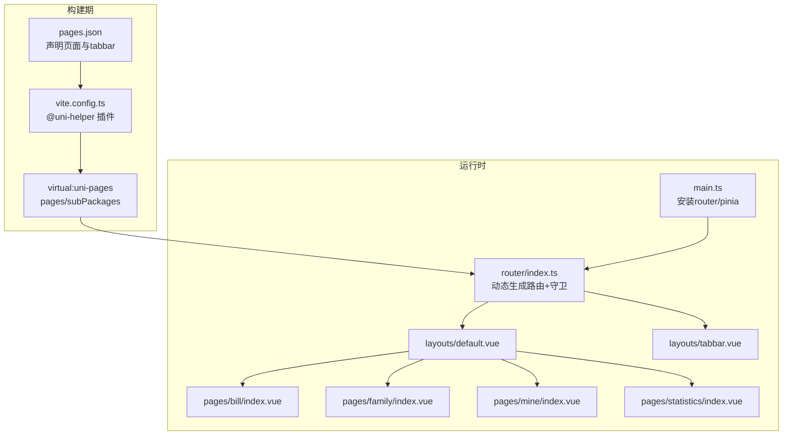
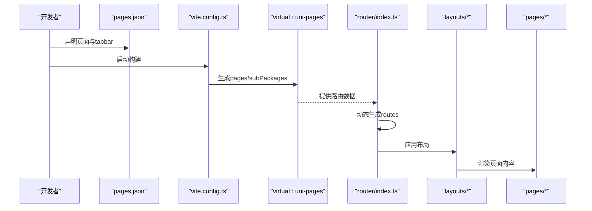
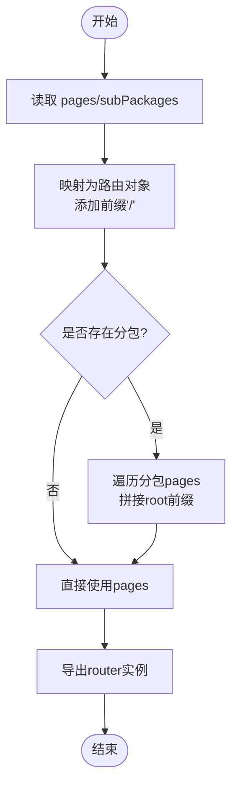
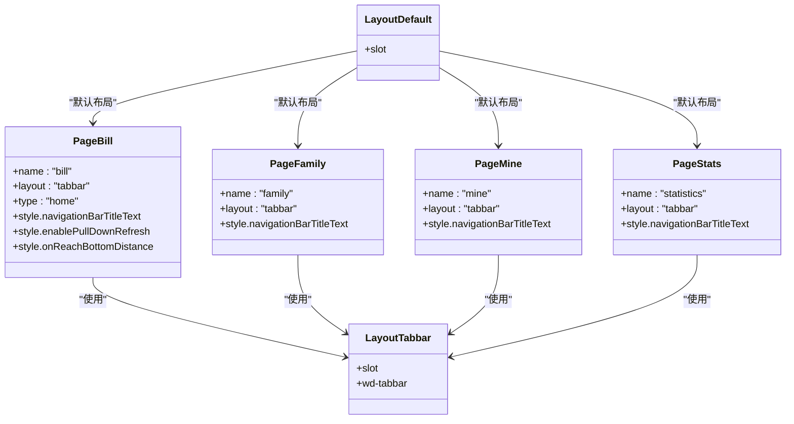
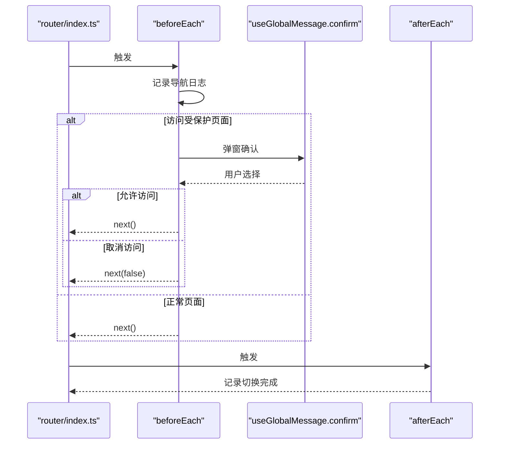
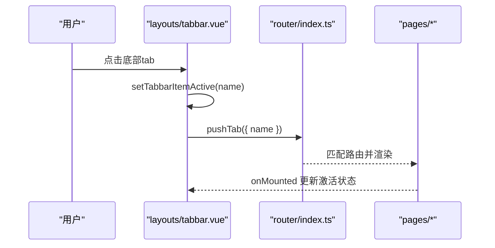
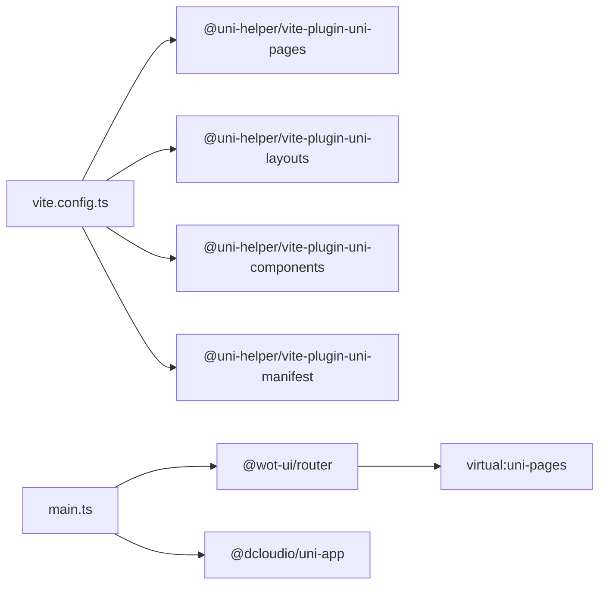

# 路由配置机制

<cite>
**本文引用的文件**
- [pages.json](file://chuan-bill-app/src/pages.json)
- [router/index.ts](file://chuan-bill-app/src/router/index.ts)
- [layouts/default.vue](file://chuan-bill-app/src/layouts/default.vue)
- [layouts/tabbar.vue](file://chuan-bill-app/src/layouts/tabbar.vue)
- [composables/useTabbar.ts](file://chuan-bill-app/src/composables/useTabbar.ts)
- [pages/bill/index.vue](file://chuan-bill-app/src/pages/bill/index.vue)
- [pages/family/index.vue](file://chuan-bill-app/src/pages/family/index.vue)
- [pages/mine/index.vue](file://chuan-bill-app/src/pages/mine/index.vue)
- [pages/statistics/index.vue](file://chuan-bill-app/src/pages/statistics/index.vue)
- [main.ts](file://chuan-bill-app/src/main.ts)
- [manifest.json](file://chuan-bill-app/src/manifest.json)
- [vite.config.ts](file://chuan-bill-app/src/vite.config.ts)
- [package.json](file://chuan-bill-app/package.json)
</cite>

## 目录
1. [简介](#简介)
2. [项目结构](#项目结构)
3. [核心组件](#核心组件)
4. [架构总览](#架构总览)
5. [详细组件分析](#详细组件分析)
6. [依赖关系分析](#依赖关系分析)
7. [性能考量](#性能考量)
8. [故障排查指南](#故障排查指南)
9. [结论](#结论)
10. [附录](#附录)

## 简介
本技术文档围绕“小川记账”的路由配置机制展开，系统性解析基于文件系统的动态路由设计。重点涵盖以下方面：
- pages.json 配置与路由生成
- 路由懒加载与分包策略
- 嵌套路由与页面布局系统（default、tabbar）
- 路由守卫与导航拦截
- uni-app 路由与传统 Vue Router 的差异
- 多端路由适配策略与页面级导航设计
- 路由参数传递（params/query）、路由元信息配置
- 权限控制与条件渲染
- 性能优化、SEO 考虑、跨平台兼容性与调试技巧

## 项目结构
小川记账采用 uni-app + Vite 的工程化架构，路由体系由“文件系统 + 插件 + 手动路由”三部分协同构成：
- 文件系统驱动：通过 pages.json 声明页面与 tabbar 列表
- 构建期插件：vite.config.ts 中的 @uni-helper 插件自动生成路由数据
- 运行时路由：router/index.ts 基于虚拟模块 pages/subPackages 动态构建路由表，并挂载全局守卫

图表来源
- [pages.json:1-83](file://chuan-bill-app/src/pages.json#L1-L83)
- [vite.config.ts:22-38](file://chuan-bill-app/src/vite.config.ts#L22-L38)
- [router/index.ts:1-80](file://chuan-bill-app/src/router/index.ts#L1-L80)
- [main.ts:1-16](file://chuan-bill-app/src/main.ts#L1-L16)

章节来源
- [pages.json:1-83](file://chuan-bill-app/src/pages.json#L1-L83)
- [vite.config.ts:17-80](file://chuan-bill-app/src/vite.config.ts#L17-L80)
- [router/index.ts:1-80](file://chuan-bill-app/src/router/index.ts#L1-L80)
- [main.ts:1-16](file://chuan-bill-app/src/main.ts#L1-L16)

## 核心组件
- 路由生成器：从 virtual:uni-pages 注入的 pages/subPackages 动态拼接 path，形成路由表
- 全局前置守卫：统一记录导航日志、演示受保护页面拦截
- 全局后置钩子：演示页面切换完成后的提示与记录
- 页面布局系统：default（通用布局）与 tabbar（底部导航布局）
- 页面级元信息：通过 definePage 在每个页面内声明 name/layout/style 等元信息

章节来源
- [router/index.ts:4-19](file://chuan-bill-app/src/router/index.ts#L4-L19)
- [router/index.ts:24-59](file://chuan-bill-app/src/router/index.ts#L24-L59)
- [router/index.ts:61-77](file://chuan-bill-app/src/router/index.ts#L61-L77)
- [layouts/default.vue:1-17](file://chuan-bill-app/src/layouts/default.vue#L1-L17)
- [layouts/tabbar.vue:1-48](file://chuan-bill-app/src/layouts/tabbar.vue#L1-L48)
- [pages/bill/index.vue:4-13](file://chuan-bill-app/src/pages/bill/index.vue#L4-L13)

## 架构总览
小川记账的路由架构以“文件系统为中心”，通过构建期插件扫描页面目录并生成路由数据，运行时再由 router/index.ts 将其转换为可导航的路由表。页面通过 definePage 声明元信息，布局通过 layouts 组件进行封装，最终在不同端（H5、小程序等）由 uni-app 渲染。

图表来源
- [pages.json:15-55](file://chuan-bill-app/src/pages.json#L15-L55)
- [vite.config.ts:26-29](file://chuan-bill-app/src/vite.config.ts#L26-L29)
- [router/index.ts:2-23](file://chuan-bill-app/src/router/index.ts#L2-L23)
- [layouts/default.vue:14-16](file://chuan-bill-app/src/layouts/default.vue#L14-L16)
- [layouts/tabbar.vue:35-47](file://chuan-bill-app/src/layouts/tabbar.vue#L35-L47)

## 详细组件分析

### 路由生成与懒加载
- 路由来源：从 virtual:uni-pages 注入的 pages 与 subPackages 数据，逐条映射为路由对象
- 路径规范：将 page.path 前缀添加“/”，形成标准路由 path；分包场景将 subPackage.root 作为前缀
- 懒加载策略：通过 @uni-helper/vite-plugin-uni-pages 插件在构建期生成路由数据，运行时按需加载页面资源
- 分包支持：当存在 subPackages 时，遍历每个分包的 pages，拼接根路径后加入路由表

图表来源
- [router/index.ts:4-19](file://chuan-bill-app/src/router/index.ts#L4-L19)

章节来源
- [router/index.ts:1-80](file://chuan-bill-app/src/router/index.ts#L1-L80)
- [vite.config.ts:26-29](file://chuan-bill-app/src/vite.config.ts#L26-L29)

### 页面级元信息与布局集成
- 页面元信息：每个页面通过 definePage 声明 name、layout、type、style 等字段
- 布局选择：layout 为 tabbar 时，页面由 tabbar 布局接管；默认由 default 布局承载
- 页面样式：style 内的 navigationBarTitleText、enablePullDownRefresh、onReachBottomDistance 等影响导航栏与页面行为

图表来源
- [pages/bill/index.vue:4-13](file://chuan-bill-app/src/pages/bill/index.vue#L4-L13)
- [pages/family/index.vue:2-8](file://chuan-bill-app/src/pages/family/index.vue#L2-L8)
- [pages/mine/index.vue:2-8](file://chuan-bill-app/src/pages/mine/index.vue#L2-L8)
- [pages/statistics/index.vue:2-8](file://chuan-bill-app/src/pages/statistics/index.vue#L2-L8)
- [layouts/default.vue:14-16](file://chuan-bill-app/src/layouts/default.vue#L14-L16)
- [layouts/tabbar.vue:35-47](file://chuan-bill-app/src/layouts/tabbar.vue#L35-L47)

章节来源
- [pages/bill/index.vue:1-54](file://chuan-bill-app/src/pages/bill/index.vue#L1-L54)
- [pages/family/index.vue:1-23](file://chuan-bill-app/src/pages/family/index.vue#L1-L23)
- [pages/mine/index.vue:1-23](file://chuan-bill-app/src/pages/mine/index.vue#L1-L23)
- [pages/statistics/index.vue:1-23](file://chuan-bill-app/src/pages/statistics/index.vue#L1-L23)
- [layouts/default.vue:1-17](file://chuan-bill-app/src/layouts/default.vue#L1-L17)
- [layouts/tabbar.vue:1-48](file://chuan-bill-app/src/layouts/tabbar.vue#L1-L48)

### 路由守卫与导航拦截
- beforeEach：记录导航日志，演示对受保护页面的拦截逻辑（弹窗确认后放行或阻止）
- afterEach：演示页面切换完成后的提示与记录
- 守卫中的异步处理：通过 Promise 包裹 confirm 行为，确保 next 正确调用

图表来源
- [router/index.ts:24-59](file://chuan-bill-app/src/router/index.ts#L24-L59)
- [router/index.ts:61-77](file://chuan-bill-app/src/router/index.ts#L61-L77)

章节来源
- [router/index.ts:24-77](file://chuan-bill-app/src/router/index.ts#L24-L77)

### 页面级导航与 tabbar 集成
- tabbar 布局：在 layouts/tabbar.vue 中监听路由变化，根据当前激活项设置 tabbar 状态
- 交互流程：点击 tabbar 触发 handleTabbarChange，调用 router.pushTab 跳转至对应 name
- 平台差异：APP 端隐藏原生 tabbar，使用自定义组件替代

图表来源
- [layouts/tabbar.vue:8-22](file://chuan-bill-app/src/layouts/tabbar.vue#L8-L22)
- [layouts/tabbar.vue:37-46](file://chuan-bill-app/src/layouts/tabbar.vue#L37-L46)
- [composables/useTabbar.ts:16-54](file://chuan-bill-app/src/composables/useTabbar.ts#L16-L54)

章节来源
- [layouts/tabbar.vue:1-48](file://chuan-bill-app/src/layouts/tabbar.vue#L1-L48)
- [composables/useTabbar.ts:1-55](file://chuan-bill-app/src/composables/useTabbar.ts#L1-L55)

### uni-app 路由与 Vue Router 差异
- 路由库：本项目使用 @wot-ui/router，提供与 Vue Router 类似的 API（push/replace/back/go 等），同时兼容 uni-app 的多端特性
- 路由对象字段：pages.json 中的字段（如 type、name、layout、style）会被注入到路由对象中，便于运行时消费
- 多端适配：通过 manifest.json 与 @uni-helper 插件在不同端启用差异化配置（如微信小程序 subPackages、H5 darkmode 等）

章节来源
- [router/index.ts:1-80](file://chuan-bill-app/src/router/index.ts#L1-L80)
- [manifest.json:50-62](file://chuan-bill-app/src/manifest.json#L50-L62)
- [package.json:78-86](file://chuan-bill-app/package.json#L78-L86)

### 多端路由适配策略
- 微信小程序：开启 subPackages 优化与合并虚拟主机属性
- H5：启用 darkmode 与主题位置配置
- APP/Harmony：统一使用 uni-app-plus/nvue 编译器与模块配置
- 快速应用/头条/百度/支付宝：按需启用 usingComponents 与编译选项

章节来源
- [manifest.json:8-84](file://chuan-bill-app/src/manifest.json#L8-L84)

### 路由参数传递与 query 处理
- 参数类型：支持 query 与 params 两种方式（参考 @wot-ui/router 使用指南）
- 获取方式：通过 useRoute 获取当前路由的 query/params
- 实践建议：命名路由优先，结合 query 传递筛选条件，params 用于标识性参数

章节来源
- [router/index.ts:52-103](file://chuan-bill-app/src/router/index.ts#L52-L103)

### 页面布局系统与条件渲染
- default 布局：通用容器，适用于非 tabbar 页面
- tabbar 布局：提供底部导航，结合 useTabbar 管理激活项与徽标值
- 条件渲染：根据路由元信息（如 type: home）决定页面展示形态（例如首页启用下拉刷新）

章节来源
- [layouts/default.vue:1-17](file://chuan-bill-app/src/layouts/default.vue#L1-L17)
- [layouts/tabbar.vue:1-48](file://chuan-bill-app/src/layouts/tabbar.vue#L1-L48)
- [pages/bill/index.vue:8-12](file://chuan-bill-app/src/pages/bill/index.vue#L8-L12)

## 依赖关系分析
- 构建期依赖：@uni-helper/vite-plugin-uni-pages 生成 pages/subPackages；@uni-helper/vite-plugin-uni-layouts/@uni-helper/vite-plugin-uni-components/@uni-helper/vite-plugin-uni-manifest 协同工作
- 运行时依赖：@wot-ui/router 提供路由能力；@dcloudio/uni-app 提供多端渲染；AutoImport 自动导入 useRouter/useRoute 等

图表来源
- [vite.config.ts:22-44](file://chuan-bill-app/src/vite.config.ts#L22-L44)
- [main.ts:1-16](file://chuan-bill-app/src/main.ts#L1-L16)

章节来源
- [vite.config.ts:17-80](file://chuan-bill-app/src/vite.config.ts#L17-L80)
- [main.ts:1-16](file://chuan-bill-app/src/main.ts#L1-L16)
- [package.json:88-125](file://chuan-bill-app/package.json#L88-L125)

## 性能考量
- 分包加载：合理拆分子包，减少首屏体积；在微信小程序端启用 subPackages 优化
- 路由懒加载：利用 @uni-helper 插件在构建期生成路由数据，避免手动维护路由表带来的冗余
- 图标与组件：按需引入 wot-design-uni 组件，配合 AutoImport 减少重复导入
- 样式优化：UnoCSS 原子化样式减少打包体积，避免全局样式污染

章节来源
- [vite.config.ts:26-29](file://chuan-bill-app/src/vite.config.ts#L26-L29)
- [vite.config.ts:51-65](file://chuan-bill-app/src/vite.config.ts#L51-L65)
- [manifest.json:57-61](file://chuan-bill-app/src/manifest.json#L57-L61)

## 故障排查指南
- 路由未定义警告：若页面已加载但路由表中未找到对应 path，控制台会输出警告；检查 pages.json 与路由生成逻辑
- 守卫未生效：确认 router/index.ts 已在 main.ts 中正确安装；检查 beforeEach/afterEach 是否被覆盖
- tabbar 不显示：APP 端默认隐藏原生 tabbar，需确保自定义组件渲染；检查 useTabbar 状态与 router.pushTab 调用
- 多端差异：H5/小程序/APP 的 manifest 配置不同，注意 darkmode、subPackages、usingComponents 等开关

章节来源
- [router/index.ts:24-59](file://chuan-bill-app/src/router/index.ts#L24-L59)
- [router/index.ts:61-77](file://chuan-bill-app/src/router/index.ts#L61-L77)
- [layouts/tabbar.vue:14-16](file://chuan-bill-app/src/layouts/tabbar.vue#L14-L16)
- [manifest.json:50-84](file://chuan-bill-app/src/manifest.json#L50-L84)

## 结论
小川记账的路由体系以文件系统为核心，结合 @uni-helper 插件与 @wot-ui/router，在保证开发体验的同时实现了良好的多端适配与性能表现。通过 pages.json 声明式配置、definePage 元信息与布局系统，以及全局守卫与分包策略，形成了清晰、可扩展的路由架构。后续可在权限控制、SEO 优化与更细粒度的懒加载策略上进一步完善。

## 附录
- 路由参数传递参考：@wot-ui/router 使用指南（params/query）
- 页面跳转示例：使用 name 或 path 跳转，带 query 参数
- 分包注意事项：分包目录需在 vite.config.ts 的 subPackages 中注册，页面文件名固定为 index.vue

章节来源
- [router/index.ts:52-103](file://chuan-bill-app/src/router/index.ts#L52-L103)
- [vite.config.ts:103-105](file://chuan-bill-app/src/vite.config.ts#L103-L105)