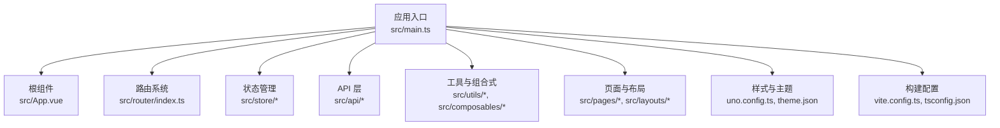
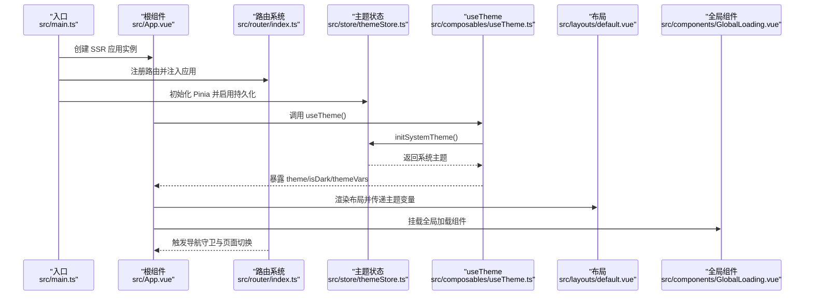
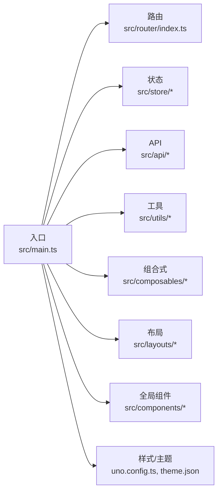

# 项目结构设计

<cite>
**本文引用的文件**
- [main.ts](file://chuan-bill-app/src/main.ts)
- [App.vue](file://chuan-bill-app/src/App.vue)
- [pages.json](file://chuan-bill-app/src/pages.json)
- [router/index.ts](file://chuan-bill-app/src/router/index.ts)
- [store/themeStore.ts](file://chuan-bill-app/src/store/themeStore.ts)
- [api/index.ts](file://chuan-bill-app/src/api/index.ts)
- [utils/index.ts](file://chuan-bill-app/src/utils/index.ts)
- [composables/useTheme.ts](file://chuan-bill-app/src/composables/useTheme.ts)
- [layouts/default.vue](file://chuan-bill-app/src/layouts/default.vue)
- [components/GlobalLoading.vue](file://chuan-bill-app/src/components/GlobalLoading.vue)
- [vite.config.ts](file://chuan-bill-app/vite.config.ts)
- [uno.config.ts](file://chuan-bill-app/uno.config.ts)
- [tsconfig.json](file://chuan-bill-app/tsconfig.json)
- [package.json](file://chuan-bill-app/package.json)
</cite>

## 目录
1. [引言](#引言)
2. [项目结构](#项目结构)
3. [核心组件](#核心组件)
4. [架构总览](#架构总览)
5. [详细组件分析](#详细组件分析)
6. [依赖关系分析](#依赖关系分析)
7. [性能考量](#性能考量)
8. [故障排查指南](#故障排查指南)
9. [结论](#结论)
10. [附录](#附录)

## 引言
本技术文档围绕“小川记账”项目在 uni-app 生态下的结构设计展开，重点解析基于 TypeScript/Vue3 的 src 目录组织原则与工程化实践，涵盖应用入口、根组件、页面配置、路由系统、状态管理、API 层、工具函数、组件体系、布局与可复用逻辑、以及 Vite/UnoCSS/TS 配置的作用与定制化方案。文档同时给出文件命名规范、目录层级设计与模块化组织策略，并提供项目初始化模板与扩展指导，帮助团队快速落地一致、可维护、可扩展的前端架构。

## 项目结构
- 采用“按功能域+按职责”的混合分层组织方式：
  - 应用入口与全局配置：src/main.ts、src/App.vue、src/pages.json
  - 路由与页面：src/router、src/pages
  - 状态管理：src/store
  - API 与数据层：src/api
  - 工具与通用能力：src/utils、src/composables
  - 组件与布局：src/components、src/layouts
  - 主题与样式：src/theme.json、uno.config.ts、全局样式
  - 构建与类型：vite.config.ts、tsconfig.json、package.json

- 关键约定
  - 页面与路由：pages.json 与 uni-pages 自动生成路由，避免手写重复配置
  - 组件：以“语义化名称.vue + 对应 JSON/WXML/WXSS”组织，便于多端编译
  - 状态：Pinia + 持久化插件，集中管理主题与业务状态
  - API：Alova 实例 + 代码生成器统一导出 Apis，支持 mock 与真实接口切换
  - 样式：UnoCSS 提供原子化与按需优化，结合主题变量实现深浅色适配

图表来源
- [main.ts:1-16](file://chuan-bill-app/src/main.ts#L1-L16)
- [App.vue:1-16](file://chuan-bill-app/src/App.vue#L1-L16)
- [router/index.ts:1-80](file://chuan-bill-app/src/router/index.ts#L1-L80)
- [store/themeStore.ts:1-75](file://chuan-bill-app/src/store/themeStore.ts#L1-L75)
- [api/index.ts:1-19](file://chuan-bill-app/src/api/index.ts#L1-L19)
- [utils/index.ts:1-79](file://chuan-bill-app/src/utils/index.ts#L1-L79)
- [layouts/default.vue:1-17](file://chuan-bill-app/src/layouts/default.vue#L1-L17)
- [vite.config.ts](file://chuan-bill-app/vite.config.ts)
- [uno.config.ts](file://chuan-bill-app/uno.config.ts)

章节来源
- [main.ts:1-16](file://chuan-bill-app/src/main.ts#L1-L16)
- [App.vue:1-16](file://chuan-bill-app/src/App.vue#L1-L16)
- [pages.json:1-83](file://chuan-bill-app/src/pages.json#L1-L83)
- [router/index.ts:1-80](file://chuan-bill-app/src/router/index.ts#L1-L80)
- [store/themeStore.ts:1-75](file://chuan-bill-app/src/store/themeStore.ts#L1-L75)
- [api/index.ts:1-19](file://chuan-bill-app/src/api/index.ts#L1-L19)
- [utils/index.ts:1-79](file://chuan-bill-app/src/utils/index.ts#L1-L79)
- [layouts/default.vue:1-17](file://chuan-bill-app/src/layouts/default.vue#L1-L17)
- [vite.config.ts](file://chuan-bill-app/vite.config.ts)
- [uno.config.ts](file://chuan-bill-app/uno.config.ts)
- [tsconfig.json](file://chuan-bill-app/tsconfig.json)

## 核心组件
- 应用入口与引导
  - 在入口中创建 SSR 应用实例，注册路由与 Pinia，并引入 UnoCSS 全局样式，确保主题与样式在启动阶段生效。
  - 参考：[入口函数与依赖注入:8-15](file://chuan-bill-app/src/main.ts#L8-L15)

- 根组件与全局样式
  - 根组件内定义页面容器的基础样式类，支持深浅主题背景切换；配合主题变量与组件库主题能力实现一致的视觉体验。
  - 参考：[根组件样式声明:5-15](file://chuan-bill-app/src/App.vue#L5-L15)

- 页面配置与导航
  - pages.json 统一管理全局样式、页面列表与 TabBar 配置，支持多端差异化参数与主题占位符。
  - 参考：[页面与 TabBar 配置:1-83](file://chuan-bill-app/src/pages.json#L1-L83)

- 路由系统
  - 基于 uni-pages 生成路由表，动态映射页面路径；提供全局前置/后置守卫用于导航日志、演示性拦截与页面提示。
  - 参考：[路由生成与守卫:4-59](file://chuan-bill-app/src/router/index.ts#L4-L59)

- 状态管理
  - 使用 Pinia 定义主题状态仓库，提供系统主题检测、主题切换监听与持久化能力，简化主题管理复杂度。
  - 参考：[主题状态仓库:10-74](file://chuan-bill-app/src/store/themeStore.ts#L10-L74)

- API 层
  - Alova 实例与代码生成器统一导出 Apis，支持方法级配置与 mock 数据，便于开发联调与测试。
  - 参考：[API 导出与配置:1-19](file://chuan-bill-app/src/api/index.ts#L1-L19)

- 工具函数
  - 提供路径获取与十六进制颜色到 RGB 字符串转换等通用工具，支撑 UI 与数据处理。
  - 参考：[工具函数集合:1-79](file://chuan-bill-app/src/utils/index.ts#L1-L79)

- 组合式能力
  - useTheme 将主题状态与生命周期绑定，自动监听系统主题变化并更新状态，保证 UI 一致性。
  - 参考：[主题组合式 API:39-70](file://chuan-bill-app/src/composables/useTheme.ts#L39-L70)

- 布局与全局组件
  - default 布局提供通用选项；GlobalLoading 作为全局加载提示组件，结合 Toast 组件实现跨平台兼容。
  - 参考：[默认布局:1-17](file://chuan-bill-app/src/layouts/default.vue#L1-L17)、[全局加载组件:1-47](file://chuan-bill-app/src/components/GlobalLoading.vue#L1-L47)

章节来源
- [main.ts:1-16](file://chuan-bill-app/src/main.ts#L1-L16)
- [App.vue:1-16](file://chuan-bill-app/src/App.vue#L1-L16)
- [pages.json:1-83](file://chuan-bill-app/src/pages.json#L1-L83)
- [router/index.ts:1-80](file://chuan-bill-app/src/router/index.ts#L1-L80)
- [store/themeStore.ts:1-75](file://chuan-bill-app/src/store/themeStore.ts#L1-L75)
- [api/index.ts:1-19](file://chuan-bill-app/src/api/index.ts#L1-L19)
- [utils/index.ts:1-79](file://chuan-bill-app/src/utils/index.ts#L1-L79)
- [composables/useTheme.ts:1-71](file://chuan-bill-app/src/composables/useTheme.ts#L1-L71)
- [layouts/default.vue:1-17](file://chuan-bill-app/src/layouts/default.vue#L1-L17)
- [components/GlobalLoading.vue:1-47](file://chuan-bill-app/src/components/GlobalLoading.vue#L1-L47)

## 架构总览
下图展示从应用启动到页面渲染的关键流程，包括入口初始化、路由生成、主题监听、全局组件挂载与样式注入。

图表来源
- [main.ts:8-15](file://chuan-bill-app/src/main.ts#L8-L15)
- [router/index.ts:21-59](file://chuan-bill-app/src/router/index.ts#L21-L59)
- [store/themeStore.ts:68-72](file://chuan-bill-app/src/store/themeStore.ts#L68-L72)
- [composables/useTheme.ts:43-52](file://chuan-bill-app/src/composables/useTheme.ts#L43-L52)
- [layouts/default.vue:14-16](file://chuan-bill-app/src/layouts/default.vue#L14-L16)
- [components/GlobalLoading.vue:1-26](file://chuan-bill-app/src/components/GlobalLoading.vue#L1-L26)

## 详细组件分析

### 应用入口与引导（main.ts）
- 职责
  - 创建 SSR 应用实例，注册路由与 Pinia
  - 引入 UnoCSS 全局样式，确保主题与样式在启动阶段生效
  - 导出 createApp 工厂函数，满足多端运行时要求
- 关键点
  - Pinia 与持久化插件集成，保障主题与业务状态跨会话保留
  - 入口最小化，避免在启动阶段执行重逻辑
- 参考路径
  - [入口函数与依赖注入:8-15](file://chuan-bill-app/src/main.ts#L8-L15)

章节来源
- [main.ts:1-16](file://chuan-bill-app/src/main.ts#L1-L16)

### 根组件与全局样式（App.vue）
- 职责
  - 定义页面容器基础样式类，支持深浅主题背景
  - 作为全局样式的挂载点，承载主题变量与组件库样式
- 关键点
  - 通过类名与主题变量联动，实现暗色模式下的背景与对比度优化
- 参考路径
  - [根组件样式声明:5-15](file://chuan-bill-app/src/App.vue#L5-L15)

章节来源
- [App.vue:1-16](file://chuan-bill-app/src/App.vue#L1-L16)

### 页面配置与导航（pages.json）
- 职责
  - 统一管理全局样式、页面列表、TabBar 配置与主题占位符
  - 支持多端差异化参数与分包配置占位
- 关键点
  - 使用占位符集中管理主题色与文本风格，便于统一维护
  - TabBar 自定义与覆盖设置，提升交互一致性
- 参考路径
  - [页面与 TabBar 配置:1-83](file://chuan-bill-app/src/pages.json#L1-L83)

章节来源
- [pages.json:1-83](file://chuan-bill-app/src/pages.json#L1-L83)

### 路由系统（router/index.ts）
- 职责
  - 基于 uni-pages 生成路由表，动态映射页面路径
  - 提供全局前置/后置守卫，用于导航日志、演示性拦截与页面提示
- 关键点
  - 分包路由合并生成完整路由表，避免重复配置
  - 守卫中可接入鉴权、埋点与提示逻辑
- 参考路径
  - [路由生成与守卫:4-59](file://chuan-bill-app/src/router/index.ts#L4-L59)

章节来源
- [router/index.ts:1-80](file://chuan-bill-app/src/router/index.ts#L1-L80)

### 状态管理（store/themeStore.ts）
- 职责
  - 管理系统主题状态，提供主题检测、切换与持久化
- 关键点
  - 多端适配：微信小程序与非小程序平台分别使用不同 API 获取系统主题
  - 通过 getter 快速判断深浅主题，减少重复计算
- 参考路径
  - [主题状态仓库:10-74](file://chuan-bill-app/src/store/themeStore.ts#L10-L74)

章节来源
- [store/themeStore.ts:1-75](file://chuan-bill-app/src/store/themeStore.ts#L1-L75)

### API 层（api/index.ts）
- 职责
  - 导出 Alova 实例与 Apis 对象，支持方法级配置与 mock 切换
- 关键点
  - 通过代码生成器集中管理接口定义，降低重复劳动
  - 支持直接使用 Alova 实例进行高级定制
- 参考路径
  - [API 导出与配置:1-19](file://chuan-bill-app/src/api/index.ts#L1-L19)

章节来源
- [api/index.ts:1-19](file://chuan-bill-app/src/api/index.ts#L1-L19)

### 工具函数（utils/index.ts）
- 职责
  - 提供路径获取与十六进制颜色到 RGB 字符串转换等通用工具
- 关键点
  - 颜色转换支持多种格式与透明通道，便于主题与样式处理
- 参考路径
  - [工具函数集合:1-79](file://chuan-bill-app/src/utils/index.ts#L1-L79)

章节来源
- [utils/index.ts:1-79](file://chuan-bill-app/src/utils/index.ts#L1-L79)

### 组合式能力（composables/useTheme.ts）
- 职责
  - 将主题状态与生命周期绑定，自动监听系统主题变化并更新状态
- 关键点
  - 组件挂载前初始化系统主题，卸载时清理监听，避免内存泄漏
  - 返回只读状态，便于模板与逻辑层消费
- 参考路径
  - [主题组合式 API:39-70](file://chuan-bill-app/src/composables/useTheme.ts#L39-L70)

章节来源
- [composables/useTheme.ts:1-71](file://chuan-bill-app/src/composables/useTheme.ts#L1-L71)

### 布局与全局组件（layouts/default.vue、components/GlobalLoading.vue）
- 职责
  - default 布局提供通用选项，便于全局样式与行为统一
  - GlobalLoading 作为全局加载提示组件，结合 Toast 组件实现跨平台兼容
- 关键点
  - 条件编译适配不同平台的 Toast 行为
  - 通过 storeToRefs 与 watch 监听全局加载状态，实现精准控制
- 参考路径
  - [默认布局:1-17](file://chuan-bill-app/src/layouts/default.vue#L1-L17)
  - [全局加载组件:1-47](file://chuan-bill-app/src/components/GlobalLoading.vue#L1-L47)

章节来源
- [layouts/default.vue:1-17](file://chuan-bill-app/src/layouts/default.vue#L1-L17)
- [components/GlobalLoading.vue:1-47](file://chuan-bill-app/src/components/GlobalLoading.vue#L1-L47)

## 依赖关系分析
- 模块耦合与内聚
  - 入口模块对路由、状态、样式高度内聚，形成稳定启动基座
  - 路由与页面配置解耦，通过 uni-pages 生成，降低手工维护成本
  - API 层与工具函数低耦合，便于替换与扩展
- 外部依赖
  - Vue3/Pinia/Alova/UnoCSS/组件库等生态依赖通过包管理与构建配置统一管理
- 可能的循环依赖
  - 通过单一入口导出与虚拟模块（如 uni-pages）避免直接循环导入

图表来源
- [main.ts:8-15](file://chuan-bill-app/src/main.ts#L8-L15)
- [router/index.ts:21-23](file://chuan-bill-app/src/router/index.ts#L21-L23)
- [store/themeStore.ts:10-10](file://chuan-bill-app/src/store/themeStore.ts#L10-L10)
- [api/index.ts:1-19](file://chuan-bill-app/src/api/index.ts#L1-L19)
- [utils/index.ts:1-79](file://chuan-bill-app/src/utils/index.ts#L1-L79)
- [composables/useTheme.ts:39-40](file://chuan-bill-app/src/composables/useTheme.ts#L39-L40)
- [layouts/default.vue:1-17](file://chuan-bill-app/src/layouts/default.vue#L1-L17)
- [components/GlobalLoading.vue:1-47](file://chuan-bill-app/src/components/GlobalLoading.vue#L1-L47)
- [uno.config.ts](file://chuan-bill-app/uno.config.ts)

章节来源
- [main.ts:1-16](file://chuan-bill-app/src/main.ts#L1-L16)
- [router/index.ts:1-80](file://chuan-bill-app/src/router/index.ts#L1-L80)
- [store/themeStore.ts:1-75](file://chuan-bill-app/src/store/themeStore.ts#L1-L75)
- [api/index.ts:1-19](file://chuan-bill-app/src/api/index.ts#L1-L19)
- [utils/index.ts:1-79](file://chuan-bill-app/src/utils/index.ts#L1-L79)
- [composables/useTheme.ts:1-71](file://chuan-bill-app/src/composables/useTheme.ts#L1-L71)
- [layouts/default.vue:1-17](file://chuan-bill-app/src/layouts/default.vue#L1-L17)
- [components/GlobalLoading.vue:1-47](file://chuan-bill-app/src/components/GlobalLoading.vue#L1-L47)
- [uno.config.ts](file://chuan-bill-app/uno.config.ts)

## 性能考量
- 构建与打包
  - 使用 Vite 提升冷启与热更速度，按需加载与 Tree Shaking 降低包体
  - UnoCSS 按需生成原子类，避免全局样式膨胀
- 运行时
  - Pinia 状态持久化仅保留必要字段，减少存储压力
  - 组合式 API 在组件生命周期内初始化与清理监听，避免内存泄漏
- 开发体验
  - 类型检查与 ESLint 配置统一约束，降低回归风险
  - mock 接口与真实接口可无缝切换，提升联调效率

## 故障排查指南
- 路由无法跳转或页面空白
  - 检查 pages.json 中页面路径与 uni-pages 生成结果是否一致
  - 确认路由守卫未错误拦截目标页面
  - 参考：[路由生成与守卫:4-59](file://chuan-bill-app/src/router/index.ts#L4-L59)
- 主题不生效或切换异常
  - 确认 useTheme 在组件挂载前已初始化系统主题
  - 检查系统主题监听是否被正确清理
  - 参考：[主题组合式 API:43-62](file://chuan-bill-app/src/composables/useTheme.ts#L43-L62)
- 全局加载组件不显示
  - 检查条件编译段与 Toast 组件选择器是否匹配
  - 确认 watch 监听与 storeToRefs 是否正确
  - 参考：[全局加载组件:1-47](file://chuan-bill-app/src/components/GlobalLoading.vue#L1-L47)
- 样式冲突或主题变量不生效
  - 检查 UnoCSS 配置与主题变量注入顺序
  - 参考：[UnoCSS 配置](file://chuan-bill-app/uno.config.ts)

章节来源
- [router/index.ts:24-59](file://chuan-bill-app/src/router/index.ts#L24-L59)
- [composables/useTheme.ts:43-62](file://chuan-bill-app/src/composables/useTheme.ts#L43-L62)
- [components/GlobalLoading.vue:1-47](file://chuan-bill-app/src/components/GlobalLoading.vue#L1-L47)
- [uno.config.ts](file://chuan-bill-app/uno.config.ts)

## 结论
本项目在 uni-app 生态下采用“功能域 + 职责分离”的结构设计，结合 uni-pages、Pinia、Alova、UnoCSS 等工具链，实现了页面、路由、状态、API、样式与组件的高内聚低耦合。通过入口统一初始化、主题自动监听、全局组件与布局抽象，提升了开发效率与用户体验。建议在后续迭代中持续完善 API 定义与 mock 规范、细化主题变量与组件库主题映射、加强路由守卫与权限控制，以进一步增强系统的稳定性与可扩展性。

## 附录

### 文件命名规范与目录层级
- 目录层级
  - src/pages：按页面域划分，每个页面包含 .vue/.json/.wxml/.wxss
  - src/components：通用组件，按功能命名，配套 .vue/.json/.wxml
  - src/composables：组合式 API，按能力命名，如 useTheme.ts
  - src/store：状态仓库，按领域命名，如 themeStore.ts
  - src/api：API 定义与生成器，统一导出 Apis
  - src/utils：通用工具函数，按功能命名
  - src/layouts：布局组件，按布局类型命名
- 命名规范
  - 组件文件：首字母大写驼峰或语义化名称
  - 组合式 API：useXXX 前缀
  - 状态仓库：XXXStore 后缀
  - 页面文件：index.vue，子组件按功能命名

### 模块化组织策略
- 页面与路由：通过 pages.json 与 uni-pages 生成路由，避免手写重复配置
- 组件：以“语义化名称.vue + 对应 JSON/WXML/WXSS”组织，便于多端编译
- 状态：Pinia + 持久化插件，集中管理主题与业务状态
- API：Alova 实例 + 代码生成器统一导出 Apis，支持 mock 与真实接口切换
- 样式：UnoCSS 提供原子化与按需优化，结合主题变量实现深浅色适配

### Vite/UnoCSS/TypeScript 配置作用与定制化
- Vite 配置
  - 提供构建、开发服务器、插件与别名等能力，建议保持最小改动以确保升级顺畅
  - 参考：[Vite 配置](file://chuan-bill-app/vite.config.ts)
- UnoCSS 配置
  - 按需生成原子类，支持主题变量与自定义规则，建议与 theme.json 协同维护
  - 参考：[UnoCSS 配置](file://chuan-bill-app/uno.config.ts)
- TypeScript 配置
  - 统一类型检查与模块解析，建议与 ESLint 配置协同，确保类型安全
  - 参考：[TypeScript 配置](file://chuan-bill-app/tsconfig.json)

### 项目初始化模板与扩展指导
- 初始化步骤
  - 创建 src 目录与关键文件：main.ts、App.vue、pages.json、router/index.ts、store/*、api/*、utils/*、composables/*、components/*、layouts/*
  - 配置 Vite/UnoCSS/TS，安装依赖并验证构建
  - 编写第一个页面与路由，验证 uni-pages 生成
- 扩展指导
  - 新增页面：在 pages.json 中新增条目，或通过 uni-pages 约定生成
  - 新增组件：遵循组件命名与目录规范，提供 JSON/WXML/WXSS
  - 新增状态：在 store 下新增领域仓库，按需启用持久化
  - 新增 API：在 api 下新增定义与 mock，使用代码生成器导出 Apis
  - 新增工具：在 utils 下新增函数，提供类型与单元测试
  - 新增布局：在 layouts 下新增布局组件，复用通用选项

章节来源
- [vite.config.ts](file://chuan-bill-app/vite.config.ts)
- [uno.config.ts](file://chuan-bill-app/uno.config.ts)
- [tsconfig.json](file://chuan-bill-app/tsconfig.json)
- [package.json](file://chuan-bill-app/package.json)