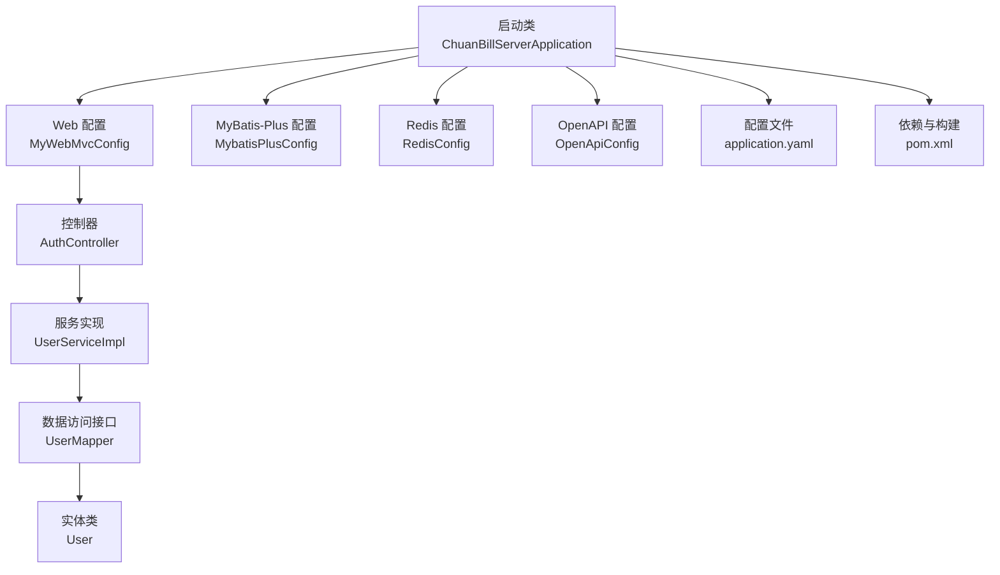
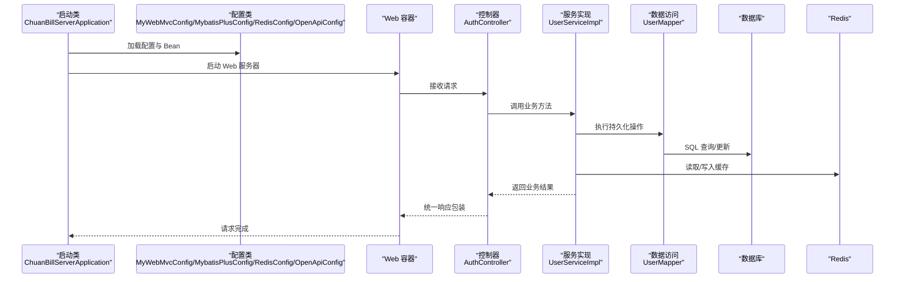
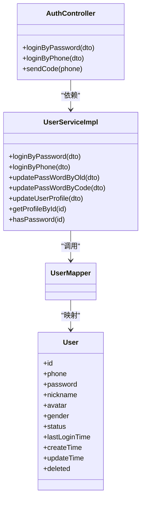
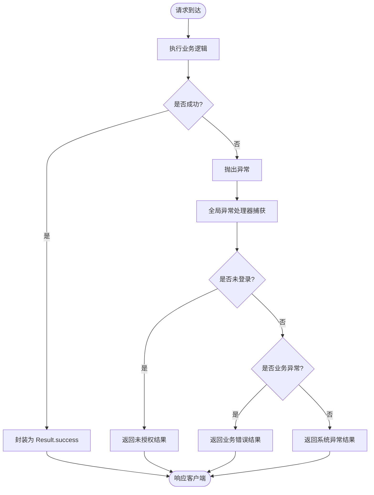
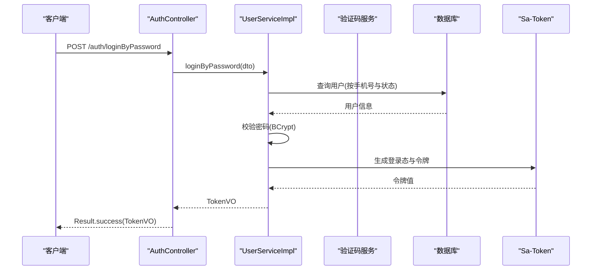

# Spring Boot 应用启动

<cite>
**本文引用的文件**
- [ChuanBillServerApplication.java](file://chuan-bill-server/src/main/java/com/samoy/chuanbillserver/ChuanBillServerApplication.java)
- [application.yaml](file://chuan-bill-server/src/main/resources/application.yaml)
- [pom.xml](file://chuan-bill-server/pom.xml)
- [MyWebMvcConfig.java](file://chuan-bill-server/src/main/java/com/samoy/chuanbillserver/config/MyWebMvcConfig.java)
- [RedisConfig.java](file://chuan-bill-server/src/main/java/com/samoy/chuanbillserver/config/RedisConfig.java)
- [MybatisPlusConfig.java](file://chuan-bill-server/src/main/java/com/samoy/chuanbillserver/config/MybatisPlusConfig.java)
- [OpenApiConfig.java](file://chuan-bill-server/src/main/java/com/samoy/chuanbillserver/config/OpenApiConfig.java)
- [AuthController.java](file://chuan-bill-server/src/main/java/com/samoy/chuanbillserver/controller/AuthController.java)
- [UserServiceImpl.java](file://chuan-bill-server/src/main/java/com/samoy/chuanbillserver/service/impl/UserServiceImpl.java)
- [User.java](file://chuan-bill-server/src/main/java/com/samoy/chuanbillserver/entity/User.java)
- [GlobalExceptionHandler.java](file://chuan-bill-server/src/main/java/com/samoy/chuanbillserver/expection/GlobalExceptionHandler.java)
- [Result.java](file://chuan-bill-server/src/main/java/com/samoy/chuanbillserver/result/Result.java)
- [LoginByPasswordDTO.java](file://chuan-bill-server/src/main/java/com/samoy/chuanbillserver/dto/LoginByPasswordDTO.java)
- [UserMapper.java](file://chuan-bill-server/src/main/java/com/samoy/chuanbillserver/dao/UserMapper.java)
- [SystemConstants.java](file://chuan-bill-server/src/main/java/com/samoy/chuanbillserver/constant/SystemConstants.java)
- [init.sql](file://chuan-bill-server/init.sql)
</cite>

## 目录
1. [引言](#引言)
2. [项目结构](#项目结构)
3. [核心组件](#核心组件)
4. [架构总览](#架构总览)
5. [详细组件分析](#详细组件分析)
6. [依赖分析](#依赖分析)
7. [性能考虑](#性能考虑)
8. [故障排查指南](#故障排查指南)
9. [结论](#结论)
10. [附录](#附录)

## 引言
本文件围绕 Spring Boot 应用的启动机制与运行配置展开，重点解析 ChuanBillServerApplication 主启动类的设计（含 @SpringBootApplication 注解与 @MapperScan 的作用）、Spring 容器初始化流程、application.yaml 中数据库、Redis、安全与文档相关配置项，并结合 Maven 依赖与构建打包流程，给出启动日志分析、配置验证方法、常见问题排查以及生产部署与性能优化建议。

## 项目结构
后端位于 chuan-bill-server 目录，采用标准 Spring Boot 结构：
- 启动类位于 com.samoy.chuanbillserver 包下
- 配置集中在 resources/application.yaml
- 控制器、服务、数据访问层、实体、异常处理、结果封装等按功能分层组织
- 使用 MyBatis-Plus 进行 ORM 访问，集成 Sa-Token 做鉴权，集成 SpringDoc/OpenAPI 生成接口文档

图表来源
- [ChuanBillServerApplication.java:1-15](file://chuan-bill-server/src/main/java/com/samoy/chuanbillserver/ChuanBillServerApplication.java#L1-L15)
- [MyWebMvcConfig.java:1-21](file://chuan-bill-server/src/main/java/com/samoy/chuanbillserver/config/MyWebMvcConfig.java#L1-L21)
- [MybatisPlusConfig.java:1-18](file://chuan-bill-server/src/main/java/com/samoy/chuanbillserver/config/MybatisPlusConfig.java#L1-L18)
- [RedisConfig.java:1-32](file://chuan-bill-server/src/main/java/com/samoy/chuanbillserver/config/RedisConfig.java#L1-L32)
- [OpenApiConfig.java:1-31](file://chuan-bill-server/src/main/java/com/samoy/chuanbillserver/config/OpenApiConfig.java#L1-L31)
- [AuthController.java:1-66](file://chuan-bill-server/src/main/java/com/samoy/chuanbillserver/controller/AuthController.java#L1-L66)
- [UserServiceImpl.java:1-192](file://chuan-bill-server/src/main/java/com/samoy/chuanbillserver/service/impl/UserServiceImpl.java#L1-L192)
- [UserMapper.java:1-15](file://chuan-bill-server/src/main/java/com/samoy/chuanbillserver/dao/UserMapper.java#L1-L15)
- [User.java:1-94](file://chuan-bill-server/src/main/java/com/samoy/chuanbillserver/entity/User.java#L1-L94)
- [application.yaml:1-51](file://chuan-bill-server/src/main/resources/application.yaml#L1-L51)
- [pom.xml:1-226](file://chuan-bill-server/pom.xml#L1-L226)

章节来源
- [ChuanBillServerApplication.java:1-15](file://chuan-bill-server/src/main/java/com/samoy/chuanbillserver/ChuanBillServerApplication.java#L1-L15)
- [application.yaml:1-51](file://chuan-bill-server/src/main/resources/application.yaml#L1-L51)
- [pom.xml:1-226](file://chuan-bill-server/pom.xml#L1-L226)

## 核心组件
- 启动类与注解
  - @SpringBootApplication：组合注解，开启自动配置、组件扫描与条件化配置，负责引导 Spring Boot 应用启动
  - @MapperScan：扫描指定包下的 Mapper 接口，使 MyBatis-Plus 能发现 DAO 层接口并生成代理
  - main 方法通过 SpringApplication.run(...) 触发容器启动与 Web 服务器加载
- 配置文件
  - spring.application.name：应用名
  - spring.datasource.*：数据库驱动、URL、用户名、密码（支持占位符）
  - spring.data.redis.*：Redis 连接参数、超时、连接池配置
  - sa-token.*：令牌名称、超时、并发策略、日志开关等
  - mybatis-plus.*：逻辑删除字段、全局配置、日志输出
  - springdoc.*：OpenAPI 文档路径与 UI 路径
  - dashscope.apiKey 与 dashscope.ocr.appId：百炼 SDK 相关配置
- Web 配置
  - Sa-Token 拦截器注册，排除鉴权路径（如认证、Swagger 文档）
- MyBatis-Plus 配置
  - 分页插件（MySQL）注入，提升查询性能与可维护性
- Redis 配置
  - 自定义 RedisTemplate，统一键值序列化策略，提升缓存读写效率
- OpenAPI 配置
  - 定义文档标题、版本、联系人与多环境服务器地址
- 控制器与服务
  - AuthController 提供登录与验证码接口；UserServiceImpl 实现登录、密码修改、用户资料查询等业务
- 异常处理
  - 全局异常处理器捕获未登录与业务异常，统一返回 Result 结构

章节来源
- [ChuanBillServerApplication.java:1-15](file://chuan-bill-server/src/main/java/com/samoy/chuanbillserver/ChuanBillServerApplication.java#L1-L15)
- [MyWebMvcConfig.java:1-21](file://chuan-bill-server/src/main/java/com/samoy/chuanbillserver/config/MyWebMvcConfig.java#L1-L21)
- [MybatisPlusConfig.java:1-18](file://chuan-bill-server/src/main/java/com/samoy/chuanbillserver/config/MybatisPlusConfig.java#L1-L18)
- [RedisConfig.java:1-32](file://chuan-bill-server/src/main/java/com/samoy/chuanbillserver/config/RedisConfig.java#L1-L32)
- [OpenApiConfig.java:1-31](file://chuan-bill-server/src/main/java/com/samoy/chuanbillserver/config/OpenApiConfig.java#L1-L31)
- [application.yaml:1-51](file://chuan-bill-server/src/main/resources/application.yaml#L1-L51)
- [AuthController.java:1-66](file://chuan-bill-server/src/main/java/com/samoy/chuanbillserver/controller/AuthController.java#L1-L66)
- [UserServiceImpl.java:1-192](file://chuan-bill-server/src/main/java/com/samoy/chuanbillserver/service/impl/UserServiceImpl.java#L1-L192)
- [GlobalExceptionHandler.java:1-50](file://chuan-bill-server/src/main/java/com/samoy/chuanbillserver/expection/GlobalExceptionHandler.java#L1-L50)
- [Result.java:1-50](file://chuan-bill-server/src/main/java/com/samoy/chuanbillserver/result/Result.java#L1-L50)

## 架构总览
下图展示从启动到请求处理的关键交互链路，涵盖容器初始化、拦截器注册、数据库与 Redis 访问、服务层与数据层协作，以及统一异常处理。

图表来源
- [ChuanBillServerApplication.java:1-15](file://chuan-bill-server/src/main/java/com/samoy/chuanbillserver/ChuanBillServerApplication.java#L1-L15)
- [MyWebMvcConfig.java:1-21](file://chuan-bill-server/src/main/java/com/samoy/chuanbillserver/config/MyWebMvcConfig.java#L1-L21)
- [MybatisPlusConfig.java:1-18](file://chuan-bill-server/src/main/java/com/samoy/chuanbillserver/config/MybatisPlusConfig.java#L1-L18)
- [RedisConfig.java:1-32](file://chuan-bill-server/src/main/java/com/samoy/chuanbillserver/config/RedisConfig.java#L1-L32)
- [OpenApiConfig.java:1-31](file://chuan-bill-server/src/main/java/com/samoy/chuanbillserver/config/OpenApiConfig.java#L1-L31)
- [AuthController.java:1-66](file://chuan-bill-server/src/main/java/com/samoy/chuanbillserver/controller/AuthController.java#L1-L66)
- [UserServiceImpl.java:1-192](file://chuan-bill-server/src/main/java/com/samoy/chuanbillserver/service/impl/UserServiceImpl.java#L1-L192)
- [UserMapper.java:1-15](file://chuan-bill-server/src/main/java/com/samoy/chuanbillserver/dao/UserMapper.java#L1-L15)

## 详细组件分析

### 启动类与容器初始化
- 设计要点
  - @SpringBootApplication 开启自动配置与组件扫描，确保配置类、控制器、服务、拦截器等被正确加载
  - @MapperScan("...dao") 指定 MyBatis-Plus Mapper 扫描范围，避免遗漏 DAO 接口
  - SpringApplication.run(...) 触发容器启动、监听器回调、Bean 生命周期与 Web 服务器初始化
- 关键行为
  - 容器启动顺序：配置类 -> Bean 定义 -> 拦截器注册 -> 控制器映射 -> OpenAPI 文档暴露
  - 若配置缺失或冲突，将在启动阶段抛出异常，便于早期发现问题

章节来源
- [ChuanBillServerApplication.java:1-15](file://chuan-bill-server/src/main/java/com/samoy/chuanbillserver/ChuanBillServerApplication.java#L1-L15)

### 配置文件 application.yaml 解析
- 应用与数据源
  - spring.application.name：应用名
  - spring.datasource.driver-class-name/url/username/password：数据库驱动、连接串、账号与密码，支持通过环境变量覆盖（占位符）
- Redis
  - spring.data.redis.host/port/database/password/timeout：连接参数
  - spring.data.redis.lettuce.pool.*：连接池最大活跃、空闲、最小空闲与最大等待
- 安全与会话
  - sa-token.token-name/timeout/active-timeout/is-concurrent/is-share/token-style/is-log：令牌名称、有效期、主动探测、并发、共享、样式与日志开关
- ORM 与日志
  - mybatis-plus.global-config.db-config.logic-delete-field/value/not-delete-value：逻辑删除字段与值
  - mybatis-plus.configuration.log-impl：SQL 日志实现（示例为控制台输出）
- 文档
  - springdoc.api-docs.path/enabled：OpenAPI 文档路径与开关
  - springdoc.swagger-ui.path/enabled：Swagger UI 路径与开关
- 第三方能力
  - dashscope.apiKey 与 dashscope.ocr.appId：用于百炼 OCR 等能力的密钥与应用标识

章节来源
- [application.yaml:1-51](file://chuan-bill-server/src/main/resources/application.yaml#L1-L51)

### Web 安全与拦截器
- Sa-Token 拦截器
  - 对所有路径进行登录校验，排除认证、OpenAPI 文档相关路径
  - 通过 StpUtil.checkLogin() 实现统一鉴权
- 业务影响
  - 未登录请求将由全局异常处理器返回未授权结果

章节来源
- [MyWebMvcConfig.java:1-21](file://chuan-bill-server/src/main/java/com/samoy/chuanbillserver/config/MyWebMvcConfig.java#L1-L21)
- [GlobalExceptionHandler.java:1-50](file://chuan-bill-server/src/main/java/com/samoy/chuanbillserver/expection/GlobalExceptionHandler.java#L1-L50)

### MyBatis-Plus 配置与分页
- 分页插件
  - 在 MySQL 环境下注入分页内核，简化分页查询实现
- 逻辑删除
  - 通过全局配置指定逻辑删除字段与值，避免误删

章节来源
- [MybatisPlusConfig.java:1-18](file://chuan-bill-server/src/main/java/com/samoy/chuanbillserver/config/MybatisPlusConfig.java#L1-L18)
- [application.yaml:32-39](file://chuan-bill-server/src/main/resources/application.yaml#L32-L39)

### Redis 配置与序列化
- RedisTemplate
  - 键与哈希键使用字符串序列化
  - 值与哈希值使用 JSON 序列化，保证跨语言与可读性
- 连接池
  - Lettuce 连接池参数按需配置，避免资源浪费或阻塞

章节来源
- [RedisConfig.java:1-32](file://chuan-bill-server/src/main/java/com/samoy/chuanbillserver/config/RedisConfig.java#L1-L32)
- [application.yaml:10-21](file://chuan-bill-server/src/main/resources/application.yaml#L10-L21)

### OpenAPI 文档配置
- OpenAPI Bean
  - 定义标题、版本、描述与联系人
  - 配置本地与生产服务器地址，便于测试与联调

章节来源
- [OpenApiConfig.java:1-31](file://chuan-bill-server/src/main/java/com/samoy/chuanbillserver/config/OpenApiConfig.java#L1-L31)

### 控制器与服务层
- 控制器
  - AuthController 提供密码登录、手机登录与发送验证码接口，均标注 OpenAPI 标签与摘要
- 服务实现
  - UserServiceImpl 实现登录、密码修改、用户资料更新与查询等
  - 使用 Sa-Token 生成令牌，记录最后登录时间，返回 TokenVO
  - 使用 Hutool 进行密码加密与手机号脱敏
- 数据模型
  - User 实体映射 t_user 表，包含基础字段与逻辑删除字段

图表来源
- [AuthController.java:1-66](file://chuan-bill-server/src/main/java/com/samoy/chuanbillserver/controller/AuthController.java#L1-L66)
- [UserServiceImpl.java:1-192](file://chuan-bill-server/src/main/java/com/samoy/chuanbillserver/service/impl/UserServiceImpl.java#L1-L192)
- [UserMapper.java:1-15](file://chuan-bill-server/src/main/java/com/samoy/chuanbillserver/dao/UserMapper.java#L1-L15)
- [User.java:1-94](file://chuan-bill-server/src/main/java/com/samoy/chuanbillserver/entity/User.java#L1-L94)

章节来源
- [AuthController.java:1-66](file://chuan-bill-server/src/main/java/com/samoy/chuanbillserver/controller/AuthController.java#L1-L66)
- [UserServiceImpl.java:1-192](file://chuan-bill-server/src/main/java/com/samoy/chuanbillserver/service/impl/UserServiceImpl.java#L1-L192)
- [User.java:1-94](file://chuan-bill-server/src/main/java/com/samoy/chuanbillserver/entity/User.java#L1-L94)

### 异常处理与统一返回
- 全局异常处理
  - 捕获未登录与业务异常，统一返回 Result 结构
- 统一返回结构
  - Result 包含 code、message、data、timestamp，提供 success/error 工厂方法

图表来源
- [GlobalExceptionHandler.java:1-50](file://chuan-bill-server/src/main/java/com/samoy/chuanbillserver/expection/GlobalExceptionHandler.java#L1-L50)
- [Result.java:1-50](file://chuan-bill-server/src/main/java/com/samoy/chuanbillserver/result/Result.java#L1-L50)

章节来源
- [GlobalExceptionHandler.java:1-50](file://chuan-bill-server/src/main/java/com/samoy/chuanbillserver/expection/GlobalExceptionHandler.java#L1-L50)
- [Result.java:1-50](file://chuan-bill-server/src/main/java/com/samoy/chuanbillserver/result/Result.java#L1-L50)

### 登录流程时序

图表来源
- [AuthController.java:35-39](file://chuan-bill-server/src/main/java/com/samoy/chuanbillserver/controller/AuthController.java#L35-L39)
- [UserServiceImpl.java:40-61](file://chuan-bill-server/src/main/java/com/samoy/chuanbillserver/service/impl/UserServiceImpl.java#L40-L61)
- [UserMapper.java:1-15](file://chuan-bill-server/src/main/java/com/samoy/chuanbillserver/dao/UserMapper.java#L1-L15)

章节来源
- [AuthController.java:1-66](file://chuan-bill-server/src/main/java/com/samoy/chuanbillserver/controller/AuthController.java#L1-L66)
- [UserServiceImpl.java:1-192](file://chuan-bill-server/src/main/java/com/samoy/chuanbillserver/service/impl/UserServiceImpl.java#L1-L192)

## 依赖分析
- Spring Boot 与 Starter
  - web、validation、actuator、jdbc、data-redis、openapi-ui
- MyBatis-Plus
  - starter、generator、jsqlparser（分页与代码生成）
- Sa-Token
  - 权限认证与 Redis 集成
- Hutool
  - 工具集（加密、文本处理等）
- Lombok
  - 简化实体与 DTO
- DashScope SDK
  - 百炼能力接入
- DevTools 与 dotenv
  - 开发期热更新与环境变量加载

```mermaid
graph TB
P["pom.xml"] --> W["spring-boot-starter-web"]
P --> V["spring-boot-starter-validation"]
P --> A["spring-boot-starter-actuator"]
P --> J["spring-boot-starter-jdbc"]
P --> R["spring-boot-starter-data-redis"]
P --> MP["mybatis-plus-spring-boot3-starter"]
P --> G["mybatis-plus-generator"]
P --> PARSER["mybatis-plus-jsqlparser"]
P --> ST["sa-token-spring-boot3-starter"]
P --> STR["sa-token-redis-template"]
P --> HC["commons-pool2"]
P --> HT["hutool-all"]
P --> DS["dashscope-sdk-java"]
P --> L["lombok"]
P --> VE["springboot3-dotenv"]
P --> DT["spring-boot-devtools"]
```

图表来源
- [pom.xml:51-168](file://chuan-bill-server/pom.xml#L51-L168)

章节来源
- [pom.xml:1-226](file://chuan-bill-server/pom.xml#L1-L226)

## 性能考虑
- 数据库
  - 使用连接池与合理超时，避免慢查询与连接泄漏
  - 为高频查询字段建立索引（参考初始化脚本中的索引设计）
- 缓存
  - Redis 连接池参数按 QPS 与 RT 调整，避免阻塞
  - 对热点数据设置合理过期策略，减少脏读
- ORM
  - 合理使用分页插件，避免一次性拉取大量数据
  - 逻辑删除配合软删除字段，降低误删风险
- 安全
  - 令牌超时与主动探测策略平衡安全与性能
  - 避免在令牌中存储敏感信息，控制令牌长度与样式
- 文档
  - 生产关闭不必要的调试日志，仅保留必要字段输出

章节来源
- [application.yaml:10-21](file://chuan-bill-server/src/main/resources/application.yaml#L10-L21)
- [application.yaml:32-39](file://chuan-bill-server/src/main/resources/application.yaml#L32-L39)
- [MybatisPlusConfig.java:1-18](file://chuan-bill-server/src/main/java/com/samoy/chuanbillserver/config/MybatisPlusConfig.java#L1-L18)
- [application.yaml:23-31](file://chuan-bill-server/src/main/resources/application.yaml#L23-L31)

## 故障排查指南
- 启动失败
  - 数据库连接：检查 MYSQL_URL/MYSQL_USERNAME/MYSQL_PASSWORD 是否正确，确认网络连通与实例可用
  - Redis 连接：检查 REDIS_HOST/REDIS_PORT/REDIS_PASSWORD，确认 Redis 服务运行
  - OpenAPI/Swagger：确认 springdoc.api-docs.enabled 与 springdoc.swagger-ui.enabled
- 认证失败
  - Sa-Token 未登录：确认拦截器排除规则与登录接口路径一致
  - 令牌无效：检查令牌名称、超时与主动探测配置
- 业务异常
  - 全局异常处理器会将未登录与业务异常统一返回，关注 Result.code 与 message
- 数据访问异常
  - 核对 Mapper 扫描路径与实体表名映射，确认逻辑删除字段配置
- 配置验证方法
  - 通过 Actuator 的 env、configprops、beans 端点查看生效配置
  - 使用 curl 访问 /v3/api-docs 与 /swagger-ui.html 验证文档可用性
- 日志分析
  - 关注启动阶段的 Bean 创建日志与异常堆栈
  - 打开 sa-token.is-log 与 mybatis-plus.configuration.log-impl 以辅助定位

章节来源
- [application.yaml:1-51](file://chuan-bill-server/src/main/resources/application.yaml#L1-L51)
- [MyWebMvcConfig.java:1-21](file://chuan-bill-server/src/main/java/com/samoy/chuanbillserver/config/MyWebMvcConfig.java#L1-L21)
- [GlobalExceptionHandler.java:1-50](file://chuan-bill-server/src/main/java/com/samoy/chuanbillserver/expection/GlobalExceptionHandler.java#L1-L50)
- [application.yaml:41-47](file://chuan-bill-server/src/main/resources/application.yaml#L41-L47)

## 结论
本项目基于 Spring Boot 快速搭建了具备认证、账单与家庭管理能力的服务端应用。通过合理的启动类设计、配置文件与依赖管理、拦截器与统一异常处理，实现了清晰的分层架构与良好的可维护性。结合本文提供的启动流程、配置解析、故障排查与性能建议，可在开发与生产环境中高效落地与持续优化。

## 附录
- 数据库初始化
  - 提供完整建库建表与系统默认类目、支付方式初始化脚本，便于快速搭建测试环境
- 部署建议
  - 使用容器镜像或打包产物部署，结合环境变量覆盖敏感配置
  - 生产环境开启健康检查与指标监控，限制日志级别，启用连接池与缓存池参数优化

章节来源
- [init.sql:1-326](file://chuan-bill-server/init.sql#L1-L326)