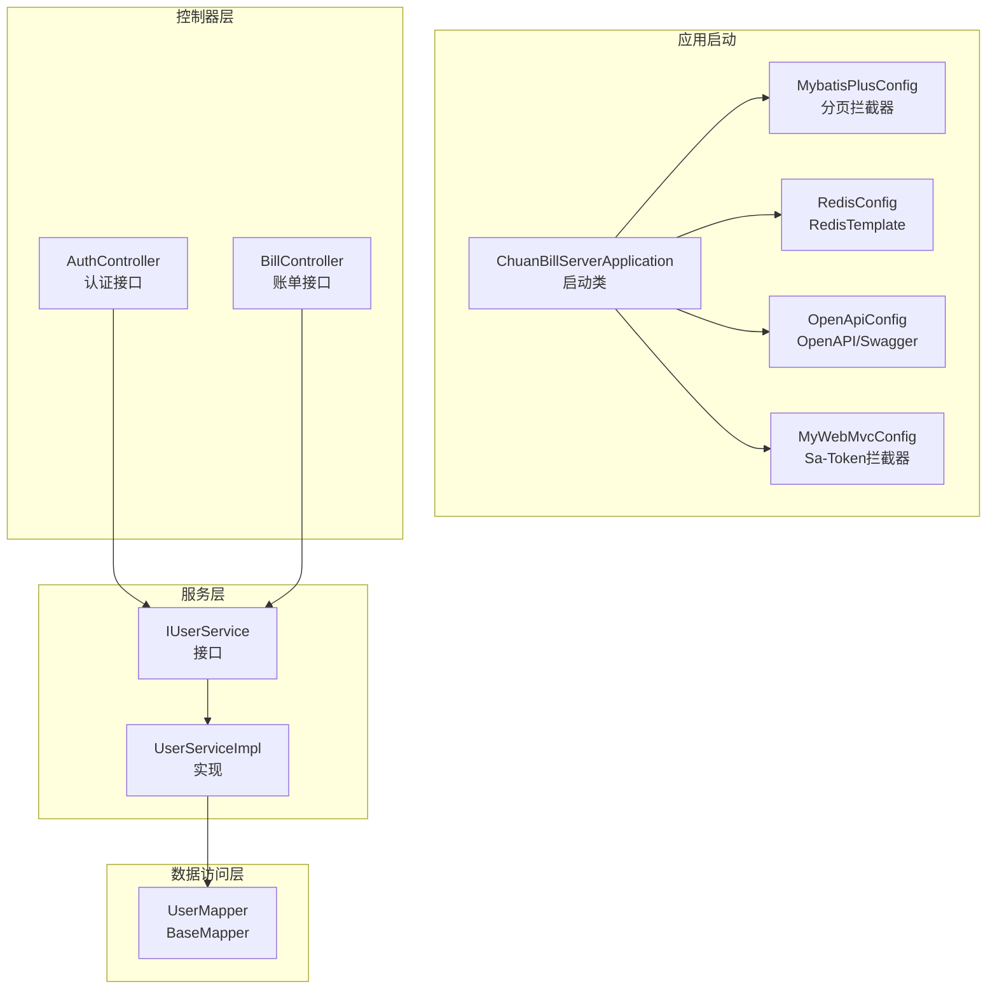
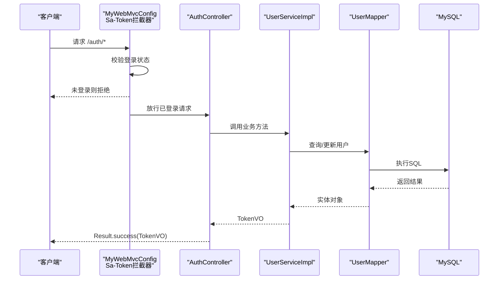
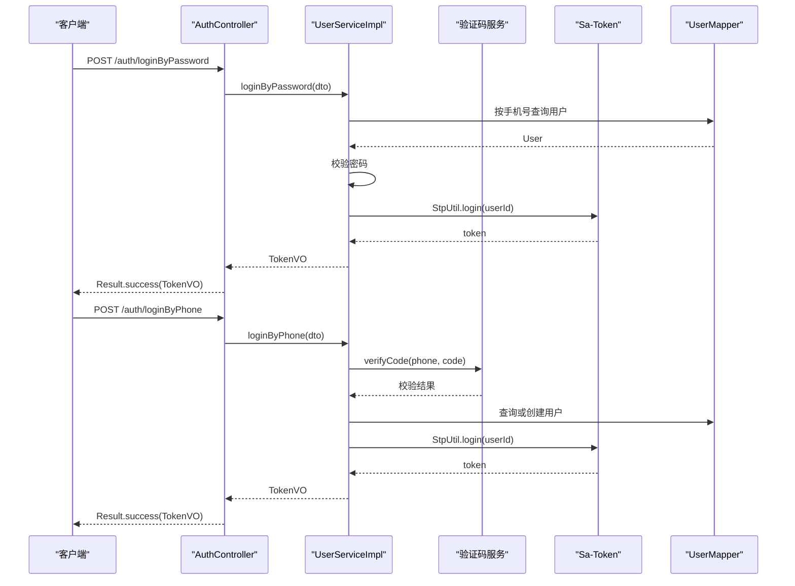
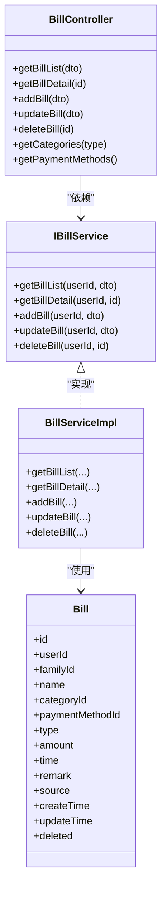
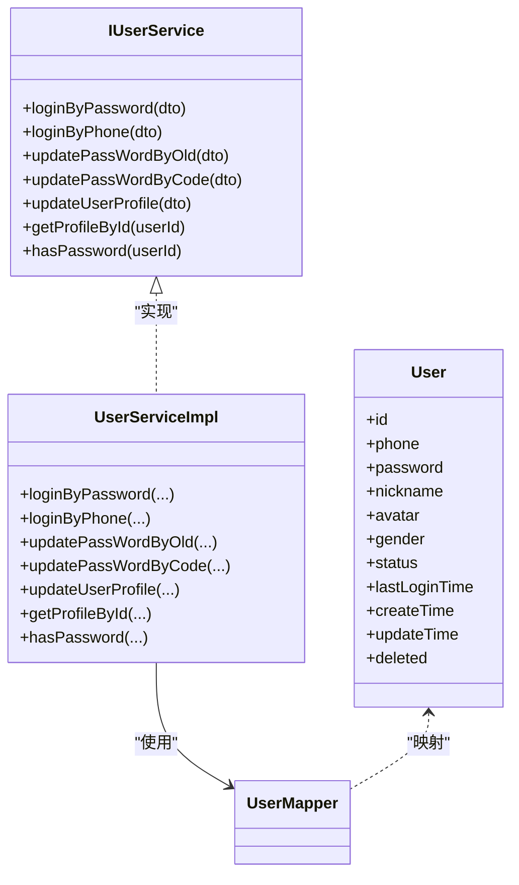
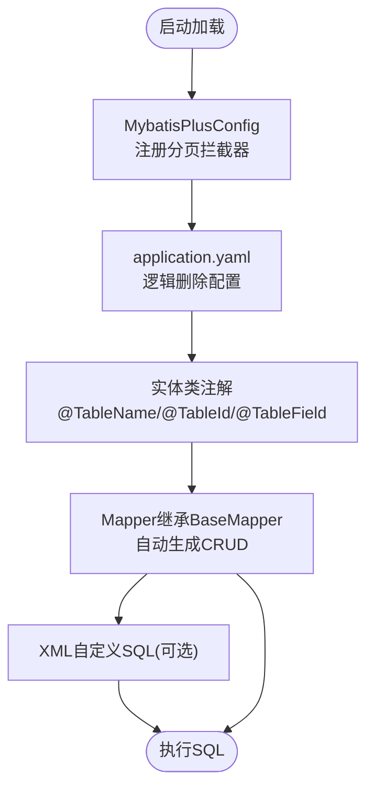
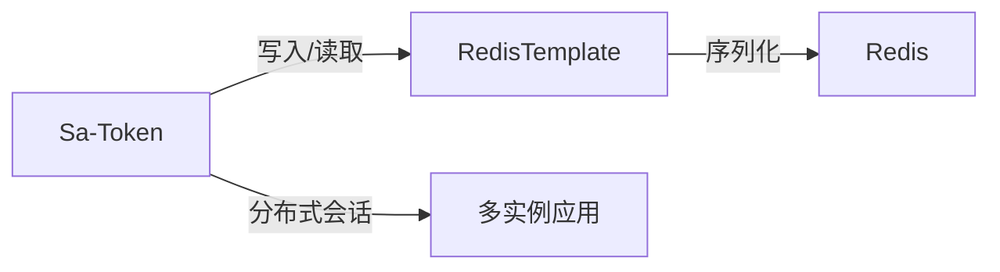
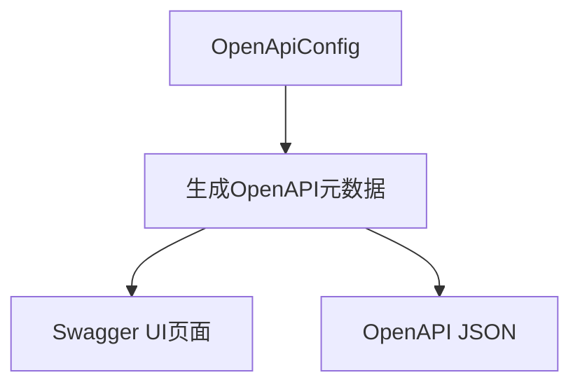
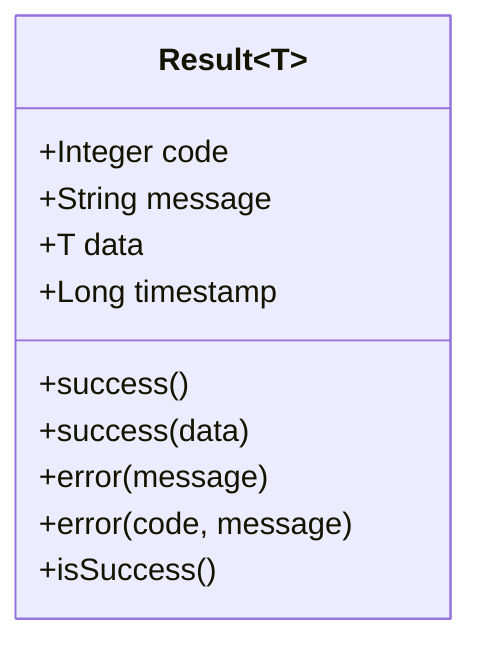
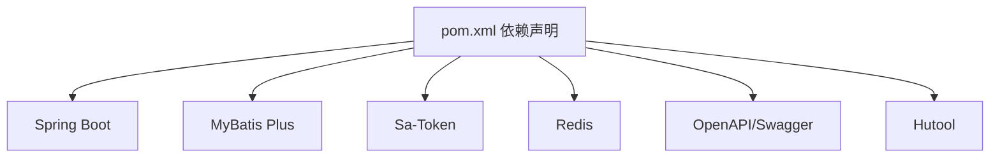

# 后端架构

<cite>
**本文引用的文件**
- [pom.xml](file://chuan-bill-server/pom.xml)
- [application.yaml](file://chuan-bill-server/src/main/resources/application.yaml)
- [ChuanBillServerApplication.java](file://chuan-bill-server/src/main/java/com/samoy/chuanbillserver/ChuanBillServerApplication.java)
- [MybatisPlusConfig.java](file://chuan-bill-server/src/main/java/com/samoy/chuanbillserver/config/MybatisPlusConfig.java)
- [RedisConfig.java](file://chuan-bill-server/src/main/java/com/samoy/chuanbillserver/config/RedisConfig.java)
- [OpenApiConfig.java](file://chuan-bill-server/src/main/java/com/samoy/chuanbillserver/config/OpenApiConfig.java)
- [MyWebMvcConfig.java](file://chuan-bill-server/src/main/java/com/samoy/chuanbillserver/config/MyWebMvcConfig.java)
- [User.java](file://chuan-bill-server/src/main/java/com/samoy/chuanbillserver/entity/User.java)
- [Bill.java](file://chuan-bill-server/src/main/java/com/samoy/chuanbillserver/entity/Bill.java)
- [AuthController.java](file://chuan-bill-server/src/main/java/com/samoy/chuanbillserver/controller/AuthController.java)
- [BillController.java](file://chuan-bill-server/src/main/java/com/samoy/chuanbillserver/controller/BillController.java)
- [IUserService.java](file://chuan-bill-server/src/main/java/com/samoy/chuanbillserver/service/IUserService.java)
- [UserServiceImpl.java](file://chuan-bill-server/src/main/java/com/samoy/chuanbillserver/service/impl/UserServiceImpl.java)
- [UserMapper.java](file://chuan-bill-server/src/main/java/com/samoy/chuanbillserver/dao/UserMapper.java)
- [Result.java](file://chuan-bill-server/src/main/java/com/samoy/chuanbillserver/result/Result.java)
- [init.sql](file://chuan-bill-server/init.sql)
</cite>

## 目录
1. [简介](#简介)
2. [项目结构](#项目结构)
3. [核心组件](#核心组件)
4. [架构总览](#架构总览)
5. [详细组件分析](#详细组件分析)
6. [依赖分析](#依赖分析)
7. [性能考量](#性能考量)
8. [故障排查指南](#故障排查指南)
9. [结论](#结论)
10. [附录](#附录)

## 简介
本项目为“小川记账”后端，采用 Spring Boot 3.5.11 构建，基于分层架构（控制器层、服务层、数据访问层）组织代码；持久层使用 MyBatis Plus，集成逻辑删除与分页插件；认证授权采用 Sa-Token，并结合 Redis 实现分布式会话；通过 OpenAPI/Swagger 自动生成接口文档；统一响应封装与全局异常处理完善；数据库采用 MySQL，配合初始化脚本完成基础表结构与索引设计。

## 项目结构
- 应用入口扫描 Mapper 包路径，集中配置 MyBatis Plus 分页拦截器、Redis 序列化模板、OpenAPI 文档与 Sa-Token 拦截器。
- 控制器层负责对外暴露 REST 接口，如认证、账单查询与维护、分类与支付方式等。
- 服务层封装业务逻辑，如登录、密码修改、用户资料更新等。
- 数据访问层基于 MyBatis Plus 的 BaseMapper，自动获得 CRUD 能力，结合自定义 XML 实现复杂查询。
- 统一响应 Result 封装标准返回结构；全局异常处理在后续可扩展。

图表来源
- [ChuanBillServerApplication.java:1-15](file://chuan-bill-server/src/main/java/com/samoy/chuanbillserver/ChuanBillServerApplication.java#L1-L15)
- [MybatisPlusConfig.java:1-18](file://chuan-bill-server/src/main/java/com/samoy/chuanbillserver/config/MybatisPlusConfig.java#L1-L18)
- [RedisConfig.java:1-32](file://chuan-bill-server/src/main/java/com/samoy/chuanbillserver/config/RedisConfig.java#L1-L32)
- [OpenApiConfig.java:1-31](file://chuan-bill-server/src/main/java/com/samoy/chuanbillserver/config/OpenApiConfig.java#L1-L31)
- [MyWebMvcConfig.java:1-21](file://chuan-bill-server/src/main/java/com/samoy/chuanbillserver/config/MyWebMvcConfig.java#L1-L21)
- [AuthController.java:1-66](file://chuan-bill-server/src/main/java/com/samoy/chuanbillserver/controller/AuthController.java#L1-L66)
- [BillController.java:1-91](file://chuan-bill-server/src/main/java/com/samoy/chuanbillserver/controller/BillController.java#L1-L91)
- [IUserService.java:1-75](file://chuan-bill-server/src/main/java/com/samoy/chuanbillserver/service/IUserService.java#L1-L75)
- [UserServiceImpl.java:1-192](file://chuan-bill-server/src/main/java/com/samoy/chuanbillserver/service/impl/UserServiceImpl.java#L1-L192)
- [UserMapper.java:1-15](file://chuan-bill-server/src/main/java/com/samoy/chuanbillserver/dao/UserMapper.java#L1-L15)

章节来源
- [ChuanBillServerApplication.java:1-15](file://chuan-bill-server/src/main/java/com/samoy/chuanbillserver/ChuanBillServerApplication.java#L1-L15)
- [MybatisPlusConfig.java:1-18](file://chuan-bill-server/src/main/java/com/samoy/chuanbillserver/config/MybatisPlusConfig.java#L1-L18)
- [RedisConfig.java:1-32](file://chuan-bill-server/src/main/java/com/samoy/chuanbillserver/config/RedisConfig.java#L1-L32)
- [OpenApiConfig.java:1-31](file://chuan-bill-server/src/main/java/com/samoy/chuanbillserver/config/OpenApiConfig.java#L1-L31)
- [MyWebMvcConfig.java:1-21](file://chuan-bill-server/src/main/java/com/samoy/chuanbillserver/config/MyWebMvcConfig.java#L1-L21)

## 核心组件
- Spring Boot 启动与包扫描：启动类启用注解扫描 Mapper 包，确保 MyBatis Mapper 自动注册。
- MyBatis Plus：引入分页插件，开启逻辑删除字段配置，便于软删除场景。
- Sa-Token：提供基于 Token 的认证与会话管理，默认拦截所有受保护路径，开放认证与文档路径。
- Redis：配置 JSON 序列化模板，适配 Sa-Token 与业务缓存需求。
- OpenAPI/Swagger：生成接口文档与 UI 页面，便于前后端协作。
- 统一响应：Result 封装 code/message/data/timestamp，提供 success/error 工具方法。

章节来源
- [pom.xml:1-226](file://chuan-bill-server/pom.xml#L1-L226)
- [application.yaml:1-51](file://chuan-bill-server/src/main/resources/application.yaml#L1-L51)
- [MyWebMvcConfig.java:1-21](file://chuan-bill-server/src/main/java/com/samoy/chuanbillserver/config/MyWebMvcConfig.java#L1-L21)
- [RedisConfig.java:1-32](file://chuan-bill-server/src/main/java/com/samoy/chuanbillserver/config/RedisConfig.java#L1-L32)
- [OpenApiConfig.java:1-31](file://chuan-bill-server/src/main/java/com/samoy/chuanbillserver/config/OpenApiConfig.java#L1-L31)
- [Result.java:1-50](file://chuan-bill-server/src/main/java/com/samoy/chuanbillserver/result/Result.java#L1-L50)

## 架构总览
下图展示从客户端到服务端的关键交互流程，包括认证拦截、业务处理与数据访问。

图表来源
- [MyWebMvcConfig.java:1-21](file://chuan-bill-server/src/main/java/com/samoy/chuanbillserver/config/MyWebMvcConfig.java#L1-L21)
- [AuthController.java:1-66](file://chuan-bill-server/src/main/java/com/samoy/chuanbillserver/controller/AuthController.java#L1-L66)
- [UserServiceImpl.java:1-192](file://chuan-bill-server/src/main/java/com/samoy/chuanbillserver/service/impl/UserServiceImpl.java#L1-L192)
- [UserMapper.java:1-15](file://chuan-bill-server/src/main/java/com/samoy/chuanbillserver/dao/UserMapper.java#L1-L15)

## 详细组件分析

### 认证与授权（Sa-Token）
- 拦截器配置：对所有路径进行登录校验，排除认证、OpenAPI 文档路径。
- 登录流程：密码登录与手机验证码登录分别调用服务层方法；成功后通过 Sa-Token 生成登录态与 Token。
- 会话管理：Token 名称、超时、样式等在配置中集中管理，支持分布式部署。

图表来源
- [MyWebMvcConfig.java:1-21](file://chuan-bill-server/src/main/java/com/samoy/chuanbillserver/config/MyWebMvcConfig.java#L1-L21)
- [AuthController.java:1-66](file://chuan-bill-server/src/main/java/com/samoy/chuanbillserver/controller/AuthController.java#L1-L66)
- [UserServiceImpl.java:1-192](file://chuan-bill-server/src/main/java/com/samoy/chuanbillserver/service/impl/UserServiceImpl.java#L1-L192)

章节来源
- [MyWebMvcConfig.java:1-21](file://chuan-bill-server/src/main/java/com/samoy/chuanbillserver/config/MyWebMvcConfig.java#L1-L21)
- [AuthController.java:1-66](file://chuan-bill-server/src/main/java/com/samoy/chuanbillserver/controller/AuthController.java#L1-L66)
- [UserServiceImpl.java:1-192](file://chuan-bill-server/src/main/java/com/samoy/chuanbillserver/service/impl/UserServiceImpl.java#L1-L192)

### 账单模块（控制器与服务）
- 控制器职责：提供账单列表、详情、新增、更新、删除、分类与支付方式查询接口；通过 Sa-Token 获取当前用户 ID。
- 服务层：封装业务规则，如按用户维度隔离数据、参数校验与异常处理。
- 数据模型：Bill 实体映射 t_bill 表，包含用户/家庭关联、类型、金额、时间等字段。

图表来源
- [BillController.java:1-91](file://chuan-bill-server/src/main/java/com/samoy/chuanbillserver/controller/BillController.java#L1-L91)
- [Bill.java:1-113](file://chuan-bill-server/src/main/java/com/samoy/chuanbillserver/entity/Bill.java#L1-L113)

章节来源
- [BillController.java:1-91](file://chuan-bill-server/src/main/java/com/samoy/chuanbillserver/controller/BillController.java#L1-L91)
- [Bill.java:1-113](file://chuan-bill-server/src/main/java/com/samoy/chuanbillserver/entity/Bill.java#L1-L113)

### 用户模块（实体、服务与数据访问）
- 实体映射：User 实体映射 t_user 表，包含手机号、昵称、头像、性别、状态、时间戳与逻辑删除字段。
- 服务实现：密码登录、验证码登录、密码修改（旧密码/验证码）、用户资料更新、获取用户资料（含脱敏）。
- 数据访问：UserMapper 继承 BaseMapper，自动获得通用 CRUD 能力。

图表来源
- [User.java:1-94](file://chuan-bill-server/src/main/java/com/samoy/chuanbillserver/entity/User.java#L1-L94)
- [IUserService.java:1-75](file://chuan-bill-server/src/main/java/com/samoy/chuanbillserver/service/IUserService.java#L1-L75)
- [UserServiceImpl.java:1-192](file://chuan-bill-server/src/main/java/com/samoy/chuanbillserver/service/impl/UserServiceImpl.java#L1-L192)
- [UserMapper.java:1-15](file://chuan-bill-server/src/main/java/com/samoy/chuanbillserver/dao/UserMapper.java#L1-L15)

章节来源
- [User.java:1-94](file://chuan-bill-server/src/main/java/com/samoy/chuanbillserver/entity/User.java#L1-L94)
- [IUserService.java:1-75](file://chuan-bill-server/src/main/java/com/samoy/chuanbillserver/service/IUserService.java#L1-L75)
- [UserServiceImpl.java:1-192](file://chuan-bill-server/src/main/java/com/samoy/chuanbillserver/service/impl/UserServiceImpl.java#L1-L192)
- [UserMapper.java:1-15](file://chuan-bill-server/src/main/java/com/samoy/chuanbillserver/dao/UserMapper.java#L1-L15)

### MyBatis Plus 使用与实体映射
- 分页插件：在 MyBatis Plus 中注入分页拦截器，自动处理分页 SQL。
- 逻辑删除：配置逻辑删除字段与值，避免物理删除。
- 实体映射：通过注解标注表名与字段，简化 ORM 映射。

图表来源
- [MybatisPlusConfig.java:1-18](file://chuan-bill-server/src/main/java/com/samoy/chuanbillserver/config/MybatisPlusConfig.java#L1-L18)
- [application.yaml:32-40](file://chuan-bill-server/src/main/resources/application.yaml#L32-L40)
- [User.java:1-94](file://chuan-bill-server/src/main/java/com/samoy/chuanbillserver/entity/User.java#L1-L94)
- [UserMapper.java:1-15](file://chuan-bill-server/src/main/java/com/samoy/chuanbillserver/dao/UserMapper.java#L1-L15)

章节来源
- [MybatisPlusConfig.java:1-18](file://chuan-bill-server/src/main/java/com/samoy/chuanbillserver/config/MybatisPlusConfig.java#L1-L18)
- [application.yaml:32-40](file://chuan-bill-server/src/main/resources/application.yaml#L32-L40)
- [User.java:1-94](file://chuan-bill-server/src/main/java/com/samoy/chuanbillserver/entity/User.java#L1-L94)
- [UserMapper.java:1-15](file://chuan-bill-server/src/main/java/com/samoy/chuanbillserver/dao/UserMapper.java#L1-L15)

### Redis 缓存与分布式会话
- RedisTemplate：统一字符串键与 JSON 值序列化，适配 Sa-Token 与业务缓存。
- Sa-Token 集成：通过 sa-token-redis-template 与 RedisTemplate 结合，实现 Token 存储与分布式共享。
- 连接池：使用 Apache Commons Pool2 提供连接池能力。

图表来源
- [RedisConfig.java:1-32](file://chuan-bill-server/src/main/java/com/samoy/chuanbillserver/config/RedisConfig.java#L1-L32)
- [application.yaml:9-22](file://chuan-bill-server/src/main/resources/application.yaml#L9-L22)
- [pom.xml:62-78](file://chuan-bill-server/pom.xml#L62-L78)

章节来源
- [RedisConfig.java:1-32](file://chuan-bill-server/src/main/java/com/samoy/chuanbillserver/config/RedisConfig.java#L1-L32)
- [application.yaml:9-22](file://chuan-bill-server/src/main/resources/application.yaml#L9-L22)
- [pom.xml:62-78](file://chuan-bill-server/pom.xml#L62-L78)

### OpenAPI/Swagger 文档生成
- 配置：定义 OpenAPI 基本信息与服务器地址，启用 API 文档与 UI。
- 访问：可通过 /v3/api-docs 与 /swagger-ui.html 访问。

图表来源
- [OpenApiConfig.java:1-31](file://chuan-bill-server/src/main/java/com/samoy/chuanbillserver/config/OpenApiConfig.java#L1-L31)
- [application.yaml:41-47](file://chuan-bill-server/src/main/resources/application.yaml#L41-L47)

章节来源
- [OpenApiConfig.java:1-31](file://chuan-bill-server/src/main/java/com/samoy/chuanbillserver/config/OpenApiConfig.java#L1-L31)
- [application.yaml:41-47](file://chuan-bill-server/src/main/resources/application.yaml#L41-L47)

### 统一响应与异常处理
- 统一响应：Result 封装 code/message/data/timestamp，提供 success/error 工具方法。
- 异常处理：建议在 expection 包中扩展全局异常处理器，结合 ResultEnum 统一错误码与消息。

图表来源
- [Result.java:1-50](file://chuan-bill-server/src/main/java/com/samoy/chuanbillserver/result/Result.java#L1-L50)

章节来源
- [Result.java:1-50](file://chuan-bill-server/src/main/java/com/samoy/chuanbillserver/result/Result.java#L1-L50)

## 依赖分析
- Spring Boot 3.5.11：提供 Web、JDBC、Actuator、Validation 等 Starter。
- MyBatis Plus：提供 ORM、分页、逻辑删除与代码生成能力。
- Sa-Token：提供认证、会话、权限控制与 Redis 集成。
- Redis：提供缓存与分布式会话存储。
- OpenAPI/Swagger：生成接口文档。
- Hutool：提供常用工具方法（如加解密、脱敏等）。

图表来源
- [pom.xml:1-226](file://chuan-bill-server/pom.xml#L1-L226)

章节来源
- [pom.xml:1-226](file://chuan-bill-server/pom.xml#L1-L226)

## 性能考量
- 数据库层面
  - 索引设计：用户表 phone 唯一索引、状态与创建时间索引；账单表按 user_id/time、family_id/time 等建立复合索引，满足高频查询。
  - 逻辑删除：利用 deleted 字段减少全表扫描，但需注意查询时过滤逻辑删除。
- 缓存策略
  - 使用 Redis 缓存热点数据与 Token，降低数据库压力；结合连接池提升并发能力。
- 分页与查询
  - MyBatis Plus 分页插件自动处理分页 SQL，避免一次性加载大量数据。
- 并发与会话
  - Sa-Token 支持并发登录与共享会话配置，结合 Redis 实现分布式一致性。

章节来源
- [application.yaml:32-40](file://chuan-bill-server/src/main/resources/application.yaml#L32-L40)
- [init.sql:14-31](file://chuan-bill-server/init.sql#L14-L31)
- [init.sql:133-158](file://chuan-bill-server/init.sql#L133-L158)

## 故障排查指南
- 认证失败
  - 检查 Sa-Token 拦截器是否正确排除 /auth/** 与文档路径。
  - 核对 Token 名称、超时与样式配置。
- 登录异常
  - 密码登录：确认手机号存在且密码匹配；未设置密码时应提示使用验证码登录。
  - 验证码登录：确认验证码验证通过且用户存在或已自动创建。
- 数据访问问题
  - 确认 Mapper 扫描路径与实体注解正确；检查逻辑删除字段与查询条件。
- 文档不可见
  - 检查 OpenAPI 配置与 application.yaml 中的开关与路径。

章节来源
- [MyWebMvcConfig.java:1-21](file://chuan-bill-server/src/main/java/com/samoy/chuanbillserver/config/MyWebMvcConfig.java#L1-L21)
- [UserServiceImpl.java:1-192](file://chuan-bill-server/src/main/java/com/samoy/chuanbillserver/service/impl/UserServiceImpl.java#L1-L192)
- [application.yaml:23-31](file://chuan-bill-server/src/main/resources/application.yaml#L23-L31)
- [OpenApiConfig.java:1-31](file://chuan-bill-server/src/main/java/com/samoy/chuanbillserver/config/OpenApiConfig.java#L1-L31)

## 结论
本项目以 Spring Boot 为基础，采用清晰的分层架构与成熟的中间件组合，实现了认证授权、数据持久化、接口文档与统一响应等关键能力。通过合理的数据库索引与缓存策略，具备良好的扩展性与性能表现。建议后续完善全局异常处理、埋点监控与安全加固，持续提升系统稳定性与可观测性。

## 附录

### 数据库设计与索引策略
- 用户表（t_user）：唯一索引 phone，辅助索引 status、create_time，支撑登录与状态查询。
- 账单表（t_bill）：复合索引 user_id+time、family_id+time、category_id、payment_method_id、type、time 等，覆盖高频筛选与统计场景。
- 预算表（t_budget）：按 user_id/month、family_id/month 建立唯一索引，保证预算唯一性。
- 消息表（t_message）：按 user_id、type、status、create_time 建立索引，支持消息分页与状态统计。

章节来源
- [init.sql:14-31](file://chuan-bill-server/init.sql#L14-L31)
- [init.sql:133-158](file://chuan-bill-server/init.sql#L133-L158)
- [init.sql:163-178](file://chuan-bill-server/init.sql#L163-L178)
- [init.sql:183-201](file://chuan-bill-server/init.sql#L183-L201)