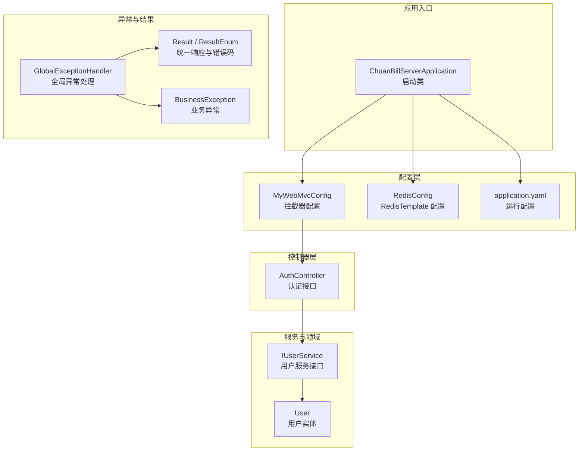
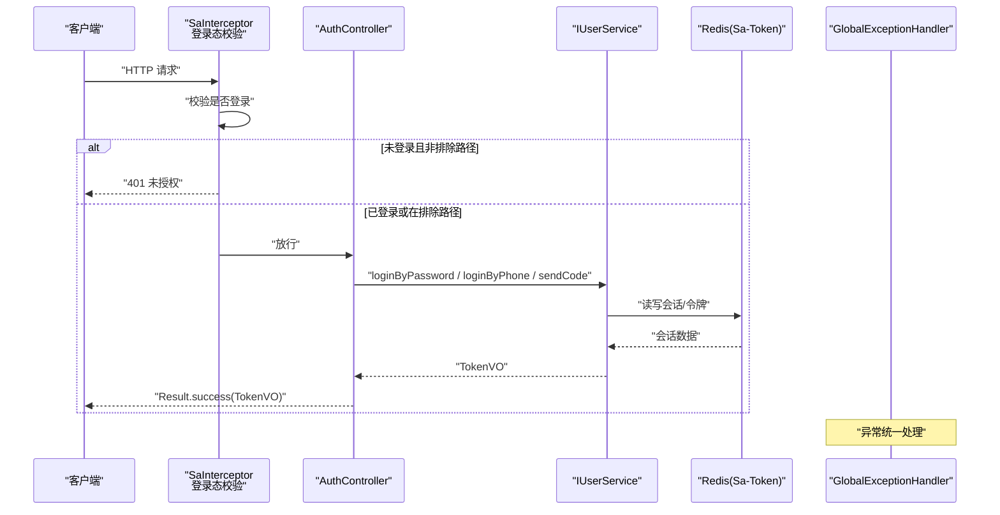
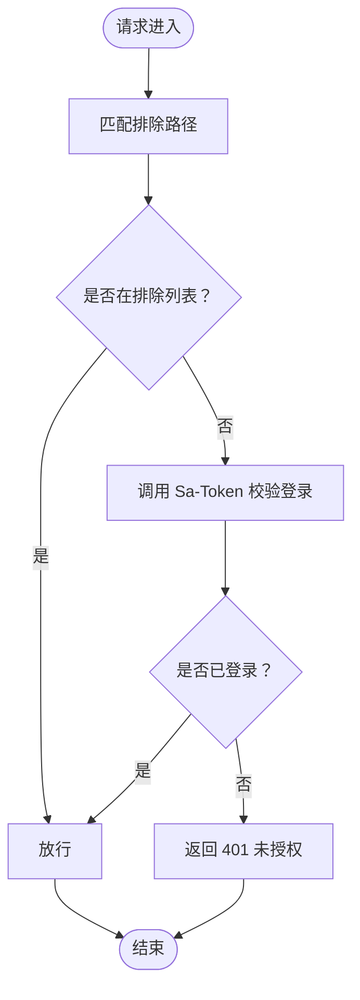
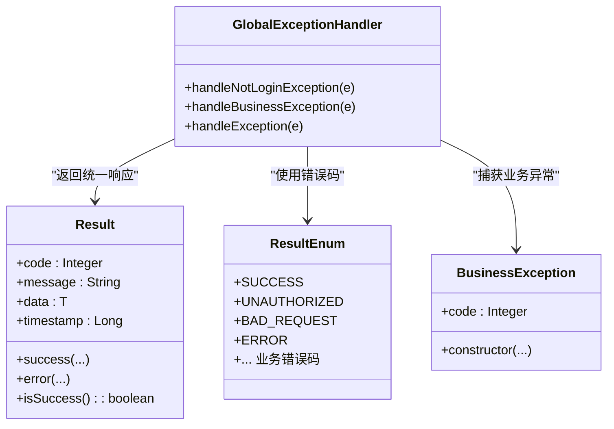
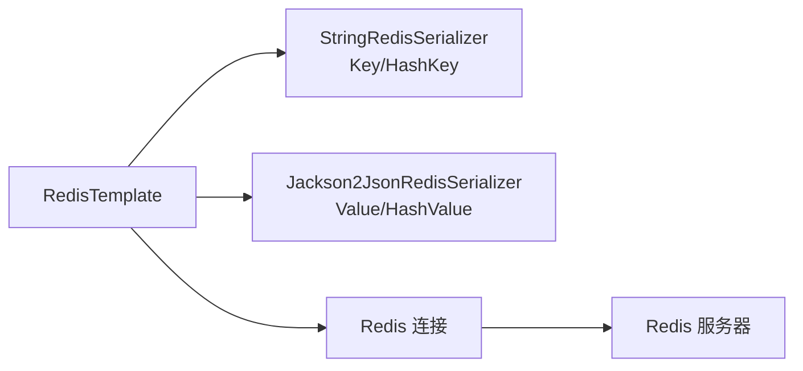
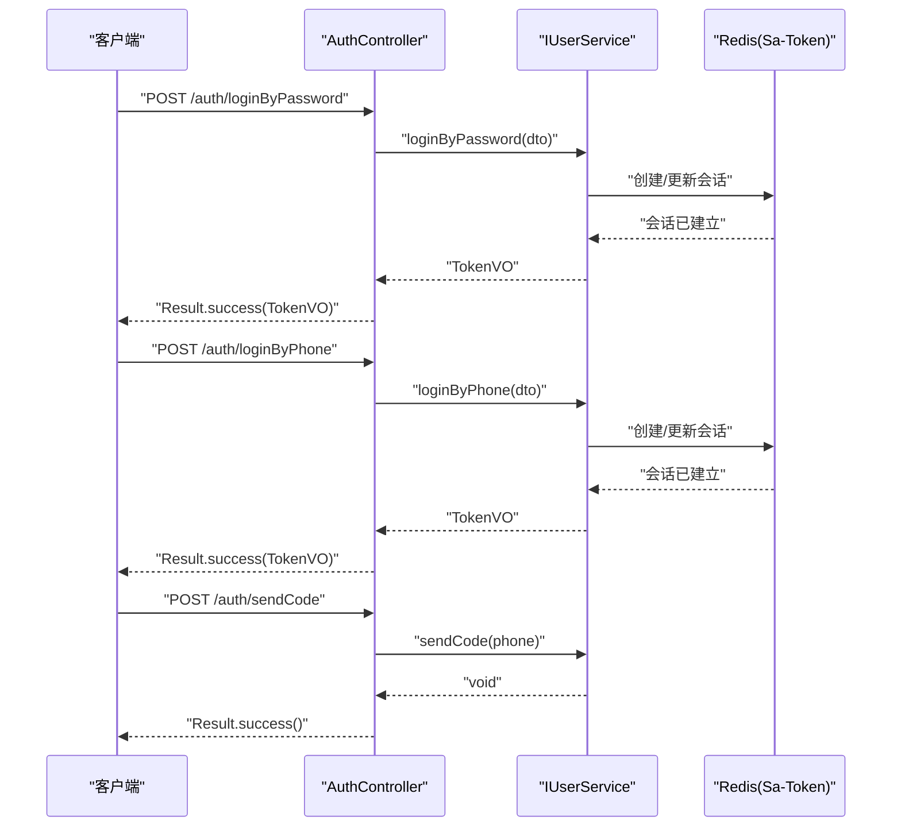
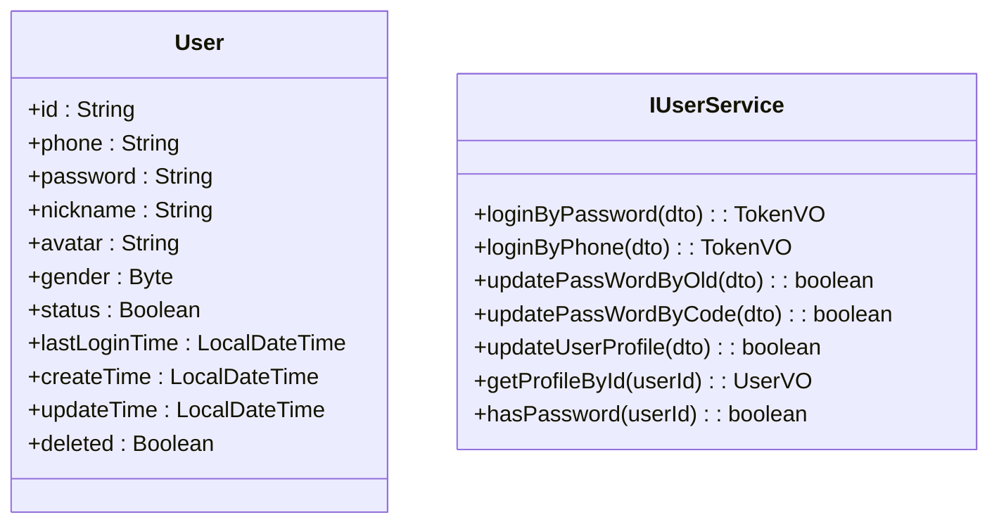
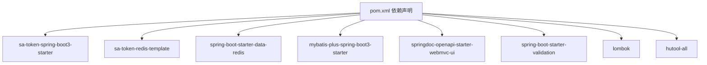

# 安全认证机制

<cite>
**本文引用的文件**
- [ChuanBillServerApplication.java](file://chuan-bill-server/src/main/java/com/samoy/chuanbillserver/ChuanBillServerApplication.java)
- [MyWebMvcConfig.java](file://chuan-bill-server/src/main/java/com/samoy/chuanbillserver/config/MyWebMvcConfig.java)
- [RedisConfig.java](file://chuan-bill-server/src/main/java/com/samoy/chuanbillserver/config/RedisConfig.java)
- [GlobalExceptionHandler.java](file://chuan-bill-server/src/main/java/com/samoy/chuanbillserver/expection/GlobalExceptionHandler.java)
- [BusinessException.java](file://chuan-bill-server/src/main/java/com/samoy/chuanbillserver/expection/BusinessException.java)
- [Result.java](file://chuan-bill-server/src/main/java/com/samoy/chuanbillserver/result/Result.java)
- [ResultEnum.java](file://chuan-bill-server/src/main/java/com/samoy/chuanbillserver/result/ResultEnum.java)
- [AuthController.java](file://chuan-bill-server/src/main/java/com/samoy/chuanbillserver/controller/AuthController.java)
- [IUserService.java](file://chuan-bill-server/src/main/java/com/samoy/chuanbillserver/service/IUserService.java)
- [User.java](file://chuan-bill-server/src/main/java/com/samoy/chuanbillserver/entity/User.java)
- [LoginByPasswordDTO.java](file://chuan-bill-server/src/main/java/com/samoy/chuanbillserver/dto/LoginByPasswordDTO.java)
- [LoginByPhoneDTO.java](file://chuan-bill-server/src/main/java/com/samoy/chuanbillserver/dto/LoginByPhoneDTO.java)
- [TokenVO.java](file://chuan-bill-server/src/main/java/com/samoy/chuanbillserver/vo/TokenVO.java)
- [application.yaml](file://chuan-bill-server/src/main/resources/application.yaml)
- [pom.xml](file://chuan-bill-server/pom.xml)
</cite>

## 目录
1. [引言](#引言)
2. [项目结构](#项目结构)
3. [核心组件](#核心组件)
4. [架构总览](#架构总览)
5. [详细组件分析](#详细组件分析)
6. [依赖分析](#依赖分析)
7. [性能考虑](#性能考虑)
8. [故障排查指南](#故障排查指南)
9. [结论](#结论)
10. [附录](#附录)

## 引言
本文件面向安全认证机制，围绕基于 Sa-Token 的认证授权体系进行系统化技术文档编写。内容涵盖 Token 管理、权限控制、会话管理、分布式支持；统一异常处理与响应封装、错误码规范；WebMvc 配置、跨域与静态资源访问、文件上传配置；Redis 缓存集成与会话持久化、安全防护策略；以及 JWT 令牌处理、OAuth2/第三方登录的扩展实现思路与最佳实践。

## 项目结构
后端采用 Spring Boot 工程，核心模块按职责分层：控制器层、服务层、数据访问层、配置层、异常与结果封装层、实体与 DTO/VO 层。认证相关的关键入口为 Web 拦截器配置与认证控制器，统一响应与异常由全局处理器负责，Redis 配置用于 Sa-Token 的分布式会话存储。

图示来源
- [ChuanBillServerApplication.java:1-15](file://chuan-bill-server/src/main/java/com/samoy/chuanbillserver/ChuanBillServerApplication.java#L1-L15)
- [MyWebMvcConfig.java:1-21](file://chuan-bill-server/src/main/java/com/samoy/chuanbillserver/config/MyWebMvcConfig.java#L1-L21)
- [RedisConfig.java:1-32](file://chuan-bill-server/src/main/java/com/samoy/chuanbillserver/config/RedisConfig.java#L1-L32)
- [application.yaml:1-51](file://chuan-bill-server/src/main/resources/application.yaml#L1-L51)
- [AuthController.java:1-66](file://chuan-bill-server/src/main/java/com/samoy/chuanbillserver/controller/AuthController.java#L1-L66)
- [IUserService.java:1-75](file://chuan-bill-server/src/main/java/com/samoy/chuanbillserver/service/IUserService.java#L1-L75)
- [User.java:1-94](file://chuan-bill-server/src/main/java/com/samoy/chuanbillserver/entity/User.java#L1-L94)
- [GlobalExceptionHandler.java:1-50](file://chuan-bill-server/src/main/java/com/samoy/chuanbillserver/expection/GlobalExceptionHandler.java#L1-L50)
- [Result.java:1-50](file://chuan-bill-server/src/main/java/com/samoy/chuanbillserver/result/Result.java#L1-L50)
- [ResultEnum.java:1-56](file://chuan-bill-server/src/main/java/com/samoy/chuanbillserver/result/ResultEnum.java#L1-L56)
- [BusinessException.java:1-36](file://chuan-bill-server/src/main/java/com/samoy/chuanbillserver/expection/BusinessException.java#L1-L36)

章节来源
- [ChuanBillServerApplication.java:1-15](file://chuan-bill-server/src/main/java/com/samoy/chuanbillserver/ChuanBillServerApplication.java#L1-L15)
- [application.yaml:1-51](file://chuan-bill-server/src/main/resources/application.yaml#L1-L51)

## 核心组件
- 认证拦截器与路径规则：通过 Sa-Token 拦截器对所有请求进行登录态校验，默认排除认证、Swagger 文档等路径。
- 全局异常处理：集中捕获未登录、业务异常与通用异常，统一返回 Result 结构。
- 统一响应与错误码：Result 封装 code/message/data/timestamp，ResultEnum 定义标准错误码。
- Redis 集成：自定义 RedisTemplate 序列化策略，为 Sa-Token 的分布式会话提供存储。
- 认证控制器：提供密码登录、手机验证码登录、发送验证码等接口。
- 用户服务与实体：用户登录流程与用户信息模型。
- 运行配置：数据库、Redis、Sa-Token、OpenAPI 等配置项。

章节来源
- [MyWebMvcConfig.java:10-19](file://chuan-bill-server/src/main/java/com/samoy/chuanbillserver/config/MyWebMvcConfig.java#L10-L19)
- [GlobalExceptionHandler.java:10-49](file://chuan-bill-server/src/main/java/com/samoy/chuanbillserver/expection/GlobalExceptionHandler.java#L10-L49)
- [Result.java:8-49](file://chuan-bill-server/src/main/java/com/samoy/chuanbillserver/result/Result.java#L8-L49)
- [ResultEnum.java:6-56](file://chuan-bill-server/src/main/java/com/samoy/chuanbillserver/result/ResultEnum.java#L6-L56)
- [RedisConfig.java:12-31](file://chuan-bill-server/src/main/java/com/samoy/chuanbillserver/config/RedisConfig.java#L12-L31)
- [AuthController.java:19-66](file://chuan-bill-server/src/main/java/com/samoy/chuanbillserver/controller/AuthController.java#L19-L66)
- [IUserService.java:17-74](file://chuan-bill-server/src/main/java/com/samoy/chuanbillserver/service/IUserService.java#L17-L74)
- [User.java:24-93](file://chuan-bill-server/src/main/java/com/samoy/chuanbillserver/entity/User.java#L24-L93)
- [application.yaml:23-31](file://chuan-bill-server/src/main/resources/application.yaml#L23-L31)

## 架构总览
下图展示从客户端到服务端的认证流程：请求经拦截器校验登录态，认证控制器处理登录与验证码发送，服务层执行业务逻辑，异常统一由全局处理器处理，响应以 Result 统一封装。

图示来源
- [MyWebMvcConfig.java:12-19](file://chuan-bill-server/src/main/java/com/samoy/chuanbillserver/config/MyWebMvcConfig.java#L12-L19)
- [AuthController.java:35-64](file://chuan-bill-server/src/main/java/com/samoy/chuanbillserver/controller/AuthController.java#L35-L64)
- [GlobalExceptionHandler.java:20-48](file://chuan-bill-server/src/main/java/com/samoy/chuanbillserver/expection/GlobalExceptionHandler.java#L20-L48)

## 详细组件分析

### 认证拦截器与权限控制
- 拦截范围：对所有路径生效，排除认证接口、OpenAPI 文档路径。
- 登录态判定：通过 Sa-Token 的登录校验方法进行判定。
- 路径排除：避免认证接口与文档接口被拦截，保证系统可访问性。

图示来源
- [MyWebMvcConfig.java:12-19](file://chuan-bill-server/src/main/java/com/samoy/chuanbillserver/config/MyWebMvcConfig.java#L12-L19)

章节来源
- [MyWebMvcConfig.java:10-19](file://chuan-bill-server/src/main/java/com/samoy/chuanbillserver/config/MyWebMvcConfig.java#L10-L19)

### 全局异常处理与统一响应
- 未登录异常：捕获 Sa-Token 的 NotLoginException，返回 UNAUTHORIZED 错误码。
- 业务异常：捕获 BusinessException，透传其错误码与消息。
- 其他异常：捕获通用异常，返回系统异常提示。
- 响应封装：Result 统一包含 code/message/data/timestamp，ResultEnum 提供标准错误码枚举。

图示来源
- [GlobalExceptionHandler.java:10-49](file://chuan-bill-server/src/main/java/com/samoy/chuanbillserver/expection/GlobalExceptionHandler.java#L10-L49)
- [Result.java:8-49](file://chuan-bill-server/src/main/java/com/samoy/chuanbillserver/result/Result.java#L8-L49)
- [ResultEnum.java:6-56](file://chuan-bill-server/src/main/java/com/samoy/chuanbillserver/result/ResultEnum.java#L6-L56)
- [BusinessException.java:6-35](file://chuan-bill-server/src/main/java/com/samoy/chuanbillserver/expection/BusinessException.java#L6-L35)

章节来源
- [GlobalExceptionHandler.java:10-49](file://chuan-bill-server/src/main/java/com/samoy/chuanbillserver/expection/GlobalExceptionHandler.java#L10-L49)
- [Result.java:8-49](file://chuan-bill-server/src/main/java/com/samoy/chuanbillserver/result/Result.java#L8-L49)
- [ResultEnum.java:6-56](file://chuan-bill-server/src/main/java/com/samoy/chuanbillserver/result/ResultEnum.java#L6-L56)
- [BusinessException.java:6-35](file://chuan-bill-server/src/main/java/com/samoy/chuanbillserver/expection/BusinessException.java#L6-L35)

### Redis 缓存与会话存储
- 自定义序列化：Key 使用字符串序列化，HashKey 使用字符串序列化，Value 使用 Jackson JSON 序列化，确保 Sa-Token 会话数据可读可写。
- 连接工厂：由 Spring Boot 自动装配，结合 application.yaml 中的 Redis 连接参数。
- Sa-Token 集成：通过 sa-token-redis-template 与 RedisTemplate 协作，实现分布式会话共享与过期管理。

图示来源
- [RedisConfig.java:12-31](file://chuan-bill-server/src/main/java/com/samoy/chuanbillserver/config/RedisConfig.java#L12-L31)
- [application.yaml:9-22](file://chuan-bill-server/src/main/resources/application.yaml#L9-L22)

章节来源
- [RedisConfig.java:12-31](file://chuan-bill-server/src/main/java/com/samoy/chuanbillserver/config/RedisConfig.java#L12-L31)
- [application.yaml:9-22](file://chuan-bill-server/src/main/resources/application.yaml#L9-L22)

### 认证控制器与登录流程
- 接口分组：认证相关接口位于 /auth 路径，包含密码登录、手机验证码登录、发送验证码。
- 参数校验：LoginByPasswordDTO 与 LoginByPhoneDTO 对手机号与密码/验证码进行校验。
- 返回封装：统一返回 TokenVO，包含 token、过期时间、用户标识与昵称。

图示来源
- [AuthController.java:35-64](file://chuan-bill-server/src/main/java/com/samoy/chuanbillserver/controller/AuthController.java#L35-L64)
- [IUserService.java:25-33](file://chuan-bill-server/src/main/java/com/samoy/chuanbillserver/service/IUserService.java#L25-L33)
- [LoginByPasswordDTO.java:11-18](file://chuan-bill-server/src/main/java/com/samoy/chuanbillserver/dto/LoginByPasswordDTO.java#L11-L18)
- [LoginByPhoneDTO.java:10-16](file://chuan-bill-server/src/main/java/com/samoy/chuanbillserver/dto/LoginByPhoneDTO.java#L10-L16)
- [TokenVO.java:8-20](file://chuan-bill-server/src/main/java/com/samoy/chuanbillserver/vo/TokenVO.java#L8-L20)

章节来源
- [AuthController.java:19-66](file://chuan-bill-server/src/main/java/com/samoy/chuanbillserver/controller/AuthController.java#L19-L66)
- [LoginByPasswordDTO.java:11-18](file://chuan-bill-server/src/main/java/com/samoy/chuanbillserver/dto/LoginByPasswordDTO.java#L11-L18)
- [LoginByPhoneDTO.java:10-16](file://chuan-bill-server/src/main/java/com/samoy/chuanbillserver/dto/LoginByPhoneDTO.java#L10-L16)
- [TokenVO.java:8-20](file://chuan-bill-server/src/main/java/com/samoy/chuanbillserver/vo/TokenVO.java#L8-L20)

### 用户服务与实体模型
- 用户实体：包含 id、phone、password、nickname、avatar、gender、status、lastLoginTime、createTime、updateTime、deleted 等字段。
- 用户服务接口：定义登录、密码修改、资料更新、用户查询等能力，供控制器调用。

图示来源
- [User.java:24-93](file://chuan-bill-server/src/main/java/com/samoy/chuanbillserver/entity/User.java#L24-L93)
- [IUserService.java:17-74](file://chuan-bill-server/src/main/java/com/samoy/chuanbillserver/service/IUserService.java#L17-L74)

章节来源
- [User.java:24-93](file://chuan-bill-server/src/main/java/com/samoy/chuanbillserver/entity/User.java#L24-L93)
- [IUserService.java:17-74](file://chuan-bill-server/src/main/java/com/samoy/chuanbillserver/service/IUserService.java#L17-L74)

### Sa-Token 配置与分布式支持
- 配置项：token 名称、有效期、活动有效期、并发登录、账号共享、样式、日志开关等。
- 分布式：通过 sa-token-redis-template 与 RedisTemplate 协作，实现多实例共享会话与统一登出。

章节来源
- [application.yaml:23-31](file://chuan-bill-server/src/main/resources/application.yaml#L23-L31)
- [pom.xml:62-78](file://chuan-bill-server/pom.xml#L62-L78)

### WebMvc 配置、跨域与静态资源
- 拦截器：注册 SaInterceptor，排除认证与文档路径。
- 跨域：当前未显式配置跨域 Bean，如需跨域请在配置类中添加 Cors 配置。
- 静态资源：默认由 Spring MVC 提供，可在配置类中扩展路径映射。
- 文件上传：未见专门的文件上传配置，建议在配置类中添加 multipart 解析器与大小限制。

章节来源
- [MyWebMvcConfig.java:10-19](file://chuan-bill-server/src/main/java/com/samoy/chuanbillserver/config/MyWebMvcConfig.java#L10-L19)

### 错误码定义规范
- 成功与通用错误：SUCCESS、BAD_REQUEST、UNAUTHORIZED、FORBIDDEN、NOT_FOUND、METHOD_NOT_ALLOWED、UNPROCESSABLE_ENTITY、TOO_MANY_REQUESTS、ERROR、BAD_GATEWAY、SERVICE_UNAVAILABLE、GATEWAY_TIMEOUT。
- 业务错误：用户相关（1000+）、账单相关（2000+）、文件相关（3000+）。
- 使用方式：全局异常处理器根据异常类型返回对应 ResultEnum 或自定义 code/message。

章节来源
- [ResultEnum.java:6-56](file://chuan-bill-server/src/main/java/com/samoy/chuanbillserver/result/ResultEnum.java#L6-L56)
- [GlobalExceptionHandler.java:20-48](file://chuan-bill-server/src/main/java/com/samoy/chuanbillserver/expection/GlobalExceptionHandler.java#L20-L48)

## 依赖分析
- Sa-Token：提供认证、会话、权限、分布式支持。
- Redis：提供分布式会话存储。
- MyBatis-Plus：ORM 与分页插件。
- OpenAPI/Swagger：接口文档生成。
- Lombok：简化实体与响应类代码。
- Hutool：常用工具集。
- Spring Validation：参数校验。

图示来源
- [pom.xml:51-168](file://chuan-bill-server/pom.xml#L51-L168)

章节来源
- [pom.xml:51-168](file://chuan-bill-server/pom.xml#L51-L168)

## 性能考虑
- Redis 连接池：合理配置最大活跃数、空闲数与最大等待时间，避免阻塞。
- 会话有效期：根据业务设定合理的 timeout 与 active-timeout，平衡安全与性能。
- 序列化开销：JSON 序列化在高并发场景下可能成为瓶颈，建议评估二进制序列化或压缩策略。
- 缓存命中率：优化热点用户的会话读写，减少重复登录与鉴权成本。
- 日志级别：生产环境建议关闭 Sa-Token 日志或降低日志级别，减少 I/O 开销。

## 故障排查指南
- 未登录返回 401：检查拦截器排除路径与前端携带 token 是否正确。
- 业务异常：确认 BusinessException 抛出时的 code/message 是否符合预期。
- Redis 连接失败：核对 application.yaml 中的 Redis 地址、端口、密码与超时配置。
- Swagger 文档无法访问：确认排除路径与文档开关配置。

章节来源
- [GlobalExceptionHandler.java:20-48](file://chuan-bill-server/src/main/java/com/samoy/chuanbillserver/expection/GlobalExceptionHandler.java#L20-L48)
- [application.yaml:9-22](file://chuan-bill-server/src/main/resources/application.yaml#L9-L22)

## 结论
本项目基于 Sa-Token 实现了完整的认证授权体系，配合 Redis 实现分布式会话，通过全局异常处理与统一响应封装提升了系统的健壮性与一致性。建议在后续迭代中完善跨域配置、文件上传配置，并扩展 JWT 与 OAuth2/第三方登录能力，以满足更复杂的业务场景。

## 附录

### 安全配置最佳实践
- 强制登录拦截：对核心接口启用登录拦截，仅开放必要路径。
- 令牌安全：设置合理的过期时间与刷新策略，避免长期有效令牌。
- Redis 安全：开启密码认证、网络隔离与只读命令限制。
- 输入校验：结合 DTO 校验注解与全局异常处理，防止非法输入。
- 日志审计：记录关键操作与异常，便于追踪与审计。

### 权限设计模式
- 基于角色/资源的访问控制（RBAC），结合 Sa-Token 的角色与权限注解。
- 资源级权限：在服务层对资源归属进行校验，避免越权访问。
- 幂等设计：对幂等接口增加幂等键与去重逻辑。

### API 安全测试方法
- 登录测试：验证密码与验证码登录流程，检查返回 Token 与过期时间。
- 未登录拦截：构造无 Token 请求，验证 401 返回。
- 资源越权：使用不同账户尝试访问他人资源，验证权限控制。
- 异常场景：触发业务异常与通用异常，验证统一响应结构。

### JWT 令牌处理与 OAuth2/第三方登录扩展
- JWT 令牌处理：可在现有 Sa-Token 会话基础上，额外签发 JWT 作为外部接口凭证；或替换 Sa-Token 会话为 JWT，需自行实现签发与校验。
- OAuth2/第三方登录：新增第三方登录控制器，回调后绑定本地用户并发放 Sa-Token；或在回调后签发 JWT 供外部系统使用。
- 注意事项：确保令牌签名算法安全、密钥轮换、防重放攻击与状态管理。