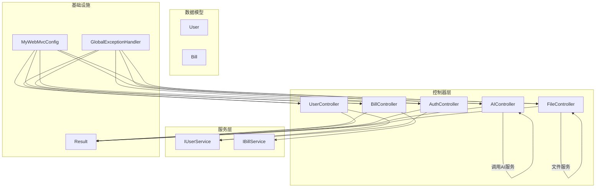
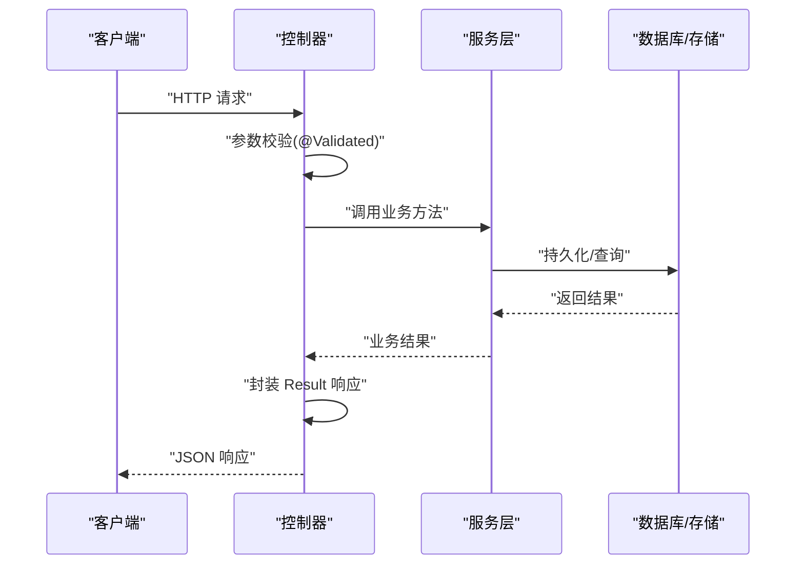
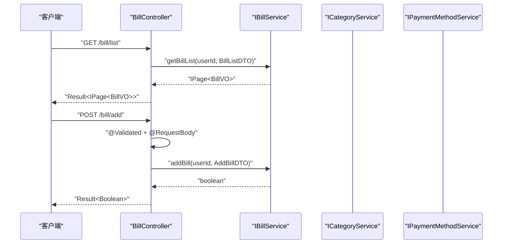
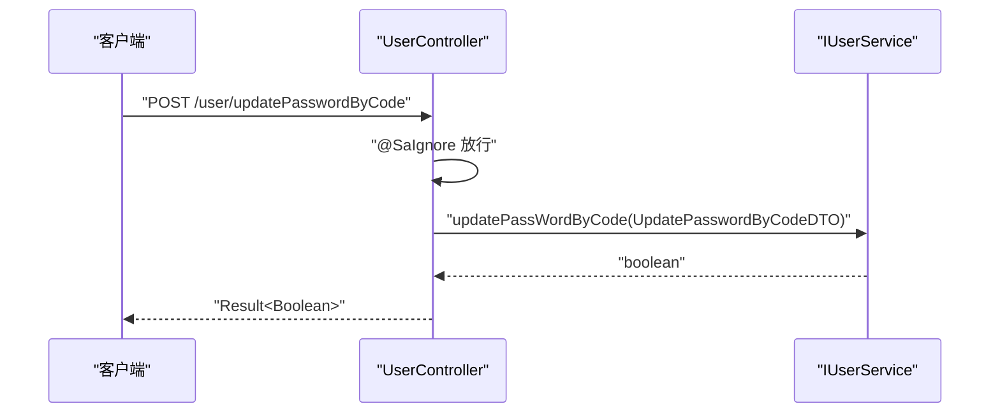
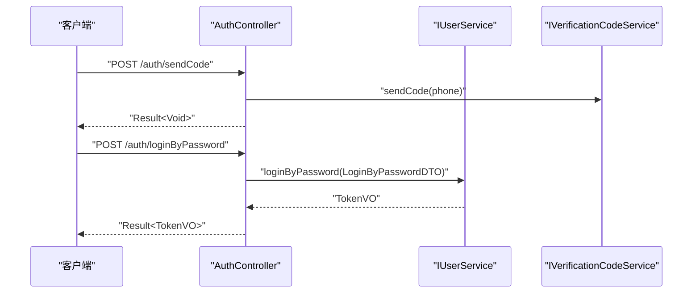
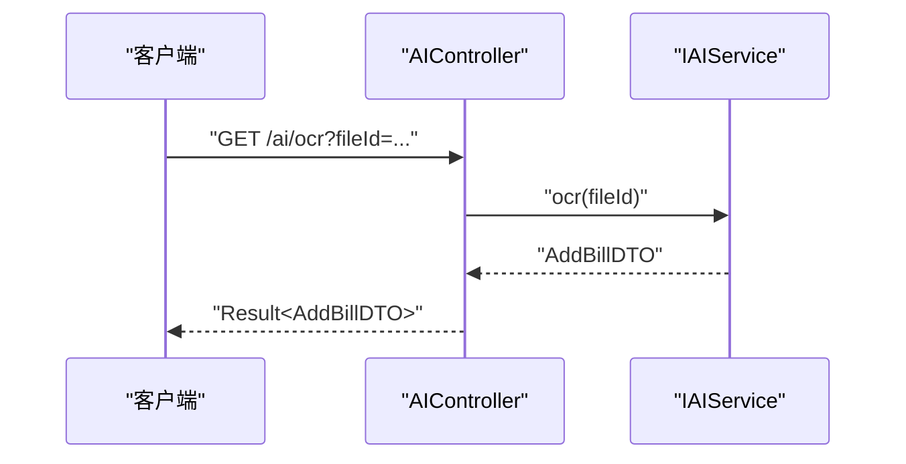
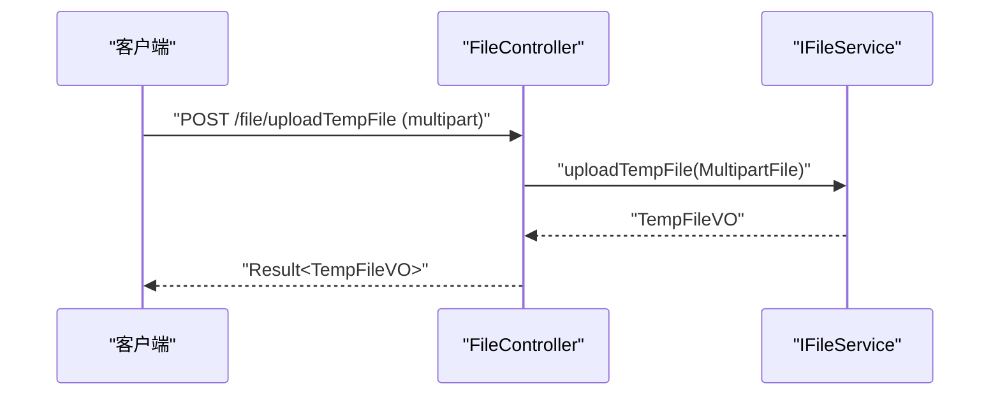
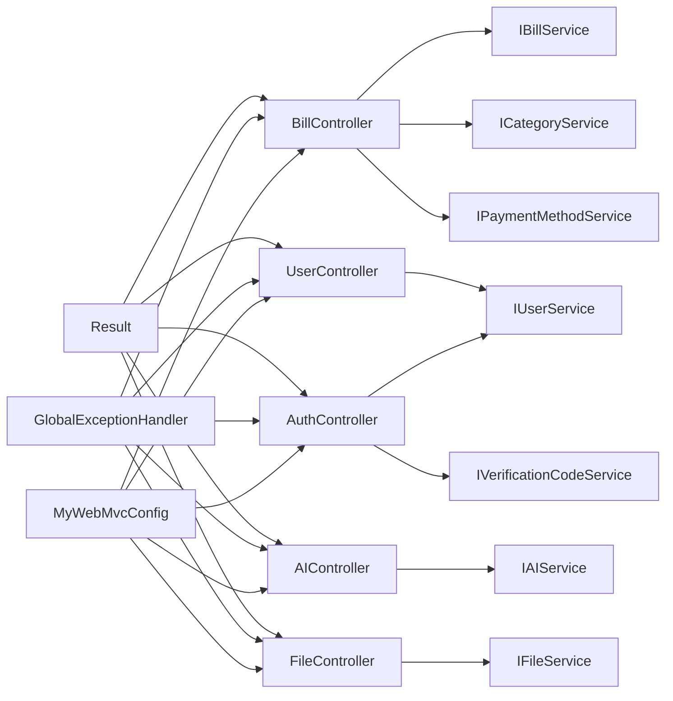
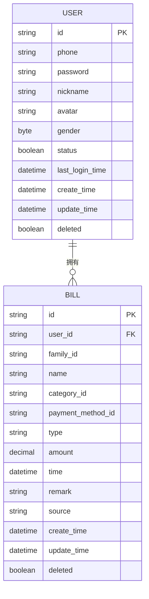

# 控制器层设计

<cite>
**本文引用的文件**
- [BillController.java](file://chuan-bill-server/src/main/java/com/samoy/chuanbillserver/controller/BillController.java)
- [UserController.java](file://chuan-bill-server/src/main/java/com/samoy/chuanbillserver/controller/UserController.java)
- [AuthController.java](file://chuan-bill-server/src/main/java/com/samoy/chuanbillserver/controller/AuthController.java)
- [AIController.java](file://chuan-bill-server/src/main/java/com/samoy/chuanbillserver/controller/AIController.java)
- [FileController.java](file://chuan-bill-server/src/main/java/com/samoy/chuanbillserver/controller/FileController.java)
- [MyWebMvcConfig.java](file://chuan-bill-server/src/main/java/com/samoy/chuanbillserver/config/MyWebMvcConfig.java)
- [GlobalExceptionHandler.java](file://chuan-bill-server/src/main/java/com/samoy/chuanbillserver/expection/GlobalExceptionHandler.java)
- [Result.java](file://chuan-bill-server/src/main/java/com/samoy/chuanbillserver/result/Result.java)
- [AddBillDTO.java](file://chuan-bill-server/src/main/java/com/samoy/chuanbillserver/dto/AddBillDTO.java)
- [LoginByPasswordDTO.java](file://chuan-bill-server/src/main/java/com/samoy/chuanbillserver/dto/LoginByPasswordDTO.java)
- [LoginByPhoneDTO.java](file://chuan-bill-server/src/main/java/com/samoy/chuanbillserver/dto/LoginByPhoneDTO.java)
- [SendCodeDTO.java](file://chuan-bill-server/src/main/java/com/samoy/chuanbillserver/dto/SendCodeDTO.java)
- [TokenVO.java](file://chuan-bill-server/src/main/java/com/samoy/chuanbillserver/vo/TokenVO.java)
- [IUserService.java](file://chuan-bill-server/src/main/java/com/samoy/chuanbillserver/service/IUserService.java)
- [IBillService.java](file://chuan-bill-server/src/main/java/com/samoy/chuanbillserver/service/IBillService.java)
- [User.java](file://chuan-bill-server/src/main/java/com/samoy/chuanbillserver/entity/User.java)
- [Bill.java](file://chuan-bill-server/src/main/java/com/samoy/chuanbillserver/entity/Bill.java)
- [pom.xml](file://chuan-bill-server/pom.xml)
</cite>

## 目录
1. [引言](#引言)
2. [项目结构](#项目结构)
3. [核心组件](#核心组件)
4. [架构总览](#架构总览)
5. [详细组件分析](#详细组件分析)
6. [依赖分析](#依赖分析)
7. [性能考虑](#性能考虑)
8. [故障排查指南](#故障排查指南)
9. [结论](#结论)
10. [附录](#附录)

## 引言
本文件面向控制器层设计，围绕基于 Spring MVC 的 REST 控制器体系，系统阐述注解使用、路径映射、参数绑定与验证、统一响应封装、异常处理策略，并对五大业务控制器（账单、用户、认证、AI、文件）的职责与交互进行深入解析。同时提供单元测试编写建议、OpenAPI 接口文档生成、性能监控方法，帮助开发者快速理解并高效维护控制器层。

## 项目结构
控制器层位于后端服务模块中，采用按功能域划分的包结构，每个控制器负责一组相关业务接口，并通过统一的响应包装与全局异常处理保证一致的对外契约。核心文件组织如下：
- 控制器：controller 包下按业务划分
- DTO/VO：dto、vo 包用于请求与响应数据建模
- 服务接口：service 接口定义业务能力
- 统一响应：result 包提供 Result 封装
- 全局异常：expection 包提供统一异常处理
- Web 配置：config 包提供拦截器与跨域等配置

图表来源
- [BillController.java:23-90](file://chuan-bill-server/src/main/java/com/samoy/chuanbillserver/controller/BillController.java#L23-L90)
- [UserController.java:17-61](file://chuan-bill-server/src/main/java/com/samoy/chuanbillserver/controller/UserController.java#L17-L61)
- [AuthController.java:19-65](file://chuan-bill-server/src/main/java/com/samoy/chuanbillserver/controller/AuthController.java#L19-L65)
- [AIController.java:13-25](file://chuan-bill-server/src/main/java/com/samoy/chuanbillserver/controller/AIController.java#L13-L25)
- [FileController.java:14-26](file://chuan-bill-server/src/main/java/com/samoy/chuanbillserver/controller/FileController.java#L14-L26)
- [MyWebMvcConfig.java:9-20](file://chuan-bill-server/src/main/java/com/samoy/chuanbillserver/config/MyWebMvcConfig.java#L9-L20)
- [GlobalExceptionHandler.java:10-49](file://chuan-bill-server/src/main/java/com/samoy/chuanbillserver/expection/GlobalExceptionHandler.java#L10-L49)
- [Result.java:8-50](file://chuan-bill-server/src/main/java/com/samoy/chuanbillserver/result/Result.java#L8-L50)

章节来源
- [pom.xml:51-168](file://chuan-bill-server/pom.xml#L51-L168)

## 核心组件
- 注解与路径映射
  - @RestController：声明控制器为 REST 风格，返回值自动序列化为 JSON
  - @RequestMapping：定义模块级前缀，如 /bill、/user、/auth、/ai、/file
  - @GetMapping/@PostMapping：定义具体 HTTP 方法与路径
- 参数绑定与验证
  - @RequestBody：绑定请求体；@RequestParam：绑定查询参数；@ModelAttribute：绑定复杂对象
  - @Validated：开启参数校验；配合 Jakarta Bean Validation 注解实现字段级约束
- 统一响应封装
  - Result<T>：统一封装 code、message、data、timestamp，提供 success/error 工厂方法
- 全局异常处理
  - @RestControllerAdvice + @ExceptionHandler：集中处理未登录、业务异常、通用异常
- 安全与拦截
  - Sa-Token 拦截器：全局登录态校验，排除认证与静态资源路径

章节来源
- [BillController.java:23-90](file://chuan-bill-server/src/main/java/com/samoy/chuanbillserver/controller/BillController.java#L23-L90)
- [UserController.java:17-61](file://chuan-bill-server/src/main/java/com/samoy/chuanbillserver/controller/UserController.java#L17-L61)
- [AuthController.java:19-65](file://chuan-bill-server/src/main/java/com/samoy/chuanbillserver/controller/AuthController.java#L19-L65)
- [AIController.java:13-25](file://chuan-bill-server/src/main/java/com/samoy/chuanbillserver/controller/AIController.java#L13-L25)
- [FileController.java:14-26](file://chuan-bill-server/src/main/java/com/samoy/chuanbillserver/controller/FileController.java#L14-L26)
- [MyWebMvcConfig.java:9-20](file://chuan-bill-server/src/main/java/com/samoy/chuanbillserver/config/MyWebMvcConfig.java#L9-L20)
- [GlobalExceptionHandler.java:10-49](file://chuan-bill-server/src/main/java/com/samoy/chuanbillserver/expection/GlobalExceptionHandler.java#L10-L49)
- [Result.java:8-50](file://chuan-bill-server/src/main/java/com/samoy/chuanbillserver/result/Result.java#L8-L50)

## 架构总览
控制器层遵循“控制器-服务-数据模型”的分层架构，控制器仅负责请求接入、参数校验与响应封装，业务逻辑委托给服务层，异常统一由全局处理器接管。安全通过拦截器强制登录态校验，认证模块例外放行。

图表来源
- [BillController.java:37-72](file://chuan-bill-server/src/main/java/com/samoy/chuanbillserver/controller/BillController.java#L37-L72)
- [UserController.java:25-60](file://chuan-bill-server/src/main/java/com/samoy/chuanbillserver/controller/UserController.java#L25-L60)
- [AuthController.java:35-64](file://chuan-bill-server/src/main/java/com/samoy/chuanbillserver/controller/AuthController.java#L35-L64)
- [Result.java:18-44](file://chuan-bill-server/src/main/java/com/samoy/chuanbillserver/result/Result.java#L18-L44)

## 详细组件分析

### 账单控制器（BillController）
- 设计模式
  - 控制器职责清晰：提供账单 CRUD、详情查询、分类与支付方式查询
  - 使用 Sa-Token 获取当前用户 ID，确保数据隔离
- 关键接口
  - GET /bill/list：分页查询账单列表，支持多条件筛选
  - GET /bill/detail：按 ID 查询详情
  - POST /bill/add：新增账单
  - POST /bill/update：更新账单
  - POST /bill/delete：按 ID 删除账单
  - GET /bill/categories：查询分类列表（收入/支出）
  - GET /bill/payment-methods：查询支付方式列表
- 参数绑定与验证
  - 列表查询使用 @ModelAttribute 绑定复杂条件对象
  - 新增/更新使用 @RequestBody 绑定 DTO，并配合 @Validated 开启校验
- 响应封装
  - 返回 Result<T>，成功时携带 data，失败时携带错误码与消息

图表来源
- [BillController.java:37-89](file://chuan-bill-server/src/main/java/com/samoy/chuanbillserver/controller/BillController.java#L37-L89)
- [AddBillDTO.java:10-44](file://chuan-bill-server/src/main/java/com/samoy/chuanbillserver/dto/AddBillDTO.java#L10-L44)
- [IBillService.java:19-65](file://chuan-bill-server/src/main/java/com/samoy/chuanbillserver/service/IBillService.java#L19-L65)

章节来源
- [BillController.java:23-90](file://chuan-bill-server/src/main/java/com/samoy/chuanbillserver/controller/BillController.java#L23-L90)
- [AddBillDTO.java:10-44](file://chuan-bill-server/src/main/java/com/samoy/chuanbillserver/dto/AddBillDTO.java#L10-L44)
- [IBillService.java:19-65](file://chuan-bill-server/src/main/java/com/samoy/chuanbillserver/service/IBillService.java#L19-L65)

### 用户控制器（UserController）
- 设计模式
  - 提供用户资料读取、资料更新、密码修改（旧密码/验证码）、密码存在性检查
  - 密码修改验证码接口使用 @SaIgnore 放行
- 关键接口
  - GET /user/profile：获取当前用户资料
  - POST /user/updateProfile：更新用户资料
  - POST /user/updatePasswordByOld：旧密码修改
  - POST /user/updatePasswordByCode：验证码修改（无需登录）
  - GET /user/hasPassword：判断是否设置密码
- 参数绑定与验证
  - 使用 @RequestBody + @Validated 对更新 DTO 进行校验
- 响应封装
  - 统一 Result<T> 返回

图表来源
- [UserController.java:25-60](file://chuan-bill-server/src/main/java/com/samoy/chuanbillserver/controller/UserController.java#L25-L60)
- [IUserService.java:17-74](file://chuan-bill-server/src/main/java/com/samoy/chuanbillserver/service/IUserService.java#L17-L74)

章节来源
- [UserController.java:17-61](file://chuan-bill-server/src/main/java/com/samoy/chuanbillserver/controller/UserController.java#L17-L61)
- [IUserService.java:17-74](file://chuan-bill-server/src/main/java/com/samoy/chuanbillserver/service/IUserService.java#L17-L74)

### 认证控制器（AuthController）
- 设计模式
  - 提供密码登录、手机验证码登录、发送验证码
  - 登录成功返回 TokenVO，包含 token、过期时间、用户标识与昵称
- 关键接口
  - POST /auth/loginByPassword：手机号+密码登录
  - POST /auth/loginByPhone：手机号+验证码登录
  - POST /auth/sendCode：发送短信验证码
- 参数绑定与验证
  - 使用 @RequestBody + @Validated 对登录与验证码发送 DTO 进行校验
- 响应封装
  - 统一 Result<TokenVO> 或 Result<Void> 返回

图表来源
- [AuthController.java:29-64](file://chuan-bill-server/src/main/java/com/samoy/chuanbillserver/controller/AuthController.java#L29-L64)
- [LoginByPasswordDTO.java:9-18](file://chuan-bill-server/src/main/java/com/samoy/chuanbillserver/dto/LoginByPasswordDTO.java#L9-L18)
- [SendCodeDTO.java:8-13](file://chuan-bill-server/src/main/java/com/samoy/chuanbillserver/dto/SendCodeDTO.java#L8-L13)
- [TokenVO.java:6-20](file://chuan-bill-server/src/main/java/com/samoy/chuanbillserver/vo/TokenVO.java#L6-L20)

章节来源
- [AuthController.java:19-65](file://chuan-bill-server/src/main/java/com/samoy/chuanbillserver/controller/AuthController.java#L19-L65)
- [LoginByPasswordDTO.java:9-18](file://chuan-bill-server/src/main/java/com/samoy/chuanbillserver/dto/LoginByPasswordDTO.java#L9-L18)
- [LoginByPhoneDTO.java:8-16](file://chuan-bill-server/src/main/java/com/samoy/chuanbillserver/dto/LoginByPhoneDTO.java#L8-L16)
- [SendCodeDTO.java:8-13](file://chuan-bill-server/src/main/java/com/samoy/chuanbillserver/dto/SendCodeDTO.java#L8-L13)
- [TokenVO.java:6-20](file://chuan-bill-server/src/main/java/com/samoy/chuanbillserver/vo/TokenVO.java#L6-L20)

### AI 控制器（AIController）
- 设计模式
  - 提供 OCR 识别接口，接收临时文件 ID，返回识别后的账单 DTO
- 关键接口
  - GET /ai/ocr：OCR 识别图片中的账单信息
- 响应封装
  - 统一 Result<AddBillDTO> 返回

图表来源
- [AIController.java:13-25](file://chuan-bill-server/src/main/java/com/samoy/chuanbillserver/controller/AIController.java#L13-L25)
- [AddBillDTO.java:10-44](file://chuan-bill-server/src/main/java/com/samoy/chuanbillserver/dto/AddBillDTO.java#L10-L44)

章节来源
- [AIController.java:13-25](file://chuan-bill-server/src/main/java/com/samoy/chuanbillserver/controller/AIController.java#L13-L25)

### 文件控制器（FileController）
- 设计模式
  - 提供临时文件上传接口，返回临时文件 ID，供 OCR 等场景使用
- 关键接口
  - POST /file/uploadTempFile：上传临时文件
- 响应封装
  - 统一 Result<TempFileVO> 返回

图表来源
- [FileController.java:14-26](file://chuan-bill-server/src/main/java/com/samoy/chuanbillserver/controller/FileController.java#L14-L26)

章节来源
- [FileController.java:14-26](file://chuan-bill-server/src/main/java/com/samoy/chuanbillserver/controller/FileController.java#L14-L26)

## 依赖分析
- 控制器到服务层
  - BillController 依赖 IBillService、ICategoryService、IPaymentMethodService
  - UserController 依赖 IUserService
  - AuthController 依赖 IUserService、IVerificationCodeService
  - AIController 依赖 IAIService
  - FileController 依赖 IFileService
- 统一响应与异常
  - 所有控制器均返回 Result<T>，异常由 GlobalExceptionHandler 统一处理
- 安全与拦截
  - MyWebMvcConfig 注册 Sa-Token 拦截器，全局校验登录态，排除认证与文档路径

图表来源
- [BillController.java:23-90](file://chuan-bill-server/src/main/java/com/samoy/chuanbillserver/controller/BillController.java#L23-L90)
- [UserController.java:17-61](file://chuan-bill-server/src/main/java/com/samoy/chuanbillserver/controller/UserController.java#L17-L61)
- [AuthController.java:19-65](file://chuan-bill-server/src/main/java/com/samoy/chuanbillserver/controller/AuthController.java#L19-L65)
- [AIController.java:13-25](file://chuan-bill-server/src/main/java/com/samoy/chuanbillserver/controller/AIController.java#L13-L25)
- [FileController.java:14-26](file://chuan-bill-server/src/main/java/com/samoy/chuanbillserver/controller/FileController.java#L14-L26)
- [MyWebMvcConfig.java:9-20](file://chuan-bill-server/src/main/java/com/samoy/chuanbillserver/config/MyWebMvcConfig.java#L9-L20)
- [GlobalExceptionHandler.java:10-49](file://chuan-bill-server/src/main/java/com/samoy/chuanbillserver/expection/GlobalExceptionHandler.java#L10-L49)
- [Result.java:8-50](file://chuan-bill-server/src/main/java/com/samoy/chuanbillserver/result/Result.java#L8-L50)

章节来源
- [MyWebMvcConfig.java:9-20](file://chuan-bill-server/src/main/java/com/samoy/chuanbillserver/config/MyWebMvcConfig.java#L9-L20)
- [GlobalExceptionHandler.java:10-49](file://chuan-bill-server/src/main/java/com/samoy/chuanbillserver/expection/GlobalExceptionHandler.java#L10-L49)

## 性能考虑
- 参数校验开销
  - 使用 @Validated 与 Bean Validation 注解进行字段级校验，建议在 DTO 层保持合理约束，避免过度复杂的校验规则
- 响应封装成本
  - Result<T> 统一封装带来极低的序列化成本，建议保持 data 字段简洁
- 拦截器性能
  - Sa-Token 拦截器对所有受保护路径生效，建议结合缓存与合理的过期策略提升登录态校验效率
- 并发与事务
  - 控制器不直接处理并发与事务，交由服务层与数据库层处理；注意避免在控制器中执行耗时操作
- 监控与可观测性
  - 可结合 Actuator 与日志系统对控制器层进行 QPS、延迟、错误率监控

[本节为通用指导，不涉及具体文件分析]

## 故障排查指南
- 未登录/会话失效
  - 现象：返回统一未授权错误
  - 处理：检查登录态、Token 过期与拦截器配置
- 业务异常
  - 现象：返回业务错误码与提示
  - 处理：查看服务层抛出的业务异常与日志
- 服务器异常
  - 现象：返回系统异常提示
  - 处理：查看全局异常日志，定位具体异常栈

章节来源
- [GlobalExceptionHandler.java:14-48](file://chuan-bill-server/src/main/java/com/samoy/chuanbillserver/expection/GlobalExceptionHandler.java#L14-L48)

## 结论
控制器层以清晰的职责划分与统一的响应/异常处理机制，构建了高内聚、低耦合的 REST 接口体系。通过 DTO/VO 的参数校验与 Sa-Token 的全局拦截，既保障了接口安全性，也提升了开发效率。建议在后续迭代中持续完善 OpenAPI 文档与单元测试覆盖，进一步提升可维护性与质量。

## 附录

### HTTP 状态码与响应约定
- 成功响应
  - 200 OK：正常业务返回，data 为实际业务数据
- 错误响应
  - 401 未授权：未登录或会话失效
  - 400 参数错误：参数校验失败
  - 500 服务器错误：系统异常

[本节为通用约定说明，不涉及具体文件分析]

### 单元测试编写指南
- 测试目标
  - 覆盖控制器层的请求路径、参数校验、异常分支与响应封装
- 推荐步骤
  - 使用 Spring Boot Test 与 MockMvc 构造请求
  - 使用 @MockBean 注入服务层依赖，模拟业务行为
  - 断言响应状态码、响应体结构与 Result 字段
- 示例关注点
  - 正常路径：构造合法 DTO，断言 Result.success
  - 参数校验：构造非法 DTO，断言 400 与错误信息
  - 未登录：移除登录态，断言 401 与未授权错误

[本节为通用指导，不涉及具体文件分析]

### API 接口文档生成
- 生成工具
  - springdoc-openapi-starter-webmvc-ui：自动生成 OpenAPI 文档
- 访问地址
  - 在应用启动后访问 /v3/api-docs 与 /swagger-ui/index.html 查看接口文档
- 文档内容
  - 控制器上的 @Tag 与 @Operation 描述接口用途与参数说明

章节来源
- [pom.xml:136-141](file://chuan-bill-server/pom.xml#L136-L141)

### 数据模型概览

图表来源
- [User.java:20-93](file://chuan-bill-server/src/main/java/com/samoy/chuanbillserver/entity/User.java#L20-L93)
- [Bill.java:21-112](file://chuan-bill-server/src/main/java/com/samoy/chuanbillserver/entity/Bill.java#L21-L112)