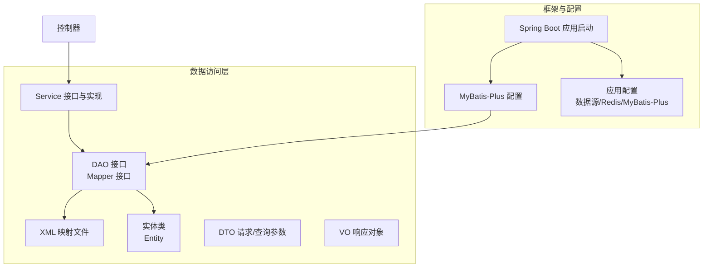
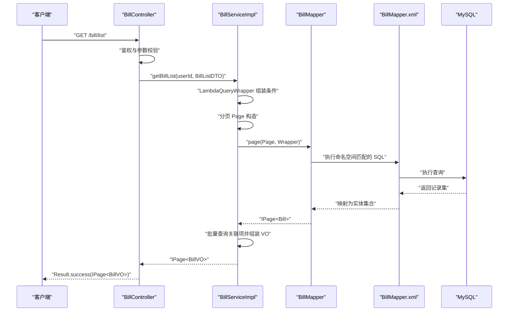
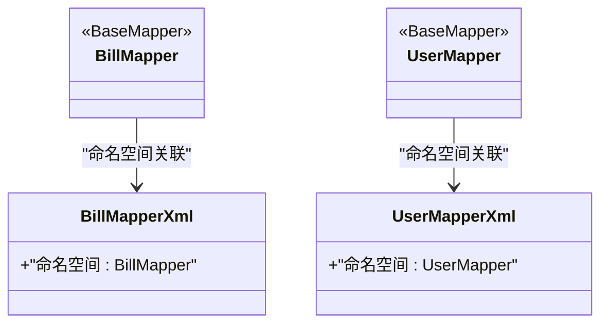
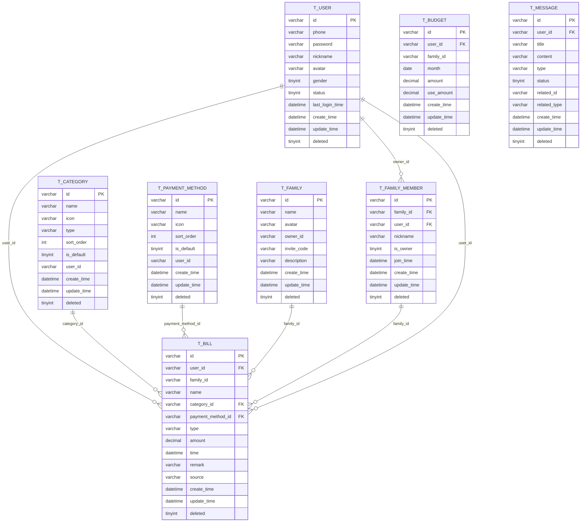
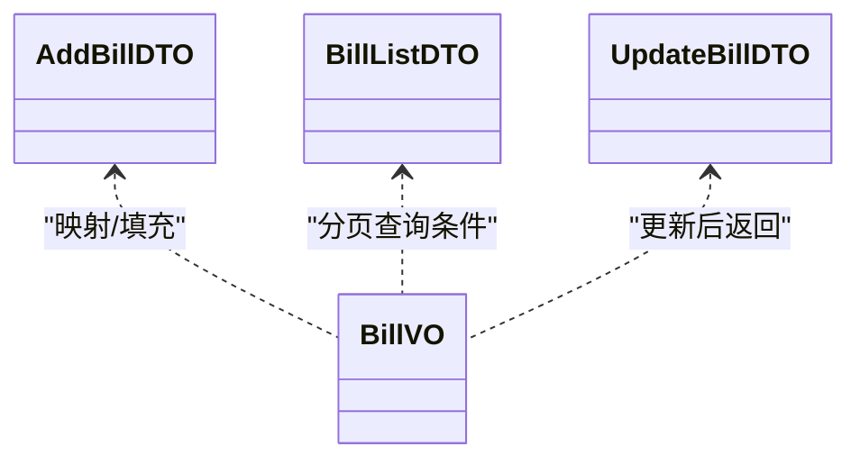
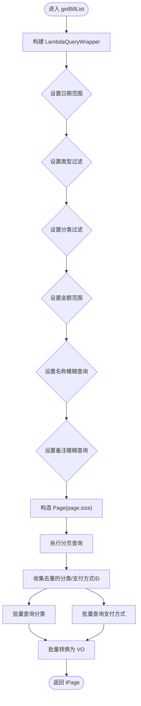
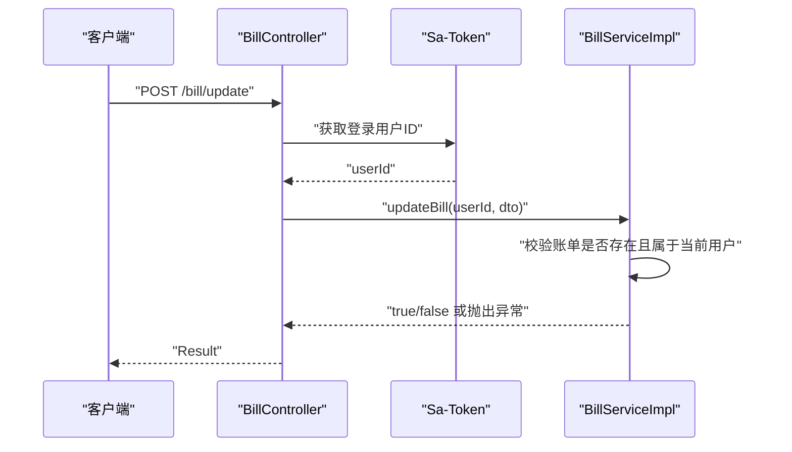
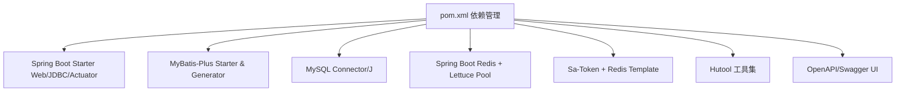

# 数据访问层设计

<cite>
**本文引用的文件**
- [ChuanBillServerApplication.java](file://chuan-bill-server/src/main/java/com/samoy/chuanbillserver/ChuanBillServerApplication.java)
- [MybatisPlusConfig.java](file://chuan-bill-server/src/main/java/com/samoy/chuanbillserver/config/MybatisPlusConfig.java)
- [application.yaml](file://chuan-bill-server/src/main/resources/application.yaml)
- [pom.xml](file://chuan-bill-server/pom.xml)
- [BillMapper.java](file://chuan-bill-server/src/main/java/com/samoy/chuanbillserver/dao/BillMapper.java)
- [UserMapper.java](file://chuan-bill-server/src/main/java/com/samoy/chuanbillserver/dao/UserMapper.java)
- [Bill.java](file://chuan-bill-server/src/main/java/com/samoy/chuanbillserver/entity/Bill.java)
- [User.java](file://chuan-bill-server/src/main/java/com/samoy/chuanbillserver/entity/User.java)
- [BillMapper.xml](file://chuan-bill-server/src/main/resources/mapper/BillMapper.xml)
- [UserMapper.xml](file://chuan-bill-server/src/main/resources/mapper/UserMapper.xml)
- [AddBillDTO.java](file://chuan-bill-server/src/main/java/com/samoy/chuanbillserver/dto/AddBillDTO.java)
- [BillListDTO.java](file://chuan-bill-server/src/main/java/com/samoy/chuanbillserver/dto/BillListDTO.java)
- [UpdateBillDTO.java](file://chuan-bill-server/src/main/java/com/samoy/chuanbillserver/dto/UpdateBillDTO.java)
- [BillVO.java](file://chuan-bill-server/src/main/java/com/samoy/chuanbillserver/vo/BillVO.java)
- [IBillService.java](file://chuan-bill-server/src/main/java/com/samoy/chuanbillserver/service/IBillService.java)
- [BillServiceImpl.java](file://chuan-bill-server/src/main/java/com/samoy/chuanbillserver/service/impl/BillServiceImpl.java)
- [BillController.java](file://chuan-bill-server/src/main/java/com/samoy/chuanbillserver/controller/BillController.java)
- [init.sql](file://chuan-bill-server/init.sql)
</cite>

## 目录
1. [简介](#简介)
2. [项目结构](#项目结构)
3. [核心组件](#核心组件)
4. [架构总览](#架构总览)
5. [详细组件分析](#详细组件分析)
6. [依赖分析](#依赖分析)
7. [性能考虑](#性能考虑)
8. [故障排查指南](#故障排查指南)
9. [结论](#结论)
10. [附录](#附录)

## 简介
本文件面向数据访问层设计，围绕 MyBatis-Plus 的数据访问架构进行系统化技术文档编制。重点覆盖以下方面：
- Mapper 接口与 XML 映射文件的设计与职责
- Entity 实体类映射与字段约束
- DAO 层接口设计、Service 层封装、DTO/VO 数据对象的职责划分
- CRUD 封装、条件构造器使用、分页查询实现、批量操作优化
- 数据库连接池配置、SQL 性能优化与索引设计策略
- 数据访问层单元测试、Mock 数据准备与数据库迁移管理方法

## 项目结构
后端采用 Spring Boot + MyBatis-Plus 架构，数据访问层位于 chuan-bill-server 模块，主要目录与职责如下：
- config：MyBatis-Plus 分页插件配置
- dao：Mapper 接口（继承 BaseMapper）
- entity：实体类（标注表名与字段映射）
- resources/mapper：XML 映射文件（命名空间与接口一致）
- dto：请求/查询参数 DTO
- vo：响应 VO 对象
- service：IService 接口与 ServiceImpl 实现
- controller：REST 控制器，调用 Service 并返回 Result 包装结果

图表来源
- [ChuanBillServerApplication.java:1-15](file://chuan-bill-server/src/main/java/com/samoy/chuanbillserver/ChuanBillServerApplication.java#L1-L15)
- [MybatisPlusConfig.java:1-18](file://chuan-bill-server/src/main/java/com/samoy/chuanbillserver/config/MybatisPlusConfig.java#L1-L18)
- [application.yaml:1-51](file://chuan-bill-server/src/main/resources/application.yaml#L1-L51)

章节来源
- [ChuanBillServerApplication.java:1-15](file://chuan-bill-server/src/main/java/com/samoy/chuanbillserver/ChuanBillServerApplication.java#L1-L15)
- [MybatisPlusConfig.java:1-18](file://chuan-bill-server/src/main/java/com/samoy/chuanbillserver/config/MybatisPlusConfig.java#L1-L18)
- [application.yaml:1-51](file://chuan-bill-server/src/main/resources/application.yaml#L1-L51)

## 核心组件
- Mapper 接口：继承 BaseMapper<T>，自动获得通用 CRUD 能力；如需自定义 SQL，在 XML 中编写并由同名命名空间关联。
- 实体类：通过注解声明表名与字段映射，包含逻辑删除字段。
- Service 接口与实现：扩展 IService<T>，在实现类中组合业务逻辑、条件构造器、分页与批量优化。
- DTO/VO：DTO 用于请求参数校验与传输，VO 用于对外响应，避免暴露实体细节。
- 控制器：接收请求，鉴权（Sa-Token），调用 Service，并统一返回 Result 包装。

章节来源
- [BillMapper.java:1-15](file://chuan-bill-server/src/main/java/com/samoy/chuanbillserver/dao/BillMapper.java#L1-L15)
- [Bill.java:1-113](file://chuan-bill-server/src/main/java/com/samoy/chuanbillserver/entity/Bill.java#L1-L113)
- [IBillService.java:1-66](file://chuan-bill-server/src/main/java/com/samoy/chuanbillserver/service/IBillService.java#L1-L66)
- [BillServiceImpl.java:1-244](file://chuan-bill-server/src/main/java/com/samoy/chuanbillserver/service/impl/BillServiceImpl.java#L1-L244)
- [AddBillDTO.java:1-44](file://chuan-bill-server/src/main/java/com/samoy/chuanbillserver/dto/AddBillDTO.java#L1-L44)
- [BillListDTO.java:1-42](file://chuan-bill-server/src/main/java/com/samoy/chuanbillserver/dto/BillListDTO.java#L1-L42)
- [UpdateBillDTO.java:1-39](file://chuan-bill-server/src/main/java/com/samoy/chuanbillserver/dto/UpdateBillDTO.java#L1-L39)
- [BillVO.java:1-44](file://chuan-bill-server/src/main/java/com/samoy/chuanbillserver/vo/BillVO.java#L1-L44)
- [BillController.java:1-91](file://chuan-bill-server/src/main/java/com/samoy/chuanbillserver/controller/BillController.java#L1-L91)

## 架构总览
下图展示从前端到数据库的数据流路径，以及 MyBatis-Plus 在其中的角色。

图表来源
- [BillController.java:1-91](file://chuan-bill-server/src/main/java/com/samoy/chuanbillserver/controller/BillController.java#L1-L91)
- [BillServiceImpl.java:1-244](file://chuan-bill-server/src/main/java/com/samoy/chuanbillserver/service/impl/BillServiceImpl.java#L1-L244)
- [BillMapper.java:1-15](file://chuan-bill-server/src/main/java/com/samoy/chuanbillserver/dao/BillMapper.java#L1-L15)
- [BillMapper.xml:1-6](file://chuan-bill-server/src/main/resources/mapper/BillMapper.xml#L1-L6)

## 详细组件分析

### Mapper 接口与 XML 映射
- BillMapper 继承 BaseMapper<Bill>，自动具备基本 CRUD 能力；自定义 SQL 通过 BillMapper.xml 命名空间关联。
- UserMapper 同理，用于用户相关操作。
- XML 文件目前为空，表明使用 MyBatis-Plus 的通用 SQL 生成能力，必要时可在 XML 中补充复杂查询或批量操作。

图表来源
- [BillMapper.java:1-15](file://chuan-bill-server/src/main/java/com/samoy/chuanbillserver/dao/BillMapper.java#L1-L15)
- [UserMapper.java:1-15](file://chuan-bill-server/src/main/java/com/samoy/chuanbillserver/dao/UserMapper.java#L1-L15)
- [BillMapper.xml:1-6](file://chuan-bill-server/src/main/resources/mapper/BillMapper.xml#L1-L6)
- [UserMapper.xml:1-6](file://chuan-bill-server/src/main/resources/mapper/UserMapper.xml#L1-L6)

章节来源
- [BillMapper.java:1-15](file://chuan-bill-server/src/main/java/com/samoy/chuanbillserver/dao/BillMapper.java#L1-L15)
- [UserMapper.java:1-15](file://chuan-bill-server/src/main/java/com/samoy/chuanbillserver/dao/UserMapper.java#L1-L15)
- [BillMapper.xml:1-6](file://chuan-bill-server/src/main/resources/mapper/BillMapper.xml#L1-L6)
- [UserMapper.xml:1-6](file://chuan-bill-server/src/main/resources/mapper/UserMapper.xml#L1-L6)

### 实体类设计与字段映射
- Bill 实体映射 t_bill 表，包含用户、家庭、类目、支付方式外键字段，金额与时间字段，以及逻辑删除字段。
- User 实体映射 t_user 表，包含用户基本信息与状态字段。
- 注解使用：@TableName、@TableId、@TableField 等，确保字段与数据库一致。

图表来源
- [Bill.java:1-113](file://chuan-bill-server/src/main/java/com/samoy/chuanbillserver/entity/Bill.java#L1-L113)
- [User.java:1-94](file://chuan-bill-server/src/main/java/com/samoy/chuanbillserver/entity/User.java#L1-L94)
- [init.sql:1-326](file://chuan-bill-server/init.sql#L1-L326)

章节来源
- [Bill.java:1-113](file://chuan-bill-server/src/main/java/com/samoy/chuanbillserver/entity/Bill.java#L1-L113)
- [User.java:1-94](file://chuan-bill-server/src/main/java/com/samoy/chuanbillserver/entity/User.java#L1-L94)
- [init.sql:1-326](file://chuan-bill-server/init.sql#L1-L326)

### DTO/VO 职责划分
- DTO：AddBillDTO、BillListDTO、UpdateBillDTO 用于请求参数校验与传输，包含字段长度、数值范围、正则表达式等约束。
- VO：BillVO 用于对外响应，包含账单基础信息及关联的分类、支付方式信息，便于前端展示。

图表来源
- [AddBillDTO.java:1-44](file://chuan-bill-server/src/main/java/com/samoy/chuanbillserver/dto/AddBillDTO.java#L1-L44)
- [BillListDTO.java:1-42](file://chuan-bill-server/src/main/java/com/samoy/chuanbillserver/dto/BillListDTO.java#L1-L42)
- [UpdateBillDTO.java:1-39](file://chuan-bill-server/src/main/java/com/samoy/chuanbillserver/dto/UpdateBillDTO.java#L1-L39)
- [BillVO.java:1-44](file://chuan-bill-server/src/main/java/com/samoy/chuanbillserver/vo/BillVO.java#L1-L44)

章节来源
- [AddBillDTO.java:1-44](file://chuan-bill-server/src/main/java/com/samoy/chuanbillserver/dto/AddBillDTO.java#L1-L44)
- [BillListDTO.java:1-42](file://chuan-bill-server/src/main/java/com/samoy/chuanbillserver/dto/BillListDTO.java#L1-L42)
- [UpdateBillDTO.java:1-39](file://chuan-bill-server/src/main/java/com/samoy/chuanbillserver/dto/UpdateBillDTO.java#L1-L39)
- [BillVO.java:1-44](file://chuan-bill-server/src/main/java/com/samoy/chuanbillserver/vo/BillVO.java#L1-L44)

### CRUD 封装与条件构造器
- 条件构造器：Service 实现中使用 LambdaQueryWrapper 动态拼接查询条件（日期范围、类型、金额范围、名称/备注模糊查询等）。
- 分页查询：使用 Page 与 MyBatis-Plus 分页插件，返回 IPage 结果。
- 批量优化：列表查询时先收集去重后的关联 ID，再一次性批量查询关联项，避免 N+1 查询。

图表来源
- [BillServiceImpl.java:50-123](file://chuan-bill-server/src/main/java/com/samoy/chuanbillserver/service/impl/BillServiceImpl.java#L50-L123)

章节来源
- [BillServiceImpl.java:50-123](file://chuan-bill-server/src/main/java/com/samoy/chuanbillserver/service/impl/BillServiceImpl.java#L50-L123)

### 权限控制与安全
- 控制器使用 Sa-Token 进行鉴权，获取当前登录用户 ID，并在 Service 层进行权限校验（仅允许操作本人数据）。
- 对不存在或无权限的数据访问抛出业务异常，保证数据安全。

图表来源
- [BillController.java:1-91](file://chuan-bill-server/src/main/java/com/samoy/chuanbillserver/controller/BillController.java#L1-L91)
- [BillServiceImpl.java:144-173](file://chuan-bill-server/src/main/java/com/samoy/chuanbillserver/service/impl/BillServiceImpl.java#L144-L173)

章节来源
- [BillController.java:1-91](file://chuan-bill-server/src/main/java/com/samoy/chuanbillserver/controller/BillController.java#L1-L91)
- [BillServiceImpl.java:144-173](file://chuan-bill-server/src/main/java/com/samoy/chuanbillserver/service/impl/BillServiceImpl.java#L144-L173)

### 数据库连接池与 MyBatis-Plus 配置
- 数据源：MySQL 驱动与 JDBC Starter，默认连接池由 Spring Boot 自动配置。
- Redis：使用 Spring Boot Starter Data Redis，配合 Apache Commons Pool2 提供连接池。
- MyBatis-Plus：全局逻辑删除字段、日志输出；分页插件配置为 PaginationInnerInterceptor，适配 MySQL。

章节来源
- [application.yaml:1-51](file://chuan-bill-server/src/main/resources/application.yaml#L1-L51)
- [MybatisPlusConfig.java:1-18](file://chuan-bill-server/src/main/java/com/samoy/chuanbillserver/config/MybatisPlusConfig.java#L1-L18)
- [pom.xml:97-113](file://chuan-bill-server/pom.xml#L97-L113)

### 索引设计策略
- 账单表 t_bill：对 user_id、family_id、category_id、payment_method_id、type、time、create_time 等建立索引，支撑高频查询与排序。
- 用户表 t_user：对 phone、status、create_time 建立索引，满足登录与状态查询。
- 类目与支付方式表：对 user_id、sort_order 等建立索引，提升个性化排序与筛选效率。
- 建议：根据实际查询模式持续评估与调整索引，避免冗余索引影响写入性能。

章节来源
- [init.sql:133-158](file://chuan-bill-server/init.sql#L133-L158)
- [init.sql:15-31](file://chuan-bill-server/init.sql#L15-L31)
- [init.sql:36-51](file://chuan-bill-server/init.sql#L36-L51)
- [init.sql:56-69](file://chuan-bill-server/init.sql#L56-L69)

## 依赖分析
- Spring Boot 与 MyBatis-Plus：通过 starter 与 BOM 管理版本，提供自动配置与增强功能。
- Sa-Token：提供鉴权与会话管理，集成 RedisTemplate。
- Hutool：提供常用工具方法，如 Bean 复制等。
- OpenAPI/Swagger：生成接口文档，便于前后端协作。
- 依赖注入：通过 @Resource 注入 Service 与 Mapper，保持松耦合。

图表来源
- [pom.xml:51-168](file://chuan-bill-server/pom.xml#L51-L168)

章节来源
- [pom.xml:51-168](file://chuan-bill-server/pom.xml#L51-L168)

## 性能考虑
- 分页查询：使用 MyBatis-Plus 分页插件，避免一次性加载全量数据。
- 条件构造器：按需拼接查询条件，减少不必要的过滤与排序。
- 批量查询：列表场景先收集 ID 再批量查询关联项，降低数据库往返次数。
- 索引优化：为高频查询字段建立合适索引，避免全表扫描。
- SQL 日志：开发环境开启日志输出，便于定位慢查询。
- 连接池：合理配置 Redis 连接池参数，避免阻塞与超时。

## 故障排查指南
- 逻辑删除：确认逻辑删除字段与值配置正确，避免误删。
- 权限异常：检查 Sa-Token 鉴权与 Service 层权限校验逻辑。
- 参数校验：关注 DTO 的校验注解，确保前端传参符合要求。
- SQL 日志：开启 MyBatis-Plus 日志输出，查看生成 SQL 与参数。
- 数据一致性：批量操作建议使用事务，保证原子性。

章节来源
- [application.yaml:32-40](file://chuan-bill-server/src/main/resources/application.yaml#L32-L40)
- [BillServiceImpl.java:144-173](file://chuan-bill-server/src/main/java/com/samoy/chuanbillserver/service/impl/BillServiceImpl.java#L144-L173)

## 结论
本数据访问层以 MyBatis-Plus 为核心，结合 Spring Boot 自动配置与 Sa-Token 鉴权，实现了清晰的分层与职责划分。通过条件构造器、分页插件与批量查询优化，兼顾了查询性能与可维护性。配合完善的索引设计与日志配置，能够有效支撑业务发展与性能优化需求。

## 附录

### 数据访问层单元测试与 Mock
- 单元测试：针对 Service 方法进行单元测试，使用 Mockito 模拟 Mapper 与外部依赖，验证条件构造器、分页与批量查询逻辑。
- Mock 数据：使用 Hutool 或自定义生成器准备测试数据，覆盖边界条件与异常场景。
- 测试要点：权限校验、参数校验、空值处理、批量查询去重与映射。

### 数据库迁移管理
- 初始化脚本：init.sql 提供完整建表与系统预设数据，便于快速初始化。
- 迁移策略：建议引入 Flyway/Liquibase 管理版本化迁移，保留变更历史与回滚能力。
- 环境隔离：不同环境使用独立的 application.yaml 配置，确保数据源与 Redis 连接正确。

章节来源
- [init.sql:1-326](file://chuan-bill-server/init.sql#L1-L326)
- [application.yaml:1-51](file://chuan-bill-server/src/main/resources/application.yaml#L1-L51)