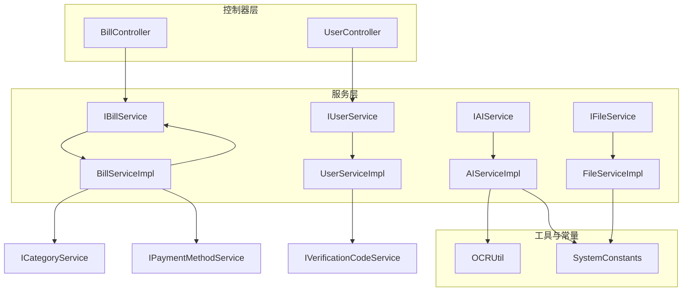
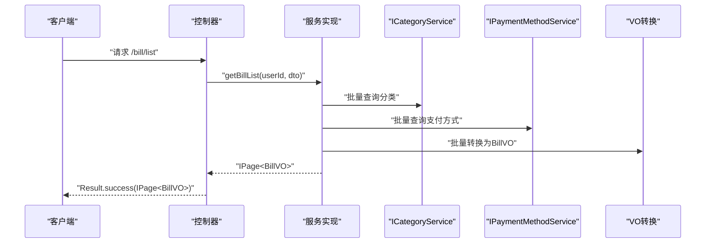
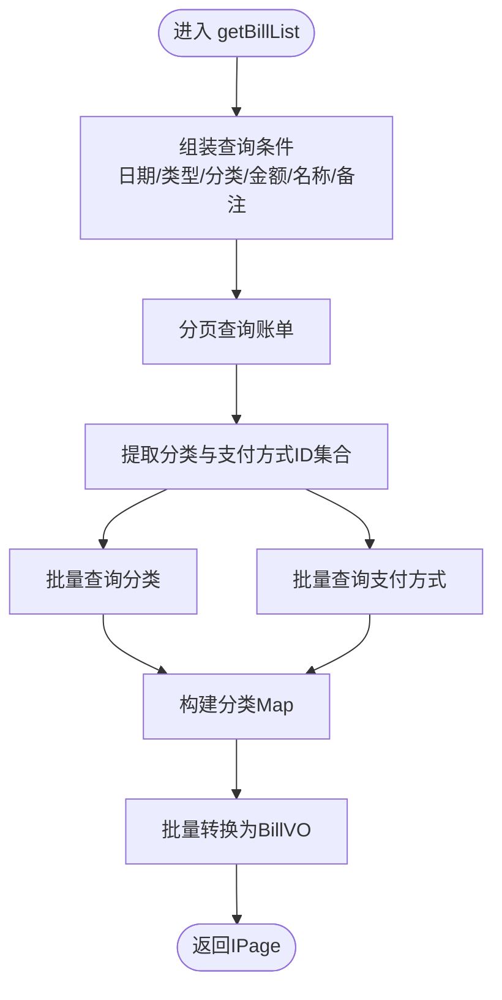
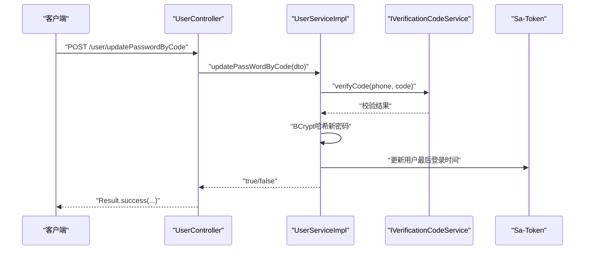
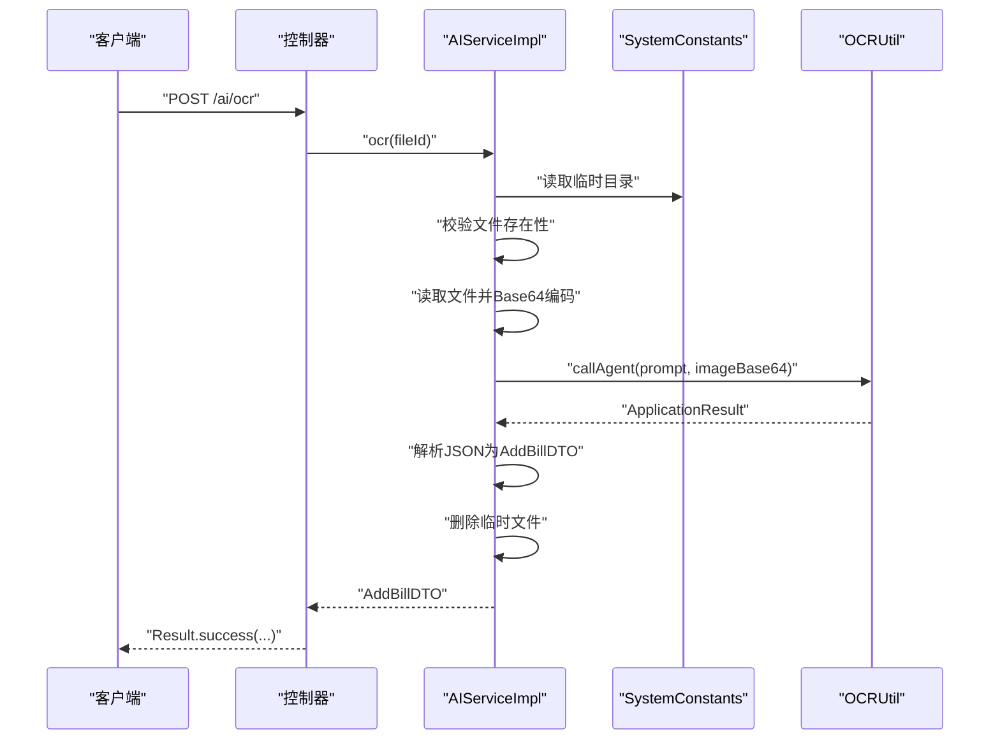
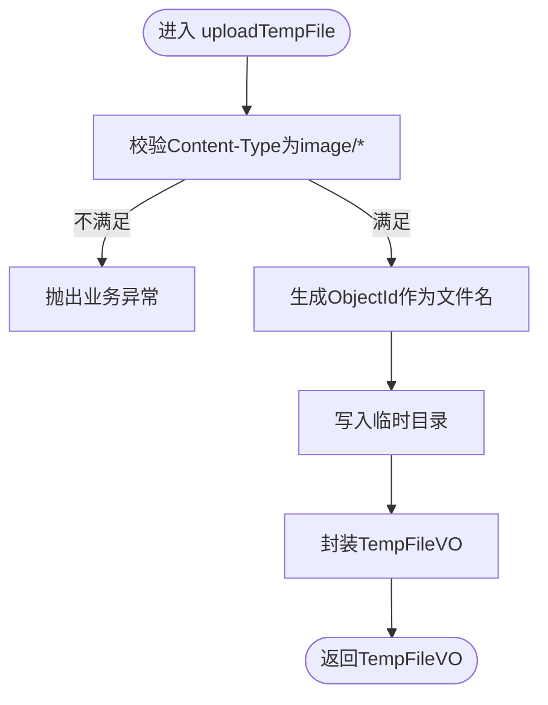
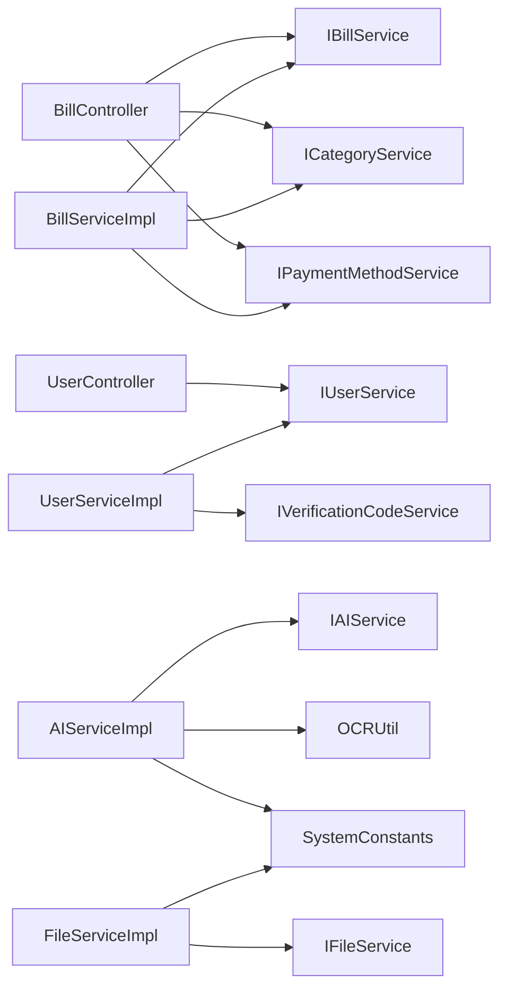

# 服务层实现

<cite>
**本文引用的文件**
- [BillServiceImpl.java](file://chuan-bill-server/src/main/java/com/samoy/chuanbillserver/service/impl/BillServiceImpl.java)
- [UserServiceImpl.java](file://chuan-bill-server/src/main/java/com/samoy/chuanbillserver/service/impl/UserServiceImpl.java)
- [AIServiceImpl.java](file://chuan-bill-server/src/main/java/com/samoy/chuanbillserver/service/impl/AIServiceImpl.java)
- [FileServiceImpl.java](file://chuan-bill-server/src/main/java/com/samoy/chuanbillserver/service/impl/FileServiceImpl.java)
- [IBillService.java](file://chuan-bill-server/src/main/java/com/samoy/chuanbillserver/service/IBillService.java)
- [IUserService.java](file://chuan-bill-server/src/main/java/com/samoy/chuanbillserver/service/IUserService.java)
- [IAIService.java](file://chuan-bill-server/src/main/java/com/samoy/chuanbillserver/service/IAIService.java)
- [IFileService.java](file://chuan-bill-server/src/main/java/com/samoy/chuanbillserver/service/IFileService.java)
- [ICategoryService.java](file://chuan-bill-server/src/main/java/com/samoy/chuanbillserver/service/ICategoryService.java)
- [IPaymentMethodService.java](file://chuan-bill-server/src/main/java/com/samoy/chuanbillserver/service/IPaymentMethodService.java)
- [IVerificationCodeService.java](file://chuan-bill-server/src/main/java/com/samoy/chuanbillserver/service/IVerificationCodeService.java)
- [SystemConstants.java](file://chuan-bill-server/src/main/java/com/samoy/chuanbillserver/constant/SystemConstants.java)
- [OCRUtil.java](file://chuan-bill-server/src/main/java/com/samoy/chuanbillserver/utils/OCRUtil.java)
- [Bill.java](file://chuan-bill-server/src/main/java/com/samoy/chuanbillserver/entity/Bill.java)
- [BillController.java](file://chuan-bill-server/src/main/java/com/samoy/chuanbillserver/controller/BillController.java)
- [UserController.java](file://chuan-bill-server/src/main/java/com/samoy/chuanbillserver/controller/UserController.java)
- [GlobalExceptionHandler.java](file://chuan-bill-server/src/main/java/com/samoy/chuanbillserver/expection/GlobalExceptionHandler.java)
- [Result.java](file://chuan-bill-server/src/main/java/com/samoy/chuanbillserver/result/Result.java)
</cite>

## 目录
1. [引言](#引言)
2. [项目结构](#项目结构)
3. [核心组件](#核心组件)
4. [架构总览](#架构总览)
5. [详细组件分析](#详细组件分析)
6. [依赖分析](#依赖分析)
7. [性能考虑](#性能考虑)
8. [故障排查指南](#故障排查指南)
9. [结论](#结论)
10. [附录](#附录)

## 引言
本文件聚焦于服务层实现，系统性梳理接口与实现的分层设计、核心业务服务的职责边界与处理流程，并对事务管理、异常处理、数据校验、业务规则、服务间依赖与调用链路、性能优化策略进行深入解析。同时给出单元测试与集成测试的编写建议及Mock对象使用要点。

## 项目结构
服务层位于后端工程 chuan-bill-server 的 service 包中，采用“接口 + 实现”的分层模式：
- 接口层：以 I 开头的服务接口，定义对外能力契约，如 IBillService、IUserService、IAIService、IFileService 等。
- 实现层：在 impl 包下提供具体实现，如 BillServiceImpl、UserServiceImpl、AIServiceImpl、FileServiceImpl。
- 控制器层：Controller 通过注入服务接口完成业务编排，统一返回 Result 包装体。
- 常量与工具：SystemConstants 提供系统级常量；OCRUtil 封装 DashScope 调用；全局异常处理器统一拦截业务异常与未登录异常。

图表来源
- [BillController.java:26-36](file://chuan-bill-server/src/main/java/com/samoy/chuanbillserver/controller/BillController.java#L26-L36)
- [UserController.java:22-23](file://chuan-bill-server/src/main/java/com/samoy/chuanbillserver/controller/UserController.java#L22-L23)
- [IBillService.java:19-65](file://chuan-bill-server/src/main/java/com/samoy/chuanbillserver/service/IBillService.java#L19-L65)
- [IUserService.java:17-74](file://chuan-bill-server/src/main/java/com/samoy/chuanbillserver/service/IUserService.java#L17-L74)
- [IAIService.java:5-13](file://chuan-bill-server/src/main/java/com/samoy/chuanbillserver/service/IAIService.java#L5-L13)
- [IFileService.java:6-15](file://chuan-bill-server/src/main/java/com/samoy/chuanbillserver/service/IFileService.java#L6-L15)
- [BillServiceImpl.java:42-48](file://chuan-bill-server/src/main/java/com/samoy/chuanbillserver/service/impl/BillServiceImpl.java#L42-L48)
- [UserServiceImpl.java:35-38](file://chuan-bill-server/src/main/java/com/samoy/chuanbillserver/service/impl/UserServiceImpl.java#L35-L38)
- [AIServiceImpl.java:22-25](file://chuan-bill-server/src/main/java/com/samoy/chuanbillserver/service/impl/AIServiceImpl.java#L22-L25)
- [FileServiceImpl.java:18-14](file://chuan-bill-server/src/main/java/com/samoy/chuanbillserver/service/impl/FileServiceImpl.java#L18-L14)
- [SystemConstants.java:3-34](file://chuan-bill-server/src/main/java/com/samoy/chuanbillserver/constant/SystemConstants.java#L3-L34)
- [OCRUtil.java:13-36](file://chuan-bill-server/src/main/java/com/samoy/chuanbillserver/utils/OCRUtil.java#L13-L36)

章节来源
- [BillController.java:26-36](file://chuan-bill-server/src/main/java/com/samoy/chuanbillserver/controller/BillController.java#L26-L36)
- [UserController.java:22-23](file://chuan-bill-server/src/main/java/com/samoy/chuanbillserver/controller/UserController.java#L22-L23)
- [IBillService.java:19-65](file://chuan-bill-server/src/main/java/com/samoy/chuanbillserver/service/IBillService.java#L19-L65)
- [IUserService.java:17-74](file://chuan-bill-server/src/main/java/com/samoy/chuanbillserver/service/IUserService.java#L17-L74)
- [IAIService.java:5-13](file://chuan-bill-server/src/main/java/com/samoy/chuanbillserver/service/IAIService.java#L5-L13)
- [IFileService.java:6-15](file://chuan-bill-server/src/main/java/com/samoy/chuanbillserver/service/IFileService.java#L6-L15)

## 核心组件
本节对四大核心服务（账单、用户、AI、文件）进行职责与关键流程解析。

- 账单服务 IBillService/ BillServiceImpl
  - 职责：账单的增删改查、列表分页与多维筛选、详情查询、与分类与支付方式的关联查询。
  - 关键点：权限校验（仅本人可见/可操作）、批量预加载避免 N+1 查询、VO 转换与字段映射。
- 用户服务 IUserService/ UserServiceImpl
  - 职责：密码登录、验证码登录、密码修改（旧密码/验证码）、用户资料更新、获取用户资料、是否设置密码检测。
  - 关键点：手机号脱敏展示、登录态生成与更新、验证码校验。
- AI 服务 IAIService/ AIServiceImpl
  - 职责：基于 OCR 的账单识别，将图片转为 AddBillDTO。
  - 关键点：临时文件存在性校验、Base64 编码、DashScope 调用封装、识别成功后清理临时文件。
- 文件服务 IFileService/ FileServiceImpl
  - 职责：临时文件上传（限制图片类型），返回临时文件标识与大小。
  - 关键点：文件类型校验、临时目录路径、IO 异常处理。

章节来源
- [IBillService.java:19-65](file://chuan-bill-server/src/main/java/com/samoy/chuanbillserver/service/IBillService.java#L19-L65)
- [BillServiceImpl.java:42-123](file://chuan-bill-server/src/main/java/com/samoy/chuanbillserver/service/impl/BillServiceImpl.java#L42-L123)
- [IUserService.java:17-74](file://chuan-bill-server/src/main/java/com/samoy/chuanbillserver/service/IUserService.java#L17-L74)
- [UserServiceImpl.java:35-191](file://chuan-bill-server/src/main/java/com/samoy/chuanbillserver/service/impl/UserServiceImpl.java#L35-L191)
- [IAIService.java:5-13](file://chuan-bill-server/src/main/java/com/samoy/chuanbillserver/service/IAIService.java#L5-L13)
- [AIServiceImpl.java:22-51](file://chuan-bill-server/src/main/java/com/samoy/chuanbillserver/service/impl/AIServiceImpl.java#L22-L51)
- [IFileService.java:6-15](file://chuan-bill-server/src/main/java/com/samoy/chuanbillserver/service/IFileService.java#L6-L15)
- [FileServiceImpl.java:18-42](file://chuan-bill-server/src/main/java/com/samoy/chuanbillserver/service/impl/FileServiceImpl.java#L18-L42)

## 架构总览
服务层围绕“接口 + 实现 + 控制器 + 工具/常量 + 异常处理”构建，控制器通过注入服务接口完成业务编排，服务实现内部协调领域模型与外部依赖（如分类、支付方式、验证码、OCR 等），最终统一由 Result 包裹返回。

图表来源
- [BillController.java:37-42](file://chuan-bill-server/src/main/java/com/samoy/chuanbillserver/controller/BillController.java#L37-L42)
- [BillServiceImpl.java:50-123](file://chuan-bill-server/src/main/java/com/samoy/chuanbillserver/service/impl/BillServiceImpl.java#L50-L123)
- [ICategoryService.java:16-24](file://chuan-bill-server/src/main/java/com/samoy/chuanbillserver/service/ICategoryService.java#L16-L24)
- [IPaymentMethodService.java:16-24](file://chuan-bill-server/src/main/java/com/samoy/chuanbillserver/service/IPaymentMethodService.java#L16-L24)

## 详细组件分析

### 账单服务（IBillService/ BillServiceImpl）
- 职责与边界
  - 列表分页与多维筛选：日期范围、类型、分类、金额范围、名称/备注模糊匹配。
  - 权限控制：查询详情/更新/删除均校验账单归属用户。
  - 关联查询：批量加载分类与支付方式，避免 N+1。
  - 数据转换：将实体映射为 VO，包含分类与支付方式的简要信息。
- 关键流程（列表分页）
  - 组装查询条件与排序。
  - 分页查询账单主表。
  - 提取分类与支付方式 ID，批量查询并缓存到 Map。
  - 转换为 VO 并返回分页结果。
- 关键流程（详情查询）
  - 单条查询并校验归属。
  - 按需加载分类与支付方式，转换为 VO。
- 性能优化
  - 批量查询分类与支付方式，使用 Map 缓存减少重复查询。
  - 分页查询避免一次性加载全量数据。
- 事务与异常
  - 增删改基于 MyBatis-Plus ServiceImpl，默认在单次操作内具备事务语义。
  - 业务异常通过 BusinessException 抛出，由全局异常处理器统一返回。

图表来源
- [BillServiceImpl.java:50-123](file://chuan-bill-server/src/main/java/com/samoy/chuanbillserver/service/impl/BillServiceImpl.java#L50-L123)

章节来源
- [IBillService.java:19-65](file://chuan-bill-server/src/main/java/com/samoy/chuanbillserver/service/IBillService.java#L19-L65)
- [BillServiceImpl.java:42-242](file://chuan-bill-server/src/main/java/com/samoy/chuanbillserver/service/impl/BillServiceImpl.java#L42-L242)
- [BillController.java:37-42](file://chuan-bill-server/src/main/java/com/samoy/chuanbillserver/controller/BillController.java#L37-L42)
- [Bill.java:24-112](file://chuan-bill-server/src/main/java/com/samoy/chuanbillserver/entity/Bill.java#L24-L112)

### 用户服务（IUserService/ UserServiceImpl）
- 职责与边界
  - 登录：密码登录（校验手机号与密码）、验证码登录（校验验证码并按需创建用户）。
  - 密码管理：旧密码校验后修改、验证码校验后修改。
  - 用户资料：昵称、头像、性别更新；按 ID 获取资料并脱敏手机号。
  - 状态查询：判断用户是否设置密码。
- 关键流程（验证码登录）
  - 验证码校验通过后，若用户不存在则自动创建并初始化昵称。
  - 生成登录态并返回 TokenVO。
- 关键流程（密码修改 by 旧密码）
  - 校验旧密码正确性，成功后对新密码进行哈希存储。
- 关键流程（密码修改 by 验证码）
  - 校验验证码后对新密码进行哈希存储。
- 安全与合规
  - 密码使用 BCrypt 哈希存储。
  - 手机号在 VO 层进行中间部分脱敏展示。
- 事务与异常
  - 登录态生成与更新在单次操作内具备事务语义。
  - 业务异常统一抛出 BusinessException，由全局异常处理器返回。

图表来源
- [UserController.java:48-53](file://chuan-bill-server/src/main/java/com/samoy/chuanbillserver/controller/UserController.java#L48-L53)
- [UserServiceImpl.java:108-125](file://chuan-bill-server/src/main/java/com/samoy/chuanbillserver/service/impl/UserServiceImpl.java#L108-L125)
- [IVerificationCodeService.java:3-8](file://chuan-bill-server/src/main/java/com/samoy/chuanbillserver/service/IVerificationCodeService.java#L3-L8)

章节来源
- [IUserService.java:17-74](file://chuan-bill-server/src/main/java/com/samoy/chuanbillserver/service/IUserService.java#L17-L74)
- [UserServiceImpl.java:35-191](file://chuan-bill-server/src/main/java/com/samoy/chuanbillserver/service/impl/UserServiceImpl.java#L35-L191)
- [UserController.java:25-60](file://chuan-bill-server/src/main/java/com/samoy/chuanbillserver/controller/UserController.java#L25-L60)

### AI 服务（IAIService/ AIServiceImpl）
- 职责与边界
  - 通过文件 ID 获取临时文件，读取并编码为 base64，调用 DashScope OCR Agent 进行识别，解析输出为 AddBillDTO，并在成功后删除临时文件。
- 关键流程（OCR 识别）
  - 校验临时文件存在性。
  - 读取文件内容并构造 data URI。
  - 调用 OCRUtil.callAgent 执行识别。
  - 解析 JSON 输出为 AddBillDTO。
  - 成功后删除临时文件。
- 错误处理
  - 缺少 API Key 或输入为空时，抛出业务异常。
  - 文件不存在时，抛出业务异常。
- 依赖与配置
  - OCRUtil 依赖 dashscope.apiKey 与 dashscope.ocr.appId。
  - 临时文件目录来自 SystemConstants.TEMP_FILE_UPLOAD_DIR。

图表来源
- [AIServiceImpl.java:27-50](file://chuan-bill-server/src/main/java/com/samoy/chuanbillserver/service/impl/AIServiceImpl.java#L27-L50)
- [OCRUtil.java:22-35](file://chuan-bill-server/src/main/java/com/samoy/chuanbillserver/utils/OCRUtil.java#L22-L35)
- [SystemConstants.java:31-33](file://chuan-bill-server/src/main/java/com/samoy/chuanbillserver/constant/SystemConstants.java#L31-L33)

章节来源
- [IAIService.java:5-13](file://chuan-bill-server/src/main/java/com/samoy/chuanbillserver/service/IAIService.java#L5-L13)
- [AIServiceImpl.java:22-51](file://chuan-bill-server/src/main/java/com/samoy/chuanbillserver/service/impl/AIServiceImpl.java#L22-L51)
- [OCRUtil.java:13-36](file://chuan-bill-server/src/main/java/com/samoy/chuanbillserver/utils/OCRUtil.java#L13-L36)
- [SystemConstants.java:31-33](file://chuan-bill-server/src/main/java/com/samoy/chuanbillserver/constant/SystemConstants.java#L31-L33)

### 文件服务（IFileService/ FileServiceImpl）
- 职责与边界
  - 上传临时图片文件，校验文件类型为 image/*，生成唯一文件 ID 并保存至临时目录，返回临时文件信息。
- 关键流程（临时文件上传）
  - 校验 Content-Type 以确保为图片。
  - 生成 ObjectId 作为文件名并保留原扩展名。
  - 写入临时目录，封装 TempFileVO 返回。
- 错误处理
  - 非图片类型抛出业务异常。
  - IO 异常统一包装为业务异常。

图表来源
- [FileServiceImpl.java:20-41](file://chuan-bill-server/src/main/java/com/samoy/chuanbillserver/service/impl/FileServiceImpl.java#L20-L41)
- [SystemConstants.java:31-33](file://chuan-bill-server/src/main/java/com/samoy/chuanbillserver/constant/SystemConstants.java#L31-L33)

章节来源
- [IFileService.java:6-15](file://chuan-bill-server/src/main/java/com/samoy/chuanbillserver/service/IFileService.java#L6-L15)
- [FileServiceImpl.java:18-42](file://chuan-bill-server/src/main/java/com/samoy/chuanbillserver/service/impl/FileServiceImpl.java#L18-L42)
- [SystemConstants.java:31-33](file://chuan-bill-server/src/main/java/com/samoy/chuanbillserver/constant/SystemConstants.java#L31-L33)

## 依赖分析
- 服务间依赖
  - BillServiceImpl 依赖 ICategoryService 与 IPaymentMethodService，用于批量加载分类与支付方式，避免 N+1。
  - UserServiceImpl 依赖 IVerificationCodeService，用于验证码发送与校验。
  - AIServiceImpl 依赖 OCRUtil 与 SystemConstants，负责 OCR 能力与临时文件路径。
  - FileServiceImpl 依赖 SystemConstants，负责临时文件目录。
- 控制器依赖
  - BillController 注入 IBillService、ICategoryService、IPaymentMethodService。
  - UserController 注入 IUserService。
- 异常与返回
  - 全局异常处理器统一处理未登录与业务异常，控制器仅负责调用服务并返回 Result。

图表来源
- [BillController.java:28-35](file://chuan-bill-server/src/main/java/com/samoy/chuanbillserver/controller/BillController.java#L28-L35)
- [UserController.java:22-23](file://chuan-bill-server/src/main/java/com/samoy/chuanbillserver/controller/UserController.java#L22-L23)
- [BillServiceImpl.java:44-48](file://chuan-bill-server/src/main/java/com/samoy/chuanbillserver/service/impl/BillServiceImpl.java#L44-L48)
- [UserServiceImpl.java:37-38](file://chuan-bill-server/src/main/java/com/samoy/chuanbillserver/service/impl/UserServiceImpl.java#L37-L38)
- [AIServiceImpl.java:24-25](file://chuan-bill-server/src/main/java/com/samoy/chuanbillserver/service/impl/AIServiceImpl.java#L24-L25)
- [FileServiceImpl.java:18-14](file://chuan-bill-server/src/main/java/com/samoy/chuanbillserver/service/impl/FileServiceImpl.java#L18-L14)

章节来源
- [BillController.java:28-35](file://chuan-bill-server/src/main/java/com/samoy/chuanbillserver/controller/BillController.java#L28-L35)
- [UserController.java:22-23](file://chuan-bill-server/src/main/java/com/samoy/chuanbillserver/controller/UserController.java#L22-L23)
- [BillServiceImpl.java:44-48](file://chuan-bill-server/src/main/java/com/samoy/chuanbillserver/service/impl/BillServiceImpl.java#L44-L48)
- [UserServiceImpl.java:37-38](file://chuan-bill-server/src/main/java/com/samoy/chuanbillserver/service/impl/UserServiceImpl.java#L37-L38)
- [AIServiceImpl.java:24-25](file://chuan-bill-server/src/main/java/com/samoy/chuanbillserver/service/impl/AIServiceImpl.java#L24-L25)
- [FileServiceImpl.java:18-14](file://chuan-bill-server/src/main/java/com/samoy/chuanbillserver/service/impl/FileServiceImpl.java#L18-L14)

## 性能考虑
- 批量查询与缓存
  - 账单列表中对分类与支付方式进行批量查询并使用 Map 缓存，避免 N+1 查询，提升分页查询性能。
- 分页与排序
  - 使用 MyBatis-Plus 分页插件，结合明确的排序字段，降低数据库压力。
- IO 与临时文件
  - 文件上传仅允许图片类型，减少无效文件占用；OCR 成功后及时删除临时文件，释放磁盘空间。
- 加密与安全
  - 密码使用 BCrypt 哈希，避免明文存储；手机号在 VO 层脱敏，保护隐私。
- 异常快速失败
  - 在服务层尽早校验参数与权限，避免无效数据库访问。

## 故障排查指南
- 未登录或会话失效
  - 触发 NotLoginException，全局异常处理器统一返回未授权错误。
- 业务异常
  - 服务层抛出 BusinessException，携带业务码与消息，统一由全局异常处理器返回。
- 常见问题定位
  - 参数缺失或非法：检查 DTO 校验与控制器参数绑定。
  - 权限不足：确认当前登录用户与资源归属用户一致。
  - 文件相关：确认临时目录存在、文件存在且为图片类型。
  - OCR 失败：检查 dashscope.apiKey 与 dashscope.ocr.appId 配置，确认网络连通性。

章节来源
- [GlobalExceptionHandler.java:20-48](file://chuan-bill-server/src/main/java/com/samoy/chuanbillserver/expection/GlobalExceptionHandler.java#L20-L48)
- [Result.java:12-49](file://chuan-bill-server/src/main/java/com/samoy/chuanbillserver/result/Result.java#L12-L49)

## 结论
服务层通过清晰的接口与实现分离，实现了账单、用户、AI、文件等核心业务的高内聚低耦合。配合批量查询、权限校验、统一异常处理与 Result 包装，既保证了开发效率，也提升了系统的稳定性与可维护性。后续可在事务边界细化、缓存策略与监控埋点方面进一步优化。

## 附录
- 测试建议
  - 单元测试
    - 使用 Mock 对 ICategoryService、IPaymentMethodService、IVerificationCodeService、OCRUtil、SystemConstants 进行打桩，覆盖正常路径与异常分支。
    - 针对账单服务：验证分页查询、权限校验、VO 转换、批量加载。
    - 针对用户服务：验证登录、密码修改、资料更新、脱敏展示。
    - 针对 AI 服务：验证文件存在性、Base64 编码、OCR 调用与异常处理。
    - 针对文件服务：验证类型校验、IO 异常处理。
  - 集成测试
    - 启动完整上下文，模拟控制器到服务的端到端调用，验证 Result 包装与异常传播。
    - 使用内存数据库或测试专用库，确保测试隔离与可重复性。
  - Mock 对象使用
    - 使用框架提供的 Mock 方法模拟外部依赖行为，重点关注异常场景与边界条件。
  - 性能测试
    - 对账单列表分页接口进行压测，关注分页大小、批量查询命中率与数据库慢查询日志。