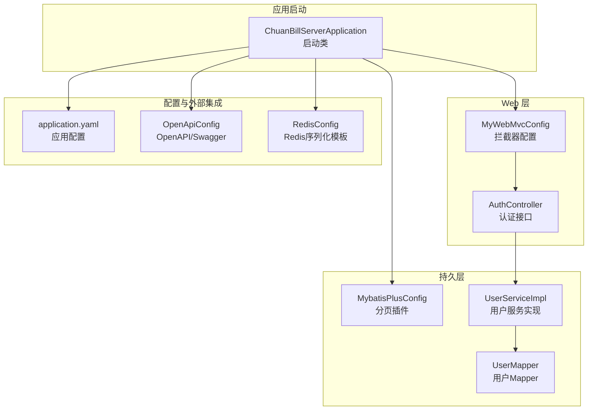
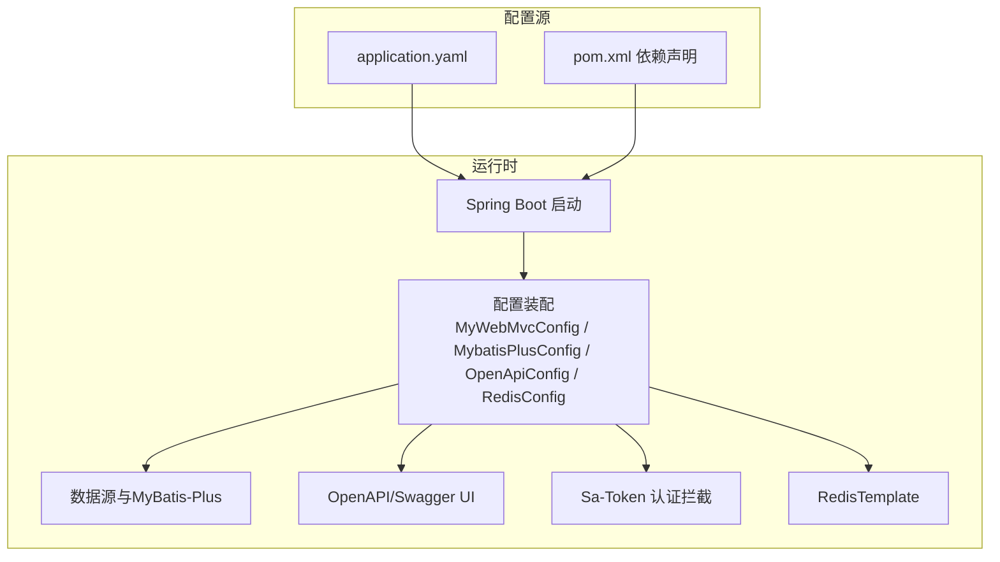
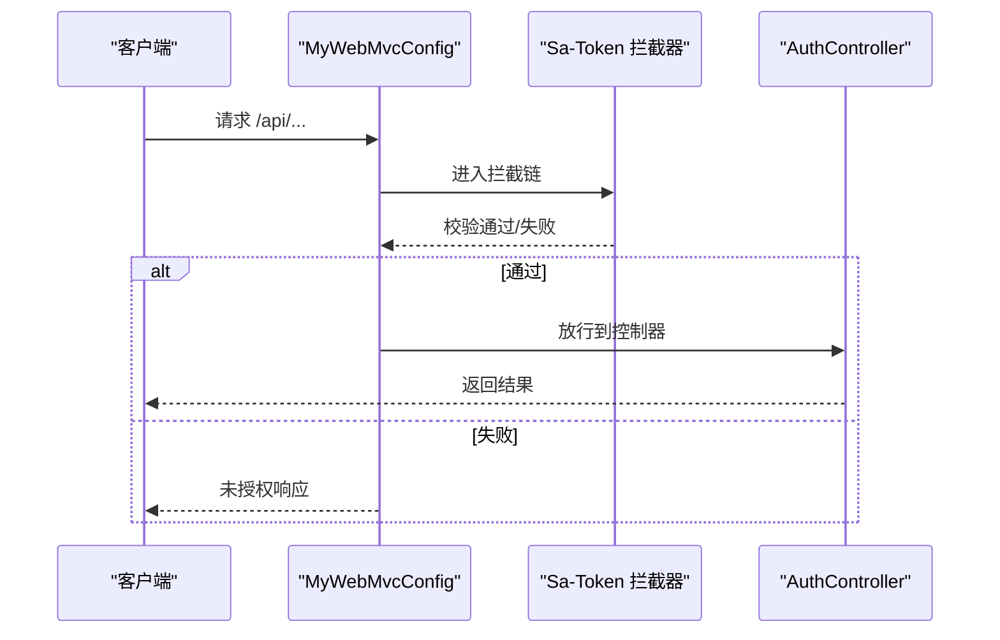
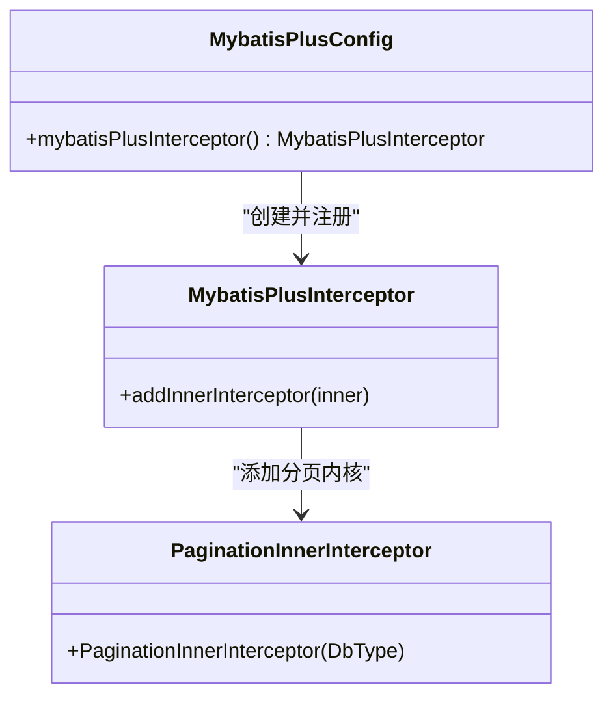
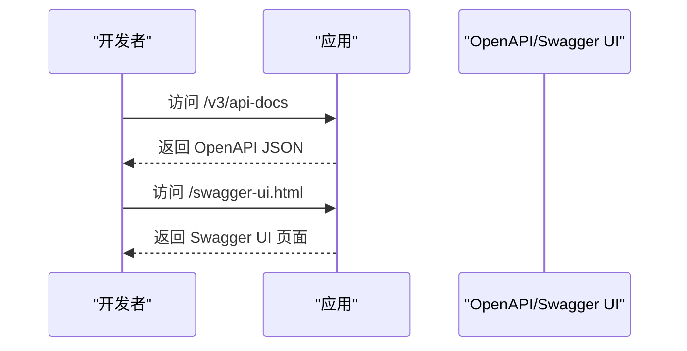
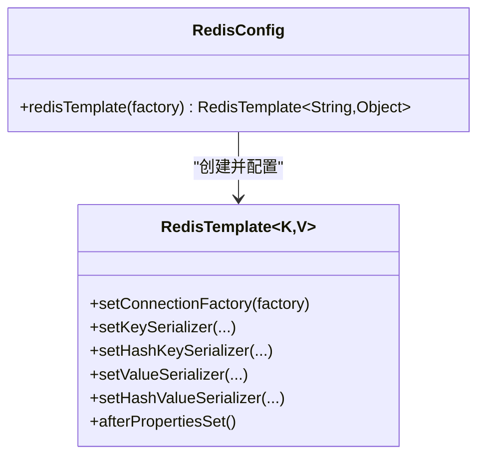
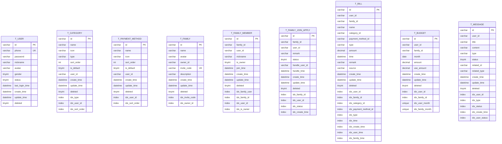
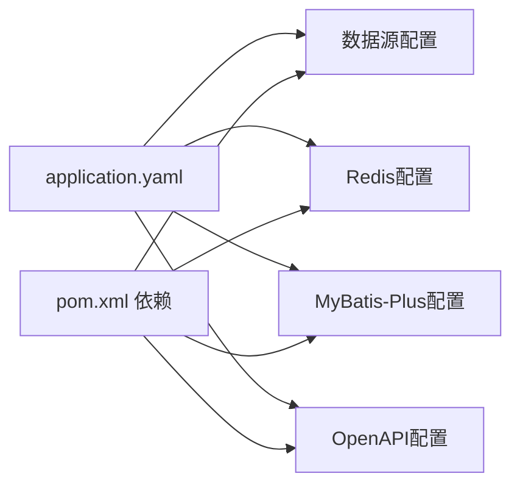

# 配置管理

<cite>
**本文引用的文件**
- [application.yaml](file://chuan-bill-server/src/main/resources/application.yaml)
- [pom.xml](file://chuan-bill-server/pom.xml)
- [init.sql](file://chuan-bill-server/init.sql)
- [MyWebMvcConfig.java](file://chuan-bill-server/src/main/java/com/samoy/chuanbillserver/config/MyWebMvcConfig.java)
- [MybatisPlusConfig.java](file://chuan-bill-server/src/main/java/com/samoy/chuanbillserver/config/MybatisPlusConfig.java)
- [OpenApiConfig.java](file://chuan-bill-server/src/main/java/com/samoy/chuanbillserver/config/OpenApiConfig.java)
- [RedisConfig.java](file://chuan-bill-server/src/main/java/com/samoy/chuanbillserver/config/RedisConfig.java)
- [ChuanBillServerApplication.java](file://chuan-bill-server/src/main/java/com/samoy/chuanbillserver/ChuanBillServerApplication.java)
- [User.java](file://chuan-bill-server/src/main/java/com/samoy/chuanbillserver/entity/User.java)
- [Bill.java](file://chuan-bill-server/src/main/java/com/samoy/chuanbillserver/entity/Bill.java)
- [AuthController.java](file://chuan-bill-server/src/main/java/com/samoy/chuanbillserver/controller/AuthController.java)
- [UserMapper.java](file://chuan-bill-server/src/main/java/com/samoy/chuanbillserver/dao/UserMapper.java)
- [UserServiceImpl.java](file://chuan-bill-server/src/main/java/com/samoy/chuanbillserver/service/impl/UserServiceImpl.java)
- [SystemConstants.java](file://chuan-bill-server/src/main/java/com/samoy/chuanbillserver/constant/SystemConstants.java)
- [GlobalExceptionHandler.java](file://chuan-bill-server/src/main/java/com/samoy/chuanbillserver/expection/GlobalExceptionHandler.java)
</cite>

## 目录
1. [简介](#简介)
2. [项目结构](#项目结构)
3. [核心组件](#核心组件)
4. [架构总览](#架构总览)
5. [详细组件分析](#详细组件分析)
6. [依赖分析](#依赖分析)
7. [性能考虑](#性能考虑)
8. [故障排查指南](#故障排查指南)
9. [结论](#结论)
10. [附录](#附录)

## 简介
本文件面向配置管理系统，围绕 Spring Boot 配置体系进行系统化技术文档整理，涵盖以下主题：
- application.yaml 配置项详解与环境变量管理
- 配置文件加载优先级与覆盖规则
- 核心配置类职责：Web 拦截器、MyBatis-Plus、OpenAPI、Redis
- 数据库初始化脚本、表结构与初始数据
- 配置热更新、环境隔离、配置加密与敏感信息保护
- 配置管理最佳实践、配置验证方法、配置审计与监控方案

## 项目结构
后端采用 Spring Boot 单体应用，核心配置位于 resources 下的 application.yaml；数据库访问通过 MyBatis-Plus；权限认证基于 Sa-Token；接口文档由 SpringDoc（Swagger）生成；Redis 作为缓存与会话存储。

图表来源
- [ChuanBillServerApplication.java:1-15](file://chuan-bill-server/src/main/java/com/samoy/chuanbillserver/ChuanBillServerApplication.java#L1-L15)
- [MyWebMvcConfig.java:1-21](file://chuan-bill-server/src/main/java/com/samoy/chuanbillserver/config/MyWebMvcConfig.java#L1-L21)
- [OpenApiConfig.java:1-31](file://chuan-bill-server/src/main/java/com/samoy/chuanbillserver/config/OpenApiConfig.java#L1-L31)
- [RedisConfig.java:1-32](file://chuan-bill-server/src/main/java/com/samoy/chuanbillserver/config/RedisConfig.java#L1-L32)
- [application.yaml:1-51](file://chuan-bill-server/src/main/resources/application.yaml#L1-L51)
- [AuthController.java:1-66](file://chuan-bill-server/src/main/java/com/samoy/chuanbillserver/controller/AuthController.java#L1-L66)
- [UserMapper.java:1-15](file://chuan-bill-server/src/main/java/com/samoy/chuanbillserver/dao/UserMapper.java#L1-L15)
- [UserServiceImpl.java:1-192](file://chuan-bill-server/src/main/java/com/samoy/chuanbillserver/service/impl/UserServiceImpl.java#L1-L192)

章节来源
- [ChuanBillServerApplication.java:1-15](file://chuan-bill-server/src/main/java/com/samoy/chuanbillserver/ChuanBillServerApplication.java#L1-L15)
- [application.yaml:1-51](file://chuan-bill-server/src/main/resources/application.yaml#L1-L51)

## 核心组件
- Web 配置（MyWebMvcConfig）
  - 注册 Sa-Token 拦截器，统一鉴权；排除认证、文档等路径。
- MyBatis-Plus 配置（MybatisPlusConfig）
  - 注册分页插件，适配 MySQL。
- OpenAPI 配置（OpenApiConfig）
  - 定义 OpenAPI 基本信息与服务器列表，暴露 Swagger UI。
- Redis 配置（RedisConfig）
  - 自定义 RedisTemplate 序列化策略，支持字符串键与 JSON 值。

章节来源
- [MyWebMvcConfig.java:1-21](file://chuan-bill-server/src/main/java/com/samoy/chuanbillserver/config/MyWebMvcConfig.java#L1-L21)
- [MybatisPlusConfig.java:1-18](file://chuan-bill-server/src/main/java/com/samoy/chuanbillserver/config/MybatisPlusConfig.java#L1-L18)
- [OpenApiConfig.java:1-31](file://chuan-bill-server/src/main/java/com/samoy/chuanbillserver/config/OpenApiConfig.java#L1-L31)
- [RedisConfig.java:1-32](file://chuan-bill-server/src/main/java/com/samoy/chuanbillserver/config/RedisConfig.java#L1-L32)

## 架构总览
下图展示配置在系统中的作用与交互：

图表来源
- [application.yaml:1-51](file://chuan-bill-server/src/main/resources/application.yaml#L1-L51)
- [pom.xml:1-226](file://chuan-bill-server/pom.xml#L1-L226)
- [MyWebMvcConfig.java:1-21](file://chuan-bill-server/src/main/java/com/samoy/chuanbillserver/config/MyWebMvcConfig.java#L1-L21)
- [MybatisPlusConfig.java:1-18](file://chuan-bill-server/src/main/java/com/samoy/chuanbillserver/config/MybatisPlusConfig.java#L1-L18)
- [OpenApiConfig.java:1-31](file://chuan-bill-server/src/main/java/com/samoy/chuanbillserver/config/OpenApiConfig.java#L1-L31)
- [RedisConfig.java:1-32](file://chuan-bill-server/src/main/java/com/samoy/chuanbillserver/config/RedisConfig.java#L1-L32)

## 详细组件分析

### Web 配置：MyWebMvcConfig
- 功能要点
  - 注册 Sa-Token 拦截器，强制登录校验。
  - 排除路径：认证接口、OpenAPI 文档相关路径，避免重复鉴权。
- 关键行为
  - 对所有请求路径进行登录态检查。
  - 通过排除模式放行公开接口与文档页面。

图表来源
- [MyWebMvcConfig.java:10-19](file://chuan-bill-server/src/main/java/com/samoy/chuanbillserver/config/MyWebMvcConfig.java#L10-L19)
- [AuthController.java:19-66](file://chuan-bill-server/src/main/java/com/samoy/chuanbillserver/controller/AuthController.java#L19-L66)

章节来源
- [MyWebMvcConfig.java:1-21](file://chuan-bill-server/src/main/java/com/samoy/chuanbillserver/config/MyWebMvcConfig.java#L1-L21)
- [AuthController.java:1-66](file://chuan-bill-server/src/main/java/com/samoy/chuanbillserver/controller/AuthController.java#L1-L66)

### MyBatis-Plus 配置：MybatisPlusConfig
- 功能要点
  - 注册分页插件，适配 MySQL 数据库类型。
- 影响范围
  - 为所有分页查询提供统一的分页能力，无需在业务代码中重复配置。

图表来源
- [MybatisPlusConfig.java:9-17](file://chuan-bill-server/src/main/java/com/samoy/chuanbillserver/config/MybatisPlusConfig.java#L9-L17)

章节来源
- [MybatisPlusConfig.java:1-18](file://chuan-bill-server/src/main/java/com/samoy/chuanbillserver/config/MybatisPlusConfig.java#L1-L18)

### OpenAPI 配置：OpenApiConfig
- 功能要点
  - 定义 OpenAPI 基本信息（标题、版本、描述、联系人）。
  - 配置多个服务器地址（本地与生产），便于不同环境切换。
- 访问方式
  - 通过 application.yaml 中的 springdoc 配置暴露 API 文档路径。

图表来源
- [OpenApiConfig.java:18-29](file://chuan-bill-server/src/main/java/com/samoy/chuanbillserver/config/OpenApiConfig.java#L18-L29)
- [application.yaml:41-47](file://chuan-bill-server/src/main/resources/application.yaml#L41-L47)

章节来源
- [OpenApiConfig.java:1-31](file://chuan-bill-server/src/main/java/com/samoy/chuanbillserver/config/OpenApiConfig.java#L1-L31)
- [application.yaml:41-47](file://chuan-bill-server/src/main/resources/application.yaml#L41-L47)

### Redis 配置：RedisConfig
- 功能要点
  - 统一 RedisTemplate 的序列化策略：字符串键、哈希键使用字符串序列化；值与哈希值使用 Jackson JSON 序列化。
- 适用场景
  - 缓存、会话存储、验证码缓存等。

图表来源
- [RedisConfig.java:12-31](file://chuan-bill-server/src/main/java/com/samoy/chuanbillserver/config/RedisConfig.java#L12-L31)

章节来源
- [RedisConfig.java:1-32](file://chuan-bill-server/src/main/java/com/samoy/chuanbillserver/config/RedisConfig.java#L1-L32)

### 数据库初始化与表结构
- 初始化脚本
  - 创建数据库与字符集设置。
  - 创建用户、类目、支付方式、家庭、家庭成员、家庭加入申请、账单、预算、消息等表。
  - 插入系统默认类目与支付方式。
- 表结构要点
  - 使用逻辑删除字段 deleted 控制软删除。
  - 多表建立索引以优化查询（如 t_user、t_category、t_bill 等）。
- 初始数据
  - 系统预设多条默认类目与支付方式，便于新用户快速上手。

图表来源
- [init.sql:1-326](file://chuan-bill-server/init.sql#L1-L326)

章节来源
- [init.sql:1-326](file://chuan-bill-server/init.sql#L1-L326)

### 配置文件优先级与环境变量管理
- 配置文件优先级（从高到低）
  - 命令行参数
  - SPRING_APPLICATION_JSON
  - 环境变量
  - application-{profile}.yaml
  - application.yaml
- 环境变量映射
  - 数据库：MYSQL_URL、MYSQL_USERNAME、MYSQL_PASSWORD
  - Redis：REDIS_HOST、REDIS_PORT、REDIS_PASSWORD
  - DashScope：DASHSCOPE_API_KEY、DASHSCOPE_OCR_APP_ID
- 建议
  - 开发使用本地环境变量；生产通过容器或平台注入；敏感信息不进入仓库。

章节来源
- [application.yaml:4-15](file://chuan-bill-server/src/main/resources/application.yaml#L4-L15)
- [application.yaml:48-51](file://chuan-bill-server/src/main/resources/application.yaml#L48-L51)

### 配置类职责与作用域
- MyWebMvcConfig
  - 职责：全局登录拦截，排除认证与文档路径。
  - 作用域：Web MVC 层。
- MybatisPlusConfig
  - 职责：分页插件注册，适配 MySQL。
  - 作用域：数据访问层。
- OpenApiConfig
  - 职责：OpenAPI 基本信息与服务器列表配置。
  - 作用域：API 文档层。
- RedisConfig
  - 职责：RedisTemplate 序列化策略统一。
  - 作用域：缓存与会话层。

章节来源
- [MyWebMvcConfig.java:1-21](file://chuan-bill-server/src/main/java/com/samoy/chuanbillserver/config/MyWebMvcConfig.java#L1-L21)
- [MybatisPlusConfig.java:1-18](file://chuan-bill-server/src/main/java/com/samoy/chuanbillserver/config/MybatisPlusConfig.java#L1-L18)
- [OpenApiConfig.java:1-31](file://chuan-bill-server/src/main/java/com/samoy/chuanbillserver/config/OpenApiConfig.java#L1-L31)
- [RedisConfig.java:1-32](file://chuan-bill-server/src/main/java/com/samoy/chuanbillserver/config/RedisConfig.java#L1-L32)

### 配置热更新、环境隔离、配置加密与敏感信息保护
- 热更新
  - Spring Boot Actuator 可暴露配置刷新端点，结合外部配置中心实现动态刷新。
  - 建议：对非敏感配置启用刷新；对数据库连接等关键配置谨慎刷新。
- 环境隔离
  - 使用 profile 文件区分 dev/prod/test；通过环境变量覆盖默认值。
- 配置加密
  - 对敏感字段（如数据库密码、第三方密钥）建议使用密文存储与解密机制。
  - Spring Cloud Config 或 Vault 等集中式配置中心可提供加解密能力。
- 敏感信息保护
  - 不将明文密码写入仓库；使用环境变量或密钥管理服务。
  - 对日志输出进行脱敏处理（如手机号中间部分隐藏）。

章节来源
- [application.yaml:4-15](file://chuan-bill-server/src/main/resources/application.yaml#L4-L15)
- [application.yaml:48-51](file://chuan-bill-server/src/main/resources/application.yaml#L48-L51)
- [UserServiceImpl.java:147-157](file://chuan-bill-server/src/main/java/com/samoy/chuanbillserver/service/impl/UserServiceImpl.java#L147-L157)

### 配置验证方法与审计监控
- 配置验证
  - 启动阶段打印生效配置摘要；对必填项进行空值校验。
  - 使用 @Validated 对 DTO 进行参数校验，减少配置错误导致的运行时异常。
- 审计与监控
  - 结合 Actuator 暴露健康检查、配置信息、指标等。
  - 对认证与敏感操作记录审计日志，便于追踪问题。

章节来源
- [pom.xml:53-56](file://chuan-bill-server/pom.xml#L53-L56)
- [GlobalExceptionHandler.java:1-50](file://chuan-bill-server/src/main/java/com/samoy/chuanbillserver/expection/GlobalExceptionHandler.java#L1-L50)

## 依赖分析
- Maven 依赖概览
  - Web 与启动：spring-boot-starter-web、spring-boot-starter
  - 数据库与连接池：spring-boot-starter-jdbc、mysql-connector-j
  - MyBatis-Plus：mybatis-plus-spring-boot3-starter、mybatis-plus-generator、分页插件
  - Redis：spring-boot-starter-data-redis、commons-pool2
  - 权限：sa-token-spring-boot3-starter、sa-token-redis-template
  - 文档：springdoc-openapi-starter-webmvc-ui
  - 工具：hutool、validation、velocity
  - 开发：devtools、lombok
- 配置与依赖关联
  - application.yaml 中的 spring.datasource.* 与 spring.redis.* 与上述依赖形成运行时绑定。

图表来源
- [application.yaml:1-51](file://chuan-bill-server/src/main/resources/application.yaml#L1-L51)
- [pom.xml:51-168](file://chuan-bill-server/pom.xml#L51-L168)

章节来源
- [pom.xml:1-226](file://chuan-bill-server/pom.xml#L1-L226)
- [application.yaml:1-51](file://chuan-bill-server/src/main/resources/application.yaml#L1-L51)

## 性能考虑
- 数据库连接与池化
  - 合理设置连接池大小与超时，避免高并发下的连接争用。
- Redis 序列化
  - 使用高效的 JSON 序列化策略，注意对象复杂度与字段数量。
- 分页与索引
  - 依据 init.sql 中的索引设计，确保高频查询命中索引；分页查询避免全表扫描。
- 日志与调试
  - 生产关闭冗余日志，保留必要的审计与错误日志。

## 故障排查指南
- 未登录/鉴权失败
  - 检查 MyWebMvcConfig 拦截器是否正确排除了认证与文档路径。
  - 查看全局异常处理器对 NotLoginException 的处理。
- 数据库连接失败
  - 校验 MYSQL_URL、MYSQL_USERNAME、MYSQL_PASSWORD 环境变量是否正确。
  - 确认数据库服务可达与账号权限。
- Redis 连接异常
  - 校验 REDIS_HOST、REDIS_PORT、REDIS_PASSWORD 环境变量。
  - 检查 Redis 服务状态与网络连通性。
- OpenAPI 文档不可见
  - 确认 springdoc.api-docs.enabled 与 springdoc.swagger-ui.enabled 已开启。
  - 访问 /v3/api-docs 与 /swagger-ui.html 路径是否被拦截器排除。

章节来源
- [MyWebMvcConfig.java:10-19](file://chuan-bill-server/src/main/java/com/samoy/chuanbillserver/config/MyWebMvcConfig.java#L10-L19)
- [GlobalExceptionHandler.java:20-24](file://chuan-bill-server/src/main/java/com/samoy/chuanbillserver/expection/GlobalExceptionHandler.java#L20-L24)
- [application.yaml:4-15](file://chuan-bill-server/src/main/resources/application.yaml#L4-L15)
- [application.yaml:41-47](file://chuan-bill-server/src/main/resources/application.yaml#L41-L47)

## 结论
本配置管理体系以 Spring Boot 为核心，结合 Sa-Token、MyBatis-Plus、SpringDoc 与 Redis 实现了认证、数据访问、文档与缓存的完整配置闭环。通过合理的环境变量与 profile 管理、严格的敏感信息保护与审计监控，能够满足开发与生产的多样化需求。建议后续引入集中式配置中心与密钥管理，进一步提升配置安全与运维效率。

## 附录
- 启动与访问
  - 启动应用后，访问 Swagger UI：/swagger-ui.html
  - 查看 OpenAPI JSON：/v3/api-docs
- 常用命令
  - 本地开发：mvn spring-boot:run
  - 打包：mvn clean package
- 数据模型参考
  - 用户、账单、类目、支付方式、家庭、预算、消息等实体对应 init.sql 中的建表与索引设计。