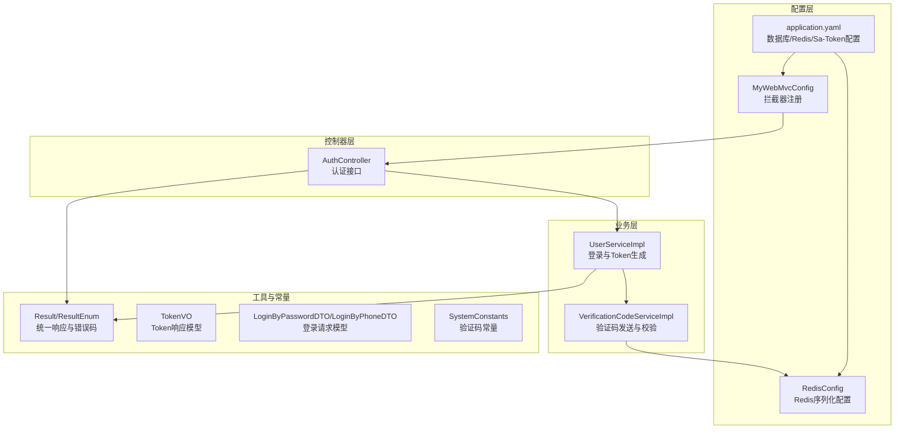
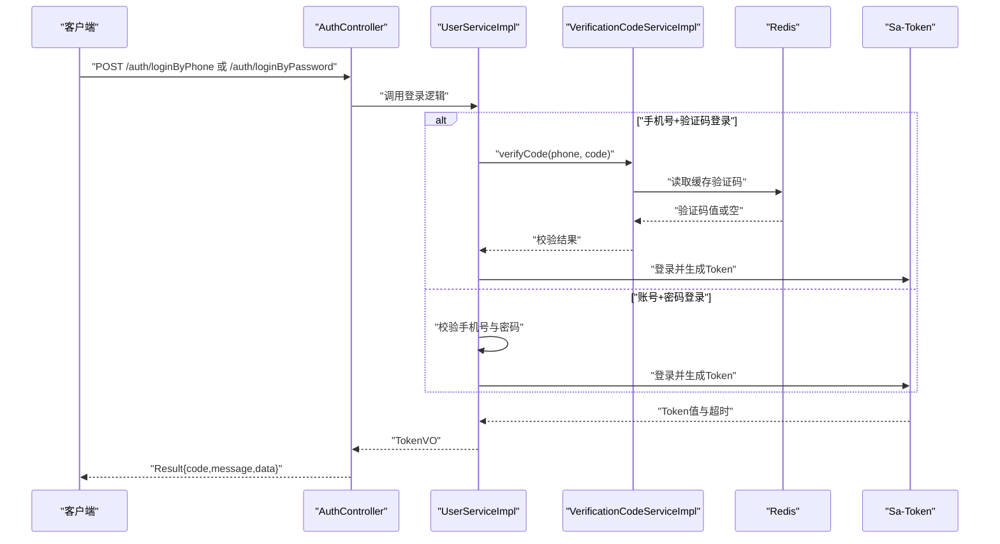
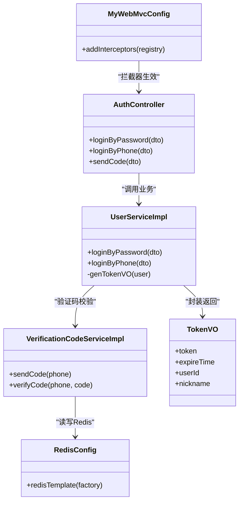
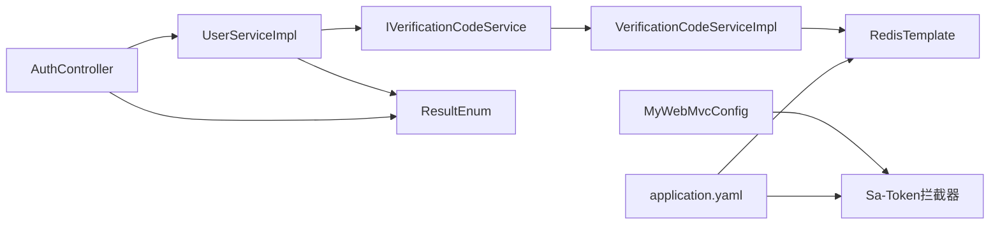

# API安全设计

<cite>
**本文引用的文件**
- [MyWebMvcConfig.java](file://chuan-bill-server/src/main/java/com/samoy/chuanbillserver/config/MyWebMvcConfig.java)
- [GlobalExceptionHandler.java](file://chuan-bill-server/src/main/java/com/samoy/chuanbillserver/expection/GlobalExceptionHandler.java)
- [Result.java](file://chuan-bill-server/src/main/java/com/samoy/chuanbillserver/result/Result.java)
- [ResultEnum.java](file://chuan-bill-server/src/main/java/com/samoy/chuanbillserver/result/ResultEnum.java)
- [AuthController.java](file://chuan-bill-server/src/main/java/com/samoy/chuanbillserver/controller/AuthController.java)
- [UserServiceImpl.java](file://chuan-bill-server/src/main/java/com/samoy/chuanbillserver/service/impl/UserServiceImpl.java)
- [VerificationCodeServiceImpl.java](file://chuan-bill-server/src/main/java/com/samoy/chuanbillserver/service/impl/VerificationCodeServiceImpl.java)
- [IVerificationCodeService.java](file://chuan-bill-server/src/main/java/com/samoy/chuanbillserver/service/IVerificationCodeService.java)
- [RedisConfig.java](file://chuan-bill-server/src/main/java/com/samoy/chuanbillserver/config/RedisConfig.java)
- [SystemConstants.java](file://chuan-bill-server/src/main/java/com/samoy/chuanbillserver/constant/SystemConstants.java)
- [application.yaml](file://chuan-bill-server/src/main/resources/application.yaml)
- [TokenVO.java](file://chuan-bill-server/src/main/java/com/samoy/chuanbillserver/vo/TokenVO.java)
- [LoginByPasswordDTO.java](file://chuan-bill-server/src/main/java/com/samoy/chuanbillserver/dto/LoginByPasswordDTO.java)
- [LoginByPhoneDTO.java](file://chuan-bill-server/src/main/java/com/samoy/chuanbillserver/dto/LoginByPhoneDTO.java)
</cite>

## 目录
1. [简介](#简介)
2. [项目结构](#项目结构)
3. [核心组件](#核心组件)
4. [架构总览](#架构总览)
5. [详细组件分析](#详细组件分析)
6. [依赖分析](#依赖分析)
7. [性能考虑](#性能考虑)
8. [故障排查指南](#故障排查指南)
9. [结论](#结论)
10. [附录](#附录)

## 简介
本文件面向“小川记账”后端API的安全设计，基于现有代码库梳理与扩展，形成一套可落地的API安全方案。内容覆盖鉴权机制（Token验证、权限检查、访问控制）、频率限制策略（限流算法、令牌桶、IP白名单）、签名验证机制（请求签名生成、时间戳校验、重放攻击防护）、CORS跨域安全配置、API安全最佳实践（HTTPS、请求大小限制、错误信息脱敏）、以及安全监控与审计日志建议。由于当前仓库未包含完整的限流、签名与CORS实现，本文在“现有能力”基础上提出可扩展的实施方案。

## 项目结构
后端采用Spring Boot + MyBatis-Plus + Sa-Token实现，核心安全相关模块集中在以下位置：
- 配置层：拦截器与跨域配置（当前仅拦截器）
- 控制器层：认证相关接口
- 业务层：用户登录、验证码发送与校验
- 工具与常量：统一响应、枚举、系统常量
- 配置文件：数据库、Redis、Sa-Token等基础配置

图表来源
- [MyWebMvcConfig.java:10-19](file://chuan-bill-server/src/main/java/com/samoy/chuanbillserver/config/MyWebMvcConfig.java#L10-L19)
- [RedisConfig.java:12-31](file://chuan-bill-server/src/main/java/com/samoy/chuanbillserver/config/RedisConfig.java#L12-L31)
- [application.yaml:1-51](file://chuan-bill-server/src/main/resources/application.yaml#L1-L51)
- [AuthController.java:19-66](file://chuan-bill-server/src/main/java/com/samoy/chuanbillserver/controller/AuthController.java#L19-L66)
- [UserServiceImpl.java:35-192](file://chuan-bill-server/src/main/java/com/samoy/chuanbillserver/service/impl/UserServiceImpl.java#L35-L192)
- [VerificationCodeServiceImpl.java:14-63](file://chuan-bill-server/src/main/java/com/samoy/chuanbillserver/service/impl/VerificationCodeServiceImpl.java#L14-L63)
- [Result.java:8-50](file://chuan-bill-server/src/main/java/com/samoy/chuanbillserver/result/Result.java#L8-L50)
- [ResultEnum.java:6-56](file://chuan-bill-server/src/main/java/com/samoy/chuanbillserver/result/ResultEnum.java#L6-L56)
- [TokenVO.java:8-21](file://chuan-bill-server/src/main/java/com/samoy/chuanbillserver/vo/TokenVO.java#L8-L21)
- [LoginByPasswordDTO.java:11-18](file://chuan-bill-server/src/main/java/com/samoy/chuanbillserver/dto/LoginByPasswordDTO.java#L11-L18)
- [LoginByPhoneDTO.java:10-16](file://chuan-bill-server/src/main/java/com/samoy/chuanbillserver/dto/LoginByPhoneDTO.java#L10-L16)
- [SystemConstants.java:3-35](file://chuan-bill-server/src/main/java/com/samoy/chuanbillserver/constant/SystemConstants.java#L3-L35)

章节来源
- [MyWebMvcConfig.java:10-19](file://chuan-bill-server/src/main/java/com/samoy/chuanbillserver/config/MyWebMvcConfig.java#L10-L19)
- [application.yaml:1-51](file://chuan-bill-server/src/main/resources/application.yaml#L1-L51)

## 核心组件
- 拦截器与全局异常处理：通过拦截器实现统一登录态校验；全局异常处理器对未登录、业务异常与系统异常进行标准化输出。
- 认证与Token：基于Sa-Token实现登录态管理，生成并下发Token，支持Token超时与日志记录。
- 验证码体系：基于Redis存储验证码，设置过期时间，并在验证成功后删除，防止重复使用。
- 统一响应与错误码：定义标准响应结构与错误码枚举，便于前端与监控侧统一处理。
- 请求模型：对登录请求进行参数校验，确保手机号与密码/验证码格式符合要求。

章节来源
- [MyWebMvcConfig.java:10-19](file://chuan-bill-server/src/main/java/com/samoy/chuanbillserver/config/MyWebMvcConfig.java#L10-L19)
- [GlobalExceptionHandler.java:12-49](file://chuan-bill-server/src/main/java/com/samoy/chuanbillserver/expection/GlobalExceptionHandler.java#L12-L49)
- [UserServiceImpl.java:40-83](file://chuan-bill-server/src/main/java/com/samoy/chuanbillserver/service/impl/UserServiceImpl.java#L40-L83)
- [VerificationCodeServiceImpl.java:20-48](file://chuan-bill-server/src/main/java/com/samoy/chuanbillserver/service/impl/VerificationCodeServiceImpl.java#L20-L48)
- [Result.java:12-49](file://chuan-bill-server/src/main/java/com/samoy/chuanbillserver/result/Result.java#L12-L49)
- [ResultEnum.java:6-56](file://chuan-bill-server/src/main/java/com/samoy/chuanbillserver/result/ResultEnum.java#L6-L56)
- [LoginByPasswordDTO.java:11-18](file://chuan-bill-server/src/main/java/com/samoy/chuanbillserver/dto/LoginByPasswordDTO.java#L11-L18)
- [LoginByPhoneDTO.java:10-16](file://chuan-bill-server/src/main/java/com/samoy/chuanbillserver/dto/LoginByPhoneDTO.java#L10-L16)

## 架构总览
下图展示从客户端到后端的典型认证流程与安全控制点：

图表来源
- [AuthController.java:35-64](file://chuan-bill-server/src/main/java/com/samoy/chuanbillserver/controller/AuthController.java#L35-L64)
- [UserServiceImpl.java:40-83](file://chuan-bill-server/src/main/java/com/samoy/chuanbillserver/service/impl/UserServiceImpl.java#L40-L83)
- [VerificationCodeServiceImpl.java:32-48](file://chuan-bill-server/src/main/java/com/samoy/chuanbillserver/service/impl/VerificationCodeServiceImpl.java#L32-L48)
- [RedisConfig.java:14-30](file://chuan-bill-server/src/main/java/com/samoy/chuanbillserver/config/RedisConfig.java#L14-L30)
- [application.yaml:23-31](file://chuan-bill-server/src/main/resources/application.yaml#L23-L31)

## 详细组件分析

### 接口鉴权机制
- 登录拦截：通过拦截器对所有路径进行登录态校验，排除认证相关与Swagger路径。
- 登录实现：登录成功后调用Sa-Token执行登录并生成Token，同时记录Token超时与日志。
- Token下发：TokenVO包含token、userId、nickname与expireTime，供前端持久化与续期使用。

图表来源
- [MyWebMvcConfig.java:10-19](file://chuan-bill-server/src/main/java/com/samoy/chuanbillserver/config/MyWebMvcConfig.java#L10-L19)
- [AuthController.java:22-64](file://chuan-bill-server/src/main/java/com/samoy/chuanbillserver/controller/AuthController.java#L22-L64)
- [UserServiceImpl.java:40-190](file://chuan-bill-server/src/main/java/com/samoy/chuanbillserver/service/impl/UserServiceImpl.java#L40-L190)
- [VerificationCodeServiceImpl.java:20-48](file://chuan-bill-server/src/main/java/com/samoy/chuanbillserver/service/impl/VerificationCodeServiceImpl.java#L20-L48)
- [RedisConfig.java:12-31](file://chuan-bill-server/src/main/java/com/samoy/chuanbillserver/config/RedisConfig.java#L12-L31)
- [TokenVO.java:8-21](file://chuan-bill-server/src/main/java/com/samoy/chuanbillserver/vo/TokenVO.java#L8-L21)

章节来源
- [MyWebMvcConfig.java:10-19](file://chuan-bill-server/src/main/java/com/samoy/chuanbillserver/config/MyWebMvcConfig.java#L10-L19)
- [UserServiceImpl.java:174-190](file://chuan-bill-server/src/main/java/com/samoy/chuanbillserver/service/impl/UserServiceImpl.java#L174-L190)
- [TokenVO.java:8-21](file://chuan-bill-server/src/main/java/com/samoy/chuanbillserver/vo/TokenVO.java#L8-L21)

### 权限检查与访问控制
- 当前实现：通过拦截器统一校验登录态，未见细粒度的资源级权限控制（如角色/菜单/数据权限）。
- 建议：结合Sa-Token的角色/权限注解或自定义拦截器，针对具体资源与操作进行权限判定；对敏感接口（如账单增删改查）增加更严格的访问控制。

章节来源
- [MyWebMvcConfig.java:10-19](file://chuan-bill-server/src/main/java/com/samoy/chuanbillserver/config/MyWebMvcConfig.java#L10-L19)

### 频率限制策略
- 现状：当前代码库未实现显式的API限流与令牌桶逻辑。
- 可选方案（建议扩展）：
  - 基于注解的限流：在控制器方法上标注限流规则（QPS、窗口大小、桶容量），结合Redis计数或漏桶/令牌桶算法。
  - 全局限流：在拦截器中按IP/用户维度统计请求频次，超过阈值返回统一错误码。
  - IP白名单：在网关或拦截器层维护白名单列表，允许白名单内IP直通或放宽限流策略。
  - 平滑降级：当达到阈值时返回Retry-After或提示稍后再试，避免雪崩效应。

章节来源
- [ResultEnum.java:17-17](file://chuan-bill-server/src/main/java/com/samoy/chuanbillserver/result/ResultEnum.java#L17-L17)

### 签名验证机制
- 现状：当前未实现请求签名与时间戳校验。
- 建议扩展（概念性设计）：
  - 签名字段：timestamp、nonce、method、uri、body摘要、client_id等。
  - 签名算法：HMAC-SHA256或RSA，密钥由服务端下发并定期轮换。
  - 时间戳校验：允许±5分钟容差，超出则拒绝。
  - 重放防护：nonce+timestamp组合去重，结合Redis TTL。
  - 敏感接口强签名校验：对高风险操作（转账、删除）强制开启。

章节来源
- [ResultEnum.java:17-17](file://chuan-bill-server/src/main/java/com/samoy/chuanbillserver/result/ResultEnum.java#L17-L17)

### CORS跨域安全配置
- 现状：未发现专门的CORS配置类。
- 建议：
  - 允许域名：仅允许受信域名（如生产环境的H5/小程序域名），避免通配符。
  - 预检请求：明确允许的HTTP方法与头，避免暴露过多细节。
  - 凭证传递：谨慎开启withCredentials，确保Cookie与Token的安全传输。
  - 动态配置：根据环境（开发/测试/生产）动态调整允许列表。

章节来源
- [application.yaml:1-51](file://chuan-bill-server/src/main/resources/application.yaml#L1-L51)

### API安全最佳实践
- HTTPS强制：生产环境必须启用TLS，禁止明文HTTP。
- 请求大小限制：在网关或过滤器中限制Body大小，防止内存溢出。
- 错误信息脱敏：统一使用ResultEnum中的错误码与消息，避免泄露内部堆栈与路径。
- 参数校验：DTO层使用Jakarta Validation约束手机号、密码长度与格式。
- 日志脱敏：对敏感字段（手机号中间四位脱敏）在日志与响应中处理。

章节来源
- [Result.java:12-49](file://chuan-bill-server/src/main/java/com/samoy/chuanbillserver/result/Result.java#L12-L49)
- [ResultEnum.java:6-56](file://chuan-bill-server/src/main/java/com/samoy/chuanbillserver/result/ResultEnum.java#L6-L56)
- [LoginByPasswordDTO.java:11-18](file://chuan-bill-server/src/main/java/com/samoy/chuanbillserver/dto/LoginByPasswordDTO.java#L11-L18)
- [LoginByPhoneDTO.java:10-16](file://chuan-bill-server/src/main/java/com/samoy/chuanbillserver/dto/LoginByPhoneDTO.java#L10-L16)
- [UserServiceImpl.java:154-156](file://chuan-bill-server/src/main/java/com/samoy/chuanbillserver/service/impl/UserServiceImpl.java#L154-L156)

### 安全监控与审计日志
- 异常监控：全局异常处理器记录未登录、业务异常与系统异常，便于告警。
- 访问审计：记录登录、登出、敏感操作的用户行为，保留时间与IP。
- 审计指标：失败登录次数、验证码发送频率、接口耗时与错误率。

章节来源
- [GlobalExceptionHandler.java:12-49](file://chuan-bill-server/src/main/java/com/samoy/chuanbillserver/expection/GlobalExceptionHandler.java#L12-L49)

## 依赖分析
- 拦截器依赖：MyWebMvcConfig依赖Sa-Token拦截器实现登录态校验。
- 业务依赖：UserServiceImpl依赖IVerificationCodeService与Sa-Token生成Token；VerificationCodeServiceImpl依赖RedisTemplate。
- 配置依赖：application.yaml提供数据库、Redis与Sa-Token的基础配置；RedisConfig提供序列化策略。

图表来源
- [MyWebMvcConfig.java:10-19](file://chuan-bill-server/src/main/java/com/samoy/chuanbillserver/config/MyWebMvcConfig.java#L10-L19)
- [UserServiceImpl.java:35-192](file://chuan-bill-server/src/main/java/com/samoy/chuanbillserver/service/impl/UserServiceImpl.java#L35-L192)
- [VerificationCodeServiceImpl.java:14-63](file://chuan-bill-server/src/main/java/com/samoy/chuanbillserver/service/impl/VerificationCodeServiceImpl.java#L14-L63)
- [RedisConfig.java:12-31](file://chuan-bill-server/src/main/java/com/samoy/chuanbillserver/config/RedisConfig.java#L12-L31)
- [application.yaml:1-51](file://chuan-bill-server/src/main/resources/application.yaml#L1-L51)

章节来源
- [MyWebMvcConfig.java:10-19](file://chuan-bill-server/src/main/java/com/samoy/chuanbillserver/config/MyWebMvcConfig.java#L10-L19)
- [UserServiceImpl.java:35-192](file://chuan-bill-server/src/main/java/com/samoy/chuanbillserver/service/impl/UserServiceImpl.java#L35-L192)
- [VerificationCodeServiceImpl.java:14-63](file://chuan-bill-server/src/main/java/com/samoy/chuanbillserver/service/impl/VerificationCodeServiceImpl.java#L14-L63)
- [RedisConfig.java:12-31](file://chuan-bill-server/src/main/java/com/samoy/chuanbillserver/config/RedisConfig.java#L12-L31)
- [application.yaml:1-51](file://chuan-bill-server/src/main/resources/application.yaml#L1-L51)

## 性能考虑
- Token生命周期：Sa-Token的timeout较长，需结合主动刷新与失效策略，避免长时间持有高权限Token。
- Redis热点：验证码读写为高频短命键，注意连接池与序列化开销；必要时拆分数据库或引入本地缓存。
- 异常处理成本：全局异常处理器会记录日志，建议在生产环境使用异步日志或批量上报，降低阻塞。

## 故障排查指南
- 未登录/Token无效：检查拦截器是否生效、Token是否过期或被顶号下线。
- 验证码问题：确认Redis中验证码键是否存在、过期时间是否正确、验证成功后是否被删除。
- 参数校验失败：核对手机号格式、密码长度与验证码必填项。
- 统一错误码：参考ResultEnum中的错误码映射，定位具体业务场景。

章节来源
- [GlobalExceptionHandler.java:20-48](file://chuan-bill-server/src/main/java/com/samoy/chuanbillserver/expection/GlobalExceptionHandler.java#L20-L48)
- [VerificationCodeServiceImpl.java:32-48](file://chuan-bill-server/src/main/java/com/samoy/chuanbillserver/service/impl/VerificationCodeServiceImpl.java#L32-L48)
- [ResultEnum.java:25-46](file://chuan-bill-server/src/main/java/com/samoy/chuanbillserver/result/ResultEnum.java#L25-L46)

## 结论
当前代码库已具备完善的登录拦截与Token下发能力，配合Redis验证码体系与统一响应/异常处理，满足基础安全需求。为进一步提升安全性，建议补充：细粒度权限控制、API限流与IP白名单、请求签名与时间戳校验、CORS安全配置、HTTPS强制与请求大小限制、以及安全监控与审计日志。以上扩展可在不破坏现有架构的前提下平滑集成。

## 附录
- Sa-Token配置要点：token名称、超时时间、日志开关等。
- Redis配置要点：序列化策略、连接池参数、超时设置。

章节来源
- [application.yaml:23-31](file://chuan-bill-server/src/main/resources/application.yaml#L23-L31)
- [RedisConfig.java:12-31](file://chuan-bill-server/src/main/java/com/samoy/chuanbillserver/config/RedisConfig.java#L12-L31)