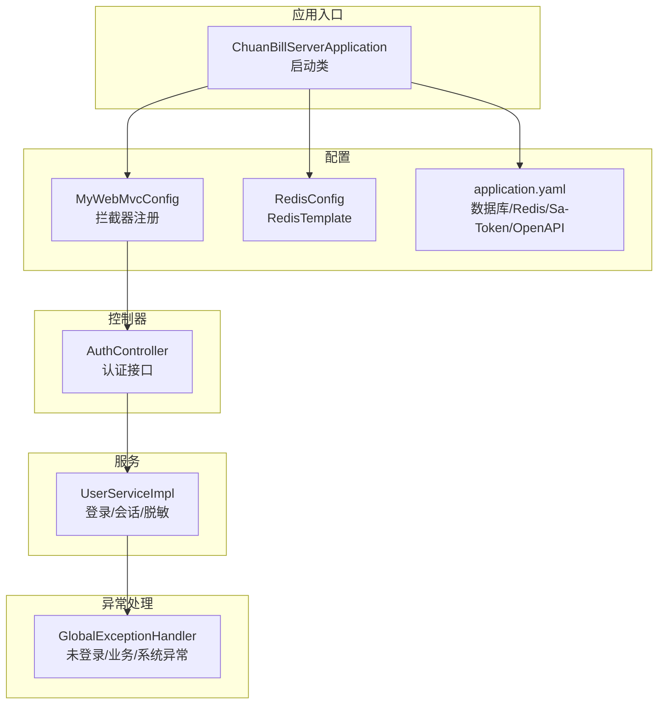
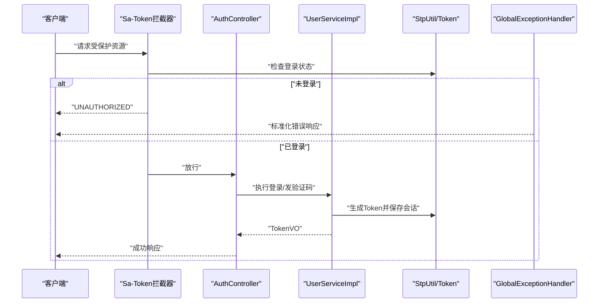
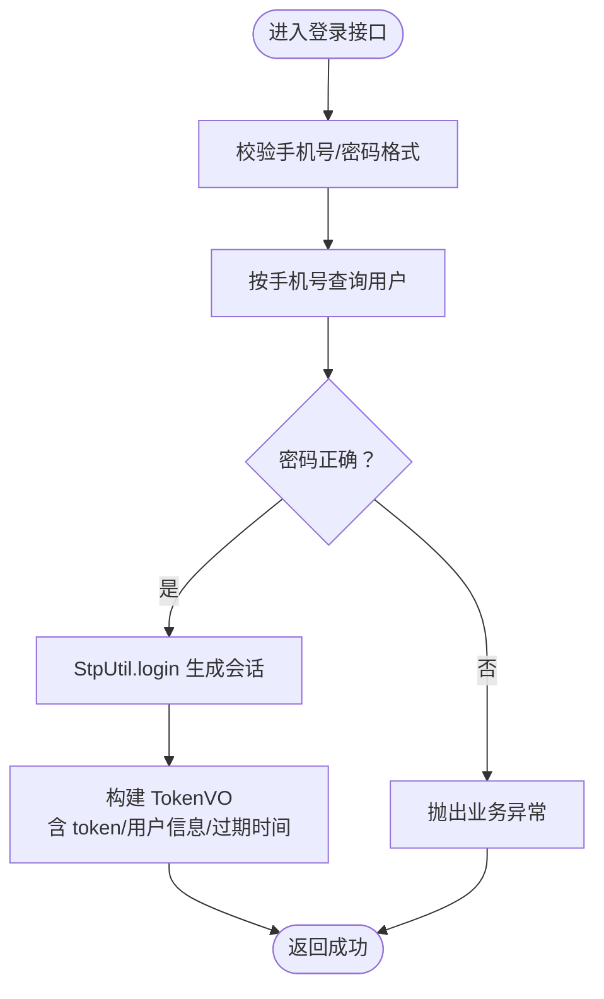
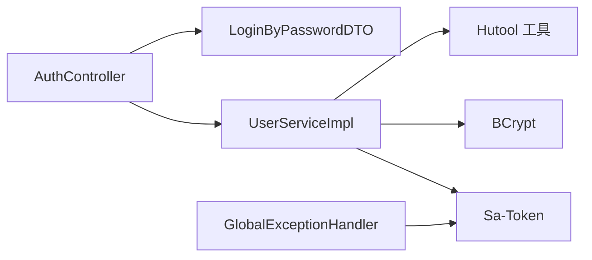

# 安全考虑

<cite>
**本文引用的文件**
- [ChuanBillServerApplication.java](file://chuan-bill-server/src/main/java/com/samoy/chuanbillserver/ChuanBillServerApplication.java)
- [application.yaml](file://chuan-bill-server/src/main/resources/application.yaml)
- [MyWebMvcConfig.java](file://chuan-bill-server/src/main/java/com/samoy/chuanbillserver/config/MyWebMvcConfig.java)
- [RedisConfig.java](file://chuan-bill-server/src/main/java/com/samoy/chuanbillserver/config/RedisConfig.java)
- [AuthController.java](file://chuan-bill-server/src/main/java/com/samoy/chuanbillserver/controller/AuthController.java)
- [UserServiceImpl.java](file://chuan-bill-server/src/main/java/com/samoy/chuanbillserver/service/impl/UserServiceImpl.java)
- [BusinessException.java](file://chuan-bill-server/src/main/java/com/samoy/chuanbillserver/expection/BusinessException.java)
- [GlobalExceptionHandler.java](file://chuan-bill-server/src/main/java/com/samoy/chuanbillserver/expection/GlobalExceptionHandler.java)
- [LoginByPasswordDTO.java](file://chuan-bill-server/src/main/java/com/samoy/chuanbillserver/dto/LoginByPasswordDTO.java)
</cite>

## 目录
1. [引言](#引言)
2. [项目结构](#项目结构)
3. [核心组件](#核心组件)
4. [架构总览](#架构总览)
5. [详细组件分析](#详细组件分析)
6. [依赖分析](#依赖分析)
7. [性能考虑](#性能考虑)
8. [故障排查指南](#故障排查指南)
9. [结论](#结论)
10. [附录](#附录)

## 引言
本文件面向“小川记账”项目的后端（Spring Boot）部分，聚焦于安全层面的设计与实现，涵盖认证授权（JWT/Token 与 Sa-Token）、权限控制策略、会话管理、数据安全、输入验证与输出处理、API 安全设计、安全配置最佳实践以及安全事件处理流程。文档以仓库中现有实现为依据，避免臆测，同时提供可操作的改进建议与风险提示。

## 项目结构
后端采用 Spring Boot + MyBatis-Plus 架构，核心安全相关模块集中在以下位置：
- 配置层：拦截器与 Sa-Token 集成、Redis 序列化配置
- 控制器层：认证相关接口（密码登录、手机验证码登录、发送验证码）
- 业务层：用户登录逻辑、Token 生成与会话管理
- 异常层：全局异常处理与未登录处理
- 配置文件：数据库、Redis、Sa-Token、OpenAPI 文档等

图表来源
- [ChuanBillServerApplication.java:1-15](file://chuan-bill-server/src/main/java/com/samoy/chuanbillserver/ChuanBillServerApplication.java#L1-L15)
- [MyWebMvcConfig.java:1-21](file://chuan-bill-server/src/main/java/com/samoy/chuanbillserver/config/MyWebMvcConfig.java#L1-L21)
- [RedisConfig.java:1-32](file://chuan-bill-server/src/main/java/com/samoy/chuanbillserver/config/RedisConfig.java#L1-L32)
- [application.yaml:1-51](file://chuan-bill-server/src/main/resources/application.yaml#L1-L51)
- [AuthController.java:1-66](file://chuan-bill-server/src/main/java/com/samoy/chuanbillserver/controller/AuthController.java#L1-L66)
- [UserServiceImpl.java:1-192](file://chuan-bill-server/src/main/java/com/samoy/chuanbillserver/service/impl/UserServiceImpl.java#L1-L192)
- [GlobalExceptionHandler.java:1-50](file://chuan-bill-server/src/main/java/com/samoy/chuanbillserver/expection/GlobalExceptionHandler.java#L1-L50)

章节来源
- [ChuanBillServerApplication.java:1-15](file://chuan-bill-server/src/main/java/com/samoy/chuanbillserver/ChuanBillServerApplication.java#L1-L15)
- [application.yaml:1-51](file://chuan-bill-server/src/main/resources/application.yaml#L1-L51)

## 核心组件
- 拦截器与权限控制：通过 Sa-Token 的拦截器对所有受保护路径进行统一登录校验，除认证与文档路径外全部拦截。
- 会话与 Token 管理：基于 Sa-Token 的 StpUtil 进行登录态维护，Token 名称、超时、风格等在配置文件中集中定义。
- 数据存储与序列化：RedisTemplate 使用 JSON 序列化，键使用字符串序列化；数据库连接与 MyBatis-Plus 全局配置在 YAML 中定义。
- 认证接口：提供密码登录、验证码登录、发送验证码三个接口，均使用 DTO 参数校验。
- 异常处理：统一捕获未登录、业务异常与系统异常，返回标准化结果。

章节来源
- [MyWebMvcConfig.java:1-21](file://chuan-bill-server/src/main/java/com/samoy/chuanbillserver/config/MyWebMvcConfig.java#L1-L21)
- [application.yaml:23-31](file://chuan-bill-server/src/main/resources/application.yaml#L23-L31)
- [RedisConfig.java:1-32](file://chuan-bill-server/src/main/java/com/samoy/chuanbillserver/config/RedisConfig.java#L1-L32)
- [AuthController.java:1-66](file://chuan-bill-server/src/main/java/com/samoy/chuanbillserver/controller/AuthController.java#L1-L66)
- [UserServiceImpl.java:174-190](file://chuan-bill-server/src/main/java/com/samoy/chuanbillserver/service/impl/UserServiceImpl.java#L174-L190)
- [GlobalExceptionHandler.java:1-50](file://chuan-bill-server/src/main/java/com/samoy/chuanbillserver/expection/GlobalExceptionHandler.java#L1-L50)

## 架构总览
下图展示从客户端到服务端的关键交互与安全控制点：

图表来源
- [MyWebMvcConfig.java:10-19](file://chuan-bill-server/src/main/java/com/samoy/chuanbillserver/config/MyWebMvcConfig.java#L10-L19)
- [AuthController.java:35-64](file://chuan-bill-server/src/main/java/com/samoy/chuanbillserver/controller/AuthController.java#L35-L64)
- [UserServiceImpl.java:174-190](file://chuan-bill-server/src/main/java/com/samoy/chuanbillserver/service/impl/UserServiceImpl.java#L174-L190)
- [GlobalExceptionHandler.java:20-24](file://chuan-bill-server/src/main/java/com/samoy/chuanbillserver/expection/GlobalExceptionHandler.java#L20-L24)

## 详细组件分析

### 认证授权与会话管理
- 登录流程
  - 密码登录：校验手机号与密码格式，查询用户并验证 BCrypt 密码，成功后调用 StpUtil.login 并生成 TokenVO。
  - 验证码登录：校验验证码有效性，若用户不存在则自动创建，随后生成 Token。
  - Token 生成：记录最近登录时间，调用 StpUtil.login 并获取 token 值，封装 TokenVO 返回。
- 权限控制
  - 全局拦截器对所有路径进行登录校验，排除认证、OpenAPI 文档路径。
  - 未登录访问受保护资源时，全局异常处理器返回未授权错误。
- 会话与 Token
  - Token 名称、超时、活跃超时、并发会话等在 application.yaml 中集中配置。
  - Token 风格为随机 64 字符，便于抗预测与碰撞。

图表来源
- [AuthController.java:35-51](file://chuan-bill-server/src/main/java/com/samoy/chuanbillserver/controller/AuthController.java#L35-L51)
- [UserServiceImpl.java:40-61](file://chuan-bill-server/src/main/java/com/samoy/chuanbillserver/service/impl/UserServiceImpl.java#L40-L61)
- [application.yaml:23-31](file://chuan-bill-server/src/main/resources/application.yaml#L23-L31)

章节来源
- [AuthController.java:1-66](file://chuan-bill-server/src/main/java/com/samoy/chuanbillserver/controller/AuthController.java#L1-L66)
- [UserServiceImpl.java:40-83](file://chuan-bill-server/src/main/java/com/samoy/chuanbillserver/service/impl/UserServiceImpl.java#L40-L83)
- [MyWebMvcConfig.java:10-19](file://chuan-bill-server/src/main/java/com/samoy/chuanbillserver/config/MyWebMvcConfig.java#L10-L19)
- [GlobalExceptionHandler.java:20-24](file://chuan-bill-server/src/main/java/com/samoy/chuanbillserver/expection/GlobalExceptionHandler.java#L20-L24)
- [application.yaml:23-31](file://chuan-bill-server/src/main/resources/application.yaml#L23-L31)

### 输入验证与输出处理
- 输入验证
  - DTO 层使用 Jakarta Validation 注解，如非空、正则表达式、长度约束等，确保入参合法性。
  - 示例：手机号格式校验、密码长度范围校验。
- 输出处理
  - 用户资料脱敏：手机号中间部分隐藏，避免敏感信息泄露。
  - 统一异常处理：业务异常与系统异常均返回标准化错误码与消息。

章节来源
- [LoginByPasswordDTO.java:1-19](file://chuan-bill-server/src/main/java/com/samoy/chuanbillserver/dto/LoginByPasswordDTO.java#L1-L19)
- [UserServiceImpl.java:154-156](file://chuan-bill-server/src/main/java/com/samoy/chuanbillserver/service/impl/UserServiceImpl.java#L154-L156)
- [BusinessException.java:1-36](file://chuan-bill-server/src/main/java/com/samoy/chuanbillserver/expection/BusinessException.java#L1-L36)
- [GlobalExceptionHandler.java:32-48](file://chuan-bill-server/src/main/java/com/samoy/chuanbillserver/expection/GlobalExceptionHandler.java#L32-L48)

### API 安全设计
- 接口鉴权
  - 全局拦截器强制要求登录态，认证接口与 OpenAPI 文档路径除外。
- 频率限制
  - 当前未见显式的限流实现，建议在网关或拦截器层引入限流策略（如基于 IP 或用户维度）。
- IP 白名单
  - 当前未见显式的 IP 白名单配置，建议在网关或过滤器层实现。
- 签名验证
  - 当前未见显式的签名验证机制，建议在高风险接口引入签名校验（如 HMAC-SHA256）。

章节来源
- [MyWebMvcConfig.java:10-19](file://chuan-bill-server/src/main/java/com/samoy/chuanbillserver/config/MyWebMvcConfig.java#L10-L19)
- [application.yaml:41-47](file://chuan-bill-server/src/main/resources/application.yaml#L41-L47)

### 数据安全保护
- 数据库连接
  - JDBC URL 中关闭了 SSL（useSSL=false），在生产环境应启用 TLS 并配置证书校验。
- Redis 连接
  - Redis 未配置密码与网络隔离，建议开启密码认证与防火墙限制。
- 序列化与传输
  - Redis 使用 JSON 序列化，注意敏感字段的序列化策略；对外接口建议仅暴露必要字段。
- 敏感信息处理
  - 用户手机号在输出时进行脱敏；密码使用 BCrypt 存储，符合安全要求。

章节来源
- [application.yaml:4-8](file://chuan-bill-server/src/main/resources/application.yaml#L4-L8)
- [RedisConfig.java:14-30](file://chuan-bill-server/src/main/java/com/samoy/chuanbillserver/config/RedisConfig.java#L14-L30)
- [UserServiceImpl.java:154-156](file://chuan-bill-server/src/main/java/com/samoy/chuanbillserver/service/impl/UserServiceImpl.java#L154-L156)

### 传输安全与隐私保护
- HTTPS
  - 当前未见显式的 HTTPS 强制与重定向配置，建议在网关或服务器层启用 HTTPS 并强制跳转。
- CORS
  - 当前未见显式的跨域配置，建议在网关或控制器层配置允许的源、方法与头，并最小化暴露。
- 安全头
  - 当前未见显式的安全响应头配置，建议添加典型安全头（如 X-Content-Type-Options、X-Frame-Options、Content-Security-Policy 等）。

章节来源
- [application.yaml:1-51](file://chuan-bill-server/src/main/resources/application.yaml#L1-L51)

## 依赖分析
- 组件耦合
  - 控制器依赖服务层；服务层依赖 Sa-Token 与工具库；全局异常处理器统一处理未登录与业务异常。
- 外部依赖
  - Sa-Token 提供会话与权限控制；Hutool 提供密码校验与手机号工具；MyBatis-Plus 提供 ORM 能力；OpenAPI/Swagger 提供接口文档。
- 潜在风险
  - 数据库连接未启用 SSL；Redis 未配置密码；未见限流与签名机制；未见 HTTPS 强制与安全头配置。

图表来源
- [AuthController.java:1-66](file://chuan-bill-server/src/main/java/com/samoy/chuanbillserver/controller/AuthController.java#L1-L66)
- [UserServiceImpl.java:1-192](file://chuan-bill-server/src/main/java/com/samoy/chuanbillserver/service/impl/UserServiceImpl.java#L1-L192)
- [LoginByPasswordDTO.java:1-19](file://chuan-bill-server/src/main/java/com/samoy/chuanbillserver/dto/LoginByPasswordDTO.java#L1-L19)
- [GlobalExceptionHandler.java:1-50](file://chuan-bill-server/src/main/java/com/samoy/chuanbillserver/expection/GlobalExceptionHandler.java#L1-L50)

章节来源
- [UserServiceImpl.java:1-192](file://chuan-bill-server/src/main/java/com/samoy/chuanbillserver/service/impl/UserServiceImpl.java#L1-L192)
- [GlobalExceptionHandler.java:1-50](file://chuan-bill-server/src/main/java/com/samoy/chuanbillserver/expection/GlobalExceptionHandler.java#L1-L50)

## 性能考虑
- Token 与会话
  - Sa-Token 的超时与活跃超时需结合业务场景调整，避免频繁登录与内存占用过高。
- Redis
  - 合理设置连接池大小与超时，避免阻塞；对热数据进行缓存优化。
- 接口
  - 对高频接口增加必要的缓存与限流策略，降低数据库压力。

## 故障排查指南
- 未登录访问
  - 现象：返回未授权错误。
  - 排查：确认是否携带正确的 Token，Token 是否过期；检查拦截器排除规则。
- 业务异常
  - 现象：返回业务错误码与消息。
  - 排查：根据错误码定位具体问题（如密码错误、验证码无效、用户不存在等）。
- 系统异常
  - 现象：返回系统异常提示。
  - 排查：查看日志，定位异常堆栈与上下文。

章节来源
- [GlobalExceptionHandler.java:20-48](file://chuan-bill-server/src/main/java/com/samoy/chuanbillserver/expection/GlobalExceptionHandler.java#L20-L48)
- [BusinessException.java:1-36](file://chuan-bill-server/src/main/java/com/samoy/chuanbillserver/expection/BusinessException.java#L1-L36)

## 结论
当前实现基于 Sa-Token 实现了统一的登录态与权限拦截，配合 DTO 校验与输出脱敏，满足基础安全需求。建议在生产环境中补齐 HTTPS 强制、安全头、CORS 限制、Redis 密码与网络隔离、数据库 SSL、限流与签名机制等，形成完整的纵深防御体系。

## 附录
- 安全配置清单（建议）
  - 启用 HTTPS 并强制跳转；配置安全响应头；限制 CORS 源与方法；为 Redis 配置密码与内网访问；数据库连接启用 SSL；为高风险接口引入限流与签名验证。
- 日志与审计
  - 建议记录登录、登出、敏感操作等关键事件，保留审计轨迹以便追溯。